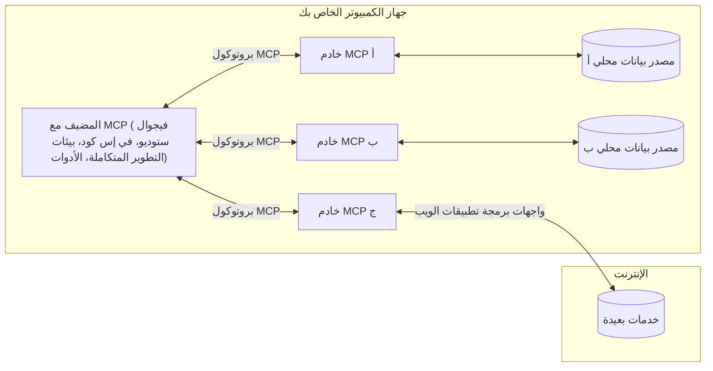

# مفاهيم جوهرية في MCP: إتقان بروتوكول سياق النموذج لتكامل الذكاء الاصطناعي

[](https://youtu.be/earDzWGtE84)

_(انقر فوق الصورة أعلاه لمشاهدة فيديو هذا الدرس)_

يُعد [بروتوكول سياق النموذج (MCP)](https://github.com/modelcontextprotocol) إطارًا قويًا وموحدًا يحسن الاتصالات بين نماذج اللغة الكبيرة (LLMs) والأدوات والتطبيقات ومصادر البيانات الخارجية. 
سترشدك هذه الدليل عبر المفاهيم الأساسية لـ MCP. ستتعلم عن بنية العميل-الخادم الخاصة به، والمكونات الأساسية، وآليات الاتصال، وأفضل ممارسات التنفيذ.

- **موافقة صريحة من المستخدم**: تتطلب جميع عمليات الوصول إلى البيانات والتنفيذ موافقة صريحة من المستخدم قبل التنفيذ. يجب أن يفهم المستخدمون بوضوح البيانات التي سيتم الوصول إليها والإجراءات التي ستتم، مع التحكم الدقيق في الأذونات والتفويضات.

- **حماية خصوصية البيانات**: لا تعرض بيانات المستخدم إلا بموافقة صريحة ويجب حمايتها من خلال ضوابط وصول قوية طوال دورة التفاعل بأكملها. يجب على التطبيقات منع نقل البيانات غير المصرح به والحفاظ على حدود صارمة للخصوصية.

- **أمان تشغيل الأدوات**: يتطلب كل استدعاء للأداة موافقة صريحة من المستخدم مع فهم واضح لوظيفة الأداة، ومعطياتها، والتأثير المحتمل. يجب أن تمنع حدود الأمان القوية تنفيذ الأدوات غير المقصود أو غير الآمن أو الخبيث.

- **أمان طبقة النقل**: يجب أن تستخدم جميع قنوات الاتصال تقنيات تشفير ومصادقة مناسبة. يجب أن تنفذ الاتصالات البعيدة بروتوكولات نقل آمنة وإدارة بيانات اعتماد سليمة.

#### إرشادات التنفيذ:

- **إدارة الأذونات**: تنفيذ أنظمة أذونات دقيقة تسمح للمستخدمين بالتحكم في الخوادم، الأدوات، والموارد المتاحة  
- **المصادقة والتفويض**: استخدام طرق مصادقة آمنة (OAuth، مفاتيح API) مع إدارة مناسبة للرموز وانتهائها  
- **التحقق من الإدخال**: التحقق من جميع المعلمات ومدخلات البيانات وفقًا للمخططات المعرفة لمنع هجمات الحقن  
- **تسجيل المراجعة**: الحفاظ على سجلات شاملة لجميع العمليات للمراقبة الأمنية والامتثال

## نظرة عامة

يستعرض هذا الدرس البنية الأساسية والمكونات التي تشكل نظام بروتوكول سياق النموذج (MCP). ستتعرف على بنية العميل-الخادم، المكونات الرئيسية، وآليات الاتصال التي تدعم تفاعلات MCP.

## الأهداف التعليمية الرئيسية

بنهاية هذا الدرس، ستتمكن من:

- فهم بنية العميل-الخادم لـ MCP.
- تحديد أدوار ومسؤوليات المضيفين، العملاء، والخوادم.
- تحليل الميزات الأساسية التي تجعل MCP طبقة تكامل مرنة.
- تعلم كيفية تدفق المعلومات داخل نظام MCP.
- اكتساب رؤى عملية من خلال أمثلة كود في .NET، جافا، بايثون، وجافا سكريبت.

## بنية MCP: نظرة أعمق

يتم بناء نظام MCP على نموذج العميل-الخادم. تتيح هذه البنية النمطية لتطبيقات الذكاء الاصطناعي التفاعل بكفاءة مع الأدوات، قواعد البيانات، واجهات برمجة التطبيقات، والموارد السياقية. دعونا نوضح هذه البنية إلى مكوناتها الأساسية.

في جوهره، يتبع MCP بنية عميل-خادم حيث يمكن لتطبيق المضيف الاتصال بعدة خوادم:


- **مضيفو MCP**: برامج مثل VSCode، Claude Desktop، بيئات التطوير المتكاملة، أو أدوات الذكاء الاصطناعي التي ترغب في الوصول إلى البيانات عبر MCP  
- **عملاء MCP**: عملاء البروتوكول الذين يحافظون على اتصالات 1:1 مع الخوادم  
- **خوادم MCP**: برامج خفيفة الوزن تعرض كل منها قدرات محددة من خلال بروتوكول سياق النموذج الموحد  
- **مصادر البيانات المحلية**: ملفات الحاسوب، قواعد البيانات، والخدمات التي يمكن لخوادم MCP الوصول إليها بأمان  
- **الخدمات البعيدة**: أنظمة خارجية متاحة عبر الإنترنت يمكن لخوادم MCP الاتصال بها عبر واجهات برمجة التطبيقات

بروتوكول MCP هو معيار متطور يستخدم ترقيم إصدار يعتمد على التاريخ (بتنسيق YYYY-MM-DD). الإصدار الحالي للبروتوكول هو **2025-11-25**. يمكنك رؤية آخر التحديثات على [مواصفات البروتوكول](https://modelcontextprotocol.io/specification/2025-11-25/)

### 1. المضيفون

في بروتوكول سياق النموذج (MCP)، يُعتبر **المضيفون** تطبيقات الذكاء الاصطناعي التي تعمل كواجهة رئيسية يتفاعل من خلالها المستخدمون مع البروتوكول. يقوم المضيفون بتنسيق وإدارة الاتصالات مع عدة خوادم MCP من خلال إنشاء عملاء MCP مخصصين لكل اتصال بخادم. من أمثلة المضيفين:

- **تطبيقات الذكاء الاصطناعي**: Claude Desktop، Visual Studio Code، Claude Code  
- **بيئات التطوير**: بيئات التطوير المتكاملة ومحررات الكود مع تكامل MCP  
- **التطبيقات المخصصة**: وكلاء وأدوات ذكاء اصطناعي مصممة خصيصًا  

**المضيفون** هم تطبيقات تنسق تفاعلات نماذج الذكاء الاصطناعي. فهم:

- **تنظيم نماذج الذكاء الاصطناعي**: تشغيل أو التفاعل مع LLMs لتوليد الاستجابات وتنسيق سير العمل  
- **إدارة اتصالات العملاء**: إنشاء والحفاظ على عميل MCP واحد لكل اتصال بخادم MCP  
- **التحكم في واجهة المستخدم**: معالجة تدفق المحادثة، تفاعلات المستخدم، وعرض الاستجابة  
- **فرض الأمان**: التحكم في الأذونات، القيود الأمنية، والمصادقة  
- **التعامل مع موافقة المستخدم**: إدارة موافقة المستخدم على مشاركة البيانات وتنفيذ الأدوات

### 2. العملاء

**العملاء** هم مكونات أساسية تحافظ على اتصالات مخصصة بنمط واحد لواحد بين المضيفين وخوادم MCP. يتم إنشاء كل عميل MCP بواسطة المضيف للاتصال بخادم MCP محدد، مما يضمن قنوات اتصال منظمة وآمنة. يمكّن وجود عدة عملاء المضيفين من الاتصال بعدة خوادم في آن واحد.

**العملاء** هم مكونات الربط داخل تطبيق المضيف. فهم:

- **الاتصال بالبروتوكول**: إرسال طلبات JSON-RPC 2.0 إلى الخوادم مع المطالبات والتوجيهات  
- **تفاوض القدرات**: تفاوض الميزات المدعومة وإصدارات البروتوكول مع الخوادم أثناء التهيئة  
- **تشغيل الأدوات**: إدارة طلبات تشغيل الأدوات من النماذج ومعالجة الردود  
- **التحديثات اللحظية**: التعامل مع الإشعارات والتحديثات اللحظية من الخوادم  
- **معالجة الردود**: معالجة وتنسيق ردود الخادم للعرض للمستخدمين

### 3. الخوادم

**الخوادم** هي برامج توفر السياق والأدوات والقدرات لعملاء MCP. يمكن أن تعمل محليًا (على نفس جهاز المضيف) أو عن بُعد (على منصات خارجية)، وهي مسؤولة عن معالجة طلبات العملاء وتوفير ردود منظمة. تعرض الخوادم وظائف محددة من خلال بروتوكول سياق النموذج الموحد.

**الخوادم** هي خدمات توفر السياق والقدرات. فهم:

- **تسجيل المميزات**: تسجيل وعرض المفاهيم الأولية المتاحة (الموارد، المطالبات، الأدوات) للعملاء  
- **معالجة الطلبات**: استلام وتنفيذ استدعاءات الأدوات، طلبات الموارد، وطلبات المطالبات من العملاء  
- **توفير السياق**: تقديم معلومات سياقية وبيانات لتعزيز استجابات النموذج  
- **إدارة الحالة**: الحفاظ على حالة الجلسة ومعالجة التفاعلات المعتمدة على الحالة عند الحاجة  
- **الإشعارات اللحظية**: إرسال إشعارات عن تغييرات القدرات والتحديثات إلى العملاء المتصلين  

يمكن لأي شخص تطوير الخوادم لتمديد قدرات النماذج بوظائف متخصصة، وتدعم سيناريوهات النشر المحلية والبعيدة.

### 4. المفاهيم الأولية للخادم

توفر خوادم بروتوكول سياق النموذج (MCP) ثلاث **مفاهيم أولية** أساسية تُحدد اللبنات الأساسية للتفاعلات الغنية بين العملاء، المضيفين، ونماذج اللغة. تحدد هذه المفاهيم الأولية أنواع المعلومات السياقية والإجراءات المتاحة عبر البروتوكول.

يمكن لخوادم MCP عرض أي مجموعة من المفاهيم الأولية الثلاثة التالية:

#### الموارد

**الموارد** هي مصادر بيانات توفر معلومات سياقية لتطبيقات الذكاء الاصطناعي. تمثل المحتوى الثابت أو الديناميكي الذي يمكن أن يعزز فهم النموذج واتخاذ القرار:

- **بيانات سياقية**: معلومات منظمة وسياق لاستهلاك نموذج الذكاء الاصطناعي  
- **قواعد المعرفة**: مستودعات الوثائق، المقالات، الكتيبات، وأوراق البحث  
- **مصادر بيانات محلية**: الملفات، قواعد البيانات، ومعلومات النظام المحلية  
- **البيانات الخارجية**: ردود API، خدمات الويب، وبيانات الأنظمة البعيدة  
- **المحتوى الديناميكي**: بيانات لحظية تتحدث استنادًا إلى الظروف الخارجية

تُعرف الموارد بواسطة معرفات URI وتدعم الاكتشاف من خلال طرائق `resources/list` والاسترجاع عبر `resources/read`:

```text
file://documents/project-spec.md
database://production/users/schema
api://weather/current
```

#### المطالبات

**المطالبات** هي قوالب قابلة لإعادة الاستخدام تساعد في هيكلة التفاعلات مع نماذج اللغة. توفر أنماط تفاعل موحدة وسير عمل قالبية:

- **التفاعلات المعتمدة على القوالب**: رسائل مهيكلة مسبقًا وبدايات محادثة  
- **قوالب سير العمل**: تسلسلات موحدة للمهام والتفاعلات الشائعة  
- **أمثلة قليلة اللقطات**: قوالب تعتمد على الأمثلة لإعطاء التعليمات للنموذج  
- **مطالبات النظام**: مطالبات أساسية تحدد سلوك النموذج وسياقه  
- **قوالب ديناميكية**: مطالبات معلمة تتكيف مع سياقات محددة

تدعم المطالبات استبدال المتغيرات ويمكن اكتشافها عبر `prompts/list` واسترجاعها بـ `prompts/get`:

```markdown
Generate a {{task_type}} for {{product}} targeting {{audience}} with the following requirements: {{requirements}}
```

#### الأدوات

**الأدوات** هي دوال قابلة للتنفيذ يمكن لنماذج الذكاء الاصطناعي استدعاؤها لأداء إجراءات محددة. تمثل "الأفعال" في نظام MCP، وتمكن النماذج من التفاعل مع الأنظمة الخارجية:

- **دوال قابلة للتنفيذ**: عمليات محددة يمكن للنماذج استدعاؤها بمعطيات معينة  
- **تكامل النظام الخارجي**: استدعاءات API، استعلامات قواعد البيانات، عمليات الملفات، الحسابات  
- **هوية فريدة**: لكل أداة اسم ووصف ومخطط معطيات محدد  
- **مدخلات ومخرجات منظمة**: تقبل الأدوات معطيات مُحققة وتُرجع استجابات منظمة ومحددة النوع  
- **قدرات الإجراءات**: تمكّن النماذج من تنفيذ إجراءات في العالم الحقيقي واسترجاع بيانات حية

تُعرف الأدوات باستخدام JSON Schema للتحقق من المعطيات ويتم اكتشافها عبر `tools/list` وتشغيلها بواسطة `tools/call`. يمكن للأدوات أيضًا تضمين **أيقونات** كبيانات وصفية إضافية لتحسين العرض في واجهة المستخدم.

**تعليقات الأدوات**: تدعم الأدوات تعليقات سلوكية (مثل `readOnlyHint`، `destructiveHint`) تصف ما إذا كانت الأداة للقراءة فقط أو مدمرة، مما يساعد العملاء على اتخاذ قرارات مستنيرة بشأن تنفيذ الأدوات.

مثال تعريف أداة:

```typescript
server.tool(
  "search_products", 
  {
    query: z.string().describe("Search query for products"),
    category: z.string().optional().describe("Product category filter"),
    max_results: z.number().default(10).describe("Maximum results to return")
  }, 
  async (params) => {
    // تنفيذ البحث وإرجاع النتائج بشكل منظم
    return await productService.search(params);
  }
);
```

## المفاهيم الأولية للعميل

في بروتوكول سياق النموذج (MCP)، يمكن **للعملاء** عرض مفاهيم أولية تمكّن الخوادم من طلب قدرات إضافية من تطبيق المضيف. تسمح هذه المفاهيم الأولية من جانب العميل بتنفيذات خادم أكثر تفاعلية وغنية يمكنها الوصول إلى قدرات نموذج الذكاء الاصطناعي وتفاعلات المستخدم.

### المعاينة

تُتيح **المعاينة** للخوادم طلب استكمالات نموذج اللغة من تطبيق الذكاء الاصطناعي الخاص بالعميل. تمكن هذه المفاهيم الخوادم من الوصول إلى قدرات LLM بدون تضمين تبعيات النموذج الخاصة بهم:

- **الوصول المستقل عن النموذج**: يمكن للخوادم طلب الاستكمالات دون تضمين SDK لنموذج LLM أو إدارة الوصول إلى النموذج  
- **ذكاء اصطناعي مبادر من الخادم**: تمكّن الخوادم من توليد المحتوى بشكل مستقل باستخدام نموذج الذكاء الاصطناعي الخاص بالعميل  
- **تفاعلات LLM متكررة**: تدعم سيناريوهات معقدة حيث تحتاج الخوادم إلى مساعدة الذكاء الاصطناعي للمعالجة  
- **توليد محتوى ديناميكي**: تسمح للخوادم بإنشاء استجابات سياقية باستخدام نموذج المضيف  
- **دعم استدعاء الأدوات**: يمكن للخوادم تضمين معلمات `tools` و`toolChoice` لتمكين نموذج العميل من استدعاء الأدوات أثناء المعاينة

تبدأ المعاينة عبر طريقة `sampling/complete`، حيث ترسل الخوادم طلبات الاستكمال إلى العملاء.

### الجذور

توفر **الجذور** طريقة موحدة للعملاء للكشف عن حدود نظام الملفات للخوادم، مما يساعد الخوادم على فهم المجلدات والملفات التي يمكنها الوصول إليها:

- **حدود نظام الملفات**: تعريف حدود تشغيل الخوادم ضمن نظام الملفات  
- **التحكم في الوصول**: مساعدة الخوادم على فهم المجلدات والملفات التي لديها صلاحية الوصول إليها  
- **تحديثات ديناميكية**: يمكن للعملاء إشعار الخوادم عند تغير قائمة الجذور  
- **تحديد معرّف URI**: تستخدم الجذور معرفات `file://` لتحديد المجلدات والملفات المتاحة

تُكتشف الجذور عبر طريقة `roots/list`، مع إرسال العملاء إشعارات `notifications/roots/list_changed` عند تغير الجذور.

### الاستيضاح

تمكّن **الاستيضاح** الخوادم من طلب معلومات إضافية أو تأكيدات من المستخدمين عبر واجهة العميل:

- **طلبات إدخال المستخدم**: يمكن للخوادم طلب معلومات إضافية عند الحاجة لتنفيذ الأدوات  
- **مربعات الحوار للتأكيد**: طلب موافقة المستخدم على عمليات حساسة أو ذات تأثير  
- **أعمال تفاعلية**: تمكين الخوادم من إنشاء تفاعلات مستخدم خطوة بخطوة  
- **جمع المعطيات الديناميكي**: جمع المعلمات المفقودة أو الاختيارية أثناء تنفيذ الأدوات

تتم طلبات الاستيضاح باستخدام طريقة `elicitation/request` لجمع مدخلات المستخدم عبر واجهة العميل.

**وضع URL للاستيضاح**: يمكن للخوادم أيضًا طلب تفاعلات مستخدم معتمدة على URL، مما يسمح للخوادم بتوجيه المستخدمين إلى صفحات ويب خارجية للمصادقة، التأكيد، أو إدخال البيانات.

### التسجيل

يسمح **التسجيل** للخوادم بإرسال رسائل سجل منظمة إلى العملاء لأغراض تصحيح الأخطاء، المراقبة، ورؤية العمليات:

- **دعم التصحيح**: تمكين الخوادم من توفير سجلات تنفيذ مفصلة لعزل الأخطاء  
- **مراقبة العمليات**: إرسال تحديثات الحالة ومقاييس الأداء إلى العملاء  
- **الإبلاغ عن الأخطاء**: توفير سياق تفصيلي للأخطاء ومعلومات تشخيصية  
- **مسارات التدقيق**: إنشاء سجلات شاملة لعمليات الخادم وقراراته

يتم إرسال رسائل السجل إلى العملاء لتوفير الشفافية في عمليات الخادم وتسهيل التصحيح.

## تدفق المعلومات في MCP

يحدد بروتوكول سياق النموذج (MCP) تدفقًا منظمًا للمعلومات بين المضيفين والعملاء والخوادم والنماذج. يساعد فهم هذا التدفق على توضيح كيفية معالجة طلبات المستخدمين وكيفية دمج الأدوات والبيانات الخارجية في استجابات النماذج.
- **المضيف يبدأ الاتصال**  
  يقوم تطبيق المضيف (مثل بيئة تطوير متكاملة أو واجهة الدردشة) بإقامة اتصال بخادم MCP، عادة عبر STDIO أو WebSocket أو أي وسيلة نقل مدعومة أخرى.

- **التفاوض على القدرات**  
  يتبادل العميل (المدمج في المضيف) والخادم معلومات حول الميزات، الأدوات، الموارد، وإصدارات البروتوكول المدعومة لديهما. هذا يضمن فهم كلا الطرفين للقدرات المتاحة للجلسة.

- **طلب المستخدم**  
  يتفاعل المستخدم مع المضيف (مثلاً يدخل تعليمات أو أمر). يقوم المضيف بجمع هذا الإدخال وتمريره إلى العميل لمعالجته.

- **استخدام الموارد أو الأدوات**  
  - قد يطلب العميل سياقًا إضافيًا أو موارد من الخادم (مثل ملفات، سجلات قاعدة بيانات، أو مقالات قاعدة المعرفة) لتعزيز فهم النموذج.  
  - إذا قرر النموذج أن هناك حاجة لأداة (مثلاً لجلب بيانات، إجراء حساب، أو استدعاء API)، يرسل العميل طلب استدعاء الأداة إلى الخادم، محددًا اسم الأداة والمعاملات.

- **تنفيذ الخادم**  
  يستلم الخادم طلب المورد أو الأداة، ينفذ العمليات اللازمة (مثل تشغيل دالة، استعلام قاعدة بيانات، أو استرجاع ملف)، ويُرجع النتائج إلى العميل في شكل منظم.

- **توليد الاستجابة**  
  يدمج العميل ردود الخادم (بيانات الموارد، مخرجات الأدوات، إلخ) في تفاعل النموذج الجاري. يستخدم النموذج هذه المعلومات لتوليد استجابة شاملة وذات صلة سياقية.

- **عرض النتيجة**  
  يستلم المضيف المخرجات النهائية من العميل ويعرضها على المستخدم، غالبًا بما يشمل النص الذي أنشأه النموذج وأي نتائج من تنفيذ الأدوات أو البحث في الموارد.

يمكّن هذا التدفق MCP من دعم تطبيقات ذكاء اصطناعي متقدمة، تفاعلية وواعية للسياق من خلال توصيل النماذج بسلاسة مع الأدوات والمصادر الخارجية للبيانات.

## بنية البروتوكول ومستوياته

يتألف MCP من طبقتين معماريتين متميزتين تعملان معًا لتوفير إطار اتصال كامل:

### طبقة البيانات

تنفذ **طبقة البيانات** بروتوكول MCP الأساسي باستخدام **JSON-RPC 2.0** كأساس لها. تعرف هذه الطبقة بنية الرسائل، دلالاتها، وأنماط التفاعل:

#### المكونات الأساسية:

- **بروتوكول JSON-RPC 2.0**: كل الاتصالات تستخدم تنسيق رسائل JSON-RPC 2.0 الموحد للمكالمات، الردود، والإشعارات  
- **إدارة دورة الحياة**: تتولى تهيئة الاتصال، التفاوض على القدرات، وإنهاء الجلسات بين العملاء والخوادم  
- **الأدوات الخادمة الأساسية**: تمكّن الخوادم من توفير الوظائف الأساسية عبر الأدوات، الموارد، والمحركات  
- **الأدوات العميلة الأساسية**: تمكّن الخوادم من طلب عينات من نماذج اللغة الكبيرة، تحفيز مدخلات المستخدم، وإرسال رسائل السجل  
- **الإشعارات في الوقت الفعلي**: تدعم الإشعارات غير المتزامنة لتحديثات ديناميكية بدون استعلام دوري

#### الميزات الرئيسية:

- **التفاوض على إصدار البروتوكول**: يستخدم إصدارًا قائمًا على التاريخ (YYYY-MM-DD) لضمان التوافق  
- **اكتشاف القدرات**: يتبادل العملاء والخوادم معلومات الميزات المدعومة أثناء التهيئة  
- **الجلسات الحالة**: يحتفظ بحالة الاتصال عبر تفاعلات متعددة لاستمرار السياق  

### طبقة النقل

تدير **طبقة النقل** قنوات الاتصال، تأطير الرسائل، والمصادقة بين مشاركي MCP:

#### آليات النقل المدعومة:

1. **نقل STDIO**:  
   - يستخدم تدفقات الإدخال/الإخراج القياسية للاتصال المباشر بين العمليات  
   - مثالي للعمليات المحلية على نفس الجهاز بدون حمل شبكة  
   - يُستخدم شائعًا في تنفيذات خادم MCP المحلية

2. **نقل HTTP القابل للبث**:  
   - يستخدم HTTP POST لإرسال رسائل العميل إلى الخادم  
   - اختياريًا يستخدم Server-Sent Events (SSE) للبث من الخادم إلى العميل  
   - يمكن من الاتصال بخوادم بعيدة عبر الشبكات  
   - يدعم المصادقة التقليدية عبر HTTP (رموز الوصول، مفاتيح API، رؤوس مخصصة)  
   - توصي MCP باستخدام OAuth للمصادقة الآمنة المبنية على الرموز

#### تجريد النقل:

تجرد طبقة النقل تفاصيل الاتصال عن طبقة البيانات، مما يمكن من استخدام نفس تنسيق رسائل JSON-RPC 2.0 عبر جميع آليات النقل. يسمح هذا التجريد بالتبديل السلس بين الخوادم المحلية والبعيدة.

### اعتبارات الأمان

يجب أن تلتزم تطبيقات MCP بعدد من المبادئ الأمنية الحيوية لضمان التفاعلات الآمنة والموثوقة والمحمية عبر جميع عمليات البروتوكول:

- **موافقة المستخدم والسيطرة**: يجب أن يمنح المستخدمون موافقة صريحة قبل الوصول إلى أي بيانات أو تنفيذ أي عمليات. ينبغي أن تكون لديهم سيطرة واضحة على البيانات التي يتم مشاركتها والإجراءات المصرح بها، مدعومة بواجهات مستخدم بديهية للمراجعة والموافقة.

- **خصوصية البيانات**: يجب الكشف عن بيانات المستخدم فقط بموافقة صريحة ويجب حمايتها بواسطة ضوابط وصول مناسبة. يجب أن تحمي تطبيقات MCP من الإرسال غير المصرح به للبيانات وتضمن المحافظة على الخصوصية على طول جميع التفاعلات.

- **أمان الأدوات**: قبل استدعاء أي أداة، يتطلب الأمر موافقة صريحة من المستخدم. يجب أن يكون لدى المستخدمين فهم واضح لوظائف كل أداة، ويجب فرض حدود أمان قوية لمنع تشغيل الأدوات غير المقصود أو غير الآمن.

من خلال اتباع هذه المبادئ الأمنية، يضمن MCP ثقة المستخدمين، حماية الخصوصية، والسلامة عبر جميع تفاعلات البروتوكول مع تمكين تكاملات ذكاء اصطناعي قوية.

## أمثلة على الشيفرة: المكونات الرئيسية

فيما يلي أمثلة شيفرة بعدة لغات برمجة شائعة توضح كيفية تنفيذ مكونات خادم MCP وأدواته الرئيسية.

### مثال .NET: إنشاء خادم MCP بسيط مع أدوات

هنا مثال عملي في .NET يظهر كيفية تنفيذ خادم MCP بسيط مع أدوات مخصصة. يعرض هذا المثال كيفية تعريف الأدوات وتسجيلها، ومعالجة الطلبات، وربط الخادم باستخدام بروتوكول سياق النموذج.

```csharp
using System;
using System.Threading.Tasks;
using ModelContextProtocol.Server;
using ModelContextProtocol.Server.Transport;
using ModelContextProtocol.Server.Tools;

public class WeatherServer
{
    public static async Task Main(string[] args)
    {
        // Create an MCP server
        var server = new McpServer(
            name: "Weather MCP Server",
            version: "1.0.0"
        );
        
        // Register our custom weather tool
        server.AddTool<string, WeatherData>("weatherTool", 
            description: "Gets current weather for a location",
            execute: async (location) => {
                // Call weather API (simplified)
                var weatherData = await GetWeatherDataAsync(location);
                return weatherData;
            });
        
        // Connect the server using stdio transport
        var transport = new StdioServerTransport();
        await server.ConnectAsync(transport);
        
        Console.WriteLine("Weather MCP Server started");
        
        // Keep the server running until process is terminated
        await Task.Delay(-1);
    }
    
    private static async Task<WeatherData> GetWeatherDataAsync(string location)
    {
        // This would normally call a weather API
        // Simplified for demonstration
        await Task.Delay(100); // Simulate API call
        return new WeatherData { 
            Temperature = 72.5,
            Conditions = "Sunny",
            Location = location
        };
    }
}

public class WeatherData
{
    public double Temperature { get; set; }
    public string Conditions { get; set; }
    public string Location { get; set; }
}
```

### مثال Java: مكونات خادم MCP

يوضح هذا المثال نفس خادم MCP وتسجيل الأدوات كما في مثال .NET أعلاه، لكن تم تنفيذه في Java.

```java
import io.modelcontextprotocol.server.McpServer;
import io.modelcontextprotocol.server.McpToolDefinition;
import io.modelcontextprotocol.server.transport.StdioServerTransport;
import io.modelcontextprotocol.server.tool.ToolExecutionContext;
import io.modelcontextprotocol.server.tool.ToolResponse;

public class WeatherMcpServer {
    public static void main(String[] args) throws Exception {
        // إنشاء خادم MCP
        McpServer server = McpServer.builder()
            .name("Weather MCP Server")
            .version("1.0.0")
            .build();
            
        // تسجيل أداة الطقس
        server.registerTool(McpToolDefinition.builder("weatherTool")
            .description("Gets current weather for a location")
            .parameter("location", String.class)
            .execute((ToolExecutionContext ctx) -> {
                String location = ctx.getParameter("location", String.class);
                
                // الحصول على بيانات الطقس (مبسط)
                WeatherData data = getWeatherData(location);
                
                // إرجاع استجابة منسقة
                return ToolResponse.content(
                    String.format("Temperature: %.1f°F, Conditions: %s, Location: %s", 
                    data.getTemperature(), 
                    data.getConditions(), 
                    data.getLocation())
                );
            })
            .build());
        
        // ربط الخادم باستخدام النقل stdio
        try (StdioServerTransport transport = new StdioServerTransport()) {
            server.connect(transport);
            System.out.println("Weather MCP Server started");
            // الحفاظ على تشغيل الخادم حتى يتم إنهاء العملية
            Thread.currentThread().join();
        }
    }
    
    private static WeatherData getWeatherData(String location) {
        // التنفيذ سيستدعي واجهة برمجة تطبيقات الطقس
        // مبسط لأغراض المثال
        return new WeatherData(72.5, "Sunny", location);
    }
}

class WeatherData {
    private double temperature;
    private String conditions;
    private String location;
    
    public WeatherData(double temperature, String conditions, String location) {
        this.temperature = temperature;
        this.conditions = conditions;
        this.location = location;
    }
    
    public double getTemperature() {
        return temperature;
    }
    
    public String getConditions() {
        return conditions;
    }
    
    public String getLocation() {
        return location;
    }
}
```

### مثال Python: بناء خادم MCP

يستخدم هذا المثال fastmcp، لذا يرجى التأكد من تثبيته أولًا:

```python
pip install fastmcp
```
شيفرة نموذج:

```python
#!/usr/bin/env python3
import asyncio
from fastmcp import FastMCP
from fastmcp.transports.stdio import serve_stdio

# إنشاء خادم FastMCP
mcp = FastMCP(
    name="Weather MCP Server",
    version="1.0.0"
)

@mcp.tool()
def get_weather(location: str) -> dict:
    """Gets current weather for a location."""
    return {
        "temperature": 72.5,
        "conditions": "Sunny",
        "location": location
    }

# نهج بديل باستخدام فئة
class WeatherTools:
    @mcp.tool()
    def forecast(self, location: str, days: int = 1) -> dict:
        """Gets weather forecast for a location for the specified number of days."""
        return {
            "location": location,
            "forecast": [
                {"day": i+1, "temperature": 70 + i, "conditions": "Partly Cloudy"}
                for i in range(days)
            ]
        }

# تسجيل أدوات الفئة
weather_tools = WeatherTools()

# بدء الخادم
if __name__ == "__main__":
    asyncio.run(serve_stdio(mcp))
```

### مثال JavaScript: إنشاء خادم MCP

يُظهر هذا المثال إنشاء خادم MCP باستخدام JavaScript وكيفية تسجيل أداتين متعلقتين بالطقس.

```javascript
// استخدام مجموعة تطوير البرمجيات الرسمية لبروتوكول سياق النموذج
import { McpServer } from "@modelcontextprotocol/sdk/server/mcp.js";
import { StdioServerTransport } from "@modelcontextprotocol/sdk/server/stdio.js";
import { z } from "zod"; // للتحقق من صحة المعلمات

// إنشاء خادم MCP
const server = new McpServer({
  name: "Weather MCP Server",
  version: "1.0.0"
});

// تعريف أداة الطقس
server.tool(
  "weatherTool",
  {
    location: z.string().describe("The location to get weather for")
  },
  async ({ location }) => {
    // عادةً ما يتم استدعاء واجهة برمجة تطبيقات الطقس
    // تم تبسيطها للعرض التوضيحي
    const weatherData = await getWeatherData(location);
    
    return {
      content: [
        { 
          type: "text", 
          text: `Temperature: ${weatherData.temperature}°F, Conditions: ${weatherData.conditions}, Location: ${weatherData.location}` 
        }
      ]
    };
  }
);

// تعريف أداة التنبؤ
server.tool(
  "forecastTool",
  {
    location: z.string(),
    days: z.number().default(3).describe("Number of days for forecast")
  },
  async ({ location, days }) => {
    // عادةً ما يتم استدعاء واجهة برمجة تطبيقات الطقس
    // تم تبسيطها للعرض التوضيحي
    const forecast = await getForecastData(location, days);
    
    return {
      content: [
        { 
          type: "text", 
          text: `${days}-day forecast for ${location}: ${JSON.stringify(forecast)}` 
        }
      ]
    };
  }
);

// دوال مساعد
async function getWeatherData(location) {
  // محاكاة استدعاء API
  return {
    temperature: 72.5,
    conditions: "Sunny",
    location: location
  };
}

async function getForecastData(location, days) {
  // محاكاة استدعاء API
  return Array.from({ length: days }, (_, i) => ({
    day: i + 1,
    temperature: 70 + Math.floor(Math.random() * 10),
    conditions: i % 2 === 0 ? "Sunny" : "Partly Cloudy"
  }));
}

// توصيل الخادم باستخدام نقل stdio
const transport = new StdioServerTransport();
server.connect(transport).catch(console.error);

console.log("Weather MCP Server started");
```

يوضح هذا المثال في JavaScript كيفية إنشاء خادم MCP باستخدام SDK الخاص ببروتوكول سياق النموذج. يُظهر كيفية تسجيل أداتين باسمَي `weatherTool` و`forecastTool` وجعلهما متاحتين لعملاء MCP عبر `StdioServerTransport`.

## الأمان والتفويض

يتضمن MCP عدة مفاهيم وآليات مدمجة لإدارة الأمان والتفويض عبر البروتوكول:

1. **التحكم في صلاحيات الأدوات**:  
  يمكن للعملاء تحديد الأدوات التي يُسمح للنموذج باستخدامها أثناء الجلسة. هذا يضمن أن تكون الأدوات المتاحة فقط تلك المعتمدة صراحةً، مما يقلل من خطر العمليات غير المرغوب فيها أو غير الآمنة. يمكن تكوين الصلاحيات ديناميكيًا بناءً على تفضيلات المستخدمين، سياسات المؤسسات، أو سياق التفاعل.

2. **المصادقة**:  
  يمكن للخوادم طلب المصادقة قبل منح الوصول للأدوات، الموارد، أو العمليات الحساسة. قد يشمل ذلك مفاتيح API، رموز OAuth، أو أنظمة مصادقة أخرى. تضمن المصادقة الصحيحة أن العملاء والمستخدمين الموثوق بهم فقط يمكنهم استدعاء قدرات الخادم.

3. **التحقق**:  
  يتم فرض التحقق من المعاملات لجميع استدعاءات الأدوات. يحدد كل أداة أنواع البيانات، الصيغ، والقيود المتوقعة لمعلماتها، ويقوم الخادم بالتحقق من الطلبات الواردة وفقًا لذلك. يمنع هذا المدخلات التالفة أو الخبيثة من الوصول إلى تنفيذ الأدوات ويساعد على الحفاظ على سلامة العمليات.

4. **تحديد المعدل**:  
  لمنع الإساءة وضمان استخدام عادل لموارد الخادم، يمكن لخوادم MCP تطبيق تحديد معدلات لاستدعاءات الأدوات والوصول إلى الموارد. يمكن تطبيق حدود المعدل لكل مستخدم، لكل جلسة، أو عالميًا، وتساعد في الحماية من هجمات الإنكار عن الخدمة أو الاستهلاك المفرط للموارد.

من خلال الجمع بين هذه الآليات، يوفر MCP أساسًا آمنًا لربط نماذج اللغة بالأدوات والمصادر الخارجية، مع منح المستخدمين والمطورين تحكمًا دقيقًا في الوصول والاستخدام.

## رسائل البروتوكول وتدفق الاتصال

يستخدم اتصال MCP رسائل **JSON-RPC 2.0** المنظمة لتسهيل التفاعلات الواضحة والموثوقة بين المضيفون، العملاء، والخوادم. يحدد البروتوكول أنماط رسائل محددة لأنواع مختلفة من العمليات:

### أنواع الرسائل الأساسية:

#### **رسائل التهيئة**
- طلب **`initialize`**: يقيم الاتصال ويتفاوض حول إصدار البروتوكول والقدرات  
- استجابة **`initialize`**: تؤكد الميزات المدعومة ومعلومات الخادم  
- **`notifications/initialized`**: تشير إلى إكمال التهيئة واستعداد الجلسة

#### **رسائل الاكتشاف**
- طلب **`tools/list`**: لاكتشاف الأدوات المتاحة من الخادم  
- طلب **`resources/list`**: لعرض الموارد المتاحة (مصادر البيانات)  
- طلب **`prompts/list`**: لاسترجاع قوالب المحفزات المتاحة

#### **رسائل التنفيذ**  
- طلب **`tools/call`**: لتنفيذ أداة محددة بالمعاملات المقدمة  
- طلب **`resources/read`**: لاسترجاع محتوى من مورد معين  
- طلب **`prompts/get`**: لجلب قالب تحفيز مع معاملات اختيارية

#### **رسائل من جانب العميل**
- طلب **`sampling/complete`**: يطلب الخادم إكمال النموذج من العميل  
- **`elicitation/request`**: يطلب الخادم إدخال المستخدم عبر واجهة العميل  
- رسائل تسجيل: يرسل الخادم رسائل سجل مُنظمة إلى العميل

#### **رسائل الإشعارات**
- **`notifications/tools/list_changed`**: يخطر الخادم العميل بتغييرات الأدوات  
- **`notifications/resources/list_changed`**: يخطر الخادم العميل بتغييرات الموارد  
- **`notifications/prompts/list_changed`**: يخطر الخادم العميل بتغييرات المحفزات

### هيكل الرسالة:

جميع رسائل MCP تتبع تنسيق JSON-RPC 2.0 مع:  
- **رسائل الطلب**: تحتوي على `id`، `method`، و`params` اختيارية  
- **رسائل الاستجابة**: تحتوي على `id` و`result` أو `error`  
- **رسائل الإشعار**: تحتوي على `method` و`params` اختيارية (دون `id` أو رد متوقع)

يضمن هذا الاتصال المنظم تفاعلات موثوقة، متتبعة، وقابلة للتوسعة تدعم السيناريوهات المتقدمة مثل التحديثات في الوقت الفعلي، ربط الأدوات، والتعامل القوي مع الأخطاء.

### المهام (تجريبية)

تُعد **المهام** ميزة تجريبية توفر أغلفة تنفيذ دائمة تمكّن استرجاع النتائج المؤجلة وتتبع الحالة لطلبات MCP:

- **عمليات طويلة الأمد**: تتبع الحسابات المكلفة، أتمتة سير العمل، والمعالجة الدُفعية  
- **نتائج مؤجلة**: استطلاع حالة المهمة واسترجاع النتائج عند اكتمال العمليات  
- **تتبع الحالة**: مراقبة تقدم المهمة عبر حالات دورة الحياة المعرفة  
- **عمليات متعددة الخطوات**: دعم سير عمل معقد يمتد عبر عدة تفاعلات

تغلف المهام طلبات MCP القياسية لتمكين أنماط التنفيذ غير المتزامن للعمليات التي لا يمكن إكمالها فورًا.

## النقاط الرئيسية

- **البنية**: يستخدم MCP بنية عميل-خادم حيث يدير المضيفون اتصالات متعددة مع الخوادم  
- **المشاركون**: تشمل البيئة المضيفين (تطبيقات الذكاء الاصطناعي)، العملاء (موصلات البروتوكول)، والخوادم (مزودو القدرات)  
- **آليات النقل**: يدعم الاتصال STDIO (محلي) وHTTP القابل للبث مع SSE الاختياري (بعيد)  
- **الأدوات الأساسية**: تكشف الخوادم عن أدوات (دوال تنفيذية)، موارد (مصادر بيانات)، ومحركات (قوالب)  
- **الأدوات العميلة**: يمكن للخوادم طلب العينات (اكتمالات LLM مع دعم استدعاء الأدوات)، الاستنباط (مدخلات المستخدم بما فيها وضع URL)، الجذور (حدود نظام الملفات)، والتسجيل من العملاء  
- **الميزات التجريبية**: توفر المهام أغلفة تنفيذ دائمة للعمليات طويلة الأمد  
- **أساس البروتوكول**: مبني على JSON-RPC 2.0 مع إصدار بالتاريخ (الحالي: 2025-11-25)  
- **القدرات في الوقت الفعلي**: يدعم الإشعارات لتحديثات ديناميكية وتزامن الوقت الحقيقي  
- **الأمان أولاً**: موافقة صريحة للمستخدم، حماية خصوصية البيانات، ونقل آمن هي متطلبات أساسية

## تمرين

صمم أداة MCP بسيطة تكون مفيدة في مجالك. حدد:  
1. اسم الأداة  
2. المعاملات التي ستقبلها  
3. الناتج الذي سترجعه  
4. كيفية استخدام النموذج لهذه الأداة لحل مشاكل المستخدمين

---

## ماذا بعد

التالي: [الفصل 2: الأمان](../02-Security/README.md)

---

<!-- CO-OP TRANSLATOR DISCLAIMER START -->
**إخلاء مسؤولية**:  
تمت ترجمة هذا المستند باستخدام خدمة الترجمة الآلية [Co-op Translator](https://github.com/Azure/co-op-translator). بينما نسعى إلى الدقة، يرجى العلم أن الترجمات الآلية قد تحتوي على أخطاء أو عدم دقة. يجب اعتبار المستند الأصلي بلغته الأصلية المصدر المعتمد. للمعلومات الهامة، يُنصح بالاستعانة بترجمة بشرية محترفة. نحن غير مسؤولين عن أي سوء فهم أو تفسير ناتج عن استخدام هذه الترجمة.
<!-- CO-OP TRANSLATOR DISCLAIMER END -->