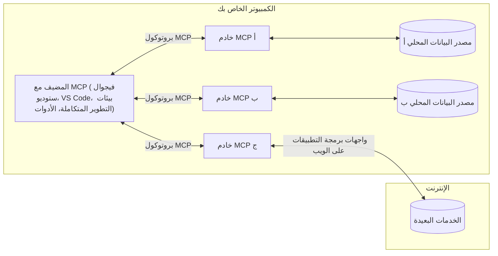

# مفاهيم أساسية في MCP: إتقان بروتوكول سياق النموذج للتكامل مع الذكاء الاصطناعي

[](https://youtu.be/earDzWGtE84)

_(انقر على الصورة أعلاه لمشاهدة فيديو هذا الدرس)_

[بروتوكول سياق النموذج (MCP)](https://github.com/modelcontextprotocol) هو إطار عمل قوي وموحد يعمل على تحسين الاتصال بين نماذج اللغة الضخمة (LLMs) والأدوات والتطبيقات ومصادر البيانات الخارجية. 
سيرشدك هذا الدليل خلال المفاهيم الأساسية لـ MCP. ستتعلم عن بنية العميل-الخادم، المكونات الأساسية، ميكانيكا الاتصال، وأفضل ممارسات التنفيذ.

- **موافقة المستخدم الصريحة**: تتطلب جميع عمليات الوصول إلى البيانات وتنفيذ العمليات موافقة صريحة من المستخدم قبل التنفيذ. يجب أن يفهم المستخدمون بوضوح ما هي البيانات التي سيتم الوصول إليها وما هي الإجراءات التي ستتم، مع تحكم دقيق في الأذونات والتفويضات.

- **حماية خصوصية البيانات**: لا يتم الكشف عن بيانات المستخدم إلا بموافقة صريحة ويجب حمايتها من خلال ضوابط وصول قوية طوال دورة حياة التفاعل بأكملها. يجب على عمليات التنفيذ منع نقل البيانات غير المصرح به والحفاظ على حدود خصوصية صارمة.

- **سلامة تنفيذ الأدوات**: يحتاج كل استدعاء لأداة إلى موافقة صريحة من المستخدم مع فهم واضح لوظيفة الأداة والمعلمات والتأثير المحتمل. يجب أن تمنع حدود الأمان الصارمة تنفيذ الأدوات غير المقصود أو غير الآمن أو الخبيث.

- **أمان طبقة النقل**: يجب أن تستخدم جميع قنوات الاتصال تشفيرًا ووسائل مصادقة مناسبة. يجب تنفيذ بروتوكولات نقل آمنة وإدارة بيانات اعتماد صحيحة للاتصالات البعيدة.

#### إرشادات التنفيذ:

- **إدارة الأذونات**: تنفيذ أنظمة أذونات دقيقة تتيح للمستخدمين التحكم في أي الخوادم والأدوات والموارد التي يمكن الوصول إليها
- **المصادقة والتفويض**: استخدام طرق مصادقة آمنة (OAuth، مفاتيح API) مع إدارة صحيحة للرموز وانتهاء صلاحيتها  
- **التحقق من المدخلات**: التحقق من جميع المعلمات وبيانات المدخلات وفقًا للمخططات المحددة لمنع هجمات الحقن
- **تسجيل التدقيق**: الحفاظ على سجلات شاملة لجميع العمليات لمراقبة الأمان والامتثال

## نظرة عامة

يستكشف هذا الدرس البنية الأساسية والمكونات التي تشكل نظام بروتوكول سياق النموذج (MCP). ستتعلم عن بنية العميل-الخادم، المكونات الرئيسية، وآليات الاتصال التي تدعم التفاعلات في MCP.

## الأهداف التعليمية الرئيسية

بنهاية هذا الدرس، ستتمكن من:

- فهم بنية العميل-الخادم في MCP.
- تحديد أدوار ومسؤوليات المضيفين والعملاء والخوادم.
- تحليل الميزات الأساسية التي تجعل MCP طبقة تكامل مرنة.
- تعلم كيفية تدفق المعلومات داخل نظام MCP.
- الحصول على رؤى عملية من خلال أمثلة كود في .NET وJava وPython وJavaScript.

## بنية MCP: نظرة معمقة

يبنى نظام MCP على نموذج عميل-خادم. تتيح هذه البنية المودولية لتطبيقات الذكاء الاصطناعي التفاعل مع الأدوات وقواعد البيانات وواجهات برمجة التطبيقات والموارد السياقية بكفاءة. لنفصل هذه البنية إلى مكوناتها الأساسية.

في جوهرها، يتبع MCP بنية عميل-خادم حيث يمكن لتطبيق مضيف الاتصال بعدة خوادم:


- **مضيفو MCP**: برامج مثل VSCode، Claude Desktop، بيئات التطوير IDEs، أو أدوات الذكاء الاصطناعي التي تريد الوصول إلى البيانات عبر MCP
- **عملاء MCP**: عملاء البروتوكول الذين يحافظون على اتصالات فردية مع الخوادم
- **خوادم MCP**: برامج خفيفة الوزن تعرض قدرات محددة عبر بروتوكول سياق النموذج الموحد
- **مصادر البيانات المحلية**: ملفات جهاز الكمبيوتر وقواعد البيانات والخدمات التي يمكن لخوادم MCP الوصول إليها بأمان
- **الخدمات البعيدة**: أنظمة خارجية متاحة عبر الإنترنت يمكن لخوادم MCP الاتصال بها عبر واجهات برمجة التطبيقات.

يعد بروتوكول MCP معيارًا متطورًا يستخدم ترقيم الإصدارات بناءً على التاريخ (بتنسيق YYYY-MM-DD). نسخة البروتوكول الحالية هي **2025-11-25**. يمكنك الاطلاع على آخر التحديثات في [مواصفات البروتوكول](https://modelcontextprotocol.io/specification/2025-11-25/)

### 1. المضيفون

في بروتوكول سياق النموذج (MCP)، **المضيفون** هم تطبيقات الذكاء الاصطناعي التي تعمل كواجهة رئيسية يتفاعل من خلالها المستخدمون مع البروتوكول. يقوم المضيفون بتنسيق وإدارة الاتصالات مع عدة خوادم MCP من خلال إنشاء عملاء MCP مخصصين لكل اتصال خادم. أمثلة على المضيفين تشمل:

- **تطبيقات الذكاء الاصطناعي**: Claude Desktop، Visual Studio Code، Claude Code
- **بيئات التطوير**: بيئات تطوير متكاملة ومحررات كود مع تكامل MCP  
- **تطبيقات مخصصة**: وكلاء وأدوات ذكاء اصطناعي مخصصة البناء

**المضيفون** هم تطبيقات تنسق تفاعلات نماذج الذكاء الاصطناعي. يقومون بـ:

- **تنفيذ نماذج الذكاء الاصطناعي**: تشغيل أو التفاعل مع نماذج اللغة الضخمة لإنتاج الردود وتنسيق سير العمل
- **إدارة اتصالات العملاء**: إنشاء والحفاظ على عميل MCP واحد لكل اتصال بخادم MCP
- **التحكم في واجهة المستخدم**: إدارة سير المحادثة، تفاعلات المستخدم، وعرض الردود  
- **فرض الأمان**: التحكم في الأذونات، القيود الأمنية، والمصادقة
- **التعامل مع موافقة المستخدم**: إدارة موافقة المستخدم لمشاركة البيانات وتنفيذ الأدوات


### 2. العملاء

**العملاء** هم مكونات أساسية تحافظ على اتصالات مخصصة فردية بين المضيفين وخوادم MCP. يتم إنشاء كل عميل MCP بواسطة المضيف للاتصال بخادم MCP محدد، مما يضمن قنوات اتصال منظمة وآمنة. تتيح تعدد العملاء للمضيفين الاتصال بعدة خوادم في نفس الوقت.

**العملاء** هم مكونات ربط داخل تطبيق المضيف. يقومون بـ:

- **اتصال البروتوكول**: إرسال طلبات JSON-RPC 2.0 إلى الخوادم مع المطالبات والتعليمات
- **التفاوض على القدرات**: التفاوض مع الخوادم حول الميزات المدعومة وإصدارات البروتوكول أثناء التهيئة
- **تنفيذ الأدوات**: إدارة طلبات تنفيذ الأدوات من النماذج ومعالجة الردود
- **التحديثات اللحظية**: التعامل مع الإشعارات والتحديثات اللحظية من الخوادم
- **معالجة الردود**: معالجة وتنسيق الردود من الخادم للعرض على المستخدمين

### 3. الخوادم

**الخوادم** هي برامج توفر سياقًا وأدوات وقدرات لعملاء MCP. يمكن تشغيلها محليًا (على نفس جهاز المضيف) أو عن بُعد (على منصات خارجية)، وهي مسؤولة عن معالجة طلبات العملاء وتوفير ردود منظمة. تعرض الخوادم وظائف محددة عبر بروتوكول سياق النموذج الموحد.

**الخوادم** هي خدمات تقدم السياق والقدرات. تقوم بـ:

- **تسجيل الميزات**: تسجيل وعرض الموارد الأساسية المتاحة (الموارد، المطالبات، الأدوات) للعملاء
- **معالجة الطلبات**: استقبال وتنفيذ نداءات الأدوات، طلبات الموارد، والمطالبات من العملاء
- **توفير السياق**: تقديم المعلومات والبيانات السياقية لتعزيز ردود النموذج
- **إدارة الحالة**: الحفاظ على حالة الجلسة والتعامل مع التفاعلات التي تحتاج إلى حالة عند الضرورة
- **الإشعارات اللحظية**: إرسال الإشعارات حول تغييرات القدرات والتحديثات إلى العملاء المتصلين

يمكن لأي شخص تطوير الخوادم لتوسيع قدرات النموذج بوظائف متخصصة، وتدعم سيناريوهات النشر المحلية والبعيدة.

### 4. الموارد الأساسية للخادم

توفر الخوادم في بروتوكول سياق النموذج (MCP) ثلاث **موارد أساسية** تحدد اللبنات الأساسية للتفاعلات الغنية بين العملاء، المضيفين، ونماذج اللغة. تحدد هذه الموارد أنواع المعلومات والسلوكيات السياقية المتاحة عبر البروتوكول.

يمكن لخوادم MCP عرض أي تركيبة من الموارد الأساسية الثلاثة التالية:

#### الموارد 

**الموارد** هي مصادر بيانات تقدم معلومات سياقية لتطبيقات الذكاء الاصطناعي. تمثل محتوى ثابتًا أو ديناميكيًا يمكنه تعزيز فهم النموذج واتخاذ القرار:

- **بيانات سياقية**: معلومات منظمة وسياق لاستهلاك نموذج الذكاء الاصطناعي
- **قواعد المعرفة**: مستودعات المستندات، المقالات، الكتيبات، وأوراق البحث
- **مصادر البيانات المحلية**: ملفات، قواعد بيانات، ومعلومات نظام محلي  
- **البيانات الخارجية**: استجابات API، خدمات الويب، وبيانات أنظمة بعيدة
- **المحتوى الديناميكي**: بيانات في الوقت الحقيقي تتجدد بناءً على الظروف الخارجية

يتم تعريف الموارد بواسطة URIs وتدعم الاكتشاف عبر طرق `resources/list` والاسترجاع باستخدام `resources/read`:

```text
file://documents/project-spec.md
database://production/users/schema
api://weather/current
```

#### المطالبات

**المطالبات** هي قوالب قابلة لإعادة الاستخدام تساعد في هيكلة التفاعلات مع نماذج اللغة. توفر أنماط تفاعل موحدة وسير عمل قالبية:

- **التفاعلات المبنية على القوالب**: رسائل ومقدمات محادثة مسبقة الهيكلة
- **قوالب سير العمل**: تسلسلات موحدة للمهام والتفاعلات الشائعة
- **أمثلة قليلة اللقطات**: قوالب مبنية على أمثلة لتوجيه النموذج
- **مطالبات النظام**: مطالبات تأسيسية تحدد سلوك النموذج والسياق
- **القوالب الديناميكية**: مطالبات مع معلمات تتكيف مع السياقات المحددة

تدعم المطالبات استبدال المتغيرات ويمكن اكتشافها عبر `prompts/list` واسترجاعها باستخدام `prompts/get`:

```markdown
Generate a {{task_type}} for {{product}} targeting {{audience}} with the following requirements: {{requirements}}
```

#### الأدوات

**الأدوات** هي وظائف قابلة للتنفيذ يمكن لنماذج الذكاء الاصطناعي استدعاؤها لأداء إجراءات محددة. تمثل "الأفعال" في نظام MCP، مما يمكّن النماذج من التفاعل مع أنظمة خارجية:

- **وظائف تنفيذية**: عمليات منفصلة يمكن للنماذج استدعاؤها بمعلمات محددة
- **تكامل الأنظمة الخارجية**: نداءات API، استعلامات قواعد البيانات، عمليات الملفات، الحسابات
- **هوية فريدة**: لكل أداة اسم مميز، وصف، ومخطط معلمات
- **إدخال/إخراج منظم**: الأدوات تقبل معلمات تم التحقق منها وتعيد ردودًا منظمة ومصنفة
- **قدرات تنفيذ الأفعال**: تمكّن النماذج من أداء إجراءات في العالم الحقيقي وجلب بيانات حية

يتم تعريف الأدوات بمخطط JSON للتحقق من المعلمات وتُكتشف عبر `tools/list` ويتم تنفيذها عبر `tools/call`. يمكن للأدوات أيضًا تضمين **أيقونات** كبيانات وصفية إضافية لتحسين عرض واجهة المستخدم.

**تعليقات الأدوات**: تدعم الأدوات تعليقات سلوكية مثل (`readOnlyHint`، `destructiveHint`) التي تصف ما إذا كانت الأداة للقراءة فقط أو مدمرة، مما يساعد العملاء على اتخاذ قرارات مستنيرة بشأن تنفيذ الأدوات.

مثال تعريف أداة:

```typescript
server.tool(
  "search_products", 
  {
    query: z.string().describe("Search query for products"),
    category: z.string().optional().describe("Product category filter"),
    max_results: z.number().default(10).describe("Maximum results to return")
  }, 
  async (params) => {
    // تنفيذ البحث وإرجاع النتائج المهيكلة
    return await productService.search(params);
  }
);
```

## الموارد الأساسية للعميل

في بروتوكول سياق النموذج (MCP)، يمكن للعملاء عرض موارد تمكن الخوادم من طلب قدرات إضافية من تطبيق المضيف. تسمح هذه الموارد الجانبية الخاصة بالعميل بتنفيذ خوادم أكثر تفاعلية وغنية يمكنها الوصول إلى قدرات نموذج الذكاء الاصطناعي وتفاعلات المستخدم.

### العرض

يسمح **العرض** للخوادم بطلب إكمالات من نموذج اللغة من تطبيق الذكاء الاصطناعي التابع للعميل. تمكّن هذه المورد الخوادم من الوصول إلى قدرات النموذج دون تضمين تبعيات SDK الخاصة بالنموذج:

- **الوصول المستقل عن النموذج**: يمكن للخوادم طلب الإكمالات دون الحاجة إلى تضمين SDK لنموذج اللغة أو إدارة الوصول للنموذج
- **الذكاء الاصطناعي المبادر من الخادم**: تمكّن الخوادم من توليد المحتوى بشكل مستقل باستخدام نموذج الذكاء الاصطناعي للعميل
- **تفاعلات نماذج متكررة**: تدعم السيناريوهات المعقدة التي تحتاج فيها الخوادم إلى مساعدة الذكاء الاصطناعي للمعالجة
- **توليد المحتوى الديناميكي**: تسمح للخوادم بإنشاء ردود سياقية باستخدام نموذج المضيف
- **دعم استدعاء الأدوات**: يمكن للخوادم تضمين معلمات `tools` و `toolChoice` لتمكين نموذج العميل من استدعاء أدوات أثناء العرض

يتم بدء العرض من خلال طريقة `sampling/complete`، حيث ترسل الخوادم طلبات الإكمال إلى العملاء.

### الجذور

توفر **الجذور** طريقة موحدة للعملاء لكشف حدود نظام الملفات للخوادم، مما يساعد الخوادم على فهم المجلدات والملفات التي يمكنها الوصول إليها:

- **حدود نظام الملفات**: تعريف حدود مكان عمل الخوادم ضمن نظام الملفات
- **ضبط الوصول**: تساعد الخوادم على فهم المجلدات والملفات التي لديها إذن للوصول إليها
- **تحديثات ديناميكية**: يمكن للعملاء إخطار الخوادم عند تغيير قائمة الجذور
- **تحديد عبر URI**: تستخدم الجذور URIs بنمط `file://` لتحديد المجلدات والملفات القابلة للوصول

تُكتشف الجذور عبر طريقة `roots/list`، ويرسل العملاء إشعارات `notifications/roots/list_changed` عند تغيير الجذور.

### الاستنباط

تمكّن **الاستنباط** الخوادم من طلب معلومات إضافية أو تأكيد من المستخدمين عبر واجهة العميل:

- **طلبات إدخال المستخدم**: يمكن للخوادم طلب معلومات إضافية عند الحاجة لتنفيذ الأدوات
- **حوار التأكيد**: طلب موافقة المستخدم للعمليات الحساسة أو ذات التأثير الكبير
- **سير عمل تفاعلي**: تمكين الخوادم من إنشاء تفاعلات مستخدم خطوة بخطوة
- **جمع المعلمات الديناميكي**: جمع المعلمات المفقودة أو الاختيارية أثناء تنفيذ الأدوات

يتم تقديم طلبات الاستنباط باستخدام طريقة `elicitation/request` لجمع مدخلات المستخدم عبر واجهة العميل.

**استنباط وضع URL**: يمكن للخوادم أيضًا طلب تفاعلات مستخدم قائمة على عناوين URL، مما يسمح لها بتوجيه المستخدمين إلى صفحات ويب خارجية للمصادقة أو التأكيد أو إدخال البيانات.

### التسجيل

يسمح **التسجيل** للخوادم بإرسال رسائل سجل منظمة إلى العملاء لأغراض التصحيح والمراقبة ورؤية التشغيل:

- **دعم التصحيح**: تمكين الخوادم من توفير سجلات تنفيذ مفصلة لاستكشاف الأخطاء وإصلاحها
- **مراقبة العمليات**: إرسال تحديثات الحالة ومقاييس الأداء إلى العملاء
- **الإبلاغ عن الأخطاء**: تقديم سياق خطأ مفصل ومعلومات تشخيصية
- **سجلات التدقيق**: إنشاء سجلات شاملة للعمليات والقرارات الخدمية

يتم إرسال رسائل التسجيل إلى العملاء لتوفير الشفافية في عمليات الخادم وتسهيلاً للتصحيح.

## تدفق المعلومات في MCP

يحدد بروتوكول سياق النموذج (MCP) تدفقًا منظمًا للمعلومات بين المضيفين والعملاء والخوادم والنماذج. يساعد فهم هذا التدفق على توضيح كيفية معالجة طلبات المستخدم وكيفية دمج الأدوات والبيانات الخارجية في ردود النموذج.
- **المضيف يبدأ الاتصال**  
  يقوم تطبيق المضيف (مثل بيئة تطوير متكاملة أو واجهة دردشة) بإنشاء اتصال بخادم MCP، عادةً عبر STDIO، WebSocket، أو ناقل مدعوم آخر.

- **التفاوض على القدرات**  
  يتبادل العميل (المضمن في المضيف) والخادم معلومات حول الميزات، الأدوات، الموارد، وإصدارات البروتوكول المدعومة. يضمن هذا فهم كلا الجانبين للقدرات المتاحة للجلسة.

- **طلب المستخدم**  
  يتفاعل المستخدم مع المضيف (مثل إدخال مطالبة أو أمر). يجمع المضيف هذا الإدخال ويمرره إلى العميل للمعالجة.

- **استخدام الموارد أو الأدوات**  
  - قد يطلب العميل سياقًا إضافيًا أو موارد من الخادم (مثل ملفات، مدخلات قاعدة بيانات، أو مقالات قاعدة المعرفة) لتعزيز فهم النموذج.  
  - إذا قرر النموذج أن هناك حاجة لأداة (مثل جلب بيانات، إجراء عملية حسابية، أو استدعاء API)، يرسل العميل طلب استدعاء الأداة إلى الخادم مع تحديد اسم الأداة والمعلمات.

- **تنفيذ الخادم**  
  يتلقى الخادم طلب المورد أو الأداة، وينفذ العمليات اللازمة (مثل تشغيل دالة، استعلام قاعدة بيانات، أو استرجاع ملف)، ويعيد النتائج إلى العميل بطريقة منظمة.

- **توليد الرد**  
  يدمج العميل استجابات الخادم (بيانات الموارد، مخرجات الأدوات، إلخ) في التفاعل الجاري للنموذج. يستخدم النموذج هذه المعلومات لإنشاء رد شامل وذو صلة بالسياق.

- **عرض النتيجة**  
  يتلقى المضيف الإخراج النهائي من العميل ويقدمه للمستخدم، غالبًا بما في ذلك نص النموذج المولّد وأي نتائج من تنفيذ الأدوات أو البحث عن الموارد.

يمكن لهذا التدفق أن يمكن MCP من دعم تطبيقات ذكاء اصطناعي متقدمة، تفاعلية، وواعية بالسياق من خلال الربط السلس بين النماذج والأدوات والبيانات الخارجية.

## هيكل البروتوكول ومستوياته

يتألف MCP من طبقتين معماريتين مميزتين تعملان معًا لتوفير إطار اتصال كامل:

### طبقة البيانات

تنفذ **طبقة البيانات** بروتوكول MCP الأساسي باستخدام **JSON-RPC 2.0** كأساس لها. تعرف هذه الطبقة هيكل الرسائل، الدلالات، وأنماط التفاعل:

#### المكونات الأساسية:

- **بروتوكول JSON-RPC 2.0**: يستخدم جميع الاتصال تنسيق رسائل JSON-RPC 2.0 القياسي للدعوات، الردود، والإشعارات  
- **إدارة دورة الحياة**: تتعامل مع تهيئة الاتصال، التفاوض على القدرات، وإنهاء الجلسة بين العملاء والخوادم  
- **البدائيات الخادمة**: تمكّن الخوادم من تقديم الوظائف الأساسية من خلال الأدوات، الموارد، والمطالبات  
- **البدائيات العميلة**: تمكّن الخوادم من طلب أخذ عينات من نماذج اللغة الكبيرة، استثارة المدخلات من المستخدم، وإرسال رسائل السجلات  
- **الإشعارات في الزمن الحقيقي**: تدعم الإشعارات غير المتزامنة للتحديثات الديناميكية بدون الاستطلاع

#### الميزات الرئيسية:

- **التفاوض على إصدار البروتوكول**: يستخدم الترقيم القائم على التاريخ (YYYY-MM-DD) لضمان التوافق  
- **اكتشاف القدرات**: يتبادل العملاء والخوادم معلومات الخصائص المدعومة أثناء التهيئة  
- **جلسات حالة**: تحافظ على حالة الاتصال عبر تفاعلات متعددة لاستمرارية السياق

### طبقة النقل

تدير **طبقة النقل** قنوات الاتصال، تأطير الرسائل، والمصادقة بين مشاركي MCP:

#### آليات النقل المدعومة:

1. **نقل STDIO**:  
   - يستخدم تدفقات الإدخال/الإخراج القياسية للتواصل المباشر بين العمليات  
   - مثالي للعمليات المحلية على نفس الجهاز بدون حمل شبكي  
   - شائع للحصول على تطبيقات خادم MCP محلية

2. **نقل HTTP القابل للبث**:  
   - يستخدم POST عبر HTTP لرسائل العميل إلى الخادم  
   - اختيارياً يستخدم Server-Sent Events (SSE) لبث الخادم إلى العميل  
   - يمكن من التواصل مع الخوادم البعيدة عبر الشبكات  
   - يدعم المصادقة HTTP القياسية (رموز حامل، مفاتيح API، رؤوس مخصصة)  
   - توصي MCP باستخدام OAuth لمصادقة آمنة تعتمد على الرموز

#### تجريد النقل:

تجرد طبقة النقل تفاصيل الاتصال عن طبقة البيانات، مما يتيح نفس تنسيق رسائل JSON-RPC 2.0 عبر جميع آليات النقل. يسمح هذا التجريد للتطبيقات بالتبديل بسهولة بين الخوادم المحلية والبعيدة.

### اعتبارات الأمان

يجب على تطبيقات MCP الالتزام بعدة مبادئ أمان حاسمة لضمان التفاعلات الآمنة، الجديرة بالثقة، والمحمية عبر كل عمليات البروتوكول:

- **موافقة وتحكم المستخدم**: يجب أن يمنح المستخدمون موافقة صريحة قبل الوصول إلى أي بيانات أو تنفيذ أي عمليات. يجب أن يملكوا تحكمًا واضحًا فيما يتم مشاركته وما الأفعال المصرح بها، مدعومًا بواجهات مستخدم بديهية لمراجعة والموافقة على الأنشطة.

- **خصوصية البيانات**: يجب الكشف عن بيانات المستخدم فقط بموافقته الصريحة ويجب حمايتها من خلال ضوابط الوصول المناسبة. يجب على تطبيقات MCP حماية البيانات من النقل غير المصرح به وضمان الحفاظ على الخصوصية طوال كل التفاعلات.

- **أمان الأدوات**: قبل استدعاء أي أداة، يشترط موافقة المستخدم الصريحة. يجب أن يفهم المستخدمون بوضوح وظيفة كل أداة، ويجب فرض حدود أمان قوية لمنع تنفيذ أدوات غير مقصود أو غير آمن.

باتباع هذه المبادئ الأمنية، يضمن MCP ثقة وخصوصية وسلامة المستخدم عبر كل تفاعلات البروتوكول مع تمكين تكاملات ذكاء اصطناعي قوية.

## أمثلة على الكود: المكونات الرئيسية

تتضمن الأمثلة التالية كودًا في عدة لغات برمجة شهيرة توضح كيفية تنفيذ مكونات خادم MCP الرئيسية والأدوات.

### مثال .NET: إنشاء خادم MCP بسيط مع أدوات

فيما يلي مثال عملي برمجي باستخدام .NET يوضح كيفية تنفيذ خادم MCP بسيط باستخدام أدوات مخصصة. يعرض هذا المثال كيفية تعريف الأدوات، تسجيلها، التعامل مع الطلبات، وربط الخادم باستخدام بروتوكول Model Context.

```csharp
using System;
using System.Threading.Tasks;
using ModelContextProtocol.Server;
using ModelContextProtocol.Server.Transport;
using ModelContextProtocol.Server.Tools;

public class WeatherServer
{
    public static async Task Main(string[] args)
    {
        // Create an MCP server
        var server = new McpServer(
            name: "Weather MCP Server",
            version: "1.0.0"
        );
        
        // Register our custom weather tool
        server.AddTool<string, WeatherData>("weatherTool", 
            description: "Gets current weather for a location",
            execute: async (location) => {
                // Call weather API (simplified)
                var weatherData = await GetWeatherDataAsync(location);
                return weatherData;
            });
        
        // Connect the server using stdio transport
        var transport = new StdioServerTransport();
        await server.ConnectAsync(transport);
        
        Console.WriteLine("Weather MCP Server started");
        
        // Keep the server running until process is terminated
        await Task.Delay(-1);
    }
    
    private static async Task<WeatherData> GetWeatherDataAsync(string location)
    {
        // This would normally call a weather API
        // Simplified for demonstration
        await Task.Delay(100); // Simulate API call
        return new WeatherData { 
            Temperature = 72.5,
            Conditions = "Sunny",
            Location = location
        };
    }
}

public class WeatherData
{
    public double Temperature { get; set; }
    public string Conditions { get; set; }
    public string Location { get; set; }
}
```

### مثال جافا: مكونات خادم MCP

يعرض هذا المثال نفس خادم MCP وتسجيل الأدوات كما في مثال .NET أعلاه، لكنه منفذ باستخدام جافا.

```java
import io.modelcontextprotocol.server.McpServer;
import io.modelcontextprotocol.server.McpToolDefinition;
import io.modelcontextprotocol.server.transport.StdioServerTransport;
import io.modelcontextprotocol.server.tool.ToolExecutionContext;
import io.modelcontextprotocol.server.tool.ToolResponse;

public class WeatherMcpServer {
    public static void main(String[] args) throws Exception {
        // إنشاء خادم MCP
        McpServer server = McpServer.builder()
            .name("Weather MCP Server")
            .version("1.0.0")
            .build();
            
        // تسجيل أداة الطقس
        server.registerTool(McpToolDefinition.builder("weatherTool")
            .description("Gets current weather for a location")
            .parameter("location", String.class)
            .execute((ToolExecutionContext ctx) -> {
                String location = ctx.getParameter("location", String.class);
                
                // الحصول على بيانات الطقس (مبسط)
                WeatherData data = getWeatherData(location);
                
                // إرجاع الاستجابة بتنسيق
                return ToolResponse.content(
                    String.format("Temperature: %.1f°F, Conditions: %s, Location: %s", 
                    data.getTemperature(), 
                    data.getConditions(), 
                    data.getLocation())
                );
            })
            .build());
        
        // ربط الخادم باستخدام النقل stdio
        try (StdioServerTransport transport = new StdioServerTransport()) {
            server.connect(transport);
            System.out.println("Weather MCP Server started");
            // إبقاء الخادم يعمل حتى يتم إيقاف العملية
            Thread.currentThread().join();
        }
    }
    
    private static WeatherData getWeatherData(String location) {
        // التنفيذ سيتصل بواجهة برمجة تطبيقات الطقس
        // مبسط لأغراض المثال
        return new WeatherData(72.5, "Sunny", location);
    }
}

class WeatherData {
    private double temperature;
    private String conditions;
    private String location;
    
    public WeatherData(double temperature, String conditions, String location) {
        this.temperature = temperature;
        this.conditions = conditions;
        this.location = location;
    }
    
    public double getTemperature() {
        return temperature;
    }
    
    public String getConditions() {
        return conditions;
    }
    
    public String getLocation() {
        return location;
    }
}
```

### مثال بايثون: بناء خادم MCP

يستخدم هذا المثال fastmcp، لذا يرجى التأكد من تثبيته أولاً:

```python
pip install fastmcp
```
نموذج الكود:

```python
#!/usr/bin/env python3
import asyncio
from fastmcp import FastMCP
from fastmcp.transports.stdio import serve_stdio

# إنشاء خادم FastMCP
mcp = FastMCP(
    name="Weather MCP Server",
    version="1.0.0"
)

@mcp.tool()
def get_weather(location: str) -> dict:
    """Gets current weather for a location."""
    return {
        "temperature": 72.5,
        "conditions": "Sunny",
        "location": location
    }

# نهج بديل باستخدام فئة
class WeatherTools:
    @mcp.tool()
    def forecast(self, location: str, days: int = 1) -> dict:
        """Gets weather forecast for a location for the specified number of days."""
        return {
            "location": location,
            "forecast": [
                {"day": i+1, "temperature": 70 + i, "conditions": "Partly Cloudy"}
                for i in range(days)
            ]
        }

# تسجيل أدوات الفئة
weather_tools = WeatherTools()

# بدء الخادم
if __name__ == "__main__":
    asyncio.run(serve_stdio(mcp))
```

### مثال جافا سكريبت: إنشاء خادم MCP

يعرض هذا المثال إنشاء خادم MCP باستخدام جافا سكريبت وطريقة تسجيل أداتين مرتبطتين بالطقس.

```javascript
// باستخدام مجموعة أدوات بروتوكول سياق النموذج الرسمية
import { McpServer } from "@modelcontextprotocol/sdk/server/mcp.js";
import { StdioServerTransport } from "@modelcontextprotocol/sdk/server/stdio.js";
import { z } from "zod"; // للتحقق من صحة المعلمات

// إنشاء خادم MCP
const server = new McpServer({
  name: "Weather MCP Server",
  version: "1.0.0"
});

// تعريف أداة الطقس
server.tool(
  "weatherTool",
  {
    location: z.string().describe("The location to get weather for")
  },
  async ({ location }) => {
    // عادةً ما يتصل هذا بواجهة برمجة تطبيقات الطقس
    // مبسط للعرض التوضيحي
    const weatherData = await getWeatherData(location);
    
    return {
      content: [
        { 
          type: "text", 
          text: `Temperature: ${weatherData.temperature}°F, Conditions: ${weatherData.conditions}, Location: ${weatherData.location}` 
        }
      ]
    };
  }
);

// تعريف أداة التنبؤ
server.tool(
  "forecastTool",
  {
    location: z.string(),
    days: z.number().default(3).describe("Number of days for forecast")
  },
  async ({ location, days }) => {
    // عادةً ما يتصل هذا بواجهة برمجة تطبيقات الطقس
    // مبسط للعرض التوضيحي
    const forecast = await getForecastData(location, days);
    
    return {
      content: [
        { 
          type: "text", 
          text: `${days}-day forecast for ${location}: ${JSON.stringify(forecast)}` 
        }
      ]
    };
  }
);

// دوال مساعدة
async function getWeatherData(location) {
  // محاكاة استدعاء API
  return {
    temperature: 72.5,
    conditions: "Sunny",
    location: location
  };
}

async function getForecastData(location, days) {
  // محاكاة استدعاء API
  return Array.from({ length: days }, (_, i) => ({
    day: i + 1,
    temperature: 70 + Math.floor(Math.random() * 10),
    conditions: i % 2 === 0 ? "Sunny" : "Partly Cloudy"
  }));
}

// ربط الخادم باستخدام نقل stdio
const transport = new StdioServerTransport();
server.connect(transport).catch(console.error);

console.log("Weather MCP Server started");
```

يوضح هذا المثال بجافا سكريبت كيفية إنشاء خادم MCP يقوم بتسجيل أدوات الطقس ويتصل باستخدام نقل stdio لمعالجة طلبات العملاء الواردة.

## الأمان والتفويض

يشمل MCP عدة مفاهيم وآليات مدمجة لإدارة الأمان والتفويض عبر البروتوكول:

1. **التحكم في صلاحيات الأدوات**  
  يمكن للعملاء تحديد الأدوات التي يسمح للنموذج باستخدامها خلال الجلسة. يضمن هذا السماح فقط بالأدوات المصرح بها صراحة، مما يقلل خطر العمليات غير المقصودة أو غير الآمنة. يمكن تكوين الصلاحيات بشكل ديناميكي بناءً على تفضيلات المستخدم، سياسات المؤسسة، أو سياق التفاعل.

2. **المصادقة**  
  يمكن للخوادم طلب المصادقة قبل السماح بالوصول إلى الأدوات، الموارد، أو العمليات الحساسة. قد يشمل ذلك مفاتيح API، رموز OAuth، أو مخططات مصادقة أخرى. تضمن المصادقة الصحيحة أن العملاء والمستخدمين الموثوق بهم فقط يمكنهم استدعاء قدرات الخادم.

3. **التحقق**  
  يتم فرض التحقق من المعلمات لجميع استدعاءات الأدوات. تعرف كل أداة الأنواع، الصيغ، والقيود المتوقعة لمعلماتها، ويقوم الخادم بالتحقق من الطلبات الواردة وفقًا لذلك. يمنع هذا الإدخال المعيب أو الخبيث من الوصول إلى تنفيذ الأدوات ويساعد في الحفاظ على سلامة العمليات.

4. **تحديد المعدل**  
  لمنع الإساءة وضمان الاستخدام العادل لموارد الخادم، يمكن لخوادم MCP تطبيق تحديد معدلات على استدعاءات الأدوات والوصول إلى الموارد. يمكن تطبيق حدود المعدل لكل مستخدم، لكل جلسة، أو عالميًا، وتساعد في الحماية من هجمات حجب الخدمة أو الاستهلاك المفرط للموارد.

من خلال دمج هذه الآليات، يوفر MCP أساسًا آمنًا لدمج نماذج اللغة مع الأدوات الخارجية ومصادر البيانات مع منح المستخدمين والمطورين تحكمًا دقيقًا في الوصول والاستخدام.

## رسائل البروتوكول وتدفق الاتصال

يستخدم اتصال MCP رسائل **JSON-RPC 2.0** منظمة لتسهيل تفاعلات واضحة وموثوقة بين المضيفين، العملاء، والخوادم. يحدد البروتوكول أنماط رسائل محددة لأنواع مختلفة من العمليات:

### أنواع الرسائل الأساسية:

#### **رسائل التهيئة**
- طلب **`initialize`**: يؤسس الاتصال ويتفاوض على إصدار البروتوكول والقدرات  
- رد **`initialize`**: يؤكد الميزات المدعومة ومعلومات الخادم  
- **`notifications/initialized`**: إشارة إلى أن التهيئة مكتملة وأن الجلسة جاهزة

#### **رسائل الاكتشاف**
- طلب **`tools/list`**: اكتشاف الأدوات المتوفرة من الخادم  
- طلب **`resources/list`**: سرد الموارد المتاحة (مصادر البيانات)  
- طلب **`prompts/list`**: استرجاع قوالب المطالبات المتوفرة

#### **رسائل التنفيذ**  
- طلب **`tools/call`**: تنفيذ أداة محددة مع المعلمات المقدمة  
- طلب **`resources/read`**: استرجاع المحتوى من مورد محدد  
- طلب **`prompts/get`**: جلب قالب مطالبة مع معلمات اختيارية

#### **رسائل جانب العميل**
- طلب **`sampling/complete`**: يطلب الخادم إكمال نموذج اللغة من العميل  
- **`elicitation/request`**: يطلب الخادم إدخال المستخدم عبر واجهة العميل  
- رسائل التسجيل: يرسل الخادم رسائل سجل منظمة إلى العميل

#### **رسائل الإشعارات**
- **`notifications/tools/list_changed`**: ينبه الخادم العميل بتغيرات الأدوات  
- **`notifications/resources/list_changed`**: ينبه الخادم العميل بتغيرات الموارد  
- **`notifications/prompts/list_changed`**: ينبه الخادم العميل بتغيرات المطالبات

### هيكل الرسالة:

تتبع جميع رسائل MCP تنسيق JSON-RPC 2.0 مع:  
- **رسائل الطلب**: تشمل `id`، `method`، و`params` اختيارية  
- **رسائل الرد**: تشمل `id` و`result` أو `error`  
- **رسائل الإشعار**: تشمل `method` و`params` اختيارية (بدون `id` أو رد متوقع)

تضمن هذه الاتصالات المنظمة تفاعلات موثوقة، قابلة للتتبع، وقابلة للتوسعة تدعم سيناريوهات متقدمة مثل التحديثات في الزمن الحقيقي، تسلسل الأدوات، والتعامل القوي مع الأخطاء.

### المهام (تجريبي)

تشكل **المهام** ميزة تجريبية توفر أغلفة تنفيذ متينة تمكن من استرجاع النتائج مؤجلًا وتتبع الحالة لطلبات MCP:

- **العمليات طويلة الأمد**: تتبع الاحتمالات الحسابية المكلفة، أتمتة سير العمل، والمعالجة الدُفعية  
- **النتائج المؤجلة**: الاستطلاع عن حالة المهمة واسترجاع النتائج عند انتهاء العمليات  
- **تتبع الحالة**: متابعة تقدم المهمة عبر حالات دورة حياة معرفة  
- **العمليات متعددة الخطوات**: دعم سير عمل معقد يمتد عبر تفاعلات متعددة

تغلف المهام طلبات MCP المعتادة لتمكين أنماط التنفيذ غير المتزامنة للعمليات التي لا يمكن إتمامها فورًا.

## النقاط الرئيسية

- **الهيكل المعماري**: يستخدم MCP هيكل عميل-خادم حيث يدير المضيفون اتصالات عملاء متعددة بالخوادم  
- **المشاركون**: يشمل النظام البيئي مضيفين (تطبيقات ذكاء اصطناعي)، عملاء (موصلات البروتوكول)، وخوادم (مقدمو القدرات)  
- **آليات النقل**: يدعم الاتصال STDIO (محلي) وHTTP القابل للبث مع SSE اختياري (بعيد)  
- **البدائيات الأساسية**: تعرض الخوادم أدوات (دوال تنفيذية)، موارد (مصادر بيانات)، ومطالبات (قوالب)  
- **البدائيات العميلة**: يمكن للخوادم طلب أخذ عينات (إكمالات LLM مع دعم استدعاء الأدوات)، استثارة (إدخال المستخدم بما في ذلك وضع URL)، جذور (حدود نظام الملفات)، وتسجيل من العملاء  
- **الميزات التجريبية**: توفر المهام أغطية تنفيذ متينة للعمليات طويلة الأمد  
- **أساس البروتوكول**: مبني على JSON-RPC 2.0 مع ترقيم إصدارات بمعيار تاريخي (الحالي: 2025-11-25)  
- **القدرات في الزمن الحقيقي**: يدعم الإشعارات للتحديثات الديناميكية والمزامنة اللحظية  
- **الأمان أولاً**: موافقة المستخدم الصريحة، حماية خصوصية البيانات، ونقل آمن هي متطلبات أساسية

## تمرين

صمم أداة MCP بسيطة ستكون مفيدة في مجالك. عرف:  
1. اسم الأداة  
2. المعلمات التي ستقبلها  
3. الإخراج الذي سترجعه  
4. كيف قد يستخدم النموذج هذه الأداة لحل مشاكل المستخدم

---

## ما التالي

التالي: [الفصل 2: الأمان](../02-Security/README.md)

---

<!-- CO-OP TRANSLATOR DISCLAIMER START -->
**تنويه**:
تمت ترجمة هذا المستند باستخدام خدمة الترجمة الآلية [Co-op Translator](https://github.com/Azure/co-op-translator). على الرغم من سعينا للدقة، يرجى العلم أن الترجمات الآلية قد تحتوي على أخطاء أو عدم دقة. ينبغي اعتبار النسخة الأصلية من المستند بلغتها الأصلية هي المصدر الموثوق. للمعلومات الهامة، يُنصح بالاستعانة بترجمة بشرية محترفة. نحن غير مسؤولين عن أي سوء فهم أو تفسير ناتج عن استخدام هذه الترجمة.
<!-- CO-OP TRANSLATOR DISCLAIMER END -->