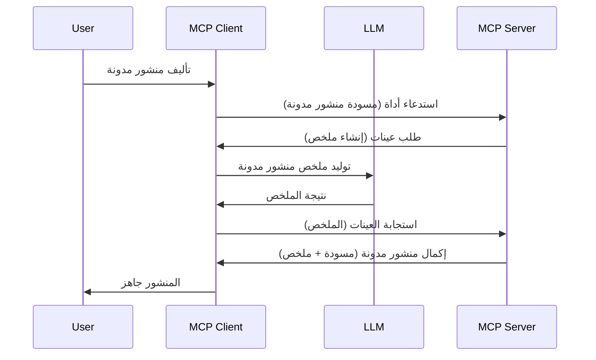

# أخذ عينات - تفويض الميزات إلى العميل

في بعض الأحيان، تحتاج إلى تعاون عميل MCP وخادم MCP لتحقيق هدف مشترك. قد تواجه حالة حيث يحتاج الخادم إلى مساعدة نموذج لغة كبير (LLM) موجود على العميل. في هذه الحالة، أخذ العينات هو ما يجب عليك استخدامه.

لنستكشف بعض حالات الاستخدام وكيفية بناء حل يتضمن أخذ العينات.

## نظرة عامة

في هذا الدرس، نركز على شرح متى وأين نستخدم أخذ العينات وكيف نهيئه.

## أهداف التعلم

في هذا الفصل، سوف:

- نشرح ما هو أخذ العينات ومتى يستخدم.
- نوضح كيفية تهيئة أخذ العينات في MCP.
- نقدم أمثلة على أخذ العينات في التطبيق.

## ما هو أخذ العينات ولماذا نستخدمه؟

أخذ العينات هي ميزة متقدمة تعمل بالطريقة التالية:



### طلب أخذ العينات

حسنًا، الآن لدينا رؤية شاملة لسيناريو موثوق، دعونا نتحدث عن طلب أخذ العينات الذي يرسله الخادم مرة أخرى إلى العميل. إليك كيف يمكن أن يبدو هذا الطلب بصيغة JSON-RPC:

```json
{
  "jsonrpc": "2.0",
  "id": 1,
  "method": "sampling/createMessage",
  "params": {
    "messages": [
      {
        "role": "user",
        "content": {
          "type": "text",
          "text": "Create a blog post summary of the following blog post: <BLOG POST>"
        }
      }
    ],
    "modelPreferences": {
      "hints": [
        {
          "name": "claude-3-sonnet"
        }
      ],
      "intelligencePriority": 0.8,
      "speedPriority": 0.5
    },
    "systemPrompt": "You are a helpful assistant.",
    "maxTokens": 100
  }
}
```

هناك بعض الأمور التي تستحق الذكر هنا:

- الموجه، تحت content -> text، هو موجهنا وهو تعليمات لنموذج اللغة الكبير لتلخيص محتوى منشور مدونة.

- **modelPreferences**. هذا القسم هو ببساطة تفضيل، توصية بتكوين استخدام النموذج اللغوي. يمكن للمستخدم الاختيار إما اتباع هذه التوصيات أو تغييرها. في هذه الحالة توجد توصيات عن النموذج المستخدم وأولوية السرعة والذكاء.
- **systemPrompt**، هذا هو موجه النظام العادي الذي يعطي نموذج اللغة شخصية ويحتوي على تعليمات توجيهية.
- **maxTokens**، هذه خاصية أخرى تُستخدم لتحديد عدد الرموز الموصى استخدامها لهذه المهمة.

### استجابة أخذ العينات

هذه الاستجابة هي ما ينتهي الأمر بعميل MCP إلى إرساله مرة أخرى إلى خادم MCP وهي نتيجة استدعاء العميل للنموذج، والانتظار للحصول على الاستجابة ثم بناء هذه الرسالة. إليك كيف يمكن أن تبدو بصيغة JSON-RPC:

```json
{
  "jsonrpc": "2.0",
  "id": 1,
  "result": {
    "role": "assistant",
    "content": {
      "type": "text",
      "text": "Here's your abstract <ABSTRACT>"
    },
    "model": "gpt-5",
    "stopReason": "endTurn"
  }
}
```

لاحظ كيف أن الاستجابة هي ملخص لمنشور المدونة تمامًا كما طلبنا. كما لاحظ كيف أن النموذج المستخدم `model` ليس ما طلبناه بل "gpt-5" بدلاً من "claude-3-sonnet". هذا لتوضيح أن المستخدم يمكنه تغيير رأيه فيما يستخدم وأن طلب أخذ العينات الخاص بك هو توصية.

حسنًا، بعدما فهمنا التدفق الرئيسي، والمهمة المفيدة لاستخدامه "إنشاء منشور مدونة + ملخص"، دعونا نرى ما نحتاج لفعله لجعله يعمل.

### أنواع الرسائل

رسائل أخذ العينات ليست محصورة على النص فقط بل يمكنك أيضًا إرسال صور وصوت. إليك كيف يختلف شكل JSON-RPC:

**نص**

```json
{
  "type": "text",
  "text": "The message content"
}
```

**محتوى صورة**

```json
{
  "type": "image",
  "data": "base64-encoded-image-data",
  "mimeType": "image/jpeg"
}
```

**محتوى صوت**

```json
{
  "type": "audio",
  "data": "base64-encoded-audio-data",
  "mimeType": "audio/wav"
}
```

> ملحوظة: لمزيد من المعلومات التفصيلية عن أخذ العينات، راجع [الوثائق الرسمية](https://modelcontextprotocol.io/specification/2025-11-25/client/sampling)

## كيفية تهيئة أخذ العينات في العميل

> ملاحظة: إذا كنت تبني خادم فقط، فلن تحتاج إلى الكثير هنا.

في العميل، تحتاج إلى تحديد الميزة التالية بهذا الشكل:

```json
{
  "capabilities": {
    "sampling": {}
  }
}
```

سيتم بعد ذلك التقاطها عند تهيئة العميل المختار مع الخادم.

## مثال لتطبيق أخذ العينات - إنشاء منشور مدونة

دعونا نبرمج خادم لأخذ العينات معًا، سنحتاج إلى القيام بما يلي:

1. إنشاء أداة على الخادم.
1. يجب أن تنشئ الأداة طلب أخذ عينات.
1. يجب أن تنتظر الأداة الرد على طلب أخذ العينات الخاص بالعميل.
1. ثم يتم إنتاج نتيجة الأداة.

لنرَ الكود خطوة بخطوة:

### -1- إنشاء الأداة

**python**

```python
@mcp.tool()
async def create_blog(title: str, content: str, ctx: Context[ServerSession, None]) -> str:
    """Create a blog post and generate a summary"""

```

### -2- إنشاء طلب أخذ عينات

وسع أداتك بالكود التالي:

**python**

```python
post = BlogPost(
        id=len(posts) + 1,
        title=title,
        content=content,
        abstract=""
    )

prompt = f"Create an abstract of the following blog post: title: {title} and draft: {content} "

result = await ctx.session.create_message(
        messages=[
            SamplingMessage(
                role="user",
                content=TextContent(type="text", text=prompt),
            )
        ],
        max_tokens=100,
)

```

### -3- الانتظار للاستجابة وإرجاع الاستجابة

**python**

```python
post.abstract = result.content.text

posts.append(post)

# إرجاع المنتج الكامل
return json.dumps({
    "id": post.title,
    "abstract": post.abstract
})
```

### -4- الكود الكامل

**python**

```python
from starlette.applications import Starlette
from starlette.routing import Mount, Host

from mcp.server.fastmcp import Context, FastMCP

from mcp.server.session import ServerSession
from mcp.types import SamplingMessage, TextContent

import json


from uuid import uuid4
from typing import List
from pydantic import BaseModel


mcp = FastMCP("Blog post generator")

# app = FastAPI()

posts = []

class BlogPost(BaseModel):
    id: int
    title: str
    content: str
    abstract: str

posts: List[BlogPost] = []

@mcp.tool()
async def create_blog(title: str, content: str, ctx: Context[ServerSession, None]) -> str:
    """Create a blog post and generate a summary"""

    post = BlogPost(
        id=len(posts) + 1,
        title=title,
        content=content,
        abstract=""
    )

    prompt = f"Create an abstract of the following blog post: title: {title} and draft: {content} "

    result = await ctx.session.create_message(
        messages=[
            SamplingMessage(
                role="user",
                content=TextContent(type="text", text=prompt),
            )
        ],
        max_tokens=100,
    )

    post.abstract = result.content.text

    posts.append(post)

    # إرجاع مشاركة المدونة الكاملة
    return json.dumps({
        "id": post.title,
        "abstract": post.abstract
    })

if __name__ == "__main__":
    print("Starting server...")
    # mcp.run()
    mcp.run(transport="streamable-http")

# تشغيل التطبيق باستخدام: python server.py
```

### -5- اختباره في Visual Studio Code

لاختبار ذلك في Visual Studio Code، قم بالتالي:

1. ابدأ الخادم في الطرفية
1. أضفه إلى *mcp.json* (وتأكد من تشغيله) مثل هذا:

   ```json
   "servers": {
      "blog-server": {
        "type": "http",
        "url": "http://localhost:8000/mcp"
      }
   }
   ```

1. اكتب موجه:

   ```text
   create a blog post named "Where Python comes from", the content is "Python is actually named after Monty Python Flying Circus"
   ```

1. اسمح بأخذ العينات. في المرة الأولى التي تختبر فيها هذا، ستظهر لك حوار إضافي يجب قبوله، ثم ستظهر لك نافذة الحوار العادية التي تطلب منك تشغيل الأداة.

1. فحص النتائج. سترى النتائج معروضة بشكل جميل في GitHub Copilot Chat ويمكنك أيضًا فحص الاستجابة الخام بصيغة JSON.

**مكافأة**. أدوات Visual Studio Code تدعم أخذ العينات بشكل ممتاز. يمكنك تهيئة وصول أخذ العينات إلى الخادم المثبت لديك بالتنقل له كما يلي:

1. انتقل إلى قسم الامتدادات.
1. اختر رمز الترس لخادمك المثبت في قسم "MCP SERVERS - INSTALLED".
1. اختر "Configure Model Access"، هنا يمكنك اختيار النماذج التي يسمح لـ GitHub Copilot باستخدامها أثناء أخذ العينات. يمكنك أيضًا مشاهدة كافة طلبات أخذ العينات التي حدثت مؤخرًا بالضغط على "Show Sampling requests".

## الواجب

في هذا الواجب، ستبني نوعًا مختلفًا قليلاً من أخذ العينات وهو تكامل أخذ عينات يدعم إنشاء وصف منتج. إليك السيناريو الخاص بك:

**السيناريو**: عامل المكتب الخلفي في التجارة الإلكترونية بحاجة إلى مساعدة، يستغرق توليد أوصاف المنتجات وقتًا طويلاً جدًا. لذلك، عليك بناء حل حيث يمكنك استدعاء أداة "create_product" مع "العنوان" و"الكلمات المفتاحية" كوسائط ويجب أن تنتج منتجًا كاملاً مع حقل "الوصف" الذي يجب تعبئته بواسطة نموذج لغة كبير لدى العميل.

نصيحة: استخدم ما تعلمته سابقًا لإنشاء هذا الخادم وأداته باستخدام طلب أخذ العينات.

## الحل

[الحل](./solution/README.md)

## النقاط الرئيسية

أخذ العينات هي ميزة قوية تسمح للخادم بتفويض المهام إلى العميل عندما يحتاج إلى مساعدة نموذج لغة كبير.

## ما هو القادم

- [الفصل 4 - التنفيذ العملي](../../04-PracticalImplementation/README.md)

---

<!-- CO-OP TRANSLATOR DISCLAIMER START -->
**تنويه**:
تمت ترجمة هذا المستند باستخدام خدمة الترجمة بالذكاء الاصطناعي [Co-op Translator](https://github.com/Azure/co-op-translator). بينما نسعى للدقة، يرجى العلم أن الترجمات الآلية قد تحتوي على أخطاء أو عدم دقة. يجب اعتبار المستند الأصلي بلغته الأصلية المصدر الرسمي والمعتمد. للمعلومات الهامة، يُنصح بالاستعانة بترجمة بشرية محترفة. نحن غير مسؤولين عن أي سوء فهم أو تفسير ناتج عن استخدام هذه الترجمة.
<!-- CO-OP TRANSLATOR DISCLAIMER END -->