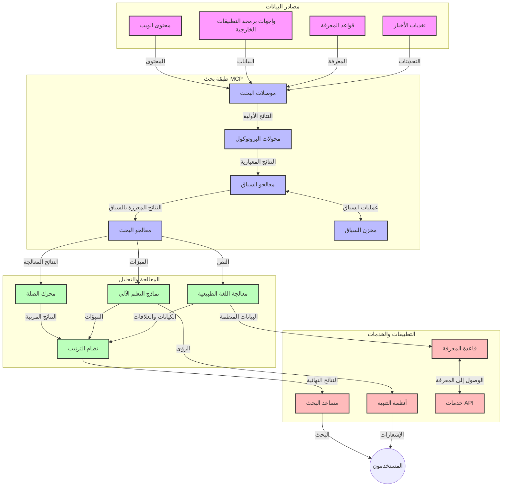
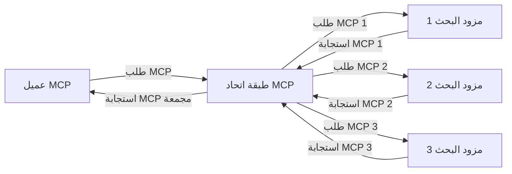
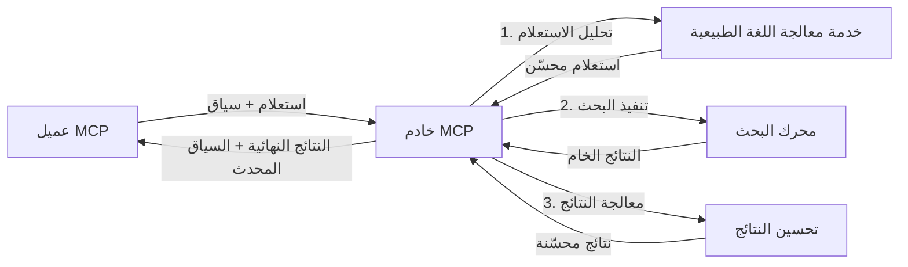

# بروتوكول سياق النموذج للبحث على الويب في الوقت الحقيقي

## نظرة عامة

أصبح البحث على الويب في الوقت الحقيقي أمرًا أساسيًا في بيئة اليوم التي تحركها المعلومات، حيث تحتاج التطبيقات إلى الوصول الفوري إلى معلومات محدثة على الإنترنت لتقديم استجابات دقيقة وفي الوقت المناسب. يمثل بروتوكول سياق النموذج (MCP) تقدمًا كبيرًا في تحسين هذه العمليات البحثية الفورية، من خلال تعزيز كفاءة البحث، والحفاظ على سلامة السياق، وتحسين أداء النظام بشكل عام.

يستعرض هذا الموديول كيف يحول MCP البحث على الويب في الوقت الحقيقي من خلال توفير نهج موحد لإدارة السياق عبر نماذج الذكاء الاصطناعي ومحركات البحث والتطبيقات.

### ما ستتعلمه

في هذا الدليل الشامل، ستتعرف على:

- كيف ينشئ MCP جسرًا سلسًا بين نماذج الذكاء الاصطناعي وقدرات البحث على الويب في الوقت الحقيقي
- أنماط هندسية لتطبيق حلول بحث فعالة وقابلة للتوسع باستخدام MCP
- تقنيات للحفاظ على سياق البحث عبر عدة استعلامات وتفاعلات
- تطبيقات عملية للشفرة البرمجية في بايثون وجافا سكريبت لسيناريوهات بحث متعددة
- طرق لموازنة الصلة والتحديثية والأداء في أنظمة البحث المدعومة بـ MCP

## مقدمة في البحث على الويب في الوقت الحقيقي

البحث على الويب في الوقت الحقيقي هو نهج تقني يمكّن من الاستعلام المستمر، والمعالجة، وتحليل المعلومات المستندة إلى الويب عند نشرها أو تحديثها، ما يسمح للأنظمة بتوفير معلومات جديدة وذات صلة بأقل تأخير ممكن. بخلاف أنظمة البحث التقليدية التي تعمل على بيانات مفهرسة قد تكون قديمة بساعات أو أيام، تعالج عمليات البحث في الوقت الحقيقي البيانات الحية من الويب، مقدمة رؤى ومعلومات تعكس الحالة الحالية للمحتوى على الإنترنت.

### المفاهيم الأساسية للبحث على الويب في الوقت الحقيقي:

- **معالجة الاستعلام المستمرة**: يتم معالجة استعلامات البحث مقابل مصادر بيانات تتحدث باستمرار
- **الأولوية للتحديثية**: تم تصميم الأنظمة لإعطاء الأفضلية للمعلومات الجديدة
- **موازنة الصلة**: الحفاظ على توازن بين الصلة والحداثة
- **الهيكلية القابلة للتوسع**: يجب أن تتحمل الأنظمة أعباء استعلام ومتغيرات بيانات متفاوتة
- **الفهم السياقي**: الحفاظ على سياق المستخدم عبر تكرارات البحث ضروري لتحقيق نتائج ذات معنى
- **إعادة صياغة الاستعلام الديناميكية**: تعديل الاستعلامات بشكل تكيفي بناءً على السياق والنتائج السابقة
- **تكامل متعدد المصادر**: دمج النتائج من مزودي بحث ومصادر ويب متعددة
- **الفهم الدلالي**: معالجة الاستعلامات والمحتوى بناءً على المعنى بدلاً من الكلمات المفتاحية فقط
- **التصنيف في الوقت الحقيقي**: تعديل تصنيفات النتائج باستمرار مع توفر معلومات جديدة

### بروتوكول سياق النموذج والبحث على الويب في الوقت الحقيقي

يعالج بروتوكول سياق النموذج (MCP) العديد من التحديات الحرجة في بيئات البحث على الويب في الوقت الحقيقي:

1. **الحفاظ على سياق البحث**: يقيّم MCP كيفية الحفاظ على السياق عبر مكونات البحث الموزعة، مما يضمن وصول نماذج الذكاء الاصطناعي وعقد المعالجة إلى تاريخ الاستعلامات وتفضيلات المستخدم ذات الصلة.

2. **إدارة الاستعلامات بكفاءة**: من خلال توفير آليات منظمة لنقل السياق، يقلل MCP من عبء تكرار السياق في كل دورة بحث.

3. **القابلية للتشغيل البيني**: ينشئ MCP لغة مشتركة لمشاركة السياق بين تقنيات البحث المختلفة ونماذج الذكاء الاصطناعي، مما يمكن من هياكل أكثر مرونة وقابلة للتوسع.

4. **السياق المحسن للبحث**: يمكن لتنفيذات MCP إعطاء أولوية للعناصر السياقية الأكثر صلة للبحث الفعال، مما يحسن الأداء والدقة.

5. **المعالجة التكيفية للبحث**: عبر إدارة السياق بشكل مناسب من خلال MCP، يمكن لأنظمة البحث تعديل المعالجة ديناميكيًا استنادًا إلى احتياجات المستخدم المتطورة ومشهد المعلومات.

في التطبيقات الحديثة التي تتراوح من تجميع الأخبار إلى مساعدين البحث، يمكّن دمج MCP مع تقنيات البحث على الويب بحثًا أكثر ذكاءً ووعيًا بالسياق يمكنه تقديم نتائج أكثر صلة مع استمرار تفاعلات المستخدم.

## أهداف التعلم

بحلول نهاية هذا الدرس، ستكون قادرًا على:

- فهم أساسيات البحث على الويب في الوقت الحقيقي وتحدياته في التطبيقات الحديثة
- شرح كيف يعزز بروتوكول سياق النموذج (MCP) قدرات البحث على الويب في الوقت الحقيقي
- تنفيذ حلول بحث تعتمد على MCP باستخدام الأُطُر وواجهات برمجة التطبيقات الشائعة
- تصميم ونشر هياكل بحث قابلة للتوسع وعالية الأداء مع MCP
- تطبيق مفاهيم MCP على حالات استخدام متعددة بما في ذلك البحث الدلالي، ومساعدة البحث، والتصفح المدعوم بالذكاء الاصطناعي
- تقييم الاتجاهات الناشئة والابتكارات المستقبلية في تقنيات البحث المعتمدة على MCP
- تطوير أنظمة بحث واعية بالسياق تتعلم من تفاعلات المستخدم
- دمج قدرات البحث على الويب في المساعدين الذكائيين باستخدام بروتوكولات MCP الموحدة
- إنشاء خطوط بحث متعددة المراحل تعمل على تحسين النتائج تدريجيًا بناءً على السياق
- تحسين أداء البحث مع الحفاظ على الوعي الكامل بالسياق

### التعريف والأهمية

يشمل البحث على الويب في الوقت الحقيقي الاستعلام المستمر، والاسترجاع، وتسليم المعلومات المستندة إلى الويب بأقل تأخير ممكن. على عكس محركات البحث التقليدية التي تقوم بفهرسة ومراقبة الويب بصورة دورية، يهدف البحث الفوري إلى إظهار المعلومات بمجرد توفرها، ممكّنًا الوصول الفوري إلى أحدث محتوى.

الخصائص الرئيسية للبحث على الويب في الوقت الحقيقي تشمل:

- **الجِدة**: إعطاء الأولوية للمحتوى والتحديثات الحديثة
- **المعالجة المستمرة**: المراقبة الدائمة للمعلومة الجديدة
- **تكيف الاستعلام**: تحسين استعلامات البحث بناءً على السياق وردود الفعل
- **التسليم الفوري**: توفير نتائج البحث بأقل تأخير
- **الاحتفاظ بالسياق**: البناء على الاستعلامات السابقة لتحسين الصلة

### التحديات في البحث التقليدي على الويب

تواجه منهجيات البحث التقليدية عدة قيود عند تطبيقها على السيناريوهات الفورية:

1. **تفتت السياق**: صعوبة الحفاظ على سياق البحث عبر استعلامات متعددة
2. **جدة المعلومات**: تحديات في الوصول إلى المعلومات الأحدث وإعطائها الأولوية
3. **تعقيد التكامل**: مشكلات في التشغيل البيني بين أنظمة البحث والتطبيقات
4. **قضايا التأخير**: موازنة شمولية البحث مع متطلبات زمن الاستجابة
5. **ضبط الصلة**: ضمان الدقة والملاءمة مع إعطاء الأفضلية للتحديثية

## فهم بروتوكول سياق النموذج (MCP) للبحث

### ما هو MCP في سياقات البحث؟

بروتوكول سياق النموذج (MCP) هو بروتوكول تواصل موحد صمم لتسهيل التفاعل الفعال بين نماذج الذكاء الاصطناعي والتطبيقات. في سياق البحث على الويب في الوقت الحقيقي، يوفر MCP إطارًا لـ:

- الحفاظ على سياق البحث عبر تسلسل الاستعلامات
- توحيد تنسيقات الاستعلامات والنتائج البحثية
- تحسين نقل معلمات البحث والنتائج
- تعزيز التواصل بين النموذج ومحرك البحث

### المكونات الأساسية والهندسة المعمارية

تتكون هندسة MCP للبحث على الويب في الوقت الحقيقي من عدة مكونات أساسية:

1. **معالِجو سياق الاستعلام**: يديرون ويحافظون على سياق البحث عبر استعلامات متعددة
2. **معالِجو البحث**: يعالجون طلبات البحث الواردة باستخدام تقنيات واعية للسياق
3. **محولات البروتوكول**: تحول بين APIs بحث مختلفة مع الحفاظ على السياق
4. **مخزن السياق**: يخزن ويسترجع سجل البحث والتفضيلات بكفاءة
5. **موصلات البحث**: تربط بمحركات بحث مختلفة وواجهات ويب API



### كيف يحسن MCP البحث على الويب في الوقت الحقيقي

يعالج MCP تحديات البحث التقليدي عبر:

- **استمرارية السياق**: الحفاظ على العلاقات بين الاستعلامات عبر جلسة البحث بأكملها
- **النقل المحسن**: تقليل التكرار في معلمات البحث من خلال إدارة السياق الذكية
- **واجهات موحدة**: توفير APIs متناسقة لمكونات البحث
- **تقليل التأخير**: تقليل حمل المعالجة عبر معالجة سياق فعالة
- **تعزيز الصلة**: تحسين صلة البحث من خلال الحفاظ على نية المستخدم عبر استعلامات متعددة

## الدمج والتنفيذ

تتطلب أنظمة البحث على الويب في الوقت الحقيقي تصميمًا معماريًا وتنفيذًا حذرًا للحفاظ على الأداء وسلامة السياق. يقدم بروتوكول سياق النموذج نهجًا موحدًا لدمج نماذج الذكاء الاصطناعي وتقنيات البحث، مما يسمح بخطوط بحث أكثر تعقيدًا ووعيًا بالسياق.

### نظرة عامة على دمج MCP في هندسة البحث

يشمل تطبيق MCP في بيئات البحث على الويب الفوري عدة اعتبارات رئيسية:

1. **تسلسل سياق البحث**: يوفر MCP آليات فعالة لترميز المعلومات السياقية داخل طلبات البحث، مما يضمن أن السياق الأساسي يتبع الاستعلام عبر خط المعالجة. يشمل ذلك تنسيقات تسلسل موحدة ومحسنة للبيانات الوصفية المتعلقة بالبحث.

2. **معالجة بحث حالة الحالة**: يمكن MCP من معالجة أكثر ذكاءً تعتمد على الحالة من خلال الحفاظ على تمثيل سياق ثابت عبر تكرارات البحث. هذا مفيد بشكل خاص في خطوط بحث متعددة المراحل حيث يحسن تحسين السياق النتائج.

3. **توسيع وتكرير الاستعلام**: يمكن لتنفيذات MCP في أنظمة البحث تسهيل توسيع وتكرير الاستعلامات المتقدم بناءً على السياق المتراكم، مما يسمح بنتائج أكثر صلة مع تقدم جلسة البحث.

4. **تخزين مؤقت وترتيب النتائج**: من خلال توحيد إدارة السياق، يساعد MCP في إدارة تخزين مؤقت للنتائج وترتيبها، ما يتيح للمكونات التكيف بناءً على السياق البحثي المتطور.

5. **فيدرالية وتوحيد البحث**: يسهل MCP توحيد البحث عبر عدة مصادر خلفية من خلال توفير تمثيلات منظمة لسياق البحث، مما يمكن من تجميع النتائج بشكل أكثر معنى من مصادر متنوعة.

يخلق تطبيق MCP عبر تقنيات بحث متعددة نهجًا موحدًا لإدارة السياق، مما يقلل الحاجة لكود تكامل مخصص مع تعزيز قدرة النظام على الحفاظ على السياق ذي المغزى مع تطور استعلامات البحث.

### MCP في تطبيقات بحث الويب المختلفة

تتبع هذه الأمثلة المواصفة الحالية لـ MCP التي تركز على بروتوكول JSON-RPC مع آليات نقل مميزة. يوضح الكود كيف يمكنك تنفيذ تكاملات بحث مخصصة مع ضمان التوافق الكامل مع بروتوكول MCP.


<details>
<summary>تنفيذ بايثون مع API بحث عام</summary>

```python
import asyncio
import json
import aiohttp
from typing import Dict, Any, Optional, List
from contextlib import asynccontextmanager
from collections.abc import AsyncIterator

# استيراد مكتبات MCP القياسية
from mcp.client.session import ClientSession
from mcp.client.streamable_http import streamablehttp_client
from mcp.types import TextContent, CreateMessageRequestParams, CreateMessageResult
from mcp.server.fastmcp import FastMCP

# إنشاء خادم FastMCP للبحث عبر الويب
search_server = FastMCP("WebSearch")

# صنف لمعالجة عمليات البحث عبر الويب
class WebSearchHandler:
    def __init__(self, api_endpoint: str, api_key: str):
        self.api_endpoint = api_endpoint
        self.api_key = api_key
        self.session = None
        
    async def initialize(self):
        """Initialize the HTTP session"""
        self.session = aiohttp.ClientSession(
            headers={"Authorization": f"Bearer {self.api_key}"}
        )
    
    async def close(self):
        """Close the HTTP session"""
        if self.session:
            await self.session.close()
            
    async def perform_search(self, query: str, max_results: int = 5, 
                           include_domains: List[str] = None, 
                           exclude_domains: List[str] = None,
                           time_period: str = "any") -> Dict[str, Any]:
        """Perform web search using the search API"""
        # بناء معايير البحث
        search_params = {
            "q": query,
            "limit": max_results,
            "time": time_period
        }
        
        if include_domains:
            search_params["site"] = ",".join(include_domains)
            
        if exclude_domains:
            search_params["exclude_site"] = ",".join(exclude_domains)
        
        # تنفيذ طلب البحث
        try:
            async with self.session.get(
                self.api_endpoint,
                params=search_params
            ) as response:
                if response.status != 200:
                    error_text = await response.text()
                    raise Exception(f"Search API error: {response.status} - {error_text}")
                
                search_data = await response.json()
                
                # تحويل استجابة API الخاصة إلى صيغة قياسية
                results = []
                for item in search_data.get("results", []):
                    results.append({
                        "title": item.get("title", ""),
                        "url": item.get("url", ""),
                        "snippet": item.get("snippet", ""),
                        "date": item.get("published_date", ""),
                        "source": item.get("source", "")
                    })
                
                return {
                    "query": query,
                    "totalResults": len(results),
                    "results": results
                }
        except Exception as e:
            print(f"Search API request error: {e}")
            raise

# تهيئة معالج البحث
search_handler = WebSearchHandler(
    api_endpoint="https://api.search-service.example/search",
    api_key="your-api-key-here"
)

# إعداد فترة الحياة لإدارة معالج البحث
@asyncio.asynccontextmanager
async def app_lifespan(server: FastMCP):
    """Manage application lifecycle"""
    await search_handler.initialize()
    try:
        yield {"search_handler": search_handler}
    finally:
        await search_handler.close()

# تعيين فترة الحياة للخادم
search_server = FastMCP("WebSearch", lifespan=app_lifespan)

# تسجيل أداة بحث عبر الويب
@search_server.tool()
async def web_search(query: str, max_results: int = 5, 
                   include_domains: List[str] = None,
                   exclude_domains: List[str] = None,
                   time_period: str = "any") -> Dict[str, Any]:
    """
    Search the web for information
    
    Args:
        query: The search query
        max_results: Maximum number of results to return (default: 5)
        include_domains: List of domains to include in search results
        exclude_domains: List of domains to exclude from search results
        time_period: Time period for results ("day", "week", "month", "any")
        
    Returns:
        Dictionary containing search results
    """
    ctx = search_server.get_context()
    search_handler = ctx.request_context.lifespan_context["search_handler"]
    
    results = await search_handler.perform_search(
        query=query,
        max_results=max_results,
        include_domains=include_domains,
        exclude_domains=exclude_domains,
        time_period=time_period
    )
    
    return results

# مثال على استخدام العميل
async def client_example():
    # الاتصال بخادم البحث باستخدام نقل HTTP قابلة للبث
    async with streamablehttp_client("http://localhost:8000/mcp") as (read, write, _):
        async with ClientSession(read, write) as session:
            # تهيئة الاتصال
            await session.initialize()
            
            # استدعاء أداة web_search
            search_results = await session.call_tool(
                "web_search", 
                {
                    "query": "latest developments in AI and Model Context Protocol",
                    "max_results": 5,
                    "time_period": "day",
                    "include_domains": ["github.com", "microsoft.com"]
                }
            )
            
            print(f"Search results: {search_results}")

# مثال على تنفيذ الخادم
if __name__ == "__main__":
    # تشغيل الخادم باستخدام نقل HTTP قابلة للبث
    search_server.run(transport="streamable-http")
```
</details> 

<details>
<summary>تنفيذ جافا سكريبت مع بحث قائم على المتصفح</summary>

```javascript
// تنفيذ خادم MCP للبحث على الويب
import { McpServer, ResourceTemplate } from '@modelcontextprotocol/sdk/server/mcp.js';
import { StreamableHTTPServerTransport } from '@modelcontextprotocol/sdk/server/streamableHttp.js';
import { z } from 'zod';

// إنشاء خادم MCP للبحث على الويب
const searchServer = new McpServer({
    name: "BrowserSearch",
    description: "A server that provides web search capabilities"
});

// فئة خدمة البحث
class SearchService {
    constructor(searchApiUrl, apiKey) {
        this.searchApiUrl = searchApiUrl;
        this.apiKey = apiKey;
    }

    async performSearch(parameters) {
        const {
            query = '',
            maxResults = 5,
            includeDomains = [],
            excludeDomains = [],
            timePeriod = 'any'
        } = parameters;
        
        // بناء عنوان URL للبحث مع المعلمات
        const url = new URL(this.searchApiUrl);
        url.searchParams.append('q', query);
        url.searchParams.append('limit', maxResults);
        url.searchParams.append('time', timePeriod);
        
        if (includeDomains.length > 0) {
            url.searchParams.append('site', includeDomains.join(','));
        }
        
        if (excludeDomains.length > 0) {
            url.searchParams.append('exclude_site', excludeDomains.join(','));
        }
        
        try {
            const response = await fetch(url.toString(), {
                method: 'GET',
                headers: {
                    'Authorization': `Bearer ${this.apiKey}`,
                    'Content-Type': 'application/json'
                }
            });
            
            if (!response.ok) {
                const errorText = await response.text();
                throw new Error(`Search API error: ${response.status} - ${errorText}`);
            }
            
            const searchData = await response.json();
            
            // تحويل استجابة API الخاصة إلى تنسيق قياسي
            const results = searchData.results?.map(item => ({
                title: item.title || '',
                url: item.url || '',
                snippet: item.snippet || '',
                date: item.published_date || '',
                source: item.source || ''
            })) || [];
            
            return {
                query,
                totalResults: results.length,
                results
            };
        } catch (error) {
            console.error('Search API request error:', error);
            throw error;
        }
    }
}

// تهيئة خدمة البحث
const searchService = new SearchService(
    'https://api.search-service.example/search',
    'your-api-key-here'
);

// إعداد موفر السياق للخادم
searchServer.setContextProvider(() => {
    return {
        searchService
    };
});

// تسجيل أداة البحث على الويب
searchServer.tool({
    name: 'web_search',
    description: 'Search the web for information',
    parameters: {
        type: 'object',
        properties: {
            query: {
                type: 'string',
                description: 'The search query'
            },
            maxResults: {
                type: 'integer',
                description: 'Maximum number of results to return',
                default: 5
            },
            includeDomains: {
                type: 'array',
                items: { type: 'string' },
                description: 'List of domains to include in search results'
            },
            excludeDomains: {
                type: 'array',
                items: { type: 'string' },
                description: 'List of domains to exclude from search results'
            },
            timePeriod: {
                type: 'string',
                description: 'Time period for results',
                enum: ['day', 'week', 'month', 'any'],
                default: 'any'
            }
        },
        required: ['query']
    },
    handler: async (params, context) => {
        const { searchService } = context;
        return await searchService.performSearch(params);
    }
});

// مثال على كود العميل للاتصال بخادم البحث
import { Client } from '@modelcontextprotocol/sdk/client/index.js';
import { StreamableHTTPClientTransport } from '@modelcontextprotocol/sdk/client/streamableHttp.js';

async function connectToSearchServer() {
    // الاتصال بخادم البحث
    const transport = new StreamableHTTPClientTransport(
        new URL('http://localhost:8000/mcp')
    );
    
    const client = new Client({
        name: 'search-client',
        version: '1.0.0'
    });
    
    await client.connect(transport);
    
    // تنفيذ أداة البحث
    const searchResults = await client.callTool({
        name: 'web_search',
        arguments: {
            query: 'Model Context Protocol implementation examples',
            maxResults: 10,
            timePeriod: 'week',
            includeDomains: ['github.com', 'docs.microsoft.com']
        }
    });
    
    console.log('Search results:', searchResults);
    
    // التنظيف
    await client.disconnect();
}

// بدء الخادم
const transport = new StreamableHTTPServerTransport();
await searchServer.connect(transport);
console.log('Search server running at http://localhost:8000/mcp');

// في عملية منفصلة أو بعد بدء الخادم
// connectToSearchServer().catch(console.error);
```
</details> 


## إخلاء مسؤولية أمثلة الشفرة

> **ملاحظة مهمة**: الأمثلة البرمجية أدناه توضح تكامل بروتوكول سياق النموذج (MCP) مع وظيفة البحث على الويب. رغم اتباعها لأنماط وهياكل SDKs الرسمية لـ MCP، فقد بسطت لأغراض تعليمية.
> 
> توضح هذه الأمثلة:
> 
> 1. **تنفيذ بايثون**: تنفيذ خادم FastMCP يوفر أداة بحث على الويب ويرتبط بواجهة برمجة تطبيقات بحث خارجية. يوضح هذا المثال إدارة دورة حياة مناسبة، معالجة السياق، وتنفيذ الأداة باتباع أنماط [SDK الرسمي لـ MCP بلغة بايثون](https://github.com/modelcontextprotocol/python-sdk). يستخدم الخادم وسيلة نقل HTTP القابلة للبث الموصى بها والتي حلّت محل النقل القديم SSE للنشر في بيئات الإنتاج.
> 
> 2. **تنفيذ جافا سكريبت**: تنفيذ TypeScript/JavaScript باستخدام نمط FastMCP من [SDK الرسمي لـ MCP بلغة TypeScript](https://github.com/modelcontextprotocol/typescript-sdk) لإنشاء خادم بحث مع تعريفات أدوات واتصالات عملاء مناسبة. يتبع أحدث الأنماط الموصى بها لإدارة الجلسة والحفاظ على السياق.
> 
> تتطلب هذه الأمثلة معالجة أخطاء إضافية، مصادقة، وكود تكامل API محدد للاستخدام الإنتاجي. نقاط نهاية API البحث المعروضة (`https://api.search-service.example/search`) هي نماذج ولا بد من استبدالها بنقاط نهاية خدمة البحث الفعلية.
> 
> لمزيد من التفاصيل حول التنفيذ وأحدث الأساليب، يرجى الرجوع إلى [المواصفة الرسمية لـ MCP](https://spec.modelcontextprotocol.io/) ووثائق SDK.

## المفاهيم الأساسية

### إطار عمل بروتوكول سياق النموذج (MCP)

في جوهره، يوفر بروتوكول سياق النموذج طريقة موحدة لنماذج الذكاء الاصطناعي والتطبيقات والخدمات لتبادل السياق. في البحث على الويب في الوقت الحقيقي، يعد هذا الإطار أساسيًا لإنشاء تجارب بحث متماسكة متعددة الأدوار. تشمل المكونات الرئيسية:

1. **هندسة العميل-الخادم**: يؤسس MCP فصلًا واضحًا بين عملاء البحث (طالبوا الخدمة) وخوادم البحث (المزودون)، مما يسمح بنماذج نشر مرنة.

2. **التواصل عبر JSON-RPC**: يستخدم البروتوكول JSON-RPC لتبادل الرسائل، مما يجعله متوافقًا مع تقنيات الويب وسهل التنفيذ عبر منصات مختلفة.

3. **إدارة السياق**: يحدد MCP طرقًا منظمة للحفاظ على السياق وتحديثه واستخدامه عبر تفاعلات متعددة.

4. **تعريفات الأدوات**: يتم عرض قدرات البحث كأدوات موحدة ذات معلمات وقيم إرجاع محددة جيدًا.

5. **دعم البث**: يدعم البروتوكول تدفق النتائج، وهو أمر ضروري للبحث في الوقت الحقيقي حيث قد تصل النتائج تدريجيًا.

### أنماط دمج البحث على الويب

عند دمج MCP مع البحث على الويب، تبرز عدة أنماط:

#### 1. دمج مزود البحث المباشر


  
في هذا النمط، يتصل خادم MCP مباشرة بواحدة أو أكثر من واجهات برمجة تطبيقات البحث، مترجمًا طلبات MCP إلى مكالمات API محددة وتنسيق النتائج كردود MCP.

#### 2. البحث الموحد مع الحفاظ على السياق


  
يوزع هذا النمط استعلامات البحث عبر عدة مزودي بحث متوافقين مع MCP، قد يتخصص كل منهم في أنواع مختلفة من المحتوى أو قدرات البحث، مع الحفاظ على سياق موحد.

#### 3. سلسلة البحث المعززة بالسياق


  
في هذا النمط، تنقسم عملية البحث إلى مراحل متعددة، مع إثراء السياق في كل خطوة مما يؤدي إلى نتائج ذات صلة متزايدة تدريجيًا.

### مكونات سياق البحث

في البحث على الويب المبني على MCP، يشمل السياق عادةً:

- **تاريخ الاستعلام**: استعلامات البحث السابقة في الجلسة
- **تفضيلات المستخدم**: اللغة، المنطقة، إعدادات البحث الآمن
- **تاريخ التفاعل**: النتائج التي نقر عليها المستخدم، الوقت المنقضي على النتائج
- **معلمات البحث**: الفلاتر، أوامر الفرز، وغيرها من معدلات البحث
- **معرفة النطاق**: سياق خاص بالموضوع ذي الصلة بالبحث
- **السياق الزمني**: عوامل الصلة المبنية على الوقت
- **تفضيلات المصدر**: مصادر المعلومات الموثوقة أو المفضلة

## حالات الاستخدام والتطبيقات

### البحث وجمع المعلومات

يعزز MCP سير عمل البحث من خلال:

- الحفاظ على سياق البحث عبر الجلسات البحثية
- تمكين استعلامات أكثر تعقيدًا وملاءمة سياقيًا
- دعم فيدرالية البحث متعددة المصادر
- تسهيل استخراج المعرفة من نتائج البحث

### مراقبة الأخبار والاتجاهات في الوقت الحقيقي

يوفر البحث المدعوم بـ MCP مزايا لمراقبة الأخبار:

- اكتشاف الأخبار الناشئة في وقت قريب من الوقت الحقيقي
- تصفية سياقية للمعلومات ذات الصلة
- متابعة المواضيع والكيانات عبر مصادر متعددة
- تنبيهات إخبارية مخصصة بناءً على سياق المستخدم

### التصفح والبحث المدعومان بالذكاء الاصطناعي

يخلق MCP إمكانيات جديدة للتصفح المدعوم بالذكاء الاصطناعي:

- اقتراحات بحث سياقية بناءً على نشاط المتصفح الحالي
- دمج سلس للبحث على الويب مع المساعدين المدعومين بنماذج اللغة الكبيرة
- تحسين البحث متعدد الدور مع الحفاظ على السياق
- تعزيز التحقق من الحقائق والمعلومات

## الاتجاهات والابتكارات المستقبلية

### تطور MCP في بحث الويب

نتطلع إلى أن يتطور MCP ليعالج:
- **البحث متعدد الوسائط**: دمج البحث النصي والصوري والصوتي والفيديو مع الحفاظ على السياق  
- **البحث اللامركزي**: دعم النظم البيئية للبحث الموزع والاتحادي  
- **خصوصية البحث**: آليات بحث تحافظ على الخصوصية مع وعي بالسياق  
- **فهم الاستعلام**: التحليل الدلالي العميق لاستعلامات البحث بلغة طبيعية  

### التقدمات المحتملة في التكنولوجيا

التقنيات الناشئة التي ستشكّل مستقبل بحث MCP:

1. **هندسات البحث العصبية**: أنظمة بحث قائمة على التضمين مخصصة لـ MCP  
2. **سياق البحث المخصص**: تعلم أنماط بحث المستخدم الفردية عبر الزمن  
3. **تكامل مخطط المعرفة**: بحث سياقي معزز عبر مخططات المعرفة الخاصة بالمجال  
4. **السياق متعدد الوسائط**: الحفاظ على السياق عبر مختلف أوضاع البحث  

## تمارين تطبيقية

### التمرين 1: إعداد مسار بحث MCP أساسي

في هذا التمرين، ستتعلم كيف:  
- تهيئة بيئة بحث MCP أساسية  
- تنفيذ معالجات السياق لبحث الويب  
- اختبار والتحقق من حفظ السياق عبر تكرارات البحث  

### التمرين 2: بناء مساعد بحث باستخدام MCP

إنشاء تطبيق كامل يقوم بـ:  
- معالجة أسئلة البحث بلغة طبيعية  
- إجراء عمليات بحث على الويب مع وعي بالسياق  
- تلخيص المعلومات من مصادر متعددة  
- عرض نتائج البحث منظمة  

### التمرين 3: تنفيذ اتحاد بحث متعدد المصادر مع MCP

تمرين متقدم يغطي:  
- إرسال الاستعلامات مع وعي بالسياق إلى عدة محركات بحث  
- تصنيف وتجميع النتائج  
- إزالة التكرار السياقي لنتائج البحث  
- التعامل مع بيانات وصفية خاصة بالمصادر  

## موارد إضافية

- [مواصفات بروتوكول سياق النموذج](https://spec.modelcontextprotocol.io/) - المواصفة الرسمية ووثائق البروتوكول التفصيلية  
- [توثيق بروتوكول سياق النموذج](https://modelcontextprotocol.io/) - دروس تفصيلية وأدلة تنفيذ  
- [MCP Python SDK](https://github.com/modelcontextprotocol/python-sdk) - تنفيذ بايثون الرسمي لبروتوكول MCP  
- [MCP TypeScript SDK](https://github.com/modelcontextprotocol/typescript-sdk) - تنفيذ TypeScript الرسمي لبروتوكول MCP  
- [خوادم MCP المرجعية](https://github.com/modelcontextprotocol/servers) - تطبيقات مرجعية لخوادم MCP  
- [توثيق Bing Web Search API](https://learn.microsoft.com/en-us/bing/search-apis/bing-web-search/overview) - واجهة برمجة تطبيقات بحث الويب من مايكروسوفت  
- [Google Custom Search JSON API](https://developers.google.com/custom-search/v1/overview) - محرك بحث قابل للبرمجة من جوجل  
- [توثيق SerpAPI](https://serpapi.com/search-api) - واجهة برمجة تطبيقات صفحة نتائج محرك البحث  
- [توثيق Meilisearch](https://www.meilisearch.com/docs) - محرك بحث مفتوح المصدر  
- [توثيق Elasticsearch](https://www.elastic.co/guide/index.html) - محرك بحث وتحليلات موزعة  
- [توثيق LangChain](https://python.langchain.com/docs/get_started/introduction) - بناء التطبيقات باستخدام نماذج اللغة الكبيرة  

## نتائج التعلم

بإكمال هذه الوحدة، ستتمكن من:  

- فهم أساسيات البحث في الويب في الوقت الحقيقي وتحدياته  
- شرح كيف يعزز بروتوكول سياق النموذج (MCP) قدرات البحث في الويب في الوقت الحقيقي  
- تطبيق حلول البحث القائمة على MCP باستخدام الأُطُر والواجهات البرمجية الشائعة  
- تصميم ونشر هندسات بحث قابلة للتوسع وعالية الأداء مع MCP  
- تطبيق مفاهيم MCP لمجالات استخدام متنوعة تشمل البحث الدلالي، مساعدة البحث، وتصفح معزز بالذكاء الاصطناعي  
- تقييم الاتجاهات الناشئة والابتكارات المستقبلية في تقنيات البحث المبنية على MCP  

### اعتبارات الثقة والسلامة

عند تنفيذ حلول بحث الويب المعتمدة على MCP، تذكر المبادئ الهامة التالية من مواصفة MCP:  

1. **موافقة المستخدم والتحكم**: يجب على المستخدمين الموافقة صراحة وفهم كل عمليات الوصول إلى البيانات والتشغيل. هذا مهم بشكل خاص لتطبيقات بحث الويب التي قد تصل إلى مصادر بيانات خارجية.  

2. **خصوصية البيانات**: ضمان معالجة مناسبة لاستعلامات البحث ونتائجها، خاصةً إذا احتوت على معلومات حساسة. تطبيق ضوابط وصول مناسبة لحماية بيانات المستخدم.  

3. **أمان الأدوات**: تنفيذ تفويض وتحقق مناسب للأدوات البحثية، لأنها تمثل مخاطر أمنية محتملة عبر تنفيذ أكواد عشوائية. يجب اعتبار وصف سلوك الأدوات غير موثوق إلا إذا تم الحصول عليه من خادم موثوق.  

4. **توثيق واضح**: توفير توثيق واضح حول القدرات والقيود واعتبارات الأمان لتنفيذ البحث المعتمد على MCP، وفقًا لإرشادات التنفيذ في مواصفة MCP.  

5. **تدفقات موافقة قوية**: بناء تدفقات موافقة وتفويض قوية تشرح بوضوح وظيفة كل أداة قبل تفويض استخدامها، خاصة للأدوات التي تتفاعل مع موارد ويب خارجية.  

للحصول على التفاصيل الكاملة حول اعتبارات الأمان والثقة في MCP، راجع [التوثيق الرسمي](https://modelcontextprotocol.io/specification/2025-11-25/basic/security_best_practices).  

## التالي ماذا؟

- [5.12 توثيق هوية Entra لخوادم بروتوكول سياق النموذج](../mcp-security-entra/README.md)

---

<!-- CO-OP TRANSLATOR DISCLAIMER START -->
**تنويه**:
تمت ترجمة هذا المستند باستخدام خدمة الترجمة بالذكاء الاصطناعي [Co-op Translator](https://github.com/Azure/co-op-translator). بينما نسعى للدقة، يرجى العلم أن الترجمات الآلية قد تحتوي على أخطاء أو عدم دقة. يجب اعتبار المستند الأصلي بلغته الأصلية المصدر الرسمي والمعتمد. للمعلومات الهامة، يُنصح بالاستعانة بترجمة بشرية محترفة. نحن غير مسؤولين عن أي سوء فهم أو تفسير ناتج عن استخدام هذه الترجمة.
<!-- CO-OP TRANSLATOR DISCLAIMER END -->