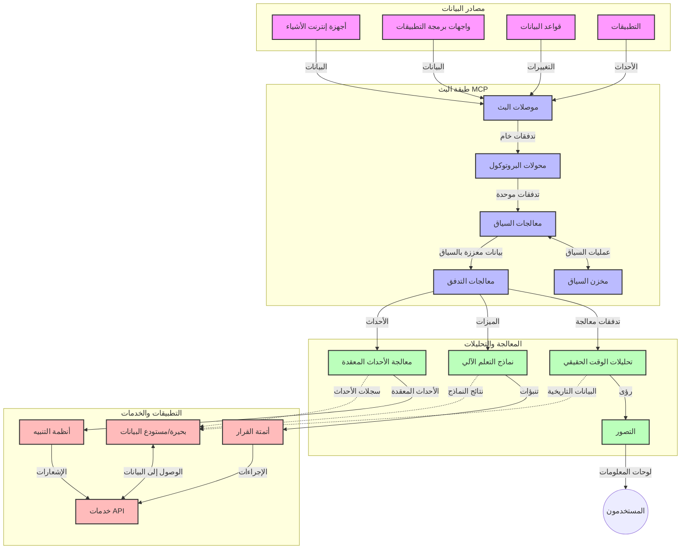

# بروتوكول سياق النموذج لتدفق البيانات في الوقت الحقيقي

## نظرة عامة

أصبح تدفق البيانات في الوقت الحقيقي أمرًا أساسيًا في عالم اليوم المدفوع بالبيانات، حيث تحتاج الشركات والتطبيقات إلى الوصول الفوري إلى المعلومات لاتخاذ قرارات في الوقت المناسب. يمثل بروتوكول سياق النموذج (MCP) تقدمًا كبيرًا في تحسين هذه العمليات الخاصة بالتدفق في الوقت الحقيقي، مما يعزز كفاءة معالجة البيانات، ويحافظ على تكامل السياق، ويحسن أداء النظام بشكل عام.

يستكشف هذا الوحدة كيف يحول MCP تدفق البيانات في الوقت الحقيقي من خلال تقديم نهج موحد لإدارة السياق عبر نماذج الذكاء الاصطناعي، ومنصات التدفق، والتطبيقات.

## مقدمة في تدفق البيانات في الوقت الحقيقي

تدفق البيانات في الوقت الحقيقي هو نموذج تكنولوجي يتيح نقل البيانات ومعالجتها وتحليلها بشكل مستمر أثناء توليدها، مما يسمح للأنظمة بالتفاعل فورًا مع المعلومات الجديدة. بخلاف معالجة الدُفعات التقليدية التي تعمل على مجموعات بيانات ثابتة، تقوم أنظمة التدفق بمعالجة البيانات أثناء تحركها، وتقديم رؤى وإجراءات بأدنى تأخير ممكن.

### المفاهيم الأساسية لتدفق البيانات في الوقت الحقيقي:

- **تدفق بيانات مستمر**: تتم معالجة البيانات على شكل تيار مستمر وغير منقطع من الأحداث أو السجلات.
- **معالجة بزمن تأخير منخفض**: تم تصميم الأنظمة لتقليل الوقت بين توليد البيانات ومعالجتها.
- **القابلية للتوسع**: يجب أن تتعامل هياكل التدفق مع أحجام وسرعات بيانات متغيرة.
- **تحمل الأخطاء**: يجب أن تكون الأنظمة مقاومة للأعطال لضمان تدفق البيانات بدون انقطاع.
- **المعالجة الحالة**: الحفاظ على السياق عبر الأحداث أمر حيوي للتحليل ذي المعنى.

### بروتوكول سياق النموذج وتدفق البيانات في الوقت الحقيقي

يعالج بروتوكول سياق النموذج (MCP) عدة تحديات حرجة في بيئات التدفق في الوقت الحقيقي:

1. **استمرارية السياق**: يقوم MCP بتوحيد طريقة الحفاظ على السياق عبر مكونات التدفق الموزعة، مما يضمن أن نماذج الذكاء الاصطناعي وعقد المعالجة لديها وصول إلى السياق التاريخي والبيئي ذي الصلة.

2. **إدارة الحالة الفعالة**: من خلال توفير آليات منظمة لنقل السياق، يقلل MCP من العبء على إدارة الحالة في خطوط أنابيب التدفق.

3. **التشغيل البيني**: يخلق MCP لغة مشتركة لمشاركة السياق بين تقنيات التدفق المتنوعة ونماذج الذكاء الاصطناعي، مما يمكّن من بنى أكثر مرونة وقابلية للتوسع.

4. **السياق المحسن للتدفق**: يمكن لتطبيقات MCP أن تعطي أولوية لعناصر السياق الأكثر صلة باتخاذ القرارات في الوقت الحقيقي، مما يحسن الأداء والدقة معًا.

5. **المعالجة التكيفية**: من خلال إدارة سياق مناسبة عبر MCP، يمكن لأنظمة التدفق تعديل المعالجة ديناميكيًا بناءً على الظروف والأنماط المتغيرة في البيانات.

في التطبيقات الحديثة التي تتراوح من شبكات أجهزة إنترنت الأشياء إلى منصات التداول المالي، يتيح دمج MCP مع تقنيات التدفق معالجة أكثر ذكاءً ووعيًا بالسياق يمكنها الاستجابة بشكل مناسب للحالات المعقدة والمتطورة في الوقت الحقيقي.

## أهداف التعلم

بحلول نهاية هذا الدرس، ستكون قادرًا على:

- فهم أساسيات تدفق البيانات في الوقت الحقيقي والتحديات المرتبطة به
- شرح كيف يعزز بروتوكول سياق النموذج (MCP) تدفق البيانات في الوقت الحقيقي
- تنفيذ حلول تدفق تعتمد على MCP باستخدام أُطُر شهيرة مثل Kafka و Pulsar
- تصميم ونشر هياكل تدفق عالية الأداء وقادرة على تحمل الأخطاء باستخدام MCP
- تطبيق مفاهيم MCP على حالات استخدام إنترنت الأشياء والتداول المالي والتحليل المدفوع بالذكاء الاصطناعي
- تقييم الاتجاهات الناشئة والابتكارات المستقبلية في تقنيات التدفق المعتمدة على MCP

### التعريف والأهمية

يتضمن تدفق البيانات في الوقت الحقيقي التوليد والمعالجة والتسليم المستمر للبيانات بأدنى زمن تأخير. بخلاف معالجة الدُفعات، حيث يتم جمع البيانات ومعالجتها في مجموعات، يتم معالجة بيانات التدفق تدريجيًا عند وصولها، مما يتيح الحصول على رؤى وإجراءات فورية.

الخصائص الأساسية لتدفق البيانات في الوقت الحقيقي تشمل:

- **زمن تأخير منخفض**: معالجة وتحليل البيانات خلال ميلي ثانية إلى ثوانٍ
- **تدفق مستمر**: تيارات بيانات غير منقطعة من مصادر متعددة
- **معالجة فورية**: تحليل البيانات أثناء وصولها بدلاً من المعالجة بالجُمل
- **هندسة قائمة على الأحداث**: الاستجابة للأحداث فور حدوثها

### التحديات في تدفق البيانات التقليدي

تواجه طرق تدفق البيانات التقليدية عدة قيود:

1. **فقدان السياق**: صعوبة الحفاظ على السياق عبر أنظمة موزعة
2. **مشاكل القابلية للتوسع**: تحديات في التعامل مع حجم عالي وسرعة بيانات كبيرة
3. **تعقيد التكامل**: مشكلات في التشغيل البيني بين الأنظمة المختلفة
4. **إدارة زمن التأخير**: التوازن بين كمية البيانات المعالجة ووقت المعالجة
5. **اتساق البيانات**: ضمان دقة واكتمال البيانات عبر مجرى التدفق

## فهم بروتوكول سياق النموذج (MCP)

### ما هو MCP؟

بروتوكول سياق النموذج (MCP) هو بروتوكول اتصال موحد مصمم لتسهيل التفاعل الفعال بين نماذج الذكاء الاصطناعي والتطبيقات. في سياق تدفق البيانات في الوقت الحقيقي، يوفر MCP إطارًا لـ:

- الحفاظ على السياق طوال خط أنابيب البيانات
- توحيد صيغ تبادل البيانات
- تحسين نقل مجموعات البيانات الكبيرة
- تعزيز التواصل بين النموذج ونموذج آخر أو بين النموذج والتطبيق

### المكونات الأساسية والهندسة

يتكون هيكل MCP لتدفق البيانات في الوقت الحقيقي من عدة مكونات رئيسية:

1. **معالجو السياق**: يديرون ويحافظون على المعلومات السياقية عبر خط أنابيب التدفق
2. **معالجو التدفق**: يعالجون تدفقات البيانات الواردة باستخدام تقنيات واعية بالسياق
3. **محولات البروتوكول**: تحول بين بروتوكولات التدفق المختلفة مع الحفاظ على السياق
4. **مخزن السياق**: يخزن ويسترجع المعلومات السياقية بكفاءة
5. **موصلات التدفق**: تتصل بمنصات التدفق المختلفة (Kafka، Pulsar، Kinesis، وما إلى ذلك)



### كيف يحسن MCP التعامل مع البيانات في الوقت الحقيقي

يعالج MCP تحديات التدفق التقليدية من خلال:

- **تكامل سياقي**: الحفاظ على العلاقات بين نقاط البيانات عبر خط الأنابيب بأكمله
- **نقل محسن**: تقليل التكرار في تبادل البيانات عبر إدارة سياق ذكية
- **واجهات موحدة**: توفير واجهات برمجة تطبيقات متسقة لمكونات التدفق
- **تقليل زمن التأخير**: تقليل عبء المعالجة من خلال إدارة سياق فعالة
- **زيادة القابلية للتوسع**: دعم التوسع الأفقي مع الحفاظ على السياق

## التكامل والتنفيذ

تتطلب أنظمة تدفق البيانات في الوقت الحقيقي تصميمًا معماريًا وتنفيذًا دقيقين للحفاظ على كل من الأداء وتكامل السياق. يقدم بروتوكول سياق النموذج نهجًا موحدًا لدمج نماذج الذكاء الاصطناعي وتقنيات التدفق، مما يسمح بخطوط معالجة أكثر تطورًا ووعيًا بالسياق.

### نظرة عامة على تكامل MCP في هياكل التدفق

يتضمن تنفيذ MCP في بيئات التدفق في الوقت الحقيقي عدة اعتبارات مهمة:

1. **تسلسل السياق ونقله**: يوفر MCP آليات فعالة لترميز المعلومات السياقية داخل حزم بيانات التدفق، مما يضمن أن السياق الضروري يتبع البيانات خلال خط المعالجة. يشمل ذلك صيغ تسلسل موحدة محسنة لنقل التدفق.

2. **معالجة التدفق الحالة**: يمكّن MCP معالجة حالة أكثر ذكاءً من خلال الحفاظ على تمثيل سياقي متسق عبر عقد المعالجة. وهذا ذو قيمة خاصة في البنى الموزعة حيث تكون إدارة الحالة تحديًا تقليديًا.

3. **وقت الحدث مقابل وقت المعالجة**: يجب على تطبيقات MCP في أنظمة التدفق معالجة التحدي الشائع في التمييز بين وقت وقوع الأحداث ووقت معالجتها. يمكن للبروتوكول تضمين سياق زمني يحافظ على دلالة وقت الحدث.

4. **إدارة الضغط العكسي**: من خلال توحيد معالجة السياق، يساعد MCP في إدارة الضغط العكسي في أنظمة التدفق، مما يسمح للمكونات بالإبلاغ عن قدرات معالجتها وضبط التدفق وفقًا لذلك.

5. **تجزئة وتجزئة السياق**: يسهل MCP عمليات النوافذ المعقدة من خلال توفير تمثيلات منظمة للسياقات الزمنية والعلاقات، مما يمكّن من تجميعات أكثر معنى عبر تدفقات الأحداث.

6. **المعالجة ذات مرة بالضبط**: في أنظمة التدفق التي تتطلب ضمان المعالجة "مرة واحدة بالضبط"، يمكن لـ MCP دمج بيانات وصفية للعملية لمساعدة في تتبع والتحقق من حالة المعالجة عبر المكونات الموزعة.

إن تنفيذ MCP عبر تقنيات التدفق المختلفة يخلق نهجًا موحدًا لإدارة السياق، مما يقلل الحاجة إلى شفرة تكامل مخصصة مع تعزيز قدرة النظام على الحفاظ على سياق ذي معنى أثناء تدفق البيانات عبر خط الأنابيب.

### MCP في أُطُر تدفق البيانات المختلفة

تتبع هذه الأمثلة مواصفات MCP الحالية التي تركز على بروتوكول JSON-RPC مع آليات نقل مميزة. يوضح الكود كيف يمكنك تنفيذ ناقلات مخصصة تدمج منصات التدفق مثل Kafka و Pulsar مع الحفاظ على التوافق الكامل مع بروتوكول MCP.

تم تصميم الأمثلة لتوضح كيفية دمج منصات التدفق مع MCP لتوفير معالجة بيانات في الوقت الحقيقي مع الحفاظ على الوعي بالسياق الذي يشكل جوهر MCP. هذا النهج يضمن أن عينات الكود تعكس بدقة الحالة الراهنة لمواصفات MCP اعتبارًا من يونيو 2025.

يمكن دمج MCP مع أُطُر التدفق الشهيرة بما في ذلك:

#### دمج Apache Kafka

```python
import asyncio
import json
from typing import Dict, Any, Optional
from confluent_kafka import Consumer, Producer, KafkaError
from mcp.client import Client, ClientCapabilities
from mcp.core.message import JsonRpcMessage
from mcp.core.transports import Transport

# فئة النقل المخصصة لربط MCP مع Kafka
class KafkaMCPTransport(Transport):
    def __init__(self, bootstrap_servers: str, input_topic: str, output_topic: str):
        self.bootstrap_servers = bootstrap_servers
        self.input_topic = input_topic
        self.output_topic = output_topic
        self.producer = Producer({'bootstrap.servers': bootstrap_servers})
        self.consumer = Consumer({
            'bootstrap.servers': bootstrap_servers,
            'group.id': 'mcp-client-group',
            'auto.offset.reset': 'earliest'
        })
        self.message_queue = asyncio.Queue()
        self.running = False
        self.consumer_task = None
        
    async def connect(self):
        """Connect to Kafka and start consuming messages"""
        self.consumer.subscribe([self.input_topic])
        self.running = True
        self.consumer_task = asyncio.create_task(self._consume_messages())
        return self
        
    async def _consume_messages(self):
        """Background task to consume messages from Kafka and queue them for processing"""
        while self.running:
            try:
                msg = self.consumer.poll(1.0)
                if msg is None:
                    await asyncio.sleep(0.1)
                    continue
                
                if msg.error():
                    if msg.error().code() == KafkaError._PARTITION_EOF:
                        continue
                    print(f"Consumer error: {msg.error()}")
                    continue
                
                # تحليل قيمة الرسالة كـ JSON-RPC
                try:
                    message_str = msg.value().decode('utf-8')
                    message_data = json.loads(message_str)
                    mcp_message = JsonRpcMessage.from_dict(message_data)
                    await self.message_queue.put(mcp_message)
                except Exception as e:
                    print(f"Error parsing message: {e}")
            except Exception as e:
                print(f"Error in consumer loop: {e}")
                await asyncio.sleep(1)
    
    async def read(self) -> Optional[JsonRpcMessage]:
        """Read the next message from the queue"""
        try:
            message = await self.message_queue.get()
            return message
        except Exception as e:
            print(f"Error reading message: {e}")
            return None
    
    async def write(self, message: JsonRpcMessage) -> None:
        """Write a message to the Kafka output topic"""
        try:
            message_json = json.dumps(message.to_dict())
            self.producer.produce(
                self.output_topic,
                message_json.encode('utf-8'),
                callback=self._delivery_report
            )
            self.producer.poll(0)  # تشغيل ردود النداء
        except Exception as e:
            print(f"Error writing message: {e}")
    
    def _delivery_report(self, err, msg):
        """Kafka producer delivery callback"""
        if err is not None:
            print(f'Message delivery failed: {err}')
        else:
            print(f'Message delivered to {msg.topic()} [{msg.partition()}]')
    
    async def close(self) -> None:
        """Close the transport"""
        self.running = False
        if self.consumer_task:
            self.consumer_task.cancel()
            try:
                await self.consumer_task
            except asyncio.CancelledError:
                pass
        self.consumer.close()
        self.producer.flush()

# مثال على استخدام نقل Kafka MCP
async def kafka_mcp_example():
    # إنشاء عميل MCP مع نقل Kafka
    client = Client(
        {"name": "kafka-mcp-client", "version": "1.0.0"},
        ClientCapabilities({})
    )
    
    # إنشاء وربط نقل Kafka
    transport = KafkaMCPTransport(
        bootstrap_servers="localhost:9092",
        input_topic="mcp-responses",
        output_topic="mcp-requests"
    )
    
    await client.connect(transport)
    
    try:
        # تهيئة جلسة MCP
        await client.initialize()
        
        # مثال على تنفيذ أداة عبر MCP
        response = await client.execute_tool(
            "process_data",
            {
                "data": "sample data",
                "metadata": {
                    "source": "sensor-1",
                    "timestamp": "2025-06-12T10:30:00Z"
                }
            }
        )
        
        print(f"Tool execution response: {response}")
        
        # إيقاف نظيف
        await client.shutdown()
    finally:
        await transport.close()

# تشغيل المثال
if __name__ == "__main__":
    asyncio.run(kafka_mcp_example())
```

#### تنفيذ Apache Pulsar

```python
import asyncio
import json
import pulsar
from typing import Dict, Any, Optional
from mcp.core.message import JsonRpcMessage
from mcp.core.transports import Transport
from mcp.server import Server, ServerOptions
from mcp.server.tools import Tool, ToolExecutionContext, ToolMetadata

# إنشاء ناقل MCP مخصص يستخدم Pulsar
class PulsarMCPTransport(Transport):
    def __init__(self, service_url: str, request_topic: str, response_topic: str):
        self.service_url = service_url
        self.request_topic = request_topic
        self.response_topic = response_topic
        self.client = pulsar.Client(service_url)
        self.producer = self.client.create_producer(response_topic)
        self.consumer = self.client.subscribe(
            request_topic,
            "mcp-server-subscription",
            consumer_type=pulsar.ConsumerType.Shared
        )
        self.message_queue = asyncio.Queue()
        self.running = False
        self.consumer_task = None
    
    async def connect(self):
        """Connect to Pulsar and start consuming messages"""
        self.running = True
        self.consumer_task = asyncio.create_task(self._consume_messages())
        return self
    
    async def _consume_messages(self):
        """Background task to consume messages from Pulsar and queue them for processing"""
        while self.running:
            try:
                # الاستقبال غير المحظور مع مهلة زمنية
                msg = self.consumer.receive(timeout_millis=500)
                
                # معالجة الرسالة
                try:
                    message_str = msg.data().decode('utf-8')
                    message_data = json.loads(message_str)
                    mcp_message = JsonRpcMessage.from_dict(message_data)
                    await self.message_queue.put(mcp_message)
                    
                    # تأكيد استلام الرسالة
                    self.consumer.acknowledge(msg)
                except Exception as e:
                    print(f"Error processing message: {e}")
                    # التأكيد السلبي إذا حدث خطأ
                    self.consumer.negative_acknowledge(msg)
            except Exception as e:
                # التعامل مع انتهاء المهلة أو الاستثناءات الأخرى
                await asyncio.sleep(0.1)
    
    async def read(self) -> Optional[JsonRpcMessage]:
        """Read the next message from the queue"""
        try:
            message = await self.message_queue.get()
            return message
        except Exception as e:
            print(f"Error reading message: {e}")
            return None
    
    async def write(self, message: JsonRpcMessage) -> None:
        """Write a message to the Pulsar output topic"""
        try:
            message_json = json.dumps(message.to_dict())
            self.producer.send(message_json.encode('utf-8'))
        except Exception as e:
            print(f"Error writing message: {e}")
    
    async def close(self) -> None:
        """Close the transport"""
        self.running = False
        if self.consumer_task:
            self.consumer_task.cancel()
            try:
                await self.consumer_task
            except asyncio.CancelledError:
                pass
        self.consumer.close()
        self.producer.close()
        self.client.close()

# تعريف أداة MCP نموذجية تعالج بيانات البث
@Tool(
    name="process_streaming_data",
    description="Process streaming data with context preservation",
    metadata=ToolMetadata(
        required_capabilities=["streaming"]
    )
)
async def process_streaming_data(
    ctx: ToolExecutionContext,
    data: str,
    source: str,
    priority: str = "medium"
) -> Dict[str, Any]:
    """
    Process streaming data while preserving context
    
    Args:
        ctx: Tool execution context
        data: The data to process
        source: The source of the data
        priority: Priority level (low, medium, high)
        
    Returns:
        Dict containing processed results and context information
    """
    # مثال على المعالجة التي تستفيد من سياق MCP
    print(f"Processing data from {source} with priority {priority}")
    
    # الوصول إلى سياق المحادثة من MCP
    conversation_id = ctx.conversation_id if hasattr(ctx, 'conversation_id') else "unknown"
    
    # إرجاع النتائج مع سياق محسّن
    return {
        "processed_data": f"Processed: {data}",
        "context": {
            "conversation_id": conversation_id,
            "source": source,
            "priority": priority,
            "processing_timestamp": ctx.get_current_time_iso()
        }
    }

# مثال على تنفيذ خادم MCP باستخدام ناقل Pulsar
async def run_mcp_server_with_pulsar():
    # إنشاء خادم MCP
    server = Server(
        {"name": "pulsar-mcp-server", "version": "1.0.0"},
        ServerOptions(
            capabilities={"streaming": True}
        )
    )
    
    # تسجيل أداتنا
    server.register_tool(process_streaming_data)
    
    # إنشاء وربط ناقل Pulsar
    transport = PulsarMCPTransport(
        service_url="pulsar://localhost:6650",
        request_topic="mcp-requests",
        response_topic="mcp-responses"
    )
    
    try:
        # بدء الخادم باستخدام ناقل Pulsar
        await server.run(transport)
    finally:
        await transport.close()

# تشغيل الخادم
if __name__ == "__main__":
    asyncio.run(run_mcp_server_with_pulsar())
```

### أفضل الممارسات للنشر

عند تنفيذ MCP للتدفق في الوقت الحقيقي:

1. **تصميم لتحمّل الأخطاء**:
   - تنفيذ معالجة أخطاء مناسبة
   - استخدام قوائم الرسائل الفاشلة (dead-letter queues)
   - تصميم المعالجات بحيث تكون متكررة بأمان (idempotent)

2. **التحسين للأداء**:
   - ضبط حجم المخازن المؤقتة المناسبة
   - استخدام التجميع (batching) عند الاقتضاء
   - تنفيذ آليات الضغط الخلفي

3. **المراقبة والرصد**:
   - تتبع مقاييس معالجة التدفق
   - مراقبة انتشار السياق
   - إعداد التنبيهات للحالات الشاذة

4. **تأمين تدفقاتك**:
   - تنفيذ التشفير للبيانات الحساسة
   - استخدام المصادقة والتفويض
   - تطبيق ضوابط وصول مناسبة

### MCP في إنترنت الأشياء والحوسبة الطرفية

يعزز MCP تدفق إنترنت الأشياء من خلال:

- الحفاظ على سياق الجهاز عبر خط المعالجة
- تمكين تدفق البيانات الفعال من الحافة إلى السحابة
- دعم التحليلات في الوقت الحقيقي على تدفقات بيانات إنترنت الأشياء
- تسهيل التواصل بين الأجهزة مع الحفاظ على السياق

مثال: شبكات أجهزة استشعار المدينة الذكية  
```
Sensors → Edge Gateways → MCP Stream Processors → Real-time Analytics → Automated Responses
```

### الدور في المعاملات المالية والتداول عالي التردد

يوفر MCP مزايا كبيرة لتدفق البيانات المالية:

- معالجة بزمن تأخير منخفض جدًا لاتخاذ قرارات التداول
- الحفاظ على سياق المعاملات أثناء المعالجة
- دعم معالجة الأحداث المعقدة مع الوعي السياقي
- ضمان اتساق البيانات عبر أنظمة التداول الموزعة

### تعزيز التحليلات المدفوعة بالذكاء الاصطناعي

يوفر MCP إمكانيات جديدة لتحليلات التدفق:

- التدريب والاستدلال الفوري للنماذج
- التعلم المستمر من بيانات التدفق
- استخراج الميزات مع الوعي بالسياق
- خطوط أنابيب استدلال متعددة النماذج مع الحفاظ على السياق

## الاتجاهات والابتكارات المستقبلية

### تطور MCP في بيئات الوقت الحقيقي

نتطلع إلى أن يتطور MCP لمعالجة:

- **تكامل الحوسبة الكمومية**: التحضير لأنظمة تدفق قائمة على الحوسبة الكمومية
- **المعالجة الأصلية على الحافة**: نقل المزيد من المعالجة الواعية بالسياق إلى أجهزة الحافة
- **إدارة التدفق الذاتية**: خطوط أنابيب التدفق ذات التحسين الذاتي
- **التدفق الفيدرالي**: المعالجة الموزعة مع الحفاظ على الخصوصية

### التقدم المحتمل في التكنولوجيا

التقنيات الناشئة التي ستشكل مستقبل تدفق MCP:

1. **بروتوكولات تدفق محسنة للذكاء الاصطناعي**: بروتوكولات مخصصة مصممة خصيصًا لأحمال عمل الذكاء الاصطناعي
2. **تكامل الحوسبة العصبية**: الحوسبة المستوحاة من الدماغ لمعالجة التدفق
3. **التدفق بدون خوادم**: تدفق مدفوع بالأحداث وقابل للتوسع دون إدارة بنية تحتية
4. **مخازن سياق موزعة**: إدارة سياق موزعة عالميًا مع اتساق عالي

## تمارين تطبيقية

### التمرين 1: إعداد خط أنابيب تدفق MCP أساسي

في هذا التمرين، ستتعلم كيفية:  
- تكوين بيئة تدفق MCP أساسية  
- تنفيذ معالجي السياق لمعالجة التدفق  
- اختبار والتحقق من الحفاظ على السياق

### التمرين 2: بناء لوحة تحليلات في الوقت الحقيقي

إنشاء تطبيق كامل يقوم بـ:  
- استهلاك بيانات التدفق باستخدام MCP  
- معالجة التدفق مع الحفاظ على السياق  
- عرض النتائج في الوقت الحقيقي

### التمرين 3: تنفيذ معالجة الأحداث المعقدة مع MCP

تمرين متقدم يغطي:  
- اكتشاف الأنماط في التدفقات  
- الترابط السياقي عبر تدفقات متعددة  
- توليد أحداث معقدة مع الحفاظ على السياق

## موارد إضافية

- [مواصفات بروتوكول سياق النموذج](https://modelcontextprotocol.io) - المواصفات الرسمية والوثائق لـ MCP  
- [توثيق Apache Kafka](https://kafka.apache.org/documentation/) - التعرف على Kafka لمعالجة التدفق  
- [Apache Pulsar](https://pulsar.apache.org/) - منصة التراسل والتدفق الموحدة  
- [أنظمة التدفق: ماذا وأين ومتى وكيف لمعالجة البيانات على نطاق واسع](https://www.oreilly.com/library/view/streaming-systems/9781491983867/) - كتاب شامل عن هياكل التدفق  
- [Microsoft Azure Event Hubs](https://learn.microsoft.com/azure/event-hubs/event-hubs-about) - خدمة تدفق الأحداث المدارة  
- [توثيق MLflow](https://mlflow.org/docs/latest/index.html) - لتتبع ونشر نماذج التعلم الآلي  
- [تحليلات الوقت الحقيقي باستخدام Apache Storm](https://storm.apache.org/releases/current/index.html) - إطار عمل للحوسبة في الوقت الحقيقي  
- [Flink ML](https://nightlies.apache.org/flink/flink-ml-docs-master/) - مكتبة تعلم آلي لـ Apache Flink  
- [توثيق LangChain](https://python.langchain.com/docs/get_started/introduction) - بناء التطبيقات باستخدام نماذج اللغة الكبيرة

## نتائج التعلم

من خلال إكمال هذه الوحدة، ستكون قادرًا على:

- فهم أساسيات تدفق البيانات في الوقت الحقيقي والتحديات المرتبطة به  
- شرح كيف يعزز بروتوكول سياق النموذج (MCP) تدفق البيانات في الوقت الحقيقي  
- تنفيذ حلول تدفق تعتمد على MCP باستخدام أُطُر شهيرة مثل Kafka و Pulsar  
- تصميم ونشر هياكل تدفق عالية الأداء وقادرة على تحمل الأخطاء باستخدام MCP  
- تطبيق مفاهيم MCP على حالات استخدام إنترنت الأشياء والتداول المالي والتحليل المدفوع بالذكاء الاصطناعي  
- تقييم الاتجاهات الناشئة والابتكارات المستقبلية في تقنيات التدفق المعتمدة على MCP

## ما التالي

- [5.11 البحث في الوقت الحقيقي](../mcp-realtimesearch/README.md)

---

<!-- CO-OP TRANSLATOR DISCLAIMER START -->
**تنويه**:
تمت ترجمة هذا المستند باستخدام خدمة الترجمة بالذكاء الاصطناعي [Co-op Translator](https://github.com/Azure/co-op-translator). بينما نسعى للدقة، يرجى العلم أن الترجمات الآلية قد تحتوي على أخطاء أو عدم دقة. يجب اعتبار المستند الأصلي بلغته الأصلية المصدر الرسمي والمعتمد. للمعلومات الهامة، يُنصح بالاستعانة بترجمة بشرية محترفة. نحن غير مسؤولين عن أي سوء فهم أو تفسير ناتج عن استخدام هذه الترجمة.
<!-- CO-OP TRANSLATOR DISCLAIMER END -->