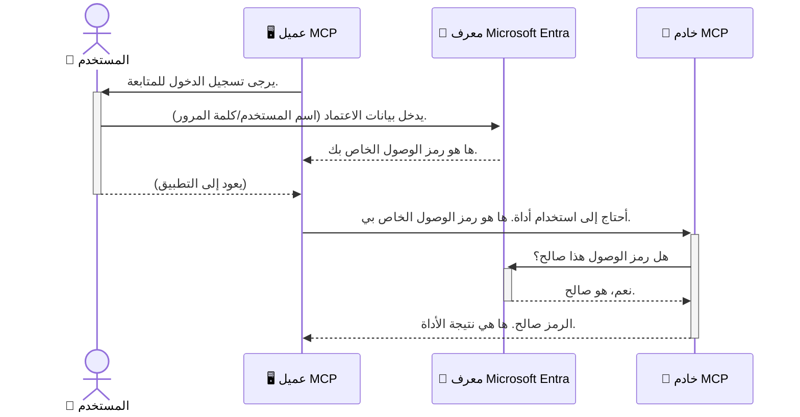

# تأمين سير عمل الذكاء الاصطناعي: مصادقة Entra ID لخوادم بروتوكول سياق النموذج

## المقدمة
تأمين خادم بروتوكول سياق النموذج (MCP) الخاص بك لا يقل أهمية عن قفل الباب الأمامي لمنزلك. ترك خادم MCP مفتوحًا يعرض أدواتك وبياناتك للوصول غير المصرح به، مما قد يؤدي إلى خروقات أمنية. توفر Microsoft Entra ID حلاً قويًا لإدارة الهوية والوصول قائمًا على السحابة، يساعد في ضمان أن المستخدمين والتطبيقات المصرح لهم فقط هم من يمكنهم التفاعل مع خادم MCP الخاص بك. في هذا القسم، ستتعلم كيفية حماية سير عمل الذكاء الاصطناعي باستخدام مصادقة Entra ID.

## أهداف التعلم
بنهاية هذا القسم، ستكون قادرًا على:

- فهم أهمية تأمين خوادم MCP.
- شرح أساسيات Microsoft Entra ID ومصادقة OAuth 2.0.
- التمييز بين العملاء العامين والسريين.
- تنفيذ مصادقة Entra ID في سيناريوهات خادم MCP المحلي (عميل عام) وعن بُعد (عميل سري).
- تطبيق أفضل ممارسات الأمان عند تطوير سير عمل الذكاء الاصطناعي.

## الأمن وMCP

تمامًا كما لا تترك باب منزلك الأمامي غير مقفل، يجب ألا تترك خادم MCP الخاص بك مفتوحًا لأي شخص للوصول. تأمين سير عمل الذكاء الاصطناعي الخاص بك ضروري لبناء تطبيقات قوية وموثوقة وآمنة. سيقدم لك هذا الفصل كيفية استخدام Microsoft Entra ID لتأمين خوادم MCP الخاصة بك، مما يضمن أن المستخدمين والتطبيقات المصرح لهم فقط يمكنهم التفاعل مع أدواتك وبياناتك.

## لماذا الأمن مهم لخوادم MCP

تخيل أن خادم MCP الخاص بك يحتوي على أداة يمكنها إرسال رسائل بريد إلكتروني أو الوصول إلى قاعدة بيانات العملاء. خادم غير مؤمن يعني أن أي شخص قد يستخدم تلك الأداة، مما يؤدي إلى وصول غير مصرح به إلى البيانات، أو البريد المزعج، أو أنشطة خبيثة أخرى.

من خلال تنفيذ المصادقة، تضمن أن كل طلب إلى خادمك يتم التحقق منه، مما يؤكد هوية المستخدم أو التطبيق الذي يقدم الطلب. هذه هي الخطوة الأولى والأكثر أهمية في تأمين سير عمل الذكاء الاصطناعي الخاص بك.

## مقدمة إلى Microsoft Entra ID

[**Microsoft Entra ID**](https://adoption.microsoft.com/microsoft-security/entra/) هي خدمة إدارة هوية ووصول قائمة على السحابة. فكر فيها كحارس أمني عالمي لتطبيقاتك. تتعامل مع العملية المعقدة للتحقق من هويات المستخدمين (المصادقة) وتحديد ما يُسمح لهم بفعله (التفويض).

باستخدام Entra ID، يمكنك:

- تمكين تسجيل دخول آمن للمستخدمين.
- حماية واجهات برمجة التطبيقات والخدمات.
- إدارة سياسات الوصول من موقع مركزي.

بالنسبة لخوادم MCP، توفر Entra ID حلاً قويًا وموثوقًا على نطاق واسع لإدارة من يمكنه الوصول إلى قدرات خادمك.

---

## فهم السحر: كيف تعمل مصادقة Entra ID

تستخدم Entra ID معايير مفتوحة مثل **OAuth 2.0** لمعالجة المصادقة. على الرغم من أن التفاصيل قد تكون معقدة، إلا أن الفكرة الأساسية بسيطة ويمكن فهمها بمثال تشبيهي.

### مقدمة لطيفة إلى OAuth 2.0: مفتاح صف السيارة

فكر في OAuth 2.0 مثل خدمة صف السيارات لسيارتك. عندما تصل إلى مطعم، لا تعطي صف السيارة مفتاحك الرئيسي. بدلاً من ذلك، تعطيه **مفتاح صف** له أذونات محدودة — يمكنه تشغيل السيارة وقفل الأبواب، لكنه لا يمكنه فتح الصندوق الخلفي أو صندوق القفازات.

في هذا التشبيه:

- **أنت** هو **المستخدم**.
- **سيارتك** هي **خادم MCP** مع أدواته وبياناته القيمة.
- **صف السيارة** هو **Microsoft Entra ID**.
- **سائق الصف** هو **عميل MCP** (التطبيق الذي يحاول الوصول إلى الخادم).
- **مفتاح الصف** هو **رمز الوصول (Access Token)**.

رمز الوصول هو سلسلة نصية آمنة يتلقاها عميل MCP من Entra ID بعد تسجيل دخولك. ثم يقدم العميل هذا الرمز إلى خادم MCP مع كل طلب. يمكن للخادم التحقق من الرمز لضمان شرعية الطلب وأن لدى العميل الأذونات اللازمة، وكل ذلك دون الحاجة لإدارة بيانات اعتمادك الفعلية (مثل كلمة المرور).

### سير التدفق للمصادقة

إليك كيف تعمل العملية عمليًا:



### تقديم مكتبة Microsoft للمصادقة (MSAL)

قبل الغوص في الكود، من المهم تقديم مكون رئيسي سترى أمثلة له: **Microsoft Authentication Library (MSAL)**.

MSAL هي مكتبة طورتها Microsoft تجعل التعامل مع المصادقة أسهل بكثير للمطورين. بدلاً من ضرورة كتابة جميع الأكواد المعقدة الخاصة بإدارة رموز الأمان، وتسجيل الدخول، وتجديد الجلسات، يقوم MSAL بإنجاز ذلك نيابةً عنك.

يُوصى بشدة باستخدام مكتبة مثل MSAL لأنها:

- **آمنة:** تنفذ بروتوكولات ومعايير أمنية راسخة تقلل من المخاطر الأمنية في كودك.
- **تبسط التطوير:** تخفي تعقيدات بروتوكولات OAuth 2.0 وOpenID Connect، مما يتيح لك إضافة مصادقة قوية لتطبيقك بعدة أسطر من الكود فقط.
- **مدعومة:** تقوم Microsoft بصيانة MSAL وتحديثها بانتظام لمواجهة التهديدات الأمنية الجديدة وتغييرات المنصة.

يدعم MSAL مجموعة واسعة من اللغات وأطر العمل، بما في ذلك .NET, JavaScript/TypeScript, Python, Java, Go، ومنصات الأجهزة المحمولة مثل iOS وAndroid. هذا يعني أنه يمكنك استخدام نفس أنماط المصادقة عبر كامل مجموعتك التقنية.

لتعلم المزيد عن MSAL، يمكنك الاطلاع على المستندات الرسمية [نظرة عامة على MSAL](https://learn.microsoft.com/entra/identity-platform/msal-overview).

---

## تأمين خادم MCP الخاص بك باستخدام Entra ID: دليل خطوة بخطوة

الآن، دعنا نستعرض كيفية تأمين خادم MCP محلي (يتواصل عبر `stdio`) باستخدام Entra ID. يستخدم هذا المثال **عميلًا عامًا**، وهو مناسب للتطبيقات التي تعمل على جهاز المستخدم، مثل تطبيق سطح المكتب أو خادم التطوير المحلي.

### السيناريو 1: تأمين خادم MCP محلي (مع عميل عام)

في هذا السيناريو، سننظر في خادم MCP يعمل محليًا، يتواصل عبر `stdio`، ويستخدم Entra ID للمصادقة على المستخدم قبل السماح بالوصول إلى أدواته. سيكون للخادم أداة واحدة تجلب معلومات ملف تعريف المستخدم من Microsoft Graph API.

#### 1. إعداد التطبيق في Entra ID

قبل كتابة أي كود، تحتاج إلى تسجيل تطبيقك في Microsoft Entra ID. يُخبر هذا Entra ID عن تطبيقك ويمنحه إذنًا لاستخدام خدمة المصادقة.

1. انتقل إلى **[بوابة Microsoft Entra](https://entra.microsoft.com/)**.
2. اذهب إلى **تسجيل التطبيقات** وانقر على **تسجيل جديد**.
3. امنح تطبيقك اسمًا (مثل "خادم MCP المحلي الخاص بي").
4. بالنسبة لـ**أنواع الحسابات المدعومة**، اختر **الحسابات في هذا الدليل التنظيمي فقط**.
5. يمكنك ترك **عنوان URI لإعادة التوجيه** فارغًا لهذا المثال.
6. انقر **تسجيل**.

بعد التسجيل، دوّن **معرّف التطبيق (عميل)** و**معرّف الدليل (المستأجر)**. ستحتاج إليهما في الكود.

#### 2. الكود: تفصيل

لننظر في الأجزاء الرئيسية من الكود التي تتعامل مع المصادقة. الكود الكامل لهذا المثال متاح في مجلد [Entra ID - Local - WAM](https://github.com/Azure-Samples/mcp-auth-servers/tree/main/src/entra-id-local-wam) من مستودع [mcp-auth-servers على GitHub](https://github.com/Azure-Samples/mcp-auth-servers).

**`AuthenticationService.cs`**

هذه الفئة مسؤولة عن التعامل مع Entra ID.

- **`CreateAsync`**: تهيئ طريقة تهيئة `PublicClientApplication` من MSAL. يتم تكوينها بمعرف العميل (`clientId`) ومعرف المستأجر (`tenantId`) الخاصين بتطبيقك.
- **`WithBroker`**: يمكّن استخدام وسيط (مثل Windows Web Account Manager)، الذي يوفر تجربة تسجيل دخول انسيابية وأكثر أمانًا.
- **`AcquireTokenAsync`**: هذه هي الطريقة الأساسية. تحاول أولاً الحصول على رمز مميز بهدوء (بمعنى أن المستخدم لن يضطر لتسجيل الدخول مرة أخرى إذا كان لديه جلسة صالحة). إذا تعذر الحصول على رمز بهدوء، ستطالب المستخدم بتسجيل الدخول تفاعليًا.

```csharp
// Simplified for clarity
public static async Task<AuthenticationService> CreateAsync(ILogger<AuthenticationService> logger)
{
    var msalClient = PublicClientApplicationBuilder
        .Create(_clientId) // Your Application (client) ID
        .WithAuthority(AadAuthorityAudience.AzureAdMyOrg)
        .WithTenantId(_tenantId) // Your Directory (tenant) ID
        .WithBroker(new BrokerOptions(BrokerOptions.OperatingSystems.Windows))
        .Build();

    // ... cache registration ...

    return new AuthenticationService(logger, msalClient);
}

public async Task<string> AcquireTokenAsync()
{
    try
    {
        // Try silent authentication first
        var accounts = await _msalClient.GetAccountsAsync();
        var account = accounts.FirstOrDefault();

        AuthenticationResult? result = null;

        if (account != null)
        {
            result = await _msalClient.AcquireTokenSilent(_scopes, account).ExecuteAsync();
        }
        else
        {
            // If no account, or silent fails, go interactive
            result = await _msalClient.AcquireTokenInteractive(_scopes).ExecuteAsync();
        }

        return result.AccessToken;
    }
    catch (Exception ex)
    {
        _logger.LogError(ex, "An error occurred while acquiring the token.");
        throw; // Optionally rethrow the exception for higher-level handling
    }
}
```

**`Program.cs`**

هنا يتم إعداد خادم MCP ودمج خدمة المصادقة.

- **`AddSingleton<AuthenticationService>`**: تقوم بتسجيل `AuthenticationService` في حاوية حقن التبعيات، بحيث يمكن استخدامه في أجزاء أخرى من التطبيق (مثل أداتنا).
- أداة **`GetUserDetailsFromGraph`**: تتطلب مثيلًا من `AuthenticationService`. قبل تنفيذ أي شيء، تستدعي `authService.AcquireTokenAsync()` للحصول على رمز وصول صالح. إذا نجحت المصادقة، تستخدم الرمز لاستدعاء Microsoft Graph API وجلب تفاصيل المستخدم.

```csharp
// Simplified for clarity
[McpServerTool(Name = "GetUserDetailsFromGraph")]
public static async Task<string> GetUserDetailsFromGraph(
    AuthenticationService authService)
{
    try
    {
        // This will trigger the authentication flow
        var accessToken = await authService.AcquireTokenAsync();

        // Use the token to create a GraphServiceClient
        var graphClient = new GraphServiceClient(
            new BaseBearerTokenAuthenticationProvider(new TokenProvider(authService)));

        var user = await graphClient.Me.GetAsync();

        return System.Text.Json.JsonSerializer.Serialize(user);
    }
    catch (Exception ex)
    {
        return $"Error: {ex.Message}";
    }
}
```

#### 3. كيف يعمل كل شيء معًا

1. عندما يحاول عميل MCP استخدام أداة `GetUserDetailsFromGraph`، تستدعي الأداة أولاً `AcquireTokenAsync`.
2. تقوم `AcquireTokenAsync` بتحفيز مكتبة MSAL للتحقق من وجود رمز صالح.
3. إذا لم يُعثر على رمز، ستطالب MSAL، من خلال الوسيط، المستخدم بتسجيل الدخول باستخدام حساب Entra ID.
4. بعد تسجيل الدخول، تصدر Entra ID رمز وصول.
5. تستلم الأداة الرمز وتستخدمه لإجراء طلب آمن إلى Microsoft Graph API.
6. تُعاد تفاصيل المستخدم إلى عميل MCP.

تضمن هذه العملية أن المستخدمين المصادق عليهم فقط هم من يمكنهم استخدام الأداة، مما يؤمن خادم MCP المحلي بشكل فعال.

### السيناريو 2: تأمين خادم MCP عن بُعد (مع عميل سري)

عندما يعمل خادم MCP الخاص بك على جهاز بعيد (مثل خادم سحابي) ويتواصل عبر بروتوكول مثل HTTP Streaming، تختلف متطلبات الأمان. في هذه الحالة، يجب استخدام **عميل سري** و**تدفق رمز التفويض**. هذه طريقة أكثر أمانًا لأن أسرار التطبيق لا تتعرض للمتصفح أبدًا.

يستخدم هذا المثال خادم MCP مبني على TypeScript يستخدم Express.js للتعامل مع طلبات HTTP.

#### 1. إعداد التطبيق في Entra ID

الإعداد في Entra ID مشابه للعميل العام، لكن مع فرق رئيسي: تحتاج إلى إنشاء **سر عميل**.

1. انتقل إلى **[بوابة Microsoft Entra](https://entra.microsoft.com/)**.
2. في تسجيل تطبيقك، اذهب إلى علامة التبويب **الشهادات والأسرار**.
3. انقر على **سر عميل جديد**، وأعطه وصفًا، ثم انقر **إضافة**.
4. **مهم:** انسخ قيمة السر على الفور. لن تتمكن من رؤيتها مرة أخرى.
5. تحتاج أيضًا إلى تكوين **عنوان URI لإعادة التوجيه**. اذهب إلى علامة التبويب **المصادقة**، وانقر على **إضافة منصة**، واختر **الويب**، وأدخل عنوان URI لإعادة التوجيه لتطبيقك (مثل `http://localhost:3001/auth/callback`).

> **⚠️ ملاحظة أمنية هامة:** بالنسبة لتطبيقات الإنتاج، توصي Microsoft بشدة باستخدام طرق **مصادقة بدون سر** مثل **Managed Identity** أو **توحيد هوية عبء العمل** بدلاً من أسرار العملاء. حيث تشكل أسرار العملاء مخاطر أمنية لأنه يمكن تعرضها أو اختراقها. توفر الهويات المُدارة نهجًا أكثر أمانًا عبر إزالة الحاجة إلى تخزين بيانات الاعتماد في الكود أو التكوين.
>
> للمزيد من المعلومات حول الهويات المُدارة وكيفية تنفيذها، راجع [نظرة عامة على الهويات المُدارة لموارد Azure](https://learn.microsoft.com/entra/identity/managed-identities-azure-resources/overview).

#### 2. الكود: تفصيل

يستخدم هذا المثال نهجًا قائمًا على الجلسة. عند مصادقة المستخدم، يخزن الخادم رمز الوصول ورمز التحديث في جلسة ويعطي المستخدم رمز جلسة. يُستخدم رمز الجلسة هذا للطلبات اللاحقة. الكود الكامل لهذا المثال متاح في مجلد [Entra ID - Confidential client](https://github.com/Azure-Samples/mcp-auth-servers/tree/main/src/entra-id-cca-session) من مستودع [mcp-auth-servers على GitHub](https://github.com/Azure-Samples/mcp-auth-servers).

**`Server.ts`**

هذا الملف يقوم بإعداد خادم Express وطبقة النقل MCP.

- **`requireBearerAuth`**: هو ميدلوير يحمي نقاط النهاية `/sse` و `/message`. يتحقق من وجود رمز حامل صالح في رأس `Authorization` للطلب.
- **`EntraIdServerAuthProvider`**: فئة مخصصة تطبق واجهة `McpServerAuthorizationProvider`. مسؤولة عن التعامل مع تدفق OAuth 2.0.
- **`/auth/callback`**: نقطة النهاية هذه تتعامل مع إعادة التوجيه من Entra ID بعد مصادقة المستخدم. تقوم بتبادل رمز التفويض من أجل رمز وصول ورمز تحديث.

```typescript
// مبسط للوضوح
const app = express();
const { server } = createServer();
const provider = new EntraIdServerAuthProvider();

// حماية نقطة نهاية SSE
app.get("/sse", requireBearerAuth({
  provider,
  requiredScopes: ["User.Read"]
}), async (req, res) => {
  // ... الاتصال بالنقل ...
});

// حماية نقطة نهاية الرسالة
app.post("/message", requireBearerAuth({
  provider,
  requiredScopes: ["User.Read"]
}), async (req, res) => {
  // ... معالجة الرسالة ...
});

// معالجة رد اتصال OAuth 2.0
app.get("/auth/callback", (req, res) => {
  provider.handleCallback(req.query.code, req.query.state)
    .then(result => {
      // ... معالجة النجاح أو الفشل ...
    });
});
```

**`Tools.ts`**

يحدد هذا الملف الأدوات التي يقدمها خادم MCP. أداة `getUserDetails` مشابهة للأداة في المثال السابق، لكنها تحصل على رمز الوصول من الجلسة.

```typescript
// مبسط للوضوح
server.setRequestHandler(CallToolRequestSchema, async (request) => {
  const { name } = request.params;
  const context = request.params?.context as { token?: string } | undefined;
  const sessionToken = context?.token;

  if (name === ToolName.GET_USER_DETAILS) {
    if (!sessionToken) {
      throw new AuthenticationError("Authentication token is missing or invalid. Ensure the token is provided in the request context.");
    }

    // احصل على رمز تعريف Entra من مخزن الجلسة
    const tokenData = tokenStore.getToken(sessionToken);
    const entraIdToken = tokenData.accessToken;

    const graphClient = Client.init({
      authProvider: (done) => {
        done(null, entraIdToken);
      }
    });

    const user = await graphClient.api('/me').get();

    // ... إرجاع تفاصيل المستخدم ...
  }
});
```

**`auth/EntraIdServerAuthProvider.ts`**

تتعامل هذه الفئة مع المنطق الخاص بـ:

- إعادة توجيه المستخدم إلى صفحة تسجيل الدخول في Entra ID.
- تبادل رمز التفويض برمز وصول.
- تخزين الرموز في `tokenStore`.
- تحديث رمز الوصول عند انتهاء صلاحيته.

#### 3. كيف يعمل كل شيء معًا

1. عندما يحاول المستخدم أول مرة الاتصال بخادم MCP، يلاحظ ميدلوير `requireBearerAuth` أنه لا توجد جلسة صالحة ويعيد توجيهه إلى صفحة تسجيل الدخول في Entra ID.
2. يقوم المستخدم بتسجيل الدخول باستخدام حساب Entra ID الخاص به.
3. يعيد Entra ID توجيه المستخدم مرة أخرى إلى نقطة النهاية `/auth/callback` مع رمز تفويض.
4. يقوم الخادم بتبديل الرمز مقابل رمز وصول ورمز تحديث، يخزنهم، وينشئ رمز جلسة يتم إرساله إلى العميل.
5. يمكن للعميل الآن استخدام رمز الجلسة هذا في رأس `Authorization` لجميع الطلبات المستقبلية إلى خادم MCP.
6. عند استدعاء أداة `getUserDetails`، تستخدم رمز الجلسة للبحث عن رمز وصول Entra ID ثم تستخدمه لاستدعاء واجهة برمجة التطبيقات Microsoft Graph.

هذا التدفق أكثر تعقيدًا من تدفق العميل العام، لكنه مطلوب لنقاط النهاية المواجهة للإنترنت. نظرًا لأن خوادم MCP البعيدة متاحة عبر الإنترنت العام، فهي تحتاج إلى تدابير أمان أقوى للحماية من الوصول غير المصرح به والهجمات المحتملة.

## أفضل ممارسات الأمان

- **استخدم HTTPS دائمًا**: قم بتشفير الاتصال بين العميل والخادم لحماية الرموز من الاعتراض.
- **تنفيذ التحكم في الوصول بناءً على الدور (RBAC)**: لا تتحقق فقط مما إذا كان المستخدم مصادقًا عليه؛ تحقق مما هو مخول له فعله. يمكنك تعريف الأدوار في Entra ID والتحقق منها في خادم MCP الخاص بك.
- **المراقبة والتدقيق**: سجّل جميع أحداث المصادقة حتى تتمكن من اكتشاف الأنشطة المشبوهة والاستجابة لها.
- **التعامل مع تحديد المعدل والتقييد**: تنفذ Microsoft Graph وواجهات برمجة التطبيقات الأخرى تحديد المعدل لمنع سوء الاستخدام. طبق استراتيجية التراجع الأسي والمنطق لإعادة المحاولة في خادم MCP الخاص بك للتعامل برشاقة مع استجابات HTTP 429 (طلبات كثيرة جدًا). فكر في تخزين البيانات التي يتم الوصول إليها بشكل متكرر مؤقتًا لتقليل استدعاءات الواجهة البرمجية.
- **تخزين الرموز بأمان**: خزّن رموز الوصول ورموز التحديث بأمان. بالنسبة للتطبيقات المحلية، استخدم آليات التخزين الآمنة للنظام. بالنسبة لتطبيقات الخادم، فكر في استخدام التخزين المشفر أو خدمات إدارة المفاتيح الآمنة مثل Azure Key Vault.
- **التعامل مع انتهاء صلاحية الرموز**: لرموز الوصول عمر محدود. طبق تحديثًا آليًا للرموز باستخدام رموز التحديث للحفاظ على تجربة مستخدم سلسة دون الحاجة إلى إعادة المصادقة.
- **النظر في استخدام Azure API Management**: بينما يتيح تنفيذ الأمان مباشرة في خادم MCP التحكم الدقيق، يمكن لبوابات API مثل Azure API Management التعامل مع العديد من هذه المخاوف الأمنية تلقائيًا، بما في ذلك المصادقة، التفويض، تحديد المعدل، والمراقبة. توفر طبقة أمان مركزية تقع بين عملائك وخوادم MCP الخاصة بك. للمزيد من التفاصيل حول استخدام بوابات API مع MCP، راجع [Azure API Management Your Auth Gateway For MCP Servers](https://techcommunity.microsoft.com/blog/integrationsonazureblog/azure-api-management-your-auth-gateway-for-mcp-servers/4402690).

## النقاط الرئيسية

- تأمين خادم MCP الخاص بك أمر بالغ الأهمية لحماية بياناتك وأدواتك.
- يوفر Microsoft Entra ID حلاً قويًا وقابلًا للتوسع للمصادقة والتفويض.
- استخدم **عميل عام** للتطبيقات المحلية و**عميل سري** للخوادم البعيدة.
- يعتبر **تدفق رمز التفويض** الخيار الأكثر أمانًا لتطبيقات الويب.

## تمرين

1. فكر في خادم MCP قد تبنيه. هل سيكون خادمًا محليًا أم خادمًا بعيدًا؟
2. بناءً على إجابتك، هل ستستخدم عميلًا عامًا أم سريًا؟
3. ما الأذونات التي سيطلبها خادم MCP الخاص بك لأداء الإجراءات ضد Microsoft Graph؟

## تمارين تطبيقية

### التمرين 1: تسجيل تطبيق في Entra ID
انتقل إلى بوابة Microsoft Entra.  
سجّل تطبيقًا جديدًا لخادم MCP الخاص بك.  
سجّل معرف التطبيق (العميل) ومعرف الدليل (المستأجر).

### التمرين 2: تأمين خادم MCP محلي (عميل عام)
- اتبع مثال الكود لدمج مكتبة مصادقة Microsoft (MSAL) لمصادقة المستخدم.
- اختبر تدفق المصادقة عن طريق استدعاء أداة MCP التي تجلب تفاصيل المستخدم من Microsoft Graph.

### التمرين 3: تأمين خادم MCP بعيد (عميل سري)
- سجّل عميلًا سريًا في Entra ID وأنشئ سر عميل.
- قم بتكوين خادم Express.js الخاص بك لاستخدام تدفق رمز التفويض.
- اختبر نقاط النهاية المحمية وتأكد من الوصول المعتمد على الرمز.

### التمرين 4: تطبيق أفضل ممارسات الأمان
- فعّل HTTPS لخادمك المحلي أو البعيد.
- نفذ التحكم في الوصول بناءً على الدور (RBAC) في منطق الخادم.
- أضف التعامل مع انتهاء صلاحية الرموز وتخزين الرموز بأمان.

## الموارد

1. **مستندات نظرة عامة على MSAL**  
   تعرّف على كيفية تمكين مكتبة مصادقة Microsoft (MSAL) الحصول الآمن على الرموز عبر المنصات:  
   [MSAL Overview on Microsoft Learn](https://learn.microsoft.com/en-gb/entra/msal/overview)

2. **مستودع GitHub Azure-Samples/mcp-auth-servers**  
   تنفيذات مرجعية لخوادم MCP تظهر تدفقات المصادقة:  
   [Azure-Samples/mcp-auth-servers on GitHub](https://github.com/Azure-Samples/mcp-auth-servers)

3. **نظرة عامة على الهويات المدارّة لموارد Azure**  
   فهم كيفية إزالة الأسرار باستخدام الهويات المدارّة المعينة للنظام أو المستخدم:  
   [Managed Identities Overview on Microsoft Learn](https://learn.microsoft.com/en-us/entra/identity/managed-identities-azure-resources/)

4. **إدارة واجهات برمجة التطبيقات Azure: بوابة المصادقة الخاصة بك لخوادم MCP**  
   نظرة معمقة على استخدام APIM كبوابة OAuth2 آمنة لخوادم MCP:  
   [Azure API Management Your Auth Gateway For MCP Servers](https://techcommunity.microsoft.com/blog/integrationsonazureblog/azure-api-management-your-auth-gateway-for-mcp-servers/4402690)

5. **مرجع أذونات Microsoft Graph**  
   قائمة شاملة بالأذونات المفوضة وأذونات التطبيقات لـ Microsoft Graph:  
   [Microsoft Graph Permissions Reference](https://learn.microsoft.com/zh-tw/graph/permissions-reference)

## مخرجات التعلم
بعد إكمال هذا القسم، ستكون قادرًا على:

- شرح لماذا تُعد المصادقة أمرًا حيويًا لخوادم MCP وسير العمل الخاص بالذكاء الاصطناعي.
- إعداد وتكوين مصادقة Entra ID لكل من سيناريوهات خادم MCP المحلي والبعيد.
- اختيار نوع العميل المناسب (عامة أو سرية) بناءً على نشر الخادم الخاص بك.
- تنفيذ ممارسات الترميز الآمنة، بما في ذلك تخزين الرموز والتفويض بناءً على الدور.
- حماية خادم MCP الخاص بك وأدواته من الوصول غير المصرح به بثقة.

## ما هو التالي

- [5.13 تكامل بروتوكول سياق النموذج (MCP) مع Microsoft Foundry](../mcp-foundry-agent-integration/README.md)

---

<!-- CO-OP TRANSLATOR DISCLAIMER START -->
**تنويه**:
تمت ترجمة هذا المستند باستخدام خدمة الترجمة بالذكاء الاصطناعي [Co-op Translator](https://github.com/Azure/co-op-translator). بينما نسعى للدقة، يرجى العلم أن الترجمات الآلية قد تحتوي على أخطاء أو عدم دقة. يجب اعتبار المستند الأصلي بلغته الأصلية المصدر الرسمي والمعتمد. للمعلومات الهامة، يُنصح بالاستعانة بترجمة بشرية محترفة. نحن غير مسؤولين عن أي سوء فهم أو تفسير ناتج عن استخدام هذه الترجمة.
<!-- CO-OP TRANSLATOR DISCLAIMER END -->