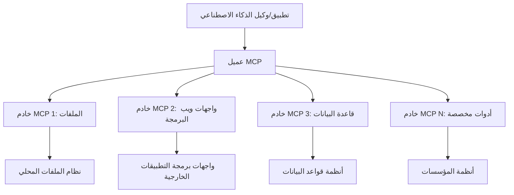

# 🌐 الوحدة 2: MCP مع أساسيات مجموعة أدوات Microsoft Foundry

[]()
[]()
[]()

## 📋 أهداف التعلم

بحلول نهاية هذه الوحدة، سوف تكون قادرًا على:
- ✅ فهم هندسة وفوائد بروتوكول نموذج السياق (MCP)
- ✅ استكشاف نظام خوادم MCP من مايكروسوفت
- ✅ دمج خوادم MCP مع منشئ الوكلاء لمجموعة أدوات Microsoft Foundry
- ✅ بناء وكيل أتمتة متصفح وظيفي باستخدام Playwright MCP
- ✅ تكوين واختبار أدوات MCP داخل وكلائك
- ✅ تصدير ونشر الوكلاء المدعومين بـ MCP للاستخدام الإنتاجي

## 🎯 البناء على الوحدة 1

في الوحدة 1، اتقنا أساسيات مجموعة أدوات Microsoft Foundry وصنعنا وكيل بايثون الأول الخاص بنا. الآن سنقوم بـ **تعزيز** وكلائك عن طريق ربطهم بالأدوات والخدمات الخارجية من خلال البروتوكول الثوري **بروتوكول نموذج السياق (MCP)**.

فكر في هذا كترقية من آلة حاسبة أساسية إلى كمبيوتر كامل - حيث ستكتسب وكلاء الذكاء الاصطناعي القدرة على:
- 🌐 تصفح مواقع الويب والتفاعل معها
- 📁 الوصول إلى الملفات والتعامل معها
- 🔧 التكامل مع أنظمة المؤسسة
- 📊 معالجة البيانات في الوقت الحقيقي من واجهات برمجة التطبيقات

## 🧠 فهم بروتوكول نموذج السياق (MCP)

### 🔍 ما هو MCP؟

بروتوكول نموذج السياق (MCP) هو **"USB-C لتطبيقات الذكاء الاصطناعي"** - معيار مفتوح ثوري يربط النماذج اللغوية الكبيرة (LLMs) بالأدوات الخارجية ومصادر البيانات والخدمات. كما قضى USB-C على فوضى الكابلات بتوفير موصل عالمي واحد، يقضي MCP على تعقيدات تكامل الذكاء الاصطناعي من خلال بروتوكول قياسي واحد.

### 🎯 المشكلة التي يحلها MCP

**قبل MCP:**
- 🔧 تكاملات مخصصة لكل أداة
- 🔄 التبعية لمزودي الحلول الملكية  
- 🔒 ثغرات أمنية من الاتصالات العشوائية
- ⏱️ شهور من التطوير لتكاملات أساسية

**مع MCP:**
- ⚡ تكامل أدوات قابلة للاستخدام فورًا
- 🔄 هندسة غير معتمدة على مزود معين
- 🛡️ أفضل ممارسات أمنية مدمجة
- 🚀 دقائق لإضافة قدرات جديدة

### 🏗️ استعراض عميق لهندسة MCP

يتبع MCP هندسة **عميل-خادم** تخلق نظامًا بيئيًا آمنًا وقابلًا للتوسع:



**🔧 المكونات الأساسية:**

| المكون | الدور | أمثلة |
|-----------|------|----------|
| **مضيفو MCP** | تطبيقات تستهلك خدمات MCP | Claude Desktop، VS Code، مجموعة أدوات Microsoft Foundry |
| **عملاء MCP** | معالجات البروتوكول (واحد مقابل واحد مع الخوادم) | مدمجة في تطبيقات المضيف |
| **خوادم MCP** | تعرض القدرات عبر البروتوكول المعياري | Playwright، الملفات، أزور، GitHub |
| **طبقة النقل** | طرق الاتصال | stdio، HTTP، WebSockets |


## 🏢 نظام خوادم MCP لمايكروسوفت

تقود مايكروسوفت نظام MCP بمجموعة شاملة من خوادم المؤسسة التي تلبي احتياجات الأعمال الواقعية.

### 🌟 خوادم MCP المميزة من مايكروسوفت

#### 1. ☁️ خادم Azure MCP
**🔗 المستودع**: [azure/azure-mcp](https://github.com/azure/azure-mcp)
**🎯 الهدف**: إدارة موارد Azure شاملة مع تكامل الذكاء الاصطناعي

**✨ الميزات الرئيسية:**
- توفير البنية التحتية بشكل تصريحي
- مراقبة الموارد في الوقت الحقيقي
- توصيات تحسين التكاليف
- التحقق من الامتثال الأمني

**🚀 حالات الاستخدام:**
- البنية التحتية ككود مع مساعدة ذكاء اصطناعي
- التوسع التلقائي للموارد
- تحسين تكاليف السحابة
- أتمتة سير عمل DevOps

#### 2. 📊 Microsoft Dataverse MCP
**📚 التوثيق**: [تكامل Microsoft Dataverse](https://go.microsoft.com/fwlink/?linkid=2320176)
**🎯 الهدف**: واجهة لغة طبيعية لبيانات الأعمال

**✨ الميزات الرئيسية:**
- استعلامات قاعدة بيانات بلغة طبيعية
- فهم سياق الأعمال
- قوالب موجهات مخصصة
- حوكمة بيانات المؤسسة

**🚀 حالات الاستخدام:**
- تقارير ذكاء الأعمال
- تحليل بيانات العملاء
- رؤى أنابيب المبيعات
- استعلامات بيانات الامتثال

#### 3. 🌐 خادم Playwright MCP
**🔗 المستودع**: [microsoft/playwright-mcp](https://github.com/microsoft/playwright-mcp)
**🎯 الهدف**: أتمتة المتصفح وقدرات التفاعل مع الويب

**✨ الميزات الرئيسية:**
- أتمتة عبر المتصفحات (كروم، فايرفوكس، سفاري)
- الكشف الذكي عن العناصر
- التقاط لقطات شاشة وإنشاء PDF
- مراقبة حركة الشبكة

**🚀 حالات الاستخدام:**
- سير عمل الاختبار الآلي
- جمع البيانات واستخلاص المعلومات من الويب
- مراقبة واجهة المستخدم وتجربة المستخدم
- أتمتة التحليل التنافسي

#### 4. 📁 خادم الملفات MCP
**🔗 المستودع**: [microsoft/files-mcp-server](https://github.com/microsoft/files-mcp-server)
**🎯 الهدف**: عمليات ذكية لنظام الملفات

**✨ الميزات الرئيسية:**
- إدارة الملفات بشكل تصريحي
- مزامنة المحتوى
- تكامل نظام التحكم بالإصدارات
- استخراج البيانات الوصفية

**🚀 حالات الاستخدام:**
- إدارة الوثائق
- تنظيم مستودع الأكواد
- سير عمل نشر المحتوى
- معالجة ملفات خطوط البيانات

#### 5. 📝 خادم MarkItDown MCP
**🔗 المستودع**: [microsoft/markitdown](https://github.com/microsoft/markitdown)
**🎯 الهدف**: معالجة وتعديل Markdown المتقدم

**✨ الميزات الرئيسية:**
- تحليل Markdown متقدم
- تحويل التنسيقات (MD ↔ HTML ↔ PDF)
- تحليل هيكل المحتوى
- معالجة القوالب

**🚀 حالات الاستخدام:**
- سير العمل الفني للتوثيق
- نظم إدارة المحتوى
- إنشاء التقارير
- أتمتة قواعد المعرفة

#### 6. 📈 خادم Clarity MCP
**📦 الحزمة**: [@microsoft/clarity-mcp-server](https://www.npmjs.com/package/@microsoft/clarity-mcp-server)
**🎯 الهدف**: تحليلات الويب ورؤى سلوك المستخدم

**✨ الميزات الرئيسية:**
- تحليل بيانات خريطة الحرارة
- تسجيلات جلسات المستخدم
- مقاييس الأداء
- تحليل مسار التحويل

**🚀 حالات الاستخدام:**
- تحسين الموقع الإلكتروني
- أبحاث تجربة المستخدم
- تحليل اختبارات A/B
- لوحات معلومات ذكاء الأعمال

### 🌍 نظام المجتمع البيئي

بعيدًا عن خوادم مايكروسوفت، يشمل نظام MCP أيضًا:
- **🐙 GitHub MCP**: إدارة المستودعات وتحليل الأكواد
- **🗄️ قواعد بيانات MCP**: تكاملات PostgreSQL، MySQL، MongoDB
- **☁️ موفرو السحابة MCP**: أدوات AWS، GCP، Digital Ocean
- **📧 اتصالات MCP**: تكاملات Slack، Teams، البريد الإلكتروني

## 🛠️ المختبر العملي: بناء وكيل أتمتة المتصفح

**🎯 هدف المشروع**: إنشاء وكيل أتمتة متصفح ذكي باستخدام خادم Playwright MCP يمكنه تصفح المواقع، استخراج المعلومات، وأداء تفاعلات ويب معقدة.

### 🚀 المرحلة 1: إعداد أساس الوكيل

#### الخطوة 1: تهيئة وكيلك
1. **افتح منشئ وكلاء مجموعة أدوات Microsoft Foundry**
2. **أنشئ وكيلًا جديدًا** بالإعدادات التالية:
   - **الاسم**: `BrowserAgent`
   - **النموذج**: اختر GPT-4o


### 🔧 المرحلة 2: سير عمل تكامل MCP

#### الخطوة 3: إضافة تكامل خادم MCP
1. **انتقل إلى قسم الأدوات** في منشئ الوكيل
2. **انقر "إضافة أداة"** لفتح قائمة التكامل
3. **اختر "خادم MCP"** من الخيارات المتاحة


**🔍 فهم أنواع الأدوات:**
- **أدوات مدمجة**: وظائف مجموعة أدوات Microsoft Foundry المسبقة التكوين
- **خوادم MCP**: تكاملات الخدمات الخارجية
- **واجهات برمجة تطبيقات مخصصة**: نقاط نهاية خدماتك الخاصة
- **نداء الوظائف**: وصول مباشر لوظائف النموذج

#### الخطوة 4: اختيار خادم MCP
1. **اختر خيار "خادم MCP"** للمتابعة


2. **تصفح كتالوج MCP** لاستكشاف التكاملات المتاحة


### 🎮 المرحلة 3: تكوين Playwright MCP

#### الخطوة 5: اختيار وتكوين Playwright
1. **انقر "استخدام خوادم MCP المميزة"** للوصول إلى خوادم مايكروسوفت المعتمدة
2. **اختر "Playwright"** من القائمة المميزة
3. **اقبل معرف MCP الافتراضي** أو قم بتخصيصه لبيئتك


#### الخطوة 6: تمكين قدرات Playwright
**🔑 خطوة حاسمة**: حدد **جميع** طرق Playwright المتاحة لأقصى وظيفة


**🛠️ أدوات Playwright الأساسية:**
- **التنقل**: `goto`، `goBack`، `goForward`، `reload`
- **التفاعل**: `click`، `fill`، `press`، `hover`، `drag`
- **الاستيعاب**: `textContent`، `innerHTML`، `getAttribute`
- **التحقق**: `isVisible`، `isEnabled`، `waitForSelector`
- **الالتقاط**: `screenshot`، `pdf`، `video`
- **الشبكة**: `setExtraHTTPHeaders`، `route`، `waitForResponse`

#### الخطوة 7: التحقق من نجاح التكامل
**✅ مؤشرات النجاح:**
- ظهور جميع الأدوات في واجهة منشئ الوكيل
- عدم ظهور رسائل خطأ في لوحة التكامل
- إظهار حالة خادم Playwright "متصل"


**🔧 استكشاف الأخطاء الشائعة:**
- **فشل الاتصال**: تحقق من الاتصال بالإنترنت وإعدادات الجدار الناري
- **نقص الأدوات**: تأكد من تحديد جميع القدرات أثناء الإعداد
- **أخطاء الأذونات**: تحقق من أن VS Code لديه الأذونات اللازمة للنظام

### 🎯 المرحلة 4: هندسة المطالبات المتقدمة

#### الخطوة 8: تصميم مطالبات النظام الذكية
أنشئ مطالبات معقدة تستفيد من كامل قدرات Playwright:

```markdown
# Web Automation Expert System Prompt

## Core Identity
You are an advanced web automation specialist with deep expertise in browser automation, web scraping, and user experience analysis. You have access to Playwright tools for comprehensive browser control.

## Capabilities & Approach
### Navigation Strategy
- Always start with screenshots to understand page layout
- Use semantic selectors (text content, labels) when possible
- Implement wait strategies for dynamic content
- Handle single-page applications (SPAs) effectively

### Error Handling
- Retry failed operations with exponential backoff
- Provide clear error descriptions and solutions
- Suggest alternative approaches when primary methods fail
- Always capture diagnostic screenshots on errors

### Data Extraction
- Extract structured data in JSON format when possible
- Provide confidence scores for extracted information
- Validate data completeness and accuracy
- Handle pagination and infinite scroll scenarios

### Reporting
- Include step-by-step execution logs
- Provide before/after screenshots for verification
- Suggest optimizations and alternative approaches
- Document any limitations or edge cases encountered

## Ethical Guidelines
- Respect robots.txt and rate limiting
- Avoid overloading target servers
- Only extract publicly available information
- Follow website terms of service
```

#### الخطوة 9: إنشاء مطالبات مستخدم ديناميكية
صمم مطالبات تعرض قدرات مختلفة:

**🌐 مثال على تحليل الويب:**
```markdown
Navigate to github.com/kinfey and provide a comprehensive analysis including:
1. Repository structure and organization
2. Recent activity and contribution patterns  
3. Documentation quality assessment
4. Technology stack identification
5. Community engagement metrics
6. Notable projects and their purposes

Include screenshots at key steps and provide actionable insights.
```


### 🚀 المرحلة 5: التنفيذ والاختبار

#### الخطوة 10: تنفيذ الأتمتة الأولى
1. **انقر "تشغيل"** لبدء تسلسل الأتمتة
2. **مراقبة التنفيذ في الوقت الحقيقي**:
   - يتم فتح متصفح Chrome تلقائيًا
   - يتنقل الوكيل إلى الموقع المستهدف
   - تلتقط لقطات شاشة لكل خطوة رئيسية
   - تتدفق نتائج التحليل في الوقت الفعلي


#### الخطوة 11: تحليل النتائج والرؤى
راجع التحليل الشامل في واجهة منشئ الوكيل:


### 🌟 المرحلة 6: القدرات المتقدمة والنشر

#### الخطوة 12: التصدير والنشر الإنتاجي
يدعم منشئ الوكلاء خيارات نشر متعددة:


## 🎓 ملخص الوحدة 2 والخطوات التالية

### 🏆 الإنجاز المحقق: إتقان تكامل MCP

**✅ المهارات المتقنة:**
- [ ] فهم هندسة MCP وفوائده
- [ ] تصفح نظام خوادم MCP لمايكروسوفت
- [ ] دمج Playwright MCP مع مجموعة أدوات Microsoft Foundry
- [ ] بناء وكلاء أتمتة متصفح معقدين
- [ ] هندسة مطالبات متقدمة لأتمتة الويب

### 📚 موارد إضافية

- **🔗 مواصفة MCP**: [التوثيق الرسمي للبروتوكول](https://modelcontextprotocol.io/)
- **🛠️ API Playwright**: [مرجع كامل للطرق](https://playwright.dev/docs/api/class-playwright)
- **🏢 خوادم MCP لمايكروسوفت**: [دليل دمج المؤسسات](https://github.com/microsoft/mcp-servers)
- **🌍 أمثلة المجتمع**: [معرض خوادم MCP](https://github.com/modelcontextprotocol/servers)

**🎉 تهانينا!** لقد أتقنت تكامل MCP بنجاح ويمكنك الآن بناء وكلاء ذكاء اصطناعي جاهزين للإنتاج مع قدرات الأدوات الخارجية!

### 🔜 تابع إلى الوحدة التالية

هل أنت مستعد لرفع مهارات MCP الخاصة بك إلى المستوى التالي؟ تابع إلى **[الوحدة 3: تطوير MCP المتقدم مع مجموعة أدوات Microsoft Foundry](../lab3/README.md)** حيث ستتعلم كيفية:
- إنشاء خوادم MCP مخصصة خاصة بك
- تكوين واستخدام أحدث SDK لـ MCP بايثون
- إعداد MCP Inspector لأغراض التصحيح
- إتقان سير عمل تطوير خادم MCP المتقدم
- بناء خادم MCP للطقس من الصفر

---

<!-- CO-OP TRANSLATOR DISCLAIMER START -->
**تنويه**:
تمت ترجمة هذا المستند باستخدام خدمة الترجمة بالذكاء الاصطناعي [Co-op Translator](https://github.com/Azure/co-op-translator). بينما نسعى للدقة، يرجى العلم أن الترجمات الآلية قد تحتوي على أخطاء أو عدم دقة. يجب اعتبار المستند الأصلي بلغته الأصلية المصدر الرسمي والمعتمد. للمعلومات الهامة، يُنصح بالاستعانة بترجمة بشرية محترفة. نحن غير مسؤولين عن أي سوء فهم أو تفسير ناتج عن استخدام هذه الترجمة.
<!-- CO-OP TRANSLATOR DISCLAIMER END -->