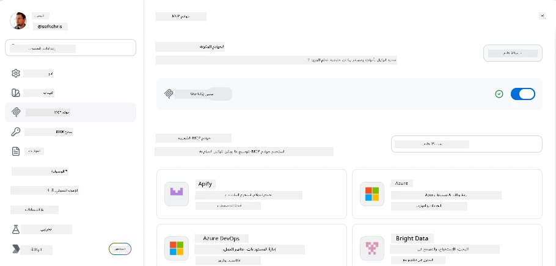
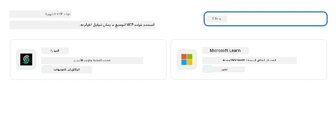
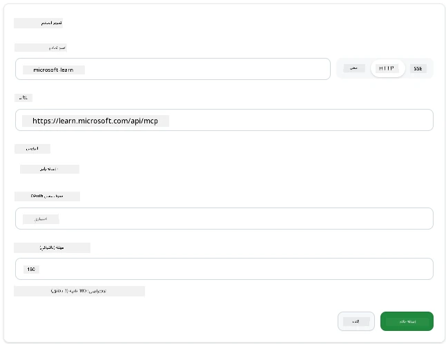
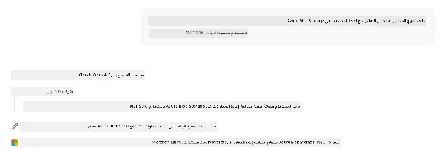
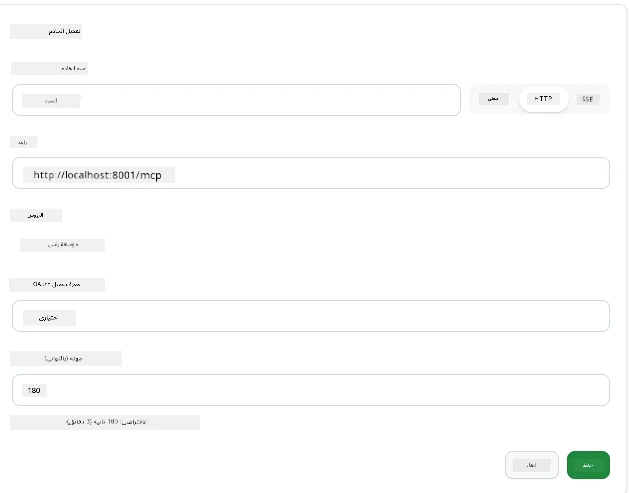
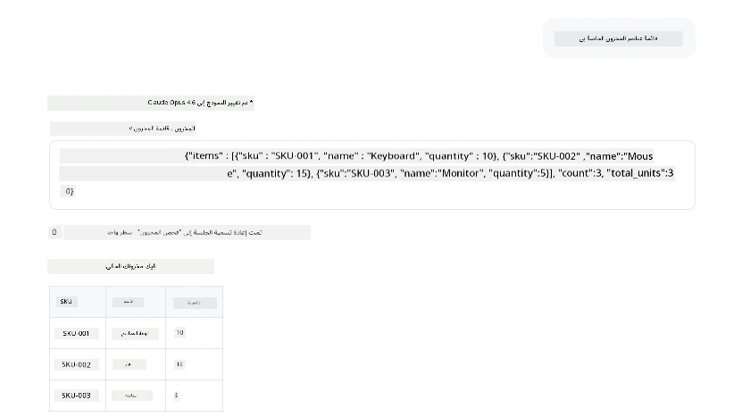
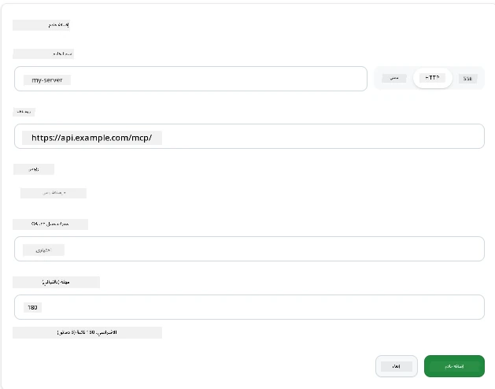
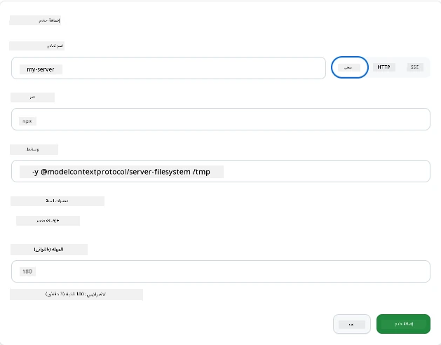

# استخدام خوادم MCP في تطبيق GitHub Copilot

حتى الآن أنت تعرف كيف يعمل MCP. لقد أنشأت خوادم، وعرفت الأدوات والموارد، وربطت العملاء. ما لم نفعله بعد هو قلب النظرة: بدلاً من أن تكون أنت من يبني الخادم، كيف يبدو الأمر من جانب *المستخدم*—كمستخدم لتطبيق مدعوم بالذكاء الاصطناعي يدعم MCP؟

[تطبيق GitHub Copilot](https://github.com/github/app) هو تطبيق سطح مكتب يمكنه استخدام خوادم MCP. من خلال ربط خوادم MCP به، تفتح مستوى جديدًا: يمكن الآن لـ Copilot الوصول إلى وثائقك، واستدعاء واجهات برمجة التطبيقات الداخلية لديك، والاستعلام من قاعدة بياناتك، أو التحدث إلى أي خدمة قمت بتغليفها في خادم. يصبح التطبيق هو المضيف؛ وخوادم MCP الخاصة بك تصبح أدواته.

تأخذك هذه الدرسة خلال هذه التجربة من البداية إلى النهاية—من العثور على لوحة إعدادات MCP إلى ربط خادم وثائق حقيقي ثم ربط خادم مخصص خاص بك.

## أهداف التعلم

بحلول نهاية هذه الدرسة، ستكون قادرًا على:

- تحديد موقع والتنقل في لوحة خوادم MCP في إعدادات تطبيق Copilot.
- ربط خادم وثائق مستضاف واستخدامه في جلسة.
- تسجيل خادم مخصص والتحقق من أن Copilot يمكنه استدعاء أدواته.
- تكوين طريقة استدعاء الخادم عن طريق توفير متغيرات بيئية أو رؤوس مخصصة (إذا كان عبر HTTP).

## تطبيق Copilot كمضيف MCP

الفكرة الأساسية هنا: **وكلاء Copilot أذكياء، لكنهم يعرفون فقط ما تخبرهم به.** بشكل افتراضي، يمكن للوكيل قراءة الملفات في مساحة عملك وتشغيل أوامر الطرفية، لكنه لا يستطيع الاستعلام من قاعدة بياناتك، أو الاطلاع على التقويم الخاص بك، أو استدعاء واجهة برمجة تطبيقات مخصصة بدون مساعدة. هنا تأتي خوادم MCP. فهي تعمل كجسور بين Copilot وأنظمتك—قواعد البيانات، التحكم في الإصدارات، واجهات البرمجة، أدوات التصميم—مقدمة للوكلاء الوصول إلى المعلومات والإجراءات التي يحتاجونها لإكمال العمل.

لنبدأ بالعثور على تلك الإعدادات لإدارة خوادم MCP الخاصة بتطبيقك.

## الخطوة 1: العثور على لوحة إعدادات MCP

افتح تطبيق Copilot وابحث عن أيقونة الترس في الزاوية السفلية اليسرى وانقر عليها.


تأكد من اختيار "خوادم MCP" ويجب أن ترى الآن خوادمك المُعدة بالفعل في الأعلى، وسوقًا للخوادم الشائعة في الأسفل، وزر "إضافة خادم" في الأعلى كما يلي:



هذا هو مركز التحكم الخاص بك. هنا تضيف، تزيل، تفعّل، وتُعطّل الخوادم. التغييرات تسري على الجلسات الجديدة؛ إذا كانت لديك جلسة مفتوحة، فستحتاج إلى بدء جلسة جديدة بعد تعديل هذه القائمة.

## الخطوة 2: ربط خادم وثائق

لنقم بشيء مفيد على الفور. خادم Microsoft Docs MCP يمنح Copilot إمكانية الوصول إلى الوثائق الرسمية لمايكروسوفت. يشمل هذا Azure، .NET، TypeScript، والمزيد. بدلاً من اعتماد الوكيل على بيانات تدريبه (ذات تاريخ انتهاء)، يمكنه سحب الوثائق الحالية عند وقت الاستعلام.

إليك طريقة إضافته:

1. في شبكة الخوادم الشائعة، اكتب **learn** واختر الخادم المسمى "Microsoft Learn".

   

   عند النقر عليه، سيُعرض لك نموذج يتم ملؤه مسبقًا بالاسم، ونوع النقل، ورابط URL، كل ما عليك هو النقر على "إضافة خادم".

2. انقر على "إضافة خادم"، يجب أن يستغرق الأمر بضع ثوانٍ للاتصال بالخادم.

   

   بمجرد إضافته، يجب أن يظهر في المنطقة العليا كخادم مُعد. دعنا نجربه الآن.

3. أغلق الحوار واختر الدردشة السريعة.

4. اكتب المطالبة أدناه لاستدعاء أداة على خادم Microsoft Learn.

   ```text
   What's the current recommended approach for handling Azure Blob Storage 
   retries using the .NET SDK?
   ```

   

يجب أن ترى كيف يشير إلى خادم MCP الذي أضفناه للتو.

## الخطوة 3: ربط خادم stdio مخصص

الإعدادات المسبقة مفيدة، لكن القوة الحقيقية في ربط خوادمك الخاصة. لنقل أنك أنشأت خادمًا (أو تم توفير واحد لك) يكشف عن واجهة برمجة التطبيقات الداخلية أو قاعدة معرفتك بالشركة. في هذه الحالة، سنستخدم خادم MCP قمنا ببنائه يتعامل مع إدارة مخزون الشركة.

1. انقر على الترس واختر "خوادم MCP" مرة أخرى.

2. اختر زر "إضافة خادم" ثم "+ إضافة خادم مخصص"، وقدم القيم التالية:

   - الاسم: `Inventory Server`
   - اختر نوع النقل (على اليمين)، **http**

   اختر "إضافة خادم" ويجب أن يظهر في قائمة الخوادم المُعدة لديك.

   

4. لاختباره، شغّل مطالبة مثل هذه:

    ```
    list inventory
    ```

   

   يجب أن ترى الآن قائمة بعناصر الجرد المعادة من الخادم المخصص الذي أنشأته.

رائع، يجب أن تكون قد حصلت الآن على فهم جيد لكيفية إضافة خوادم MCP الخارجية وكذلك خوادمك الخاصة إلى تطبيق Copilot. بعد ذلك، سنتحدث عن التعامل مع الأسرار ومتغيرات البيئة.

## الخطوة 4: الإعدادات المتقدمة

حتى الآن، رأيت كيف تضيف خوادم MCP حيث تقدم فقط اسمًا وURL. لكن ماذا لو كان خادمك يحتاج مفتاح API أو قيمة أخرى؟ حسنًا، بناءً على نوع النقل، يمكننا تزويده بما يحتاجه.

- **نقل http أو SSE**: هنا يمكننا تعيين الرؤوس حسب الحاجة.

   للمصادقة، يمكنك تحديد رأس Authorization، على سبيل المثال. يمكن أن تكون القيمة سلسلة ثابتة. إذا كنت تستخدم OAuth، يمكنك بدلاً من ذلك تقديم معرف عميل OAuth.

   

- **نقل stdio**: يمكن تعيين متغيرات البيئة.

   هنا يمكنك تحديد أي عدد من متغيرات البيئة التي تحتاجها والتي يجب تمريرها إلى الخادم عند تشغيله.

   

## الملخص

يتعامل تطبيق Copilot مع خوادم MCP كامتدادات من الدرجة الأولى لقدرات الوكيل. لقد رأيت الرحلة الكاملة في هذه الدرسة من إضافة خوادم MCP إلى استخدامها في جلسة. يمكنك الآن الاتصال بالخوادم العامة، وواجهات البرامج الداخلية، والأدوات المخصصة، مما يمنح وكلائك القدرة على الوصول إلى المعلومات والإجراءات التي يحتاجونها لإكمال المهام بشكل مستقل.

## 📚 موارد إضافية

### الوثائق الرسمية

- [تطبيق GitHub Copilot](https://github.com/github/app)
- [مواصفة MCP](https://modelcontextprotocol.io/specification/2025-03-26) - مواصفة بروتوكول سياق النموذج

### المجتمع
- [مجتمع MCP على Discord](https://discord.com/invite/ByRwuEEgH4) - مناقشات مباشرة
- [مناقشات GitHub](https://github.com/microsoft/MCP-Server-and-PostgreSQL-Sample-Retail/discussions) - أسئلة وأجوبة ومشاركة
- [Stack Overflow](https://stackoverflow.com/questions/tagged/model-context-protocol) - أسئلة تقنية

---

<!-- CO-OP TRANSLATOR DISCLAIMER START -->
**تنويه**:
تمت ترجمة هذا المستند باستخدام خدمة الترجمة بالذكاء الاصطناعي [Co-op Translator](https://github.com/Azure/co-op-translator). بينما نسعى للدقة، يرجى العلم أن الترجمات الآلية قد تحتوي على أخطاء أو عدم دقة. يجب اعتبار المستند الأصلي بلغته الأصلية المصدر الرسمي والمعتمد. للمعلومات الهامة، يُنصح بالاستعانة بترجمة بشرية محترفة. نحن غير مسؤولين عن أي سوء فهم أو تفسير ناتج عن استخدام هذه الترجمة.
<!-- CO-OP TRANSLATOR DISCLAIMER END -->