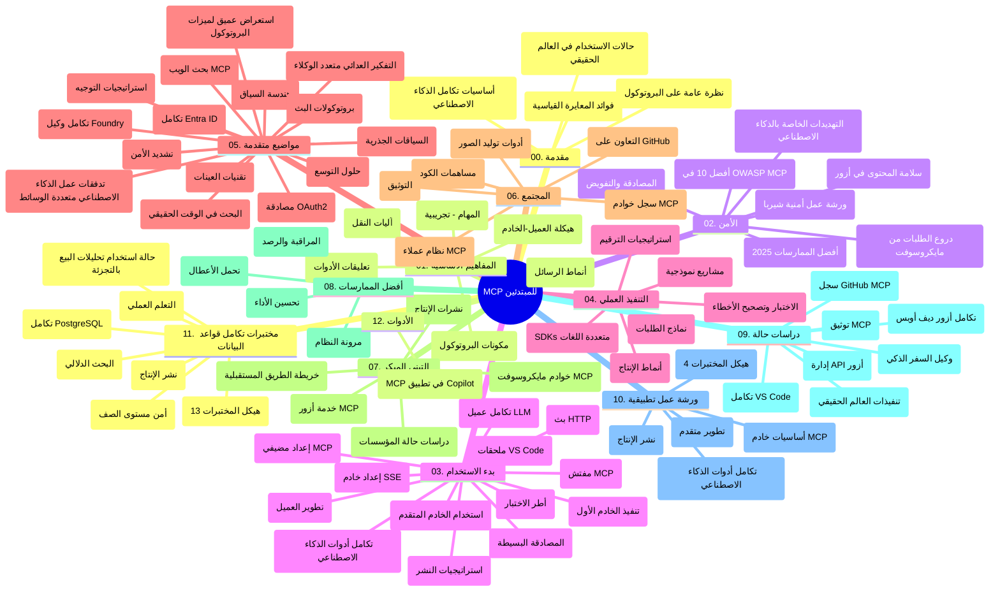

# بروتوكول سياق النموذج (MCP) للمبتدئين - دليل الدراسة

يقدم هذا الدليل الدراسي نظرة عامة على هيكل ومستوى محتوى المستودع لمنهج "بروتوكول سياق النموذج (MCP) للمبتدئين". استخدم هذا الدليل للتنقل في المستودع بكفاءة والاستفادة القصوى من الموارد المتاحة.

## نظرة عامة على المستودع

يُعد بروتوكول سياق النموذج (MCP) إطارًا موحدًا للتفاعلات بين نماذج الذكاء الاصطناعي وتطبيقات العملاء. تم إنشاؤه في البداية بواسطة Anthropic، ويتم الآن صيانته من قبل مجتمع MCP الأوسع من خلال منظمة GitHub الرسمية. يوفر هذا المستودع منهجًا شاملاً مع أمثلة برمجية عملية في C# وJava وJavaScript وPython وTypeScript، مصممًا لمطوري الذكاء الاصطناعي، ومهندسي الأنظمة، ومهندسي البرمجيات.

## خريطة المنهج المرئية

## هيكل المستودع

ينظم المستودع إلى اثني عشر قسمًا رئيسيًا، يركز كل منها على جوانب مختلفة من MCP:

1. **المقدمة (00-Introduction/)**
   - نظرة عامة على بروتوكول سياق النموذج
   - لماذا تعتبر المعايير مهمة في خطوط أنابيب الذكاء الاصطناعي
   - حالات استخدام عملية وفوائد

2. **المفاهيم الأساسية (01-CoreConcepts/)**
   - هندسة العميل-الخادم
   - مكونات البروتوكول الرئيسية
   - أنماط الرسائل في MCP

3. **الأمن (02-Security/)**
   - التهديدات الأمنية في الأنظمة القائمة على MCP
   - أفضل الممارسات لتأمين التفيذات
   - استراتيجيات المصادقة والتفويض
   - **توثيق أمني شامل**:
     - أفضل ممارسات الأمان MCP لعام 2025
     - دليل تنفيذ أمان المحتوى لـ Azure
     - ضوابط وتقنيات أمنية لـ MCP
     - مرجع سريع لأفضل ممارسات MCP
   - **الموضوعات الأمنية الرئيسية**:
     - هجمات حقن المطالبات وتسميم الأدوات
     - اختطاف الجلسة ومشاكل الوكيل المضلل
     - ثغرات تمرير الرموز
     - الأذونات المفرطة والتحكم في الوصول
     - أمان سلسلة التوريد لمكونات الذكاء الاصطناعي
     - تكامل دروع طلبات Microsoft

4. **البدء (03-GettingStarted/)**
   - إعداد البيئة والتكوين
   - إنشاء خوادم وعملاء MCP الأساسية
   - التكامل مع التطبيقات القائمة
   - يتضمن أقسامًا لـ:
     - تنفيذ الخادم الأول
     - تطوير العميل
     - تكامل عميل LLM
     - تكامل VS Code
     - خادم الأحداث المرسلة (SSE)
     - استخدام متقدم للخادم
     - بث HTTP
     - تكامل أدوات الذكاء الاصطناعي
     - استراتيجيات الاختبار
     - إرشادات النشر

5. **التنفيذ العملي (04-PracticalImplementation/)**
   - استخدام مجموعات تطوير البرمجيات عبر لغات برمجة مختلفة
   - تقنيات التصحيح والاختبار والتحقق
   - صياغة قوالب ومطالبات قابلة لإعادة الاستخدام وسير العمل
   - مشاريع نموذجية مع أمثلة تنفيذ

6. **المواضيع المتقدمة (05-AdvancedTopics/)**
   - تقنيات هندسة السياق
   - تكامل عميل Foundry
   - سير عمل الذكاء الاصطناعي متعدد الوسائط
   - عروض توضيحية للمصادقة OAuth2
   - قدرات البحث في الوقت الحقيقي
   - البث في الوقت الحقيقي
   - تنفيذ سياقات الجذر
   - استراتيجيات التوجيه
   - تقنيات العينة
   - أساليب التوسع
   - اعتبارات الأمان
   - تكامل أمان Entra ID
   - تكامل البحث على الويب
   - التفكير التعددي العدائي متعدد الوكلاء (أنماط النقاش)

7. **مساهمات المجتمع (06-CommunityContributions/)**
   - كيفية المساهمة بالكود والتوثيق
   - التعاون عبر GitHub
   - تحسينات المجتمع وردود الفعل
   - استخدام عملاء MCP مختلفين (Claude Desktop، Cline، VSCode)
   - العمل مع خوادم MCP الشائعة بما في ذلك توليد الصور

8. **دروس من التبني المبكر (07-LessonsfromEarlyAdoption/)**
   - تنفيذات العالم الحقيقي وقصص النجاح
   - بناء ونشر حلول قائمة على MCP
   - الاتجاهات وخارطة الطريق المستقبلية
   - **دليل خوادم Microsoft MCP**: دليل شامل لـ 10 خوادم MCP جاهزة للإنتاج من Microsoft بما في ذلك:
     - خادم Microsoft Learn Docs MCP
     - خادم Azure MCP (أكثر من 15 موصلًا متخصصًا)
     - خادم GitHub MCP
     - خادم Azure DevOps MCP
     - خادم MarkItDown MCP
     - خادم SQL Server MCP
     - خادم Playwright MCP
     - خادم Dev Box MCP
     - خادم Microsoft Foundry MCP
     - خادم أدوات Microsoft 365 Agents Toolkit MCP

9. **أفضل الممارسات (08-BestPractices/)**
   - ضبط الأداء وتحسينه
   - تصميم أنظمة MCP مقاومة للأخطاء
   - استراتيجيات الاختبار والمرونة

10. **دراسات حالة (09-CaseStudy/)**
    - **سبع دراسات حالة شاملة** تبين مرونة MCP عبر سيناريوهات متنوعة:
    - **وكلاء السفر Azure AI**: تنسيق متعدد الوكلاء مع Azure OpenAI و AI Search
    - **تكامل Azure DevOps**: أتمتة عمليات سير العمل مع تحديثات بيانات YouTube
    - **استخراج الوثائق في الوقت الحقيقي**: عميل وحدة تحكم Python مع بث HTTP
    - **مولد خطة دراسة تفاعلية**: تطبيق ويب Chainlit مع ذكاء اصطناعي محادثي
    - **توثيق داخل المحرر**: تكامل VS Code مع سير عمل GitHub Copilot
    - **إدارة API Azure**: تكامل API المؤسسات مع إنشاء خادم MCP
    - **سجل GitHub MCP**: تطوير النظام البيئي ومنصة التكامل العميلية
    - أمثلة تنفيذ تشمل التكامل المؤسسي، إنتاجية المطورين، وتطوير النظام البيئي

11. **ورشة عمل عملية (10-StreamliningAIWorkflowsBuildingAnMCPServerWithAIToolkit/)**
    - ورشة عمل عملية شاملة تجمع MCP مع أدوات الذكاء الاصطناعي
    - بناء تطبيقات ذكية تصل بين نماذج الذكاء الاصطناعي والأدوات الواقعية
    - وحدات عملية تغطي الأساسيات، تطوير خادم مخصص، واستراتيجيات النشر للإنتاج
    - **هيكل المختبر**:
      - المختبر 1: أساسيات خادم MCP
      - المختبر 2: تطوير خادم MCP متقدم
      - المختبر 3: تكامل أدوات الذكاء الاصطناعي
      - المختبر 4: النشر والتوسع في الإنتاج
    - نهج التعلم المعتمد على المختبر مع تعليمات خطوة بخطوة

12. **مختبرات تكامل قاعدة بيانات خادم MCP (11-MCPServerHandsOnLabs/)**
    - **مسار تعلم شامل مكون من 13 مختبر** لبناء خوادم MCP جاهزة للإنتاج مع تكامل PostgreSQL
    - **تنفيذ تحليلات تجارة التجزئة في العالم الحقيقي** باستخدام حالة استخدام Zava Retail
    - **أنماط مؤسسية متقدمة** تشمل أمان صفوف البيانات (RLS)، البحث الدلالي، والوصول متعدد المستأجرين للبيانات
    - **هيكل المختبر الكامل**:
      - **المختبرات 00-03: الأساسيات** - مقدمة، الهندسة المعمارية، الأمان، إعداد البيئة
      - **المختبرات 04-06: بناء خادم MCP** - تصميم قاعدة البيانات، تنفيذ الخادم، تطوير الأدوات
      - **المختبرات 07-09: ميزات متقدمة** - البحث الدلالي، الاختبار والتصحيح، تكامل VS Code
      - **المختبرات 10-12: الإنتاج وأفضل الممارسات** - النشر، المراقبة، التحسين
    - **التقنيات المتناولة**: إطار FastMCP، PostgreSQL، Azure OpenAI، تطبيقات الحاويات Azure، Application Insights
    - **نتائج التعلم**: خوادم MCP جاهزة للإنتاج، أنماط تكامل قواعد البيانات، تحليلات مدعومة بالذكاء الاصطناعي، أمان المؤسسات

13. **الأدوات (12-tooling/)**
    - تعلم كيفية استخدام MCP في تطبيق Copilot والأدوات الأخرى

## الموارد الإضافية

يحتوي المستودع على موارد داعمة:

- **مجلد الصور**: يحتوي على مخططات ورسوم توضيحية مستخدمة في جميع أنحاء المنهج
- **الترجمات**: دعم متعدد اللغات مع ترجمات مؤتمتة للتوثيق
- **الموارد الرسمية لـ MCP**:
  - [توثيق MCP](https://modelcontextprotocol.io/)
  - [مواصفات MCP](https://spec.modelcontextprotocol.io/)
  - [مستودع GitHub MCP](https://github.com/modelcontextprotocol)

## كيف تستخدم هذا المستودع

1. **التعلم المتسلسل**: اتبع الفصول بالترتيب (00 حتى 11) لتجربة تعليمية منظمة.
2. **التركيز على لغة معينة**: إذا كنت مهتمًا بلغة برمجة معينة، استكشف مجلدات العينات لتنفيذات بلغتك المفضلة.
3. **التنفيذ العملي**: ابدأ بقسم "البدء" لإعداد بيئتك وإنشاء أول خادم وعميل MCP.
4. **الاستكشاف المتقدم**: بعد إتقان الأساسيات، اغمر نفسك في المواضيع المتقدمة لتوسيع معرفتك.
5. **المشاركة المجتمعية**: انضم إلى مجتمع MCP عبر مناقشات GitHub وقنوات Discord للتواصل مع الخبراء والمطورين.

## عملاء وأدوات MCP

يغطي المنهج عملاء وأدوات MCP مختلفة:

1. **العملاء الرسميون**:
   - Visual Studio Code
   - MCP في Visual Studio Code
   - Claude Desktop
   - Claude في VSCode
   - Claude API

2. **عملاء المجتمع**:
   - Cline (معتمد على الطرفية)
   - Cursor (محرر الأكواد)
   - ChatMCP
   - Windsurf

3. **أدوات إدارة MCP**:
   - MCP CLI
   - MCP Manager
   - MCP Linker
   - MCP Router

## خوادم MCP الشهيرة

يقدم المستودع خوادم MCP متنوعة، بما في ذلك:

1. **خوادم Microsoft MCP الرسمية**:
   - خادم Microsoft Learn Docs MCP
   - خادم Azure MCP (أكثر من 15 موصلًا متخصصًا)
   - خادم GitHub MCP
   - خادم Azure DevOps MCP
   - خادم MarkItDown MCP
   - خادم SQL Server MCP
   - خادم Playwright MCP
   - خادم Dev Box MCP
   - خادم Microsoft Foundry MCP
   - خادم أدوات Microsoft 365 Agents Toolkit MCP

2. **خوادم مرجعية رسمية**:
   - نظام الملفات
   - Fetch
   - Memory
   - التفكير التسلسلي

3. **توليد الصور**:
   - Azure OpenAI DALL-E 3
   - Stable Diffusion WebUI
   - Replicate

4. **أدوات التطوير**:
   - Git MCP
   - التحكم في الطرفية
   - مساعد الكود

5. **خوادم متخصصة**:
   - Salesforce
   - Microsoft Teams
   - Jira & Confluence

## المساهمة

يرحب هذا المستودع بالمساهمات من المجتمع. راجع قسم مساهمات المجتمع للحصول على إرشادات حول كيفية المساهمة بفاعلية في نظام MCP البيئي.

----

*تم تحديث هذا الدليل الدراسي آخر مرة في 5 فبراير 2026، وهو يعكس أحدث مواصفات MCP بتاريخ 2025-11-25 ويقدم نظرة عامة على المستودع حتى ذلك التاريخ. قد يتم تحديث محتوى المستودع بعد هذا التاريخ.*

---

<!-- CO-OP TRANSLATOR DISCLAIMER START -->
**تنويه**:
تمت ترجمة هذا المستند باستخدام خدمة الترجمة بالذكاء الاصطناعي [Co-op Translator](https://github.com/Azure/co-op-translator). بينما نسعى للدقة، يرجى العلم أن الترجمات الآلية قد تحتوي على أخطاء أو عدم دقة. يجب اعتبار المستند الأصلي بلغته الأصلية المصدر الرسمي والمعتمد. للمعلومات الهامة، يُنصح بالاستعانة بترجمة بشرية محترفة. نحن غير مسؤولين عن أي سوء فهم أو تفسير ناتج عن استخدام هذه الترجمة.
<!-- CO-OP TRANSLATOR DISCLAIMER END -->