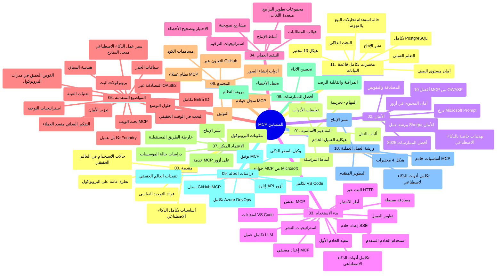

# بروتوكول نموذج السياق (MCP) للمبتدئين - دليل الدراسة

يقدم هذا الدليل الدراسي نظرة عامة على هيكل المستودع ومحتواه لمنهج "بروتوكول نموذج السياق (MCP) للمبتدئين". استخدم هذا الدليل للتنقل في المستودع بكفاءة والاستفادة القصوى من الموارد المتاحة.

## نظرة عامة على المستودع

بروتوكول نموذج السياق (MCP) هو إطار معياري للتفاعلات بين نماذج الذكاء الاصطناعي وتطبيقات العملاء. تم إنشاؤه في الأصل بواسطة أنثروبيك، ويُحافظ عليه الآن من قبل مجتمع MCP الأوسع من خلال منظمة GitHub الرسمية. يوفر هذا المستودع منهجًا شاملاً مع أمثلة تعليمية عملية بالكود بلغات C#، Java، JavaScript، Python وTypeScript، مصمم لمطوري الذكاء الاصطناعي، مهندسي الأنظمة، ومهندسي البرمجيات.

## خريطة المنهج البصرية

## هيكل المستودع

ينظم المستودع إلى أحد عشر قسمًا رئيسيًا، يركز كل منها على جوانب مختلفة من MCP:

1. **المقدمة (00-Introduction/)**
   - نظرة عامة على بروتوكول نموذج السياق
   - أهمية التوحيد في خطوط أنابيب الذكاء الاصطناعي
   - حالات الاستخدام العملية والفوائد

2. **المفاهيم الأساسية (01-CoreConcepts/)**
   - بنية العميل-الخادم
   - مكونات البروتوكول الرئيسية
   - أنماط المراسلة في MCP

3. **الأمان (02-Security/)**
   - تهديدات الأمان في أنظمة تعتمد على MCP
   - أفضل الممارسات لتأمين التنفيذات
   - استراتيجيات التوثيق والتفويض
   - **توثيق أمني شامل**:
     - أفضل ممارسات أمان MCP 2025
     - دليل تنفيذ سلامة المحتوى الخاص بـ Azure
     - ضوابط وتقنيات أمان MCP
     - مرجع سريع لأفضل ممارسات MCP
   - **المواضيع الأمنية الرئيسية**:
     - هجمات حقن المطالبات وتسميم الأدوات
     - اختطاف الجلسة ومشكلة الوكيل المشوش
     - ثغرات تمرير الرموز
     - الصلاحيات المفرطة والتحكم في الوصول
     - أمان سلسلة التوريد لمكونات الذكاء الاصطناعي
     - دمج دروع المطالبات من Microsoft

4. **البدء السريع (03-GettingStarted/)**
   - إعداد البيئة والتكوين
   - إنشاء خوادم وعملاء MCP أساسية
   - التكامل مع التطبيقات الموجودة
   - يتضمن أقسامًا لـ:
     - تنفيذ الخادم الأول
     - تطوير العميل
     - تكامل عميل LLM
     - تكامل VS Code
     - خادم أحداث مرسلة من الخادم (SSE)
     - استخدام الخادم المتقدم
     - البث عبر HTTP
     - تكامل مجموعة أدوات الذكاء الاصطناعي
     - استراتيجيات الاختبار
     - إرشادات النشر

5. **التنفيذ العملي (04-PracticalImplementation/)**
   - استخدام SDKs عبر لغات برمجة مختلفة
   - تقنيات تصحيح الأخطاء، الاختبار، والتحقق
   - صياغة قوالب مطالبة قابلة لإعادة الاستخدام وسير عمل
   - مشاريع نموذجية مع أمثلة تنفيذ

6. **المواضيع المتقدمة (05-AdvancedTopics/)**
   - تقنيات هندسة السياق
   - تكامل وكيل Foundry
   - سير عمل الذكاء الاصطناعي متعدد الأوضاع
   - عروض توثيق OAuth2
   - قدرات البحث في الزمن الحقيقي
   - البث في الزمن الحقيقي
   - تنفيذ سياقات الجذر
   - استراتيجيات التوجيه
   - تقنيات أخذ العينات
   - أساليب التوسع
   - اعتبارات الأمان
   - تكامل أمان Entra ID
   - تكامل البحث عبر الويب
   - التفكير المتعدد الوكلاء العدائي (أنماط المناظرة)

7. **مساهمات المجتمع (06-CommunityContributions/)**
   - كيفية المساهمة بالكود والتوثيق
   - التعاون عبر GitHub
   - التحسينات التي يقودها المجتمع والتعليقات
   - استخدام عملاء MCP مختلفين (Claude Desktop، Cline، VSCode)
   - العمل مع خوادم MCP الشائعة بما في ذلك توليد الصور

8. **دروس من الاعتماد المبكر (07-LessonsfromEarlyAdoption/)**
   - تطبيقات العالم الحقيقي وقصص النجاح
   - بناء ونشر حلول قائمة على MCP
   - الاتجاهات وخارطة الطريق المستقبلية
   - **دليل خوادم MCP من مايكروسوفت**: دليل شامل لعشرة خوادم MCP من مايكروسوفت جاهزة للإنتاج، تشمل:
     - خادم Microsoft Learn Docs MCP
     - خادم Azure MCP (15+ موصل خاص)
     - خادم GitHub MCP
     - خادم Azure DevOps MCP
     - خادم MarkItDown MCP
     - خادم SQL Server MCP
     - خادم Playwright MCP
     - خادم Dev Box MCP
     - خادم Microsoft Foundry MCP
     - خادم مجموعة وكلاء Microsoft 365 MCP

9. **أفضل الممارسات (08-BestPractices/)**
   - ضبط الأداء والتحسين
   - تصميم أنظمة MCP مقاومة للأعطال
   - استراتيجيات الفحص والمرونة

10. **دراسات حالة (09-CaseStudy/)**
    - **سبع دراسات حالة شاملة** تبين تعددية استخدام MCP عبر سيناريوهات متنوعة:
    - **وكلاء السفر في Azure AI**: تنسيق متعدد الوكلاء مع Azure OpenAI وAI Search
    - **تكامل Azure DevOps**: أتمتة عمليات سير العمل مع تحديثات بيانات YouTube
    - **استرجاع الوثائق في الوقت الحقيقي**: عميل وحدة تحكم Python مع بث HTTP
    - **مولد خطة دراسية تفاعلية**: تطبيق ويب Chainlit مع الذكاء الاصطناعي الحواري
    - **التوثيق داخل المحرر**: تكامل VS Code مع سير عمل GitHub Copilot
    - **إدارة API في Azure**: تكامل API للمؤسسات مع إنشاء خادم MCP
    - **سجل GitHub MCP**: تطوير النظام البيئي ومنصة التكامل الوكيلية
    - أمثلة تنفيذ تغطي تكامل المؤسسات، إنتاجية المطور، وتطوير النظام البيئي

11. **ورشة العمل العملية (10-StreamliningAIWorkflowsBuildingAnMCPServerWithAIToolkit/)**
    - ورشة عملية شاملة تجمع MCP مع مجموعة أدوات الذكاء الاصطناعي
    - بناء تطبيقات ذكية تربط نماذج الذكاء الاصطناعي بالأدوات الواقعية
    - وحدات عملية تغطي الأساسيات، تطوير الخادم المخصص واستراتيجيات النشر للإنتاج
    - **هيكل المختبر**:
      - المختبر 1: أساسيات خادم MCP
      - المختبر 2: تطوير خادم MCP المتقدم
      - المختبر 3: تكامل مجموعة أدوات الذكاء الاصطناعي
      - المختبر 4: النشر للإنتاج والتوسع
    - نهج التعلم القائم على المختبر مع تعليمات خطوة بخطوة

12. **مختبرات تكامل قاعدة بيانات خادم MCP (11-MCPServerHandsOnLabs/)**
    - **مسار تعليمي شامل من 13 مختبرًا** لبناء خوادم MCP جاهزة للإنتاج مع تكامل PostgreSQL
    - **تنفيذ تحليلات التجزئة الواقعية** باستخدام حالة استخدام Zava Retail
    - **أنماط من الدرجة المؤسسية** تشمل أمان مستوى الصف Row Level Security (RLS)، البحث الدلالي، والوصول متعدد المستأجرين للبيانات
    - **هيكل المختبر الكامل**:
      - **المختبرات 00-03: الأسس** - مقدمة، الهندسة، الأمان، إعداد البيئة
      - **المختبرات 04-06: بناء خادم MCP** - تصميم قاعدة البيانات، تنفيذ خادم MCP، تطوير الأدوات
      - **المختبرات 07-09: الميزات المتقدمة** - البحث الدلالي، الاختبار وتصحيح الأخطاء، تكامل VS Code
      - **المختبرات 10-12: الإنتاج وأفضل الممارسات** - النشر، الرصد، التحسين
    - **التقنيات المغطاة**: إطار FastMCP، PostgreSQL، Azure OpenAI، تطبيقات الحاويات Azure، Application Insights
    - **نتائج التعلم**: خوادم MCP جاهزة للإنتاج، أنماط تكامل قواعد البيانات، تحليلات مدعومة بالذكاء الاصطناعي، أمان المؤسسات

## موارد إضافية

يتضمن المستودع موارد داعمة:

- **مجلد الصور**: يحتوي على مخططات ورسوم توضيحية مستخدمة طوال المنهج
- **الترجمات**: دعم متعدد اللغات مع ترجمات آلية للتوثيق
- **موارد MCP الرسمية**:
  - [توثيق MCP](https://modelcontextprotocol.io/)
  - [مواصفة MCP](https://spec.modelcontextprotocol.io/)
  - [مستودع MCP على GitHub](https://github.com/modelcontextprotocol)

## كيفية استخدام هذا المستودع

1. **التعلم المتسلسل**: اتبع الفصول بالترتيب (من 00 إلى 11) لتجربة تعلم منظمة.
2. **التركيز حسب اللغة**: إذا كنت مهتمًا بلغة برمجة معينة، استكشف دلائل العينات للتنفيذات في لغتك المفضلة.
3. **التنفيذ العملي**: ابدأ بقسم "البدء السريع" لإعداد بيئتك وإنشاء أول خادم وعميل MCP لك.
4. **الاستكشاف المتقدم**: بعد الاطلاع على الأساسيات، غص في المواضيع المتقدمة لتوسيع معرفتك.
5. **مشاركة المجتمع**: انضم إلى مجتمع MCP عبر مناقشات GitHub وقنوات Discord للتواصل مع الخبراء والمطورين الآخرين.

## عملاء وأدوات MCP

يغطي المنهج عملاء وأدوات MCP المختلفة:

1. **العملاء الرسميون**:
   - Visual Studio Code
   - MCP في Visual Studio Code
   - Claude Desktop
   - Claude في VSCode
   - Claude API

2. **عملاء المجتمع**:
   - Cline (مبني على الطرفية)
   - Cursor (محرر كود)
   - ChatMCP
   - Windsurf

3. **أدوات إدارة MCP**:
   - MCP CLI
   - MCP Manager
   - MCP Linker
   - MCP Router

## خوادم MCP الشائعة

يقدم المستودع مجموعة متنوعة من خوادم MCP، بما في ذلك:

1. **خوادم MCP الرسمية لمايكروسوفت**:
   - خادم Microsoft Learn Docs MCP
   - خادم Azure MCP (15+ موصل متخصص)
   - خادم GitHub MCP
   - خادم Azure DevOps MCP
   - خادم MarkItDown MCP
   - خادم SQL Server MCP
   - خادم Playwright MCP
   - خادم Dev Box MCP
   - خادم Microsoft Foundry MCP
   - خادم مجموعة وكلاء Microsoft 365 MCP

2. **خوادم مرجعية رسمية**:
   - النظام الملفات
   - Fetch
   - الذاكرة
   - التفكير المتسلسل

3. **توليد الصور**:
   - Azure OpenAI DALL-E 3
   - Stable Diffusion WebUI
   - Replicate

4. **أدوات التطوير**:
   - Git MCP
   - Terminal Control
   - مساعد الكود

5. **خوادم متخصصة**:
   - Salesforce
   - Microsoft Teams
   - Jira & Confluence

## المساهمة

يرحب هذا المستودع بالمساهمات من المجتمع. راجع قسم مساهمات المجتمع للحصول على إرشادات حول كيفية المساهمة بفعالية في نظام MCP البيئي.

----

*تم تحديث هذا الدليل الدراسي آخر مرة في 5 فبراير 2026، ويعكس أحدث مواصفة MCP بتاريخ 2025-11-25 ويوفر نظرة عامة على المستودع حتى ذلك التاريخ. قد يتم تحديث محتوى المستودع بعد هذا التاريخ.*

---

<!-- CO-OP TRANSLATOR DISCLAIMER START -->
**تنويه**:
تمت ترجمة هذا المستند باستخدام خدمة الترجمة بالذكاء الاصطناعي [Co-op Translator](https://github.com/Azure/co-op-translator). بينما نسعى للدقة، يرجى العلم أن الترجمات الآلية قد تحتوي على أخطاء أو عدم دقة. يجب اعتبار المستند الأصلي بلغته الأصلية المصدر الرسمي والمعتمد. للمعلومات الهامة، يُنصح بالاستعانة بترجمة بشرية محترفة. نحن غير مسؤولين عن أي سوء فهم أو تفسير ناتج عن استخدام هذه الترجمة.
<!-- CO-OP TRANSLATOR DISCLAIMER END -->