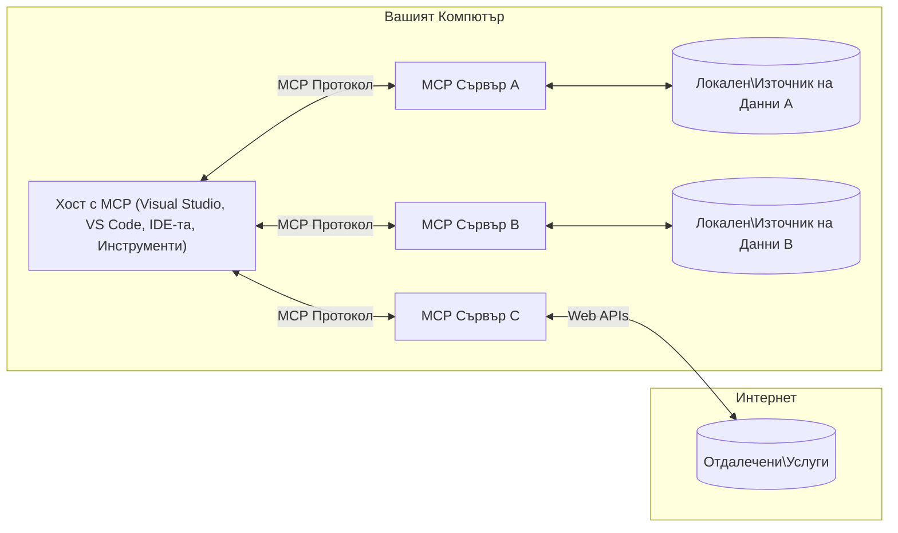

# Основни концепции на MCP: Овладяване на Protocol for AI Integration на контекста на модела

[](https://youtu.be/earDzWGtE84)

_(Кликнете върху изображението по-горе, за да гледате видеото на този урок)_

[Protocol за контекст на модела (MCP)](https://github.com/modelcontextprotocol) е мощен, стандартизиран фреймуърк, който оптимизира комуникацията между Големи езикови модели (LLM) и външни инструменти, приложения и източници на данни.  
Този наръчник ще ви преведе през основните концепции на MCP. Ще научите за неговата архитектура клиент-сървър, основни компоненти, механики на комуникацията и добри практики за имплементация.

- **Ясно съгласие на потребителя**: Цял достъп до данни и операции изискват изрично одобрение от потребителя преди изпълнение. Потребителите трябва ясно да разбират какви данни ще бъдат достъпени и какви действия ще бъдат извършени, с детайлен контрол върху разрешенията и оторизациите.

- **Защита на личните данни**: Потребителските данни се излагат само с изрично съгласие и трябва да бъдат защитени с надеждни контролни механизми през целия жизнен цикъл на взаимодействието. Имплементациите трябва да предотвратяват неоторизиран трансфер на данни и да поддържат строги граници за поверителност.

- **Безопасност при изпълнение на инструменти**: Всяко извикване на инструмент изисква изрично съгласие на потребителя с ясно разбиране на функцията на инструмента, параметрите и потенциалното му въздействие. Надеждни защитни граници трябва да предотвратяват нежелани, опасни или злонамерени изпълнения.

- **Сигурност на транспортния слой**: Всички комуникационни канали трябва да използват подходящи механизми за криптиране и удостоверяване. Отдалечени връзки трябва да прилагат сигурни транспортни протоколи и правилно управление на креденциалите.

#### Насоки за имплементация:

- **Управление на разрешения**: Имплементирайте fin-grained системи за разрешения, които позволяват на потребителите да контролират кои сървъри, инструменти и ресурси са достъпни  
- **Удостоверяване и оторизация**: Използвайте сигурни методи за удостоверяване (OAuth, API ключове) с правилно управление и изтичане на токени  
- **Валидиране на входните данни**: Валидирайте всички параметри и входящи данни според дефинирани схеми за предотвратяване на инжекционни атаки  
- **Дневници за одит**: Поддържайте цялостни логове на всички операции за мониторинг на сигурността и съответствие  

## Преглед

Този урок разглежда фундаменталната архитектура и компоненти, които съставляват екосистемата на Model Context Protocol (MCP). Ще научите за архитектурата клиент-сървър, ключовите компоненти и комуникационните механизми, които осигуряват взаимодействията в MCP.

## Основни учебни цели

След края на този урок вие ще:

- Разбирате архитектурата клиент-сървър на MCP.  
- Идентифицирате роли и отговорности на Хостове, Клиенти и Сървъри.  
- Анализирате основните характеристики, които правят MCP гъвкав интеграционен слой.  
- Научите как тече информацията в екосистемата на MCP.  
- Придобиете практически прозрения чрез примери с код на .NET, Java, Python и JavaScript.

## Архитектура на MCP: По-задълбочен поглед

Екосистемата на MCP е изградена върху клиент-сървър модел. Тази модулна структура позволява на AI приложенията да взаимодействат ефективно с инструменти, бази данни, API и контекстуални ресурси. Нека разгледаме тази архитектура в нейните основни компоненти.

В сърцевината си, MCP следва архитектура клиент-сървър, където хост приложение може да се свързва с множество сървъри:


- **MCP Хостове**: Програми като VSCode, Claude Desktop, IDE или AI инструменти, които искат да имат достъп до данни чрез MCP  
- **MCP Клиенти**: Клиенти на протокола, които поддържат 1:1 връзки със сървъри  
- **MCP Сървъри**: Лековесни програми, които предоставят специфични възможности чрез стандартизирания Model Context Protocol  
- **Локални източници на данни**: Файловете, базите данни и услугите на вашия компютър, до които MCP сървърите могат да осъществяват сигурен достъп  
- **Отдалечени услуги**: Външни системи, достъпни през интернет, до които MCP сървърите могат да се свързват чрез API.  

Протоколът MCP е развиващ се стандарт, използващ версиониране на база дата (формат ГГГГ-ММ-ДД). Текущата версия на протокола е **2025-11-25**. Можете да видите последните обновления в [спецификацията на протокола](https://modelcontextprotocol.io/specification/2025-11-25/)

### 1. Хостове

В Protocol за контекст на модела (MCP), **Хостовете** са AI приложенията, които служат като основен интерфейс, през който потребителите взаимодействат с протокола. Хостовете координират и управляват връзки с множество MCP сървъри, като създават отделни MCP клиенти за всяка връзка със сървър. Примери за хостове включват:

- **AI приложения**: Claude Desktop, Visual Studio Code, Claude Code  
- **Среди за разработка**: IDE и редактори на код с интеграция MCP  
- **Персонализирани приложения**: Специално създадени AI агенти и инструменти

**Хостовете** са приложения, които координират взаимодействията с AI модели. Те:

- **Оркестрират AI модели**: Изпълняват или взаимодействат с LLM, за да генерират отговори и координират AI процесите  
- **Управляват клиентските връзки**: Създават и поддържат един MCP клиент за всяка връзка със сървър  
- **Контролират потребителския интерфейс**: Управляват потока на разговори, взаимодействията с потребителя и представянето на отговорите  
- **Прилагат сигурност**: Контролират разрешения, ограничения и удостоверяване  
- **Обработват потребителско съгласие**: Управляват одобрението на потребителя за споделяне на данни и изпълнение на инструменти  

### 2. Клиенти

**Клиентите** са съществени компоненти, които поддържат посветени връзки едно към едно между Хостове и MCP сървъри. Всеки MCP клиент се създава от Хоста за връзка със специфичен MCP сървър, осигурявайки организирани и сигурни комуникационни канали. Множество клиенти позволяват на Хостовете да се свързват с няколко сървъра едновременно.

**Клиентите** са конекторни компоненти в хост приложението. Те:

- **Комуникация по протокола**: Изпращат JSON-RPC 2.0 заявки към сървъри с промпти и инструкции  
- **Неготиране на възможности**: Преговарят за поддържани характеристики и версии на протокола със сървърите при инициализация  
- **Изпълнение на инструменти**: Управляват заявки за изпълнение на инструменти от модели и обработват отговорите  
- **Обновявания в реално време**: Обработват известия и обновявания от сървърите  
- **Обработка на отговори**: Форматират и обработват отговорите от сървъра за показване на потребителите  

### 3. Сървъри

**Сървърите** са програми, които предоставят контекст, инструменти и възможности на MCP клиентите. Те могат да изпълняват локално (на същата машина като Хоста) или отдалечено (външни платформи) и отговарят за обработка на клиентски заявки и предоставяне на структурирани отговори. Сървърите предлагат специфична функционалност чрез стандартизирания Model Context Protocol.

**Сървърите** са услуги, които осигуряват контекст и възможности. Те:

- **Регистрация на функции**: Регистрират и предоставят достъпни примитиви (ресурси, промпти, инструменти) на клиентите  
- **Обработка на заявки**: Получават и изпълняват повиквания на инструменти, заявките за ресурси и промпти от клиентите  
- **Предоставяне на контекст**: Дават контекстуална информация и данни за подобряване на отговорите от модела  
- **Управление на състояние**: Поддържат сесийно състояние и обработват състояниеви взаимодействия при необходимост  
- **Известия в реално време**: Изпращат уведомления за промени във възможностите и обновления към свързаните клиенти  

Сървърите могат да бъдат разработвани от всеки, за да разширят възможностите на моделите със специализирана функционалност, и поддържат локално и отдалечено разгръщане.

### 4. Примитиви на сървъра

Сървърите в Model Context Protocol (MCP) предоставят три основни **примитива**, които дефинират фундаменталните градивни елементи за богати взаимодействия между клиенти, хостове и езикови модели. Тези примитиви уточняват типовете контекстуална информация и действия, налични чрез протокола.

MCP сървърите могат да предоставят всяка комбинация от следните три основни примитива:

#### Ресурси

**Ресурсите** са източници на данни, които предоставят контекстуална информация на AI приложенията. Те представляват статично или динамично съдържание, което може да подобри разбирането и вземането на решения от модела:

- **Контекстуални данни**: Структурирана информация и контекст за използване от AI модела  
- **Бази знания**: Репозитории от документи, статии, ръководства и научни публикации  
- **Локални източници на данни**: Файлове, бази данни и локална системна информация  
- **Външни данни**: Отговори от API, уеб услуги и данни от отдалечени системи  
- **Динамично съдържание**: Данни в реално време, които се обновяват според външни условия  

Ресурсите се идентифицират чрез URI и поддържат откриване с методи `resources/list` и извличане чрез `resources/read`:

```text
file://documents/project-spec.md
database://production/users/schema
api://weather/current
```
  
#### Промпти

**Промптите** са преизползваеми шаблони, които помагат за структуриране на взаимодействия с езикови модели. Те предоставят стандартизирани модели на взаимодействие и шаблонирани работни процеси:

- **Шаблонни взаимодействия**: Предварително структуриран текст и начални съобщения за разговор  
- **Работни процеси с шаблони**: Стандартизирани последователности за често срещани задачи и взаимодействия  
- **Малък брой примери**: Шаблони на базата на примери за инструкции към модела  
- **Системни промпти**: Основни промпти, които дефинират поведението и контекста на модела  
- **Динамични шаблони**: Параметризирани промпти, които се адаптират към специфичен контекст  

Промптите поддържат заместване на променливи и могат да се откриват с `prompts/list` и извличат чрез `prompts/get`:

```markdown
Generate a {{task_type}} for {{product}} targeting {{audience}} with the following requirements: {{requirements}}
```
  
#### Инструменти

**Инструментите** са изпълними функции, които AI моделите могат да викат, за да извършват конкретни действия. Те представляват "глаголите" в екосистемата на MCP, позволявайки на моделите да взаимодействат с външни системи:

- **Изпълними функции**: Отделни операции, които моделите могат да извикват с конкретни параметри  
- **Интеграция с външни системи**: API повиквания, заявки към бази данни, операции с файлове, изчисления  
- **Уникална идентичност**: Всеки инструмент има уникално име, описание и схема на параметрите  
- **Структурирана входно-изходна работа**: Инструментите приемат валидирани параметри и връщат структурирани, типизирани отговори  
- **Възможности за действия**: Позволяват на моделите да извършват реални действия и да извличат живи данни  

Инструментите са дефинирани с JSON Schema за валидация на параметрите и се откриват чрез `tools/list` и се изпълняват чрез `tools/call`. Инструментите могат да включват иконки като допълнителни метаданни за по-добро визуално представяне.

**Анотации на инструментите**: Инструментите поддържат поведенчески анотации (например `readOnlyHint`, `destructiveHint`), които описват дали инструментът е само за четене или е деструктивен, подпомагайки клиентите да вземат информирани решения за изпълнението им.

Пример за дефиниция на инструмент:

```typescript
server.tool(
  "search_products", 
  {
    query: z.string().describe("Search query for products"),
    category: z.string().optional().describe("Product category filter"),
    max_results: z.number().default(10).describe("Maximum results to return")
  }, 
  async (params) => {
    // Изпълнете търсене и върнете структурирани резултати
    return await productService.search(params);
  }
);
```
  
## Примитиви на клиента

В Protocol за контекст на модела (MCP), **клиентите** могат да предоставят примитиви, които позволяват на сървърите да искат допълнителни възможности от хост приложението. Тези примитиви от страна на клиента позволяват по-богати, интерактивни сървърни имплементации, които могат да достъпват възможности на AI моделите и взаимодействия с потребителите.

### Извличане (Sampling)

**Извличането** позволява на сървърите да искат допълвания на езиковия модел от AI приложението на клиента. Този примитив позволява на сървърите да използват капацитета на LLM без да вграждат зависимости от модели:

- **Независим достъп до модел**: Сървърите могат да искат допълвания без да включват SDK на LLM или да управляват достъп до модели  
- **AI стартиран от сървъра**: Позволява на сървърите автономно да генерират съдържание с модела на клиента  
- **Рекурсивни взаимодействия с LLM**: Поддържа сложни сценарии, в които сървърите се нуждаят от AI помощ за обработка  
- **Динамично генериране на съдържание**: Позволява на сървърите да създават контекстуални отговори с помощта на модела на хоста  
- **Поддръжка на извикване на инструменти**: Сървърите могат да включват параметри `tools` и `toolChoice`, за да позволят на модела на клиента да извиква инструменти по време на извличането

Извличането се стартира чрез метода `sampling/complete`, където сървърите изпращат заявки за допълване към клиентите.

### Корени (Roots)

**Корените** предлагат стандартизиран начин за клиентите да изложат границите на файловата система на сървърите, помагайки на сървърите да разбират кои директории и файлове имат достъп:

- **Граници на файловата система**: Дефинират границите, в които сървърите могат да оперират във файловата система  
- **Контрол на достъп**: Помагат на сървърите да разберат за кои директории и файлове имат разрешение за достъп  
- **Динамични обновявания**: Клиентите могат да уведомяват сървърите, когато списъкът с корени се промени  
- **Идентификация на базата на URI**: Корените използват `file://` URI, за да идентифицират достъпните директории и файлове  

Корените се откриват чрез метода `roots/list`, като клиентите изпращат `notifications/roots/list_changed` при промяна на корените.

### Искащи действия (Elicitation)

**Искащите действия** позволяват на сървърите да искат допълнителна информация или потвърждение от потребителите чрез интерфейса на клиента:

- **Заявки за потребителски вход**: Сървърите могат да искат допълнителна информация, когато е необходима за изпълнението на инструмент  
- **Диалози за потвърждение**: Искат одобрение от потребителя за чувствителни или въздействащи операции  
- **Интерактивни работни процеси**: Позволяват на сървърите да създават стъпка по стъпка взаимодействия с потребителя  
- **Динамично събиране на параметри**: Събират липсващи или опционални параметри по време на изпълнение на инструменти  

Заявките за искащи действия се правят с метода `elicitation/request`, за да се събере потребителски вход през интерфейса на клиента.

**Режим на искащи действия с URL**: Сървърите могат да искат взаимодействия с потребителя чрез URL, позволявайки да насочват потребителите към външни уеб страници за удостоверяване, потвърждение или въвеждане на данни.

### Логване (Logging)

**Логването** позволява на сървърите да изпращат структурирани лог-съобщения към клиентите за дебъгване, мониторинг и оперативна видимост:

- **Поддръжка за дебъгване**: Позволява на сървърите да предоставят подробни журнали за изпълнението при отстраняване на грешки  
- **Оперативен мониторинг**: Изпраща статусни обновявания и показатели за производителност към клиентите  
- **Съобщаване за грешки**: Подробен контекст и диагностична информация за грешки  
- **Следи за одит**: Създава изчерпателни дневници на операции и решения на сървъра  

Лог-съобщенията се изпращат към клиентите, за да осигурят прозрачност при операцията на сървърите и да улеснят дебъгването.

## Поток на информацията в MCP

Protocol за контекст на модела (MCP) дефинира структуриран поток на информация между хостове, клиенти, сървъри и модели. Разбирането на този поток помага да се изясни как се обработват заявките на потребителите и как външните инструменти и данни се интегрират в отговорите на моделите.
- **Домакинът инициира връзка**  
  Приложението-домакин (като IDE или чат интерфейс) установява връзка със сървър MCP, обикновено чрез STDIO, WebSocket или друг поддържан транспорт.

- **Договаряне на възможности**  
  Клиентът (вграденият в домакина) и сървърът разменят информация за поддържаните от тях функции, инструменти, ресурси и версии на протокола. Това гарантира, че и двете страни разбират наличните възможности за сесията.

- **Потребителска заявка**  
  Потребителят взаимодейства с домакина (напр. въвежда заявка или команда). Домакинът събира този вход и го предава на клиента за обработка.

- **Използване на ресурс или инструмент**  
  - Клиентът може да поиска допълнителен контекст или ресурси от сървъра (като файлове, записи от база данни или статии от база знания), за да обогати разбирането на модела.
  - Ако моделът определи, че е необходим инструмент (напр. за извличане на данни, извършване на изчисление или повикване на API), клиентът изпраща заявка за повикване на инструмент към сървъра, като посочва името на инструмента и параметрите.

- **Изпълнение от сървъра**  
  Сървърът получава заявката за ресурс или инструмент, изпълнява необходимите операции (като стартиране на функция, заявка към база данни или извличане на файл) и връща резултатите на клиента в структурирана форма.

- **Генериране на отговор**  
  Клиентът интегрира отговорите от сървъра (данни от ресурси, резултати от инструменти и др.) в текущото взаимодействие с модела. Моделът използва тази информация, за да създаде изчерпателен и контекстуално релевантен отговор.

- **Представяне на резултат**  
  Домакинът получава крайния резултат от клиента и го представя на потребителя, често включително както генерирания текст от модела, така и резултатите от изпълнение на инструменти или извличане на ресурси.

Този процес дава възможност на MCP да поддържа усъвършенствани, интерактивни и контекстно осъзнати AI приложения чрез безпроблемно свързване на модели с външни инструменти и източници на данни.

## Архитектура на протокола и слоеве

MCP се състои от два отделни архитектурни слоя, които работят заедно, за да предоставят цялостна рамка за комуникация:

### Слой Данни

**Слой Данни** реализира основния MCP протокол, използвайки **JSON-RPC 2.0** като основа. Този слой дефинира структурата на съобщенията, семантика и модели на взаимодействие:

#### Основни компоненти:

- **Протокол JSON-RPC 2.0**: Цялата комуникация използва стандартизиран формат за съобщения JSON-RPC 2.0 за повиквания на методи, отговори и уведомления
- **Управление на жизнения цикъл**: Обработва инициализация на връзка, договаряне на възможности и прекратяване на сесии между клиенти и сървъри
- **Примитиви за сървър**: Позволява на сървърите да предоставят основна функционалност чрез инструменти, ресурси и подсказки
- **Примитиви за клиент**: Позволява на сървърите да искат семплиране от големи езикови модели, да искат потребителски вход и да изпращат лог съобщения
- **Известия в реално време**: Поддържа асинхронни уведомления за динамични актуализации без да е необходимо поллиране

#### Ключови характеристики:

- **Договаряне на версия на протокола**: Използва версиониране с базирана на дата схема (ГГГГ-ММ-ДД) за осигуряване на съвместимост
- **Откриване на възможности**: Клиенти и сървъри обменят информация за поддържани функции по време на инициализацията
- **Държавни сесии**: Поддържа състояние на връзката през множество взаимодействия за контекстуална непрекъснатост

### Транспортен слой

**Транспортният слой** управлява комуникационните канали, рамкиране на съобщения и автентикация между участниците в MCP:

#### Поддържани транспортни механизми:

1. **STDIO транспорт**:
   - Използва стандартни входни/изходни потоци за директна комуникация между процеси
   - Оптимален за локални процеси на една и съща машина без мрежови разходи
   - Често използван за локални реализации на MCP сървър

2. **Streamable HTTP транспорт**:
   - Използва HTTP POST за съобщения от клиент към сървър  
   - Опционални Server-Sent Events (SSE) за поток от сървър към клиент
   - Позволява отдалечена комуникация с сървъри през мрежи
   - Поддържа стандартна HTTP автентикация (носителски токени, API ключове, персонализирани заглавки)
   - MCP препоръчва OAuth за сигурна автентикация на базата на токени

#### Абстракция на транспорта:

Транспортният слой абстрахира детайлите на комуникацията от слоя данни, позволявайки използването на един и същ формат JSON-RPC 2.0 съобщения за всички транспортни механизми. Тази абстракция позволява приложения да преминават безпроблемно между локални и отдалечени сървъри.

### Съображения за сигурност

Реализациите на MCP трябва да спазват няколко основни принципа за сигурност, за да се осигурят сигурни, надеждни и защитени взаимодействия във всички операции на протокола:

- **Съгласие и контрол от потребителя**: Потребителите трябва да дадат изрично съгласие преди достъп до всякакви данни или изпълнение на операции. Те трябва да имат ясен контрол върху споделените данни и разрешените действия чрез интуитивни потребителски интерфейси за преглед и одобрение на дейностите.

- **Поверителност на данните**: Данните на потребителя трябва да се разкриват само след изрично съгласие и да се защитават с подходящи достъпни контроли. Реализациите на MCP трябва да предотвратяват неоторизиран трансфер на данни и да гарантират запазване на поверителността през всички взаимодействия.

- **Безопасност на инструментите**: Преди извикване на който и да е инструмент е необходимо изрично съгласие от потребителя. Потребителите трябва ясно да разбират функциите на всеки инструмент и да се налагат строги граници за сигурност, за да се предотврати неволно или опасно изпълнение.

Следвайки тези принципи, MCP осигурява доверие, поверителност и безопасност на потребителя във всички взаимодействия с протокола, като същевременно позволява мощни AI интеграции.

## Примерен код: основни компоненти

По-долу са дадени примерни кодове на няколко популярни програмни езика, които илюстрират как да се реализират ключови компоненти на MCP сървър и инструменти.

### Пример на .NET: Създаване на прост MCP сървър с инструменти

Ето един практичен пример на .NET, демонстриращ как да се реализира прост MCP сървър със собствени инструменти. Този пример показва как да се дефинират и регистрират инструменти, обработват заявки и свърже сървъра чрез Model Context Protocol.

```csharp
using System;
using System.Threading.Tasks;
using ModelContextProtocol.Server;
using ModelContextProtocol.Server.Transport;
using ModelContextProtocol.Server.Tools;

public class WeatherServer
{
    public static async Task Main(string[] args)
    {
        // Create an MCP server
        var server = new McpServer(
            name: "Weather MCP Server",
            version: "1.0.0"
        );
        
        // Register our custom weather tool
        server.AddTool<string, WeatherData>("weatherTool", 
            description: "Gets current weather for a location",
            execute: async (location) => {
                // Call weather API (simplified)
                var weatherData = await GetWeatherDataAsync(location);
                return weatherData;
            });
        
        // Connect the server using stdio transport
        var transport = new StdioServerTransport();
        await server.ConnectAsync(transport);
        
        Console.WriteLine("Weather MCP Server started");
        
        // Keep the server running until process is terminated
        await Task.Delay(-1);
    }
    
    private static async Task<WeatherData> GetWeatherDataAsync(string location)
    {
        // This would normally call a weather API
        // Simplified for demonstration
        await Task.Delay(100); // Simulate API call
        return new WeatherData { 
            Temperature = 72.5,
            Conditions = "Sunny",
            Location = location
        };
    }
}

public class WeatherData
{
    public double Temperature { get; set; }
    public string Conditions { get; set; }
    public string Location { get; set; }
}
```

### Пример на Java: Компоненти на MCP сървър

Този пример демонстрира същия MCP сървър и регистриране на инструменти като във .NET примера по-горе, но реализиран на Java.

```java
import io.modelcontextprotocol.server.McpServer;
import io.modelcontextprotocol.server.McpToolDefinition;
import io.modelcontextprotocol.server.transport.StdioServerTransport;
import io.modelcontextprotocol.server.tool.ToolExecutionContext;
import io.modelcontextprotocol.server.tool.ToolResponse;

public class WeatherMcpServer {
    public static void main(String[] args) throws Exception {
        // Създайте MCP сървър
        McpServer server = McpServer.builder()
            .name("Weather MCP Server")
            .version("1.0.0")
            .build();
            
        // Регистрирайте метеорологичен инструмент
        server.registerTool(McpToolDefinition.builder("weatherTool")
            .description("Gets current weather for a location")
            .parameter("location", String.class)
            .execute((ToolExecutionContext ctx) -> {
                String location = ctx.getParameter("location", String.class);
                
                // Вземете метеорологични данни (опростено)
                WeatherData data = getWeatherData(location);
                
                // Върнете форматиран отговор
                return ToolResponse.content(
                    String.format("Temperature: %.1f°F, Conditions: %s, Location: %s", 
                    data.getTemperature(), 
                    data.getConditions(), 
                    data.getLocation())
                );
            })
            .build());
        
        // Свържете сървъра чрез stdio транспорт
        try (StdioServerTransport transport = new StdioServerTransport()) {
            server.connect(transport);
            System.out.println("Weather MCP Server started");
            // Поддържайте сървъра работещ, докато процесът не бъде прекратен
            Thread.currentThread().join();
        }
    }
    
    private static WeatherData getWeatherData(String location) {
        // Имплементацията би извикала метеорологичен API
        // Опростено за примерни цели
        return new WeatherData(72.5, "Sunny", location);
    }
}

class WeatherData {
    private double temperature;
    private String conditions;
    private String location;
    
    public WeatherData(double temperature, String conditions, String location) {
        this.temperature = temperature;
        this.conditions = conditions;
        this.location = location;
    }
    
    public double getTemperature() {
        return temperature;
    }
    
    public String getConditions() {
        return conditions;
    }
    
    public String getLocation() {
        return location;
    }
}
```

### Пример на Python: Изграждане на MCP сървър

Този пример използва fastmcp, моля, инсталирайте го първо:

```python
pip install fastmcp
```
Примерен код:

```python
#!/usr/bin/env python3
import asyncio
from fastmcp import FastMCP
from fastmcp.transports.stdio import serve_stdio

# Създаване на FastMCP сървър
mcp = FastMCP(
    name="Weather MCP Server",
    version="1.0.0"
)

@mcp.tool()
def get_weather(location: str) -> dict:
    """Gets current weather for a location."""
    return {
        "temperature": 72.5,
        "conditions": "Sunny",
        "location": location
    }

# Алтернативен подход чрез използване на клас
class WeatherTools:
    @mcp.tool()
    def forecast(self, location: str, days: int = 1) -> dict:
        """Gets weather forecast for a location for the specified number of days."""
        return {
            "location": location,
            "forecast": [
                {"day": i+1, "temperature": 70 + i, "conditions": "Partly Cloudy"}
                for i in range(days)
            ]
        }

# Регистриране на класови инструменти
weather_tools = WeatherTools()

# Стартиране на сървъра
if __name__ == "__main__":
    asyncio.run(serve_stdio(mcp))
```

### Пример на JavaScript: Създаване на MCP сървър

Този пример показва създаването на MCP сървър на JavaScript и как да се регистрират два инструмента, свързани с времето.

```javascript
// Използване на официалния SDK за протокола Model Context
import { McpServer } from "@modelcontextprotocol/sdk/server/mcp.js";
import { StdioServerTransport } from "@modelcontextprotocol/sdk/server/stdio.js";
import { z } from "zod"; // За проверка на параметрите

// Създаване на MCP сървър
const server = new McpServer({
  name: "Weather MCP Server",
  version: "1.0.0"
});

// Дефиниране на инструмент за време
server.tool(
  "weatherTool",
  {
    location: z.string().describe("The location to get weather for")
  },
  async ({ location }) => {
    // Обикновено това би извикало метеорологичен API
    // Оптимизирано за демонстрация
    const weatherData = await getWeatherData(location);
    
    return {
      content: [
        { 
          type: "text", 
          text: `Temperature: ${weatherData.temperature}°F, Conditions: ${weatherData.conditions}, Location: ${weatherData.location}` 
        }
      ]
    };
  }
);

// Дефиниране на инструмент за прогноза
server.tool(
  "forecastTool",
  {
    location: z.string(),
    days: z.number().default(3).describe("Number of days for forecast")
  },
  async ({ location, days }) => {
    // Обикновено това би извикало метеорологичен API
    // Оптимизирано за демонстрация
    const forecast = await getForecastData(location, days);
    
    return {
      content: [
        { 
          type: "text", 
          text: `${days}-day forecast for ${location}: ${JSON.stringify(forecast)}` 
        }
      ]
    };
  }
);

// Помощни функции
async function getWeatherData(location) {
  // Симулиране на извикване на API
  return {
    temperature: 72.5,
    conditions: "Sunny",
    location: location
  };
}

async function getForecastData(location, days) {
  // Симулиране на извикване на API
  return Array.from({ length: days }, (_, i) => ({
    day: i + 1,
    temperature: 70 + Math.floor(Math.random() * 10),
    conditions: i % 2 === 0 ? "Sunny" : "Partly Cloudy"
  }));
}

// Свързване на сървъра чрез stdio транспорт
const transport = new StdioServerTransport();
server.connect(transport).catch(console.error);

console.log("Weather MCP Server started");
```

Този JavaScript пример демонстрира как да създадете MCP сървър, който регистрира инструменти за времето и се свързва чрез stdio транспорт за обработка на входящите клиентски заявки.

## Сигурност и упълномощаване

MCP включва няколко вградени концепции и механизми за управление на сигурността и упълномощаването в целия протокол:

1. **Контрол на разрешения за инструменти**:  
  Клиентите могат да посочат кои инструменти моделът може да използва по време на сесия. Това гарантира, че достъпни са само изрично разрешените инструменти, което намалява риска от нежелани или опасни операции. Разрешенията могат да се конфигурират динамично според предпочитанията на потребителя, организационните политики или контекста на взаимодействието.

2. **Автентикация**:  
  Сървърите могат да изискват автентикация преди да предоставят достъп до инструменти, ресурси или чувствителни операции. Това може да включва API ключове, OAuth токени или други схеми за автентикация. Правилната автентикация осигурява, че само доверени клиенти и потребители могат да извикват сървърни възможности.

3. **Валидация**:  
  Извършва се проверка на параметрите за всички повиквания на инструменти. Всеки инструмент дефинира очакваните типове, формати и ограничения за параметрите си, а сървърът валидира входящите заявки според това. Това предотвратява подаването на неправилни или злонамерени входни данни към реализациите на инструментите и помага за поддържане на целостта на операциите.

4. **Ограничаване на честотата (Rate Limiting)**:  
  За да се предотврати злоупотреба и да се осигури честно използване на ресурсите на сървъра, MCP сървърите могат да прилагат ограничения за честотата на повиквания на инструменти и достъп до ресурси. Ограниченията могат да се прилагат на потребител, сесия или глобално ниво и помагат за защита срещу атаки тип отказ на услуга или прекомерна консумация на ресурси.

Чрез комбиниране на тези механизми MCP предоставя сигурна основа за интеграция на езикови модели с външни инструменти и източници на данни, като същевременно предоставя на потребителите и разработчиците прецизен контрол върху достъпа и използването.

## Протоколни съобщения и поток на комуникация

Комуникацията в MCP използва структурирани съобщения според **JSON-RPC 2.0**, които улесняват ясни и надеждни взаимодействия между домакини, клиенти и сървъри. Протоколът дефинира специфични модели на съобщения за различни видове операции:

### Основни типове съобщения:

#### **Инициализационни съобщения**
- **`initialize` заявка**: Осъществява връзка и договаря версия на протокола и възможности
- **`initialize` отговор**: Потвърждава поддържаните функции и информация за сървъра  
- **`notifications/initialized`**: Сигнализира, че инициализацията е приключила и сесията е готова

#### **Откривателни съобщения**
- **`tools/list` заявка**: Открива наличните инструменти от сървъра
- **`resources/list` заявка**: Изброява наличните ресурси (източници на данни)
- **`prompts/list` заявка**: Извлича наличните шаблони за подсказки

#### **Изпълнителни съобщения**  
- **`tools/call` заявка**: Изпълнява конкретен инструмент с подадените параметри
- **`resources/read` заявка**: Извлича съдържание от конкретен ресурс
- **`prompts/get` заявка**: Взима шаблон за подсказка с опционални параметри

#### **Клиентски съобщения**
- **`sampling/complete` заявка**: Сървърът иска попълване от LLM през клиента
- **`elicitation/request`**: Сървърът иска потребителски вход чрез клиентски интерфейс
- **Логиращи съобщения**: Сървърът изпраща структурирани лог съобщения към клиента

#### **Уведомителни съобщения**
- **`notifications/tools/list_changed`**: Сървърът уведомява клиента за промени в инструментите
- **`notifications/resources/list_changed`**: Сървърът уведомява клиента за промени в ресурсите  
- **`notifications/prompts/list_changed`**: Сървърът уведомява клиента за промени в подсказките

### Структура на съобщенията:

Всички MCP съобщения следват формата JSON-RPC 2.0 с:  
- **Заявки**: Включват `id`, `method` и опционални `params`  
- **Отговори**: Включват `id` и либо `result`, либо `error`  
- **Уведомления**: Включват `method` и опционални `params` (без `id` и без очакван отговор)  

Тази структурирана комуникация гарантира надеждни, проследими и разширяеми взаимодействия, поддържащи сложни сценарии като актуализации в реално време, свързване на инструменти и надеждно обработване на грешки.

### Задачи (експериментални)

**Задачи** са експериментална функция, която предоставя трайни опаковки за изпълнение, позволяващи отложено изземване на резултати и проследяване на статус за MCP заявки:

- **Дълготрайни операции**: Проследяване на скъпи изчисления, автоматизация на работни потоци и пакетна обработка
- **Отложени резултати**: Полинг за статус на задача и получаване на резултати при приключване на операции
- **Проследяване на статус**: Наблюдение на прогреса на задачата чрез дефинирани състояния на жизнения цикъл
- **Многостъпкови операции**: Поддръжка на сложни работни потоци, обхващащи множество взаимодействия

Задачите опаковат стандартни MCP заявки, за да позволят асинхронни модели на изпълнение за операции, които не могат да завършат веднага.

## Основни изводи

- **Архитектура**: MCP използва клиент-сървър архитектура, където домакините управляват множество клиентски връзки към сървъри
- **Участници**: Екосистемата включва домакини (AI приложения), клиенти (протоколни конектори) и сървъри (доставчици на възможности)
- **Транспортни механизми**: Комуникацията поддържа STDIO (локално) и потоков HTTP с опционални SSE (отдалечено)
- **Основни примитиви**: Сървърите предоставят инструменти (изпълними функции), ресурси (източници на данни) и подсказки (шаблони)
- **Клиентски примитиви**: Сървърите могат да искат семплиране (попълвания от LLM с поддръжка на повиквания на инструменти), събиране на вход (включително режим URL), корени (ограничения на файлова система) и логиране от клиентите
- **Експериментални функции**: Задачите предоставят трайни опаковки за дълготрайни операции
- **Основи на протокола**: Изградени върху JSON-RPC 2.0 с версия по дата (актуална: 2025-11-25)
- **Възможности в реално време**: Поддържа уведомления за динамични актуализации и синхронизация в реално време
- **Приоритет на сигурността**: Ясно съгласие от потребителя, защита на поверителността и сигурен транспорт са основни изисквания

## Упражнение

Проектирайте прост MCP инструмент, който би бил полезен във вашата област. Определете:  
1. Как ще се казва инструментът  
2. Какви параметри ще приема  
3. Какъв ще бъде изходът му  
4. Как моделът би използвал този инструмент за решаване на потребителски проблеми


---

## Какво следва

Следва: [Глава 2: Сигурност](../02-Security/README.md)

---

<!-- CO-OP TRANSLATOR DISCLAIMER START -->
**Отказ от отговорност**:
Този документ е преведен с помощта на AI преводаческа услуга [Co-op Translator](https://github.com/Azure/co-op-translator). Въпреки че се стремим към точност, моля, имайте предвид, че автоматичните преводи могат да съдържат грешки или неточности. Оригиналният документ на неговия роден език трябва да се счита за авторитетен източник. За критична информация се препоръчва професионален човешки превод. Ние не носим отговорност за каквито и да било недоразумения или неправилни тълкувания, възникнали от използването на този превод.
<!-- CO-OP TRANSLATOR DISCLAIMER END -->