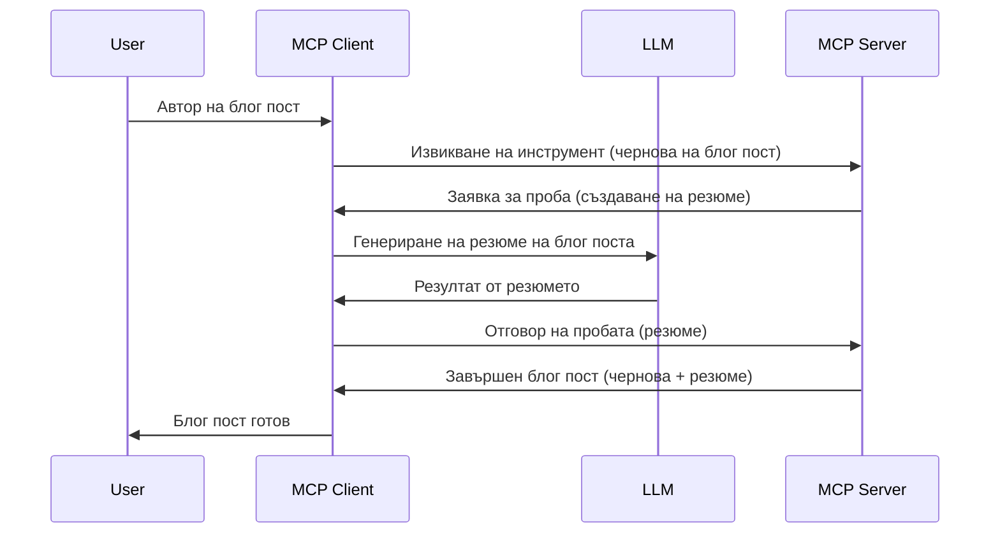

# Извадка - делегиране на функционалности към Клиента

Понякога е необходимо MCP Клиентът и MCP Сървърът да си сътрудничат, за да постигнат обща цел. Може да имате случай, когато Сървърът изисква помощ от LLM, който се намира на клиента. За тази ситуация трябва да използвате извадка (sampling).

Нека разгледаме някои употреби и как да изградим решение, включващо извадка.

## Обзор

В този урок се фокусираме върху обяснението кога и къде да използвате извадка и как да я конфигурирате.

## Учебни цели

В тази глава ще:

- Обясним какво е извадка и кога да я използваме.
- Покажем как да конфигурираме извадка в MCP.
- Представим примери за използване на извадка.

## Какво е извадка и защо да се използва?

Извадката е разширена функция, която работи по следния начин:



### Заявка за извадка

Добре, сега имаме общ поглед върху достоверен сценарий, нека поговорим за извадковата заявка, която сървърът изпраща обратно към клиента. Ето как може да изглежда такава заявка в JSON-RPC формат:

```json
{
  "jsonrpc": "2.0",
  "id": 1,
  "method": "sampling/createMessage",
  "params": {
    "messages": [
      {
        "role": "user",
        "content": {
          "type": "text",
          "text": "Create a blog post summary of the following blog post: <BLOG POST>"
        }
      }
    ],
    "modelPreferences": {
      "hints": [
        {
          "name": "claude-3-sonnet"
        }
      ],
      "intelligencePriority": 0.8,
      "speedPriority": 0.5
    },
    "systemPrompt": "You are a helpful assistant.",
    "maxTokens": 100
  }
}
```

Има няколко неща, които заслужават внимание:

- Prompt, под content -> text, е нашият prompt, който е инструкция за LLM да обобщи съдържанието на блог поста.

- **modelPreferences**. Този раздел е точно това, предпочитание, препоръка за това каква конфигурация да се използва с LLM. Потребителят може да избира дали да следва тези препоръки или да ги променя. В този случай има препоръки за използвания модел и приоритет за скорост и интелигентност.
- **systemPrompt**, това е нормалният ви системен prompt, който придава личност на вашия LLM и съдържа указания.
- **maxTokens**, това е още една характеристика, която указва колко токена се препоръчват за тази задача.

### Отговор на извадка

Това е отговорът, който MCP Клиентът в крайна сметка изпраща обратно към MCP Сървъра и е резултат от това, че клиентът извиква LLM, изчаква отговора и след това конструира това съобщение. Ето как може да изглежда в JSON-RPC:

```json
{
  "jsonrpc": "2.0",
  "id": 1,
  "result": {
    "role": "assistant",
    "content": {
      "type": "text",
      "text": "Here's your abstract <ABSTRACT>"
    },
    "model": "gpt-5",
    "stopReason": "endTurn"
  }
}
```

Обърнете внимание как отговорът е обобщение на блог поста, както поискаме. Също така забележете, че използваният `model` не е този, който поискахме, а "gpt-5" вместо "claude-3-sonnet". Това илюстрира, че потребителят може да промени решението си за използвания модел и че вашата извадкова заявка е препоръка.

Добре, сега когато разбираме основния поток и полезната задача, за която се използва – "създаване на блог пост + обобщение", нека видим какво трябва да направим, за да заработи.

### Типове съобщения

Съобщенията за извадка не са ограничени само до текст, можете също да изпращате изображения и аудио. Ето как изглежда JSON-RPC различно:

**Текст**

```json
{
  "type": "text",
  "text": "The message content"
}
```

**Съдържание на изображение**

```json
{
  "type": "image",
  "data": "base64-encoded-image-data",
  "mimeType": "image/jpeg"
}
```

**Съдържание на аудио**

```json
{
  "type": "audio",
  "data": "base64-encoded-audio-data",
  "mimeType": "audio/wav"
}
```

> ПОЗНАМ: за по-подробна информация относно извадката, разгледайте [официалната документация](https://modelcontextprotocol.io/specification/2025-11-25/client/sampling)

## Как да конфигурираме извадка в Клиента

> Забележка: ако изграждате само сървър, не е нужно да правите много тук.

В клиент трябва да посочите следната функционалност по следния начин:

```json
{
  "capabilities": {
    "sampling": {}
  }
}
```

Това ще бъде открито, когато избраният от вас клиент се инициализира със сървъра.

## Пример за използване на извадка - Създаване на блог пост

Нека програмираме сървър за извадка заедно, ще трябва да направим следното:

1. Създайте инструмент на Сървъра.
1. Този инструмент трябва да създаде извадкова заявка.
1. Инструментът трябва да изчака, докато заявката за извадка на клиента не бъде отговорена.
1. След това резултатът от инструмента трябва да бъде получен.

Нека видим кода стъпка по стъпка:

### -1- Създаване на инструмента

**python**

```python
@mcp.tool()
async def create_blog(title: str, content: str, ctx: Context[ServerSession, None]) -> str:
    """Create a blog post and generate a summary"""

```

### -2- Създаване на извадкова заявка

Разширете инструмента си със следния код:

**python**

```python
post = BlogPost(
        id=len(posts) + 1,
        title=title,
        content=content,
        abstract=""
    )

prompt = f"Create an abstract of the following blog post: title: {title} and draft: {content} "

result = await ctx.session.create_message(
        messages=[
            SamplingMessage(
                role="user",
                content=TextContent(type="text", text=prompt),
            )
        ],
        max_tokens=100,
)

```

### -3- Изчакайте отговора и върнете отговора

**python**

```python
post.abstract = result.content.text

posts.append(post)

# върнете целия продукт
return json.dumps({
    "id": post.title,
    "abstract": post.abstract
})
```

### -4- Цялостен код

**python**

```python
from starlette.applications import Starlette
from starlette.routing import Mount, Host

from mcp.server.fastmcp import Context, FastMCP

from mcp.server.session import ServerSession
from mcp.types import SamplingMessage, TextContent

import json


from uuid import uuid4
from typing import List
from pydantic import BaseModel


mcp = FastMCP("Blog post generator")

# app = FastAPI()

posts = []

class BlogPost(BaseModel):
    id: int
    title: str
    content: str
    abstract: str

posts: List[BlogPost] = []

@mcp.tool()
async def create_blog(title: str, content: str, ctx: Context[ServerSession, None]) -> str:
    """Create a blog post and generate a summary"""

    post = BlogPost(
        id=len(posts) + 1,
        title=title,
        content=content,
        abstract=""
    )

    prompt = f"Create an abstract of the following blog post: title: {title} and draft: {content} "

    result = await ctx.session.create_message(
        messages=[
            SamplingMessage(
                role="user",
                content=TextContent(type="text", text=prompt),
            )
        ],
        max_tokens=100,
    )

    post.abstract = result.content.text

    posts.append(post)

    # връща пълния блог пост
    return json.dumps({
        "id": post.title,
        "abstract": post.abstract
    })

if __name__ == "__main__":
    print("Starting server...")
    # mcp.run()
    mcp.run(transport="streamable-http")

# стартирайте приложението с: python server.py
```

### -5- Тестване във Visual Studio Code

За да тествате това във Visual Studio Code, направете следното:

1. Стартирайте сървъра в терминала
1. Добавете го в *mcp.json* (и се уверете, че е стартиран), например нещо такова:

   ```json
   "servers": {
      "blog-server": {
        "type": "http",
        "url": "http://localhost:8000/mcp"
      }
   }
   ```

1. Въведете prompt:

   ```text
   create a blog post named "Where Python comes from", the content is "Python is actually named after Monty Python Flying Circus"
   ```

1. Позволете да се осъществи извадката. Първия път, когато го тествате, ще получите допълнителен диалог, който трябва да приемете, след това ще видите нормалния диалог за изискване да стартирате инструмент.

1. Прегледайте резултатите. Ще видите резултатите както красиво изобразени в GitHub Copilot Chat, така и може да инспектирате суровия JSON отговор.

**Бонус**. Инструментите на Visual Studio Code имат отлична поддръжка за извадка. Можете да конфигурирате достъпа до извадката на вашия инсталиран сървър, като направите следното:

1. Отидете в секцията с разширения.
1. Изберете иконата на зъбно колело за вашия инсталиран сървър в секцията "MCP SERVERS - INSTALLED".
1 Изберете "Configure Model Access", тук можете да изберете кои модели GitHub Copilot може да използва при изпълнение на извадка. Можете също да видите всички скорошни заявки за извадка, като изберете "Show Sampling requests".

## Задание

В това задание ще изградите малко по-различна извадка, а именно интеграция за извадка, която поддържа генериране на описание на продукт. Ето вашия сценарий:

**Сценарий**: Служителят в бек-офиса на електронна търговия се нуждае от помощ, той губи много време за генериране на описания на продукти. Затова трябва да създадете решение, при което да може да се извиква инструмент "create_product" с аргументи "title" и "keywords", и той да генерира цял продукт, включително поле "description", което да бъде попълнено от LLM на клиента.

СЪВЕТ: използвайте наученото по-рано, за да конструирате този сървър и неговия инструмент, използвайки извадкова заявка.

## Решение

[Решение](./solution/README.md)

## Основни изводи

Извадката е мощна функция, която позволява на сървъра да делегира задачи на клиента, когато има нужда от помощта на LLM.

## Какво следва

- [Глава 4 - Практическа реализация](../../04-PracticalImplementation/README.md)

---

<!-- CO-OP TRANSLATOR DISCLAIMER START -->
**Отказ от отговорност**:
Този документ е преведен с помощта на AI преводачески услуга [Co-op Translator](https://github.com/Azure/co-op-translator). Въпреки че се стремим към точност, моля имайте предвид, че автоматизираните преводи могат да съдържат грешки или неточности. Оригиналният документ на неговия роден език трябва да се счита за авторитетен източник. За критична информация се препоръчва професионален човешки превод. Ние не носим отговорност за каквито и да е недоразумения или неправилни тълкувания, произтичащи от използването на този превод.
<!-- CO-OP TRANSLATOR DISCLAIMER END -->