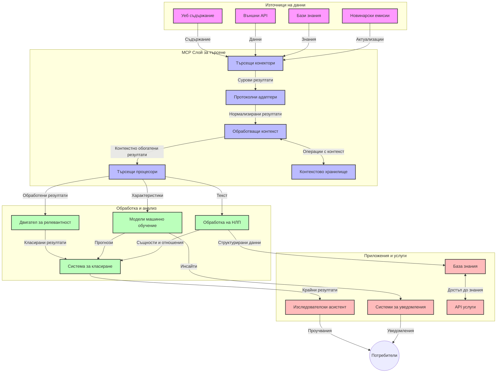
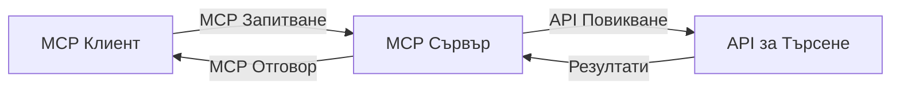
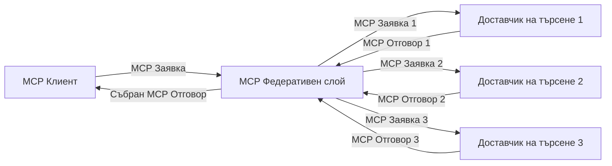
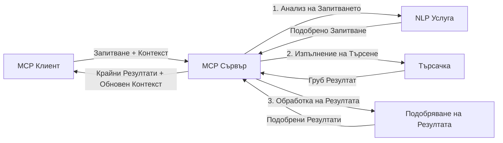

# Протокол за контекст на моделите за търсене в реално време в уеба

## Преглед

Търсенето в реално време в уеба се превърна в съществено в днешната информационно ориентирана среда, в която приложенията се нуждаят от незабавен достъп до актуална информация в интернет, за да предоставят релевантни и навременни отговори. Протоколът за контекст на моделите (MCP) представлява значително развитие в оптимизацията на тези процеси на търсене в реално време, подобрявайки ефективността на търсенето, запазването на контекстуалната цялост и цялостното представяне на системата.

Този модул изследва как MCP трансформира търсенето в реално време в уеба, като предоставя стандартизиран подход за управление на контекст между AI модели, търсачки и приложения.

### Какво ще научите

В този изчерпателен наръчник ще откриете:

- Как MCP създава безпроблемна връзка между AI модели и възможностите за търсене в реално време в уеба
- Архитектурни модели за реализиране на ефективни и мащабируеми търсещи решения с MCP
- Техники за запазване на контекста на търсенето при множество заявки и взаимодействия
- Практически кодови реализации на Python и JavaScript за различни сценарии на търсене
- Методи за балансиране на релевантността, актуалността и производителността в системите за търсене с MCP

## Въведение в търсенето в реално време в уеба

Търсенето в реално време в уеба е технологичен подход, който позволява непрекъснато запитване, обработка и анализ на уеб-базирана информация в момента на публикуването или актуализирането ѝ, което дава възможност на системите да предоставят свежа и релевантна информация с минимално забавяне. За разлика от традиционните системи за търсене, които работят върху индексирани данни, които могат да са на часове или дни, търсенето в реално време обработва живи данни от уеба, осигурявайки прозрения и информация, отразяващи текущото състояние на онлайн съдържанието.

### Основни концепции на търсенето в реално време в уеба:

- **Непрекъсната обработка на заявките**: Запитванията се обработват спрямо постоянно обновяващи се източници на данни
- **Приоритет на актуалността**: Системите са проектирани да приоритизират свежа информация
- **Баланс между релевантност и актуалност**: Поддържане на равновесие между релевантност и актуалност
- **Мащабируема архитектура**: Системите трябва да могат да обработват променливи обеми от заявки и данни
- **Контекстуално разбиране**: Запазване на контекста на потребителя през търсещите итерации е ключово за смислени резултати
- **Динамично преоформяне на заявките**: Адаптивна модификация на запитванията на база контекст и предишни резултати
- **Интеграция от множество източници**: Комбиниране на резултати от множество доставчици на търсене и уеб източници
- **Семантично разбиране**: Обработка на запитвания и съдържание на база значение, а не само ключови думи
- **Ранжиране в реално време**: Непрекъснато настройване на класирането на резултатите с появата на нова информация

### Протоколът за контекст на моделите и търсенето в реално време в уеба

Протоколът за контекст на моделите (MCP) адресира няколко критични предизвикателства в среди за търсене в реално време:

1. **Запазване на контекста на търсенето**: MCP стандартизира начина, по който контекстът се поддържа в разпределени компоненти за търсене, гарантирайки, че AI моделите и процесинговите възли имат достъп до релевантна история на заявките и потребителски предпочитания.

2. **Ефективно управление на заявките**: Чрез предоставяне на структурирани механизми за предаване на контекста, MCP намалява излишъка от повтаряне на контекста във всяка итерация на търсене.

3. **Взаимодействие и съвместимост**: MCP създава общ език за споделяне на контекст между различни технологии за търсене и AI модели, позволявайки по-гъвкави и разширяеми архитектури.

4. **Оптимизиран за търсене контекст**: Имплементациите на MCP могат да приоритизират кои елементи на контекста са най-важни за ефективно търсене, оптимизирайки както за производителност, така и за точност.

5. **Адаптивна обработка на търсене**: С правилно управление на контекста чрез MCP, търсещите системи могат динамично да настройват обработката си в зависимост от развиващите се нужди на потребителя и информационните пейзажи.

В съвременни приложения, вариращи от агрегиране на новини до изследователски асистенти, интеграцията на MCP с уеб търсещи технологии позволява по-интелигентно, контекстуално ориентирано търсене, което може да осигури все по-релевантни резултати, докато взаимодействията с потребителя продължават.

## Цели на обучението

До края на този урок ще можете да:

- Разбирате основите на търсенето в реално време в уеба и предизвикателствата му в съвременните приложения
- Обясните как протоколът за контекст на моделите (MCP) подобрява възможностите за търсене в реално време в уеба
- Реализирате решения за търсене, базирани на MCP, използвайки популярни рамки и API
- Проектирате и внедрявате мащабируеми, високо производителни архитектури за търсене с MCP
- Прилагате концепциите на MCP в различни случаи на употреба, включително семантично търсене, изследователска помощ и AI-подсилено браузване
- Оценявате новите тенденции и бъдещи иновации в MCP-базираните търсещи технологии
- Разработвате системи за търсене, осъзнати за контекста, които се учат от взаимодействията с потребителя
- Интегрирате възможности за уеб търсене в AI асистенти чрез стандартизирани MCP протоколи
- Създавате многоетапни търсещи канали, които постепенно усъвършенстват резултатите въз основа на контекста
- Оптимизирате производителността на търсенето, като същевременно поддържате пълна осведоменост за контекста

### Определение и значение

Търсенето в реално време в уеба включва непрекъснато запитване, извличане и предоставяне на уеб-базирана информация с минимално забавяне. За разлика от традиционните търсачки, които периодично обхождат и индексират уеба, търсенето в реално време цели да показва информация веднага щом стане налична, давайки незабавен достъп до най-актуалното съдържание.

Ключови характеристики на търсенето в реално време в уеба включват:

- **Актуалност**: Приоритет на скорошно съдържание и обновления
- **Непрекъсната обработка**: Постоянно наблюдение за нова информация
- **Адаптивност на заявките**: Усъвършенстване на заявките въз основа на контекст и обратна връзка
- **Незабавна доставка**: Осигуряване на резултати от търсенето с минимално забавяне
- **Запазване на контекст**: Наслагване върху предишни запитвания за подобрена релевантност

### Предизвикателства в традиционното уеб търсене

Традиционните подходи към търсенето в уеба срещат няколко ограничения при приложението им в сценарии в реално време:

1. **Фрагментация на контекста**: Трудност при запазване на контекста на търсене през множество заявки
2. **Свежест на информацията**: Затруднения при достъп и приоритизиране на най-новата информация
3. **Сложност на интеграцията**: Проблеми с взаимодействието между търсещи системи и приложения
4. **Проблеми с латентността**: Балансиране между обширно търсене и изисквания за време за отговор
5. **Настройване на релевантността**: Осигуряване на точност и релевантност при приоритет на актуалността

## Разбиране на протокола за контекст на моделите (MCP) за търсене

### Какво е MCP в контекста на търсене?

Протоколът за контекст на моделите (MCP) е стандартизиран комуникационен протокол, предназначен да улеснява ефективното взаимодействие между AI модели и приложения. В контекста на търсенето в реално време в уеба MCP осигурява рамка за:

- Запазване на контекста на търсенето през поредици от запитвания
- Стандартизиране на формати за търсещи запитвания и резултати
- Оптимизиране на предаването на параметри на търсене и резултати
- Подобряване на комуникацията модел–търсачка

### Основни компоненти и архитектура

Архитектурата на MCP за търсене в реално време в уеба включва няколко ключови компонента:

1. **Мениджъри на контекст на заявките**: Управляват и поддържат контекста на търсенето в множество заявки
2. **Процесори на търсене**: Обработват постъпващите търсещи заявки с техники, осъзнаващи контекста
3. **Адаптери на протокола**: Конвертират между различни API за търсене, като запазват контекста
4. **Хранилище на контекст**: Ефективно съхранява и извлича история на търсенето и предпочитания
5. **Търсещи конектори**: Свързват се с различни търсачки и уеб API



### Как MCP подобрява търсенето в реално време в уеба

MCP адресира традиционните предизвикателства при уеб търсенето чрез:

- **Контекстуална непрекъснатост**: Поддържане на връзки между заявките в цялата търсеща сесия
- **Оптимизирано предаване**: Намаляване на излишъка в параметрите на търсене чрез интелигентно управление на контекста
- **Стандартизирани интерфейси**: Осигуряване на консистентни API за компонентите за търсене
- **Намалена латентност**: Минимизиране на времето за обработка чрез ефективно управление на контекста
- **Подобрена релевантност**: Усъвършенстване на релевантността чрез запазване на потребителския замисъл през множество запитвания

## Интеграция и реализация

Системите за търсене в реално време изискват внимателно архитектурно проектиране и реализиране, за да поддържат както производителността, така и контекстуалната цялост. Протоколът за контекст на моделите предлага стандартизиран подход за интеграция на AI модели и търсещи технологии, позволявайки по-сложни, контекстно осъзнати търсещи канали.

### Преглед на интеграцията на MCP в търсещите архитектури

Имплементацията на MCP в среди за търсене в реално време включва няколко ключови съображения:

1. **Сериализация на контекста на търсене**: MCP предоставя ефективни механизми за кодиране на контекстуалната информация в търсещите заявки, осигурявайки, че съществен контекст следва заявката през цялата процесингова верига. Това включва стандартизирани формати за сериализация, оптимизирани за метаданни, свързани с търсене.

2. **Състояниево обработване на търсене**: MCP дава възможност за по-интелигентна състояниево осъзната обработка чрез поддържане на постоянна контекстна репрезентация през итерациите на търсене. Това е особено ценно в многоетапни търсещи канали, където усъвършенстването на контекста подобрява резултатите.

3. **Разширяване и усъвършенстване на заявки**: Имплементациите на MCP в търсещите системи могат да улеснят изтънчено разширяване и усъвършенстване на заявките въз основа на натрупан контекст, позволявайки все по-релевантни резултати с напредване на търсещата сесия.

4. **Кеширане и приоритизиране на резултати**: Чрез стандартизиране на управлението на контекста MCP подпомага управлението на кеширането и приоритизирането на резултатите, позволявайки на компонентите да се адаптират според развиващия се контекст.

5. **Федерирано търсене и агрегиране**: MCP улеснява по-усъвършенствана федерация на търсенето през множество бекенд системи чрез предоставяне на структурирани представяния на контекста на търсене, позволявайки по-задълбочено агрегиране на резултати от различни източници.

Реализацията на MCP в различни търсещи технологии създава единен подход към управлението на контекста, намалявайки нуждата от персонализиран интеграционен код и засилвайки способността на системата да поддържа смислен контекст при еволюирането на търсещите заявки.

### MCP в различни уеб търсещи реализации

Тези примери следват текущата MCP спецификация, която се фокусира върху JSON-RPC базиран протокол с различни транспортни механизми. Кодът демонстрира как можете да реализирате персонализирани интеграции за търсене, като същевременно запазвате пълна съвместимост с MCP протокола.

<details>
<summary>Реализация на Python с Generic Search API</summary>

```python
import asyncio
import json
import aiohttp
from typing import Dict, Any, Optional, List
from contextlib import asynccontextmanager
from collections.abc import AsyncIterator

# Импортирайте стандартните MCP библиотеки
from mcp.client.session import ClientSession
from mcp.client.streamable_http import streamablehttp_client
from mcp.types import TextContent, CreateMessageRequestParams, CreateMessageResult
from mcp.server.fastmcp import FastMCP

# Създайте FastMCP сървър за уеб търсене
search_server = FastMCP("WebSearch")

# Клас за обработка на операции по уеб търсене
class WebSearchHandler:
    def __init__(self, api_endpoint: str, api_key: str):
        self.api_endpoint = api_endpoint
        self.api_key = api_key
        self.session = None
        
    async def initialize(self):
        """Initialize the HTTP session"""
        self.session = aiohttp.ClientSession(
            headers={"Authorization": f"Bearer {self.api_key}"}
        )
    
    async def close(self):
        """Close the HTTP session"""
        if self.session:
            await self.session.close()
            
    async def perform_search(self, query: str, max_results: int = 5, 
                           include_domains: List[str] = None, 
                           exclude_domains: List[str] = None,
                           time_period: str = "any") -> Dict[str, Any]:
        """Perform web search using the search API"""
        # Конструиране на параметри за търсене
        search_params = {
            "q": query,
            "limit": max_results,
            "time": time_period
        }
        
        if include_domains:
            search_params["site"] = ",".join(include_domains)
            
        if exclude_domains:
            search_params["exclude_site"] = ",".join(exclude_domains)
        
        # Изпълнете заявката за търсене
        try:
            async with self.session.get(
                self.api_endpoint,
                params=search_params
            ) as response:
                if response.status != 200:
                    error_text = await response.text()
                    raise Exception(f"Search API error: {response.status} - {error_text}")
                
                search_data = await response.json()
                
                # Преобразувайте отговора, специфичен за API, в стандартен формат
                results = []
                for item in search_data.get("results", []):
                    results.append({
                        "title": item.get("title", ""),
                        "url": item.get("url", ""),
                        "snippet": item.get("snippet", ""),
                        "date": item.get("published_date", ""),
                        "source": item.get("source", "")
                    })
                
                return {
                    "query": query,
                    "totalResults": len(results),
                    "results": results
                }
        except Exception as e:
            print(f"Search API request error: {e}")
            raise

# Инициализирайте обработващия търсенето
search_handler = WebSearchHandler(
    api_endpoint="https://api.search-service.example/search",
    api_key="your-api-key-here"
)

# Настройте жизнения цикъл за управление на обработващия търсенето
@asyncio.asynccontextmanager
async def app_lifespan(server: FastMCP):
    """Manage application lifecycle"""
    await search_handler.initialize()
    try:
        yield {"search_handler": search_handler}
    finally:
        await search_handler.close()

# Задайте жизнения цикъл за сървъра
search_server = FastMCP("WebSearch", lifespan=app_lifespan)

# Регистрирайте инструмент за уеб търсене
@search_server.tool()
async def web_search(query: str, max_results: int = 5, 
                   include_domains: List[str] = None,
                   exclude_domains: List[str] = None,
                   time_period: str = "any") -> Dict[str, Any]:
    """
    Search the web for information
    
    Args:
        query: The search query
        max_results: Maximum number of results to return (default: 5)
        include_domains: List of domains to include in search results
        exclude_domains: List of domains to exclude from search results
        time_period: Time period for results ("day", "week", "month", "any")
        
    Returns:
        Dictionary containing search results
    """
    ctx = search_server.get_context()
    search_handler = ctx.request_context.lifespan_context["search_handler"]
    
    results = await search_handler.perform_search(
        query=query,
        max_results=max_results,
        include_domains=include_domains,
        exclude_domains=exclude_domains,
        time_period=time_period
    )
    
    return results

# Пример за използване от клиент
async def client_example():
    # Свържете се със сървъра за търсене чрез Streamable HTTP транспорт
    async with streamablehttp_client("http://localhost:8000/mcp") as (read, write, _):
        async with ClientSession(read, write) as session:
            # Инициализирайте връзката
            await session.initialize()
            
            # Извикайте инструмента web_search
            search_results = await session.call_tool(
                "web_search", 
                {
                    "query": "latest developments in AI and Model Context Protocol",
                    "max_results": 5,
                    "time_period": "day",
                    "include_domains": ["github.com", "microsoft.com"]
                }
            )
            
            print(f"Search results: {search_results}")

# Пример за изпълнение на сървър
if __name__ == "__main__":
    # Стартирайте сървъра с Streamable HTTP транспорт
    search_server.run(transport="streamable-http")
```
</details> 

<details>
<summary>Реализация на JavaScript с търсене през браузър</summary>

```javascript
// Имплементация на MCP сървър за уеб търсене
import { McpServer, ResourceTemplate } from '@modelcontextprotocol/sdk/server/mcp.js';
import { StreamableHTTPServerTransport } from '@modelcontextprotocol/sdk/server/streamableHttp.js';
import { z } from 'zod';

// Създаване на MCP сървър за уеб търсене
const searchServer = new McpServer({
    name: "BrowserSearch",
    description: "A server that provides web search capabilities"
});

// Клас за услуга за търсене
class SearchService {
    constructor(searchApiUrl, apiKey) {
        this.searchApiUrl = searchApiUrl;
        this.apiKey = apiKey;
    }

    async performSearch(parameters) {
        const {
            query = '',
            maxResults = 5,
            includeDomains = [],
            excludeDomains = [],
            timePeriod = 'any'
        } = parameters;
        
        // Конструиране на URL за търсене с параметри
        const url = new URL(this.searchApiUrl);
        url.searchParams.append('q', query);
        url.searchParams.append('limit', maxResults);
        url.searchParams.append('time', timePeriod);
        
        if (includeDomains.length > 0) {
            url.searchParams.append('site', includeDomains.join(','));
        }
        
        if (excludeDomains.length > 0) {
            url.searchParams.append('exclude_site', excludeDomains.join(','));
        }
        
        try {
            const response = await fetch(url.toString(), {
                method: 'GET',
                headers: {
                    'Authorization': `Bearer ${this.apiKey}`,
                    'Content-Type': 'application/json'
                }
            });
            
            if (!response.ok) {
                const errorText = await response.text();
                throw new Error(`Search API error: ${response.status} - ${errorText}`);
            }
            
            const searchData = await response.json();
            
            // Преобразуване на API-специфичен отговор в стандартен формат
            const results = searchData.results?.map(item => ({
                title: item.title || '',
                url: item.url || '',
                snippet: item.snippet || '',
                date: item.published_date || '',
                source: item.source || ''
            })) || [];
            
            return {
                query,
                totalResults: results.length,
                results
            };
        } catch (error) {
            console.error('Search API request error:', error);
            throw error;
        }
    }
}

// Инициализация на услугата за търсене
const searchService = new SearchService(
    'https://api.search-service.example/search',
    'your-api-key-here'
);

// Настройка на доставчика на контекст за сървъра
searchServer.setContextProvider(() => {
    return {
        searchService
    };
});

// Регистриране на инструмент за уеб търсене
searchServer.tool({
    name: 'web_search',
    description: 'Search the web for information',
    parameters: {
        type: 'object',
        properties: {
            query: {
                type: 'string',
                description: 'The search query'
            },
            maxResults: {
                type: 'integer',
                description: 'Maximum number of results to return',
                default: 5
            },
            includeDomains: {
                type: 'array',
                items: { type: 'string' },
                description: 'List of domains to include in search results'
            },
            excludeDomains: {
                type: 'array',
                items: { type: 'string' },
                description: 'List of domains to exclude from search results'
            },
            timePeriod: {
                type: 'string',
                description: 'Time period for results',
                enum: ['day', 'week', 'month', 'any'],
                default: 'any'
            }
        },
        required: ['query']
    },
    handler: async (params, context) => {
        const { searchService } = context;
        return await searchService.performSearch(params);
    }
});

// Примерен код на клиент за свързване към сървъра за търсене
import { Client } from '@modelcontextprotocol/sdk/client/index.js';
import { StreamableHTTPClientTransport } from '@modelcontextprotocol/sdk/client/streamableHttp.js';

async function connectToSearchServer() {
    // Свързване към сървъра за търсене
    const transport = new StreamableHTTPClientTransport(
        new URL('http://localhost:8000/mcp')
    );
    
    const client = new Client({
        name: 'search-client',
        version: '1.0.0'
    });
    
    await client.connect(transport);
    
    // Изпълнение на инструмента за търсене
    const searchResults = await client.callTool({
        name: 'web_search',
        arguments: {
            query: 'Model Context Protocol implementation examples',
            maxResults: 10,
            timePeriod: 'week',
            includeDomains: ['github.com', 'docs.microsoft.com']
        }
    });
    
    console.log('Search results:', searchResults);
    
    // Почистващи действия
    await client.disconnect();
}

// Стартиране на сървъра
const transport = new StreamableHTTPServerTransport();
await searchServer.connect(transport);
console.log('Search server running at http://localhost:8000/mcp');

// В отделен процес или след стартирането на сървъра
// connectToSearchServer().catch(console.error);
```
</details> 

## Отговорност за примерния код

> **Важно**: Примерите по-долу демонстрират интеграция на протокола за контекст на моделите (MCP) с функционалност за уеб търсене. Въпреки че следват структурите и моделите на официалните MCP SDK, те са опростени за образователни цели.
> 
> Тези примери показват:
> 
> 1. **Реализация на Python**: FastMCP сървър, който предоставя уеб търсещ инструмент и се свързва с външен search API. Този пример демонстрира правилно управление на жизнения цикъл, обработка на контекст и имплементация на инструменти, следвайки моделите на [официалния MCP Python SDK](https://github.com/modelcontextprotocol/python-sdk). Сървърът използва препоръчания Streamable HTTP транспорт, който е заместил по-стария SSE транспорт за продукционни внедрения.
> 
> 2. **Реализация на JavaScript**: Реализация на TypeScript/JavaScript, използваща FastMCP модел от [официалния MCP TypeScript SDK](https://github.com/modelcontextprotocol/typescript-sdk), за създаване на търсещ сървър с правилни дефиниции на инструменти и клиентски връзки. Следва последните препоръчани модели за управление на сесии и запазване на контекст.
> 
> Тези примери изискват допълнителна обработка на грешки, автентикация и специфичен API интеграционен код за продукционна употреба. Показаните search API крайни точки (`https://api.search-service.example/search`) са заместители и трябва да бъдат заменени с реални адреси на търсещи услуги.
> 
> За пълни детайли и най-актуалните подходи, моля, консултирайте се с [официалната MCP спецификация](https://spec.modelcontextprotocol.io/) и документацията на SDK.

## Основни концепции

### Рамката на протокола за контекст на моделите (MCP)

В основата си, протоколът за контекст на моделите предоставя стандартизиран начин AI модели, приложения и услуги да обменят контекст. При търсенето в реално време в уеба тази рамка е съществена за създаване на кохерентни, многоходови търсещи преживявания. Ключовите компоненти включват:

1. **Клиент-сървър архитектура**: MCP установява ясна сегрегация между търсещи клиенти (заявители) и търсещи сървъри (доставчици), позволявайки гъвкави модели на разполагане.

2. **JSON-RPC комуникация**: Протоколът използва JSON-RPC за обмен на съобщения, което го прави съвместим с уеб технологии и лесен за имплементиране на различни платформи.

3. **Управление на контекст**: MCP дефинира структурирани методи за поддържане, обновяване и използване на контекста на търсене през множество взаимодействия.

4. **Дефиниции на инструменти**: Възможностите за търсене се излагат като стандартизирани инструменти с добре дефинирани параметри и стойности за връщане.

5. **Поддръжка на стрийминг**: Протоколът поддържа поточно предаване на резултати, което е ключово за търсенето в реално време, където резултатите могат да пристигат постепенно.

### Модели за интеграция на уеб търсене

При интегриране на MCP с уеб търсене се наблюдават няколко модела:

#### 1. Директна интеграция с доставчик на търсене



В този модел MCP сървърът директно комуникира с един или повече API за търсене, превеждайки MCP заявки в специфични API повиквания и форматирайки резултатите като MCP отговори.

#### 2. Федерирано търсене с запазване на контекста



Този модел разпределя търсещите заявки между множество съвместими с MCP доставчици на търсене, всеки от които може да е специализиран в различни типове съдържание или търсещи способности, докато поддържа единен контекст.

#### 3. Цепочка за търсене с усъвършенстван контекст



В този модел търсещият процес е разделен на няколко етапа, като контекстът се обогатява на всяка стъпка, което води до прогресивно по-адекватни резултати.

### Компоненти на контекста на търсенето

В MCP-базираното уеб търсене контекстът обикновено включва:

- **История на заявките**: Предишни търсещи заявки в сесията
- **Предпочитания на потребителя**: Език, регион, настройки за безопасно търсене
- **История на взаимодействия**: Кои резултати са били кликнати, време прекарано при резултатите
- **Параметри на търсене**: Филтри, поредности и други модификатори на търсенето
- **Доменни знания**: Специфичен за темата контекст, който е релевантен за търсенето
- **Временен контекст**: Фактори на релевантност, базирани на време
- **Предпочитания за източници**: Доверени или предпочитани информационни източници

## Сценарии на употреба и приложения

### Изследване и събиране на информация

MCP подобрява изследователските работни потоци чрез:

- Запазване на изследователския контекст през търсещите сесии
- Позволяване на по-усъвършенствани и контекстуално релевантни заявки
- Поддръжка на федерация на търсене от много източници
- Улесняване на извличането на знания от резултатите от търсенето

### Мониторинг на новини и тенденции в реално време

Търсенето с помощта на MCP предлага предимства за наблюдение на новини:

- Почти в реално време откриване на нововъзникващи новинарски истории
- Контекстуално филтриране на релевантна информация
- Проследяване на теми и обекти от множество източници
- Персонализирани новинарски сигнали на база потребителски контекст

### AI-подсилено браузване и изследване

MCP създава нови възможности за AI-подсилено браузване:

- Контекстуални предложения за търсене на база текуща браузър активност
- Безпроблемна интеграция на уеб търсене с помощници, работещи с LLM
- Многоходово усъвършенстване на търсенето с поддържан контекст
- Подобрена проверка на факти и верификация на информация

## Бъдещи тенденции и иновации

### Еволюция на MCP в уеб търсенето

Като поглеждаме напред, очакваме MCP да се развива, за да адресира:
- **Мултимодално търсене**: Интегриране на търсене в текст, изображения, аудио и видео със запазен контекст
- **Децентрализирано търсене**: Поддръжка на разпределени и федеративни търсещи екосистеми
- **Поверителност при търсене**: Механизми за търсене с опазване на поверителността, осъзнати за контекста
- **Разбиране на заявките**: Дълбок семантичен анализ на естественоезикови заявки за търсене

### Потенциални технологични постижения

Нововъзникващи технологии, които ще оформят бъдещето на MCP търсенето:

1. **Невронни архитектури за търсене**: Системи за търсене, базирани на вграждания, оптимизирани за MCP
2. **Персонализиран контекст на търсене**: Изучаване на индивидуални модели на търсене на потребителите с времето
3. **Интеграция на графи на знанието**: Контекстуално търсене, подсилено с домейн-специфични графи на знанието
4. **Крос-модален контекст**: Поддържане на контекст през различни модалности на търсене

## Практически задачи

### Задача 1: Настройване на базов MCP търсещ канал

В тази задача ще научите как да:
- Конфигурирате базова MCP търсеща среда
- Реализирате обработващи контекста компоненти за уеб търсене
- Тествате и валидирате запазването на контекста през няколко итерации на търсене

### Задача 2: Създаване на помощник за изследвания с MCP търсене

Създайте пълноценно приложение, което:
- Обработва изследователски въпроси на естествен език
- Извършва търсене в уеб с внимание към контекста
- Синтезира информация от множество източници
- Представя организирани изследователски резултати

### Задача 3: Реализиране на федерация за търсене с множество източници чрез MCP

Разширена задача, покриваща:
- Контекстуално разпределяне на заявки към множество търсещи машини
- Класиране и агрегиране на резултатите
- Контекстуално елиминиране на дублиращи се резултати
- Обработка на метаданни, специфични за източниците

## Допълнителни ресурси

- [Model Context Protocol Specification](https://spec.modelcontextprotocol.io/) - Официална спецификация на MCP и подробна документация на протокола  
- [Model Context Protocol Documentation](https://modelcontextprotocol.io/) - Подробни уроци и ръководства за имплементация  
- [MCP Python SDK](https://github.com/modelcontextprotocol/python-sdk) - Официална Python имплементация на MCP протокола  
- [MCP TypeScript SDK](https://github.com/modelcontextprotocol/typescript-sdk) - Официална TypeScript имплементация на MCP протокола  
- [MCP Reference Servers](https://github.com/modelcontextprotocol/servers) - Референтни реализации на MCP сървъри  
- [Bing Web Search API Documentation](https://learn.microsoft.com/en-us/bing/search-apis/bing-web-search/overview) - API за уеб търсене на Microsoft  
- [Google Custom Search JSON API](https://developers.google.com/custom-search/v1/overview) - Програмиран търсещ двигател на Google  
- [SerpAPI Documentation](https://serpapi.com/search-api) - API за страници с резултати от търсачки  
- [Meilisearch Documentation](https://www.meilisearch.com/docs) - Отворен код търсещ двигател  
- [Elasticsearch Documentation](https://www.elastic.co/guide/index.html) - Разпределена система за търсене и анализ  
- [LangChain Documentation](https://python.langchain.com/docs/get_started/introduction) - Създаване на приложения с LLM

## Резултати от обучението

След завършване на този модул ще можете да:

- Разбирате основите на търсенето в реално време в уеб и неговите предизвикателства
- Обясните как Model Context Protocol (MCP) подобрява възможностите за търсене в реално време в уеб
- Реализирате решения за търсене, базирани на MCP, с помощта на популярни рамки и API-та
- Проектирате и разгръщате мащабируеми, високоефективни архитектури за търсене с MCP
- Прилагате MCP концепциите в различни случаи на употреба, включително семантично търсене, асистенция при изследвания и AI-усилено сърфиране
- Оценявате нововъзникващи тенденции и бъдещи иновации в технологии за търсене, базирано на MCP

### Съображения за доверие и безопасност

При реализиране на MCP-базирани решения за уеб търсене, имайте предвид следните важни принципи от спецификацията на MCP:

1. **Съгласие и контрол на потребителя**: Потребителите трябва изрично да дават съгласие и да разбират всички операции и достъпи до данни. Това е особено важно за реализации на уеб търсене, които могат да имат достъп до външни източници на данни.

2. **Поверителност на данните**: Осигурете подходящо третиране на заявките за търсене и резултатите, особено когато те могат да съдържат чувствителна информация. Изпълнявайте подходящи контролни механизми за достъп, за да защитите данните на потребителите.

3. **Безопасност на инструментите**: Внедрете правилна авторизация и валидация за търсещите инструменти, тъй като те могат да представляват потенциални рискове за сигурността чрез изпълнение на произволен код. Описанията на поведението на инструментите трябва да се считат за ненадеждни, освен ако не са получени от доверен сървър.

4. **Ясна документация**: Осигурете ясна документация относно възможностите, ограниченията и съображенията за сигурност на вашата MCP-базирана реализация на търсене, следвайки указанията за имплементация от спецификацията на MCP.

5. **Здрави механизми за съгласие**: Изградете надеждни потоци за съгласие и авторизация, които ясно обясняват функциите на всеки инструмент преди неговото разрешаване за използване, особено за инструменти, които взаимодействат с външни уеб ресурси.

За пълни детайли относно сигурността и съображенията за доверие при MCP, вижте [официалната документация](https://modelcontextprotocol.io/specification/2025-11-25/basic/security_best_practices).

## Какво следва

- [5.12 Entra ID Authentication for Model Context Protocol Servers](../mcp-security-entra/README.md)

---

<!-- CO-OP TRANSLATOR DISCLAIMER START -->
**Отказ от отговорност**:
Този документ е преведен с помощта на AI преводачески услуга [Co-op Translator](https://github.com/Azure/co-op-translator). Въпреки че се стремим към точност, моля имайте предвид, че автоматизираните преводи могат да съдържат грешки или неточности. Оригиналният документ на неговия роден език трябва да се счита за авторитетен източник. За критична информация се препоръчва професионален човешки превод. Ние не носим отговорност за каквито и да е недоразумения или неправилни тълкувания, произтичащи от използването на този превод.
<!-- CO-OP TRANSLATOR DISCLAIMER END -->