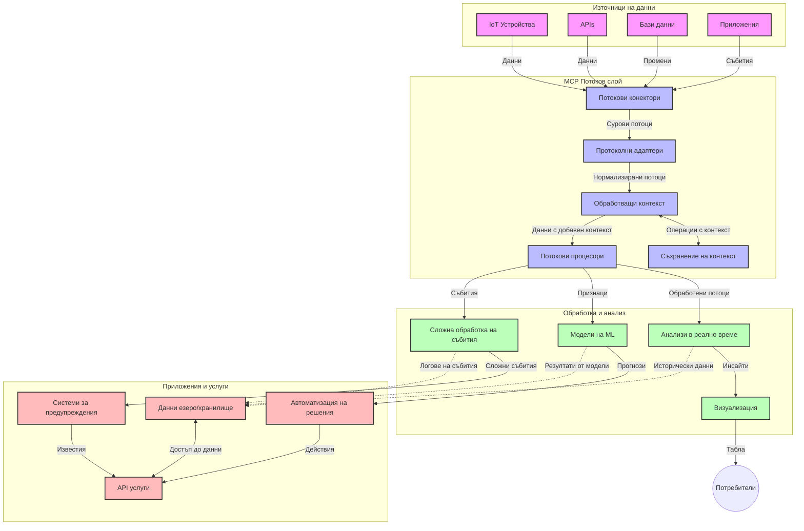

# Протокол за контекст на модел за потокова обработка на данни в реално време

## Преглед

Потоковата обработка на данни в реално време се превърна в съществена част от съвременния свят, ориентиран към данни, където бизнесите и приложенията изискват незабавен достъп до информация, за да вземат навременни решения. Протоколът за контекст на модел (MCP) представлява значителен напредък в оптимизирането на тези процеси на потокова обработка в реално време, подобрявайки ефективността на обработката на данни, поддържането на контекстуална цялост и увеличавайки общата производителност на системата.

Този модул разглежда как MCP трансформира потоковата обработка на данни в реално време, предоставяйки стандартизиран подход за управление на контекста между AI модели, потокови платформи и приложения.

## Въведение в потокова обработка на данни в реално време

Потоковата обработка на данни в реално време е технологичен парадигъм, който позволява непрекъснат трансфер, обработка и анализ на данни в момента на тяхното генериране, давайки възможност на системите да реагират незабавно на нова информация. За разлика от традиционната пакетна обработка, която работи със статични набори от данни, потоковата обработка обработва данните в движение, предоставяйки прозрения и действия с минимална латентност.

### Основни концепции на потоковата обработка на данни в реално време:

- **Непрекъснат поток на данни**: Данните се обработват като непрекъснат, безкраен поток от събития или записи.
- **Обработка с ниска латентност**: Системите са проектирани да минимизират времето между генерирането и обработката на данните.
- **Скалируемост**: Потоковите архитектури трябва да могат да обработват променливи обеми и скорости на данните.
- **Устойчивост на грешки**: Системите трябва да са устойчиви на откази, за да осигурят непрекъснат поток на данни.
- **Съхранение на състояние**: Поддържането на контекст през събитията е от ключово значение за значим анализ.

### Протокол за контекст на модел и потокова обработка в реално време

Протоколът за контекст на модел (MCP) адресира няколко критични предизвикателства в среди за потокова обработка на данни в реално време:

1. **Контекстуална последователност**: MCP стандартизира начина, по който контекстът се поддържа в разпределени компонентни на потоковете, гарантирайки, че AI модели и възли за обработка имат достъп до релевантен исторически и средов контекст.

2. **Ефективно управление на състоянието**: Чрез предоставяне на структурирани механизми за трансмисия на контекста, MCP намалява натоварването при управление на състоянието в потокови канали.

3. **Съвместимост**: MCP създава общ език за споделяне на контекст между различни потокови технологии и AI модели, позволявайки по-гъвкави и разширяеми архитектури.

4. **Контекст, оптимизиран за стрийминг**: Имплементациите на MCP могат да приоритизират кои елементи от контекста са най-релевантни за вземане на решения в реално време, оптимизирайки както производителността, така и точността.

5. **Адаптивна обработка**: С подходящо управление на контекста чрез MCP, потоковите системи могат динамично да нагласят обработката спрямо еволюиращите условия и модели в данните.

В съвременните приложения, вариращи от IoT сензорни мрежи до финансови търговски платформи, интеграцията на MCP с потокови технологии позволява по-интелигентна, контекстно осъзната обработка, която може да отговори адекватно на сложни и развиващи се ситуации в реално време.

## Учебни цели

В края на този урок ще можете да:

- Разберете основите на потоковата обработка на данни в реално време и нейните предизвикателства
- Обясните как Протоколът за контекст на модел (MCP) подобрява потоковата обработка в реално време
- Имплементирате потокови решения на базата на MCP с помощта на популярни рамки като Kafka и Pulsar
- Проектирате и внедрите устойчиви на грешки, високопроизводителни потокови архитектури с MCP
- Прилагате концепциите на MCP в IoT, финансови търговски и AI-базирани аналитични случаи
- Оценявате нововъзникващи тенденции и бъдещи иновации в MCP-базирани потокови технологии


### Дефиниция и значение

Потоковата обработка на данни в реално време включва непрекъснато генериране, обработка и доставка на данни с минимална латентност. За разлика от пакетната обработка, при която данните се събират и обработват на групи, потоковите данни се обработват постепенно, докато пристигат, давайки възможност за незабавни прозрения и действия.

Ключови характеристики на потоковата обработка на данни в реално време включват:

- **Ниска латентност**: Обработка и анализ на данни в рамките на милисекунди до секунди
- **Непрекъснат поток**: Непрекъснати потоци от данни от различни източници
- **Незабавна обработка**: Анализ на данните в момента на пристигането, а не на партиди
- **Архитектура, базирана на събития**: Реагиране на събития в момента на тяхното възникване

### Предизвикателства в традиционната потокова обработка

Традиционните подходи към потоковата обработка срещат няколко ограничения:

1. **Загуба на контекст**: Трудности при поддържане на контекст в разпределени системи
2. **Проблеми със скалируемостта**: Предизвикателства при мащабиране за обработка на големи обеми и висока скорост на данните
3. **Сложност при интеграцията**: Проблеми със съвместимостта между различни системи
4. **Управление на латентността**: Балансиране между пропусквателна способност и време за обработка
5. **Консистентност на данните**: Осигуряване на точност и пълнота на данните през целия поток

## Разбиране на Протокол за контекст на модел (MCP)

### Какво е MCP?

Протоколът за контекст на модел (MCP) е стандартизиран комуникационен протокол, създаден да улесни ефективното взаимодействие между AI модели и приложения. В контекста на потоковата обработка на данни в реално време MCP предоставя рамка за:

- Запазване на контекста през целия потоков канал
- Стандартизиране на формати за обмен на данни
- Оптимизиране на предаването на големи набори от данни
- Подобряване на комуникацията модел към модел и модел към приложение

### Основни компоненти и архитектура

Архитектурата на MCP за потокова обработка в реално време се състои от няколко ключови компонента:

1. **Контролери на контекста**: Управляват и поддържат контекстуална информация през потоковия канал
2. **Процесори на потоци**: Обработват входящи потоци данни с използване на контекстно-осъзнати техники
3. **Адаптери на протоколи**: Конвертират между различни потокови протоколи, като запазват контекста
4. **Съхранение на контекст**: Ефективно съхраняват и извличат контекстуална информация
5. **Потокови конектори**: Свързват се с различни потокови платформи (Kafka, Pulsar, Kinesis и др.)



### Как MCP подобрява обработката на данните в реално време

MCP адресира традиционни предизвикателства в потоковата обработка чрез:

- **Контекстуална цялост**: Поддържа връзките между данните през целия канал
- **Оптимизирано предаване**: Намалява излишъка при обмен на данни чрез интелигентно управление на контекста
- **Стандартизирани интерфейси**: Осигурява последователни API-та за потоковите компоненти
- **Намалена латентност**: Минимизира времето за обработка чрез ефективно управление на контекста
- **Подобрена скалируемост**: Поддържа хоризонтално мащабиране, като запазва контекста

## Интеграция и изпълнение

Системите за потокова обработка на данни в реално време изискват внимателен архитектурен дизайн и изпълнение, за да се поддържат както производителността, така и контекстуалната цялост. Протоколът за контекст на модел предлага стандартизиран подход за интегриране на AI модели и потокови технологии, позволявайки по-усложнени, контекстно осъзнати обработващи канали.

### Преглед на интеграцията на MCP в потоковите архитектури

Изпълнението на MCP в реалновремеви потокови среди включва няколко ключови аспекта:

1. **Сериализация и пренос на контекста**: MCP предоставя ефективни механизми за кодиране на контекстуална информация в пакетите потокови данни, гарантирайки, че съществен контекст следва данните през целия обработващ канал. Това включва стандартизирани формати за сериализация, оптимизирани за транспорт в потоци.

2. **Обработка на поток със състояние**: MCP позволява по-интелигентна обработка със състояние чрез поддържане на последователно представяне на контекста през обработващите възли. Това е особено ценно в разпределени потокови архитектури, където управлението на състоянието е традиционно трудно.

3. **Време на събитие срещу време на обработка**: Имплементациите на MCP в потокови системи трябва да решават често срещаното предизвикателство да разграничават кога са възникнали събитията и кога са обработвани. Протоколът може да включва времеви контекст, който запазва семантиката на времето на събитието.

4. **Управление на обратен натиск**: Чрез стандартизирано управление на контекста MCP помага за справяне с обратния натиск в потоковите системи, като позволява на компонентите да комуникират капацитета си за обработка и да нагласят потока съответно.

5. **Прозоречно време и агрегация на контекст**: MCP улеснява по-сложни операции с прозорци чрез предоставяне на структурирани представяния на времеви и релационни контексти, позволяващи по-смислени агрегации върху потокове от събития.

6. **Обработка точно веднъж**: В потокови системи, изискващи семантика 'точно веднъж', MCP може да включва метаданни за обработката, които да помогнат за проследяване и проверка на статуса на обработка в разпределени компоненти.

Внедряването на MCP в множество потокови технологии създава единен подход за управление на контекста, намалявайки нуждата от персонализиран код за интеграция, като в същото време подобрява способността на системата да съхранява значим контекст по време на протичане на данните през канала.

### MCP във различни рамки за потокова обработка на данни

Тези примери следват текущата спецификация на MCP, която се фокусира върху протокол базиран на JSON-RPC с различни механизми за транспорт. Кодът демонстрира как можете да реализирате персонализирани превозвачи, които интегрират потокови платформи като Kafka и Pulsar, като същевременно запазват пълна съвместимост с протокола MCP.

Примерите са предназначени да покажат как потоковите платформи могат да се интегрират с MCP, за да осигурят обработка на данни в реално време, като същевременно запазват контекстната осъзнатост, която е централна за MCP. Този подход гарантира, че примерният код точно отразява текущото състояние на спецификацията MCP към юни 2025 г.

MCP може да се интегрира с популярни потокови рамки, включително:

#### Интеграция с Apache Kafka

```python
import asyncio
import json
from typing import Dict, Any, Optional
from confluent_kafka import Consumer, Producer, KafkaError
from mcp.client import Client, ClientCapabilities
from mcp.core.message import JsonRpcMessage
from mcp.core.transports import Transport

# Персонализиран транспортен клас за свързване на MCP с Kafka
class KafkaMCPTransport(Transport):
    def __init__(self, bootstrap_servers: str, input_topic: str, output_topic: str):
        self.bootstrap_servers = bootstrap_servers
        self.input_topic = input_topic
        self.output_topic = output_topic
        self.producer = Producer({'bootstrap.servers': bootstrap_servers})
        self.consumer = Consumer({
            'bootstrap.servers': bootstrap_servers,
            'group.id': 'mcp-client-group',
            'auto.offset.reset': 'earliest'
        })
        self.message_queue = asyncio.Queue()
        self.running = False
        self.consumer_task = None
        
    async def connect(self):
        """Connect to Kafka and start consuming messages"""
        self.consumer.subscribe([self.input_topic])
        self.running = True
        self.consumer_task = asyncio.create_task(self._consume_messages())
        return self
        
    async def _consume_messages(self):
        """Background task to consume messages from Kafka and queue them for processing"""
        while self.running:
            try:
                msg = self.consumer.poll(1.0)
                if msg is None:
                    await asyncio.sleep(0.1)
                    continue
                
                if msg.error():
                    if msg.error().code() == KafkaError._PARTITION_EOF:
                        continue
                    print(f"Consumer error: {msg.error()}")
                    continue
                
                # Парсиране на стойността на съобщението като JSON-RPC
                try:
                    message_str = msg.value().decode('utf-8')
                    message_data = json.loads(message_str)
                    mcp_message = JsonRpcMessage.from_dict(message_data)
                    await self.message_queue.put(mcp_message)
                except Exception as e:
                    print(f"Error parsing message: {e}")
            except Exception as e:
                print(f"Error in consumer loop: {e}")
                await asyncio.sleep(1)
    
    async def read(self) -> Optional[JsonRpcMessage]:
        """Read the next message from the queue"""
        try:
            message = await self.message_queue.get()
            return message
        except Exception as e:
            print(f"Error reading message: {e}")
            return None
    
    async def write(self, message: JsonRpcMessage) -> None:
        """Write a message to the Kafka output topic"""
        try:
            message_json = json.dumps(message.to_dict())
            self.producer.produce(
                self.output_topic,
                message_json.encode('utf-8'),
                callback=self._delivery_report
            )
            self.producer.poll(0)  # Извикване на обратно повикване
        except Exception as e:
            print(f"Error writing message: {e}")
    
    def _delivery_report(self, err, msg):
        """Kafka producer delivery callback"""
        if err is not None:
            print(f'Message delivery failed: {err}')
        else:
            print(f'Message delivered to {msg.topic()} [{msg.partition()}]')
    
    async def close(self) -> None:
        """Close the transport"""
        self.running = False
        if self.consumer_task:
            self.consumer_task.cancel()
            try:
                await self.consumer_task
            except asyncio.CancelledError:
                pass
        self.consumer.close()
        self.producer.flush()

# Пример за използване на Kafka MCP транспорта
async def kafka_mcp_example():
    # Създаване на MCP клиент с Kafka транспорт
    client = Client(
        {"name": "kafka-mcp-client", "version": "1.0.0"},
        ClientCapabilities({})
    )
    
    # Създаване и свързване на Kafka транспорта
    transport = KafkaMCPTransport(
        bootstrap_servers="localhost:9092",
        input_topic="mcp-responses",
        output_topic="mcp-requests"
    )
    
    await client.connect(transport)
    
    try:
        # Инициализиране на MCP сесията
        await client.initialize()
        
        # Пример за изпълнение на инструмент чрез MCP
        response = await client.execute_tool(
            "process_data",
            {
                "data": "sample data",
                "metadata": {
                    "source": "sensor-1",
                    "timestamp": "2025-06-12T10:30:00Z"
                }
            }
        )
        
        print(f"Tool execution response: {response}")
        
        # Чисто изключване
        await client.shutdown()
    finally:
        await transport.close()

# Стартиране на примера
if __name__ == "__main__":
    asyncio.run(kafka_mcp_example())
```

#### Имплементация с Apache Pulsar

```python
import asyncio
import json
import pulsar
from typing import Dict, Any, Optional
from mcp.core.message import JsonRpcMessage
from mcp.core.transports import Transport
from mcp.server import Server, ServerOptions
from mcp.server.tools import Tool, ToolExecutionContext, ToolMetadata

# Създайте персонализиран MCP транспорт, който използва Pulsar
class PulsarMCPTransport(Transport):
    def __init__(self, service_url: str, request_topic: str, response_topic: str):
        self.service_url = service_url
        self.request_topic = request_topic
        self.response_topic = response_topic
        self.client = pulsar.Client(service_url)
        self.producer = self.client.create_producer(response_topic)
        self.consumer = self.client.subscribe(
            request_topic,
            "mcp-server-subscription",
            consumer_type=pulsar.ConsumerType.Shared
        )
        self.message_queue = asyncio.Queue()
        self.running = False
        self.consumer_task = None
    
    async def connect(self):
        """Connect to Pulsar and start consuming messages"""
        self.running = True
        self.consumer_task = asyncio.create_task(self._consume_messages())
        return self
    
    async def _consume_messages(self):
        """Background task to consume messages from Pulsar and queue them for processing"""
        while self.running:
            try:
                # Неблокиращо получаване с таймаут
                msg = self.consumer.receive(timeout_millis=500)
                
                # Обработете съобщението
                try:
                    message_str = msg.data().decode('utf-8')
                    message_data = json.loads(message_str)
                    mcp_message = JsonRpcMessage.from_dict(message_data)
                    await self.message_queue.put(mcp_message)
                    
                    # Потвърдете съобщението
                    self.consumer.acknowledge(msg)
                except Exception as e:
                    print(f"Error processing message: {e}")
                    # Отрицателно потвърждение, ако е имало грешка
                    self.consumer.negative_acknowledge(msg)
            except Exception as e:
                # Обработка на таймаут или други изключения
                await asyncio.sleep(0.1)
    
    async def read(self) -> Optional[JsonRpcMessage]:
        """Read the next message from the queue"""
        try:
            message = await self.message_queue.get()
            return message
        except Exception as e:
            print(f"Error reading message: {e}")
            return None
    
    async def write(self, message: JsonRpcMessage) -> None:
        """Write a message to the Pulsar output topic"""
        try:
            message_json = json.dumps(message.to_dict())
            self.producer.send(message_json.encode('utf-8'))
        except Exception as e:
            print(f"Error writing message: {e}")
    
    async def close(self) -> None:
        """Close the transport"""
        self.running = False
        if self.consumer_task:
            self.consumer_task.cancel()
            try:
                await self.consumer_task
            except asyncio.CancelledError:
                pass
        self.consumer.close()
        self.producer.close()
        self.client.close()

# Дефинирайте примерен MCP инструмент, който обработва поточни данни
@Tool(
    name="process_streaming_data",
    description="Process streaming data with context preservation",
    metadata=ToolMetadata(
        required_capabilities=["streaming"]
    )
)
async def process_streaming_data(
    ctx: ToolExecutionContext,
    data: str,
    source: str,
    priority: str = "medium"
) -> Dict[str, Any]:
    """
    Process streaming data while preserving context
    
    Args:
        ctx: Tool execution context
        data: The data to process
        source: The source of the data
        priority: Priority level (low, medium, high)
        
    Returns:
        Dict containing processed results and context information
    """
    # Примерна обработка, която използва контекста на MCP
    print(f"Processing data from {source} with priority {priority}")
    
    # Достъп до контекста на разговора от MCP
    conversation_id = ctx.conversation_id if hasattr(ctx, 'conversation_id') else "unknown"
    
    # Върнете резултати с подобрен контекст
    return {
        "processed_data": f"Processed: {data}",
        "context": {
            "conversation_id": conversation_id,
            "source": source,
            "priority": priority,
            "processing_timestamp": ctx.get_current_time_iso()
        }
    }

# Примерна имплементация на MCP сървър, използващ Pulsar транспорт
async def run_mcp_server_with_pulsar():
    # Създайте MCP сървър
    server = Server(
        {"name": "pulsar-mcp-server", "version": "1.0.0"},
        ServerOptions(
            capabilities={"streaming": True}
        )
    )
    
    # Регистрирайте нашия инструмент
    server.register_tool(process_streaming_data)
    
    # Създайте и свържете Pulsar транспорт
    transport = PulsarMCPTransport(
        service_url="pulsar://localhost:6650",
        request_topic="mcp-requests",
        response_topic="mcp-responses"
    )
    
    try:
        # Стартирайте сървъра с Pulsar транспорта
        await server.run(transport)
    finally:
        await transport.close()

# Стартирайте сървъра
if __name__ == "__main__":
    asyncio.run(run_mcp_server_with_pulsar())
```

### Най-добри практики при внедряване

При имплементиране на MCP за потокова обработка:

1. **Проектирайте за устойчивост на грешки**:
   - Имплементирайте правилна обработка на грешки
   - Използвайте опашки за неуспешни съобщения (dead-letter queues)
   - Проектирайте идемпотентни процесори

2. **Оптимизирайте за производителност**:
   - Конфигурирайте подходящи размери на буферите
   - Използвайте пакетиране при необходимост
   - Внедрете механизми за обратен натиск

3. **Наблюдавайте и следете**:
   - Проследявайте метрики на потоковата обработка
   - Следете разпространението на контекста
   - Настройте аларми за аномалии

4. **Осигурете сигурността на потоковете**:
   - Имплементирайте криптиране за чувствителни данни
   - Използвайте автентикация и авторизация
   - Приложете подходящи контрол на достъпа


### MCP в IoT и edge изчисления

MCP подобрява стрийминга за IoT, като:

- Запазва контекст на устройствата през обработващия канал
- Позволява ефективен поток от данни от ръба към облака
- Поддържа аналитика в реално време върху IoT потоци от данни
- Улеснява комуникация устройство-устройство с контекст

Пример: Сензорни мрежи в умни градове
```
Sensors → Edge Gateways → MCP Stream Processors → Real-time Analytics → Automated Responses
```

### Роля във финансови транзакции и търговия с висока честота

MCP предоставя значителни предимства за финансов потоков данни:

- Супер ниска латентност при обработка за търговски решения
- Поддържане на контекст на транзакциите през целия процес
- Подкрепа на сложна обработка на събития с контекстуална осъзнатост
- Осигуряване на консистентност на данните в разпределени търговски системи

### Подобряване на AI-базирания анализ на данни

MCP създава нови възможности за потоков анализ:

- Обучение и извод на модели в реално време
- Непрекъснато обучение от потокови данни
- Извличане на характеристики с контекстна осъзнатост
- Мултимоделни изводни канали с запазен контекст

## Бъдещи тенденции и иновации

### Еволюция на MCP в реалновремеви среди

В бъдеще се очаква MCP да се развива, за да адресира:

- **Интеграция с квантови изчисления**: Подготовка за потокови системи, базирани на квантова технология
- **Обработка, нативна за ръб**: Преместване на повече контекстно осъзната обработка към edge устройства
- **Автономно управление на потокове**: Самооптимизиращи се потокови канали
- **Федеративно стрийминг**: Разпределена обработка с гарантиране на поверителност

### Потенциални технологични напредъци

Новите технологии, които ще оформят бъдещето на MCP стрийминг:

1. **AI-оптимизирани потокови протоколи**: Персонализирани протоколи, създадени специално за AI натоварвания
2. **Интеграция на невроморфни изчисления**: Мозъкоподобни изчисления за потокова обработка
3. **Сървърлес стрийминг**: Събитийно-ориентирана, мащабируема потокова обработка без управление на инфраструктура
4. **Разпределени хранилища за контекст**: Глобално разпределено, но високо консистентно управление на контекста

## Практически упражнения

### Упражнение 1: Настройка на базов MCP потоков канал

В това упражнение ще научите как да:
- Конфигурирате основна MCP потокова среда
- Имплементирате контролери на контекст за обработка на потоци
- Тествате и валидирате запазването на контекста

### Упражнение 2: Създаване на табло за аналитика в реално време

Създайте пълно приложение, което:
- Приема потокови данни чрез MCP
- Обработва потока, като поддържа контекст
- Визуализира резултатите в реално време

### Упражнение 3: Имплементиране на сложна обработка на събития с MCP

Разширено упражнение, което обхваща:
- Откриване на модели в потоци
- Контекстуална корелация през множество потоци
- Генериране на сложни събития с пренесен контекст

## Допълнителни ресурси

- [Спецификация на Протокол за контекст на модел](https://modelcontextprotocol.io) - Официална спецификация и документация на MCP
- [Документация на Apache Kafka](https://kafka.apache.org/documentation/) - Научете за Kafka за потокова обработка
- [Apache Pulsar](https://pulsar.apache.org/) - Обединена платформа за съобщения и потокове
- [Streaming Systems: The What, Where, When, and How of Large-Scale Data Processing](https://www.oreilly.com/library/view/streaming-systems/9781491983867/) - Комплексна книга за потокови архитектури
- [Microsoft Azure Event Hubs](https://learn.microsoft.com/azure/event-hubs/event-hubs-about) - Управлявана услуга за поток от събития
- [Документация на MLflow](https://mlflow.org/docs/latest/index.html) - За проследяване и внедряване на ML модели
- [Real-Time Analytics with Apache Storm](https://storm.apache.org/releases/current/index.html) - Рамка за обработка в реално време
- [Flink ML](https://nightlies.apache.org/flink/flink-ml-docs-master/) - Библиотека за машинно обучение за Apache Flink
- [LangChain Documentation](https://python.langchain.com/docs/get_started/introduction) - Създаване на приложения с LLM


## Учебни резултати

След завършване на този модул ще можете да:

- Разберете основите на потоковата обработка на данни в реално време и нейните предизвикателства
- Обясните как Протоколът за контекст на модел (MCP) подобрява потоковата обработка в реално време
- Имплементирате потокови решения на базата на MCP с помощта на популярни рамки като Kafka и Pulsar
- Проектирате и внедрите устойчиви на грешки, високопроизводителни потокови архитектури с MCP
- Прилагате концепциите на MCP в IoT, финансови търговски и AI-базирани аналитични случаи
- Оценявате нововъзникващи тенденции и бъдещи иновации в MCP-базирани потокови технологии

## Какво следва

- [5.11 Търсене в реално време](../mcp-realtimesearch/README.md)

---

<!-- CO-OP TRANSLATOR DISCLAIMER START -->
**Отказ от отговорност**:
Този документ е преведен с помощта на AI преводачески услуга [Co-op Translator](https://github.com/Azure/co-op-translator). Въпреки че се стремим към точност, моля имайте предвид, че автоматизираните преводи могат да съдържат грешки или неточности. Оригиналният документ на неговия роден език трябва да се счита за авторитетен източник. За критична информация се препоръчва професионален човешки превод. Ние не носим отговорност за каквито и да е недоразумения или неправилни тълкувания, произтичащи от използването на този превод.
<!-- CO-OP TRANSLATOR DISCLAIMER END -->