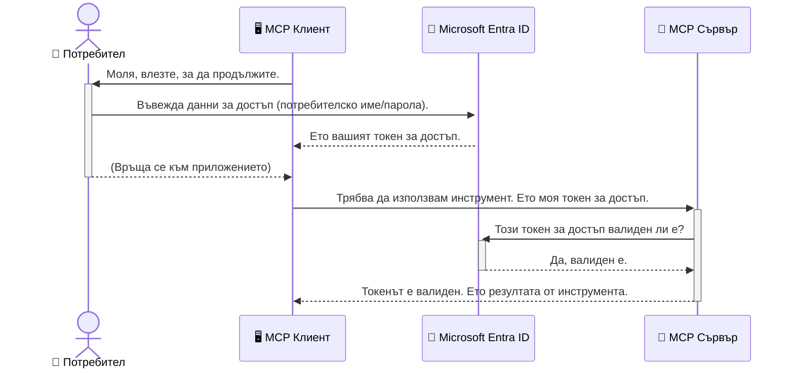

# Защита на AI работни процеси: Entra ID удостоверяване за Model Context Protocol сървъри

## Въведение
Защитата на вашия Model Context Protocol (MCP) сървър е също толкова важна, колкото заключването на входната врата на вашия дом. Оставянето на MCP сървъра отворен излага инструментите и данните ви на неоторизиран достъп, което може да доведе до нарушения на сигурността. Microsoft Entra ID предоставя здрава базирана в облак услуга за управление на идентичности и достъп, която помага да се гарантира, че само оторизирани потребители и приложения могат да взаимодействат с вашия MCP сървър. В този раздел ще научите как да защитите вашите AI работни процеси с помощта на Entra ID удостоверяване.

## Учебни цели
В края на този раздел ще можете да:

- Разберете важността на защитата на MCP сървърите.
- Обясните основите на Microsoft Entra ID и OAuth 2.0 удостоверяването.
- Разпознаете разликата между публични и поверителни клиенти.
- Прилагате Entra ID удостоверяване както в локални (публичен клиент), така и в отдалечени (поверителен клиент) MCP сървър сценарии.
- Използвате най-добрите практики за сигурност при разработването на AI работни процеси.

## Сигурност и MCP

Точно както не бихте оставили входната врата на вашия дом отключена, не трябва да оставяте MCP сървъра отворен за всеки да има достъп. Защитата на вашите AI работни процеси е съществена за създаване на стабилни, надеждни и безопасни приложения. Тази глава ще ви запознае с използването на Microsoft Entra ID за защита на вашите MCP сървъри, като осигури, че само оторизирани потребители и приложения могат да взаимодействат с вашите инструменти и данни.

## Защо сигурността е важна за MCP сървърите

Представете си, че вашият MCP сървър разполага с инструмент, който може да изпраща имейли или да има достъп до база данни с клиенти. Несигурният сървър би означавал, че всеки потенциално може да използва този инструмент, което води до неоторизиран достъп до данни, спам или други злонамерени действия.

Като внедрите удостоверяване, вие гарантирате, че всяка заявка към вашия сървър се проверява, като се потвърждава самоличността на потребителя или приложението, правещо заявката. Това е първата и най-важна стъпка в защитата на вашите AI работни процеси.

## Въведение в Microsoft Entra ID

[**Microsoft Entra ID**](https://adoption.microsoft.com/microsoft-security/entra/) е базирана в облак услуга за управление на идентичности и достъп. Мислете за нея като за универсален охранител за вашите приложения. Тя обработва сложния процес на проверка на идентичността на потребителите (удостоверяване) и определяне какво те могат да правят (авторизация).

С помощта на Entra ID можете да:

- Активирате защитено влизане за потребителите.
- Защитите API-та и услуги.
- Управлявате политики за достъп от централно място.

За MCP сървъри Entra ID предоставя здрава и широко доверена решение за управление на това кой може да има достъп до възможностите на вашия сървър.

---

## Разбиране на магията: Как работи Entra ID удостоверяването

Entra ID използва отворени стандарти като **OAuth 2.0** за удостоверяване. Въпреки че детайлите могат да са сложни, основната концепция е проста и може да се разбере чрез аналогия.

### Леко въведение в OAuth 2.0: Ключът на паркиращия

Мислете за OAuth 2.0 като за услугата на паркиращия за вашата кола. Когато пристигате в ресторант, не давате ключа си за запалване на паркиращия. Вместо това предоставяте **ключ за паркиране**, който има ограничени права — може да кара колата и да заключва вратите, но не може да отвори багажника или жабката.

В тази аналогия:

- **Вие** сте **Потребителят**.
- **Вашата кола** е **MCP сървърът** с ценните си инструменти и данни.
- **Паркиращият** е **Microsoft Entra ID**.
- **Гардеробиерът** е **MCP клиентът** (приложението, което се опитва да получи достъп до сървъра).
- **Ключът за паркиране** е **Токен за достъп**.

Токенът за достъп е защитен текстов низ, който MCP клиентът получава от Entra ID след като влезете в системата. Клиентът след това представя този токен на MCP сървъра при всяка заявка. Сървърът може да потвърди валидността на токена, за да удостовери, че заявката е легитимна и че клиентът има необходимите разрешителни, без никога да е необходимо да обработва вашите реални идентификационни данни (като паролата ви).

### Поток на удостоверяване

Ето как процесът работи на практика:




### Представяне на Microsoft Authentication Library (MSAL)

Преди да се потопим в кода, е важно да представим ключов компонент, който ще виждате в примерите: **Microsoft Authentication Library (MSAL)**.

MSAL е библиотека, разработена от Microsoft, която прави много по-лесно за разработчиците да обработват удостоверяването. Вместо да пишете целия сложен код за управление на сигурни токени, влизания и обновяване на сесии, MSAL поема тежката работа.

Използването на библиотека като MSAL е силно препоръчително, защото:

- **Тя е сигурна:** Прилага индустриални стандарти и най-добри практики за сигурност, намалявайки риска от уязвимости в кода ви.
- **Опростява разработката:** Абстрахира сложността на OAuth 2.0 и OpenID Connect протоколите, позволявайки ви да добавите стабилно удостоверяване с няколко реда код.
- **Поддържа се редовно:** Microsoft активно поддържа и обновява MSAL, за да се справя с нови заплахи за сигурността и промени в платформите.

MSAL поддържа широк набор от езици и рамки за приложения, включително .NET, JavaScript/TypeScript, Python, Java, Go и мобилни платформи като iOS и Android. Това означава, че можете да използвате едни и същи модели на удостоверяване във всички технологии, които използвате.

За повече информация за MSAL, можете да разгледате официалната [документация за MSAL](https://learn.microsoft.com/entra/identity-platform/msal-overview).

---

## Защита на вашия MCP сървър с Entra ID: Ръководство стъпка по стъпка

Сега нека разгледаме как да защитите локален MCP сървър (който комуникира чрез `stdio`) с Entra ID. Този пример използва **публичен клиент**, който е подходящ за приложения, работещи на машината на потребителя, като десктоп приложения или локални сървъри за разработка.

### Сценарий 1: Защита на локален MCP сървър (с публичен клиент)

В този сценарий разглеждаме MCP сървър, който работи локално, комуникира през `stdio` и използва Entra ID, за да удостоверява потребителя преди да му позволи достъп до инструментите му. Сървърът ще има един инструмент, който извлича профилната информация на потребителя от Microsoft Graph API.

#### 1. Настройване на приложението в Entra ID

Преди да напишете какъвто и да е код, трябва да регистрирате приложението си в Microsoft Entra ID. Това информира Entra ID за вашето приложение и му предоставя разрешение да използва услугата за удостоверяване.

1. Отидете на **[Microsoft Entra портал](https://entra.microsoft.com/)**.
2. Влезте в **App registrations** и кликнете на **New registration**.
3. Въведете име на вашето приложение (например "My Local MCP Server").
4. За **Supported account types** изберете **Accounts in this organizational directory only**.
5. За този пример можете да оставите **Redirect URI** празно.
6. Натиснете **Register**.

След регистрацията запишете **Application (client) ID** и **Directory (tenant) ID**. Те ще са ви нужни в кода.

#### 2. Кодът: Анализ

Нека разгледаме ключовите части от кода, отговарящи за удостоверяването. Пълният код за този пример е наличен в [Entra ID - Local - WAM](https://github.com/Azure-Samples/mcp-auth-servers/tree/main/src/entra-id-local-wam) папката на [mcp-auth-servers GitHub хранилището](https://github.com/Azure-Samples/mcp-auth-servers).

**`AuthenticationService.cs`**

Този клас отговаря за взаимодействието с Entra ID.

- **`CreateAsync`**: Този метод инициализира `PublicClientApplication` от MSAL (Microsoft Authentication Library). Конфигуриран е с `clientId` и `tenantId` на вашето приложение.
- **`WithBroker`**: Позволява използването на брокер (като Windows Web Account Manager), който осигурява по-сигурно и плавно влизане с един акаунт.
- **`AcquireTokenAsync`**: Това е основният метод. Първо се опитва да получи токен тихо (т.е. потребителят няма да бъде подканен да влиза отново, ако вече има валидна сесия). Ако тихото придобиване на токен не е възможно, потребителят ще трябва да се удостовери интерактивно.

```csharp
// Simplified for clarity
public static async Task<AuthenticationService> CreateAsync(ILogger<AuthenticationService> logger)
{
    var msalClient = PublicClientApplicationBuilder
        .Create(_clientId) // Your Application (client) ID
        .WithAuthority(AadAuthorityAudience.AzureAdMyOrg)
        .WithTenantId(_tenantId) // Your Directory (tenant) ID
        .WithBroker(new BrokerOptions(BrokerOptions.OperatingSystems.Windows))
        .Build();

    // ... cache registration ...

    return new AuthenticationService(logger, msalClient);
}

public async Task<string> AcquireTokenAsync()
{
    try
    {
        // Try silent authentication first
        var accounts = await _msalClient.GetAccountsAsync();
        var account = accounts.FirstOrDefault();

        AuthenticationResult? result = null;

        if (account != null)
        {
            result = await _msalClient.AcquireTokenSilent(_scopes, account).ExecuteAsync();
        }
        else
        {
            // If no account, or silent fails, go interactive
            result = await _msalClient.AcquireTokenInteractive(_scopes).ExecuteAsync();
        }

        return result.AccessToken;
    }
    catch (Exception ex)
    {
        _logger.LogError(ex, "An error occurred while acquiring the token.");
        throw; // Optionally rethrow the exception for higher-level handling
    }
}
```


**`Program.cs`**

Тук се настройва MCP сървърът и интегрира услугата за удостоверяване.

- **`AddSingleton<AuthenticationService>`**: Регистрира `AuthenticationService` в контейнера за зависимост, така че да може да се използва от други части на приложението (като нашия инструмент).
- **`GetUserDetailsFromGraph` инструмент**: Този инструмент изисква инстанция на `AuthenticationService`. Преди да направи нещо, той извиква `authService.AcquireTokenAsync()`, за да получи валиден токен за достъп. Ако удостоверяването е успешно, използва токена, за да се обърне към Microsoft Graph API и да извлече данните за потребителя.

```csharp
// Simplified for clarity
[McpServerTool(Name = "GetUserDetailsFromGraph")]
public static async Task<string> GetUserDetailsFromGraph(
    AuthenticationService authService)
{
    try
    {
        // This will trigger the authentication flow
        var accessToken = await authService.AcquireTokenAsync();

        // Use the token to create a GraphServiceClient
        var graphClient = new GraphServiceClient(
            new BaseBearerTokenAuthenticationProvider(new TokenProvider(authService)));

        var user = await graphClient.Me.GetAsync();

        return System.Text.Json.JsonSerializer.Serialize(user);
    }
    catch (Exception ex)
    {
        return $"Error: {ex.Message}";
    }
}
```


#### 3. Как всичко работи заедно

1. Когато MCP клиент се опита да използва инструмента `GetUserDetailsFromGraph`, инструментът първо извиква `AcquireTokenAsync`.
2. `AcquireTokenAsync` кара MSAL библиотеката да провери за валиден токен.
3. Ако няма такъв, MSAL чрез брокера подканва потребителя да влезе с акаунта си в Entra ID.
4. След като потребителят се удостовери, Entra ID издава токен за достъп.
5. Инструментът получава токена и го използва, за да направи сигурно повикване към Microsoft Graph API.
6. Данните за потребителя се връщат към MCP клиента.

Този процес гарантира, че само удостоверени потребители могат да използват инструмента, ефективно защитавайки вашия локален MCP сървър.

### Сценарий 2: Защита на отдалечен MCP сървър (с поверителен клиент)

Когато вашият MCP сървър работи на отдалечена машина (като облачен сървър) и комуникира през протокол като HTTP Streaming, изискванията за сигурност са различни. В този случай трябва да използвате **поверителен клиент** и **Authorization Code Flow**. Това е по-сигурен метод, защото тайните на приложението никога не се излагат на браузъра.

Този пример използва TypeScript базиран MCP сървър, който използва Express.js за обработка на HTTP заявки.

#### 1. Настройване на приложението в Entra ID

Настройката в Entra ID е сходна с тази за публичния клиент, но с една ключова разлика: трябва да създадете **клиентска тайна**.

1. Отидете на **[Microsoft Entra портал](https://entra.microsoft.com/)**.
2. В регистъра на приложението си отидете на таба **Certificates & secrets**.
3. Кликнете **New client secret**, въведете описание и натиснете **Add**.
4. **Важно:** Копирайте стойността на тайната веднага. След това няма да можете да я видите отново.
5. Трябва също така да конфигурирате **Redirect URI**. Отидете на таба **Authentication**, кликнете **Add a platform**, изберете **Web** и въведете redirect URI за вашето приложение (например `http://localhost:3001/auth/callback`).

> **⚠️ Важна забележка за сигурността:** За продукционни приложения Microsoft силно препоръчва използването на **безтайно удостоверяване** като **Managed Identity** или **Workload Identity Federation** вместо клиентски тайни. Клиентските тайни носят рискове за сигурността, тъй като могат да бъдат изложени или компрометирани. Управляваните идентичности предоставят по-сигурен подход чрез премахване на нуждата от съхраняване на идентификационни данни в кода или конфигурацията ви.
>
> За повече информация относно управлявани идентичности и как да ги имплементирате, вижте [Обзор на управляваните идентичности за Azure ресурси](https://learn.microsoft.com/entra/identity/managed-identities-azure-resources/overview).

#### 2. Кодът: Анализ

Този пример използва подход със сесии. Когато потребителят се удостовери, сървърът съхранява токена за достъп и refresh token в сесия и дава на потребителя сесионен токен. Този сесионен токен се използва за последващи заявки. Пълният код за този пример е наличен в [Entra ID - Confidential client](https://github.com/Azure-Samples/mcp-auth-servers/tree/main/src/entra-id-cca-session) папката на [mcp-auth-servers GitHub хранилището](https://github.com/Azure-Samples/mcp-auth-servers).

**`Server.ts`**

Този файл настройва Express сървъра и MCP транспортния слой.

- **`requireBearerAuth`**: Това е middleware, който защитава `/sse` и `/message` крайни точки. Проверява за валиден bearer токен в `Authorization` хедъра на заявката.
- **`EntraIdServerAuthProvider`**: Това е персонализиран клас, който имплементира интерфейса `McpServerAuthorizationProvider`. Отговаря за управлението на OAuth 2.0 потока.
- **`/auth/callback`**: Тази крайна точка обработва пренасочванията от Entra ID след като потребителят се е удостовери. Извършва обмен на authorization code за токен за достъп и refresh token.

```typescript
// Оптимизирано за яснота
const app = express();
const { server } = createServer();
const provider = new EntraIdServerAuthProvider();

// Защитете SSE крайната точка
app.get("/sse", requireBearerAuth({
  provider,
  requiredScopes: ["User.Read"]
}), async (req, res) => {
  // ... свържете се с транспорта ...
});

// Защитете крайната точка за съобщения
app.post("/message", requireBearerAuth({
  provider,
  requiredScopes: ["User.Read"]
}), async (req, res) => {
  // ... обработете съобщението ...
});

// Обработете обратно извикване на OAuth 2.0
app.get("/auth/callback", (req, res) => {
  provider.handleCallback(req.query.code, req.query.state)
    .then(result => {
      // ... обработете успех или неуспех ...
    });
});
```


**`Tools.ts`**

Този файл дефинира инструментите, които MCP сървърът предоставя. Инструментът `getUserDetails` е подобен на този от предишния пример, но взема токена за достъп от сесията.

```typescript
// Опростено за яснота
server.setRequestHandler(CallToolRequestSchema, async (request) => {
  const { name } = request.params;
  const context = request.params?.context as { token?: string } | undefined;
  const sessionToken = context?.token;

  if (name === ToolName.GET_USER_DETAILS) {
    if (!sessionToken) {
      throw new AuthenticationError("Authentication token is missing or invalid. Ensure the token is provided in the request context.");
    }

    // Вземете токена на Entra ID от магазина за сесии
    const tokenData = tokenStore.getToken(sessionToken);
    const entraIdToken = tokenData.accessToken;

    const graphClient = Client.init({
      authProvider: (done) => {
        done(null, entraIdToken);
      }
    });

    const user = await graphClient.api('/me').get();

    // ... върнете подробности за потребителя ...
  }
});
```


**`auth/EntraIdServerAuthProvider.ts`**

Този клас обработва логиката за:

- Пренасочване към Entra ID страницата за влизане.
- Обмен на authorization code за токен за достъп.
- Съхранение на токените в `tokenStore`.
- Обновяване на токена за достъп при изтичане на валидността му.

#### 3. Как всичко работи заедно

1. Когато потребител се опита да се свърже с MCP сървъра за първи път, middleware-то `requireBearerAuth` ще установи, че няма валидна сесия и ще го пренасочи към страницата за влизане в Entra ID.
2. Потребителят влиза с акаунта си в Entra ID.
3. Entra ID пренасочва потребителя обратно към крайния пункт `/auth/callback` със код за разрешение.  
4. Сървърът заменя кода за токен за достъп и обновяващ токен, съхранява ги и създава токен за сесия, който се изпраща на клиента.  
5. Клиентът вече може да използва този токен за сесия в заглавката `Authorization` за всички бъдещи заявки към сървъра MCP.  
6. Когато се извиква инструментът `getUserDetails`, той използва токена за сесия, за да намери токена за достъп на Entra ID и след това го използва, за да извика Microsoft Graph API.  

Този поток е по-сложен от потока за публичния клиент, но е необходим за крайни точки, ориентирани към интернет. Тъй като отдалечените MCP сървъри са достъпни през публичния интернет, те се нуждаят от по-силни мерки за сигурност, за да се предпазят от неоторизиран достъп и потенциални атаки.

## Най-добри практики за сигурност

- **Винаги използвайте HTTPS**: Криптирайте комуникацията между клиента и сървъра, за да защитите токените от прихващане.  
- **Прилагайте контрол на достъпа, базиран на роли (RBAC)**: Не просто проверявайте *дали* потребителят е удостоверен, а проверявайте *какво* има разрешение да прави. Можете да дефинирате роли в Entra ID и да ги проверявате на вашия MCP сървър.  
- **Следене и одит**: Записвайте всички събития за удостоверяване, за да можете да откривате и реагирате на подозрителна активност.  
- **Обработка на ограничаване на честотата и ограничаване на достъпа**: Microsoft Graph и други API-та налагат ограничаване на честотата, за да предотвратят злоупотреби. Прилагайте логика за експоненциално отлагане и повторен опит в вашия MCP сървър, за да обработвате плавно HTTP 429 (Твърде много заявки) отговори. Помислете за кеширане на често използвани данни, за да намалите броя на обажданията към API.  
- **Сигурно съхранение на токени**: Съхранявайте токени за достъп и обновяващи токени по сигурен начин. За локални приложения използвайте механизмите за сигурно съхранение на системата. За сървърни приложения обмислете използването на криптирано съхранение или услуги за управление на ключове като Azure Key Vault.  
- **Обработка на изтичане на токени**: Токените за достъп имат ограничен живот. Внедрете автоматично обновяване на токените с помощта на обновяващите токени, за да запазите безпроблемното потребителско изживяване без необходимост от повторно удостоверяване.  
- **Обмислете използването на Azure API Management**: Докато прилагането на сигурността директно във вашия MCP сървър ви дава прецизен контрол, шлюзове за API като Azure API Management могат автоматично да се справят с много от тези проблеми със сигурността, включително удостоверяване, авторизация, ограничаване на честотата и мониторинг. Те осигуряват централизиран слой за сигурност, който стои между вашите клиенти и MCP сървърите ви. За повече подробности относно използването на шлюзове за API с MCP вижте нашата [Azure API Management Your Auth Gateway For MCP Servers](https://techcommunity.microsoft.com/blog/integrationsonazureblog/azure-api-management-your-auth-gateway-for-mcp-servers/4402690).

## Основни изводи

- Осигуряването на вашия MCP сървър е от ключово значение за защита на вашите данни и инструменти.  
- Microsoft Entra ID предоставя стабилно и разтегателно решение за удостоверяване и авторизация.  
- Използвайте **публичен клиент** за локални приложения и **конфиденциален клиент** за отдалечени сървъри.  
- **Потокът за код за разрешение** е най-сигурният вариант за уеб приложения.

## Упражнение

1. Помислете за MCP сървър, който бихте изградили. Ще бъде ли локален сървър или отдалечен сървър?  
2. Въз основа на отговора, бихте ли използвали публичен или конфиденциален клиент?  
3. Какво разрешение ще поиска вашият MCP сървър за изпълнение на действия срещу Microsoft Graph?

## Практически упражнения

### Упражнение 1: Регистриране на приложение в Entra ID  
Отидете в портала Microsoft Entra.  
Регистрирайте ново приложение за вашия MCP сървър.  
Запишете Application (client) ID и Directory (tenant) ID.

### Упражнение 2: Осигуряване на локален MCP сървър (Публичен клиент)  
- Следвайте примерния код за интегриране на MSAL (Microsoft Authentication Library) за потребителско удостоверяване.  
- Тествайте потока на удостоверяване като извикате инструмента MCP, който извлича детайли за потребителя от Microsoft Graph.

### Упражнение 3: Осигуряване на отдалечен MCP сървър (Конфиденциален клиент)  
- Регистрирайте конфиденциален клиент в Entra ID и създайте клиентски таен ключ.  
- Конфигурирайте вашия Express.js MCP сървър да използва потока за код за разрешение.  
- Тествайте защитените крайни точки и потвърдете достъп на базата на токен.

### Упражнение 4: Приложете най-добрите практики за сигурност  
- Активирайте HTTPS за вашия локален или отдалечен сървър.  
- Прилагайте контрол на достъпа, базиран на роли (RBAC) в логиката на сървъра си.  
- Добавете обработка на изтичане на токена и сигурно съхранение на токени.

## Ресурси

1. **MSAL Преглед на документацията**  
   Научете как Microsoft Authentication Library (MSAL) позволява сигурно придобиване на токени на различни платформи:  
   [MSAL Overview on Microsoft Learn](https://learn.microsoft.com/en-gb/entra/msal/overview)

2. **Azure-Samples/mcp-auth-servers GitHub хранилище**  
   Реализации за пример на MCP сървъри, демонстриращи потоци на удостоверяване:  
   [Azure-Samples/mcp-auth-servers on GitHub](https://github.com/Azure-Samples/mcp-auth-servers)

3. **Преглед на управлявани идентичности за ресурси на Azure**  
   Разберете как да премахнете тайните, като използвате системно или потребителски зададени управлявани идентичности:  
   [Managed Identities Overview on Microsoft Learn](https://learn.microsoft.com/en-us/entra/identity/managed-identities-azure-resources/)

4. **Azure API Management: Вашият шлюз за удостоверяване към MCP сървъри**  
   Задълбочено разглеждане на използването на API Management като сигурен шлюз OAuth2 за MCP сървъри:  
   [Azure API Management Your Auth Gateway For MCP Servers](https://techcommunity.microsoft.com/blog/integrationsonazureblog/azure-api-management-your-auth-gateway-for-mcp-servers/4402690)

5. **Справочник с разрешенията на Microsoft Graph**  
   Изчерпателен списък с делегирани и приложения за разрешения за Microsoft Graph:  
   [Microsoft Graph Permissions Reference](https://learn.microsoft.com/zh-tw/graph/permissions-reference)

## Учебни резултати  
След завършване на този раздел ще можете да:

- Обяснявате защо удостоверяването е критично за MCP сървърите и AI работните потоци.  
- Настройвате и конфигурирате удостоверяване чрез Entra ID за локални и отдалечени MCP сървърни сценарии.  
- Избирате подходящ тип клиент (публичен или конфиденциален) на база разгръщането на сървъра.  
- Прилагате сигурни практики за кодиране, включително съхранение на токени и авторизация, базирана на роли.  
- Уверено защитавате своя MCP сървър и инструментите му от неоторизиран достъп.

## Какво следва

- [5.13 Интеграция на протокол за контекст на модел (MCP) с Microsoft Foundry](../mcp-foundry-agent-integration/README.md)

---

<!-- CO-OP TRANSLATOR DISCLAIMER START -->
**Отказ от отговорност**:
Този документ е преведен с помощта на AI преводачески услуга [Co-op Translator](https://github.com/Azure/co-op-translator). Въпреки че се стремим към точност, моля имайте предвид, че автоматизираните преводи могат да съдържат грешки или неточности. Оригиналният документ на неговия роден език трябва да се счита за авторитетен източник. За критична информация се препоръчва професионален човешки превод. Ние не носим отговорност за каквито и да е недоразумения или неправилни тълкувания, произтичащи от използването на този превод.
<!-- CO-OP TRANSLATOR DISCLAIMER END -->