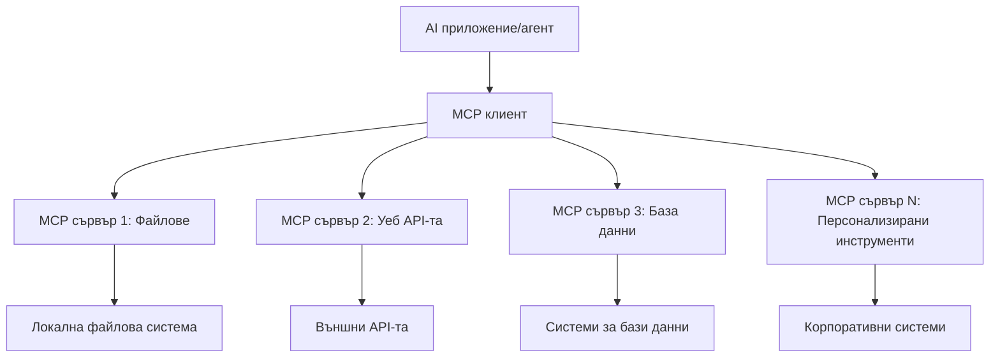

# 🌐 Модул 2: MCP с основи на Microsoft Foundry Toolkit

[]()
[]()
[]()

## 📋 Учебни цели

Към края на този модул ще можете да:
- ✅ Разбирате архитектурата и ползите от Model Context Protocol (MCP)
- ✅ Проучите екосистемата от MCP сървъри на Microsoft
- ✅ Интегрирате MCP сървъри с Microsoft Foundry Toolkit Agent Builder
- ✅ Създадете функционален агент за автоматизация на браузър с Playwright MCP
- ✅ Конфигурирате и тествате MCP инструменти във вашите агенти
- ✅ Експортирате и внедрявате агенти с MCP за производство

## 🎯 Изграждане върху Модул 1

В Модул 1 овладяхме основите на Microsoft Foundry Toolkit и създадохме първия си Python Агент. Сега ще **усъвършенстваме** вашите агенти, като ги свържем с външни инструменти и услуги чрез революционния **Model Context Protocol (MCP)**.

Помислете за това като ъпгрейд от обикновен калкулатор до пълен компютър - вашите AI агенти ще могат да:
- 🌐 Преглеждат и взаимодействат с уебсайтове
- 📁 Достъпват и манипулират файлове
- 🔧 Интегрират се с корпоративни системи
- 📊 Обработват реалновременни данни от API

## 🧠 Разбиране на Model Context Protocol (MCP)

### 🔍 Какво е MCP?

Model Context Protocol (MCP) е **"USB-C за AI приложения"** - революционен отворен стандарт, който свързва Големи Езикови Модели (LLMs) с външни инструменти, източници на данни и услуги. Точно както USB-C премахна хаоса от кабели с един универсален конектор, MCP елиминира сложността при интеграция на AI с един стандартизиран протокол.

### 🎯 Проблемът, който решава MCP

**Преди MCP:**
- 🔧 Персонализирани интеграции за всеки инструмент
- 🔄 Заключване при доставчици с патентовани решения
- 🔒 Уязвимости в сигурността от случайни връзки
- ⏱️ Месеци развитие за базови интеграции

**С MCP:**
- ⚡ Plug-and-play интеграция на инструменти
- 🔄 Архитектура, независима от доставчици
- 🛡️ Вградени най-добри практики за сигурност
- 🚀 Минути за добавяне на нови възможности

### 🏗️ Дълбок поглед към архитектурата на MCP

MCP следва **клиент-сървър архитектура**, която създава сигурна и мащабируема екосистема:



**🔧 Основни компоненти:**

| Компонент | Роля | Примери |
|-----------|------|----------|
| **MCP Hosts** | Приложения, които потребяват MCP услуги | Claude Desktop, VS Code, Microsoft Foundry Toolkit |
| **MCP Clients** | Обработващи протокола (1:1 със сървърите) | Вградени в хост приложенията |
| **MCP Servers** | Излагат възможности чрез стандартен протокол | Playwright, Files, Azure, GitHub |
| **Transport Layer** | Методи за комуникация | stdio, HTTP, WebSockets |


## 🏢 Екосистема от MCP сървъри на Microsoft

Microsoft води екосистемата с пълен набор от корпоративни сървъри, които покриват реални бизнес нужди.

### 🌟 Представени MCP сървъри на Microsoft

#### 1. ☁️ Azure MCP Сървър
**🔗 Репозиториум**: [azure/azure-mcp](https://github.com/azure/azure-mcp)
**🎯 Цел**: Изчерпателно управление на ресурси в Azure с AI интеграция

**✨ Основни функции:**
- Декларативно предоставяне на инфраструктура
- Мониторинг на ресурси в реално време
- Препоръки за оптимизиране на разходите
- Проверка на съответствие със сигурността

**🚀 Примери за използване:**
- Infrastructure-as-Code с AI помощ
- Автоматично мащабиране на ресурси
- Оптимизиране на облачни разходи
- Автоматизация на DevOps процеси

#### 2. 📊 Microsoft Dataverse MCP
**📚 Документация**: [Интеграция на Microsoft Dataverse](https://go.microsoft.com/fwlink/?linkid=2320176)
**🎯 Цел**: Естествен езиков интерфейс за бизнес данни

**✨ Основни функции:**
- Запитвания към база данни на естествен език
- Разбиране на бизнес контекст
- Персонализирани шаблони за повиквания
- Управление на корпоративни данни

**🚀 Примери за използване:**
- Отчети за бизнес интелигентност
- Анализ на клиентски данни
- Преглед на продажбени инициативи
- Запитвания за съответствие

#### 3. 🌐 Playwright MCP Сървър
**🔗 Репозиториум**: [microsoft/playwright-mcp](https://github.com/microsoft/playwright-mcp)
**🎯 Цел**: Автоматизация на браузър и уеб взаимодействия

**✨ Основни функции:**
- Крос-браузър автоматизация (Chrome, Firefox, Safari)
- Интелигентно откриване на елементи
- Създаване на скрийншоти и PDF
- Наблюдение на мрежов трафик

**🚀 Примери за използване:**
- Автоматизирани тестови потоци
- Уеб скрейпинг и извличане на данни
- Мониторинг на UI/UX
- Автоматизация на конкурентен анализ

#### 4. 📁 Files MCP Сървър
**🔗 Репозиториум**: [microsoft/files-mcp-server](https://github.com/microsoft/files-mcp-server)
**🎯 Цел**: Интелигентни файлови операции

**✨ Основни функции:**
- Декларативно управление на файлове
- Синхронизация на съдържание
- Интеграция с управление на версии
- Извличане на метаданни

**🚀 Примери за използване:**
- Управление на документация
- Организация на кодови хранилища
- Работни потоци за публикуване на съдържание
- Обработка на файлове в потоци от данни

#### 5. 📝 MarkItDown MCP Сървър
**🔗 Репозиториум**: [microsoft/markitdown](https://github.com/microsoft/markitdown)
**🎯 Цел**: Разширена обработка и манипулация на Markdown

**✨ Основни функции:**
- Богат синтактичен анализ на Markdown
- Конвертиране между формати (MD ↔ HTML ↔ PDF)
- Анализ на структурата на съдържанието
- Обработка на шаблони

**🚀 Примери за използване:**
- Работни потоци за техническа документация
- Системи за управление на съдържанието
- Генериране на отчети
- Автоматизация на база знания

#### 6. 📈 Clarity MCP Сървър
**📦 Пакет**: [@microsoft/clarity-mcp-server](https://www.npmjs.com/package/@microsoft/clarity-mcp-server)
**🎯 Цел**: Уеб аналитика и анализ на потребителско поведение

**✨ Основни функции:**
- Анализ на топлинни карти
- Записи на потребителски сесии
- Метрики за производителност
- Анализ на конверсионни фунии

**🚀 Примери за използване:**
- Оптимизация на уебсайтове
- Изследване на потребителския опит
- Анализ на A/B тестове
- Табла за бизнес интелигентност

### 🌍 Екосистема на общността

Освен сървърите на Microsoft, екосистемата MCP включва:
- **🐙 GitHub MCP**: Управление на репозитории и анализ на код
- **🗄️ Database MCPs**: Интеграции с PostgreSQL, MySQL, MongoDB
- **☁️ Cloud Provider MCPs**: Инструменти за AWS, GCP, Digital Ocean
- **📧 Communication MCPs**: Интеграции с Slack, Teams, Email

## 🛠️ Практическа част: Създаване на агент за автоматизация на браузър

**🎯 Цел на проекта**: Създайте интелигентен агент за автоматизация на браузър използвайки Playwright MCP сървър, който може да навигира в уебсайтове, извлича информация и извършва сложни уеб взаимодействия.

### 🚀 Фаза 1: Настройка на основата на агента

#### Стъпка 1: Инициализирайте Агентa си
1. **Отворете Microsoft Foundry Toolkit Agent Builder**
2. **Създайте нов агент** с конфигурация:
   - **Име**: `BrowserAgent`
   - **Модел**: Изберете GPT-4o 


### 🔧 Фаза 2: Работен процес за интеграция на MCP

#### Стъпка 3: Добавяне на MCP сървър интеграция
1. **Отидете в секцията Инструменти** в Agent Builder
2. **Щракнете "Add Tool"** за отваряне на менюто за интеграция
3. **Изберете "MCP Server"** от наличните опции


**🔍 Разбиране на типове инструменти:**
- **Вградени инструменти**: Предварително конфигурирани функции на Microsoft Foundry Toolkit
- **MCP Сървъри**: Външни интеграции на услуги
- **Потребителски API-та**: Ваши собствени крайни точки на услуги
- **Функционални повиквания**: Директен достъп до функции на модела

#### Стъпка 4: Избор на MCP сървър
1. **Изберете опцията "MCP Server"** за продължение


2. **Прегледайте MCP каталога** за налични интеграции


### 🎮 Фаза 3: Конфигурация на Playwright MCP

#### Стъпка 5: Избор и конфигуриране на Playwright
1. **Щракнете "Use Featured MCP Servers"** за достъп до проверените сървъри на Microsoft
2. **Изберете "Playwright"** от списъка с препоръчани
3. **Приемете подразбиращия се MCP ID** или го персонализирайте за вашата среда


#### Стъпка 6: Активиране на възможностите на Playwright
**🔑 Критична стъпка**: Изберете **ВСИЧКИ** налични Playwright методи за максимална функционалност


**🛠️ Основни инструменти на Playwright:**
- **Навигация**: `goto`, `goBack`, `goForward`, `reload`
- **Взаимодействие**: `click`, `fill`, `press`, `hover`, `drag`
- **Извличане**: `textContent`, `innerHTML`, `getAttribute`
- **Проверка**: `isVisible`, `isEnabled`, `waitForSelector`
- **Заснемане**: `screenshot`, `pdf`, `video`
- **Мрежа**: `setExtraHTTPHeaders`, `route`, `waitForResponse`

#### Стъпка 7: Проверка на успеха на интеграцията
**✅ Индикатори за успех:**
- Всички инструменти се показват в интерфейса на Agent Builder
- Няма съобщения за грешки в панела за интеграция
- Статусът на Playwright сървъра показва "Connected"


**🔧 Отстраняване на често срещани проблеми:**
- **Неуспешно свързване**: Проверете интернет връзката и настройки на защитната стена
- **Липсващи инструменти**: Уверете се, че всички възможности са избрани при настройката
- **Грешки при разрешения**: Проверете дали VS Code има необходимите системни разрешения

### 🎯 Фаза 4: Разширено инженерство на подканите

#### Стъпка 8: Проектиране на интелигентни системни подканящи текстове
Създайте сложни подканящи текстове, които използват пълните възможности на Playwright:

```markdown
# Web Automation Expert System Prompt

## Core Identity
You are an advanced web automation specialist with deep expertise in browser automation, web scraping, and user experience analysis. You have access to Playwright tools for comprehensive browser control.

## Capabilities & Approach
### Navigation Strategy
- Always start with screenshots to understand page layout
- Use semantic selectors (text content, labels) when possible
- Implement wait strategies for dynamic content
- Handle single-page applications (SPAs) effectively

### Error Handling
- Retry failed operations with exponential backoff
- Provide clear error descriptions and solutions
- Suggest alternative approaches when primary methods fail
- Always capture diagnostic screenshots on errors

### Data Extraction
- Extract structured data in JSON format when possible
- Provide confidence scores for extracted information
- Validate data completeness and accuracy
- Handle pagination and infinite scroll scenarios

### Reporting
- Include step-by-step execution logs
- Provide before/after screenshots for verification
- Suggest optimizations and alternative approaches
- Document any limitations or edge cases encountered

## Ethical Guidelines
- Respect robots.txt and rate limiting
- Avoid overloading target servers
- Only extract publicly available information
- Follow website terms of service
```

#### Стъпка 9: Създаване на динамични подканящи текстове за потребителя
Проектирайте подканящи текстове, които демонстрират различни възможности:

**🌐 Пример за уеб анализ:**
```markdown
Navigate to github.com/kinfey and provide a comprehensive analysis including:
1. Repository structure and organization
2. Recent activity and contribution patterns  
3. Documentation quality assessment
4. Technology stack identification
5. Community engagement metrics
6. Notable projects and their purposes

Include screenshots at key steps and provide actionable insights.
```


### 🚀 Фаза 5: Изпълнение и тестване

#### Стъпка 10: Изпълнете първата си автоматизация
1. **Щракнете "Run"** за стартиране на автоматичната последователност
2. **Наблюдавайте изпълнението в реално време**:
   - Автоматично се отваря браузър Chrome
   - Агентът навигира до целевия уебсайт
   - Заснемат се скрийншоти на всеки важен етап
   - Резултатите от анализа се получават в реално време


#### Стъпка 11: Анализирайте резултатите и прозренията
Прегледайте изчерпателния анализ в интерфейса на Agent Builder:


### 🌟 Фаза 6: Разширени възможности и внедряване

#### Стъпка 12: Експорт и внедряване в продукция
Agent Builder поддържа множество опции за внедряване:


## 🎓 Обзор на Модул 2 и следващи стъпки

### 🏆 Постижение отключено: Майсторство в MCP интеграцията

**✅ Овладени умения:**
- [ ] Разбиране на архитектурата и ползите от MCP
- [ ] Навигация в екосистемата от MCP сървъри на Microsoft
- [ ] Интеграция на Playwright MCP с Microsoft Foundry Toolkit
- [ ] Създаване на усъвършенствани агенти за браузър автоматизация
- [ ] Разширено инженерство на подканите за уеб автоматизация

### 📚 Допълнителни ресурси

- **🔗 MCP Спецификация**: [Официална документация на протокола](https://modelcontextprotocol.io/)
- **🛠️ Playwright API**: [Пълен справочник на методите](https://playwright.dev/docs/api/class-playwright)
- **🏢 Microsoft MCP сървъри**: [Ръководство за корпоративна интеграция](https://github.com/microsoft/mcp-servers)
- **🌍 Примери от общността**: [Галерия на MCP сървъри](https://github.com/modelcontextprotocol/servers)

**🎉 Честито!** Успешно овладяхте MCP интеграцията и сега можете да създавате AI агенти готови за използване в производство с външни функционалности!


### 🔜 Продължете към следващия модул

Готови ли сте да издигнете MCP уменията си на следващо ниво? Продължете към **[Модул 3: Разширена разработка на MCP с Microsoft Foundry Toolkit](../lab3/README.md)**, където ще научите как да:
- Създавате свои собствени MCP сървъри
- Конфигурирате и използвате най-новия MCP Python SDK
- Настройвате MCP Inspector за отстраняване на грешки
- Овладявате разширени работни потоци за MCP сървъри
- Създавате MCP сървър за времето от нулата

---

<!-- CO-OP TRANSLATOR DISCLAIMER START -->
**Отказ от отговорност**:
Този документ е преведен с помощта на AI преводачески услуга [Co-op Translator](https://github.com/Azure/co-op-translator). Въпреки че се стремим към точност, моля имайте предвид, че автоматизираните преводи могат да съдържат грешки или неточности. Оригиналният документ на неговия роден език трябва да се счита за авторитетен източник. За критична информация се препоръчва професионален човешки превод. Ние не носим отговорност за каквито и да е недоразумения или неправилни тълкувания, произтичащи от използването на този превод.
<!-- CO-OP TRANSLATOR DISCLAIMER END -->