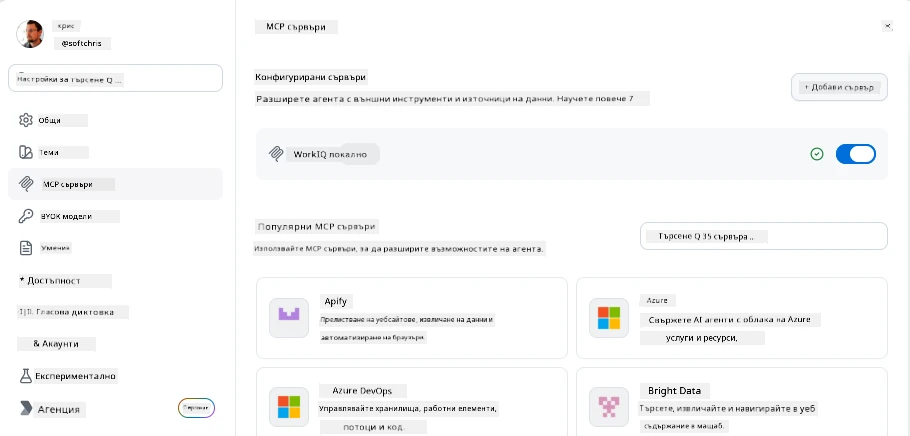
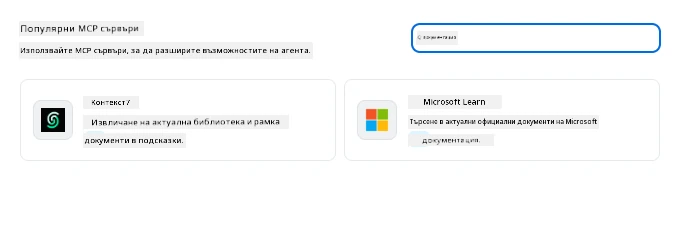
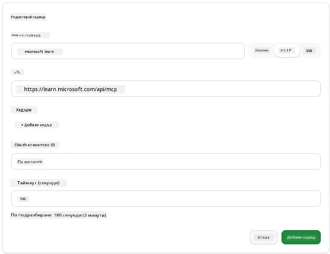
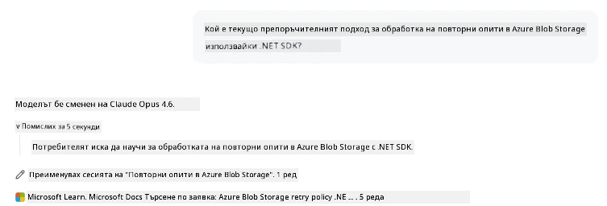
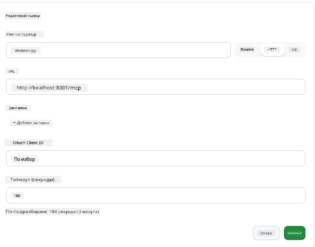
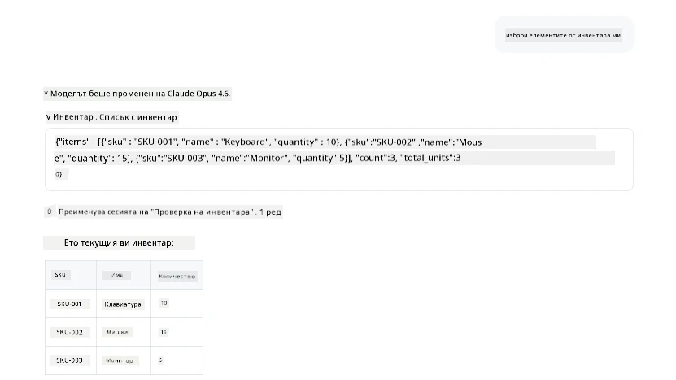
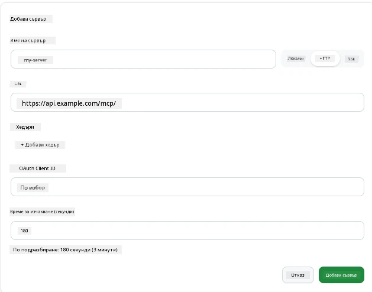
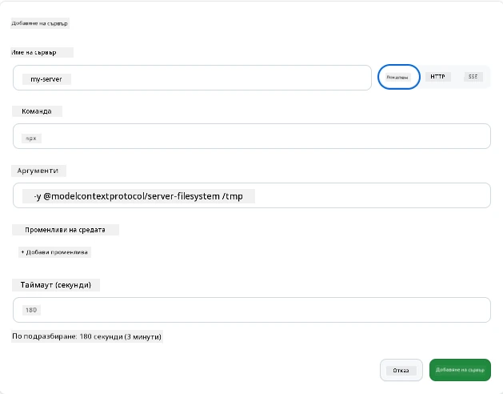

# Използване на MCP сървъри в приложението GitHub Copilot

До сега знаете как работи MCP. Вие сте изградили сървъри, дефинирали сте инструменти и ресурси и сте свързали клиенти. Това, което още не сме направили, е да променим перспективата: вместо вие да сте този, който изгражда сървъра, как изглежда да бъдете от *консумиращата* страна — като потребител на приложение с изкуствен интелект, което поддържа MCP?

[GitHub Copilot App](https://github.com/github/app) е десктоп приложение, което може да използва MCP сървъри. Чрез свързване на MCP сървъри с него отключвате ново ниво: Copilot сега може да достъпва вашата документация, да извиква вътрешни API-та, да прави заявки към вашата база данни или да разговаря с всяка услуга, която сте капсулирали в сървър. Приложението става хост; вашите MCP сървъри стават неговите инструменти.

Този урок ви превежда през опита от край до край — от намирането на панела за настройки на MCP, през свързването на реален документационен сървър до свързването на собствен персонален такъв.

## Цели на обучението

След края на този урок ще можете да:

- Намерите и навигирате в панела с MCP сървъри в настройките на Copilot App.
- Свържете хостван документационен сървър и го използвате в сесия.
- Регистрирате собствен сървър и проверите, че Copilot може да извиква неговите инструменти.
- Конфигурирате как се извиква сървър, като предоставите променливи на средата или персонални заглавки (ако е HTTP).

## Приложението Copilot като MCP хост

Ето основната идея: **агентите на Copilot са умни, но знаят само това, което им казвате.** По подразбиране агентът може да чете файлове във вашето работно пространство и да изпълнява терминални команди, но не може да прави заявки към вашата база данни, да поглежда календара ви или да извиква персонализирано API без помощ. Тук идват MCP сървърите. Те служат като мостове между Copilot и вашите системи — бази данни, контрол на версиите, API-та, дизайнерски инструменти — като дават на агентите достъп до информация и действия, които им трябват, за да завършат работата.

Нека започнем с намирането на тези настройки за управление на MCP сървърите на приложението.

## Стъпка 1: Намиране на панела за настройки на MCP

Отворете Copilot App и намерете иконата с зъбно колело от долния ляв ъгъл и кликнете върху нея.


Уверете се, че сте избрали "MCP Servers" и сега ще видите вече конфигурираните сървъри в горната част, пазар на популярни сървъри в долната част и бутон "Add Server" в горната част, нещо такова:



Това е вашият контролен център. Тук добавяте, премахвате, включвате и изключвате сървъри. Промените влизат в сила за нови сесии; ако имате отворена сесия, трябва да започнете нова, след като промените този списък.

## Стъпка 2: Свързване на документационен сървър

Нека направим нещо веднага полезно. MCP сървърът на Microsoft Docs дава на Copilot достъп до официалната документация на Microsoft. Това включва Azure, .NET, TypeScript и още. Вместо агентът да разчита на своите обучителни данни (които имат краен период), той може да изтегли актуална документация по време на заявката.

Ето как да го добавите:

1. В мрежата с популярни сървъри напишете **learn** и изберете сървъра, наречен "Microsoft Learn".

   

   След като кликнете, ще ви се покаже форма, в която името, типът на транспорта и URL адресът са предварително попълнени, всичко, което трябва да направите, е да кликнете "Add Server".

2. Кликнете "Add Server", ще отнеме няколко секунди, за да се свърже със сървъра.

   

   След като е добавен, той трябва да се появи в горната област като конфигуриран сървър. Нека го тестваме след това.

3. Затворете диалоговия прозорец и изберете Quick chat.

4. Въведете следната подканваща команда, за да задействате инструмент на сървъра Microsoft Learn.

   ```text
   What's the current recommended approach for handling Azure Blob Storage 
   retries using the .NET SDK?
   ```

   

Ще видите как се отнася до MCP сървъра, който току-що добавихме.

## Стъпка 3: Свързване на персонален stdio сървър

Предварителните настройки са удобни, но истинската мощ идва от свързването на ваши собствени сървъри. Да речем, че сте изградили сървър (или сте получили такъв), който експонира вашето вътрешно API или базата знания на компанията. В този случай ще използваме MCP сървър, който сме изградили и който управлява инвентаризацията на компанията.

1. Кликнете на зъбното колело и отново изберете "MCP servers".

2. Изберете бутона "Add Server" и "+ Add Custom server", и въведете следните стойности:

   - Име: `Inventory Server`
   - Изберете транспорт (отдясно), **http**

   Изберете "Add Server" и той трябва да се появи в списъка ви с конфигурирани сървъри.

   

4. За да го тествате, изпълнете подканваща команда като тази:

    ```
    list inventory
    ```

   

   Сега трябва да видите списък с артикули от инвентара, върнат от вашия собствен сървър.

Отлично, вече трябва да имате добра представа как да добавяте външни и собствени MCP сървъри към Copilot App. След това нека поговорим за управление на тайни и променливи на средата.

## Стъпка 4: Разширени настройки

До момента видяхте как да добавяте MCP сървъри, като просто предоставяте име и URL. Но какво ако вашият сървър се нуждае от API ключ или някаква друга стойност? В зависимост от типа транспорт, можем да му предоставим това, от което има нужда.

- **http или SSE транспорт**: Тук можем да настроим заглавки по необходимост.

   За удостоверяване можете да посочите заглавка Authorization, например. Стойността може да бъде статичен низ. Ако използвате OAuth, можете вместо това да му дадете OAuth клиентски ID.

   

- **stdio транспорт**: Могат да се задават променливи на средата.

   Тук можете да определите произволен брой променливи на средата, които трябва да се предадат на сървъра при стартирането му.

   

## Резюме

Приложението Copilot третира MCP сървърите като първокласни разширения на възможностите на агента. Видяхте целия път в този урок — от добавяне на MCP сървъри до използването им в сесия. Сега можете да се свързвате с публични сървъри, вътрешни API-та и персонални инструменти, давайки на агентите ви способността да достъпват информация и действия, необходими за автономно завършване на задачи.

## 📚 Допълнителни ресурси

### Официална документация

- [GitHub Copilot App](https://github.com/github/app)
- [MCP Specification](https://modelcontextprotocol.io/specification/2025-03-26) - Спецификация на Model Context Protocol

### Общност
- [MCP Community Discord](https://discord.com/invite/ByRwuEEgH4) - Живи дискусии
- [GitHub Discussions](https://github.com/microsoft/MCP-Server-and-PostgreSQL-Sample-Retail/discussions) - Въпроси и отговори, споделяне
- [Stack Overflow](https://stackoverflow.com/questions/tagged/model-context-protocol) - Технически въпроси

---

<!-- CO-OP TRANSLATOR DISCLAIMER START -->
**Отказ от отговорност**:
Този документ е преведен с помощта на AI преводачески услуга [Co-op Translator](https://github.com/Azure/co-op-translator). Въпреки че се стремим към точност, моля имайте предвид, че автоматизираните преводи могат да съдържат грешки или неточности. Оригиналният документ на неговия роден език трябва да се счита за авторитетен източник. За критична информация се препоръчва професионален човешки превод. Ние не носим отговорност за каквито и да е недоразумения или неправилни тълкувания, произтичащи от използването на този превод.
<!-- CO-OP TRANSLATOR DISCLAIMER END -->