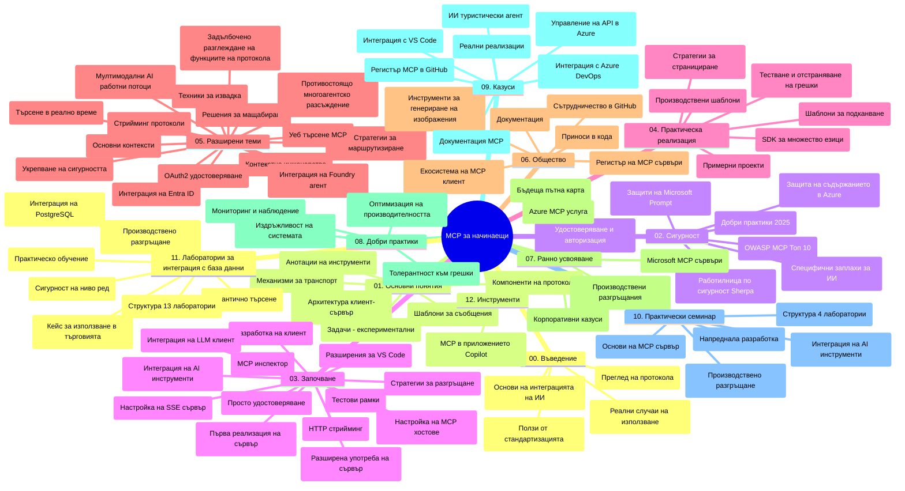

# Model Context Protocol (MCP) за начинаещи - Учебно ръководство

Това учебно ръководство предоставя преглед на структурата на хранилището и съдържанието за учебната програма "Model Context Protocol (MCP) за начинаещи". Използвайте това ръководство, за да навигирате ефективно в хранилището и да извлечете максимална полза от наличните ресурси.

## Преглед на хранилището

Model Context Protocol (MCP) е стандартизиран рамков протокол за взаимодействия между AI модели и клиентски приложения. Първоначално създаден от Anthropic, MCP сега се поддържа от по-широката MCP общност чрез официалната GitHub организация. Това хранилище предоставя цялостна учебна програма с практически кодови примери на C#, Java, JavaScript, Python и TypeScript, предназначена за AI разработчици, системни архитекти и софтуерни инженери.

## Визуална учебна карта

## Структура на хранилището

Хранилището е организирано в дванадесет основни секции, като всяка се фокусира върху различни аспекти на MCP:

1. **Въведение (00-Introduction/)**
   - Преглед на Model Context Protocol
   - Защо стандартизацията е важна в AI процесите
   - Практически случаи на употреба и ползи

2. **Основни концепции (01-CoreConcepts/)**
   - Клиент-сървър архитектура
   - Ключови компоненти на протокола
   - Шаблони за съобщения в MCP

3. **Сигурност (02-Security/)**
   - Заплахи за сигурността в системи базирани на MCP
   - Най-добри практики за защита на реализации
   - Стратегии за удостоверяване и упълномощаване
   - **Комплексна документация за сигурност**:
     - MCP Най-добри практики за сигурност 2025
     - Ръководство за прилагане на Azure Content Safety
     - Контроли и техники за сигурност в MCP
     - Бърза справка с най-добрите практики на MCP
   - **Ключови теми за сигурността**:
     - Атаки чрез инжектиране на prompt и отравяне на инструменти
     - Прехващане на сесии и проблеми с объркан представител
     - Уязвимости при подаване на токени
     - Прекомерни разрешения и контрол на достъпа
     - Сигурност на веригата за доставки за AI компоненти
     - Интеграция на Microsoft Prompt Shields

4. **Първи стъпки (03-GettingStarted/)**
   - Настройка и конфигурация на средата
   - Създаване на базови MCP сървъри и клиенти
   - Интеграция с вече съществуващи приложения
   - Включва раздели за:
     - Първа имплементация на сървър
     - Разработка на клиент
     - Интеграция с LLM клиент
     - Интеграция с VS Code
     - SSE (Server-Sent Events) сървър
     - Разширена употреба на сървър
     - HTTP стрийминг
     - Интеграция на AI Toolkit
     - Тестови стратегии
     - Насоки за разгръщане

5. **Практическа реализация (04-PracticalImplementation/)**
   - Използване на SDK в различни програмни езици
   - Отстраняване на грешки, тестване и валидация
   - Създаване на многократно използваеми шаблони за prompt-и и работни потоци
   - Примерни проекти с демонстрации

6. **Разширени теми (05-AdvancedTopics/)**
   - Техники за контекстно инженерство
   - Интеграция с Foundry агент
   - Мултимодални AI работни потоци
   - Демонстрации за удостоверяване OAuth2
   - Реално време за търсене
   - Стрийминг в реално време
   - Имплементация на коренови контексти
   - Стратегии за маршрутизиране
   - Техники за семплиране
   - Подходи за скалиране
   - Съображения за сигурност
   - Интеграция на Entra ID сигурност
   - Веб търсене
   - Адверсариални мултиагентни разсъждения (модели на дебати)

7. **Приноси от общността (06-CommunityContributions/)**
   - Как да допринасяте с код и документация
   - Сътрудничество чрез GitHub
   - Подобрения и обратна връзка, идвaщи от общността
   - Използване на различни MCP клиенти (Claude Desktop, Cline, VSCode)
   - Работа с популярни MCP сървъри, включително за генериране на изображения

8. **Уроци от ранната употреба (07-LessonsfromEarlyAdoption/)**
   - Реални реализации и истории за успех
   - Изграждане и разгръщане на решения базирани на MCP
   - Тенденции и бъдеща пътна карта
   - **Ръководство за Microsoft MCP сървъри**: Обширно ръководство за 10 Microsoft MCP сървъра готови за продукция, включващи:
     - Microsoft Learn Docs MCP Server
     - Azure MCP Server (15+ специализирани конектори)
     - GitHub MCP Server
     - Azure DevOps MCP Server
     - MarkItDown MCP Server
     - SQL Server MCP Server
     - Playwright MCP Server
     - Dev Box MCP Server
     - Microsoft Foundry MCP Server
     - Microsoft 365 Agents Toolkit MCP Server

9. **Най-добри практики (08-BestPractices/)**
   - Оптимизация и настройване на производителността
   - Проектиране на устойчива на грешки MCP система
   - Тестови и стратегии за устойчивост

10. **Проучвания на случаи (09-CaseStudy/)**
    - **Седем комплексни казуси** демонстриращи многообразието на MCP при различни сценарии:
    - **Azure AI Travel Agents**: Оркестрация на множество агенти с Azure OpenAI и AI Търсене
    - **Интеграция с Azure DevOps**: Автоматизация на работни процеси с обновления от YouTube данни
    - **Извличане на документация в реално време**: Python конзолен клиент с HTTP стрийминг
    - **Генератор на интерактивен учебен план**: Chainlit уеб приложение с разговорен AI
    - **Документация в редактора**: Интеграция с VS Code и GitHub Copilot работни потоци
    - **Azure API Management**: Интеграция на корпоративни API с създаване на MCP сървър
    - **GitHub MCP Registry**: Платформа за развитие на екосистемата и агентска интеграция
    - Примерни имплементации обхващащи корпоративна интеграция, продуктивност на разработчиците и развитие на екосистемата

11. **Практически уъркшоп (10-StreamliningAIWorkflowsBuildingAnMCPServerWithAIToolkit/)**
    - Детайлен уъркшоп комбиниращ MCP с AI Toolkit
    - Изграждане на интелигентни приложения, съчетаващи AI модели с реални инструменти
    - Практически модули покриващи основи, разработка на персонализирани сървъри и стратегии за продукционно разгръщане
    - **Структура на лабораториите**:
      - Лаб 1: Основи на MCP сървър
      - Лаб 2: Разширено разработване на MCP сървър
      - Лаб 3: Интеграция на AI Toolkit
      - Лаб 4: Разгръщане и скалиране в продукция
    - Обучение чрез лаборатории със стъпка по стъпка инструкции

12. **Лаборатории за интеграция на MCP сървъри с база данни (11-MCPServerHandsOnLabs/)**
    - **Изчерпателен курс от 13 лаборатории** за изграждане на MCP сървъри готови за продукция с интеграция на PostgreSQL
    - **Реално приложение за търговска аналитика** използвайки случая Zava Retail
    - **Корпоративни модели** включително Row Level Security (RLS), семантично търсене и многонаемателски достъп до данни
    - **Пълна структура на лабораториите**:
      - **Лаборатории 00-03: Основи** - Въведение, Архитектура, Сигурност, Настройка на средата
      - **Лаборатории 04-06: Изграждане на MCP сървър** - Дизайн на база данни, Имплементация на MCP сървър, Разработка на инструменти
      - **Лаборатории 07-09: Разширени функции** - Семантично търсене, Тестване и отстраняване на грешки, Интеграция с VS Code
      - **Лаборатории 10-12: Продукция и най-добри практики** - Разгръщане, Мониторинг, Оптимизация
    - **Използвани технологии**: FastMCP framework, PostgreSQL, Azure OpenAI, Azure Container Apps, Application Insights
    - **Резултати от обучението**: MCP сървъри готови за продукция, интеграционни модели с база данни, AI-базирана аналитика, корпоративна сигурност

13. **Инструментариум (12-tooling/)**
    - Научете как да използвате MCP в Copilot приложение и други инструменти

## Допълнителни ресурси

Хранилището включва подкрепящи ресурси:

- **Папка с изображения**: Съдържа диаграми и илюстрации използвани в учебната програма
- **Преводи**: Поддръжка на множество езици с автоматизирани преводи на документация
- **Официални MCP ресурси**:
  - [MCP документация](https://modelcontextprotocol.io/)
  - [MCP спецификация](https://spec.modelcontextprotocol.io/)
  - [MCP GitHub хранилище](https://github.com/modelcontextprotocol)

## Как да използвате това хранилище

1. **Последователно обучение**: Следвайте главите по ред (от 00 до 11) за структурирано обучение.
2. **Езиков фокус**: Ако се интересувате от конкретен програмен език, разгледайте директориите със примери за реализации на предпочитания от вас език.
3. **Практическа реализация**: Започнете с раздела "Първи стъпки", за да настроите средата си и създадете първия MCP сървър и клиент.
4. **Разширено изследване**: След като усвоите основите, преминете към разширените теми, за да разширите знанията си.
5. **Обществена ангажираност**: Присъединете се към MCP общността чрез дискусии в GitHub и канали в Discord, за да се свържете с експерти и други разработчици.

## MCP клиенти и инструменти

Учебната програма обхваща различни MCP клиенти и инструменти:

1. **Официални клиенти**:
   - Visual Studio Code
   - MCP в Visual Studio Code
   - Claude Desktop
   - Claude в VSCode
   - Claude API

2. **Обществено разработени клиенти**:
   - Cline (терминален)
   - Cursor (код редактор)
   - ChatMCP
   - Windsurf

3. **Инструменти за управление на MCP**:
   - MCP CLI
   - MCP Manager
   - MCP Linker
   - MCP Router

## Популярни MCP сървъри

Хранилището представя различни MCP сървъри, включително:

1. **Официални Microsoft MCP сървъри**:
   - Microsoft Learn Docs MCP Server
   - Azure MCP Server (15+ специализирани конектори)
   - GitHub MCP Server
   - Azure DevOps MCP Server
   - MarkItDown MCP Server
   - SQL Server MCP Server
   - Playwright MCP Server
   - Dev Box MCP Server
   - Microsoft Foundry MCP Server
   - Microsoft 365 Agents Toolkit MCP Server

2. **Официални референтни сървъри**:
   - Файлова система
   - Fetch
   - Памет
   - Последователно мислене

3. **Генериране на изображения**:
   - Azure OpenAI DALL-E 3
   - Stable Diffusion WebUI
   - Replicate

4. **Инструменти за разработка**:
   - Git MCP
   - Terminal Control
   - Code Assistant

5. **Специализирани сървъри**:
   - Salesforce
   - Microsoft Teams
   - Jira & Confluence

## Принос

Това хранилище приветства приноси от общността. Вижте раздела Приноси от общността за насоки как ефективно да допринасяте към MCP екосистемата.

----

*Това учебно ръководство е актуализирано последно на 5 февруари 2026 г., отразявайки последната MCP Спецификация 2025-11-25 и предоставя преглед на хранилището към тази дата. Съдържанието на хранилището може да бъде обновявано след тази дата.*

---

<!-- CO-OP TRANSLATOR DISCLAIMER START -->
**Отказ от отговорност**:
Този документ е преведен с помощта на AI преводачески услуга [Co-op Translator](https://github.com/Azure/co-op-translator). Въпреки че се стремим към точност, моля имайте предвид, че автоматизираните преводи могат да съдържат грешки или неточности. Оригиналният документ на неговия роден език трябва да се счита за авторитетен източник. За критична информация се препоръчва професионален човешки превод. Ние не носим отговорност за каквито и да е недоразумения или неправилни тълкувания, произтичащи от използването на този превод.
<!-- CO-OP TRANSLATOR DISCLAIMER END -->