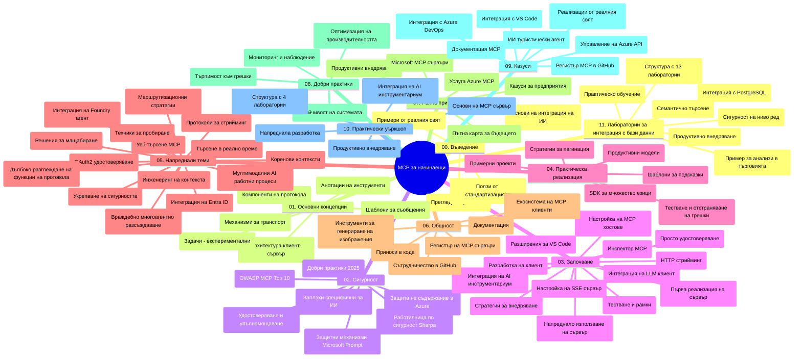

# Model Context Protocol (MCP) за начинаещи - Учебно ръководство

Това учебно ръководство предоставя преглед на структурата и съдържанието на хранилището за учебната програма "Model Context Protocol (MCP) за начинаещи". Използвайте това ръководство, за да се ориентирате ефективно в хранилището и да извлечете максимума от наличните ресурси.

## Преглед на хранилището

Model Context Protocol (MCP) е стандартизиран рамков протокол за взаимодействия между AI модели и клиентски приложения. Първоначално създаден от Anthropic, MCP сега се поддържа от по-широката общност на MCP чрез официалната организация в GitHub. Това хранилище предоставя цялостна учебна програма с практически кодови примери на C#, Java, JavaScript, Python и TypeScript, предназначени за AI разработчици, системни архитекти и софтуерни инженери.

## Визуална учебна карта

## Структура на хранилището

Хранилището е организирано в единадесет основни раздела, като всеки се фокусира върху различни аспекти на MCP:

1. **Въведение (00-Introduction/)**
   - Преглед на Model Context Protocol
   - Защо стандартизацията е важна в AI процесите
   - Практически случаи на употреба и ползи

2. **Основни понятия (01-CoreConcepts/)**
   - Клиент-сървър архитектура
   - Ключови компоненти на протокола
   - Модели на съобщения в MCP

3. **Сигурност (02-Security/)**
   - Заплахи за сигурността в системи базирани на MCP
   - Най-добри практики за сигурно внедряване
   - Стратегии за удостоверяване и авторизация
   - **Изчерпателна документация за сигурност**:
     - MCP Security Best Practices 2025
     - Ръководство за внедряване на Azure Content Safety
     - MCP Контроли и техники за сигурност
     - Бърз справочник с най-добри практики за MCP
   - **Ключови теми за сигурност**:
     - Атаки чрез инжектиране на подкани и отравяне на инструменти
     - Престъпване на сесия и проблеми с объркания представител
     - Уязвимости при пропускане на токени
     - Прекомерни разрешения и контрол на достъпа
     - Сигурност на веригата за доставки при AI компоненти
     - Интеграция на Microsoft Prompt Shields

4. **Започване (03-GettingStarted/)**
   - Настройка и конфигуриране на средата
   - Създаване на базови MCP сървъри и клиенти
   - Интеграция със съществуващи приложения
   - Включва секции за:
     - Първа имплементация на сървър
     - Клиентско разработване
     - Интеграция на LLM клиент
     - Интеграция с VS Code
     - SSE (Server-Sent Events) сървър
     - Разширено използване на сървъра
     - HTTP стрийминг
     - Интеграция на AI Toolkit
     - Тестови стратегии
     - Насоки за разгръщане

5. **Практическа имплементация (04-PracticalImplementation/)**
   - Използване на SDK-та за различни програмни езици
   - Отстраняване на грешки, тестване и техники за валидиране
   - Създаване на повторно използваеми шаблони за подкани и работни потоци
   - Примерни проекти с реализации

6. **Разширени теми (05-AdvancedTopics/)**
   - Техники за инженеринг на контекста
   - Интеграция с Foundry agent
   - Мултимодални AI работни потоци
   - Демонстрации с OAuth2 удостоверяване
   - Реално време търсене
   - Реално време стрийминг
   - Имплементация на коренови контексти
   - Стратегии за маршрутизиране
   - Техники за вземане на проби
   - Подходи за скалиране
   - Сигурност и съображения
   - Интеграция със сигурността на Entra ID
   - Интеграция на уеб търсене
   - Mногoагентско състезателно разсъждение (патерни за дебат)

7. **Приноси от общността (06-CommunityContributions/)**
   - Как да допринасяте с код и документация
   - Сътрудничество чрез GitHub
   - Подобрения и обратна връзка, задвижвани от общността
   - Използване на различни MCP клиенти (Claude Desktop, Cline, VSCode)
   - Работа с популярни MCP сървъри, включително за генериране на изображения

8. **Уроци от ранното усвояване (07-LessonsfromEarlyAdoption/)**
   - Реални внедрявания и успешни истории
   - Създаване и разгръщане на решения базирани на MCP
   - Тенденции и бъдеща карта на развитието
   - **Ръководство за Microsoft MCP сървъри**: Цялостно ръководство за 10 продукционно готови Microsoft MCP сървъра, включително:
     - Microsoft Learn Docs MCP Server
     - Azure MCP Server (над 15 специализирани конектора)
     - GitHub MCP Server
     - Azure DevOps MCP Server
     - MarkItDown MCP Server
     - SQL Server MCP Server
     - Playwright MCP Server
     - Dev Box MCP Server
     - Microsoft Foundry MCP Server
     - Microsoft 365 Agents Toolkit MCP Server

9. **Най-добри практики (08-BestPractices/)**
   - Оптимизация и настройване на производителността
   - Проектиране на отказоустойчиви MCP системи
   - Стратегии за тестване и устойчивост

10. **Казуси (09-CaseStudy/)**
    - **Седем изчерпателни казуси**, демонстриращи универсалността на MCP в различни сценарии:
    - **Azure AI Travel Agents**: Многoагентско оркестриране с Azure OpenAI и AI Search
    - **Интеграция с Azure DevOps**: Автоматизация на работни процеси с ъпдейти от YouTube данни
    - **Извличане на документи в реално време**: Python конзолен клиент с HTTP стрийминг
    - **Интерактивен генератор на учебен план**: Chainlit уеб приложение с разговорен AI
    - **Документация в редактор**: Интеграция с VS Code и работни потоци с GitHub Copilot
    - **Управление на Azure API**: Интеграция на корпоративен API със създаване на MCP сървър
    - **GitHub MCP Registry**: Развитие на екосистема и платформа за агентна интеграция
    - Примерни реализации в областта на корпоративната интеграция, производителността на разработчиците и развитие на екосистемата

11. **Практически семинар (10-StreamliningAIWorkflowsBuildingAnMCPServerWithAIToolkit/)**
    - Цялостен практически семинар комбиниращ MCP с AI Toolkit
    - Създаване на интелигентни приложения, свързващи AI модели с реални инструменти
    - Практически модули, покриващи основите, разработване на персонализиран сървър и стратегии за продукционно разгръщане
    - **Структура на лабораторията**:
      - Лаборатория 1: Основи на MCP сървъра
      - Лаборатория 2: Разширена разработка на MCP сървър
      - Лаборатория 3: Интеграция на AI Toolkit
      - Лаборатория 4: Продукционно разгръщане и скалиране
    - Подход за учене чрез лабораторни упражнения с инструкции стъпка по стъпка

12. **Лаборатории за интеграция на MCP сървър с база данни (11-MCPServerHandsOnLabs/)**
    - **Цялостен 13-стъпков учебен път** за изграждане на продукционно готови MCP сървъри с интеграция на PostgreSQL
    - **Реално приложение за търговски анализи** чрез използването на сценария Zava Retail
    - **Корпоративни модели** включващи Row Level Security (RLS), семантично търсене и мулти-тенант достъп до данни
    - **Пълна структура на лабораториите**:
      - **Лаборатории 00-03: Основи** - Въведение, архитектура, сигурност, настройка на средата
      - **Лаборатории 04-06: Изграждане на MCP сървър** - Проектиране на база данни, имплементация на MCP сървър, разработване на инструменти
      - **Лаборатории 07-09: Разширени функции** - Семантично търсене, тестване и отстраняване на грешки, интеграция с VS Code
      - **Лаборатории 10-12: Продукция и най-добри практики** - Разгръщане, мониторинг, оптимизация
    - **Обхванати технологии**: FastMCP рамка, PostgreSQL, Azure OpenAI, Azure Container Apps, Application Insights
    - **Изходна компетентност**: Продукционно готови MCP сървъри, модели за интеграция на бази данни, AI базирана аналитика, корпоративна сигурност

## Допълнителни ресурси

Хранилището включва допълнителни ресурси:

- **Папка със снимки**: Съдържа диаграми и илюстрации, използвани в учебната програма
- **Преводи**: Многоезична поддръжка с автоматизирани преводи на документация
- **Официални MCP ресурси**:
  - [MCP Documentation](https://modelcontextprotocol.io/)
  - [MCP Specification](https://spec.modelcontextprotocol.io/)
  - [MCP GitHub Repository](https://github.com/modelcontextprotocol)

## Как да използвате това хранилище

1. **Последователно учене**: Следвайте главите в ред (от 00 до 11) за структурирано обучение.
2. **Фокус върху конкретен език**: Ако ви интересува определен програмен език, разгледайте директориите със семпли за изпълнения на предпочитания език.
3. **Практическа имплементация**: Започнете с раздел "Започване", за да настроите средата си и да създадете първия MCP сървър и клиент.
4. **Разширено проучване**: След като усвоите основите, преминете към разширените теми за усъвършенстване на знанията.
5. **Общностна ангажираност**: Включете се в MCP общността чрез GitHub дискусии и Discord канали, за да се свържете с експерти и други разработчици.

## MCP клиенти и инструменти

Учебната програма покрива различни MCP клиенти и инструменти:

1. **Официални клиенти**:
   - Visual Studio Code
   - MCP в Visual Studio Code
   - Claude Desktop
   - Claude в VSCode
   - Claude API

2. **Общностни клиенти**:
   - Cline (терминален клиент)
   - Cursor (редактор на код)
   - ChatMCP
   - Windsurf

3. **Инструменти за управление на MCP**:
   - MCP CLI
   - MCP Manager
   - MCP Linker
   - MCP Router

## Популярни MCP сървъри

Хранилището представя различни MCP сървъри, включително:

1. **Официални Microsoft MCP сървъри**:
   - Microsoft Learn Docs MCP Server
   - Azure MCP Server (над 15 специализирани конектора)
   - GitHub MCP Server
   - Azure DevOps MCP Server
   - MarkItDown MCP Server
   - SQL Server MCP Server
   - Playwright MCP Server
   - Dev Box MCP Server
   - Microsoft Foundry MCP Server
   - Microsoft 365 Agents Toolkit MCP Server

2. **Официални референтни сървъри**:
   - Filesystem
   - Fetch
   - Memory
   - Sequential Thinking

3. **Генериране на изображения**:
   - Azure OpenAI DALL-E 3
   - Stable Diffusion WebUI
   - Replicate

4. **Инструменти за разработка**:
   - Git MCP
   - Terminal Control
   - Code Assistant

5. **Специализирани сървъри**:
   - Salesforce
   - Microsoft Teams
   - Jira & Confluence

## Принос към проекта

Това хранилище приветства приноси от общността. Вижте секцията Приноси от общността за насоки как да допринасяте ефективно за MCP екосистемата.

----

*Това учебно ръководство е актуализирано последно на 5 февруари 2026 г., отразявайки най-новата MCP Спецификация 2025-11-25 и предоставя преглед на хранилището към тази дата. Съдържанието на хранилището може да бъде обновявано след тази дата.*

---

<!-- CO-OP TRANSLATOR DISCLAIMER START -->
**Отказ от отговорност**:
Този документ е преведен с помощта на AI преводачески услуга [Co-op Translator](https://github.com/Azure/co-op-translator). Въпреки че се стремим към точност, моля имайте предвид, че автоматизираните преводи могат да съдържат грешки или неточности. Оригиналният документ на неговия роден език трябва да се счита за авторитетен източник. За критична информация се препоръчва професионален човешки превод. Ние не носим отговорност за каквито и да е недоразумения или неправилни тълкувания, произтичащи от използването на този превод.
<!-- CO-OP TRANSLATOR DISCLAIMER END -->