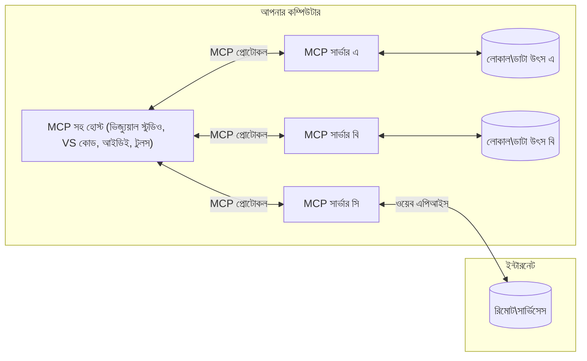

# MCP মূল ধারণাসমূহ: AI ইন্টিগ্রেশনের জন্য মডেল প্রসঙ্গ প্রোটোকল দক্ষতা অর্জন

[](https://youtu.be/earDzWGtE84)

_(এই পাঠের ভিডিও দেখতে উপরের ছবিতে ক্লিক করুন)_

[Model Context Protocol (MCP)](https://github.com/modelcontextprotocol) একটি শক্তিশালী, মানकीকৃত ফ্রেমওয়ার্ক যা বড় ভাষা মডেল (LLMs) এবং বাহ্যিক টুল, অ্যাপ্লিকেশন, এবং ডেটা উত্সের মধ্যে যোগাযোগ অপ্টিমাইজ করে।  
এই গাইডটি আপনাকে MCP-এর মূল ধারণাসমূহের মাধ্যমে পরিচালিত করবে। আপনি এর ক্লায়েন্ট-সার্ভার আর্কিটেকচার, গুরুত্বপূর্ণ উপাদান, যোগাযোগের পদ্ধতি, এবং বাস্তবায়নের সেরা অনুশীলনগুলি শিখবেন।

- **স্পষ্ট ব্যবহারকারীর সম্মতি**: সমস্ত ডেটা অ্যাক্সেস এবং অপারেশন সম্পাদনের আগে স্পষ্ট ব্যবহারকারীর অনুমোদন প্রয়োজন। ব্যবহারকারীদের স্পষ্টভাবে বুঝতে হবে কোন ডেটা অ্যাক্সেস করা হবে এবং কোন কাজগুলি সম্পাদিত হবে, অনুমতি ও অথরাইজেশনের উপর সূক্ষ্ম নিয়ন্ত্রণ সহ।  

- **ডেটা গোপনীয়তা সুরক্ষা**: ব্যবহারকারীর ডেটা কেবল স্পষ্ট সম্মতিতে প্রকাশিত হয় এবং পুরো ইন্টারঅ্যাকশন লাইফসাইকেল জুড়ে শক্তিশালী অ্যাক্সেস নিয়ন্ত্রণের মাধ্যমে সুরক্ষিত হতে হবে। বাস্তবায়নগুলোকে অননুমোদিত ডেটা প্রেরণ রোধ করতে হবে এবং কঠোর গোপনীয়তা সীমারেখা বজায় রাখতে হবে।  

- **টুল নির্বাহ নিরাপত্তা**: প্রতিটি টুল আহ্বানে স্পষ্ট ব্যবহারকারীর সম্মতি প্রয়োজন এবং টুলের কার্যকারিতা, প্যারামিটার, এবং সম্ভাব্য প্রভাব সম্পর্কে স্পষ্ট ধারণা থাকতে হবে। শক্তিশালী সুরক্ষা সীমারেখা অনিচ্ছাকৃত, অসুরক্ষিত বা দূষিত টুল কর্মক্ষমতা প্রতিরোধ করবে।  

- **ট্রান্সপোর্ট লেয়ার সিকিউরিটি**: সমস্ত যোগাযোগ চ্যানেলসমূহ উপযুক্ত এনক্রিপশন এবং প্রমাণীকরণ পদ্ধতি ব্যবহার করা উচিত। রিমোট সংযোগগুলো নিরাপদ ট্রান্সপোর্ট প্রোটোকল এবং সঠিক ক্রেডেনশিয়াল পরিচালনা বাস্তবায়ন করবে।  

#### বাস্তবায়নের নির্দেশিকা:

- **অনুমতি ব্যবস্থাপনা**: সূক্ষ্ম-স্তরের অনুমতি সিস্টেম বাস্তবায়ন করুন যা ব্যবহারকারীদের নিয়ন্ত্রণ দেয় কোন সার্ভার, টুল এবং সম্পদ অ্যাক্সেসযোগ্য হবে
- **প্রমাণীকরণ ও অথরাইজেশন**: নিরাপদ প্রমাণীকরণ পদ্ধতি (OAuth, API কী) ব্যবহার করুন সঠিক টোকেন ব্যবস্থাপনা ও মেয়াদ উত্তীর্ণসহ  
- **ইনপুট ভ্যালিডেশন**: সংজ্ঞায়িত স্কিমা অনুসারে সমস্ত প্যারামিটার এবং ডেটা ইনপুট যাচাই করুন যাতে ইনজেকশন আক্রমণ রোধ হয়
- **অডিট লগিং**: সুরক্ষা পর্যবেক্ষণ এবং কমপ্লাইয়েন্সের জন্য সমস্ত অপারেশনের বিস্তৃত লগ সংরক্ষণ করুন

## সারাংশ

এই পাঠে আমরা Model Context Protocol (MCP) ইকোসিস্টেমের মৌলিক আর্কিটেকচার এবং উপাদানগুলি অন্বেষণ করব। আপনি জানবেন ক্লায়েন্ট-সার্ভার আর্কিটেকচার, প্রধান উপাদানগুলি, এবং MCP ইন্টারঅ্যাকশনের অন্তর্নিহিত যোগাযোগ পদ্ধতিগুলি।  

## প্রধান শেখার লক্ষ্যসমূহ

এই পাঠ শেষে আপনি পারবেন:

- MCP ক্লায়েন্ট-সার্ভার আর্কিটেকচার বুঝতে।
- Hosts, Clients, এবং Servers এর ভূমিকা ও দায়িত্ব চিহ্নিত করতে।
- MCP কে একটি নমনীয় ইন্টিগ্রেশন স্তর হিসেবে গড়ে তোলার মূল বৈশিষ্ট্য বিশ্লেষণ করতে।
- MCP ইকোসিস্টেমে তথ্য প্রবাহ কীভাবে ঘটে তা শিখতে।
- .NET, Java, Python, এবং JavaScript এ কোড উদাহরণের মাধ্যমে ব্যবহারিক অন্তর্দৃষ্টি অর্জন করতে।

## MCP আর্কিটেকচার: একটি গভীর দৃষ্টিভঙ্গি

MCP ইকোসিস্টেমটি একটি ক্লায়েন্ট-সার্ভার মডেলের ওপর নির্মিত। এই মডুলার কাঠামোটি AI অ্যাপ্লিকেশনগুলোকে দক্ষতার সঙ্গে টুল, ডাটাবেস, API এবং প্রসঙ্গভিত্তিক রিসোর্সগুলোর সাথে ইন্টারঅ্যাক্ট করতে দেয়। আসুন এই আর্কিটেকচারটির প্রধান উপাদানগুলো ভেঙে দেখি।

মূলত MCP একটি ক্লায়েন্ট-সার্ভার আর্কিটেকচার অনুসরণ করে, যেখানে একটি হোস্ট অ্যাপ্লিকেশন একাধিক সার্ভারের সঙ্গে সংযুক্ত হতে পারে:


- **MCP Hosts**: VSCode, Claude Desktop, IDE বা MCP মাধ্যমে ডেটা অ্যাক্সেস করতে চাওয়া AI টুল প্রোগ্রামসমূহ
- **MCP Clients**: প্রোটোকল ক্লায়েন্ট যা সার্ভারের সঙ্গে 1:1 সংযোগ বজায় রাখে
- **MCP Servers**: হালকা ওজনের প্রোগ্রাম যা প্রতিটি নির্দিষ্ট ক্ষমতাসমূহ Model Context Protocol অনুযায়ী প্রকাশ করে
- **লোকাল ডেটা উত্স**: আপনার কম্পিউটারের ফাইল, ডাটাবেস, এবং সার্ভিস যা MCP সার্ভারগণ নিরাপদে অ্যাক্সেস করতে পারে
- **রিমোট সার্ভিসেস**: ইন্টারনেটের মাধ্যমে উপলব্ধ বাহ্যিক সিস্টেম যা MCP সার্ভার API ব্যবহার করে সংযুক্ত হতে পারে।

MCP প্রোটোকল একটি বিবর্তমান স্ট্যান্ডার্ড যা তারিখ-ভিত্তিক সংস্করণ (YYYY-MM-DD ফরম্যাট) ব্যবহার করে। বর্তমান প্রোটোকল সংস্করণ হল **2025-11-25**। আপনি [প্রোটোকল স্পেসিফিকেশন](https://modelcontextprotocol.io/specification/2025-11-25/) এ সর্বশেষ আপডেট দেখতে পারেন।

### ১. Hosts

Model Context Protocol (MCP)-এ, **Hosts** হলো AI অ্যাপ্লিকেশন যা ব্যবহারকারীরা প্রোটোকলের সঙ্গে ইন্টারঅ্যাক্ট করার জন্য প্রধান ইন্টারফেস হিসেবে কাজ করে। হোস্টগুলো একাধিক MCP সার্ভারের সঙ্গে সংযোগ তৈরি করতে প্রতিটি সার্ভারের জন্য নিবেদিত MCP ক্লায়েন্ট তৈরি করে এবং সংযোগগুলো সমন্বয় ও পরিচালনা করে। Hosts-এর উদাহরণসমূহ হল:

- **AI অ্যাপ্লিকেশন**: Claude Desktop, Visual Studio Code, Claude Code
- **ডেভেলপমেন্ট পরিবেশ**: MCP ইন্টিগ্রেশনের সঙ্গে IDE এবং কোড এডিটর  
- **কাস্টম অ্যাপ্লিকেশন**: উদ্দেশ্যমূলক AI এজেন্ট এবং টুলস

**Hosts** হলো অ্যাপ্লিকেশন যা AI মডেল ইন্টারঅ্যাকশনের সমন্বয় করে। তারা:

- **AI মডেল সমন্বয় করে**: LLMs চালায় অথবা ইন্টারঅ্যাক্ট করে প্রতিক্রিয়া তৈরি এবং AI ওয়ার্কফ্লো সমন্বয় করে
- **ক্লায়েন্ট সংযোগ পরিচালনা করে**: প্রতি MCP সার্ভার সংযোগের জন্য একটি MCP ক্লায়েন্ট তৈরি ও রক্ষণাবেক্ষণ করে
- **ইউজার ইন্টারফেস নিয়ন্ত্রণ করে**: কথোপকথনের প্রবাহ, ব্যবহারকারী ইন্টারঅ্যাকশন এবং প্রতিক্রিয়া উপস্থাপন পরিচালনা করে  
- **নিরাপত্তা প্রয়োগ করে**: অনুমতি, নিরাপত্তা সীমাবদ্ধতা, এবং প্রমাণীকরণ নিয়ন্ত্রণ করে
- **ব্যবহারকারী সম্মতি পরিচালনা করে**: ডেটা শেয়ারিং এবং টুল কার্যকর করার জন্য ব্যবহারকারীর অনুমোদন পরিচালনা করে

### ২. Clients

**Clients** হল গুরুত্বপূর্ণ উপাদান যা Hosts এবং MCP সার্ভারের মধ্যে নিবদ্ধ ১:১ সংযোগ রক্ষা করে। প্রতিটি MCP ক্লায়েন্ট Host দ্বারা একটি নির্দিষ্ট MCP সার্ভারের সঙ্গে সংযোগ স্থাপনের জন্য উদ্ভূত হয়, যা সংগঠিত ও নিরাপদ যোগাযোগ চ্যানেল নিশ্চিত করে। একাধিক ক্লায়েন্ট Hosts-কে একাধিক সার্ভারের সঙ্গে একই সময়ে সংযোগ করতে দেয়।  

**Clients** হলো হোস্ট অ্যাপ্লিকেশনের ভেতরে সংযোগকারী উপাদান। তারা:

- **প্রোটোকল যোগাযোগ**: সার্ভারকে JSON-RPC 2.0 অনুরোধ পাঠায়, প্রম্পট এবং নির্দেশনা সহ
- **ক্ষমতা আলোচনা**: প্রাথমিকীকরণের সময় সার্ভারের সঙ্গে সমর্থিত বৈশিষ্ট্য এবং প্রোটোকলের সংস্করণ নিয়ে আলোচনা করে
- **টুল নির্বাহ**: মডেল থেকে আসা টুল কার্যকর করার অনুরোধগুলো পরিচালনা করে এবং প্রতিক্রিয়া প্রক্রিয়া করে
- **রিয়েল-টাইম আপডেট**: সার্ভার থেকে নোটিফিকেশন এবং রিয়েল-টাইম আপডেট গ্রহণ করে
- **প্রতিক্রিয়া প্রক্রিয়াজাতকরণ**: সার্ভারের প্রতিক্রিয়া প্রক্রিয়া করে ব্যবহারকারীদের দেখানোর উপযোগীভাবে বিন্যাস করে

### ৩. Servers

**Servers** হল প্রোগ্রামসমূহ যা MCP ক্লায়েন্টদের প্রসঙ্গ, সরঞ্জাম, এবং ক্ষমতা প্রদান করে। তারা লোকালি (Host এর একই যন্ত্রে) অথবা রিমোটলি (বাহ্যিক প্ল্যাটফর্মে) চালানো যেতে পারে এবং ক্লায়েন্ট অনুরোধগুলো পরিচালনা করে কাঠামোবদ্ধ প্রতিক্রিয়া প্রদান করে। সার্ভারগুলো Model Context Protocol অনুসারে নির্দিষ্ট কার্যকারিতা প্রকাশ করে।

**Servers** হলো সে পরিষেবাসমূহ যা প্রসঙ্গ ও ক্ষমতা প্রদান করে। তারা:

- **বৈশিষ্ট্য নিবন্ধন করে**: উপলব্ধ প্রিমিটিভস (রিসোর্স, প্রম্পট, টুল) ক্লায়েন্টদের কাছে নিবন্ধন ও প্রকাশ করে
- **অনুরোধ প্রক্রিয়াকরণ করে**: ক্লায়েন্ট থেকে আসা টুল কল, রিসোর্স অনুরোধ, এবং প্রম্পট অনুরোধ গ্রহণ ও সম্পাদন করে
- **প্রসঙ্গ প্রদান করে**: মডেল প্রতিক্রিয়া উন্নত করার জন্য প্রাসঙ্গিক তথ্য ও ডেটা প্রদান করে
- **অবস্থা পরিচালনা করে**: সেশন অবস্থা সংরক্ষণ করে এবং প্রয়োজনে রাষ্ট্রশীল ইন্টার‌্যাকশন পরিচালনা করে
- **রিয়েল-টাইম নোটিফিকেশন পাঠায়**: সংযুক্ত ক্লায়েন্টদের ক্ষমতা পরিবর্তন ও আপডেট সম্পর্কে নোটিফিকেশন পাঠায়

সার্ভার তৈরি যেকোনো ব্যক্তি করতে পারে বিশেষায়িত কার্যকারিতার মাধ্যমে মডেলের সক্ষমতা বাড়ানোর জন্য, এবং তারা স্থানীয় ও দূরবর্তী উভয় ডিপ্লয়মেন্ট পরিস্থিতি সমর্থন করে।

### ৪. সার্ভার প্রিমিটিভস

Model Context Protocol (MCP)-এর সার্ভারগুলি তিনটি মূল **প্রিমিটিভ** সরবরাহ করে যা ক্লায়েন্ট, হোস্ট এবং ভাষা মডেলের মধ্যে সমৃদ্ধ ইন্টারঅ্যাকশনের মৌলিক ভিত্তি নির্ধারণ করে। এই প্রিমিটিভসগুলি প্রোটোকলের মাধ্যমে উপলব্ধ প্রসঙ্গভিত্তিক তথ্য এবং ক্রিয়াকলাপের ধরণ নির্ধারণ করে।  

MCP সার্ভারগুলি নিম্নলিখিত তিনটি মূল প্রিমিটিভসের যেকোনো সংমিশ্রণ প্রকাশ করতে পারে:

#### রিসোর্সেস

**রিসোর্সেস** হলো ডেটা উত্সসমূহ যা AI অ্যাপ্লিকেশনকে প্রসঙ্গতাত্ত্বিক তথ্য প্রদান করে। তারা স্থির বা গতিশীল বিষয়বস্তুর প্রতিনিধিত্ব করে যা মডেলের বোঝাপড়া ও সিদ্ধান্ত গ্রহণ উন্নত করে:

- **প্রসঙ্গতাত্ত্বিক ডেটা**: AI মডেল ব্যবহারের জন্য কাঠামোবদ্ধ তথ্য ও প্রসঙ্গ
- **জ্ঞানভান্ডার**: ডকুমেন্ট সংগ্রহশালা, নিবন্ধ, ম্যানুয়াল, ও গবেষণা পত্র
- **স্থানীয় ডেটা উত্স**: ফাইল, ডাটাবেস, এবং স্থানীয় সিস্টেম তথ্য  
- **বাহ্যিক ডেটা**: API প্রতিক্রিয়া, ওয়েব সার্ভিস, ও দূরবর্তী সিস্টেম ডেটা
- **গতিশীল বিষয়বস্তু**: বাস্তব সময়ের ডেটা যা বাহ্যিক শর্ত অনুসারে হালনাগাদ হয়

রিসোর্সসমূহ URI দ্বারা সনাক্ত এবং `resources/list` মাধ্যমে আবিষ্কৃত ও `resources/read` পদ্ধতি দিয়ে পুনরুদ্ধার করা যায়:

```text
file://documents/project-spec.md
database://production/users/schema
api://weather/current
```

#### প্রম্পট

**প্রম্পট** হলো পুনরায় ব্যবহারযোগ্য টেমপ্লেট যা ভাষা মডেলের সাথে ইন্টারঅ্যাকশন কাঠামোবদ্ধ করতে সাহায্য করে। তারা মানক ইন্টারঅ্যাকশন প্যাটার্ন এবং টেমপ্লেটকৃত ওয়ার্কফ্লো প্রদান করে:

- **টেমপ্লেটভিত্তিক ইন্টারঅ্যাকশন**: পূর্ব-গঠিত বার্তা ও কথোপকথনের সূচনা
- **ওয়ার্কফ্লো টেমপ্লেট**: নিয়মিত কার্য ও ইন্টারঅ্যাকশনের জন্য মানক ক্রম
- **কিছু নমুনা উদাহরণ**: মডেল নির্দেশনার জন্য উদাহরণভিত্তিক টেমপ্লেট
- **সিস্টেম প্রম্পট**: মডেল আচরণ ও প্রসঙ্গ নির্ধারণকারী মৌলিক প্রম্পটসমূহ
- **গতিশীল টেমপ্লেট**: নির্দিষ্ট প্রসঙ্গ অনুযায়ী অভিযোজিত প্যারামিটারযুক্ত প্রম্পট

প্রম্পটসমূহে ভেরিয়েবল প্রতিস্থাপন সমর্থিত এবং `prompts/list` দ্বারা আবিষ্কৃত ও `prompts/get` দ্বারা পুনরুদ্ধারযোগ্য:

```markdown
Generate a {{task_type}} for {{product}} targeting {{audience}} with the following requirements: {{requirements}}
```

#### টুলস

**টুলস** হলো নির্বাহযোগ্য ফাংশন যা AI মডেল নির্দিষ্ট কাজ সম্পন্ন করতে কল করতে পারে। তারা MCP ইকোসিস্টেমের "ক্রিয়া বিশেষণ", যা মডেলকে বাহ্যিক সিস্টেমের সাথে ইন্টারঅ্যাক্ট করার ক্ষমতা দেয়:

- **নির্বাহযোগ্য ফাংশন**: নির্দিষ্ট প্যারামিটার সহ মডেল কল করতে পারে এমন বিচ্ছিন্ন অপারেশন
- **বাহ্যিক সিস্টেম ইন্টিগ্রেশন**: API কল, ডাটাবেস অনুসন্ধান, ফাইল অপারেশন, গণনা
- **অদ্বিতীয় পরিচিতি**: প্রতিটি টুলের একটি স্বতন্ত্র নাম, বর্ণনা, এবং প্যারামিটার স্কিমা থাকে
- **কাঠামোবদ্ধ ইনপুট/আউটপুট**: টুল সঠিকভাবে যাচাইকৃত প্যারামিটার গ্রহণ করে এবং কাঠামোবদ্ধ, টাইপকৃত প্রতিক্রিয়া প্রদান করে
- **কার্য ক্ষমতা**: মডেলকে বাস্তব জগতের কাজ সম্পাদন এবং লাইভ ডেটা পুনরুদ্ধার করার সক্ষমতা দেয়

টুলসমূহ JSON Schema দ্বারা প্যারামিটার যাচাইয়ের জন্য সংজ্ঞায়িত হয় এবং `tools/list` দ্বারা আবিষ্কৃত ও `tools/call` এর মাধ্যমে কার্যকর করা হয়। টুলে অতিরিক্ত মেটাডেটা হিসেবে **আইকন** দেওয়া যেতে পারে UI উপস্থাপনা উন্নত করার জন্য।

**টুল এনোটেশনস**: টুলসমূহ আচরণগত এনোটেশন (যেমন `readOnlyHint`, `destructiveHint`) সমর্থন করে যা নির্দিষ্ট করে টুলটি শুধুমাত্র পাঠযোগ্য নাকি ধ্বংসাত্বক, যা ক্লায়েন্টদের সঠিক সিদ্ধান্ত নিতে সাহায্য করে টুল কার্যকর করার বিষয়ে।

একটি টুল সংজ্ঞার উদাহরণ:

```typescript
server.tool(
  "search_products", 
  {
    query: z.string().describe("Search query for products"),
    category: z.string().optional().describe("Product category filter"),
    max_results: z.number().default(10).describe("Maximum results to return")
  }, 
  async (params) => {
    // অনুসন্ধান চালিয়ে কাঠামোবদ্ধ ফলাফল ফেরত দিন
    return await productService.search(params);
  }
);
```

## ক্লায়েন্ট প্রিমিটিভস

Model Context Protocol (MCP)-এ, **ক্লায়েন্ট** ঐগুলি প্রিমিটিভ প্রকাশ করতে পারে যা সার্ভারদের হোস্ট অ্যাপ্লিকেশন থেকে অতিরিক্ত ক্ষমতা অনুরোধের সুযোগ দেয়। এই ক্লায়েন্ট-পার্শ্বীয় প্রিমিটিভস সার্ভারদের ধনী, আরও ইন্টার‌্যাক্টিভ বাস্তবায়ন সক্ষম করে যা AI মডেলের ক্ষমতা এবং ব্যবহারকারী ইন্টারঅ্যাকশন অ্যাক্সেস করতে পারে।

### স্যাম্পলিং (Sampling)

**স্যাম্পলিং** সার্ভারদের ক্লায়েন্টের AI অ্যাপ্লিকেশন থেকে ভাষা মডেল কমপ্লিশন অনুরোধ করার সুযোগ দেয়। এই প্রিমিটিভ সার্ভারকে তাদের নিজস্ব মডেল নির্ভরতা ছাড়াই LLM সক্ষমতা অ্যাক্সেস করতে দেয়:

- **মডেল-স্বাধীন অ্যাক্সেস**: সার্ভারগুলো কমপ্লিশন চাইতে পারে LLM SDK বা মডেল ব্যবস্থাপনা ছাড়া
- **সার্ভার-প্ররোচিত AI**: সার্ভারগুলোকে ক্লায়েন্টের AI মডেল ব্যবহার করে স্বায়ত্তশাসিতভাবে কনটেন্ট তৈরি করার সুযোগ দেয়
- **পুনরাবৃত্ত LLM ইন্টারঅ্যাকশনস**: জটিল পরিস্থিতিতে সাহায্যের জন্য সার্ভারকে AI এর প্রবেশাধিকার দেয়
- **গতিশীল বিষয়বস্তু সৃষ্টি**: হোস্টের মডেল ব্যবহার করে প্রসঙ্গভিত্তিক প্রতিক্রিয়া তৈরি করতে দেয়
- **টুল কলিং সমর্থন**: সার্ভার `tools` এবং `toolChoice` প্যারামিটার অন্তর্ভুক্ত করতে পারে যাতে ক্লায়েন্টের মডেল স্যাম্পলিংয়ের সময় টুল কল করতে পারে

স্যাম্পলিং `sampling/complete` পদ্ধতির মাধ্যমে আরম্ভ হয় যেখানে সার্ভারগুলি ক্লায়েন্টকে কমপ্লিশন অনুরোধ পাঠায়।

### রুটস (Roots)

**রুটস** সার্ভারকে ক্লায়েন্টের ফাইল সিস্টেম সীমাবদ্ধতা প্রকাশ করার জন্য মানক পদ্ধতি প্রদান করে, যা সার্ভারকে বুঝতে সাহায্য করে কোন ডিরেক্টরি ও ফাইলগুলোতে তাদের অ্যাক্সেস আছে:

- **ফাইল সিস্টেম সীমাবদ্ধতা**: সার্ভার কোন ফাইল সিস্টেম সীমানায় কাজ করতে পারে তা নির্ধারণ করে
- **অ্যাক্সেস নিয়ন্ত্রণ**: সার্ভারকে কোন ডিরেক্টরি ও ফাইল অ্যাক্সেসযোগ্য তা বুঝতে সাহায্য করে
- **গতিশীল আপডেট**: রুট তালিকা পরিবর্তিত হলে ক্লায়েন্ট সার্ভারকে নোটিফাই করে
- **URI-ভিত্তিক সনাক্তকরণ**: রুট `file://` URI ব্যবহার করে অ্যাক্সেসযোগ্য ডিরেক্টরি ও ফাইলগুলি চিহ্নিত করে

রুট `roots/list` পদ্ধতি দ্বারা আবিষ্কৃত হয়, এবং পরিবর্তন ঘটলে ক্লায়েন্ট `notifications/roots/list_changed` পাঠায়।

### ইলিসিটেশন (Elicitation)  

**ইলিসিটেশন** সার্ভারকে ক্লায়েন্ট ইন্টারফেসের মাধ্যমেই ব্যবহারকারীর কাছ থেকে অতিরিক্ত তথ্য বা নিশ্চিতকরণের অনুরোধ করার সুযোগ দেয়:

- **ব্যবহারকারীর ইনপুট অনুরোধ**: টুল কার্যকর করার সময় প্রয়োজনীয় অতিরিক্ত তথ্য চাইতে পারে
- **নিশ্চিতকরণ ডায়ালগ**: সংবেদনশীল অথবা গুরুত্বপূর্ণ ক্রিয়ার জন্য ব্যবহারকারীর অনুমোদন চাইতে পারে
- **ইন্টার‌্যাকটিভ ওয়ার্কফ্লো**: সার্ভারদের ধাপে ধাপে ব্যবহারকারী ইন্টার‌্যাকশন তৈরি করার সুযোগ দেয়
- **গতিশীল প্যারামিটার সংগ্রহ**: টুল কার্যকর করার সময় অনুপস্থিত বা ঐচ্ছিক প্যারামিটার সংগ্রহ করে

ইলিসিটেশন `elicitation/request` পদ্ধতি ব্যবহার করে ক্লায়েন্টের ইন্টার‌্যাকশন হস্তান্তর করার জন্য অনুরোধ করা হয়।

**URL মোড ইলিসিটেশন**: সার্ভার URL-ভিত্তিক ব্যবহারকারী ইন্টারঅ্যাকশনও অনুরোধ করতে পারে, যা ব্যবহারকারীকে বাহ্যিক ওয়েব পৃষ্ঠায় প্রমাণীকরণ, নিশ্চিতকরণ বা ডেটা প্রবেশের জন্য নির্দেশ দেয়।

### লগিং (Logging)

**লগিং** সার্ভারদের ক্লায়েন্টকে সংগঠিত লগ বার্তা পাঠানোর সুযোগ দেয় ডিবাগিং, পর্যবেক্ষণ, এবং অপারেশনাল প্রেক্ষাপটে দৃশ্যমানতার জন্য:

- **ডিবাগিং সমর্থন**: ট্রাবলশুটিংয়ের জন্য বিস্তারিত নির্বাহ লগ প্রদান করে
- **অপারেশনাল মনিটরিং**: ক্লায়েন্টকে স্ট্যাটাস আপডেট এবং কার্যক্ষমতা পরিমাপ পাঠায়
- **ত্রুটি রিপোর্টিং**: বিস্তারিত ত্রুটি প্রসঙ্গ এবং ডায়াগনস্টিক তথ্য প্রদান করে
- **অডিট ট্রেইলস**: সার্ভার অপারেশন ও সিদ্ধান্তের বিস্তৃত লগ তৈরি করে

লগিং বার্তাসমূহ ক্লায়েন্টকে পাঠানো হয় সার্ভার অপারেশনগুলোতে স্বচ্ছতা এবং ডিবাগিং সহজ করার জন্য।

## MCP তে তথ্য প্রবাহ

Model Context Protocol (MCP) হোস্ট, ক্লায়েন্ট, সার্ভার, এবং মডেলের মধ্যে তথ্যের কাঠামোবদ্ধ প্রবাহ নির্ধারণ করে। এই প্রবাহ বোঝা ব্যবহারকারীর অনুরোধ কীভাবে প্রক্রিয়াকৃত হয় এবং বাহ্যিক টুল এবং ডেটা মডেল প্রতিক্রিয়ায় কীভাবে সংযুক্ত হয় তা স্পষ্ট করতে সাহায্য করে।
- **হোস্ট সংযোগ শুরু করে**  
  হোস্ট অ্যাপ্লিকেশন (যেমন একটি আইডিই বা চ্যাট ইন্টারফেস) সাধারণত STDIO, WebSocket, বা অন্য কোনো সমর্থিত পরিবহনের মাধ্যমে একটি MCP সার্ভারের সাথে সংযোগ স্থাপন করে।

- **ক্ষমতা চুক্তি**  
  ক্লায়েন্ট (হোস্টে এমবেড করা) এবং সার্ভার তাদের সমর্থিত বৈশিষ্ট্য, টুল, সম্পদ এবং প্রোটোকল সংস্করণ সম্পর্কিত তথ্য আদান-প্রদান করে। এটি নিশ্চিত করে যে উভয় পক্ষ সেশনের জন্য উপলব্ধ ক্ষমতাগুলি বুঝতে পারছে।

- **ব্যবহারকারীর অনুরোধ**  
  ব্যবহারকারী হোস্টের সাথে ইন্টারঅ্যাক্ট করে (যেমন প্রম্পট বা কমান্ড প্রদান করে)। হোস্ট এই ইনপুট সংগ্রহ করে ক্লায়েন্টকে প্রক্রিয়াকরণের জন্য পাঠায়।

- **সম্পদ বা টুল ব্যবহার**  
  - ক্লায়েন্ট মডেলের বোঝাপড়াকে সমৃদ্ধ করার জন্য সার্ভার থেকে অতিরিক্ত প্রসঙ্গ বা সম্পদ (যেমন ফাইল, ডেটাবেস এন্ট্রি, অথবা জ্ঞানভিত্তিক নিবন্ধ) অনুরোধ করতে পারে।  
  - যদি মডেল নির্ধারণ করে যে একটি টুল প্রয়োজন (যেমন তথ্য আনার জন্য, গণনা করার জন্য, অথবা API কল করার জন্য), ক্লায়েন্ট টুলের নাম এবং পরামিতি উল্লেখ করে সার্ভারকে টুল আহ্বানের অনুরোধ পাঠায়।

- **সার্ভারের ক্রিয়াকলাপ**  
  সার্ভার সম্পদ বা টুল অনুরোধ গ্রহণ করে, প্রয়োজনীয় কার্যক্রম (যেমন একটি ফাংশন চালানো, ডেটাবেস অনুসন্ধান, বা একটি ফাইল পুনরুদ্ধার) সম্পাদন করে এবং ফলাফলগুলি গঠনমূলক ফরম্যাটে ক্লায়েন্টকে ফেরত দেয়।

- **প্রতিক্রিয়া ও প্রস্তুতি**  
  ক্লায়েন্ট সার্ভারের প্রতিক্রিয়া (সম্পদ তথ্য, টুল আউটপুট ইত্যাদি) মডেলের চলমান ইন্টারঅ্যাকশনে সংযুক্ত করে। মডেল এই তথ্য ব্যবহার করে একটি ব্যাপক এবং প্রসঙ্গগতভাবে প্রাসঙ্গিক উত্তর তৈরি করে।

- **ফলাফল প্রদর্শন**  
  হোস্ট ক্লায়েন্ট থেকে চূড়ান্ত আউটপুট গ্রহণ করে এবং ব্যবহারকারীর সামনে উপস্থাপন করে, যা সাধারণত মডেল দ্বারা তৈরি পাঠ এবং টুল কার্যকরকরণ বা সম্পদ অনুসন্ধানের ফলাফল উভয়ই অন্তর্ভুক্ত করে।

এই প্রবাহ MCP-কে মডেলগুলোকে বহিরাগত টুল এবং ডেটা উৎসের সঙ্গে নির্বিঘ্নে সংযুক্ত করে উন্নত, ইন্টারেক্টিভ, এবং প্রসঙ্গ-সচেতন AI অ্যাপ্লিকেশন সমর্থন করতে সক্ষম করে।

## প্রোটোকল আর্কিটেকচার ও স্তরসমূহ

MCP দুটি পৃথক আর্কিটেকচারাল স্তর নিয়ে গঠিত যা একত্রে একটি সম্পূর্ণ যোগাযোগ কাঠামো প্রদান করে:

### ডেটা স্তর

**ডেটা স্তর** MCP প্রোটোকলটির মূল বাস্তবায়ন করে **JSON-RPC 2.0** ব্যবহার করে। এই স্তরটি বার্তা কাঠামো, অর্থবোধ এবং ইন্টারঅ্যাকশন প্যাটার্ন নির্ধারণ করে:

#### মূল উপাদানসমূহ:

- **JSON-RPC 2.0 প্রোটোকল**: সকল যোগাযোগে মানক JSON-RPC 2.0 বার্তা ফরম্যাট ব্যবহৃত হয় পদ্ধতি আহ্বান, প্রতিক্রিয়া ও বিজ্ঞপ্তির জন্য  
- **জীবনচক্র পরিচালনা**: ক্লায়েন্ট ও সার্ভারের মধ্যে সংযোগ সূচনা, সক্ষমতা আলোচনার এবং সেশন শেষ করার ব্যবস্থা  
- **সার্ভার প্রিমিটিভস**: সার্ভারগুলোকে টুল, সম্পদ এবং প্রম্পটের মাধ্যমে মূল কার্যকারিতা প্রদান করার অনুমতি দেয়  
- **ক্লায়েন্ট প্রিমিটিভস**: সার্ভারকে LLM থেকে স্যাম্পলিং অনুরোধ করা, ব্যবহারকারীর ইনপুট আহবান এবং লগ মেসেজ পাঠানোর সুযোগ দেয়  
- **রিয়েল-টাইম বিজ্ঞপ্তি**: পোলিং ছাড়াই গতিশীল আপডেটের জন্য অ্যাসিঙ্ক্রোনাস বিজ্ঞপ্তি সমর্থন করে  

#### প্রধান বৈশিষ্ট্য:

- **প্রোটোকল সংস্করণ আলোচনাসহ**: সামঞ্জস্য নিশ্চিত করার জন্য তারিখ-ভিত্তিক সংস্করণ ব্যবহার করে (YYYY-MM-DD)  
- **ক্ষমতা আবিষ্কার**: সূচনালগ্নে ক্লায়েন্ট ও সার্ভার সমর্থিত বৈশিষ্ট্য তথ্য আদান-প্রদান করে  
- **স্টেটফুল সেশন**: বহু ইন্টারঅ্যাকশনের মধ্যে সংযোগ অবস্থা বজায় রাখে প্রসঙ্গগত ধারাবাহিকতার জন্য  

### পরিবহন স্তর

**পরিবহন স্তর** MCP অংশগ্রহণকারীদের মধ্যে যোগাযোগ চ্যানেল, বার্তা ফ্রেমিং, এবং প্রমাণীকরণ পরিচালনা করে:

#### সমর্থিত পরিবহন ব্যবস্থাসমূহ:

1. **STDIO পরিবহন**:  
   - সরাসরি প্রক্রিয়া যোগাযোগের জন্য স্ট্যান্ডার্ড ইনপুট/আউটপুট স্ট্রিম ব্যবহার করে  
   - একই মেশিনে স্থানীয় প্রক্রিয়ার জন্য সর্বোত্তম, কোন নেটওয়ার্ক ওভারহেড ছাড়াই  
   - সাধারণত স্থানীয় MCP সার্ভার বাস্তবায়নের জন্য ব্যবহৃত  

2. **স্ট্রিমযোগ্য HTTP পরিবহন**:  
   - ক্লায়েন্ট থেকে সার্ভারে বার্তা পাঠানোর জন্য HTTP POST ব্যবহার করে  
   - সার্ভার থেকে ক্লায়েন্টে স্ট্রিমিং‌য়ের জন্য ঐচ্ছিক Server-Sent Events (SSE) সমর্থন করে  
   - নেটওয়ার্ক জুড়ে দূরবর্তী সার্ভার যোগাযোগ সক্ষম করে  
   - স্ট্যান্ডার্ড HTTP প্রমাণীকরণ সমর্থন করে (বিয়ারার টোকেন, API কী, কাস্টম হেডার)  
   - MCP নিরাপদ টোকেন-ভিত্তিক প্রমাণীকরণের জন্য OAuth ব্যবহারের পরামর্শ দেয়  

#### পরিবহন বিমূর্ততা:

পরিবহন স্তর ডেটা স্তরের থেকে যোগাযোগের বিবরণ বিমূর্ত করে, একই JSON-RPC 2.0 বার্তা ফরম্যাট সমস্ত পরিবহন প্রক্রিয়ায় ব্যবহার করতে সক্ষম করে। এই বিমূর্ততা অ্যাপ্লিকেশনগুলোকে স্থানীয় ও দূরবর্তী সার্ভারের মধ্যে নির্বিঘ্নে স্যুইচ করার সুযোগ দেয়।

### নিরাপত্তা বিবেচনা

MCP বাস্তবায়নগুলো অবশ্যই বেশ কয়েকটি গুরুত্বপূর্ণ নিরাপত্তা নীতিমালা অনুসরণ করতে হবে, যা সমস্ত প্রোটোকল কর্মকাণ্ডের মধ্যে নিরাপদ, বিশ্বাসযোগ্য, এবং সুরক্ষিত ইন্টারঅ্যাকশন নিশ্চিত করে:

- **ব্যবহারকারী সম্মতি ও নিয়ন্ত্রণ**: যেকোনো ডেটা অ্যাক্সেস বা অপারেশন করার আগে স্পষ্ট ব্যবহারকারী সম্মতি আবশ্যক। ব্যবহারকারীরা স্পষ্টভাবে বুঝতে পারবে কোন ডেটা শেয়ার হচ্ছে এবং কোন ক্রিয়াগুলো অনুমোদিত, এবং ব্যবহারকারী ইন্টারফেসগুলো সেগুলো পর্যালোচনা ও অনুমোদনের জন্য সহজবোধগম্য হবে।  

- **ডেটা গোপনীয়তা**: ব্যবহারকারীর ডেটা শুধুমাত্র স্পষ্ট সম্মতির ভিত্তিতে প্রকাশ করা হবে এবং উপযুক্ত প্রবেশাধিকার নিয়ন্ত্রণ দ্বারা সুরক্ষিত থাকবে। MCP বাস্তবায়ন অবাঞ্ছিত ডেটা প্রেরণের বিরুদ্ধে সুরক্ষা দিবে এবং সমস্ত ইন্টারঅ্যাকশনের সময় গোপনীয়তা বজায় রাখবে।  

- **টুল সুরক্ষা**: যেকোনো টুল আহ্বানের আগে স্পষ্ট ব্যবহারকারী সম্মতি প্রয়োজন। ব্যবহারকারীরা প্রতিটি টুলের কার্যকারিতা সম্পর্কে সুস্পষ্ট ধারণা পাবে, এবং নিরাপত্তার কঠোর সীমাবদ্ধতা আরোপিত থাকবে যাতে অনিচ্ছাকৃত বা অনিরাপদ টুল কার্যকরকরণ প্রতিরোধ করা যায়।  

এই নিরাপত্তা নীতিমালা অনুসরণ করে MCP ব্যবহারকারী বিশ্বাস, গোপনীয়তা, এবং সুরক্ষা বজায় রাখে এবং শক্তিশালী AI সংযুক্তি সক্ষম করে।

## কোড উদাহরণ: মূল উপাদানসমূহ

নিম্নে কয়েকটি জনপ্রিয় প্রোগ্রামিং ভাষায় MCP সার্ভার উপাদান এবং টুলগুলো কীভাবে বাস্তবায়িত হয় তার উদাহরণ দেয়া হয়েছে।

### .NET উদাহরণ: টুলসহ একটি সহজ MCP সার্ভার তৈরি

এখানে একটি ব্যবহারিক .NET কোড উদাহরণ আছে, যা কাস্টম টুল সহ একটি সহজ MCP সার্ভার বাস্তবায়ন প্রদর্শন করে। এই উদাহরণ টুল নির্ধারণ ও নিবন্ধন, অনুরোধ পরিচালনা, এবং Model Context Protocol ব্যবহার করে সার্ভারের সংযোগ দেখায়।

```csharp
using System;
using System.Threading.Tasks;
using ModelContextProtocol.Server;
using ModelContextProtocol.Server.Transport;
using ModelContextProtocol.Server.Tools;

public class WeatherServer
{
    public static async Task Main(string[] args)
    {
        // Create an MCP server
        var server = new McpServer(
            name: "Weather MCP Server",
            version: "1.0.0"
        );
        
        // Register our custom weather tool
        server.AddTool<string, WeatherData>("weatherTool", 
            description: "Gets current weather for a location",
            execute: async (location) => {
                // Call weather API (simplified)
                var weatherData = await GetWeatherDataAsync(location);
                return weatherData;
            });
        
        // Connect the server using stdio transport
        var transport = new StdioServerTransport();
        await server.ConnectAsync(transport);
        
        Console.WriteLine("Weather MCP Server started");
        
        // Keep the server running until process is terminated
        await Task.Delay(-1);
    }
    
    private static async Task<WeatherData> GetWeatherDataAsync(string location)
    {
        // This would normally call a weather API
        // Simplified for demonstration
        await Task.Delay(100); // Simulate API call
        return new WeatherData { 
            Temperature = 72.5,
            Conditions = "Sunny",
            Location = location
        };
    }
}

public class WeatherData
{
    public double Temperature { get; set; }
    public string Conditions { get; set; }
    public string Location { get; set; }
}
```

### Java উদাহরণ: MCP সার্ভার উপাদানসমূহ

এই উদাহরণটি .NET উদাহরণের মতো MCP সার্ভার এবং টুল নিবন্ধন দেখায়, তবে এটি Java-তে বাস্তবায়িত।

```java
import io.modelcontextprotocol.server.McpServer;
import io.modelcontextprotocol.server.McpToolDefinition;
import io.modelcontextprotocol.server.transport.StdioServerTransport;
import io.modelcontextprotocol.server.tool.ToolExecutionContext;
import io.modelcontextprotocol.server.tool.ToolResponse;

public class WeatherMcpServer {
    public static void main(String[] args) throws Exception {
        // একটি MCP সার্ভার তৈরি করুন
        McpServer server = McpServer.builder()
            .name("Weather MCP Server")
            .version("1.0.0")
            .build();
            
        // একটি আবহাওয়া টুল নিবন্ধন করুন
        server.registerTool(McpToolDefinition.builder("weatherTool")
            .description("Gets current weather for a location")
            .parameter("location", String.class)
            .execute((ToolExecutionContext ctx) -> {
                String location = ctx.getParameter("location", String.class);
                
                // আবহাওয়ার ডেটা পান (সরলীকৃত)
                WeatherData data = getWeatherData(location);
                
                // ফরম্যাট করা উত্তর ফেরত দিন
                return ToolResponse.content(
                    String.format("Temperature: %.1f°F, Conditions: %s, Location: %s", 
                    data.getTemperature(), 
                    data.getConditions(), 
                    data.getLocation())
                );
            })
            .build());
        
        // stdio ট্রান্সপোর্ট ব্যবহার করে সার্ভারের সাথে সংযোগ করুন
        try (StdioServerTransport transport = new StdioServerTransport()) {
            server.connect(transport);
            System.out.println("Weather MCP Server started");
            // প্রক্রিয়া বন্ধ না হওয়া পর্যন্ত সার্ভার চালু রাখুন
            Thread.currentThread().join();
        }
    }
    
    private static WeatherData getWeatherData(String location) {
        // বাস্তবায়নে একটি আবহাওয়া API কল করা হবে
        // উদাহরণের জন্য সরলীকৃত
        return new WeatherData(72.5, "Sunny", location);
    }
}

class WeatherData {
    private double temperature;
    private String conditions;
    private String location;
    
    public WeatherData(double temperature, String conditions, String location) {
        this.temperature = temperature;
        this.conditions = conditions;
        this.location = location;
    }
    
    public double getTemperature() {
        return temperature;
    }
    
    public String getConditions() {
        return conditions;
    }
    
    public String getLocation() {
        return location;
    }
}
```

### Python উদাহরণ: MCP সার্ভার তৈরি

এই উদাহরণটি fastmcp ব্যবহার করে, তাই দয়া করে প্রথমে এটি ইনস্টল করুন:

```python
pip install fastmcp
```
কোড নমুনা:

```python
#!/usr/bin/env python3
import asyncio
from fastmcp import FastMCP
from fastmcp.transports.stdio import serve_stdio

# একটি FastMCP সার্ভার তৈরি করুন
mcp = FastMCP(
    name="Weather MCP Server",
    version="1.0.0"
)

@mcp.tool()
def get_weather(location: str) -> dict:
    """Gets current weather for a location."""
    return {
        "temperature": 72.5,
        "conditions": "Sunny",
        "location": location
    }

# একটি ক্লাস ব্যবহার করে বিকল্প পদ্ধতি
class WeatherTools:
    @mcp.tool()
    def forecast(self, location: str, days: int = 1) -> dict:
        """Gets weather forecast for a location for the specified number of days."""
        return {
            "location": location,
            "forecast": [
                {"day": i+1, "temperature": 70 + i, "conditions": "Partly Cloudy"}
                for i in range(days)
            ]
        }

# ক্লাস টুলগুলি নিবন্ধন করুন
weather_tools = WeatherTools()

# সার্ভার শুরু করুন
if __name__ == "__main__":
    asyncio.run(serve_stdio(mcp))
```

### JavaScript উদাহরণ: MCP সার্ভার তৈরি

এই উদাহরণটি MCP সার্ভার তৈরি JavaScript-এ দেখায় এবং দুইটি আবহাওয়া সম্পর্কিত টুল নিবন্ধনের পদ্ধতি।

```javascript
// অফিসিয়াল মডেল কনটেক্সট প্রোটোকল SDK ব্যবহার করা হচ্ছে
import { McpServer } from "@modelcontextprotocol/sdk/server/mcp.js";
import { StdioServerTransport } from "@modelcontextprotocol/sdk/server/stdio.js";
import { z } from "zod"; // প্যারামিটার যাচাইয়ের জন্য

// একটি MCP সার্ভার তৈরি করুন
const server = new McpServer({
  name: "Weather MCP Server",
  version: "1.0.0"
});

// একটি আবহাওয়া টুল সংজ্ঞায়িত করুন
server.tool(
  "weatherTool",
  {
    location: z.string().describe("The location to get weather for")
  },
  async ({ location }) => {
    // এটি সাধারণত একটি আবহাওয়া API কল করবে
    // প্রদর্শনের জন্য সরলীকৃত
    const weatherData = await getWeatherData(location);
    
    return {
      content: [
        { 
          type: "text", 
          text: `Temperature: ${weatherData.temperature}°F, Conditions: ${weatherData.conditions}, Location: ${weatherData.location}` 
        }
      ]
    };
  }
);

// একটি পূর্বাভাস টুল সংজ্ঞায়িত করুন
server.tool(
  "forecastTool",
  {
    location: z.string(),
    days: z.number().default(3).describe("Number of days for forecast")
  },
  async ({ location, days }) => {
    // এটি সাধারণত একটি আবহাওয়া API কল করবে
    // প্রদর্শনের জন্য সরলীকৃত
    const forecast = await getForecastData(location, days);
    
    return {
      content: [
        { 
          type: "text", 
          text: `${days}-day forecast for ${location}: ${JSON.stringify(forecast)}` 
        }
      ]
    };
  }
);

// সহায়ক ফাংশনসমূহ
async function getWeatherData(location) {
  // API কল সিমুলেট করুন
  return {
    temperature: 72.5,
    conditions: "Sunny",
    location: location
  };
}

async function getForecastData(location, days) {
  // API কল সিমুলেট করুন
  return Array.from({ length: days }, (_, i) => ({
    day: i + 1,
    temperature: 70 + Math.floor(Math.random() * 10),
    conditions: i % 2 === 0 ? "Sunny" : "Partly Cloudy"
  }));
}

// স্টিডিও ট্রান্সপোর্ট ব্যবহার করে সার্ভারের সাথে সংযোগ করুন
const transport = new StdioServerTransport();
server.connect(transport).catch(console.error);

console.log("Weather MCP Server started");
```

এই JavaScript উদাহরণ Model Context Protocol SDK ব্যবহার করে MCP সার্ভার তৈরির প্রক্রিয়া বুঝায়। এটি `weatherTool` এবং `forecastTool` নামে দুটি টুল নিবন্ধন এবং MCP ক্লায়েন্টদের জন্য `StdioServerTransport` মাধ্যমে উপলব্ধ করানোর পদ্ধতি দেখায়।

## নিরাপত্তা এবং অনুমোদন

MCP প্রোটোকল জুড়ে নিরাপত্তা এবং অনুমোদন ব্যবস্থাপনার জন্য বেশ কিছু অন্তর্নির্মিত কনসেপ্ট এবং ব্যবস্থাপনা রয়েছে:

1. **টুল পারমিশন নিয়ন্ত্রণ**:  
   ক্লায়েন্ট মডেলকে একটি সেশনের সময় কোন টুল ব্যবহার করার অনুমতি পাবে তা নির্ধারণ করতে পারে। এটি নিশ্চিত করে যে শুধুমাত্র স্পষ্টভাবে অনুমোদিত টুলগুলো অ্যাক্সেসযোগ্য, যা অনাকাঙ্ক্ষিত বা অনিরাপদ কার্যক্রমের ঝুঁকি কমায়। পারমিশন ব্যবহারকারীর পছন্দ, সংস্থার নীতি, বা ইন্টারঅ্যাকশনের প্রসঙ্গ অনুযায়ী গতিশীলভাবে কনফিগার করা যায়।

2. **প্রমাণীকরণ**:  
   সার্ভার টুল, সম্পদ বা সংবেদনশীল অপারেশনের অ্যাক্সেসের আগে প্রমাণীকরণ চাইতে পারে। এর মধ্যে থাকতে পারে API কী, OAuth টোকেন, বা অন্যান্য প্রমাণীকরণ পদ্ধতি। সঠিক প্রমাণীকরণ নিশ্চিত করে শুধুমাত্র বিশ্বাসযোগ্য ক্লায়েন্ট ও ব্যবহারকারী সার্ভার-সাইড ক্ষমতাসমূহ আহ্বান করতে পারে।

3. **ভ্যালিডেশন**:  
   সব টুল আহ্বানের জন্য প্যারামিটার বৈধকরণ নিশ্চিত করা হয়। প্রতিটি টুল তার প্যারামিটারের প্রত্যাশিত টাইপ, ফরম্যাট, এবং সীমাবদ্ধতা সংজ্ঞায়িত করে, এবং সার্ভার আসন্ন অনুরোধসমূহ যথাযথভাবে যাচাই করে। এটি অসংগঠিত বা দূষিত ইনপুট থেকে টুল কার্যকরকরণ রক্ষায় সহায়ক।

4. **রেট সীমাবদ্ধতা**:  
   অপব্যবহার রোধ ও সার্ভার সম্পদের সুবিচার-বিবেচনা ব্যবহারের জন্য MCP সার্ভারগুলো টুল কল এবং সম্পদ অ্যাক্সেসের জন্য রেট সীমাবদ্ধতা প্রয়োগ করতে পারে। ব্যবহারকারী, সেশন, বা সার্বিক ভিত্তিতে রেট সীমিত করা যায়, যা ডিনায়াল-অফ-সার্ভিস আক্রমণ ও অতিরিক্ত সম্পদ ব্যবহার থেকে রক্ষা করে।

এই ব্যবস্থাগুলো একত্রে MCP-কে ভাষা মডেলগুলোকে বহিরাগত টুল এবং ডেটা উৎসের সঙ্গে সংযুক্ত করার জন্য একটি সুরক্ষিত ভিত্তি প্রদান করে, যেখানে ব্যবহারকারী ও ডেভেলপার উভয়কেই সুনির্দিষ্ট নিয়ন্ত্রণ দেওয়া হয়।

## প্রোটোকল বার্তা ও যোগাযোগ প্রবাহ

MCP যোগাযোগ স্বচ্ছ ও নির্ভরযোগ্য ইন্টারঅ্যাকশনের জন্য কাঠামোবদ্ধ **JSON-RPC 2.0** বার্তা ব্যবহার করে। প্রোটোকল বিভিন্ন ধরনের কার্যক্রমের জন্য নির্দিষ্ট বার্তা প্যাটার্ন নির্ধারণ করে:

### প্রধান বার্তা ধরনসমূহ:

#### **ইনিশিয়ালাইজেশন বার্তা**
- **`initialize` অনুরোধ**: সংযোগ স্থাপন এবং প্রোটোকল সংস্করণ ও সক্ষমতা আলোচনার জন্য  
- **`initialize` প্রতিক্রিয়া**: সমর্থিত বৈশিষ্ট্য ও সার্ভারের তথ্য নিশ্চিত করে  
- **`notifications/initialized`**: ইঙ্গিত দেয় সূচনা সমাপ্ত এবং সেশন প্রস্তুত  

#### **আবিষ্কার বার্তা**
- **`tools/list` অনুরোধ**: সার্ভার থেকে উপলব্ধ টুল আবিষ্কার করে  
- **`resources/list` অনুরোধ**: উপলব্ধ সম্পদের তালিকা দেয়  
- **`prompts/list` অনুরোধ**: উপলব্ধ প্রম্পট টেমপ্লেটগুলি আনে  

#### **কার্যনির্বাহ বার্তা**  
- **`tools/call` অনুরোধ**: নির্দিষ্ট টুলের প্রদত্ত প্যারামিটার সহ কার্যকরকরণ  
- **`resources/read` অনুরোধ**: নির্দিষ্ট সম্পদের বিষয়বস্তু পুনরুদ্ধার  
- **`prompts/get` অনুরোধ**: ঐচ্ছিক প্যারামিটার সহ প্রম্পট টেমপ্লেট আনা  

#### **ক্লায়েন্ট-পার্শ্বীয় বার্তা**
- **`sampling/complete` অনুরোধ**: সার্ভার থেকে ক্লায়েন্টের LLM সম্পূর্ণতা অনুরোধ  
- **`elicitation/request`**: সার্ভারের পক্ষ থেকে ব্যবহারকারী ইনপুট আহ্বান  
- **লগিং বার্তা**: সার্ভার কাঠামোবদ্ধ লগ মেসেজ ক্লায়েন্টকে পাঠায়  

#### **বিজ্ঞপ্তি বার্তা**
- **`notifications/tools/list_changed`**: টুল পরিবর্তনের বিষয়ে সার্ভারের বিজ্ঞপ্তি  
- **`notifications/resources/list_changed`**: সম্পদ পরিবর্তনের বিষয়ে সার্ভারের বিজ্ঞপ্তি  
- **`notifications/prompts/list_changed`**: প্রম্পট পরিবর্তনের বিষয়ে সার্ভারের বিজ্ঞপ্তি  

### বার্তা কাঠামো:

সমস্ত MCP বার্তা JSON-RPC 2.0 ফরম্যাট অনুসরণ করে:
- **অনুরোধ বার্তা**: `id`, `method`, এবং ঐচ্ছিক `params` অন্তর্ভুক্ত করে  
- **প্রতিক্রিয়া বার্তা**: `id` এবং `result` অথবা `error` অন্তর্ভুক্ত করে  
- **বিজ্ঞপ্তি বার্তা**: `method` এবং ঐচ্ছিক `params` অন্তর্ভুক্ত করে (না থাকে `id` বা প্রতিক্রিয়া প্রত্যাশা)  

এই কাঠামোবদ্ধ যোগাযোগ নির্ভরযোগ্য, অনুসরণযোগ্য, এবং সম্প্রসারিত ইন্টারঅ্যাকশন নিশ্চিত করে যা রিয়েল-টাইম আপডেট, টুল চেইনিং, ও দৃঢ় ত্রুটি হ্যান্ডলিংয়ের মতো উন্নত পরিস্থিতি সমর্থন করে।

### টাস্কসমূহ (পরীক্ষামূলক)

**টাস্কসমূহ** একটি পরীক্ষামূলক বৈশিষ্ট্য যা স্থায়ী কার্যকরতা ও ফলাফল প্রত্যাহারের বিষয়ে সক্ষমতা প্রদানে মোঠাগুলি দিয়ে MCP অনুরোধের জন্য অবিলম্বে না শেষ হওয়া এক্সিকিউশনের জন্য মোড়ানো যায়:

- **দীর্ঘমেয়াদী অপারেশন**: ব্যয়বহুল গণনা, ওয়ার্কফ্লো অটোমেশন, ও ব্যাচ প্রসেসিং ট্র্যাক করে  
- **বিলম্বিত ফলাফল**: টাস্ক অবস্থা পোল করে এবং অপারেশন শেষ হলে ফলাফল নিয়ে আসে  
- **অবস্থা ট্র্যাকিং**: সংজ্ঞায়িত জীবনচক্র অবস্থা মাধ্যমে টাস্ক অগ্রগতি পর্যবেক্ষণ করে  
- **বহু-দফা অপারেশন**: বহুবিধ ইন্টারঅ্যাকশন জুড়ে জটিল ওয়ার্কফ্লো সমর্থন করে  

টাস্কসমূহ আংশিক MCP অনুরোধ মোড়া যা অবিলম্বে শেষ না হওয়া অপারেশনগুলির জন্য অ্যাসিঙ্ক্রোনাস নির্বাহ প্যাটার্ন সক্ষম করে।

## মূল কথা

- **আর্কিটেকচার**: MCP একটি ক্লায়েন্ট-সার্ভার আর্কিটেকচার ব্যবহার করে, যেখানে হোস্টরা সার্ভারের সাথে একাধিক ক্লায়েন্ট সংযোগ পরিচালনা করে  
- **অংশগ্রহণকারীরা**: ইকোসিস্টেমে রয়েছে হোস্ট (AI অ্যাপ্লিকেশন), ক্লায়েন্ট (প্রোটোকল কানেক্টর), এবং সার্ভার (ক্ষমতা প্রদানকারী)  
- **পরিবহন পদ্ধতি**: যোগাযোগ STDIO (স্থানীয়) এবং স্ট্রিমযোগ্য HTTP সাথে ঐচ্ছিক SSE (দূরবর্তী) সমর্থন করে  
- **মূল প্রিমিটিভস**: সার্ভার গুলো টুল (কার্যকরী ফাংশন), সম্পদ (ডেটা উৎস), এবং প্রম্পট (টেমপ্লেট) প্রকাশ করে  
- **ক্লায়েন্ট প্রিমিটিভস**: সার্ভারগুলি স্যাম্পলিং (LLM সম্পূর্ণতা টুল কলিং সহ), আহবান (ব্যবহারকারী ইনপুট, URL মোডসহ), রুট (ফাইলসিস্টেম সীমানা), এবং লগিং ক্লায়েন্ট থেকে অনুরোধ করতে পারে  
- **পরীক্ষামূলক বৈশিষ্ট্য**: টাস্ক দীর্ঘমেয়াদী অপারেশনের জন্য স্থায়ী নির্বাহ মোড়ক সরবরাহ করে  
- **প্রোটোকল ভিত্তি**: JSON-RPC 2.0 ভিত্তিক, তারিখ-ভিত্তিক সংস্করণিং (বর্তমান: 2025-11-25)  
- **রিয়েল-টাইম সক্ষমতা**: গতিশীল আপডেট ও সমসাময়িক সমন্বয়ের জন্য বিজ্ঞপ্তি সমর্থন করে  
- **নিরাপত্তা প্রথমে**: স্পষ্ট ব্যবহারকারী সম্মতি, তথ্য গোপনীয়তা সুরক্ষা এবং নিরাপদ পরিবহন মৌলিক প্রয়োজনীয়তা  

## অনুশীলন

আপনার ক্ষেত্রের কাজে উপযোগী একটি সহজ MCP টুল ডিজাইন করুন। সংজ্ঞায়িত করুন:  
1. টুলটির নাম কী হবে  
2. কোন প্যারামিটার গ্রহণ করবে  
3. কোন আউটপুট দেবে  
4. কিভাবে একটি মডেল ব্যবহারকারীর সমস্যার সমাধানে এই টুলটি ব্যবহার করতে পারে  

---

## পরবর্তী

পরবর্তী: [Chapter 2: Security](../02-Security/README.md)

---

<!-- CO-OP TRANSLATOR DISCLAIMER START -->
**অস্বীকৃতি**:
এই নথিটি AI অনুবাদ সেবা [Co-op Translator](https://github.com/Azure/co-op-translator) ব্যবহার করে অনূদিত হয়েছে। আমরা যথাসাধ্য সঠিকতার জন্য চেষ্টা করি, তবুও স্বয়ংক্রিয় অনুবাদে ভুল বা অসঙ্গতি থাকতে পারে। মূল নথির স্থানীয় ভাষাটি কর্তৃত্বপূর্ণ উৎস হিসেবে বিবেচনা করা উচিত। গুরুত্বপূর্ণ তথ্যের জন্য পেশাদার মানব অনুবাদ গ্রহণের পরামর্শ দেওয়া হয়। এই অনুবাদের ব্যবহারে সৃষ্ট কোনো ভুল বোঝাবুঝি বা ব্যখ্যাগত ভুলের জন্য আমরা দায়ী নই।
<!-- CO-OP TRANSLATOR DISCLAIMER END -->