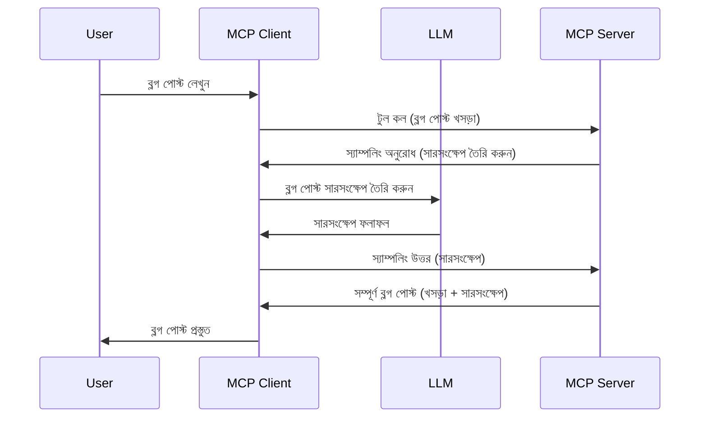

# স্যাম্পলিং - ক্লায়েন্টকে বৈশিষ্ট্য делегেট করা

কখনও কখনও, আপনাকে MCP ক্লায়েন্ট এবং MCP সার্ভারকে একটি সাধারণ লক্ষ্য অর্জনের জন্য একত্র কাজ করতে হবে। আপনার এমন একটি পরিস্থিতি থাকতে পারে যেখানে সার্ভারকে ক্লায়েন্টে থাকা একটি LLM-এর সাহায্যের প্রয়োজন। এই পরিস্থিতিতে, স্যাম্পলিং ব্যবহার করাই উচিত।

চলুন কিছু ব্যবহারিক ক্ষেত্রে এবং স্যাম্পলিং সম্পর্কে সমাধান গড়ে তোলার পদ্ধতি দেখি।

## সংক্ষিপ্ত ধারণা

এই পাঠে, আমরা স্যাম্পলিং কখন এবং কোথায় ব্যবহার করতে হয় এবং এটি কীভাবে কনফিগার করতে হয় তা ব্যাখ্যা করব।

## শেখার উদ্দেশ্য

এই অধ্যায়ে, আমরা:

- স্যাম্পলিং কি এবং কখন ব্যবহার করতে হয় তা ব্যাখ্যা করব।
- MCP-তে স্যাম্পলিং কনফিগার করা দেখাব।
- স্যাম্পলিংয়ের কার্যপ্রক্রিয়ায় উদাহরণ প্রদান করব।

## স্যাম্পলিং কী এবং কেন ব্যবহার করবেন?

স্যাম্পলিং একটি উন্নত বৈশিষ্ট্য যা নিচের মতো কাজ করে:



### স্যাম্পলিং অনুরোধ

ঠিক আছে, এখন আমাদের কাছে একটি বিশ্বাসযোগ্য পরিস্থিতির সামগ্রিক ধারণা আছে, আসুন সার্ভার থেকে ক্লায়েন্টকে প্রেরিত স্যাম্পলিং অনুরোধ সম্পর্কে আলোচনা করি। JSON-RPC ফরম্যাটে এরকম একটি অনুরোধ দেখতে এভাবে হতে পারে:

```json
{
  "jsonrpc": "2.0",
  "id": 1,
  "method": "sampling/createMessage",
  "params": {
    "messages": [
      {
        "role": "user",
        "content": {
          "type": "text",
          "text": "Create a blog post summary of the following blog post: <BLOG POST>"
        }
      }
    ],
    "modelPreferences": {
      "hints": [
        {
          "name": "claude-3-sonnet"
        }
      ],
      "intelligencePriority": 0.8,
      "speedPriority": 0.5
    },
    "systemPrompt": "You are a helpful assistant.",
    "maxTokens": 100
  }
}
```

এখানে কয়েকটি বিষয় উল্লেখযোগ্য:

- Prompt, content -> text-এর অধীনে, আমাদের প্রম্পট যা LLM-কে ব্লগ পোষ্টের বিষয়বস্তু সংক্ষেপ করার নির্দেশনার ভূমিকা রাখে।

- **modelPreferences**। এই অংশটি হল একটি পছন্দ বা সুপারিশ, LLM এর জন্য কী কনফিগারেশন ব্যবহার করতে হবে। ব্যবহারকারী চাইলে এই সুপারিশগুলি মেনে চলতে বা পরিবর্তন করতে পারে। এখানে মডেল, গতি এবং বুদ্ধিমত্তার অগ্রাধিকার নিয়ে সুপারিশ রয়েছে।
- **systemPrompt**, এটি আপনার সাধারণ সিস্টেম প্রম্পট যা আপনার LLM কে একটি ব্যক্তিত্ব দেয় এবং নির্দেশনা প্রদান করে।
- **maxTokens**, আরও একটি গুণ যা বলে দেয় এই কাজের জন্য কতগুলি টোকেন ব্যবহার করার সুপারিশ করা হয়।

### স্যাম্পলিং উত্তর

এই উত্তরটি MCP ক্লায়েন্ট শেষ পর্যন্ত MCP সার্ভারকে পাঠায়, যা LLM-কে কল করার, উৎসাহিত প্রতিক্রিয়া পাওয়ার, এবং তারপর এই বার্তা গঠন করার ফলাফল। JSON-RPC তে এরকম হতে পারে:

```json
{
  "jsonrpc": "2.0",
  "id": 1,
  "result": {
    "role": "assistant",
    "content": {
      "type": "text",
      "text": "Here's your abstract <ABSTRACT>"
    },
    "model": "gpt-5",
    "stopReason": "endTurn"
  }
}
```

ধরা যাক, প্রতিক্রিয়াটি ব্লগ পোষ্টের সারসংক্ষেপ যার আমরা অনুরোধ করেছিলাম সেরকমই। লক্ষ্য করুন ব্যবহৃত `model` আমরা যেটা চেয়েছিলাম সেটি নয়, বরং "গ্পট-৫", "ক্লড-৩-সোনেট" পরিবর্তে। এটি দেখাতে যে ব্যবহারকারী যা ব্যবহার করবে তা নিয়ে সিদ্ধান্ত পাল্টাতে পারে এবং আপনার স্যাম্পলিং অনুরোধ একটি সুপারিশ।

ঠিক আছে, এখন আমরা মূল প্রবাহটি বুঝে গেছি এবং "ব্লগ পোষ্ট তৈরি + সারসংক্ষেপ" কার্যকরী কাজ হিসাবে ব্যবহার করার জন্য দরকার কী দেখি।

### বার্তার প্রকারভেদ

স্যাম্পলিং বার্তা শুধুমাত্র টেক্সটে সীমাবদ্ধ নয়, আপনি ছবি এবং অডিওও পাঠাতে পারেন। JSON-RPC কিভাবে আলাদা দেখায় তা নিচে:

**টেক্সট**

```json
{
  "type": "text",
  "text": "The message content"
}
```

**ছবি বিষয়বস্তু**

```json
{
  "type": "image",
  "data": "base64-encoded-image-data",
  "mimeType": "image/jpeg"
}
```

**অডিও বিষয়বস্তু**

```json
{
  "type": "audio",
  "data": "base64-encoded-audio-data",
  "mimeType": "audio/wav"
}
```

> NOTE: স্যাম্পলিং সম্পর্কে বিস্তারিত তথ্যের জন্য দেখুন [আনুষ্ঠানিক ডকুমেন্টেশন](https://modelcontextprotocol.io/specification/2025-11-25/client/sampling)

## ক্লায়েন্টে স্যাম্পলিং কনফিগার কিভাবে করবেন

> নোট: আপনি যদি শুধু সার্ভার তৈরি করছেন, তখন এখানে খুব বেশি করার দরকার নেই।

একটি ক্লায়েন্টে, আপনাকে নিচের মতো ফিচার নির্দিষ্ট করতে হবে:

```json
{
  "capabilities": {
    "sampling": {}
  }
}
```

এরপর এটি নেওয়া হবে যখন আপনার নির্বাচিত ক্লায়েন্ট সার্ভারের সাথে শুরু হবে।

## স্যাম্পলিংয়ের উদাহরণ - ব্লগ পোষ্ট তৈরি করা

চলুন একসাথে একটি স্যাম্পলিং সার্ভার কোড করি, আমাদের যা যা করতে হবে তা হলো:

1. সার্ভারে একটি টুল তৈরি করা।
2. ঐ টুলটি একটি স্যাম্পলিং অনুরোধ তৈরি করবে।
3. টুলটি ক্লায়েন্টের স্যাম্পলিং অনুরোধের উত্তরের জন্য অপেক্ষা করবে।
4. তারপর টুলের ফলাফল প্রস্তুত করা হবে।

ধাপে ধাপে কোড দেখি:

### -1- টুলটি তৈরি করা

**python**

```python
@mcp.tool()
async def create_blog(title: str, content: str, ctx: Context[ServerSession, None]) -> str:
    """Create a blog post and generate a summary"""

```

### -2- স্যাম্পলিং অনুরোধ তৈরি করা

নিচের কোড দিয়ে আপনার টুল প্রসারিত করুন:

**python**

```python
post = BlogPost(
        id=len(posts) + 1,
        title=title,
        content=content,
        abstract=""
    )

prompt = f"Create an abstract of the following blog post: title: {title} and draft: {content} "

result = await ctx.session.create_message(
        messages=[
            SamplingMessage(
                role="user",
                content=TextContent(type="text", text=prompt),
            )
        ],
        max_tokens=100,
)

```

### -3- প্রতিক্রিয়ার জন্য অপেক্ষা এবং ফিরে দেওয়া

**python**

```python
post.abstract = result.content.text

posts.append(post)

# সম্পূর্ণ পণ্য ফেরত দিন
return json.dumps({
    "id": post.title,
    "abstract": post.abstract
})
```

### -4- সম্পূর্ণ কোড

**python**

```python
from starlette.applications import Starlette
from starlette.routing import Mount, Host

from mcp.server.fastmcp import Context, FastMCP

from mcp.server.session import ServerSession
from mcp.types import SamplingMessage, TextContent

import json


from uuid import uuid4
from typing import List
from pydantic import BaseModel


mcp = FastMCP("Blog post generator")

# app = FastAPI()

posts = []

class BlogPost(BaseModel):
    id: int
    title: str
    content: str
    abstract: str

posts: List[BlogPost] = []

@mcp.tool()
async def create_blog(title: str, content: str, ctx: Context[ServerSession, None]) -> str:
    """Create a blog post and generate a summary"""

    post = BlogPost(
        id=len(posts) + 1,
        title=title,
        content=content,
        abstract=""
    )

    prompt = f"Create an abstract of the following blog post: title: {title} and draft: {content} "

    result = await ctx.session.create_message(
        messages=[
            SamplingMessage(
                role="user",
                content=TextContent(type="text", text=prompt),
            )
        ],
        max_tokens=100,
    )

    post.abstract = result.content.text

    posts.append(post)

    # সম্পূর্ণ ব্লগ পোস্ট ফেরত দিন
    return json.dumps({
        "id": post.title,
        "abstract": post.abstract
    })

if __name__ == "__main__":
    print("Starting server...")
    # mcp.run()
    mcp.run(transport="streamable-http")

# রান অ্যাপ দিয়ে: python server.py
```

### -5- Visual Studio Code এ টেস্টিং

Visual Studio Code-এ এটি পরীক্ষা করতে, নিচের ধাপগুলি অনুসরণ করুন:

1. টার্মিনালে সার্ভার শুরু করুন
2. এটিকে *mcp.json* এ যোগ করুন (এবং নিশ্চিত করুন এটি চালু আছে) উদাহরণস্বরূপ:

   ```json
   "servers": {
      "blog-server": {
        "type": "http",
        "url": "http://localhost:8000/mcp"
      }
   }
   ```

3. একটি প্রম্পট টাইপ করুন:

   ```text
   create a blog post named "Where Python comes from", the content is "Python is actually named after Monty Python Flying Circus"
   ```

4. স্যাম্পলিং করার অনুমতি দিন। প্রথমবার এটি পরীক্ষা করার সময় আপনাকে একটি অতিরিক্ত ডায়ালগ দেখানো হবে, সেটি স্বীকার করতে হবে, তারপর সাধারণ ডায়ালগটি দেখাবে টুল চালানোর জন্য।

5. ফলাফল পরিদর্শন করুন। আপনি ফলাফলগুলো GitHub Copilot Chat-এ সুন্দরভাবে রেন্ডার হওয়া দেখতে পাবেন, এছাড়া আপনি কাঁচা JSON প্রতিক্রিয়াও পরিদর্শন করতে পারবেন।

**বোনাস**। Visual Studio Code টুলিং স্যাম্পলিংয়ের চমৎকার সমর্থন রয়েছে। আপনি ইনস্টল করা সার্ভারে নেভিগেট করে স্যাম্পলিং অ্যাক্সেস কনফিগার করতে পারেন:

1. এক্সটেনশন সেকশনে যান।
2. "MCP SERVERS - INSTALLED" অংশে আপনার ইনস্টল করা সার্ভারের জন্য কগ আইকনে ক্লিক করুন।
3. "Configure Model Access" নির্বাচন করুন, এখানে আপনি নির্ধারণ করতে পারেন কোন মডেলগুলি GitHub Copilot-কে স্যাম্পলিং করার সময় ব্যবহার করতে দেওয়া হবে। "Show Sampling requests" ক্লিক করে সাম্প্রতিক স্যাম্পলিং অনুরোধগুলো দেখতে পারবেন।

## অ্যাসাইনমেন্ট

এই অ্যাসাইনমেন্টে, আপনি স্বল্প ভিন্ন ধরনের স্যাম্পলিং তৈরি করবেন, অর্থাৎ একটি স্যাম্পলিং ইন্টিগ্রেশন যা পণ্য বর্ণনা তৈরি সমর্থন করে। আপনার পরিস্থিতি:

**পরিস্থিতি**: একটি ই-কমার্স ব্যাক অফিস কর্মী সাহায্যের প্রয়োজন, পণ্য বর্ণনা তৈরি করতে অনেক সময় লাগে। তাই, আপনাকে এমন একটি সমাধান তৈরি করতে হবে যেখানে "create_product" নামের একটি টুল কল করা যাবে "title" এবং "keywords" আর্গুমেন্ট সহ এবং এটি একটি সম্পূর্ণ পণ্য তৈরি করবে যার মধ্যে থাকবে "description" ক্ষেত্র যা ক্লায়েন্টের LLM দ্বারা পূরণ করা হবে।

টিপ: আপনি আগে যা শিখেছেন তা ব্যবহার করে এই সার্ভার এবং এর টুল স্যাম্পলিং অনুরোধ ব্যবহার করে গড়ে তুলুন।

## সমাধান

[সমাধান](./solution/README.md)

## মূল বুঝ

স্যাম্পলিং একটি শক্তিশালী বৈশিষ্ট্য যা সার্ভারকে ক্লায়েন্টকে টাস্ক ডেলিগেট করতে দেয় যখন এটি LLM এর সাহায্যের প্রয়োজন হয়।

## পরবর্তী কী

- [অধ্যায় 4 - ব্যবহারিক বাস্তবায়ন](../../04-PracticalImplementation/README.md)

---

<!-- CO-OP TRANSLATOR DISCLAIMER START -->
**অস্বীকৃতি**:
এই নথিটি AI অনুবাদ পরিষেবা [Co-op Translator](https://github.com/Azure/co-op-translator) ব্যবহার করে অনূদিত হয়েছে। যদিও আমরা শুদ্ধতার জন্য চেষ্টা করি, অনুগ্রহ করে মনে রাখবেন যে স্বয়ংক্রিয় অনুবাদে ত্রুটি বা অসঙ্গতি থাকতে পারে। মূল নথিটি তার স্বভাষায় কর্তৃত্বপূর্ণ উৎস হিসেবে বিবেচিত হওয়া উচিত। গুরুত্বপূর্ণ তথ্যের জন্য পেশাদার মানব অনুবাদ সুপারিশ করা হয়। এই অনুবাদের ব্যবহারে প্রয়োজনীয় ভুল বোঝাবুঝি বা ভুল ব্যাখ্যার জন্য আমরা দায়বদ্ধ নই।
<!-- CO-OP TRANSLATOR DISCLAIMER END -->