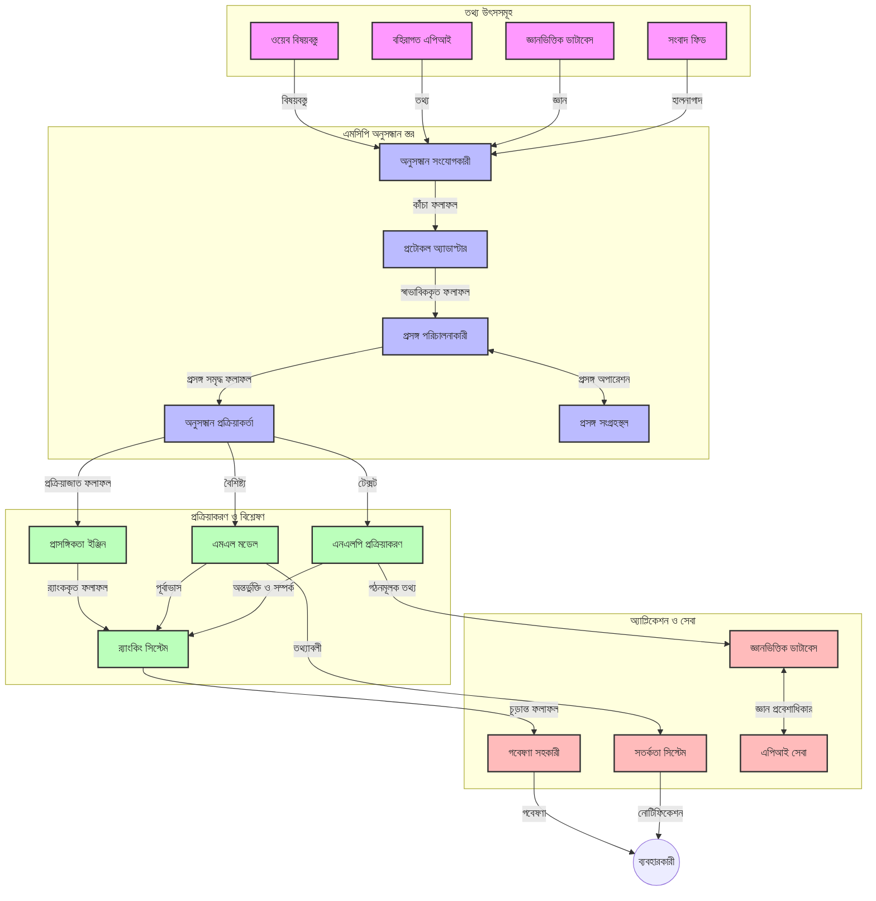
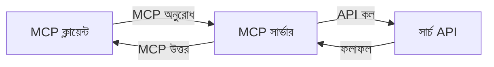
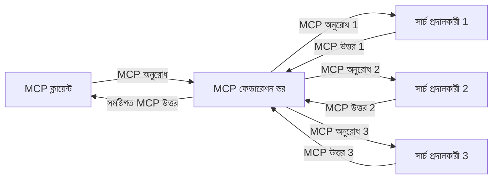
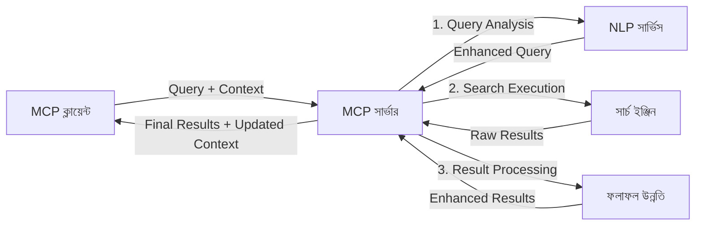

# রিয়েল-টাইম ওয়েব সার্চের জন্য মডেল প্রসঙ্গ প্রোটোকল

## ওভারভিউ

আজকের তথ্যনির্ভর পরিবেশে রিয়েল-টাইম ওয়েব সার্চ অপরিহার্য হয়ে উঠেছে, যেখানে অ্যাপ্লিকেশনগুলিকে ইন্টারনেট জুড়ে সর্বশেষ তথ্যের তাত্ক্ষণিক অ্যাক্সেসের প্রয়োজন পড়ে প্রাসঙ্গিক এবং সময়োপযোগী প্রতিক্রিয়া দেওয়ার জন্য। মডেল প্রসঙ্গ প্রোটোকল (MCP) এই রিয়েল-টাইম সার্চ প্রক্রিয়াগুলিকে অপ্টিমাইজ করার ক্ষেত্রে একটি গুরুত্বপূর্ণ অগ্রগতি প্রতিনিধিত্ব করে, সার্চ দক্ষতা উন্নত করে, প্রসঙ্গগত অখণ্ডতা বজায় রাখে এবং সার্বিক সিস্টেম কর্মক্ষমতা উন্নত করে।

এই মডিউলটি MCP কিভাবে AI মডেল, সার্চ ইঞ্জিন এবং অ্যাপ্লিকেশন জুড়ে প্রসঙ্গ ব্যবস্থাপনায় একটি মানসম্মত পদ্ধতি প্রদান করে রিয়েল-টাইম ওয়েব সার্চ পরিবর্তন করে তা অনুসন্ধান করে।

### আপনি কী শিখবেন

এই ব্যাপক গাইডে, আপনি শিখবেন:

- কিভাবে MCP AI মডেল এবং রিয়েল-টাইম ওয়েব সার্চ ক্ষমতার মধ্যে একটি সেতু তৈরী করে
- MCP দিয়ে দক্ষ এবং স্কেলযোগ্য সার্চ সমাধান বাস্তবায়নের আর্কিটেকচারাল প্যাটার্নসমূহ
- একাধিক প্রশ্ন এবং ইন্টারঅ্যাকশনে সার্চ প্রসঙ্গ সংরক্ষণের কৌশল
- বিভিন্ন সার্চ পরিস্থিতিতে পাইথন এবং জাভাস্ক্রিপ্টে বাস্তবিক কোড বাস্তবায়ন
- MCP-চালিত সার্চ সিস্টেমে প্রাসঙ্গিকতা, সাম্প্রতিকতা এবং কর্মক্ষমতার মধ্যে সামঞ্জস্য বজায় রাখার পদ্ধতি

## রিয়েল-টাইম ওয়েব সার্চের পরিচিতি

রিয়েল-টাইম ওয়েব সার্চ একটি প্রযুক্তিগত পদ্ধতি যা ওয়েব-ভিত্তিক তথ্যের অবিরাম ক্যোয়ারী, প্রক্রিয়াকরণ এবং বিশ্লেষণ সক্ষম করে যেমন এটি প্রকাশিত বা আপডেট হয়, যাতে সিস্টেমগুলো সর্বনিম্ন বিলম্বে তাজা এবং প্রাসঙ্গিক তথ্য প্রদান করতে পারে। ঐতিহ্যবাহী সার্চ সিস্টেমগুলি যেখানে ঘন্টা বা দিনের পুরনো সূচীকৃত ডেটার উপর কাজ করে, সেখানে রিয়েল-টাইম সার্চ ওয়েবের লাইভ ডেটা প্রক্রিয়া করে, যা অনলাইন বিষয়বস্তুর বর্তমান অবস্থা প্রতিফলিত করে।

### রিয়েল-টাইম ওয়েব সার্চের মূল ধারণাসমূহ:

- **অবিরাম ক্যোয়ারী প্রক্রিয়াকরণ**: সার্চ ক্যোয়ারীগুলো নিয়মিত আপডেট হওয়া ডেটাসোর্সের বিরুদ্ধে প্রক্রিয়াকৃত হয়
- **সাম্প্রতিকতার অগ্রাধিকার**: সিস্টেমগুলি তাজা তথ্যকে অগ্রাধিকার দেয়া হয়
- **প্রাসঙ্গিকতার সামঞ্জস্য**: প্রাসঙ্গিকতা এবং সাম্প্রতিকতার মধ্যে সামঞ্জস্য বজায় রাখা
- **স্কেলযোগ্য আর্কিটেকচার**: সিস্টেমগুলি পরিবর্তনশীল ক্যোয়ারী লোড এবং ডেটা পরিমাণ পরিচালনা করতে পারে
- **প্রসঙ্গগত বোধগম্যতা**: সার্চের পুনরাবৃত্তিতে ব্যবহারকারীর প্রসঙ্গ বজায় রাখা অর্থপূর্ণ ফলাফলের জন্য জরুরি
- **ডায়নামিক ক্যোয়ারী পুনর্গঠন**: প্রসঙ্গ এবং পূর্ববর্তী ফলাফলের ওপর ভিত্তি করে ক্যোয়ারী রূপান্তর করা
- **মাল্টি-সোর্স ইন্টিগ্রেশন**: একাধিক সার্চ প্রদানকারী এবং ওয়েব সোর্স থেকে ফলাফল সংযুক্ত করা
- **সেমান্টিক বোধগম্যতা**: কেবল কীওয়ার্ড নয়, বরং অর্থের ভিত্তিতে ক্যোয়ারী এবং বিষয়বস্তু প্রক্রিয়া করা
- **রিয়েল-টাইম র‌্যাঙ্কিং**: নতুন তথ্য পাওয়া মাত্র ফলাফলের র‍্যাঙ্কিং ক্রমাগত সামঞ্জস্য করা

### মডেল প্রসঙ্গ প্রোটোকল এবং রিয়েল-টাইম ওয়েব সার্চ

মডেল প্রসঙ্গ প্রোটোকল (MCP) রিয়েল-টাইম ওয়েব সার্চ পরিবেশে কয়েকটি গুরুত্বপূর্ণ চ্যালেঞ্জ মোকাবেলা করে:

1. **সার্চ প্রসঙ্গ সংরক্ষণ**: MCP বিতরণকৃত সার্চ উপাদান জুড়ে প্রসঙ্গ বজায় রাখার পদ্ধতি মানসম্মত করে, নিশ্চিত করে যে AI মডেল এবং প্রক্রিয়াকরণ নোডগুলির কাছে প্রাসঙ্গিক ক্যোয়ারী ইতিহাস এবং ব্যবহারকারীর পছন্দগুলি থাকে।

2. **দক্ষ ক্যোয়ারী ব্যবস্থাপনা**: প্রসঙ্গ স্থানান্তরের জন্য কাঠামোগত প্রক্রিয়া সরবরাহ করে MCP, প্রতিটি সার্চ পুনরাবৃত্তিতে প্রসঙ্গ পুনরাবৃত্তির ওভারহেড কমায়।

3. **ইন্টারঅপারেবিলিটি**: MCP বিভিন্ন সার্চ প্রযুক্তি এবং AI মডেলের মধ্যে প্রসঙ্গ শেয়ার করার জন্য একটি সাধারণ ভাষা তৈরি করে, যা আরও নমনীয় এবং সম্প্রসারিত আর্কিটেকচার সক্ষম করে।

4. **সার্চ-অপ্টিমাইজড প্রসঙ্গ**: MCP বাস্তবায়নগুলি কার্যকর সার্চের জন্য কোন প্রসঙ্গ উপাদানগুলি সবচেয়ে প্রাসঙ্গিক তা অগ্রাধিকার দিতে পারে, কর্মক্ষমতা এবং সঠিকতার জন্য অপ্টিমাইজ করে।

5. **অ্যাডাপ্টিভ সার্চ প্রসেসিং**: MCP এর মাধ্যমে যথাযথ প্রসঙ্গ ব্যবস্থাপনার সাহায্যে, সার্চ সিস্টেমগুলো ব্যবহারকারীর পরিবর্তিত চাহিদা এবং তথ্যের পরিবেশের ওপর ভিত্তি করে গতিশীলভাবে প্রক্রিয়া সামঞ্জস্য করতে পারে।

সংবাদ সংকলন থেকে গবেষণা সহকারী পর্যন্ত আধুনিক অ্যাপ্লিকেশনগুলিতে MCP-এর সঙ্গে ওয়েব সার্চ প্রযুক্তির সংযোজন আরও বুদ্ধিমান, প্রসঙ্গ-বচনশীল সার্চ সক্ষম করে যা ব্যবহারকারীর ইন্টারঅ্যাকশনের সাথে ক্রমবর্ধমান প্রাসঙ্গিক ফলাফল প্রদান করতে পারে।

## শেখার উদ্দেশ্য

এই পাঠের শেষে, আপনি সক্ষম হবেন:

- রিয়েল-টাইম ওয়েব সার্চের মূলসূত্র এবং আধুনিক অ্যাপ্লিকেশনগুলির চ্যালেঞ্জগুলি বোঝা
- কীভাবে মডেল প্রসঙ্গ প্রোটোকল (MCP) রিয়েল-টাইম ওয়েব সার্চ ক্ষমতা বৃদ্ধি করে তা ব্যাখ্যা করা
- জনপ্রিয় ফ্রেমওয়ার্ক এবং API ব্যবহার করে MCP-ভিত্তিক সার্চ সমাধান বাস্তবায়ন করা
- MCP সহ স্কেলযোগ্য, উচ্চ কর্মক্ষমতার সার্চ আর্কিটেকচার ডিজাইন এবং স্থাপন করা
- MCP ধারণাগুলো বিভিন্ন ব্যবহারে প্রয়োগ করা, যেমন সেমান্টিক সার্চ, গবেষণা সাহায্যকারী, এবং AI-সম্পৃক্ত ব্রাউজিং
- MCP-ভিত্তিক সার্চ প্রযুক্তিতে নতুন প্রবণতা এবং ভবিষ্যতের উদ্ভাবন মূল্যায়ন করা
- ব্যবহারকারী ইন্টারঅ্যাকশন থেকে শেখার সক্ষম প্রসঙ্গ-বচনশীল সার্চ সিস্টেম তৈরি করা
- স্ট্যান্ডার্ডাইজড MCP প্রোটোকলের মাধ্যমে AI অ্যাসিস্টেন্টে ওয়েব সার্চ ক্ষমতা সংযুক্ত করা
- বহু-পর্যায়ের সার্চ পাইপলাইন তৈরি করা যা প্রসঙ্গের ভিত্তিতে প্রগতিশীলভাবে ফলাফল পরিমার্জন করে
- ব্যাপক প্রসঙ্গ সচেতনতা বজায় রেখে সার্চ কর্মক্ষমতা অপ্টিমাইজ করা

### সংজ্ঞা এবং তাৎপর্য

রিয়েল-টাইম ওয়েব সার্চ বলতে বোঝায় অবিরত ক্যোয়ারী, আহরণ এবং ওয়েব-ভিত্তিক তথ্য সরবরাহ যা সর্বনিম্ন বিলম্বে প্রদান করা হয়। ঐতিহ্যবাহী সার্চ ইঞ্জিনগুলি যেগুলো সময়ে মাঝে ওয়েব ক্রল এবং সূচিকৃত করে, সেখানে রিয়েল-টাইম সার্চ তথ্যকে তাত্ক্ষণিকভাবে প্রকাশিত হওয়ার মতোই সার্ফেস করার লক্ষ্য নিয়ে কাজ করে, যা সবচেয়ে সাম্প্রতিক বিষয়বস্তুর তাত্ক্ষণিক অ্যাক্সেস দেয়।

রিয়েল-টাইম ওয়েব সার্চের মূল বৈশিষ্ট্যসমূহ:

- **তাজাত্বতা**: সাম্প্রতিক বিষয়বস্তু এবং আপডেট অগ্রাধিকার দেওয়া
- **অবিরাম প্রক্রিয়াকরণ**: নতুন তথ্যের জন্য ক্রমাগত পর্যবেক্ষণ
- **ক্যোয়ারী অভিযোজন**: প্রসঙ্গ এবং প্রতিক্রিয়ার ভিত্তিতে সার্চ ক্যোয়ারী পরিমার্জন
- **তাৎক্ষণিক সরবরাহ**: সর্বনিম্ন অপেক্ষার সময়ে সার্চ ফলাফল প্রদান
- **প্রসঙ্গ ধারণ**: অধিকতর প্রাসঙ্গিকতার জন্য পূর্ববর্তী ক্যোয়ারী থেকে গড়ে তোলা

### ঐতিহ্যবাহী ওয়েব সার্চে চ্যালেঞ্জসমূহ

প্রচলিত ওয়েব সার্চ পদ্ধতিগুলো রিয়েল-টাইম ব্যবহারে প্রয়োগের সময় কয়েকটি সীমাবদ্ধতার মুখোমুখি হয়:

1. **প্রসঙ্গ ভাঙ্গন**: একাধিক ক্যোয়ারীর মধ্যে সার্চ প্রসঙ্গ বজায় রাখা কঠিন
2. **তথ্যের তাজাত্বতা**: সর্বশেষ তথ্যের অ্যাক্সেস এবং অগ্রাধিকার দেওয়ার চ্যালেঞ্জ
3. **ইন্টিগ্রেশন জটিলতা**: সার্চ সিস্টেম এবং অ্যাপ্লিকেশনগুলোর মধ্যে অভিন্নকরণের সমস্যা
4. **বিলম্ব সমস্যা**: ব্যাপক সার্চ এবং প্রতিক্রিয়া সময়ের চাহিদার মধ্যে সামঞ্জস্যতা
5. **প্রাসঙ্গিকতা সামঞ্জস্য**: সাম্প্রতিকতাকে অগ্রাধিকার দেওয়ার সময় সঠিকতা এবং প্রাসঙ্গিকতা নিশ্চিত করা

## সার্চের জন্য মডেল প্রসঙ্গ প্রোটোকল (MCP) বোঝা

### সার্চ প্রসঙ্গে MCP কী?

মডেল প্রসঙ্গ প্রোটোকল (MCP) একটি মানসম্মত যোগাযোগ প্রোটোকল যা AI মডেল এবং অ্যাপ্লিকেশনগুলির মধ্যে দক্ষ ইন্টারঅ্যাকশন সহজতর করার জন্য ডিজাইন করা হয়েছে। রিয়েল-টাইম ওয়েব সার্চ প্রসঙ্গে, MCP একটি কাঠামো প্রদান করে:

- ক্যোয়ারী ধারায় সার্চ প্রসঙ্গ সংরক্ষণ করা
- সার্চ ক্যোয়ারী এবং ফলাফলের ফরম্যাট স্ট্যান্ডার্ডাইজ করা
- সার্চ প্যারামিটার এবং ফলাফল প্রেরণের অপ্টিমাইজেশন
- মডেল-টু-সার্চ ইঞ্জিন যোগাযোগ বাড়ানো

### মূল উপাদান এবং আর্কিটেকচার

রিয়েল-টাইম ওয়েব সার্চের জন্য MCP আর্কিটেকচারের প্রধান প্রধান উপাদানসমূহ:

1. **ক্যোয়ারী প্রসঙ্গ হ্যান্ডলারস**: একাধিক ক্যোয়ারীতে সার্চ প্রসঙ্গ পরিচালনা এবং বজায় রাখা
2. **সার্চ প্রসেসরস**: প্রসঙ্গ সচেতন কৌশল ব্যবহার করে আসা সার্চ অনুরোধ প্রক্রিয়া করা
3. **প্রোটোকল অ্যাডাপ্টারস**: ভিন্ন ভিন্ন সার্চ API এর মধ্যে রূপান্তর করা এবং প্রসঙ্গ সংরক্ষণ করা
4. **প্রসঙ্গ স্টোর**: দক্ষতার সাথে সার্চ ইতিহাস এবং পছন্দ সংরক্ষণ ও পুনরুদ্ধার করা
5. **সার্চ কানেক্টরস**: বিভিন্ন সার্চ ইঞ্জিন এবং ওয়েব API এর সঙ্গে সংযোগ স্থাপন



### MCP কীভাবে রিয়েল-টাইম ওয়েব সার্চ উন্নত করে

MCP ঐতিহ্যবাহী ওয়েব সার্চ চ্যালেঞ্জগুলি মোকাবেলা করে:

- **প্রসঙ্গগত ধারাবাহিকতা**: পুরা সার্চ সেশন জুড়ে ক্যোয়ারীর মধ্যে সম্পর্ক বজায় রাখা
- **অপ্টিমাইজড প্রেরণ**: বুদ্ধিমত্তাসম্পন্ন প্রসঙ্গ ব্যবস্থাপনায় সার্চ প্যারামিটারে পুনরাবৃত্তি কমানো
- **স্ট্যান্ডার্ডাইজড ইন্টারফেস**: সার্চ উপাদানগুলির জন্য সঙ্গতিপূর্ণ API প্রদান
- **বিলম্ব কমানো**: দক্ষ প্রসঙ্গ পরিচালনার মাধ্যমে প্রক্রিয়াকরণ ওভারহেড হ্রাস
- **বর্ধিত প্রাসঙ্গিকতা**: একাধিক ক্যোয়ারীতে ব্যবহারকারীর মানসিকতা সংরক্ষণ করে সার্চ প্রাসঙ্গিকতা বাড়ানো

## ইন্টিগ্রেশন এবং বাস্তবায়ন

রিয়েল-টাইম ওয়েব সার্চ সিস্টেমগুলির কার্যক্ষমতা এবং প্রসঙ্গগত অখণ্ডতা বজায় রাখতে সাবধানে আর্কিটেকচারাল ডিজাইন এবং বাস্তবায়ন প্রয়োজন। মডেল প্রসঙ্গ প্রোটোকল AI মডেল এবং সার্চ প্রযুক্তির সংযোগে একটি মানসম্মত পদ্ধতি প্রদান করে, যা আরও বর্ধিত, প্রসঙ্গ সচেতন সার্চ পাইপলাইন সক্ষম করে।

### সার্চ আর্কিটেকচারে MCP ইন্টিগ্রেশনের সংক্ষিপ্ত বিবরণ

রিয়েল-টাইম ওয়েব সার্চ পরিবেশে MCP বাস্তবায়ন কয়েকটি গুরুত্বপূর্ণ বিবেচনার সাথে সম্পর্কিত:

1. **সার্চ প্রসঙ্গ সিরিয়ালাইজেশন**: MCP প্রসঙ্গগত তথ্য ক্যোয়ারী অনুরোধের মধ্যে দক্ষতার সাথে এনকোড করার পদ্ধতি প্রদান করে, নিশ্চিত করে যে অপরিহার্য প্রসঙ্গ প্রক্রিয়াকরণ পাইপলাইনের মাধ্যমে ক্যোয়ারী সংযুক্ত থেকে যায়। এর মধ্যে সার্চ সংক্রান্ত মেটাডেটার জন্য অপ্টিমাইজ করা মানসম্মত সিরিয়ালাইজেশন ফরম্যাট অন্তর্ভুক্ত।

2. **স্টেটফুল সার্চ প্রসেসিং**: MCP ক্রমাগত সার্চ ইটারেশনে সামঞ্জস্যপূর্ণ প্রসঙ্গ উপস্থাপন বজায় রেখে আরও বুদ্ধিমান স্টেটফুল প্রক্রিয়াকরণ সক্ষম করে। এটি বিশেষত বহুপদক্ষেপ সার্চ পাইপলাইনে মূল্যবান, যেখানে প্রসঙ্গ পরিমার্জন ফলাফল উন্নত করে।

3. **ক্যোয়ারী সম্প্রসারণ এবং পরিমার্জন**: MCP বাস্তবায়নগুলি জমাকৃত প্রসঙ্গের ওপর ভিত্তি করে উন্নত ক্যোয়ারী সম্প্রসারণ এবং পরিমার্জন সহজতর করতে পারে, সার্চ সেশন উন্নতির সাথে সাথে আরও প্রাসঙ্গিক ফলাফল আনতে সক্ষম।

4. **ফলাফল ক্যাশিং এবং অগ্রাধিকার নির্ধারণ**: প্রসঙ্গ পরিচালনার স্ট্যান্ডার্ডাইজেশনের মাধ্যমে MCP ফলাফল ক্যাশিং এবং অগ্রাধিকার নির্ধারণে সাহায্য করে, যা উপাদানগুলিকে পরিবর্তনশীল সার্চ প্রসঙ্গে অভিযোজিত হতে দেয়।

5. **সার্চ ফেডারেশন এবং অ্যাগ্রিগেশন**: MCP সার্চ প্রসঙ্গের কাঠামোবদ্ধ উপস্থাপনা প্রদান করে একাধিক ব্যাকএন্ড জুড়ে আরও উন্নত ফেডারেশন সহজতর করে, যা বিভিন্ন উৎস থেকে ফলাফলগুলোর আরও অর্থপূর্ণ একত্রিতকরণ সক্ষম করে।

বিভিন্ন সার্চ প্রযুক্তিতে MCP বাস্তবায়ন প্রসঙ্গ ব্যবস্থাপনায় একটি ঐক্যবদ্ধ পদ্ধতি সৃষ্টি করে, কাস্টম ইন্টিগ্রেশন কোডের দরকার কমায় এবং সার্চ ক্যোয়ারীর পরিবর্তনের সঙ্গে প্রসঙ্গ বজায় রাখার সিস্টেমের সক্ষমতা বৃদ্ধি করে।

### বিভিন্ন ওয়েব সার্চ বাস্তবায়নে MCP

এই উদাহরণগুলো বর্তমান MCP নির্দিষ্টকরণ অনুসরণ করে যা JSON-RPC ভিত্তিক প্রোটোকলের উপর কেন্দ্রীভূত বিভিন্ন পরিবহন পদ্ধতির সাথে কাজ করে। কোড দেখায় কিভাবে আপনি MCP প্রোটোকলের পূর্ণ সামঞ্জস্য বজায় রেখে কাস্টম সার্চ সংযোজন তৈরি করতে পারেন।

<details>
<summary>জেনেরিক সার্চ API সহ পাইথন বাস্তবায়ন</summary>

```python
import asyncio
import json
import aiohttp
from typing import Dict, Any, Optional, List
from contextlib import asynccontextmanager
from collections.abc import AsyncIterator

# মানক MCP লাইব্রেরি আমদানি করুন
from mcp.client.session import ClientSession
from mcp.client.streamable_http import streamablehttp_client
from mcp.types import TextContent, CreateMessageRequestParams, CreateMessageResult
from mcp.server.fastmcp import FastMCP

# ওয়েব সার্চের জন্য একটি FastMCP সার্ভার তৈরি করুন
search_server = FastMCP("WebSearch")

# ওয়েব সার্চ অপারেশনগুলি পরিচালনার জন্য ক্লাস
class WebSearchHandler:
    def __init__(self, api_endpoint: str, api_key: str):
        self.api_endpoint = api_endpoint
        self.api_key = api_key
        self.session = None
        
    async def initialize(self):
        """Initialize the HTTP session"""
        self.session = aiohttp.ClientSession(
            headers={"Authorization": f"Bearer {self.api_key}"}
        )
    
    async def close(self):
        """Close the HTTP session"""
        if self.session:
            await self.session.close()
            
    async def perform_search(self, query: str, max_results: int = 5, 
                           include_domains: List[str] = None, 
                           exclude_domains: List[str] = None,
                           time_period: str = "any") -> Dict[str, Any]:
        """Perform web search using the search API"""
        # সার্চ প্যারামিটার গঠন করুন
        search_params = {
            "q": query,
            "limit": max_results,
            "time": time_period
        }
        
        if include_domains:
            search_params["site"] = ",".join(include_domains)
            
        if exclude_domains:
            search_params["exclude_site"] = ",".join(exclude_domains)
        
        # সার্চ অনুরোধ সম্পাদন করুন
        try:
            async with self.session.get(
                self.api_endpoint,
                params=search_params
            ) as response:
                if response.status != 200:
                    error_text = await response.text()
                    raise Exception(f"Search API error: {response.status} - {error_text}")
                
                search_data = await response.json()
                
                # API-নির্দিষ্ট প্রতিক্রিয়া একটি মানক ফরম্যাটে রূপান্তর করুন
                results = []
                for item in search_data.get("results", []):
                    results.append({
                        "title": item.get("title", ""),
                        "url": item.get("url", ""),
                        "snippet": item.get("snippet", ""),
                        "date": item.get("published_date", ""),
                        "source": item.get("source", "")
                    })
                
                return {
                    "query": query,
                    "totalResults": len(results),
                    "results": results
                }
        except Exception as e:
            print(f"Search API request error: {e}")
            raise

# সার্চ হ্যান্ডলার আরম্ভ করুন
search_handler = WebSearchHandler(
    api_endpoint="https://api.search-service.example/search",
    api_key="your-api-key-here"
)

# সার্চ হ্যান্ডলার পরিচালনার জন্য lifespan সেট করুন
@asyncio.asynccontextmanager
async def app_lifespan(server: FastMCP):
    """Manage application lifecycle"""
    await search_handler.initialize()
    try:
        yield {"search_handler": search_handler}
    finally:
        await search_handler.close()

# সার্ভারের জন্য lifespan সেট করুন
search_server = FastMCP("WebSearch", lifespan=app_lifespan)

# একটি ওয়েব সার্চ সরঞ্জাম নিবন্ধন করুন
@search_server.tool()
async def web_search(query: str, max_results: int = 5, 
                   include_domains: List[str] = None,
                   exclude_domains: List[str] = None,
                   time_period: str = "any") -> Dict[str, Any]:
    """
    Search the web for information
    
    Args:
        query: The search query
        max_results: Maximum number of results to return (default: 5)
        include_domains: List of domains to include in search results
        exclude_domains: List of domains to exclude from search results
        time_period: Time period for results ("day", "week", "month", "any")
        
    Returns:
        Dictionary containing search results
    """
    ctx = search_server.get_context()
    search_handler = ctx.request_context.lifespan_context["search_handler"]
    
    results = await search_handler.perform_search(
        query=query,
        max_results=max_results,
        include_domains=include_domains,
        exclude_domains=exclude_domains,
        time_period=time_period
    )
    
    return results

# ক্লায়েন্ট ব্যবহারের উদাহরণ
async def client_example():
    # Streamable HTTP পরিবহন ব্যবহার করে সার্চ সার্ভারের সাথে সংযোগ করুন
    async with streamablehttp_client("http://localhost:8000/mcp") as (read, write, _):
        async with ClientSession(read, write) as session:
            # সংযোগ আরম্ভ করুন
            await session.initialize()
            
            # web_search সরঞ্জাম কল করুন
            search_results = await session.call_tool(
                "web_search", 
                {
                    "query": "latest developments in AI and Model Context Protocol",
                    "max_results": 5,
                    "time_period": "day",
                    "include_domains": ["github.com", "microsoft.com"]
                }
            )
            
            print(f"Search results: {search_results}")

# সার্ভার সম্পাদনার উদাহরণ
if __name__ == "__main__":
    # Streamable HTTP পরিবহন নিয়ে সার্ভার চালান
    search_server.run(transport="streamable-http")
```
</details> 

<details>
<summary>ব্রাউজার-ভিত্তিক সার্চ সহ জাভাস্ক্রিপ্ট বাস্তবায়ন</summary>

```javascript
// ওয়েব সার্চের জন্য MCP সার্ভার বাস্তবায়ন
import { McpServer, ResourceTemplate } from '@modelcontextprotocol/sdk/server/mcp.js';
import { StreamableHTTPServerTransport } from '@modelcontextprotocol/sdk/server/streamableHttp.js';
import { z } from 'zod';

// ওয়েব সার্চের জন্য একটি MCP সার্ভার তৈরি করুন
const searchServer = new McpServer({
    name: "BrowserSearch",
    description: "A server that provides web search capabilities"
});

// সার্চ সার্ভিস ক্লাস
class SearchService {
    constructor(searchApiUrl, apiKey) {
        this.searchApiUrl = searchApiUrl;
        this.apiKey = apiKey;
    }

    async performSearch(parameters) {
        const {
            query = '',
            maxResults = 5,
            includeDomains = [],
            excludeDomains = [],
            timePeriod = 'any'
        } = parameters;
        
        // প্যারামিটারসহ সার্চ URL তৈরি করুন
        const url = new URL(this.searchApiUrl);
        url.searchParams.append('q', query);
        url.searchParams.append('limit', maxResults);
        url.searchParams.append('time', timePeriod);
        
        if (includeDomains.length > 0) {
            url.searchParams.append('site', includeDomains.join(','));
        }
        
        if (excludeDomains.length > 0) {
            url.searchParams.append('exclude_site', excludeDomains.join(','));
        }
        
        try {
            const response = await fetch(url.toString(), {
                method: 'GET',
                headers: {
                    'Authorization': `Bearer ${this.apiKey}`,
                    'Content-Type': 'application/json'
                }
            });
            
            if (!response.ok) {
                const errorText = await response.text();
                throw new Error(`Search API error: ${response.status} - ${errorText}`);
            }
            
            const searchData = await response.json();
            
            // API-নির্দিষ্ট উত্তরকে একটি স্ট্যান্ডার্ড ফরম্যাটে রূপান্তর করুন
            const results = searchData.results?.map(item => ({
                title: item.title || '',
                url: item.url || '',
                snippet: item.snippet || '',
                date: item.published_date || '',
                source: item.source || ''
            })) || [];
            
            return {
                query,
                totalResults: results.length,
                results
            };
        } catch (error) {
            console.error('Search API request error:', error);
            throw error;
        }
    }
}

// সার্চ সার্ভিস আরম্ভ করুন
const searchService = new SearchService(
    'https://api.search-service.example/search',
    'your-api-key-here'
);

// সার্ভারের জন্য প্রসঙ্গ প্রদানকারী সেটআপ করুন
searchServer.setContextProvider(() => {
    return {
        searchService
    };
});

// ওয়েব সার্চ টুল নিবন্ধন করুন
searchServer.tool({
    name: 'web_search',
    description: 'Search the web for information',
    parameters: {
        type: 'object',
        properties: {
            query: {
                type: 'string',
                description: 'The search query'
            },
            maxResults: {
                type: 'integer',
                description: 'Maximum number of results to return',
                default: 5
            },
            includeDomains: {
                type: 'array',
                items: { type: 'string' },
                description: 'List of domains to include in search results'
            },
            excludeDomains: {
                type: 'array',
                items: { type: 'string' },
                description: 'List of domains to exclude from search results'
            },
            timePeriod: {
                type: 'string',
                description: 'Time period for results',
                enum: ['day', 'week', 'month', 'any'],
                default: 'any'
            }
        },
        required: ['query']
    },
    handler: async (params, context) => {
        const { searchService } = context;
        return await searchService.performSearch(params);
    }
});

// সার্চ সার্ভারের সাথে সংযোগ করার জন্য উদাহরণ ক্লায়েন্ট কোড
import { Client } from '@modelcontextprotocol/sdk/client/index.js';
import { StreamableHTTPClientTransport } from '@modelcontextprotocol/sdk/client/streamableHttp.js';

async function connectToSearchServer() {
    // সার্চ সার্ভারের সাথে সংযোগ করুন
    const transport = new StreamableHTTPClientTransport(
        new URL('http://localhost:8000/mcp')
    );
    
    const client = new Client({
        name: 'search-client',
        version: '1.0.0'
    });
    
    await client.connect(transport);
    
    // সার্চ টুলটি চালান
    const searchResults = await client.callTool({
        name: 'web_search',
        arguments: {
            query: 'Model Context Protocol implementation examples',
            maxResults: 10,
            timePeriod: 'week',
            includeDomains: ['github.com', 'docs.microsoft.com']
        }
    });
    
    console.log('Search results:', searchResults);
    
    // পরিষ্কারপরিচ্ছন্নতা
    await client.disconnect();
}

// সার্ভার চালু করুন
const transport = new StreamableHTTPServerTransport();
await searchServer.connect(transport);
console.log('Search server running at http://localhost:8000/mcp');

// একটি আলাদা প্রক্রিয়ায় অথবা সার্ভার চালুর পর
// connectToSearchServer().catch(console.error);
```
</details> 

## কোড উদাহরণের অস্বীকারোক্তি

> **গুরুত্বপূর্ণ দ্রষ্টব্য**: নীচের কোড উদাহরণগুলো মডেল প্রসঙ্গ প্রোটোকল (MCP) এবং ওয়েব সার্চ কার্যকারিতার সংযুক্তি প্রদর্শন করে। যদিও এগুলো MCP-এর অফিসিয়াল SDK গুলোর প্যাটার্ন এবং কাঠামো অনুসরণ করে, এগুলি শিক্ষামূলক কারণে সরলীকৃত।
> 
> এই উদাহরণগুলোতে রয়েছে:
> 
> 1. **পাইথন বাস্তবায়ন**: একটি FastMCP সার্ভার যা ওয়েব সার্চ টুল সরবরাহ করে এবং বাহ্যিক সার্চ API-তে সংযোগ স্থাপন করে। এটি MCP অফিসিয়াল পাইথন SDK’র প্যাটার্ন অনুযায়ী সঠিক জীবনকাল, প্রসঙ্গ ব্যবস্থাপনা এবং টুল বাস্তবায়ন উপস্থাপন করে। সার্ভারটি প্রোডাকশন স্থাপনার জন্য পুরাতন SSE পরিবহনকে প্রতিস্থাপন করা সুপারিশকৃত Streamable HTTP পরিবহন ব্যবহার করে।
> 
> 2. **জাভাস্ক্রিপ্ট বাস্তবায়ন**: অফিসিয়াল MCP টাইপস্ক্রিপ্ট SDK থেকে FastMCP প্যাটার্ন ব্যবহার করে টাইপস্ক্রিপ্ট/জাভাস্ক্রিপ্টে একটি সার্চ সার্ভার তৈরি করা হয়েছে, সঠিক টুল সংজ্ঞা এবং ক্লায়েন্ট সংযোগসহ। এটি সেশন ব্যবস্থাপনা এবং প্রসঙ্গ সংরক্ষণের জন্য সর্বশেষ সুপারিশকৃত প্যাটার্ন অনুসরণ করে।
> 
> এই উদাহরণগুলো প্রোডাকশন ব্যবহারের জন্য অতিরিক্ত ত্রুটি হ্যান্ডলিং, প্রমাণীকরণ এবং নির্দিষ্ট API ইন্টিগ্রেশন কোড প্রয়োজন। প্রদর্শিত সার্চ API এন্ডপয়েন্টগুলো (`https://api.search-service.example/search`) প্লেসহোল্ডার, সেগুলো প্রকৃত সার্চ সার্ভিস এন্ডপয়েন্ট দিয়ে প্রতিস্থাপন করতে হবে।
> 
> পূর্ণ বাস্তবায়ন বিবরণ ও সর্বশেষ পদ্ধতির জন্য অনুগ্রহ করে [অফিসিয়াল MCP স্পেসিফিকেশন](https://spec.modelcontextprotocol.io/) এবং SDK ডকুমেন্টেশন দেখুন।

## মূল ধারণাসমূহ

### মডেল প্রসঙ্গ প্রোটোকল (MCP) ফ্রেমওয়ার্ক

মডেল প্রসঙ্গ প্রোটোকলের ভিত্তিতে AI মডেল, অ্যাপ্লিকেশন এবং পরিষেবাগুলোর মধ্যে প্রসঙ্গ বিনিময়ের জন্য একটি মানসম্মত উপায় প্রদান করা হয়। রিয়েল-টাইম ওয়েব সার্চে, এই ফ্রেমওয়ার্ক সম্মিলিত, বহুপার্ব সার্চ অভিজ্ঞতা তৈরিতে অপরিহার্য। প্রধান উপাদানগুলো:

1. **ক্লায়েন্ট-সার্ভার আর্কিটেকচার**: MCP স্পষ্টভাবে সার্চ ক্লায়েন্ট (অনুরোধকারী) এবং সার্চ সার্ভার (প্রদানকারী) আলাদা করে, নমনীয় স্থাপনার মডেল সক্ষম করে।

2. **JSON-RPC যোগাযোগ**: প্রোটোকলটি JSON-RPC ব্যবহার করে মেসেজ বিনিময়, যা ওয়েব প্রযুক্তির সাথে সামঞ্জস্যপূর্ণ এবং বিভিন্ন প্ল্যাটফর্মে সহজে বাস্তবায়নযোগ্য।

3. **প্রসঙ্গ ব্যবস্থাপনা**: MCP একাধিক ইন্টারঅ্যাকশনে সার্চ প্রসঙ্গ রক্ষণাবেক্ষণ, আপডেট এবং ব্যবহারের জন্য কাঠামো নির্ধারণ করে।

4. **টুল সংজ্ঞা**: সার্চ কার্যক্ষমতাগুলো অবজেক্টিভ প্যারামিটার এবং রিটার্ন মানসহ মানসম্মত টুল হিসেবে প্রকাশ করা হয়।

5. **স্ট্রিমিং সাপোর্ট**: প্রোটোকল স্ট্রিমিং ফলাফল সাপোর্ট করে, যা রিয়েল-টাইম সার্চে ফলাফলগুলি প্রগতিশীল আহরণের জন্য অপরিহার্য।

### ওয়েব সার্চ ইন্টিগ্রেশন প্যাটার্ন

MCP-এর সঙ্গে ওয়েব সার্চ ইন্টিগ্রেশনের সময় কয়েকটি প্যাটার্ন দেখা যায়:

#### 1. সরাসরি সার্চ প্রদানকারী ইন্টিগ্রেশন



এই প্যাটার্নে MCP সার্ভার সরাসরি এক বা একাধিক সার্চ API এর সাথে ইন্টারফেস করে, MCP অনুরোধগুলো API-নির্দিষ্ট কলগুলিতে রূপান্তর করে এবং ফলাফলগুলো MCP প্রতিক্রিয়ায় ফরম্যাট করে।

#### 2. প্রসঙ্গ সংরক্ষণের সঙ্গে ফেডারেটেড সার্চ



এই প্যাটার্ন বিভিন্ন MCP-সামঞ্জস্যপূর্ণ সার্চ প্রদানকারীর মধ্যে সার্চ ক্যোয়ারী বিতরণ করে, যেগুলো ভিন্ন ধরনের বিষয়বস্তু বা সার্চ ক্ষমতায় বিশেষজ্ঞ হতে পারে, একই সময়ে একটি ঐক্যবদ্ধ প্রসঙ্গ বজায় রেখে।

#### 3. প্রসঙ্গ-বর্ধিত সার্চ চেইন



এই প্যাটার্নে সার্চ প্রক্রিয়াটি একাধিক স্তরে ভাগ করা হয়, যেখানে প্রতিটি ধাপে প্রসঙ্গ সমৃদ্ধ হয়, যাতে ক্রমবর্ধমান প্রাসঙ্গিক ফলাফল পাওয়া যায়।

### সার্চ প্রসঙ্গের উপাদানসমূহ

MCP-ভিত্তিক ওয়েব সার্চে, প্রসঙ্গ সাধারণত অন্তর্ভুক্ত করে:

- **ক্যোয়ারী ইতিহাস**: সেশনের পূর্ববর্তী সার্চ ক্যোয়ারীসমূহ
- **ব্যবহারকারীর পছন্দ**: ভাষা, অঞ্চল, সেফ সার্চ সেটিংস
- **ইন্টারঅ্যাকশন ইতিহাস**: কোন ফলাফল চাপা হয়েছে, ফলাফলে কত সময় ব্যয় হয়েছে
- **সার্চ প্যারামিটারস**: ফিল্টার, সাজানোর নিয়ম, এবং অন্যান্য সার্চ সংশোধনসমূহ
- **ডোমেইন জ্ঞান**: সার্চের প্রাসঙ্গিক বিষয়ভিত্তিক প্রসঙ্গ
- **সময়গত প্রসঙ্গ**: সময় ভিত্তিক প্রাসঙ্গিকতা উপাদান
- **সোর্স পছন্দসমূহ**: নির্ভরযোগ্য অথবা পছন্দের তথ্য উৎস

## ব্যবহার ক্ষেত্র এবং অ্যাপ্লিকেশন

### গবেষণা এবং তথ্য সংগ্রহ

MCP গবেষণা ওয়ার্কফ্লো উন্নত করে:

- গবেষণা প্রসঙ্গ সার্চ সেশন জুড়ে সংরক্ষণ করে
- আরও উন্নত এবং প্রসঙ্গগতভাবে প্রাসঙ্গিক ক্যোয়ারী সক্ষম করে
- মাল্টি-সোর্স সার্চ ফেডারেশন সমর্থন করে
- সার্চ ফলাফল থেকে জ্ঞান আহরণের সুবিধা দেয়

### রিয়েল-টাইম সংবাদ এবং প্রবণতা পর্যবেক্ষণ

MCP চালিত সার্চ সংবাদ পর্যবেক্ষণে সুবিধা দেয়:

- উদীয়মান সংবাদ কাহিনী নিকট-রিয়েল-টাইম আবিষ্কার
- প্রাসঙ্গিক তথ্যের প্রসঙ্গভিত্তিক ছাঁকনি
- একাধিক উৎস জুড়ে বিষয় এবং সত্তা ট্র্যাকিং
- ব্যবহারকারীর প্রসঙ্গে ব্যক্তিগতকৃত সংবাদ বিজ্ঞপ্তি

### AI-সম্পৃক্ত ব্রাউজিং এবং গবেষণা

MCP AI-সম্পৃক্ত ব্রাউজিংয়ের জন্য নতুন সম্ভাবনা সৃষ্টি করে:

- বর্তমান ব্রাউজার কার্যক্রমের ওপর ভিত্তি করে প্রসঙ্গগত সার্চ পরামর্শ
- LLM-চালিত অ্যাসিস্টেন্টের সঙ্গে ওয়েব সার্চের নির্বিঘ্ন সংযুক্তি
- সংরক্ষিত প্রসঙ্গের সঙ্গে বহুপার্ব সার্চ পরিমার্জন
- উন্নত তথ্য যাচাই এবং তথ্যের সঠিকতা নিরীক্ষণ

## ভবিষ্যত প্রবণতা এবং উদ্ভাবন

### ওয়েব সার্চে MCP এর বিবর্তন

ভবিষ্যতে, আমরা MCP এর বিবর্তনের প্রত্যাশা করি যা মোকাবেলা করবে:
- **মাল্টিমোডাল অনুসন্ধান**: পাঠ, চিত্র, অডিও এবং ভিডিও অনুসন্ধান যা প্রেক্ষাপট সংরক্ষণ করে সংহত করা
- **বিকেন্দ্রীভূত অনুসন্ধান**: বিতরণকৃত এবং ফেডারেটেড অনুসন্ধান ইকোসিস্টেম সমর্থন করা
- **অনুসন্ধান গোপনীয়তা**: প্রেক্ষাপট-বিবেচিত গোপনীয়তা-সংরক্ষণকারী অনুসন্ধান প্রক্রিয়া
- **কোয়ারি বোঝাপড়া**: প্রাকৃতিক ভাষার অনুসন্ধান কোয়ারি গভীর সেমান্টিক পার্সিং

### প্রযুক্তির সম্ভাব্য উন্নতি

উদীয়মান প্রযুক্তিগুলি যা MCP অনুসন্ধানের ভবিষ্যত গড়ে তুলবে:

1. **নিউরাল অনুসন্ধান স্থাপত্য**: MCP-এর জন্য এমবেডিং-ভিত্তিক অনুসন্ধান সিস্টেম অপ্টিমাইজড
2. **ব্যক্তিগতকৃত অনুসন্ধান প্রেক্ষাপট**: সময়ের সাথে ব্যক্তিগত ব্যবহারকারীর অনুসন্ধান প্যাটার্ন শেখা
3. **জ্ঞান গ্রাফ ইন্টিগ্রেশন**: ডোমেন-নির্দিষ্ট জ্ঞান গ্রাফ দ্বারা প্রেক্ষাপটোন্নত অনুসন্ধান
4. **ক্রস-মোডাল প্রেক্ষাপট**: বিভিন্ন অনুসন্ধান মাত্রায় প্রেক্ষাপট রক্ষণাবেক্ষণ

## হাতে কলম কাজ

### অনুশীলন ১: একটি মৌলিক MCP অনুসন্ধান পাইপলাইন সেট আপ করা

এই অনুশীলনে, আপনি শিখবেন কীভাবে:
- একটি মৌলিক MCP অনুসন্ধান পরিবেশ কনফিগার করতে হয়
- ওয়েব অনুসন্ধানের জন্য প্রেক্ষাপট হ্যান্ডলার বাস্তবায়ন করতে হয়
- অনুসন্ধান পুনরাবৃত্তির মাধ্যমে প্রেক্ষাপট সংরক্ষণ পরীক্ষা এবং যাচাই করতে হয়

### অনুশীলন ২: MCP অনুসন্ধান দিয়ে একটি গবেষণা সহকারী তৈরি করা

একটি সম্পূর্ণ অ্যাপ্লিকেশন তৈরি করুন যা:
- প্রাকৃতিক ভাষার গবেষণা প্রশ্ন প্রক্রিয়াকরণ করে
- প্রেক্ষাপট-বিবেচিত ওয়েব অনুসন্ধান সম্পাদন করে
- একাধিক সূত্র থেকে তথ্য সংশ্লেষণ করে
- সংগঠিত গবেষণা ফলাফল উপস্থাপন করে

### অনুশীলন ৩: MCP দিয়ে মাল্টি-সূত্র অনুসন্ধান ফেডারেশন বাস্তবায়ন

উন্নত অনুশীলন যা কভার করে:
- একাধিক অনুসন্ধান ইঞ্জিনে প্রেক্ষাপট-বিবেচিত কোয়ারি প্রেরণ
- ফলাফলের র‍্যাংকিং এবং সংগ্রহ
- অনুসন্ধান ফলাফলের প্রেক্ষাপট-বিবেচিত ডুপ্লিকেশন অপসারণ
- উৎস-নির্দিষ্ট মেটাডেটা ব্যবস্থাপনা

## অতিরিক্ত সম্পদ

- [Model Context Protocol Specification](https://spec.modelcontextprotocol.io/) - অফিসিয়াল MCP স্পেসিফিকেশন এবং বিস্তারিত প্রোটোকল ডকুমেন্টেশন
- [Model Context Protocol Documentation](https://modelcontextprotocol.io/) - বিস্তারিত টিউটোরিয়াল এবং বাস্তবায়ন গাইড
- [MCP Python SDK](https://github.com/modelcontextprotocol/python-sdk) - MCP প্রোটোকলের অফিসিয়াল পাইথন বাস্তবায়ন
- [MCP TypeScript SDK](https://github.com/modelcontextprotocol/typescript-sdk) - MCP প্রোটোকলের অফিসিয়াল টাইপস্ক্রিপ্ট বাস্তবায়ন
- [MCP Reference Servers](https://github.com/modelcontextprotocol/servers) - MCP সার্ভারের রেফারেন্স বাস্তবায়নসমূহ
- [Bing Web Search API Documentation](https://learn.microsoft.com/en-us/bing/search-apis/bing-web-search/overview) - মাইক্রোসফ্টের ওয়েব অনুসন্ধান API
- [Google Custom Search JSON API](https://developers.google.com/custom-search/v1/overview) - গুগলের প্রোগ্রামেবল সার্চ ইঞ্জিন
- [SerpAPI Documentation](https://serpapi.com/search-api) - সার্চ ইঞ্জিন রেজাল্ট পেজ API
- [Meilisearch Documentation](https://www.meilisearch.com/docs) - ওপেন-সোর্স সার্চ ইঞ্জিন
- [Elasticsearch Documentation](https://www.elastic.co/guide/index.html) - বিতরণকৃত অনুসন্ধান এবং বিশ্লেষণ ইঞ্জিন
- [LangChain Documentation](https://python.langchain.com/docs/get_started/introduction) - LLM দিয়ে অ্যাপ্লিকেশন তৈরি করা

## শেখার ফলাফল

এই মডিউল সম্পন্ন করার মাধ্যমে, আপনি সক্ষম হবেন:

- রিয়েল-টাইম ওয়েব অনুসন্ধানের মৌলিক বিষয় এবং তার চ্যালেঞ্জসমূহ বোঝা
- কীভাবে Model Context Protocol (MCP) রিয়েল-টাইম ওয়েব অনুসন্ধানের সক্ষমতাকে উন্নত করে তা ব্যাখ্যা করা
- জনপ্রিয় ফ্রেমওয়ার্ক এবং API ব্যবহার করে MCP-ভিত্তিক অনুসন্ধান সমাধান বাস্তবায়ন করা
- MCP ব্যবহার করে স্কেলযোগ্য, উচ্চ-কর্মক্ষমতা সম্পন্ন অনুসন্ধান স্থাপত্য ডিজাইন এবং ডিপ্লয় করা
- MCP ধারণা বিভিন্ন ব্যবহার ক্ষেত্রে প্রয়োগ করা, যেমন সেমান্টিক অনুসন্ধান, গবেষণা সহায়তা, এবং AI-অগমেন্টেড ব্রাউজিং
- MCP-ভিত্তিক অনুসন্ধান প্রযুক্তির উদীয়মান প্রবণতা এবং ভবিষ্যৎ উদ্ভাবন মূল্যায়ন করা

### আস্থা এবং নিরাপত্তা বিবেচ্য বিষয়

MCP-ভিত্তিক ওয়েব অনুসন্ধান সমাধান বাস্তবায়নের সময়, MCP স্পেসিফিকেশন থেকে এই গুরুত্বপূর্ণ নীতিমালা মনে রাখুন:

1. **ব্যবহারকারীর সম্মতি এবং নিয়ন্ত্রণ**: ব্যবহারকারীদের স্পষ্টভাবে সম্মতি দিতে এবং সমস্ত ডেটা অ্যাক্সেস ও অপারেশন বুঝতে হবে। এটি বিশেষত গুরুত্বপূর্ণ যখন ওয়েব অনুসন্ধান বাস্তবায়ন বহিরাগত ডেটা উৎস অ্যাক্সেস করতে পারে।

2. **ডেটা গোপনীয়তা**: অনুসন্ধান কোয়ারি এবং ফলাফলের সঠিক হ্যান্ডলিং নিশ্চিত করুন, বিশেষত যখন এতে সংবেদনশীল তথ্য থাকতে পারে। ব্যবহারকারী ডেটা সুরক্ষার জন্য উপযুক্ত অ্যাক্সেস কন্ট্রোল বাস্তবায়ন করুন।

3. **টুল সুরক্ষা**: অনুসন্ধান সরঞ্জামগুলোর জন্য সঠিক অনুমোদন এবং যাচাইকরণ বাস্তবায়ন করুন, কারণ সেগুলো এলোমেলো কোড এক্সিকিউশনের মাধ্যমে সম্ভাব্য নিরাপত্তা ঝুঁকি তৈরি করতে পারে। টুলের আচরণের বর্ণনা বিশ্বাসযোগ্য সার্ভার থেকে প্রাপ্ত না হওয়া পর্যন্ত অবিশ্বস্ত বিবেচিত হওয়া উচিত।

4. **স্পষ্ট ডকুমেন্টেশন**: MCP স্পেসিফিকেশন থেকে বাস্তবায়ন নির্দেশিকা অনুসারে আপনার MCP-ভিত্তিক অনুসন্ধান বাস্তবায়নের সক্ষমতা, সীমাবদ্ধতা এবং নিরাপত্তা বিবেচনা সম্পর্কে স্পষ্ট ডকুমেন্টেশন প্রদান করুন।

5. **দৃঢ় সম্মতি প্রবাহ**: এক্ষেত্রে ব্যবহারকারীদের যথাযথ সম্মতি এবং অনুমোদন নিশ্চিত করার জন্য সহজবোধ্য প্রক্রিয়া তৈরি করুন, বিশেষত এমন সরঞ্জামগুলোর জন্য যা বহিরাগত ওয়েব রিসোর্সের সঙ্গে ইন্টারঅ্যাক্ট করে, এবং ব্যবহার অনুমোদনের আগে স্পষ্টভাবে প্রতিটি টুল কী করে তা ব্যাখ্যা করুন।

MCP নিরাপত্তা এবং আস্থার বিষয়ে পূর্ণ বিবরণের জন্য, [আধিকারিক ডকুমেন্টেশন](https://modelcontextprotocol.io/specification/2025-11-25/basic/security_best_practices) পরিদর্শন করুন।

## পরবর্তী কী

- [5.12 Model Context Protocol সার্ভারগুলির জন্য Entra ID প্রমাণীকরণ](../mcp-security-entra/README.md)

---

<!-- CO-OP TRANSLATOR DISCLAIMER START -->
**অস্বীকৃতি**:
এই নথিটি AI অনুবাদ পরিষেবা [Co-op Translator](https://github.com/Azure/co-op-translator) ব্যবহার করে অনূদিত হয়েছে। যদিও আমরা শুদ্ধতার জন্য চেষ্টা করি, অনুগ্রহ করে মনে রাখবেন যে স্বয়ংক্রিয় অনুবাদে ত্রুটি বা অসঙ্গতি থাকতে পারে। মূল নথিটি তার স্বভাষায় কর্তৃত্বপূর্ণ উৎস হিসেবে বিবেচিত হওয়া উচিত। গুরুত্বপূর্ণ তথ্যের জন্য পেশাদার মানব অনুবাদ সুপারিশ করা হয়। এই অনুবাদের ব্যবহারে প্রয়োজনীয় ভুল বোঝাবুঝি বা ভুল ব্যাখ্যার জন্য আমরা দায়বদ্ধ নই।
<!-- CO-OP TRANSLATOR DISCLAIMER END -->