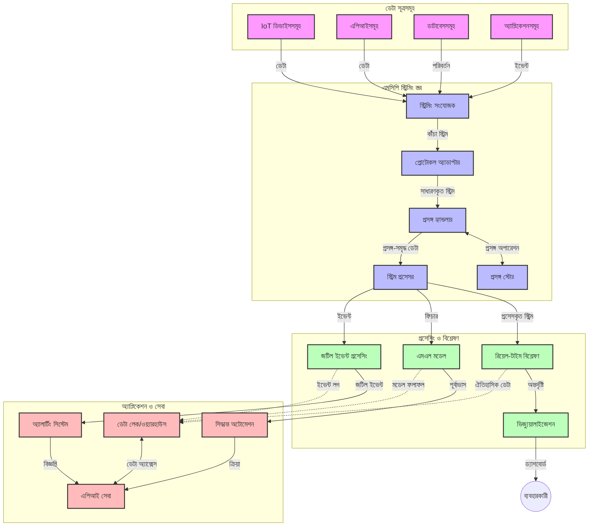

# রিয়েল-টাইম ডেটা স্ট্রিমিংয়ের জন্য মডেল কনটেক্সট প্রোটোকল

## পর্যালোচনা

আজকের তথ্য-চালিত বিশ্বে, যেখানে ব্যবসা এবং অ্যাপ্লিকেশনগুলি সময়োপযোগী সিদ্ধান্ত গ্রহণের জন্য তথ্যের তাত্ক্ষণিক ব্যবহারের প্রয়োজন, রিয়েল-টাইম ডেটা স্ট্রিমিং অপরিহার্য হয়ে উঠেছে। মডেল কনটেক্সট প্রোটোকল (MCP) এই রিয়েল-টাইম স্ট্রিমিং প্রক্রিয়াগুলিকে দক্ষ করে তোলায় গুরুত্বপূর্ণ অগ্রগতি প্রতিনিধি, যা ডেটা প্রক্রিয়াকরণের কর্মক্ষমতা বাড়ায়, প্রাসঙ্গিক তথ্যের ধারাবাহিকতা বজায় রাখে, এবং সামগ্রিক সিস্টেমের কর্মক্ষমতা উন্নত করে।

এই মডিউলটি আলোচনা করে কিভাবে MCP কৃত্রিম বুদ্ধিমত্তা মডেল, স্ট্রিমিং প্ল্যাটফর্ম এবং অ্যাপ্লিকেশনজুড়ে প্রাসঙ্গিকতা ব্যবস্থাপনায় একটি মানকরণ পদ্ধতি প্রদান করে রিয়েল-টাইম ডেটা স্ট্রিমিংকে রূপান্তরিত করে।

## রিয়েল-টাইম ডেটা স্ট্রিমিংয়ের পরিচিতি

রিয়েল-টাইম ডেটা স্ট্রিমিং হল একটি প্রযুক্তিগত প্যারাডাইম যা ডেটা তৈরি হওয়ার সাথে সাথেই ধারাবাহিকভাবে স্থানান্তর, প্রক্রিয়াকরণ এবং বিশ্লেষণকে সক্ষম করে, যাতে সিস্টেমগুলি নতুন তথ্যের উপর সঙ্গে সঙ্গে প্রতিক্রিয়া দেখাতে পারে। যা সাধারণ ব্যাচ প্রক্রিয়াকরণের মতো নয়, যেখানে স্থির ডেটাসেটের উপর কাজ করা হয়, স্ট্রিমিং চলন্ত ডেটার প্রক্রিয়াকরণ করে, যেটি ন্যুনতম বিলম্ব নিয়ে অন্তর্দৃষ্টি এবং কর্ম প্রদান করে।

### রিয়েল-টাইম ডেটা স্ট্রিমিংয়ের মূল ধারণা:

- **ধারাবাহিক ডেটা প্রবাহ**: ডেটা একটি অবিরাম, শেষহীন ইভেন্ট অথবা রেকর্ড স্ট্রিমের মতো প্রক্রিয়াকৃত হয়।
- **কম বিলম্বের প্রক্রিয়াকরণ**: ডেটা সৃষ্টির এবং প্রক্রিয়াকরণের মধ্যে সময় কমিয়ে আনা হয়।
- **স্কেলেবিলিটি**: স্ট্রিমিং আর্কিটেকচারগুলি পরিবর্তনশীল ডেটার আয়তন এবং গতি সামলাতে সক্ষম হতে হবে।
- **ফল্ট টলারেন্স**: সিস্টেমকে ব্যর্থতা মোকাবেলার জন্য দৃঢ় হতে হবে যাতে ডেটার ধারাবাহিক প্রবাহ নিশ্চিত হয়।
- **স্থিতিশীল প্রক্রিয়াকরণ**: ঘটনাগুলির মধ্যে প্রাসঙ্গিকতা বজায় রাখা অর্থবহ বিশ্লেষণের জন্য গুরুত্বপূর্ণ।

### মডেল কনটেক্সট প্রোটোকল এবং রিয়েল-টাইম স্ট্রিমিং

মডেল কনটেক্সট প্রোটোকল (MCP) রিয়েল-টাইম স্ট্রিমিং পরিবেশের কয়েকটি গুরুত্বপূর্ণ চ্যালেঞ্জ মোকাবেলা করে:

১. **প্রাসঙ্গিক ধারাবাহিকতা**: MCP বিতরণকৃত স্ট্রিমিং উপাদানগুলির মধ্যে কনটেক্সট বজায় রাখার জন্য মানকরণ করে, যা কৃত্রিম বুদ্ধিমত্তা মডেল এবং প্রক্রিয়াকরণ নোডগুলোকে প্রাসঙ্গিক ঐতিহাসিক ও পরিবেশগত তথ্য সরবরাহ নিশ্চিত করে।

২. **কার্যকর রাজ্য ব্যবস্থাপনা**: কনটেক্সট ট্রান্সমিশনের জন্য সুঠাম পদ্ধতি প্রদান করে MCP স্ট্রিমিং পাইপলাইনে রাজ্য ব্যবস্থাপনার অতিরিক্ত লোড কমিয়ে দেয়।

৩. **ইন্টারঅপারেবিলিটি**: MCP বৈচিত্র্যময় স্ট্রিমিং প্রযুক্তি এবং কৃত্রিম বুদ্ধিমত্তা মডেলের মধ্যে কনটেক্সট শেয়ার করার জন্য একটি সাধারণ ভাষা তৈরি করে, এটি আরও নমনীয় এবং সম্প্রসারিত আর্কিটেকচার সক্ষম করে।

৪. **স্ট্রিমিং-অপ্টিমাইজড কনটেক্সট**: MCP প্রয়োগগুলো কনটেক্সটের এমন উপাদানগুলোকে অগ্রাধিকার দিতে পারে যা রিয়েল-টাইম সিদ্ধান্ত গ্রহণের জন্য সবচেয়ে প্রাসঙ্গিক, কর্মক্ষমতা এবং নির্ভুলতার জন্য সর্বোত্তমকরণ।

৫. **অ্যাডাপটিভ প্রক্রিয়াকরণ**: MCP মাধ্যমে সঠিক কনটেক্সট ব্যবস্থাপনার মাধ্যমে স্ট্রিমিং সিস্টেম ডেটার বিবর্তনশীল পরিস্থিতি এবং প্যাটার্ন অনুযায়ী প্রক্রিয়াকরণ গতিশীলভাবে সামঞ্জস্য করতে পারে।

আজকালকার অ্যাপ্লিকেশনগুলোতে, যেমন IoT সেন্সর নেটওয়ার্ক থেকে শুরু করে আর্থিক ট্রেডিং প্ল্যাটফর্ম, MCP সমন্বিত স্ট্রিমিং প্রযুক্তি আরও বুদ্ধিমান, প্রাসঙ্গিকতা-সচেতন প্রক্রিয়াকরণ সক্ষম করে যা জটিল ও পরিবর্তনশীল পরিস্থিতিতে রিয়েল-টাইমে যথাযথ প্রতিক্রিয়া দেয়।

## শেখার উদ্দেশ্যসমূহ

এই পাঠ শেষে আপনি সক্ষম হবেন:

- রিয়েল-টাইম ডেটা স্ট্রিমিং এবং এর চ্যালেঞ্জের মৌলিক দিক বোঝা
- MCP কীভাবে রিয়েল-টাইম ডেটা স্ট্রিমিং উন্নত করে তা ব্যাখ্যা করা
- Kafka ও Pulsar মত প্রচলিত ফ্রেমওয়ার্ক ব্যবহার করে MCP-ভিত্তিক স্ট্রিমিং সমাধান বাস্তবায়ন করা
- MCP ব্যবহার করে ফল্ট-টলারেন্ট, উচ্চ কর্মক্ষমতা সম্পন্ন স্ট্রিমিং আর্কিটেকচার ডিজাইন এবং স্থাপন করা
- MCP ধারণা IoT, আর্থিক ট্রেডিং এবং AI-চালিত অ্যানালাইটিক্স ব্যবহারে প্রয়োগ করা
- MCP-ভিত্তিক স্ট্রিমিং প্রযুক্তির উদীয়মান প্রবণতা এবং ভবিষ্যত উদ্ভাবন মূল্যায়ন করা

### সংজ্ঞা ও গুরুত্ব

রিয়েল-টাইম ডেটা স্ট্রিমিং হল কম বিলম্বের সাথে ধারাবাহিক ডেটা উৎপাদন, প্রক্রিয়াকরণ এবং বিতরণ। ব্যাচ প্রক্রিয়াকরণের মতো নয়, যেখানে ডেটা গুচ্ছ আকারে সঞ্চিত এবং প্রক্রিয়াকৃত হয়, স্ট্রিমিং ডেটা আগমনের সঙ্গে সঙ্গে অল্প অল্প করে প্রক্রিয়াকৃত হয়, যা তাত্ক্ষণিক অন্তর্দৃষ্টি এবং কর্মক্ষমতা সক্ষম করে।

রিয়েল-টাইম ডেটা স্ট্রিমিংয়ের মূল বৈশিষ্ট্য:

- **কম বিলম্ব**: ডেটা মিলিসেকেন্ড থেকে সেকেন্ডে প্রক্রিয়াকরণ ও বিশ্লেষণ করা হয়
- **ধারাবাহিক প্রবাহ**: বিভিন্ন উৎস থেকে ডেটার অবিচ্ছিন্ন স্ট্রিম
- **তাত্ক্ষণিক প্রক্রিয়াকরণ**: ব্যাচের পরিবর্তে আগমনের সঙ্গে সঙ্গে ডেটা বিশ্লেষণ
- **ইভেন্ট-চালিত আর্কিটেকচার**: ঘটনার সাথে সঙ্গতিপূর্ণ প্রতিক্রিয়া

### প্রচলিত ডেটা স্ট্রিমিংয়ে চ্যালেঞ্জ

প্রচলিত ডেটা স্ট্রিমিং পদ্ধতিতে কয়েকটি সীমাবদ্ধতা রয়েছে:

১. **কনটেক্সট লোকস**: বিতরণকৃত সিস্টেমের মধ্যে প্রাসঙ্গিকতা বজায় রাখা কঠিন
২. **স্কেলেবিলিটি সমস্যা**: বড় আকারের এবং দ্রুতগতির ডেটা হ্যান্ডেল করতে সমস্যা
৩. **সংহতকরণ জটিলতা**: বিভিন্ন সিস্টেমের মধ্যে ইন্টারঅপারেবিলিটি সমস্যা
৪. **বিলম্ব ব্যবস্থাপনা**: থ্রুপুট এবং প্রক্রিয়াকরণ সময়ের মধ্যে সুষমতা
৫. **ডেটার সঙ্গতি**: স্ট্রীম জুড়ে ডেটার সঠিকতা ও সম্পূর্ণতা নিশ্চিত করা

## মডেল কনটেক্সট প্রোটোকল (MCP) বোঝা

### MCP কী?

মডেল কনটেক্সট প্রোটোকল (MCP) একটি মানকৃত যোগাযোগ প্রোটোকল যা AI মডেল এবং অ্যাপ্লিকেশনের মধ্যে দক্ষ ইন্টারঅ্যাকশন সুবিধাজনক করে। রিয়েল-টাইম ডেটা স্ট্রিমিং প্রসঙ্গে, MCP একটি কাঠামো প্রদান করে:

- ডেটা পাইপলাইনের মধ্যে কনটেক্সট সংরক্ষণ
- ডেটা বিনিময় ফরম্যাটগুলো মানকরণ
- বৃহৎ ডেটাসেটের স্থানান্তর অপ্টিমাইজেশন
- মডেল-থেকে-মডেল এবং মডেল-থেকে-অ্যাপ্লিকেশন যোগাযোগ উন্নতকরণ

### মূল উপাদান এবং আর্কিটেকচার

রিয়েল-টাইম স্ট্রিমিংয়ের জন্য MCP আর্কিটেকচারে কিছু মূল উপাদান রয়েছে:

১. **কনটেক্সট হ্যান্ডলার**: স্ট্রিমিং পাইপলাইনের মধ্যে প্রাসঙ্গিক তথ্য পরিচালনা এবং সংরক্ষণ করে
২. **স্ট্রিম প্রসেসর**: প্রাসঙ্গিক পদ্ধতিতে আগত ডেটা স্ট্রিম প্রক্রিয়া করে
৩. **প্রোটোকল অ্যাডাপ্টার**: বিভিন্ন স্ট্রিমিং প্রোটোকলের মধ্যে রূপান্তর করে, কনটেক্সট সংরক্ষণ করে
৪. **কনটেক্সট স্টোর**: প্রাসঙ্গিক তথ্য দক্ষতার সাথে সংরক্ষণ এবং অনুসন্ধান করে
৫. **স্ট্রিমিং কানেক্টর**: বিভিন্ন স্ট্রিমিং প্ল্যাটফর্মের সঙ্গে সংযোগ (Kafka, Pulsar, Kinesis, ইত্যাদি)



### MCP কীভাবে রিয়েল-টাইম ডেটা হ্যান্ডলিং উন্নত করে

MCP প্রচলিত স্ট্রিমিং সমস্যাগুলো মোকাবেলা করে:

- **প্রাসঙ্গিক অখণ্ডতা**: সম্পূর্ণ পাইপলাইনের ডেটা পয়েন্টের মধ্যে সম্পর্ক রক্ষা করে
- **অপ্টিমাইজড ট্রান্সমিশন**: বুদ্ধিমত্তাসম্পন্ন কনটেক্সট ব্যবস্থাপনার মাধ্যমে তথ্য বিনিময়ে পুনরাবৃত্তি কমায়
- **মানকৃত ইন্টারফেস**: স্ট্রিমিং উপাদানগুলোর জন্য সমন্বিত API প্রদান করে
- **বিলম্ব হ্রাস**: দক্ষ কনটেক্সট হ্যান্ডলিংয়ের মাধ্যমে প্রক্রিয়াকরণের ওভারহেড কমায়
- **উন্নত স্কেলেবিলিটি**: কনটেক্সট বজায় রেখে অনুভূমিক সম্প্রসারণের সমর্থন দেয়

## ইন্টিগ্রেশন এবং বাস্তবায়ন

রিয়েল-টাইম ডেটা স্ট্রিমিং সিস্টেমের জন্য কর্মক্ষমতা এবং প্রাসঙ্গিক অখণ্ডতা বজায় রাখার জন্য সাবধানতার সাথে আর্কিটেকচার নির্মাণ ও বাস্তবায়ন প্রয়োজন। মডেল কনটেক্সট প্রোটোকল AI মডেল এবং স্ট্রিমিং প্রযুক্তির সমন্বয়ের জন্য একটি মানসিদ্ধ পদ্ধতি দেয়, যা আরও সূক্ষ্ম এবং প্রাসঙ্গিক-সচেতন প্রক্রিয়াকরণ পাইপলাইন সক্ষম করে।

### স্ট্রিমিং আর্কিটেকচারে MCP ইন্টিগ্রেশন পর্যালোচনা

রিয়েল-টাইম স্ট্রিমিং পরিবেশে MCP বাস্তবায়নের জন্য মূল বিষয়গুলো:

১. **কনটেক্সট সিরিয়ালাইজেশন ও পরিবহন**: MCP স্ট্রিমিং ডেটা প্যাকেটের মধ্যে প্রাসঙ্গিক তথ্য এনকোডিংয়ের জন্য দক্ষ ব্যবস্থাপনা প্রদান করে, যা প্রক্রিয়াকরণ পাইপলাইনের মধ্যে অপরিহার্য কনটেক্সট বহন করে। এতে স্ট্রিমিং পরিবহনের জন্য অপ্টিমাইজড মানক সিরিয়ালাইজেশন ফরম্যাট অন্তর্ভুক্ত।

২. **স্থিতিশীল স্ট্রিম প্রক্রিয়াকরণ**: MCP প্রক্রিয়াকরণ নোডগুলোর মধ্যে ধারাবাহিক কনটেক্সট উপস্থাপনা বজায় রেখে আরও সূক্ষ্ম স্থিতিশীল প্রক্রিয়াকরণ সম্ভব করে। এটি বিশেষত বিতরণকৃত স্ট্রিমিং আর্কিটেকচারে মূল্যবান যেখানে রাজ্য ব্যবস্থাপনা সাধারণত চ্যালেঞ্জিং।

৩. **ইভেন্ট-টাইম বনাম প্রক্রিয়াকরণ-টাইম**: MCP প্রয়োগগুলো স্ট্রিমিং সিস্টেমে সাধারণ সমস্যাটি মোকাবেলা করে যেটি হল, ইভেন্টগুলো কখন ঘটেছে এবং কখন প্রক্রিয়াকৃত হচ্ছে তার মধ্যে পার্থক্য। প্রোটোকলটি ইভেন্ট সময়ের সেমান্টিক্স বজায় রাখার জন্য কালানুক্রমিক কনটেক্সট অন্তর্ভুক্ত করতে পারে।

৪. **ব্যাকপ্রেসার ব্যবস্থাপনা**: MCP কনটেক্সট হ্যান্ডলিং মানকরণ করে স্ট্রিমিং সিস্টেমে ব্যাকপ্রেসার নিয়ন্ত্রণে সহায়তা করে, যার মাধ্যমে উপাদানগুলো তাদের প্রক্রিয়াকরণ ক্ষমতা যোগাযোগ করতে এবং প্রবাহ সামঞ্জস্য করতে পারে।

৫. **কনটেক্সট উইন্ডোিং ও সমাহার**: MCP সময় ও সম্পর্কিত কনটেক্সটের কাঠামোগত উপস্থাপনা দিয়ে আরও সূক্ষ্ম উইন্ডো অপারেশন সম্ভব করে, যা ইভেন্ট স্ট্রিম জুড়ে অর্থবহ সমাহারকে সক্ষম করে।

৬. **নির্দিষ্ট এক-বার প্রক্রিয়াকরণ**: যারা স্ট্রিমিং সিস্টেমে একবার সম্পন্ন প্রক্রিয়াকরণ চায় তাদের জন্য MCP প্রক্রিয়াকরণ মেটাডেটা অন্তর্ভুক্ত করতে পারে যা বিতরণকৃত উপাদানগুলোর প্রক্রিয়াকরণ স্থিতি অনুসরণ এবং যাচাই করতে সাহায্য করে।

বিভিন্ন স্ট্রিমিং প্রযুক্তির মধ্যে MCP প্রয়োগ একটি ঐক্যবদ্ধ কনটেক্সট ব্যবস্থাপনার পন্থা তৈরি করে, যার ফলে কাস্টম ইন্টিগ্রেশন কোডের প্রয়োজনীয়তা কমে যায় এবং পাইপলাইনে ডেটা প্রবাহিত হওয়ার সময় অর্থবহ প্রাসঙ্গিকতা বজায় রাখার সিস্টেমের ক্ষমতা বৃদ্ধি পায়।

### বিভিন্ন ডেটা স্ট্রিমিং ফ্রেমওয়ার্কে MCP

এই উদাহরণগুলো বর্তমান MCP স্পেসিফিকেশন অনুসরণ করে যা একটি JSON-RPC ভিত্তিক প্রোটোকল উপস্থাপন করে এবং পৃথক পরিবহন পদ্ধতি রয়েছে। কোডটি দেখায় কিভাবে আপনি কাস্টম পরিবহনগুলো বাস্তবায়ন করতে পারেন যা Kafka এবং Pulsar এর মতো স্ট্রিমিং প্ল্যাটফর্মগুলোর সঙ্গে MCP প্রোটোকলের পূর্ণ সামঞ্জস্য বজায় রেখে সংযুক্ত করে।

এই উদাহরণগুলো MCP এর মধ্যে স্ট্রিমিং প্ল্যাটফর্মগুলিকে কীভাবে সংহত করা যায় তা প্রদর্শন করার জন্য ডিজাইন করা হয়েছে, যাতে রিয়েল-টাইম ডেটা প্রক্রিয়াকরণ সম্ভব হয় এবং MCP এর কেন্দ্রীয় প্রাসঙ্গিকতা সচেতনতা বজায় থাকে। এই পদ্ধতি নিশ্চিত করে কোড নমুনাগুলো MCP স্পেসিফিকেশনের জুন ২০২৫ এর বর্তমান অবস্থান সঠিক প্রতিফলিত করে।

MCP জনপ্রিয় স্ট্রিমিং ফ্রেমওয়ার্কের সঙ্গে সংযুক্ত হতে পারে, যার মধ্যে রয়েছে:

#### অ্যাপাচি কাফকা ইন্টিগ্রেশন

```python
import asyncio
import json
from typing import Dict, Any, Optional
from confluent_kafka import Consumer, Producer, KafkaError
from mcp.client import Client, ClientCapabilities
from mcp.core.message import JsonRpcMessage
from mcp.core.transports import Transport

# MCP কে Kafka এর সাথে সংযুক্ত করতে কাস্টম ট্রান্সপোর্ট ক্লাস
class KafkaMCPTransport(Transport):
    def __init__(self, bootstrap_servers: str, input_topic: str, output_topic: str):
        self.bootstrap_servers = bootstrap_servers
        self.input_topic = input_topic
        self.output_topic = output_topic
        self.producer = Producer({'bootstrap.servers': bootstrap_servers})
        self.consumer = Consumer({
            'bootstrap.servers': bootstrap_servers,
            'group.id': 'mcp-client-group',
            'auto.offset.reset': 'earliest'
        })
        self.message_queue = asyncio.Queue()
        self.running = False
        self.consumer_task = None
        
    async def connect(self):
        """Connect to Kafka and start consuming messages"""
        self.consumer.subscribe([self.input_topic])
        self.running = True
        self.consumer_task = asyncio.create_task(self._consume_messages())
        return self
        
    async def _consume_messages(self):
        """Background task to consume messages from Kafka and queue them for processing"""
        while self.running:
            try:
                msg = self.consumer.poll(1.0)
                if msg is None:
                    await asyncio.sleep(0.1)
                    continue
                
                if msg.error():
                    if msg.error().code() == KafkaError._PARTITION_EOF:
                        continue
                    print(f"Consumer error: {msg.error()}")
                    continue
                
                # বার্তাটির মান JSON-RPC হিসেবে পার্স করুন
                try:
                    message_str = msg.value().decode('utf-8')
                    message_data = json.loads(message_str)
                    mcp_message = JsonRpcMessage.from_dict(message_data)
                    await self.message_queue.put(mcp_message)
                except Exception as e:
                    print(f"Error parsing message: {e}")
            except Exception as e:
                print(f"Error in consumer loop: {e}")
                await asyncio.sleep(1)
    
    async def read(self) -> Optional[JsonRpcMessage]:
        """Read the next message from the queue"""
        try:
            message = await self.message_queue.get()
            return message
        except Exception as e:
            print(f"Error reading message: {e}")
            return None
    
    async def write(self, message: JsonRpcMessage) -> None:
        """Write a message to the Kafka output topic"""
        try:
            message_json = json.dumps(message.to_dict())
            self.producer.produce(
                self.output_topic,
                message_json.encode('utf-8'),
                callback=self._delivery_report
            )
            self.producer.poll(0)  # কলব্যাক ট্রিগার করুন
        except Exception as e:
            print(f"Error writing message: {e}")
    
    def _delivery_report(self, err, msg):
        """Kafka producer delivery callback"""
        if err is not None:
            print(f'Message delivery failed: {err}')
        else:
            print(f'Message delivered to {msg.topic()} [{msg.partition()}]')
    
    async def close(self) -> None:
        """Close the transport"""
        self.running = False
        if self.consumer_task:
            self.consumer_task.cancel()
            try:
                await self.consumer_task
            except asyncio.CancelledError:
                pass
        self.consumer.close()
        self.producer.flush()

# Kafka MCP ট্রান্সপোর্টের উদাহরণ ব্যবহার
async def kafka_mcp_example():
    # Kafka ট্রান্সপোর্ট দিয়ে MCP ক্লায়েন্ট তৈরি করুন
    client = Client(
        {"name": "kafka-mcp-client", "version": "1.0.0"},
        ClientCapabilities({})
    )
    
    # Kafka ট্রান্সপোর্ট তৈরি এবং সংযুক্ত করুন
    transport = KafkaMCPTransport(
        bootstrap_servers="localhost:9092",
        input_topic="mcp-responses",
        output_topic="mcp-requests"
    )
    
    await client.connect(transport)
    
    try:
        # MCP সেশন শুরু করুন
        await client.initialize()
        
        # MCP এর মাধ্যমে একটি টুল চালানোর উদাহরণ
        response = await client.execute_tool(
            "process_data",
            {
                "data": "sample data",
                "metadata": {
                    "source": "sensor-1",
                    "timestamp": "2025-06-12T10:30:00Z"
                }
            }
        )
        
        print(f"Tool execution response: {response}")
        
        # ক্লিন শাটডাউন
        await client.shutdown()
    finally:
        await transport.close()

# উদাহরণ চালান
if __name__ == "__main__":
    asyncio.run(kafka_mcp_example())
```

#### অ্যাপাচি পালসার বাস্তবায়ন

```python
import asyncio
import json
import pulsar
from typing import Dict, Any, Optional
from mcp.core.message import JsonRpcMessage
from mcp.core.transports import Transport
from mcp.server import Server, ServerOptions
from mcp.server.tools import Tool, ToolExecutionContext, ToolMetadata

# একটি কাস্টম MCP ট্রান্সপোর্ট তৈরি করুন যা Pulsar ব্যবহার করে
class PulsarMCPTransport(Transport):
    def __init__(self, service_url: str, request_topic: str, response_topic: str):
        self.service_url = service_url
        self.request_topic = request_topic
        self.response_topic = response_topic
        self.client = pulsar.Client(service_url)
        self.producer = self.client.create_producer(response_topic)
        self.consumer = self.client.subscribe(
            request_topic,
            "mcp-server-subscription",
            consumer_type=pulsar.ConsumerType.Shared
        )
        self.message_queue = asyncio.Queue()
        self.running = False
        self.consumer_task = None
    
    async def connect(self):
        """Connect to Pulsar and start consuming messages"""
        self.running = True
        self.consumer_task = asyncio.create_task(self._consume_messages())
        return self
    
    async def _consume_messages(self):
        """Background task to consume messages from Pulsar and queue them for processing"""
        while self.running:
            try:
                # টাইমআউট সহ নন-ব্লকিং রিসিভ
                msg = self.consumer.receive(timeout_millis=500)
                
                # মেসেজ প্রক্রিয়াজাত করুন
                try:
                    message_str = msg.data().decode('utf-8')
                    message_data = json.loads(message_str)
                    mcp_message = JsonRpcMessage.from_dict(message_data)
                    await self.message_queue.put(mcp_message)
                    
                    # মেসেজের স্বীকৃতি দিন
                    self.consumer.acknowledge(msg)
                except Exception as e:
                    print(f"Error processing message: {e}")
                    # যদি কোনো ত্রুটি ঘটে তবে নেতিবাচক স্বীকৃতি দিন
                    self.consumer.negative_acknowledge(msg)
            except Exception as e:
                # টাইমআউট বা অন্যান্য исключении পরিচালনা করুন
                await asyncio.sleep(0.1)
    
    async def read(self) -> Optional[JsonRpcMessage]:
        """Read the next message from the queue"""
        try:
            message = await self.message_queue.get()
            return message
        except Exception as e:
            print(f"Error reading message: {e}")
            return None
    
    async def write(self, message: JsonRpcMessage) -> None:
        """Write a message to the Pulsar output topic"""
        try:
            message_json = json.dumps(message.to_dict())
            self.producer.send(message_json.encode('utf-8'))
        except Exception as e:
            print(f"Error writing message: {e}")
    
    async def close(self) -> None:
        """Close the transport"""
        self.running = False
        if self.consumer_task:
            self.consumer_task.cancel()
            try:
                await self.consumer_task
            except asyncio.CancelledError:
                pass
        self.consumer.close()
        self.producer.close()
        self.client.close()

# একটি নমুনা MCP সরঞ্জাম সংজ্ঞায়িত করুন যা স্ট্রিমিং ডেটা প্রক্রিয়াজাত করে
@Tool(
    name="process_streaming_data",
    description="Process streaming data with context preservation",
    metadata=ToolMetadata(
        required_capabilities=["streaming"]
    )
)
async def process_streaming_data(
    ctx: ToolExecutionContext,
    data: str,
    source: str,
    priority: str = "medium"
) -> Dict[str, Any]:
    """
    Process streaming data while preserving context
    
    Args:
        ctx: Tool execution context
        data: The data to process
        source: The source of the data
        priority: Priority level (low, medium, high)
        
    Returns:
        Dict containing processed results and context information
    """
    # MCP প্রসঙ্গ ব্যবহার করে উদাহরণ প্রক্রিয়াজাতকরণ
    print(f"Processing data from {source} with priority {priority}")
    
    # MCP থেকে কথোপকথনের প্রসঙ্গ অ্যাক্সেস করুন
    conversation_id = ctx.conversation_id if hasattr(ctx, 'conversation_id') else "unknown"
    
    # উন্নত প্রসঙ্গে ফলাফল ফেরত দিন
    return {
        "processed_data": f"Processed: {data}",
        "context": {
            "conversation_id": conversation_id,
            "source": source,
            "priority": priority,
            "processing_timestamp": ctx.get_current_time_iso()
        }
    }

# Pulsar ট্রান্সপোর্ট ব্যবহার করে MCP সার্ভার বাস্তবায়নের উদাহরণ
async def run_mcp_server_with_pulsar():
    # MCP সার্ভার তৈরি করুন
    server = Server(
        {"name": "pulsar-mcp-server", "version": "1.0.0"},
        ServerOptions(
            capabilities={"streaming": True}
        )
    )
    
    # আমাদের সরঞ্জাম নিবন্ধন করুন
    server.register_tool(process_streaming_data)
    
    # Pulsar ট্রান্সপোর্ট তৈরি করুন এবং সংযুক্ত করুন
    transport = PulsarMCPTransport(
        service_url="pulsar://localhost:6650",
        request_topic="mcp-requests",
        response_topic="mcp-responses"
    )
    
    try:
        # Pulsar ট্রান্সপোর্ট সহ সার্ভার চালু করুন
        await server.run(transport)
    finally:
        await transport.close()

# সার্ভার চালান
if __name__ == "__main__":
    asyncio.run(run_mcp_server_with_pulsar())
```

### স্থাপন প্রসঙ্গে সেরা অনুশীলনসমূহ

রিয়েল-টাইম স্ট্রিমিং-এর জন্য MCP বাস্তবায়ন করার সময়:

১. **ফল্ট টলারেন্স ডিজাইন করুন**:
   - সঠিক ত্রুটি হ্যান্ডলিং প্রয়োগ করুন
   - ব্যর্থ বার্তার জন্য ডেড-লেটার কিউ ব্যবহার করুন
   - একই ফলাফল নিশ্চিতকারী প্রসেসর ডিজাইন করুন

২. **কর্মক্ষমতার জন্য অপ্টিমাইজ করুন**:
   - উপযুক্ত বাফার সাইজ কনফিগার করুন
   - প্রয়োজনে ব্যাচিং ব্যবহার করুন
   - ব্যাকপ্রেসার ব্যবস্থা বাস্তবায়ন করুন

৩. **মনিটর এবং পর্যবেক্ষণ করুন**:
   - স্ট্রিম প্রক্রিয়াকরণ মেট্রিকস ট্র্যাক করুন
   - কনটেক্সট প্রসারণ পর্যবেক্ষণ করুন
   - অস্বাভাবিকতাগুলোর জন্য সতর্কতা সেট করুন

৪. **আপনার স্ট্রিম নিরাপদ করুন**:
   - সংবেদনশীল ডেটার জন্য এনক্রিপশন প্রয়োগ করুন
   - প্রমাণীকরণ এবং অনুমোদন ব্যবহার করুন
   - সঠিক প্রবেশাধিকার নিয়ন্ত্রণ প্রয়োগ করুন

### IoT এবং এজ কম্পিউটিংয়ে MCP

MCP IoT স্ট্রিমিং উন্নত করে:

- প্রক্রিয়াকরণ পাইপলাইনের মধ্যে ডিভাইস প্রাসঙ্গিকতা সংরক্ষণ করে
- দক্ষ এজ-টু-ক্লাউড ডেটা স্ট্রিমিং সক্ষম করে
- IoT ডেটা স্ট্রিমে রিয়েল-টাইম অ্যানালাইটিক্স সমর্থন করে
- প্রাসঙ্গিকতা সহ ডিভাইস থেকে ডিভাইসে যোগাযোগ সহজতর করে

উদাহরণ: স্মার্ট সিটি সেন্সর নেটওয়ার্ক
```
Sensors → Edge Gateways → MCP Stream Processors → Real-time Analytics → Automated Responses
```

### আর্থিক লেনদেন এবং উচ্চ-ফ্রিকোয়েন্সি ট্রেডিংয়ে ভূমিকা

MCP আর্থিক ডেটা স্ট্রিমিংয়ে গুরুত্বপূর্ণ সুবিধা প্রদান করে:

- ট্রেডিং সিদ্ধান্তের জন্য আল্ট্রা-লো ল্যাটেন্সি প্রক্রিয়াকরণ
- প্রক্রিয়াকরণ জুড়ে লেনদেন প্রাসঙ্গিকতা বজায় রাখা
- প্রাসঙ্গিক সচেতনতার সঙ্গে জটিল ইভেন্ট প্রক্রিয়াকরণের সমর্থন
- বিতরণকৃত ট্রেডিং সিস্টেমে ডেটার সঙ্গতি নিশ্চিতকরণ

### AI-চালিত ডেটা অ্যানালাইটিক্স উন্নয়ন

MCP স্ট্রিমিং অ্যানালাইটিক্সের জন্য নতুন সম্ভাবনা তৈরি করে:

- রিয়েল-টাইম মডেল ট্রেনিং এবং ইনফারেন্স
- স্ট্রিমিং ডেটা থেকে অবিরত শেখা
- প্রাসঙ্গিক সচেতন ফিচার এক্সট্রাকশন
- কনটেক্সট সংরক্ষণসহ বহু-মডেল ইনফারেন্স পাইপলাইন

## ভবিষ্যতের প্রবণতা এবং উদ্ভাবন

### রিয়েল-টাইম পরিবেশে MCP এর বিবর্তন

ভবিষ্যতে MCP নিম্নলিখিত বিষয়ে উন্নয়ন লাভ করবে প্রত্যাশিত:

- **কোয়ান্টাম কম্পিউটিং সংহতি**: কোয়ান্টাম-ভিত্তিক স্ট্রিমিং সিস্টেমের জন্য প্রস্তুতি
- **এজ-নেটিভ প্রক্রিয়াকরণ**: এজ ডিভাইসে আরও প্রাসঙ্গিক-সচেতন প্রক্রিয়াকরণের স্থানান্তর
- **স্বয়ংসম্পূর্ণ স্ট্রিম ম্যানেজমেন্ট**: আত্ম-সর্বোত্তম স্ট্রিমিং পাইপলাইন
- **সামাজিক স্ট্রিমিং**: গোপনীয়তা রক্ষা করে বিতরণকৃত প্রক্রিয়াকরণ

### প্রযুক্তিতে সম্ভাব্য উন্নতি

MCP স্ট্রিমিংয়ের ভবিষ্যত প্রভাবিত করবে এমন উদীয়মান প্রযুক্তি:

১. **AI-অপ্টিমাইজড স্ট্রিমিং প্রোটোকল**: AI ওয়ার্কলোডের জন্য বিশেষভাবে ডিজাইন করা প্রোটোকল
২. **নিউরোমরফিক কম্পিউটিং সংহতি**: ব্রেন-অনুপ্রাণিত কম্পিউটিং দিয়ে স্ট্রিম প্রক্রিয়াকরণ
৩. **সার্ভারলেস স্ট্রিমিং**: অবকাঠামো ব্যবস্থাপনা ছাড়া ইভেন্ট-চালিত, স্কেলেবল স্ট্রিমিং
৪. **বিতরণকৃত কনটেক্সট স্টোর**: বিশ্বব্যাপী বিতরণকৃত, তবুও অত্যন্ত সঙ্গতিপূর্ণ কনটেক্সট ব্যবস্থাপনা

## হাতে কলম অনুশীলনসমূহ

### অনুশীলন ১: একটি মৌলিক MCP স্ট্রিমিং পাইপলাইন সেটআপ

এই অনুশীলনে, আপনি শিখবেন কিভাবে:
- একটি মৌলিক MCP স্ট্রিমিং পরিবেশ কনফিগার করবেন
- স্ট্রিম প্রক্রিয়াকরণের জন্য কনটেক্সট হ্যান্ডলার বাস্তবায়ন করবেন
- কনটেক্সট সংরক্ষণ পরীক্ষা ও যাচাই করবেন

### অনুশীলন ২: একটি রিয়েল-টাইম অ্যানালাইটিক্স ড্যাশবোর্ড তৈরি

একটি সম্পূর্ণ অ্যাপ্লিকেশন তৈরী করুন যা:
- MCP ব্যবহার করে ডেটা স্ট্রিম গ্রহণ করে
- কনটেক্সট বজায় রেখে স্ট্রিম প্রক্রিয়াকরণ করে
- রিয়েল-টাইমে ফলাফল ভিজ্যুয়ালাইজ করে

### অনুশীলন ৩: MCP দিয়ে জটিল ইভেন্ট প্রক্রিয়াকরণ বাস্তবায়ন

উন্নত অনুশীলনে, কভার করবে:
- স্ট্রিমে প্যাটার্ন সনাক্তকরণ
- একাধিক স্ট্রিম জুড়ে প্রাসঙ্গিক সহসম্বন্ধ
- সংরক্ষিত কনটেক্সটসহ জটিল ইভেন্ট তৈরি

## অতিরিক্ত সম্পদ

- [Model Context Protocol Specification](https://modelcontextprotocol.io) - সরকারি MCP স্পেসিফিকেশন ও ডকুমেন্টেশন
- [Apache Kafka Documentation](https://kafka.apache.org/documentation/) - স্ট্রিম প্রক্রিয়াকরণের জন্য Kafka সম্পর্কে জানুন
- [Apache Pulsar](https://pulsar.apache.org/) - এককীকৃত মেসেজিং এবং স্ট্রিমিং প্ল্যাটফর্ম
- [Streaming Systems: The What, Where, When, and How of Large-Scale Data Processing](https://www.oreilly.com/library/view/streaming-systems/9781491983867/) - স্ট্রিমিং আর্কিটেকচারের ব্যাপক বই
- [Microsoft Azure Event Hubs](https://learn.microsoft.com/azure/event-hubs/event-hubs-about) - ব্যবস্থাপিত ইভেন্ট স্ট্রিমিং পরিষেবা
- [MLflow Documentation](https://mlflow.org/docs/latest/index.html) - ML মডেল ট্র্যাকিং এবং স্থাপনের জন্য
- [Real-Time Analytics with Apache Storm](https://storm.apache.org/releases/current/index.html) - রিয়েল-টাইম গণনায় প্রক্রিয়াকরণ ফ্রেমওয়ার্ক
- [Flink ML](https://nightlies.apache.org/flink/flink-ml-docs-master/) - Apache Flink এর জন্য মেশিন লার্নিং লাইব্রেরি
- [LangChain Documentation](https://python.langchain.com/docs/get_started/introduction) - LLMs ব্যবহার করে অ্যাপ্লিকেশন তৈরি

## শেখার ফলাফল

এই মডিউল সম্পন্ন করার মাধ্যমে আপনি সক্ষম হবেন:

- রিয়েল-টাইম ডেটা স্ট্রিমিং এবং এর চ্যালেঞ্জসমূহ বোঝার
- MCP কীভাবে রিয়েল-টাইম ডেটা স্ট্রিমিং শক্তিশালী করে তা ব্যাখ্যা করার
- Kafka ও Pulsar এর মতো জনপ্রিয় ফ্রেমওয়ার্ক ব্যবহার করে MCP-ভিত্তিক স্ট্রিমিং সমাধান বাস্তবায়ন করার
- MCP ব্যবহার করে ফল্ট-টলারেন্ট, উচ্চ কর্মক্ষমতা সম্পন্ন স্ট্রিমিং আর্কিটেকচার ডিজাইন এবং স্থাপন করার
- MCP ধারণা IoT, আর্থিক ট্রেডিং, এবং AI-চালিত অ্যানালাইটিক্স ব্যবহারে প্রয়োগ করার
- MCP-ভিত্তিক স্ট্রিমিং প্রযুক্তির উদীয়মান প্রবণতা এবং ভবিষ্যৎ উদ্ভাবন মূল্যায়ন করার

## পরবর্তী কী

- [5.11 Realtime Search](../mcp-realtimesearch/README.md)

---

<!-- CO-OP TRANSLATOR DISCLAIMER START -->
**অস্বীকৃতি**:
এই নথিটি AI অনুবাদ পরিষেবা [Co-op Translator](https://github.com/Azure/co-op-translator) ব্যবহার করে অনূদিত হয়েছে। যদিও আমরা শুদ্ধতার জন্য চেষ্টা করি, অনুগ্রহ করে মনে রাখবেন যে স্বয়ংক্রিয় অনুবাদে ত্রুটি বা অসঙ্গতি থাকতে পারে। মূল নথিটি তার স্বভাষায় কর্তৃত্বপূর্ণ উৎস হিসেবে বিবেচিত হওয়া উচিত। গুরুত্বপূর্ণ তথ্যের জন্য পেশাদার মানব অনুবাদ সুপারিশ করা হয়। এই অনুবাদের ব্যবহারে প্রয়োজনীয় ভুল বোঝাবুঝি বা ভুল ব্যাখ্যার জন্য আমরা দায়বদ্ধ নই।
<!-- CO-OP TRANSLATOR DISCLAIMER END -->