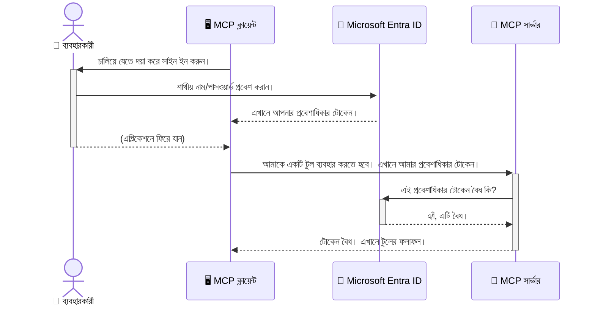

# AI ওয়ার্কফ্লো সুরক্ষা: মডেল কন্টেক্সট প্রোটোকল সার্ভারগুলির জন্য Entra ID প্রমাণীকরণ

## পরিচিতি
আপনার মডেল কন্টেক্সট প্রোটোকল (MCP) সার্ভার সুরক্ষিত রাখা ঠিক তেমনই গুরুত্বপূর্ণ যেমন আপনার বাড়ির সামনের দরজাটি তালাবদ্ধ রাখা। আপনার MCP সার্ভার খোলা রেখে দিলে, আপনার টুল এবং ডেটা অনুমোদিত নয় এমন কারো অ্যাক্সসের কাছে চলে যেতে পারে, যা নিরাপত্তা লঙ্ঘনের কারণ হতে পারে। মাইক্রোসফট Entra ID একটি মজবুত ক্লাউড-ভিত্তিক সনাক্তকরণ ও প্রবেশাধিকার ব্যবস্থাপনা সমাধান প্রদান করে, যা নিশ্চিত করে যে শুধুমাত্র অনুমোদিত ব্যবহারকারী এবং অ্যাপ্লিকেশনই আপনার MCP সার্ভারের সাথে ইন্টারঅ্যাক্ট করতে পারে। এই অংশে, আপনি শিখবেন কিভাবে Entra ID প্রমাণীকরণ ব্যবহার করে আপনার AI ওয়ার্কফ্লোগুলো সুরক্ষিত করবেন।

## শেখার উদ্দেশ্য
এই অংশ শেষ করার পর, আপনি সক্ষম হবেন:

- MCP সার্ভারগুলো সুরক্ষিত রাখার গুরুত্ব বুঝতে।
- মাইক্রোসফট Entra ID এবং OAuth 2.0 প্রমাণীকরণের মৌলিক বিষয়গুলো ব্যাখ্যা করতে।
- পাবলিক এবং কনফিডেনশিয়াল ক্লায়েন্টের মধ্যে পার্থক্য চিনতে।
- স্থানীয় (পাবলিক ক্লায়েন্ট) এবং রিমোট (কনফিডেনশিয়াল ক্লায়েন্ট) MCP সার্ভার পরিস্থিতিতে Entra ID প্রমাণীকরণ বাস্তবায়ন করতে।
- AI ওয়ার্কফ্লো উন্নয়নের সময় নিরাপত্তার সেরা অনুশীলন প্রয়োগ করতে।

## নিরাপত্তা এবং MCP

যেমন আপনি আপনার বাড়ির সামনের দরজাটি তালাবদ্ধ না রেখে যাবেন না, ঠিক তেমনই আপনি আপনার MCP সার্ভারকে যে কেউ অ্যাক্সেস করতে পারবেন এমন ভাবে খোলা রাখতে পারবেন না। আপনার AI ওয়ার্কফ্লোগুলো সুরক্ষিত রাখা প্রয়োজন যাতে শক্তিশালী, বিশ্বাসযোগ্য এবং নিরাপদ অ্যাপ্লিকেশন তৈরি করা যায়। এই অধ্যায়ে, আপনি শিখবেন কীভাবে মাইক্রোসফট Entra ID ব্যবহার করে আপনার MCP সার্ভারগুলো সুরক্ষিত করবেন, যার মাধ্যমে শুধুমাত্র অনুমোদিত ব্যবহারকারী এবং অ্যাপ্লিকেশনই আপনার টুল এবং ডেটার সাথে ইন্টারঅ্যাক্ট করতে পারবে।

## MCP সার্ভারগুলোর জন্য নিরাপত্তা কেন গুরুত্বপূর্ণ

ধরুন আপনার MCP সার্ভারে এমন একটি টুল আছে যা ইমেল পাঠাতে পারে বা গ্রাহক ডাটাবেসে অ্যাক্সেস করতে পারে। একটি অ-সুরক্ষিত সার্ভার মানে যে কেউ ঐ টুলটি ব্যবহার করতে পারে, যা অনুমোদিত নয় এমন ডেটা অ্যাক্সেস, স্প্যাম, বা অন্যান্য ক্ষতিকারক কার্যকলাপ সৃষ্টি করতে পারে।

প্রমাণীকরণ বাস্তবায়নের মাধ্যমে, আপনি নিশ্চিত করেন যে আপনার সার্ভারে প্রতিটি অনুরোধ যাচাই করা হয়েছে, অনুরোধকারী ব্যবহারকারী বা অ্যাপ্লিকেশনের পরিচয় নিশ্চিত হয়েছে। এটি আপনার AI ওয়ার্কফ্লো সুরক্ষার প্রথম এবং সবচেয়ে গুরুত্বপূর্ণ পদক্ষেপ।

## মাইক্রোসফট Entra ID পরিচিতি

[**Microsoft Entra ID**](https://adoption.microsoft.com/microsoft-security/entra/) একটি ক্লাউড-ভিত্তিক সনাক্তকরণ এবং প্রবেশাধিকার ব্যবস্থাপনা সেবা। এটি আপনার অ্যাপ্লিকেশনের জন্য একটি সার্বজনীন নিরাপত্তা রক্ষী হিসেবে বিবেচিত হতে পারে। এটি ব্যবহারকারীর পরিচয় যাচাই (প্রমাণীকরণ) এবং তারা কী করতে পারবে তা নির্ধারণ (অনুমোদন) করার জটিল প্রক্রিয়া পরিচালনা করে।

Entra ID ব্যবহারের মাধ্যমে আপনি পারেন:

- ব্যবহারকারীদের জন্য নিরাপদ সাইন-ইন সক্ষম করা।
- API এবং পরিষেবাগুলো সুরক্ষিত রাখা।
- কেন্দ্রীয় স্থান থেকে প্রবেশাধিকার নীতি পরিচালনা করা।

MCP সার্ভারগুলোর জন্য, Entra ID একটি শক্তিশালী এবং ব্যাপকভাবে বিশ্বাসযোগ্য সমাধান প্রদান করে যেটি পরিচালনা করে কে আপনার সার্ভারের ক্ষমতাগুলো অ্যাক্সেস করতে পারে।

---

## মায়াজালে প্রবেশ: Entra ID প্রমাণীকরণ কিভাবে কাজ করে

Entra ID **OAuth 2.0** মত খোলাখুলি মানদণ্ড ব্যবহার করে প্রমাণীকরণ পরিচালনা করে। যদিও বিস্তারিত জটিল হতে পারে, মূল ধারণাটি সহজ এবং একটি রূপকের মাধ্যমে বোঝা যেতে পারে।

### OAuth 2.0 এর সহজ পরিচিতি: ভ্যালেট চাবি

OAuth 2.0 কে ভাবুন আপনার গাড়ির জন্য একটি ভ্যালেট সার্ভিসের মতো। যখন আপনি একটি রেস্টুরেন্টে যান, আপনি আপনার মাস্টার কী ভ্যালেটকে দেন না। এর পরিবর্তে, আপনি একটি **ভ্যালেট চাবি** দেন যা সীমাবদ্ধ অনুমতি সহ - এটি গাড়ি চালু করতে এবং দরজা তালাবদ্ধ করতে পারে, কিন্তু ট্রাঙ্ক বা গ্লাভ কম্পার্টমেন্ট খুলতে পারে না।

এই রূপকে:

- **আপনি** হচ্ছেন **ব্যবহারকারী**।
- **আপনার গাড়ি** হচ্ছে **MCP সার্ভার** যার মূল্যবান টুল এবং ডেটা আছে।
- **ভ্যালেট** হচ্ছে **মাইক্রোসফট Entra ID**।
- **পার্কিং অ্যাটেনডেন্ট** হচ্ছে **MCP ক্লায়েন্ট** (অ্যাপ্লিকেশন যেটি সার্ভারে প্রবেশ করতে চায়)।
- **ভ্যালেট চাবি** হচ্ছে **অ্যাক্সেস টোকেন**।

অ্যাক্সেস টোকেন একটি নিরাপদ টেক্সট স্ট্রিং যা MCP ক্লায়েন্ট Entra ID থেকে সাইন-ইন করার পরে গ্রহণ করে। ক্লায়েন্ট প্রতিটি অনুরোধের সাথে এই টোকেনটি MCP সার্ভারকে প্রদান করে। সার্ভার টোকেন যাচাই করে নিশ্চিত করে যে অনুরোধটি বৈধ এবং ক্লায়েন্টের প্রয়োজনীয় অনুমতি আছে, সবই আপনার আসল পরিচয়পত্র (যেমন পাসওয়ার্ড) ব্যবহার না করেই।

### প্রমাণীকরণ প্রবাহ

প্রক্রিয়াটি বাস্তবে কীভাবে কাজ করে:




### মাইক্রোসফট প্রমাণীকরণ লাইব্রেরি (MSAL) পরিচিতি

কোডে প্রবেশ করার আগে, একটি গুরুত্বপূর্ণ উপাদান পরিচিত করা জরুরি যা আপনি উদাহরণগুলোতে দেখবেন: **মাইক্রোসফট প্রমাণীকরণ লাইব্রেরি (MSAL)**।

MSAL মাইক্রোসফট দ্বারা তৈরি একটি লাইব্রেরি যা ডেভেলপারদের জন্য প্রমাণীকরণ পরিচালনাকে অনেক সহজ করে তোলে। আপনাকে নিরাপত্তা টোকেন পরিচালনা, সাইন-ইন ম্যানেজ এবং সেশন রিফ্রেশ করার সব জটিল কোড নিজে লিখতে হয় না; MSAL এ সব কাজ করে দেয়।

MSAL ব্যবহারের পরামর্শ দেয়া হয় কারণ:

- **এটি নিরাপদ:** এটি শিল্প-মানের প্রটোকল এবং নিরাপত্তা সেরা অনুশীলন বাস্তবায়ন করে, আপনার কোডে দুর্বলতার ঝুঁকি কমায়।
- **উন্নয়ন সহজ করে:** এটি OAuth 2.0 এবং OpenID Connect প্রটোকলের জটিলতা লক করে দেয়, মাত্র কয়েক লাইনে আপনার অ্যাপ্লিকেশনে শক্তিশালী প্রমাণীকরণ যোগ করা সম্ভব হয়।
- **এটি রক্ষণাবেক্ষিত হয়:** মাইক্রোসফট সক্রিয়ভাবে MSAL রক্ষা ও আপডেট করে নতুন নিরাপত্তা হুমকি ও প্ল্যাটফর্ম পরিবর্তনের বিরুদ্ধে।

MSAL .NET, JavaScript/TypeScript, Python, Java, Go, এবং iOS ও Android মত মোবাইল প্ল্যাটফর্মসহ বিভিন্ন ভাষা ও অ্যাপ্লিকেশন ফ্রেমওয়ার্ক সমর্থন করে। এটি অর্থ যে আপনার প্রযুক্তি স্ট্যাক জুড়ে একই ধারাবাহিক প্রমাণীকরণ প্যাটার্ন ব্যবহার করতে পারবেন।

MSAL সম্পর্কে আরও জানতে, আপনি অফিসিয়াল [MSAL ওভারভিউ ডকুমেন্টেশন](https://learn.microsoft.com/entra/identity-platform/msal-overview) দেখতে পারেন।

---

## Entra ID দিয়ে আপনার MCP সার্ভার সুরক্ষিত করা: ধাপে ধাপে নির্দেশিকা

এখন, চলুন দেখেন কিভাবে Entra ID ব্যবহার করে একটি স্থানীয় MCP সার্ভার (যেটি `stdio` এর মাধ্যমে যোগাযোগ করে) সুরক্ষিত করবেন। এই উদাহরণে একটি **পাবলিক ক্লায়েন্ট** ব্যবহার হয়েছে, যা ব্যবহারকারীর কম্পিউটারে চালিত অ্যাপ্লিকেশন যেমন ডেস্কটপ অ্যাপ বা স্থানীয় ডেভেলপমেন্ট সার্ভারের জন্য উপযুক্ত।

### দৃশ্য ১: একটি স্থানীয় MCP সার্ভার সুরক্ষিত করা (পাবলিক ক্লায়েন্ট নিয়ে)

এই দৃশ্যে, আমরা এমন একটি MCP সার্ভার দেখব যা লোকালি চলে, `stdio` এর মাধ্যমে যোগাযোগ করে এবং ব্যবহারকারীকে অ্যাক্সেস দেওয়ার আগে Entra ID দিয়ে প্রমাণীকরণ করে। সার্ভারে একটি টুল থাকবে যা মাইক্রোসফট গ্রাফ API থেকে ব্যবহারকারীর প্রোফাইল তথ্য আনে।

#### ১। Entra ID-তে অ্যাপ্লিকেশন সেটআপ করা

কোনো কোড লেখার আগেই, আপনাকে আপনার অ্যাপ্লিকেশনটি মাইক্রোসফট Entra ID-তে নিবন্ধন করতে হবে। এটি Entra ID-কে আপনার অ্যাপ্লিকেশন সম্পর্কে জানাবে এবং প্রমাণীকরণ সেবা ব্যবহারের অনুমতি দেবে।

1. **[Microsoft Entra পোর্টাল](https://entra.microsoft.com/)** এ যান।
2. **App registrations** এ যান এবং **New registration** ক্লিক করুন।
3. আপনার অ্যাপ্লিকেশনের একটি নাম দিন (যেমন, "My Local MCP Server")।
4. **Supported account types** এ **Accounts in this organizational directory only** নির্বাচন করুন।
5. এই উদাহরণের জন্য **Redirect URI** ফাঁকা রাখুন।
6. **Register** ক্লিক করুন।

নিবন্ধনের পর, আপনার কোডে প্রয়োজন হবে এমন **Application (client) ID** এবং **Directory (tenant) ID** নোট করে রাখুন।

#### ২। কোড: একটি বিশ্লেষণ

চলুন কোডের মূল অংশগুলো দেখি যা প্রমাণীকরণ পরিচালনা করে। এই উদাহরণের পূর্ণ কোড [Entra ID - Local - WAM](https://github.com/Azure-Samples/mcp-auth-servers/tree/main/src/entra-id-local-wam) ফোল্ডারে পাওয়া যাবে, যা [mcp-auth-servers GitHub রিপোজিটরি](https://github.com/Azure-Samples/mcp-auth-servers) এর অংশ।

**`AuthenticationService.cs`**

এই ক্লাস Entra ID-এর সাথে ইন্টারঅ্যাকশন পরিচালনা করে।

- **`CreateAsync`**: এই মেথড MSAL (Microsoft Authentication Library) থেকে `PublicClientApplication` ইনিশিয়ালাইজ করে। এটি আপনার অ্যাপ্লিকেশনের `clientId` এবং `tenantId` দিয়ে কনফিগার করা হয়।
- **`WithBroker`**: এটি একটি ব্রোকার (যেমন উইন্ডোজ ওয়েব অ্যাকাউন্ট ম্যানেজার) ব্যবহার করার সক্ষমতা দেয়, যা আরও নিরাপদ এবং সিমলেস সিঙ্গল সাইন-অনের অভিজ্ঞতা দেয়।
- **`AcquireTokenAsync`**: এটি প্রধান মেথড। প্রথমে এটি চুপচাপ একটা টোকেন পাওয়ার চেষ্টা করে (অর্থাৎ যদি সেশন এখনও বৈধ থাকে তাহলে ব্যবহারকারীকে আবার সাইন-ইন করতে হবে না)। যদি চুপচাপ টোকেন পাওয়া না যায়, তবে ব্যবহারকারীকে ইন্টারঅ্যাক্টিভ সাইন-ইনের জন্য বলা হয়।

```csharp
// Simplified for clarity
public static async Task<AuthenticationService> CreateAsync(ILogger<AuthenticationService> logger)
{
    var msalClient = PublicClientApplicationBuilder
        .Create(_clientId) // Your Application (client) ID
        .WithAuthority(AadAuthorityAudience.AzureAdMyOrg)
        .WithTenantId(_tenantId) // Your Directory (tenant) ID
        .WithBroker(new BrokerOptions(BrokerOptions.OperatingSystems.Windows))
        .Build();

    // ... cache registration ...

    return new AuthenticationService(logger, msalClient);
}

public async Task<string> AcquireTokenAsync()
{
    try
    {
        // Try silent authentication first
        var accounts = await _msalClient.GetAccountsAsync();
        var account = accounts.FirstOrDefault();

        AuthenticationResult? result = null;

        if (account != null)
        {
            result = await _msalClient.AcquireTokenSilent(_scopes, account).ExecuteAsync();
        }
        else
        {
            // If no account, or silent fails, go interactive
            result = await _msalClient.AcquireTokenInteractive(_scopes).ExecuteAsync();
        }

        return result.AccessToken;
    }
    catch (Exception ex)
    {
        _logger.LogError(ex, "An error occurred while acquiring the token.");
        throw; // Optionally rethrow the exception for higher-level handling
    }
}
```


**`Program.cs`**

এখানে MCP সার্ভার সেটআপ করা হয় এবং প্রমাণীকরণ সার্ভিস ইন্টিগ্রেট করা হয়।

- **`AddSingleton<AuthenticationService>`**: এটি `AuthenticationService` কে ডিপেনডেন্সি ইনজেকশন কন্টেইনারে নিবন্ধন করে, যাতে অ্যাপ্লিকেশনের অন্যান্য অংশ (যেমন আমাদের টুল) এটি ব্যবহার করতে পারে।
- **`GetUserDetailsFromGraph` টুল**: এই টুলটি একটি `AuthenticationService` এর ইনস্ট্যান্স প্রয়োজন। এর আগে এটি `authService.AcquireTokenAsync()` কল করে একটি বৈধ অ্যাক্সেস টোকেন পায়। প্রমাণীকরণ সফল হলে, এটি টোকেন ব্যবহার করে মাইক্রোসফট গ্রাফ API কল করে ব্যবহারকারীর বিস্তারিত আনে।

```csharp
// Simplified for clarity
[McpServerTool(Name = "GetUserDetailsFromGraph")]
public static async Task<string> GetUserDetailsFromGraph(
    AuthenticationService authService)
{
    try
    {
        // This will trigger the authentication flow
        var accessToken = await authService.AcquireTokenAsync();

        // Use the token to create a GraphServiceClient
        var graphClient = new GraphServiceClient(
            new BaseBearerTokenAuthenticationProvider(new TokenProvider(authService)));

        var user = await graphClient.Me.GetAsync();

        return System.Text.Json.JsonSerializer.Serialize(user);
    }
    catch (Exception ex)
    {
        return $"Error: {ex.Message}";
    }
}
```


#### ৩। কিভাবে সব মিলিয়ে কাজ করে

1. MCP ক্লায়েন্ট যখন `GetUserDetailsFromGraph` টুল ব্যবহার করতে চায়, টুলটি প্রথমে `AcquireTokenAsync` কল করে।
2. `AcquireTokenAsync` MSAL লাইব্রেরিকে বৈধ টোকেন আছে কি না পরীক্ষা করতে বলে।
3. যদি কোন টোকেন না থাকে, MSAL ব্রোকারের মাধ্যমে ব্যবহারকারীকে তাদের Entra ID অ্যাকাউন্ট দিয়ে সাইন-ইনের জন্য বলে।
4. ব্যবহারকারী সাইন-ইন করলে, Entra ID একটি অ্যাক্সেস টোকেন ইস্যু করে।
5. টুলটি টোকেন গ্রহণ করে এবং এটি ব্যবহার করে মাইক্রোসফট গ্রাফ API-কে নিরাপদ কল করে।
6. ব্যবহারকারীর বিস্তারিত MCP ক্লায়েন্টকে ফেরত দেয়া হয়।

এই প্রক্রিয়াটি নিশ্চিত করে যে শুধুমাত্র প্রমাণীকৃত ব্যবহারকারীই টুল ব্যবহার করতে পারে, ফলে আপনার স্থানীয় MCP সার্ভার সুরক্ষিত হয়।

### দৃশ্য ২: একটি রিমোট MCP সার্ভার সুরক্ষিত করা (কনফিডেনশিয়াল ক্লায়েন্ট নিয়ে)

যখন আপনার MCP সার্ভার একটি দূরবর্তী মেশিনে (যেমন ক্লাউড সার্ভার) চলছে এবং HTTP Streaming এর মত প্রোটোকল ব্যবহার করে যোগাযোগ করছে, তখন নিরাপত্তার চাহিদাগুলো আলাদা হয়। এই ক্ষেত্রে, আপনাকে একটি **কনফিডেনশিয়াল ক্লায়েন্ট** এবং **Authorization Code Flow** ব্যবহার করতে হবে। এটি একটি অধিক নিরাপদ পদ্ধতি, কারণ অ্যাপ্লিকেশনের সিক্রেট ব্রাউজারে কখনো প্রকাশ পায় না।

এই উদাহরণে TypeScript ভিত্তিক একটি MCP সার্ভার ব্যবহার হয়েছে, যা Express.js ব্যবহার করে HTTP অনুরোধ পরিচালনা করে।

#### ১। Entra ID-তে অ্যাপ্লিকেশন সেটআপ করা

Entra ID-তে সেটআপ পাবলিক ক্লায়েন্টের মতই, তবে একটি গুরুত্বপূর্ণ পার্থক্য হলো—আপনাকে একটি **ক্লায়েন্ট সিক্রেট** তৈরি করতে হবে।

1. **[Microsoft Entra পোর্টাল](https://entra.microsoft.com/)** এ যান।
2. আপনার অ্যাপ নিবন্ধনের মধ্যে **Certificates & secrets** ট্যাবে যান।
3. **New client secret** ক্লিক করুন, একটি বর্ণনা দিন, এবং **Add** ক্লিক করুন।
4. **গুরুত্বপূর্ণ:** সিক্রেট মানটি অবিলম্বে কপি করে রাখুন। পরে আর এটি দেখা যাবে না।
5. আপনাকে একটি **Redirect URI** কনফিগার করতে হবে। **Authentication** ট্যাবে যান, **Add a platform** ক্লিক করুন, **Web** নির্বাচন করুন, এবং আপনার অ্যাপ্লিকেশনের Redirect URI দিন (যেমন `http://localhost:3001/auth/callback`)।

> **⚠️ গুরুত্বপূর্ণ নিরাপত্তা টিপস:** প্রোডাকশন অ্যাপ্লিকেশনগুলোর জন্য, মাইক্রোসফট প্রভাবশালীভাবে সুপারিশ করে **সিক্রেটলেস প্রমাণীকরণ** পদ্ধতি যেমন **Managed Identity** বা **Workload Identity Federation** ব্যবহার করতে, ক্লায়েন্ট সিক্রেটের পরিবর্তে। ক্লায়েন্ট সিক্রেট নিরাপত্তার ঝুঁকি সৃষ্টি করে কারণ সেগুলো প্রকাশিত বা কমপ্রোমাইজ হতে পারে। ম্যানেজড আইডেনটিটি একটি অধিক নিরাপদ পন্থা প্রদান করে, কারণ এতে আপনার কোড বা কনফিগারেশনে পরিচয়পত্র সংরক্ষণ করার প্রয়োজন নেই।
>
> ম্যানেজড আইডেনটিটি এবং তাদের বাস্তবায়ন সম্পর্কে আরও তথ্যের জন্য দেখুন [Managed identities for Azure resources overview](https://learn.microsoft.com/entra/identity/managed-identities-azure-resources/overview)।

#### ২। কোড: একটি বিশ্লেষণ

এই উদাহরণে সেশন-ভিত্তিক পদ্ধতি ব্যবহার হয়েছে। যখন ব্যবহারকারী প্রমাণীকৃত হয়, তখন সার্ভার অ্যাক্সেস টোকেন এবং রিফ্রেশ টোকেন সেশনে সংরক্ষণ করে এবং ব্যবহারকারীকে একটি সেশন টোকেন দেয়। এরপর পরবর্তী অনুরোধগুলির জন্য এই সেশন টোকেন ব্যবহৃত হয়। পুরো কোড [Entra ID - Confidential client](https://github.com/Azure-Samples/mcp-auth-servers/tree/main/src/entra-id-cca-session) ফোল্ডারে পাওয়া যাবে, যা [mcp-auth-servers GitHub রিপোজিটরি](https://github.com/Azure-Samples/mcp-auth-servers) এর অংশ।

**`Server.ts`**

এই ফাইলটি Express সার্ভার এবং MCP ট্রান্সপোর্ট লেয়ার সেটআপ করে।

- **`requireBearerAuth`**: এটি একটি মিডলওয়্যার যা `/sse` এবং `/message` এন্ডপয়েন্টগুলো সুরক্ষিত রাখে। এটি অনুরোধের `Authorization` হেডারে বৈধ বেয়ারার টোকেন আছে কিনা যাচাই করে।
- **`EntraIdServerAuthProvider`**: এটি একটি কাস্টম ক্লাস যা `McpServerAuthorizationProvider` ইন্টারফেস বাস্তবায়ন করে। এটি OAuth 2.0 প্রবাহ পরিচালনার জন্য দায়ী।
- **`/auth/callback`**: এই এন্ডপয়েন্টটি ব্যবহারকারী প্রমাণীকরণের পর Entra ID থেকে রিডাইরেক্ট গ্রহণ করে। এটি অথরাইজেশন কোডকে অ্যাক্সেস টোকেন এবং রিফ্রেশ টোকেনে পরিবর্তন করে।

```typescript
// স্পষ্টতার জন্য সরলীকৃত
const app = express();
const { server } = createServer();
const provider = new EntraIdServerAuthProvider();

// SSE এন্ডপয়েন্ট সুরক্ষিত করুন
app.get("/sse", requireBearerAuth({
  provider,
  requiredScopes: ["User.Read"]
}), async (req, res) => {
  // ... পরিবহনে সংযোগ করুন ...
});

// মেসেজ এন্ডপয়েন্ট সুরক্ষিত করুন
app.post("/message", requireBearerAuth({
  provider,
  requiredScopes: ["User.Read"]
}), async (req, res) => {
  // ... মেসেজ পরিচালনা করুন ...
});

// OAuth 2.0 কলব্যাক পরিচালনা করুন
app.get("/auth/callback", (req, res) => {
  provider.handleCallback(req.query.code, req.query.state)
    .then(result => {
      // ... সাফল্য বা ব্যর্থতা পরিচালনা করুন ...
    });
});
```


**`Tools.ts`**

এই ফাইল MCP সার্ভার দেওয়া টুলগুলো সংজ্ঞায়িত করে। `getUserDetails` টুলের কাজ আগের উদাহরণের মত, তবে এটি অ্যাক্সেস টোকেন সেশন থেকে নেয়।

```typescript
// স্পষ্টতার জন্য সহজ করা হয়েছে
server.setRequestHandler(CallToolRequestSchema, async (request) => {
  const { name } = request.params;
  const context = request.params?.context as { token?: string } | undefined;
  const sessionToken = context?.token;

  if (name === ToolName.GET_USER_DETAILS) {
    if (!sessionToken) {
      throw new AuthenticationError("Authentication token is missing or invalid. Ensure the token is provided in the request context.");
    }

    // সেশন স্টোর থেকে Entra ID টোকেন পান
    const tokenData = tokenStore.getToken(sessionToken);
    const entraIdToken = tokenData.accessToken;

    const graphClient = Client.init({
      authProvider: (done) => {
        done(null, entraIdToken);
      }
    });

    const user = await graphClient.api('/me').get();

    // ... ব্যবহারকারীর বিবরণ ফিরিয়ে দিন ...
  }
});
```


**`auth/EntraIdServerAuthProvider.ts`**

এই ক্লাসের কাজ:

- ব্যবহারকারীকে Entra ID সাইন-ইন পেজে রিডাইরেক্ট করা।
- অথরাইজেশন কোডকে অ্যাক্সেস টোকেনের সাথে বিনিময় করা।
- `tokenStore` এ টোকেনগুলো সংরক্ষণ করা।
- অ্যাক্সেস টোকেন মেয়াদ উত্তীর্ণ হলে রিফ্রেশ করা।

#### ৩। কিভাবে সব মিলিয়ে কাজ করে

1. যখন একটি ব্যবহারকারী প্রথমবার MCP সার্ভারে কানেক্ট করার চেষ্টা করে, `requireBearerAuth` মিডলওয়্যার দেখতে পায় তাদের বৈধ সেশন নেই এবং তাদের Entra ID সাইন-ইন পেজে রিডাইরেক্ট করে।
2. ব্যবহারকারী তাদের Entra ID অ্যাকাউন্ট দিয়ে সাইন-ইন করে।
3. Entra ID ব্যবহারকারীকে `/auth/callback` এন্ডপয়েন্টে একটি অনুমোদন কোড সহ ফেরত প্রেরণ করে।
4. সার্ভার কোডটি ব্যবহার করে একটি অ্যাক্সেস টোকেন এবং একটি রিফ্রেশ টোকেন বিনিময় করে, সেগুলো সংরক্ষণ করে, এবং একটি সেশন টোকেন তৈরি করে যা ক্লায়েন্টকে পাঠানো হয়।
5. ক্লায়েন্ট এখন এই সেশন টোকেনটি `Authorization` হেডারে ব্যবহার করে ভবিষ্যতের সকল MCP সার্ভারের অনুরোধের জন্য।
6. যখন `getUserDetails` টুলটি কল করা হয়, তখন এটি সেশন টোকেন ব্যবহার করে Entra ID অ্যাক্সেস টোকেনটি খোঁজে এবং তারপর সেটি ব্যবহার করে Microsoft Graph API কল করে।

এই ফ্লোটি পাবলিক ক্লায়েন্ট ফ্লো থেকে বেশি জটিল, তবে ইন্টারনেট-মুখী এন্ডপয়েন্টগুলোর জন্য এটি প্রয়োজনীয়। যেহেতু রিমোট MCP সার্ভারগুলো পাবলিক ইন্টারনেটের মাধ্যমে প্রবেশযোগ্য, সেগুলোর জন্য অননুমোদিত প্রবেশ এবং সম্ভাব্য আক্রমণ থেকে রক্ষা করার জন্য শক্তিশালী নিরাপত্তা ব্যবস্থা দরকার।


## নিরাপত্তার সর্বোত্তম অনুশীলনসমূহ

- **সবসময় HTTPS ব্যবহার করুন**: ক্লায়েন্ট এবং সার্ভারের মধ্যে যোগাযোগ এনক্রিপ্ট করুন যাতে টোকেনগুলো অবৈধভাবে আটকানো থেকে সুরক্ষিত থাকে।
- **রোল-ভিত্তিক অ্যাক্সেস নিয়ন্ত্রণ (RBAC) প্রয়োগ করুন**: শুধুমাত্র *ব্যবহারকারী প্রমাণীকৃত কিনা* তা যাচাই করবেন না; দেখুন তারা *কি কাজ করার অনুমোদন পেয়েছে*। Entra ID তে রোল সংজ্ঞায়িত করতে পারেন এবং আপনার MCP সার্ভারে সেগুলো যাচাই করতে পারেন।
- **নজরদারি এবং নিরীক্ষণ করুন**: সব প্রমাণীকরণ ঘটনাগুলো লগ করুন যাতে সন্দেহজনক কার্যকলাপ শনাক্ত ও প্রতিক্রিয়া জানাতে পারেন।
- **রেট সীমাবদ্ধতা এবং চাপ কমানো পরিচালনা করুন**: Microsoft Graph এবং অন্যান্য API দারুণভাবে রেট সীমাবদ্ধতা প্রয়োগ করে অপব্যবহার রোধ করার জন্য। HTTP 429 (Too Many Requests) প্রতিক্রিয়া মোকাবিলার জন্য MCP সার্ভারে এক্সপোনেনশিয়াল ব্যাকঅফ এবং পুনরায় চেষ্টা লজিক প্রয়োগ করুন। API কল কমানোর জন্য প্রায়ই ব্যবহৃত ডেটা ক্যাশ করার কথা ভাবুন।
- **টোকেন সুরক্ষিত সংরক্ষণ করুন**: অ্যাক্সেস টোকেন ও রিফ্রেশ টোকেন নির্ভরযোগ্যভাবে সংরক্ষণ করুন। লোকাল অ্যাপ্লিকেশনগুলোর জন্য সিস্টেমের সিকিউর স্টোরেজ ব্যবহৃত করুন। সার্ভার অ্যাপ্লিকেশনগুলোর জন্য এনক্রিপ্টেড স্টোরেজ বা Azure Key Vault এর মত সিকিউর কী ম্যানেজমেন্ট সার্ভিস ব্যবহার করার কথা বিবেচনা করুন।
- **টোকেন মেয়াদ উত্তীর্ণ পরিচালনা**: অ্যাক্সেস টোকেনের জীবিত্তকাল সীমিত। পুনরায় প্রমাণীকরণের প্রয়োজন ছাড়াই ধারাবাহিক ইউজার অভিজ্ঞতার জন্য রিফ্রেশ টোকেন ব্যবহার করে স্বয়ংক্রিয় টোকেন রিফ্রেশ প্রয়োগ করুন।
- **Azure API Management ব্যবহার করার কথা ভাবুন**: যদিও MCP সার্ভারে সরাসরি নিরাপত্তা বাস্তবায়নে সূক্ষ্ম নিয়ন্ত্রণ পাওয়া যায়, API গেটওয়ে যেমন Azure API Management স্বয়ংক্রিয়ভাবে অনেক নিরাপত্তা উদ্বেগ হ্যান্ডেল করতে পারে, যার মধ্যে প্রমাণীকরণ, অনুমোদন, রেট সীমাবদ্ধতা, ও নজরদারি অন্তর্ভুক্ত। এটি একটি কেন্দ্রীয় নিরাপত্তা স্তর সরবরাহ করে যা আপনার ক্লায়েন্ট এবং MCP সার্ভারের মধ্যে থাকে। MCP এর জন্য API গেটওয়ে ব্যবহারের বিষয়ে আরও জানতে আমাদের [Azure API Management Your Auth Gateway For MCP Servers](https://techcommunity.microsoft.com/blog/integrationsonazureblog/azure-api-management-your-auth-gateway-for-mcp-servers/4402690) দেখুন।


## মূল বিষয়বস্তু

- আপনার MCP সার্ভার সুরক্ষিত করা আপনার ডেটা এবং টুলস রক্ষা করার জন্য অত্যন্ত গুরুত্বপূর্ণ।
- Microsoft Entra ID প্রমাণীকরণ এবং অনুমোদনের জন্য শক্তিশালী ও বিস্তৃত সমাধান প্রদান করে।
- লোকাল অ্যাপ্লিকেশনগুলোর জন্য **পাবলিক ক্লায়েন্ট** এবং রিমোট সার্ভারগুলোর জন্য **গোপনীয় ক্লায়েন্ট** ব্যবহার করুন।
- ওয়েব অ্যাপ্লিকেশনের জন্য **Authorization Code Flow** সবচেয়ে সুরক্ষিত বিকল্প।


## অনুশীলন

1. একটি MCP সার্ভার আপনি বানাতে চান তা ভাবুন। এটি কি একটি লোকাল সার্ভার হবে নাকি রিমোট সার্ভার?
2. আপনার উত্তর অনুসারে, আপনি কি পাবলিক ক্লায়েন্ট ব্যবহার করবেন নাকি গোপনীয় ক্লায়েন্ট?
3. Microsoft Graph এর বিরুদ্ধে কাজ করার জন্য আপনার MCP সার্ভার কোন অনুমতি চাবে?


## হাতে কলম অনুশীলন

### অনুশীলন ১: Entra ID তে একটি অ্যাপ্লিকেশন নিবন্ধন করুন
Microsoft Entra পোর্টালে যান।
আপনার MCP সার্ভারের জন্য একটি নতুন অ্যাপ্লিকেশন নিবন্ধন করুন।
Application (client) ID এবং Directory (tenant) ID নোট করুন।

### অনুশীলন ২: লোকাল MCP সার্ভার সুরক্ষিত করুন (পাবলিক ক্লায়েন্ট)
- ব্যবহারকারী প্রমাণীকরণের জন্য MSAL (Microsoft Authentication Library) এর কোড উদাহরণ অনুসরণ করুন।
- Microsoft Graph থেকে ব্যবহারকারী বিবরণ আনতে MCP টুলটি কল করে প্রমাণীকরণ ফ্লো পরীক্ষা করুন।

### অনুশীলন ৩: রিমোট MCP সার্ভার সুরক্ষিত করুন (গোপনীয় ক্লায়েন্ট)
- Entra ID তে একটি গোপনীয় ক্লায়েন্ট নিবন্ধন করুন এবং ক্লায়েন্ট সিক্রেট তৈরি করুন।
- আপনার Express.js MCP সার্ভার Authorization Code Flow ব্যবহার করার জন্য কনফিগার করুন।
- সংরক্ষিত এন্ডপয়েন্টগুলো পরীক্ষা করুন এবং টোকেন-ভিত্তিক অ্যাক্সেস নিশ্চিত করুন।

### অনুশীলন ৪: নিরাপত্তার সর্বোত্তম অনুশীলন প্রয়োগ করুন
- আপনার লোকাল বা রিমোট সার্ভারের জন্য HTTPS সক্ষম করুন।
- আপনার সার্ভার লজিকে রোল-ভিত্তিক অ্যাক্সেস নিয়ন্ত্রণ (RBAC) বাস্তবায়ন করুন।
- টোকেন মেয়াদ উত্তীর্ণ পরিচালনা এবং সুরক্ষিত টোকেন সংরক্ষণ যুক্ত করুন।

## সম্পদসমূহ

1. **MSAL ওভারভিউ ডকুমেন্টেশন**  
   Microsoft Authentication Library (MSAL) কীভাবে বিভিন্ন প্ল্যাটফর্মে নিরাপদে টোকেন অর্জন সক্ষম করে সে সম্পর্কে জানুন:  
   [MSAL Overview on Microsoft Learn](https://learn.microsoft.com/en-gb/entra/msal/overview)

2. **Azure-Samples/mcp-auth-servers গিটহাব রিপোজিটরি**  
   MCP সার্ভারগুলোর প্রমাণীকরণ ফ্লোগুলোর রেফারেন্স বাস্তবায়ন:  
   [Azure-Samples/mcp-auth-servers on GitHub](https://github.com/Azure-Samples/mcp-auth-servers)

3. **Azure Resources এর জন্য Managed Identities ওভারভিউ**  
   সিক্রেট ব্যতীত সিস্টেম অথবা ব্যবহারকারী-নির্ধারিত ব্যবস্থাপিত পরিচয় ব্যবহার করার উপায় বুঝুন:  
   [Managed Identities Overview on Microsoft Learn](https://learn.microsoft.com/en-us/entra/identity/managed-identities-azure-resources/)

4. **Azure API Management: MCP সার্ভারের জন্য আপনার অথ গেটওয়ে**  
   MCP সার্ভারের জন্য সুরক্ষিত OAuth2 গেটওয়ে হিসেবে APIM ব্যবহারের বিস্তারিত:  
   [Azure API Management Your Auth Gateway For MCP Servers](https://techcommunity.microsoft.com/blog/integrationsonazureblog/azure-api-management-your-auth-gateway-for-mcp-servers/4402690)

5. **Microsoft Graph Permissions Reference**  
   Microsoft Graph এর জন্য দলিলভুক্ত এবং অ্যাপ্লিকেশন অনুমতিসমূহের ব্যাপক তালিকা:  
   [Microsoft Graph Permissions Reference](https://learn.microsoft.com/zh-tw/graph/permissions-reference)


## শেখার ফলাফল
এই অংশ সম্পন্ন করার পর আপনি সক্ষম হবেন:

- MCP সার্ভার এবং AI ওয়ার্কফ্লোর জন্য কেন প্রমাণীকরণ গুরুত্বপূর্ণ তা ব্যাখ্যা করতে।
- লোকাল এবং রিমোট MCP সার্ভার পরিস্থিতির জন্য Entra ID প্রমাণীকরণ সেটআপ ও কনফিগার করতে।
- আপনার সার্ভারের ডিপ্লয়মেন্ট অনুসারে উপযুক্ত ক্লায়েন্ট টাইপ (পাবলিক বা গোপনীয়) নির্বাচন করতে।
- নিরাপদ কোডিং অনুশীলন বাস্তবায়ন করতে, যার মধ্যে টোকেন সংরক্ষণ এবং রোল-ভিত্তিক অনুমোদন অন্তর্ভুক্ত।
- আপনার MCP সার্ভার এবং এর টুলগুলোকে অননুমোদিত প্রবেশ থেকে আত্মবিশ্বাসের সাথে সুরক্ষিত রাখতে।

## পরবর্তী কি

- [5.13 Model Context Protocol (MCP) Integration with Microsoft Foundry](../mcp-foundry-agent-integration/README.md)

---

<!-- CO-OP TRANSLATOR DISCLAIMER START -->
**অস্বীকৃতি**:
এই নথিটি AI অনুবাদ পরিষেবা [Co-op Translator](https://github.com/Azure/co-op-translator) ব্যবহার করে অনূদিত হয়েছে। যদিও আমরা শুদ্ধতার জন্য চেষ্টা করি, অনুগ্রহ করে মনে রাখবেন যে স্বয়ংক্রিয় অনুবাদে ত্রুটি বা অসঙ্গতি থাকতে পারে। মূল নথিটি তার স্বভাষায় কর্তৃত্বপূর্ণ উৎস হিসেবে বিবেচিত হওয়া উচিত। গুরুত্বপূর্ণ তথ্যের জন্য পেশাদার মানব অনুবাদ সুপারিশ করা হয়। এই অনুবাদের ব্যবহারে প্রয়োজনীয় ভুল বোঝাবুঝি বা ভুল ব্যাখ্যার জন্য আমরা দায়বদ্ধ নই।
<!-- CO-OP TRANSLATOR DISCLAIMER END -->