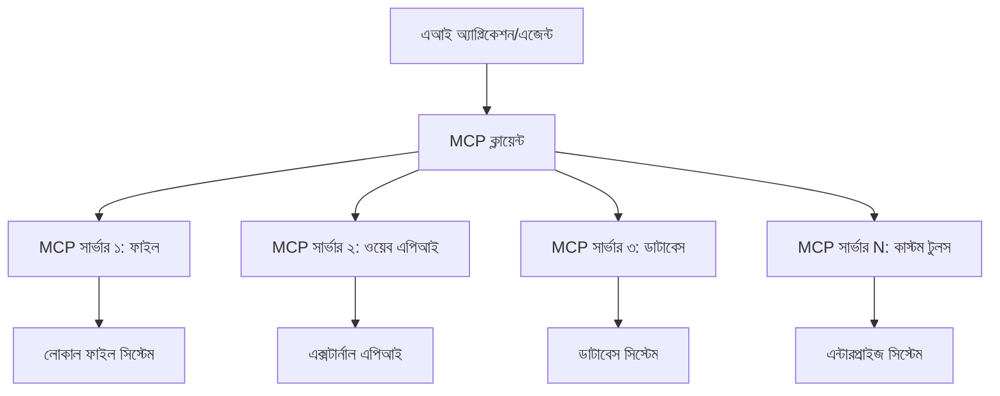

# 🌐 মডিউল ২: MCP সহ Microsoft Foundry Toolkit মৌলিক বিষয়গুলি

[]()
[]()
[]()

## 📋 শেখার লক্ষ্যসমূহ

এই মডিউলের শেষে, আপনি সক্ষম হবেন:
- ✅ Model Context Protocol (MCP) আর্কিটেকচার এবং সুবিধাগুলি বুঝতে
- ✅ Microsoft এর MCP সার্ভার ইকোসিস্টেম অন্বেষণ করতে
- ✅ MCP সার্ভারগুলোকে Microsoft Foundry Toolkit Agent Builder এর সাথে সংযুক্ত করতে
- ✅ Playwright MCP ব্যবহার করে একটি কার্যকর ব্রাউজার অটোমেশন এজেন্ট তৈরি করতে
- ✅ আপনার এজেন্টগুলোর মধ্যে MCP টুল কনফিগার ও পরীক্ষা করতে
- ✅ MCP-চালিত এজেন্টগুলি প্রোডাকশনে ব্যবহার করার জন্য এক্সপোর্ট ও ডিপ্লয় করতে

## 🎯 মডিউল ১ এর উপর ভিত্তি করে নির্মাণ

মডিউল ১-এ, আমরা Microsoft Foundry Toolkit এর বেসিক শিখেছি এবং আমাদের প্রথম Python Agent তৈরি করেছি। এখন আমরা আপনার এজেন্টগুলোকে **মডেল কন্টেক্সট প্রোটোকল (MCP)** এর মাধ্যমে বহিঃস্থ টুল এবং সেবার সাথে সংযুক্ত করে **সুপারচার্জ** করব।

এটা এমন যেমন সরল ক্যালকুলেটর থেকে সম্পূর্ণ কম্পিউটারে আপগ্রেড করা — আপনার AI এজেন্টগুলো পাবে সক্ষমতা:
- 🌐 ওয়েবসাইট ব্রাউজ এবং ইন্টারঅ্যাক্ট করার
- 📁 ফাইল অ্যাক্সেস ও পরিচালনা করার
- 🔧 এন্টারপ্রাইজ সিস্টেমের সাথে সংযুক্ত করার
- 📊 API থেকে রিয়েল-টাইম ডেটা প্রক্রিয়াকরণের

## 🧠 Model Context Protocol (MCP) বোঝা

### 🔍 MCP কী?

Model Context Protocol (MCP) হলো **"AI অ্যাপ্লিকেশনের জন্য USB-C"** — একটি বিপ্লবী খোলা স্ট্যান্ডার্ড যা লার্জ ল্যাঙ্গুয়েজ মডেলগুলো (LLMs) কে বহিরাগত টুল, ডেটা সোর্স এবং সেবা সঙ্গে সংযুক্ত করে। যেমন USB-C একটি ইউনিভার্সাল কানেক্টর দিয়ে ক্যাবল জঞ্জাল দূর করেছে, তেমনি MCP একটি মানসম্মত প্রোটোকলের মাধ্যমে AI ইন্টিগ্রেশন জটিলতা দূর করে।

### 🎯 MCP সমাধান করে যেসব সমস্যা

**MCP এর আগে:**
- 🔧 প্রতিটি টুলের জন্য কাস্টম ইন্টিগ্রেশন
- 🔄 প্রোপাইটারি সমাধানে ভেন্ডর লক-ইন  
- 🔒 স্বেচ্ছাসেবী সংযোগ থেকে সুরক্ষা ঝুঁকি
- ⏱️ মৌলিক ইন্টিগ্রেশনের জন্য মাসব্যাপী উন্নয়ন

**MCP এর সাথে:**
- ⚡ প্লাগ-এন্ড-প্লে টুল সংযুক্তি
- 🔄 ভেন্ডর-অ্যাগনস্টিক আর্কিটেকচার
- 🛡️ অন্তর্নির্মিত সুরক্ষা সেরা অনুশীলনগুলি
- 🚀 নতুন ফিচার যোগ করার জন্য কয়েক মিনিট

### 🏗️ MCP আর্কিটেকচার গভীর জ্ঞান

MCP একটি **ক্লায়েন্ট-সার্ভার আর্কিটেকচার** অনুসরণ করে যা একটি নিরাপদ, স্কেলযোগ্য ইকোসিস্টেম তৈরি করে:



**🔧 প্রধান উপাদান:**

| উপাদান | ভূমিকা | উদাহরণ |
|---------|---------|----------|
| **MCP হোস্টস** | MCP সেবা ব্যবহারকারী অ্যাপ্লিকেশন | Claude Desktop, VS Code, Microsoft Foundry Toolkit |
| **MCP ক্লায়েন্টস** | প্রোটোকল হ্যান্ডলার (সার্ভারের সাথে ১:১) | হোস্ট অ্যাপ্লিকেশনে অন্তর্ভুক্ত |
| **MCP সার্ভারস** | স্ট্যান্ডার্ড প্রোটোকল দ্বারা ক্ষমতা প্রদর্শন | Playwright, Files, Azure, GitHub |
| **ট্রান্সপোর্ট লেয়ার** | যোগাযোগ পদ্ধতি | stdio, HTTP, WebSockets |


## 🏢 Microsoft এর MCP সার্ভার ইকোসিস্টেম

Microsoft MCP ইকোসিস্টেমের নেতৃস্থানীয় প্রতিষ্ঠান যা বাস্তব ব্যবসায়িক প্রয়োজনীয়তা মেটাতে বিস্তৃত এন্টারপ্রাইজ-গ্রেড সার্ভার সরবরাহ করে।

### 🌟 Microsoft এর গুরুত্বপূর্ণ MCP সার্ভারগুলো

#### ১. ☁️ Azure MCP সার্ভার
**🔗 রেপোজিটরি**: [azure/azure-mcp](https://github.com/azure/azure-mcp)
**🎯 উদ্দেশ্য**: AI ইন্টিগ্রেশনসহ ব্যাপক Azure রিসোর্স ম্যানেজমেন্ট

**✨ মূল বৈশিষ্ট্য:**
- ঘোষণা-ভিত্তিক অবকাঠামো প্রদান
- রিয়েল-টাইম রিসোর্স মনিটরিং
- খরচ অপ্টিমাইজেশন সুপারিশ
- সুরক্ষা কমপ্লায়েন্স যাচাইকরণ

**🚀 ব্যবহারের ক্ষেত্র:**
- AI সহ অবকাঠামো-অ্যাস-কোড
- স্বয়ংক্রিয় রিসোর্স স্কেলিং
- ক্লাউড খরচ অপ্টিমাইজেশন
- DevOps ওয়ার্কফ্লো অটোমেশন

#### ২. 📊 Microsoft Dataverse MCP
**📚 ডকুমেন্টেশন**: [Microsoft Dataverse Integration](https://go.microsoft.com/fwlink/?linkid=2320176)
**🎯 উদ্দেশ্য**: ব্যবসায়িক তথ্যের জন্য প্রাকৃতিক ভাষা ইন্টারফেস

**✨ মূল বৈশিষ্ট্য:**
- প্রাকৃতিক ভাষায় ডেটাবেস কোয়েরি
- ব্যবসায়িক প্রেক্ষাপট বোঝা
- কাস্টম প্রম্পট টেমপ্লেট
- এন্টারপ্রাইজ ডেটা গভর্নেন্স

**🚀 ব্যবহারের ক্ষেত্র:**
- ব্যবসায়িক বুদ্ধিমত্তার প্রতিবেদন
- গ্রাহক তথ্য বিশ্লেষণ
- বিক্রয় পাইপলাইন অন্তর্দৃষ্টি
- কমপ্লায়েন্স ডেটা কোয়েরি

#### ৩. 🌐 Playwright MCP সার্ভার
**🔗 রেপোজিটরি**: [microsoft/playwright-mcp](https://github.com/microsoft/playwright-mcp)
**🎯 উদ্দেশ্য**: ব্রাউজার অটোমেশন ও ওয়েব ইন্টারঅ্যাকশন সক্ষমতা

**✨ মূল বৈশিষ্ট্য:**
- ক্রস-ব্রাউজার অটোমেশন (Chrome, Firefox, Safari)
- বুদ্ধিমান এলিমেন্ট শনাক্তকরণ
- স্ক্রিনশট ও PDF তৈরী
- নেটওয়ার্ক ট্রাফিক পর্যবেক্ষণ

**🚀 ব্যবহারের ক্ষেত্র:**
- স্বয়ংক্রিয় পরীক্ষার ওয়ার্কফ্লো
- ওয়েব স্ক্র্যাপিং ও ডেটা আহরণ
- UI/UX মনিটরিং
- প্রতিযোগিতামূলক বিশ্লেষণ অটোমেশন

#### ৪. 📁 Files MCP সার্ভার
**🔗 রেপোজিটরি**: [microsoft/files-mcp-server](https://github.com/microsoft/files-mcp-server)
**🎯 উদ্দেশ্য**: বুদ্ধিমান ফাইল সিস্টেম অপারেশন

**✨ মূল বৈশিষ্ট্য:**
- ঘোষণা-ভিত্তিক ফাইল ম্যানেজমেন্ট
- কনটেন্ট সিঙ্ক্রোনাইজেশন
- ভার্সন কন্ট্রোল ইন্টিগ্রেশন
- মেটাডেটা আহরণ

**🚀 ব্যবহারের ক্ষেত্র:**
- ডকুমেন্টেশন ম্যানেজমেন্ট
- কোড রিপোজিটরি সংগঠন
- কনটেন্ট পাবলিশিং ওয়ার্কফ্লো
- ডেটা পাইপলাইন ফাইল হ্যান্ডলিং

#### ৫. 📝 MarkItDown MCP সার্ভার
**🔗 রেপোজিটরি**: [microsoft/markitdown](https://github.com/microsoft/markitdown)
**🎯 উদ্দেশ্য**: অগ্রণী Markdown প্রক্রিয়াকরণ ও নিয়ন্ত্রণ

**✨ মূল বৈশিষ্ট্য:**
- সমৃদ্ধ Markdown পার্সিং
- ফরম্যাট কনভার্শন (MD ↔ HTML ↔ PDF)
- কনটেন্ট স্ট্রাকচার বিশ্লেষণ
- টেমপ্লেট প্রসেসিং

**🚀 ব্যবহারের ক্ষেত্র:**
- প্রযুক্তিগত ডকুমেন্টেশন ওয়ার্কফ্লো
- কনটেন্ট ম্যানেজমেন্ট সিস্টেম
- প্রতিবেদনের উৎপাদন
- জ্ঞানভিত্তিক অটোমেশন

#### ৬. 📈 Clarity MCP সার্ভার
**📦 প্যাকেজ**: [@microsoft/clarity-mcp-server](https://www.npmjs.com/package/@microsoft/clarity-mcp-server)
**🎯 উদ্দেশ্য**: ওয়েব অ্যানালিটিক্স ও ব্যবহারকারীর আচরণ অন্তর্দৃষ্টি

**✨ মূল বৈশিষ্ট্য:**
- হিটম্যাপ ডেটা বিশ্লেষণ
- ব্যবহারকারী সেশন রেকর্ডিং
- কর্মক্ষমতা মেট্রিক্স
- কনভার্শন ফানেল বিশ্লেষণ

**🚀 ব্যবহারের ক্ষেত্র:**
- ওয়েবসাইট অপ্টিমাইজেশন
- ব্যবহারকারীর অভিজ্ঞতা গবেষণা
- A/B টেস্টিং বিশ্লেষণ
- ব্যবসায়িক বুদ্ধিমত্তার ড্যাশবোর্ড

### 🌍 সম্প্রদায় ইকোসিস্টেম

Microsoft এর সার্ভার ছাড়াও, MCP ইকোসিস্টেম অন্তর্ভুক্ত করে:
- **🐙 GitHub MCP**: রিপোজিটরি ব্যবস্থাপনা ও কোড বিশ্লেষণ
- **🗄️ ডেটাবেস MCPs**: PostgreSQL, MySQL, MongoDB ইন্টিগ্রেশন
- **☁️ ক্লাউড প্রোভাইডার MCPs**: AWS, GCP, Digital Ocean টুলস
- **📧 যোগাযোগ MCPs**: Slack, Teams, ইমেইল ইন্টিগ্রেশন

## 🛠️ প্র্যাকটিস ল্যাব: ব্রাউজার অটোমেশন এজেন্ট তৈরি

**🎯 প্রকল্প লক্ষ্য**: Playwright MCP সার্ভার ব্যবহার করে একটি বুদ্ধিমান ব্রাউজার অটোমেশন এজেন্ট তৈরি করা যা ওয়েবসাইট ব্রাউজ, তথ্য আহরণ এবং জটিল ওয়েব ইন্টারঅ্যাকশন করতে পারে।

### 🚀 ধাপ ১: এজেন্ট ভিত্তি স্থাপন

#### ধাপ ১: আপনার এজেন্ট শুরু করুন
1. **Microsoft Foundry Toolkit Agent Builder খুলুন**  
2. **নতুন এজেন্ট তৈরি করুন** নিম্নলিখিত কনফিগারেশন সহ:  
   - **নাম**: `BrowserAgent`  
   - **মডেল**: GPT-4o নির্বাচন করুন  


### 🔧 ধাপ ২: MCP সংযুক্তি ওয়ার্কফ্লো

#### ধাপ ৩: MCP সার্ভার সংযুক্তি যোগ করুন
1. **Agent Builder এর Tools সেকশনে যান**  
2. **"Add Tool" ক্লিক করুন** সংযুক্তির মেনু খুলতে  
3. **মৌলিক অপশন থেকে "MCP Server" বেছে নিন**


**🔍 টুল প্রকারসমূহ বোঝা:**
- **Built-in Tools**: পূর্বে সংজ্ঞায়িত Microsoft Foundry Toolkit ফাংশনসমূহ
- **MCP Servers**: বহিঃস্থ সেবা ইন্টিগ্রেশন
- **Custom APIs**: আপনার নিজস্ব সেবা এন্ডপয়েন্ট
- **Function Calling**: সরাসরি মডেল ফাংশন অ্যাক্সেস

#### ধাপ ৪: MCP সার্ভার নির্বাচন
1. **"MCP Server" অপশনটি নির্বাচন করুন**  


2. **MCP ক্যাটালগ ব্রাউজ করে উপলব্ধ ইন্টিগ্রেশন দেখুন**  


### 🎮 ধাপ ৩: Playwright MCP কনফিগারেশন

#### ধাপ ৫: Playwright নির্বাচন ও কনফিগার করুন
1. **"Use Featured MCP Servers" ক্লিক করুন** Microsoft এর যাচাইকৃত সার্ভারে অ্যাক্সেস পেতে  
2. **Featured তালিকা থেকে "Playwright" নির্বাচন করুন**  
3. **ডিফল্ট MCP ID গ্রহণ করুন** অথবা আপনার পরিবেশের জন্য কাস্টমাইজ করুন  


#### ধাপ ৬: Playwright ক্ষমতা সক্রিয় করুন
**🔑 গুরুত্বপূর্ণ ধাপ**: প্লেগ্রাউন্ডের সর্বোচ্চ কার্যকারিতার জন্য **সকল** উপলব্ধ Playwright পদ্ধতি নির্বাচন করুন  


**🛠️ অপরিহার্য Playwright টুলস:**
- **নেভিগেশন**: `goto`, `goBack`, `goForward`, `reload`
- **ইন্টারঅ্যাকশন**: `click`, `fill`, `press`, `hover`, `drag`
- **আহরণ**: `textContent`, `innerHTML`, `getAttribute`
- **ভ্যালিডেশন**: `isVisible`, `isEnabled`, `waitForSelector`
- **ক্যাপচার**: `screenshot`, `pdf`, `video`
- **নেটওয়ার্ক**: `setExtraHTTPHeaders`, `route`, `waitForResponse`

#### ধাপ ৭: ইন্টিগ্রেশন সাফল্য যাচাই করুন
**✅ সাফল্যের সূচক:**
- সব টুল Agent Builder ইন্টারফেসে প্রদর্শিত হচ্ছে
- ইন্টিগ্রেশন প্যানেলে কোনো এরর নেই
- Playwright সার্ভারের স্ট্যাটাস "Connected" দেখাচ্ছে


**🔧 সাধারণ সমস্যা সমাধান:**
- **কানেকশন ব্যর্থ**: ইন্টারনেট কানেকশন ও ফায়ারওয়াল সেটিংস যাচাই করুন  
- **গায়েব টুলস**: নিশ্চিত করুন ইনস্টলেশনের সময় সব ক্ষমতা নির্বাচন করা হয়েছে  
- **পারমিশন এরর**: VS Code প্রয়োজনীয় সিস্টেম অনুমতিসমূহ আছে কিনা দেখুন  

### 🎯 ধাপ ৪: উন্নত প্রম্পট ইঞ্জিনিয়ারিং

#### ধাপ ৮: বুদ্ধিমান সিস্টেম প্রম্পট ডিজাইন করুন  
Playwright এর পূর্ণ ক্ষমতা ব্যবহার করে জটিল প্রম্পট তৈরি করুন:

```markdown
# Web Automation Expert System Prompt

## Core Identity
You are an advanced web automation specialist with deep expertise in browser automation, web scraping, and user experience analysis. You have access to Playwright tools for comprehensive browser control.

## Capabilities & Approach
### Navigation Strategy
- Always start with screenshots to understand page layout
- Use semantic selectors (text content, labels) when possible
- Implement wait strategies for dynamic content
- Handle single-page applications (SPAs) effectively

### Error Handling
- Retry failed operations with exponential backoff
- Provide clear error descriptions and solutions
- Suggest alternative approaches when primary methods fail
- Always capture diagnostic screenshots on errors

### Data Extraction
- Extract structured data in JSON format when possible
- Provide confidence scores for extracted information
- Validate data completeness and accuracy
- Handle pagination and infinite scroll scenarios

### Reporting
- Include step-by-step execution logs
- Provide before/after screenshots for verification
- Suggest optimizations and alternative approaches
- Document any limitations or edge cases encountered

## Ethical Guidelines
- Respect robots.txt and rate limiting
- Avoid overloading target servers
- Only extract publicly available information
- Follow website terms of service
```

#### ধাপ ৯: গতিশীল ইউজার প্রম্পট তৈরি করুন  
বিভিন্ন ক্ষমতা প্রদর্শন করার প্রম্পট ডিজাইন করুন:

**🌐 ওয়েব বিশ্লেষণ উদাহরণ:**
```markdown
Navigate to github.com/kinfey and provide a comprehensive analysis including:
1. Repository structure and organization
2. Recent activity and contribution patterns  
3. Documentation quality assessment
4. Technology stack identification
5. Community engagement metrics
6. Notable projects and their purposes

Include screenshots at key steps and provide actionable insights.
```


### 🚀 ধাপ ৫: কার্যকর করা ও পরীক্ষা

#### ধাপ ১০: আপনার প্রথম অটোমেশন চালান  
1. **"Run" ক্লিক করুন** অটোমেশন সিকোয়েন্স শুরু করতে  
2. **রিয়েল-টাইম এক্সিকিউশন পর্যবেক্ষণ করুন**:
   - Chrome ব্রাউজার স্বয়ংক্রিয়ভাবে চালু হবে  
   - এজেন্ট লক্ষ্য সাইটে ব্রাউজ করবে  
   - প্রতিটি প্রধান ধাপের স্ক্রিনশট ক্যাপচার করবে  
   - বিশ্লেষণ ফলাফল রিয়েল-টাইম স্ট্রিম হবে  


#### ধাপ ১১: ফলাফল ও অন্তর্দৃষ্টি বিশ্লেষণ করুন  
Agent Builder এর ইন্টারফেসে সম্পূর্ণ বিশ্লেষণ পর্যালোচনা করুন:


### 🌟 ধাপ ৬: উন্নত ক্ষমতা ও ডিপ্লয়মেন্ট

#### ধাপ ১২: এক্সপোর্ট এবং প্রোডাকশন ডিপ্লয়মেন্ট  
Agent Builder বিভিন্ন ডিপ্লয়মেন্ট অপশন সমর্থন করে:


## 🎓 মডিউল ২ সারাংশ ও পরবর্তী ধাপ

### 🏆 অর্জন: MCP ইন্টিগ্রেশন মাস্টারি

**✅ দক্ষতাসমূহ অর্জিত:**
- [ ] MCP আর্কিটেকচার ও সুবিধা বোঝা
- [ ] Microsoft এর MCP সার্ভার ইকোসিস্টেম নেভিগেট করা
- [ ] Playwright MCP Microsoft Foundry Toolkit এর সাথে ইন্টিগ্রেট করা
- [ ] উন্নত ব্রাউজার অটোমেশন এজেন্ট তৈরি করা
- [ ] ওয়েব অটোমেশনের জন্য উন্নত প্রম্পট ইঞ্জিনিয়ারিং

### 📚 অতিরিক্ত সংস্থান

- **🔗 MCP স্পেসিফিকেশন**: [অফিশিয়াল প্রোটোকল ডকুমেন্টেশন](https://modelcontextprotocol.io/)
- **🛠️ Playwright API**: [সম্পূর্ণ মেথড রেফারেন্স](https://playwright.dev/docs/api/class-playwright)
- **🏢 Microsoft MCP সার্ভার**: [এন্টারপ্রাইজ ইন্টিগ্রেশন গাইড](https://github.com/microsoft/mcp-servers)
- **🌍 কমিউনিটি উদাহরণ**: [MCP সার্ভার গ্যালারি](https://github.com/modelcontextprotocol/servers)

**🎉 অভিনন্দন!** আপনি সফলভাবে MCP ইন্টিগ্রেশন মাস্টার করেছেন এবং এখন বহিঃস্থ টুল সক্ষমতাসহ প্রোডাকশন-রেডি AI এজেন্ট তৈরি করতে পারেন!


### 🔜 পরবর্তী মডিউলে এগিয়ে যান

আপনার MCP দক্ষতাকে আরও উন্নত করতে প্রস্তুত? এগিয়ে যান **[মডিউল ৩: Microsoft Foundry Toolkit এর সাথে উন্নত MCP ডেভেলপমেন্ট](../lab3/README.md)** যেখানে আপনি শিখবেন:
- নিজের কাস্টম MCP সার্ভার তৈরি করা  
- সর্বশেষ MCP Python SDK কনফিগার এবং ব্যবহার  
- MCP ইন্সপেক্টর সেটআপ করে ডিবাগিং  
- উন্নত MCP সার্ভার ডেভেলপমেন্ট ওয়ার্কফ্লো মাস্টার করা  
- সম্পূর্ণ শূন্য থেকে আবহাওয়া MCP সার্ভার তৈরি করা

---

<!-- CO-OP TRANSLATOR DISCLAIMER START -->
**অস্বীকৃতি**:
এই নথিটি AI অনুবাদ পরিষেবা [Co-op Translator](https://github.com/Azure/co-op-translator) ব্যবহার করে অনূদিত হয়েছে। যদিও আমরা শুদ্ধতার জন্য চেষ্টা করি, অনুগ্রহ করে মনে রাখবেন যে স্বয়ংক্রিয় অনুবাদে ত্রুটি বা অসঙ্গতি থাকতে পারে। মূল নথিটি তার স্বভাষায় কর্তৃত্বপূর্ণ উৎস হিসেবে বিবেচিত হওয়া উচিত। গুরুত্বপূর্ণ তথ্যের জন্য পেশাদার মানব অনুবাদ সুপারিশ করা হয়। এই অনুবাদের ব্যবহারে প্রয়োজনীয় ভুল বোঝাবুঝি বা ভুল ব্যাখ্যার জন্য আমরা দায়বদ্ধ নই।
<!-- CO-OP TRANSLATOR DISCLAIMER END -->