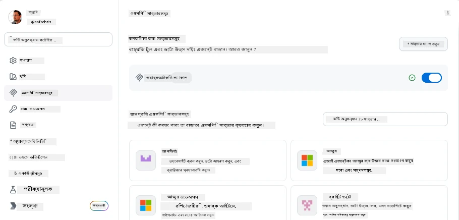
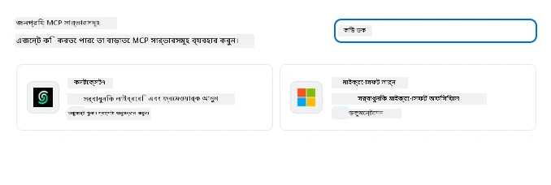
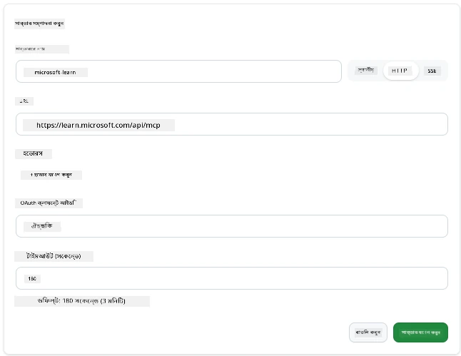
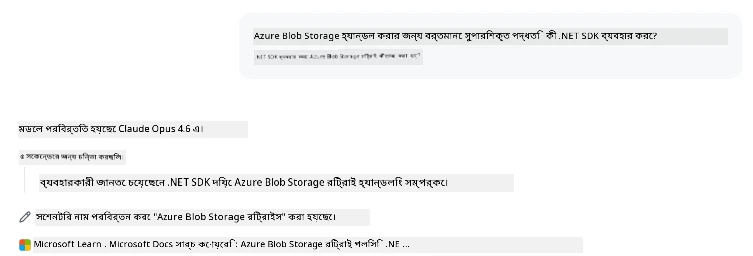
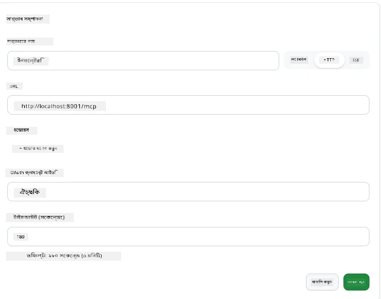
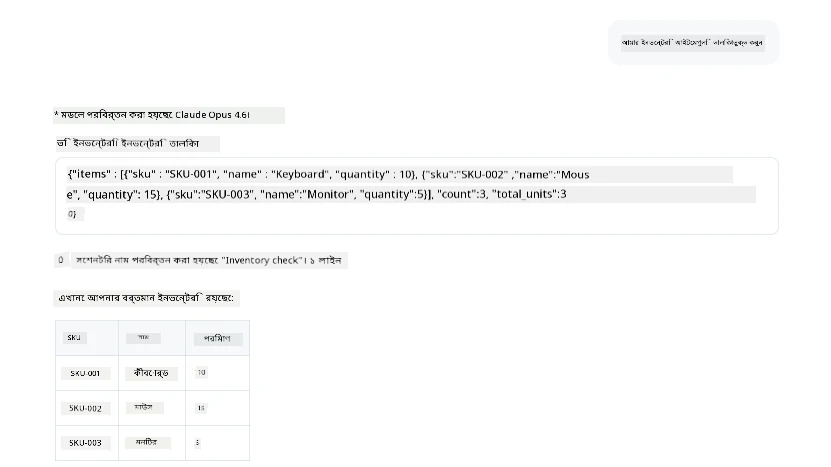
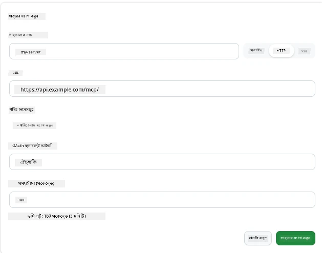
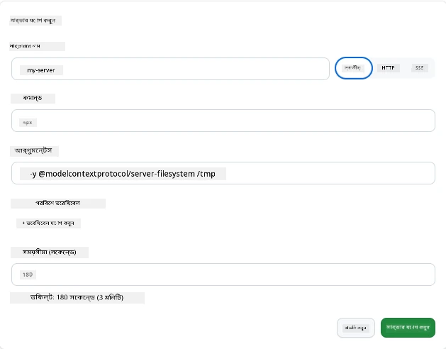

# GitHub Copilot অ্যাপে MCP সার্ভার ব্যবহার করা

এখন পর্যন্ত আপনি জানেন MCP কিভাবে কাজ করে। আপনি সার্ভার তৈরি করেছেন, টুল এবং রিসোর্স গঠন করেছেন, এবং ক্লায়েন্ট সংযুক্ত করেছেন। যা আমরা এখনো করিনি তা হলো দৃষ্টিভঙ্গি উল্টে দেওয়া: আপনি যে সার্ভার তৈরি করছেন সেই পক্ষ থেকে না থেকে, MCP-সমর্থিত একটি AI-চালিত অ্যাপের *ব্যবহারকারী* হিসেবে কেমন লাগে?

[GitHub Copilot App](https://github.com/github/app) একটি ডেস্কটপ অ্যাপ যা MCP সার্ভার ব্যবহার করতে পারে। MCP সার্ভারগুলো এতে সংযুক্ত করে আপনি একটি নতুন স্তর আনলক করেন: Copilot এখন আপনার ডকুমেন্টেশন, অভ্যন্তরীণ API কল করতে পারে, আপনার ডাটাবেসে প্রশ্ন করতে পারে, বা আপনি যেকোনো সার্ভিসকে সার্ভারে র‍্যাপ করে থাকেন সেটির সাথে কথা বলতে পারে। অ্যাপটি হোস্ট হয়; আপনার MCP সার্ভারগুলি এর টুল হয়ে ওঠে।

এই পাঠ আপনাকে পুরো প্রক্রিয়া দেখাবে—MCP সেটিংস প্যানেল খুঁজে পাওয়া থেকে শুরু করে একটি বাস্তব ডকুমেন্টেশন সার্ভার সংযুক্ত করা এবং তারপর আপনার নিজস্ব একটি কাস্টম সার্ভার সংযুক্ত করা।

## শেখার উদ্দেশ্যসমূহ

পাঠ শেষে আপনি সক্ষম হবেন:

- Copilot অ্যাপ সেটিংসে MCP সার্ভার প্যানেল খুঁজে বের করা ও নেভিগেট করা।
- একটি হোস্টেড ডকুমেন্টেশন সার্ভার সংযুক্ত করা এবং একটি সেশনে ব্যবহার করা।
- একটি কাস্টম সার্ভার নিবন্ধন করা এবং যাচাই করা যে Copilot তার টুলগুলো কল করতে পারে।
- একটি সার্ভারকে কীভাবে কল করা হয় তা কনফিগার করা, পরিবেশ ভেরিয়েবেল বা কাস্টম হেডার (যদি HTTP হয়) দিয়ে।

## MCP হোস্ট হিসেবে Copilot অ্যাপ

মূল ধারণা হলো: **Copilot এর এজেন্টরা বুদ্ধিমান, কিন্তু তারা কেবলমাত্র আপনি যা বলেন তাই জানে।** ডিফল্ট হিসেবে, একজন এজেন্ট আপনার ওয়ার্কস্পেসের ফাইল পড়তে এবং টার্মিনাল কমান্ড চালাতে পারে, তবে এটি আপনার ডাটাবেসে প্রশ্ন করতে, ক্যালেন্ডার দেখতে, বা কোন কাস্টম API কল করতে পারে না সাহায্য ব্যতীত। MCP সার্ভার সেই জায়গায় আসে। টুলস, ডাটাবেস, ভার্সন কন্ট্রোল, API, ডিজাইন টুল—এগুলো Copilot এবং আপনার সিস্টেমের মধ্যে সেতু হিসেবে কাজ করে, সেই তথ্য ও কাজের অ্যাক্সেস প্রদান করে যা এজেন্টদের দরকার।

চলুন শুরু করি আপনার অ্যাপের MCP সার্ভার ম্যানেজ করার সেটিংস সন্ধান করে।

## পদক্ষেপ ১: MCP সেটিংস প্যানেল খুঁজে পাওয়া

Copilot অ্যাপ খুলুন এবং নিচের-বাম পাশে একটি গিয়ার আইকন খুঁজে সেটিতে ক্লিক করুন।


নিশ্চিত করুন আপনি "MCP Servers" নির্বাচন করেছেন এবং আপনার ইতিমধ্যেই কনফিগার করা সার্ভারগুলো উপরে দেখা যাবে, জনপ্রিয় সার্ভারগুলোর মার্কেটপ্লেস নিচে থাকবে, আর উপরে "Add Server" বাটন থাকবে যেমন:



এখানে আপনি সার্ভার যোগ, সরানো, সক্রিয় বা নিষ্ক্রিয় করতে পারেন। পরিবর্তনগুলো নতুন সেশন থেকে কার্যকর হবে; আপনার যদি কোনও সেশন খোলা থাকে, তাহলে এই তালিকা পরিবর্তনের পর নতুন সেশন শুরু করতে হবে।

## পদক্ষেপ ২: একটি ডকুমেন্টেশন সার্ভার সংযুক্ত করা

চলুন কিছু তৎক্ষণাত উপযোগী করি। Microsoft Docs MCP সার্ভার Copilot কে অফিসিয়াল Microsoft ডকুমেন্টেশনে প্রবেশাধিকার দেয়। এতে Azure, .NET, TypeScript, এবং আরও অনেক কিছু অন্তর্ভুক্ত। এজেন্ট ট্রেনিং ডেটার উপর নির্ভর না করে (যার একটি কাটঅফ তারিখ থাকে), এটি কুয়েরি সময়ে বর্তমান ডকুমেন্টেশন আনতে পারে।

এটি যোগ করার পদ্ধতি:

১. জনপ্রিয় সার্ভার গ্রিডে টাইপ করুন **learn** এবং "Microsoft Learn" নামক সার্ভারটি নির্বাচন করুন।

   

   ক্লিক করার পর একটি ফর্ম আসবে যেখানে নাম, ট্রান্সপোর্ট টাইপ এবং URL পূর্বনির্ধারিত থাকে, আপনাকে শুধু "Add Server" ক্লিক করতে হবে।

২. "Add Server" ক্লিক করুন, এটি কিছু সেকেন্ড সময় নিয়ে সার্ভারের সাথে সংযোগ স্থাপন করবে।

   

   সংযুкт হওয়ার পর এটি উপরের এলাকায় কনফিগারড সার্ভার হিসেবে দেখা যাবে। আমরা এখন এটিকে পরীক্ষা করব।

৩. ডায়ালগ বন্ধ করে Quick chat নির্বাচন করুন।

৪. নিচের প্রম্পটটি টাইপ করুন Microsoft Learn সার্ভারে একটি টুল ট্রিগার করতে।

   ```text
   What's the current recommended approach for handling Azure Blob Storage 
   retries using the .NET SDK?
   ```

   

আপনি দেখতে পাবেন এটি যেভাবে MCP সার্ভারকে উল্লেখ করেছে।

## পদক্ষেপ ৩: একটি কাস্টম stdio সার্ভার সংযুক্ত করা

প্রিসেটগুলি সুবিধাজনক, তবে আসল ক্ষমতা হল আপনার নিজের সার্ভার সংযুক্ত করা। ধরুন আপনি একটি সার্ভার তৈরি করেছেন (অথবা পেয়েছেন) যা আপনার অভ্যন্তরীণ API বা কোম্পানির জ্ঞানভান্ডার এক্সপোজ করে। এখানে, আমরা একটি MCP সার্ভার ব্যবহার করব যা আমাদের কোম্পানির ইনভেন্টরি ম্যানেজমেন্ট পরিচালনা করে।

১. গিয়ার আইকনে ক্লিক করুন এবং আবার "MCP servers" নির্বাচন করুন।

২. "Add Server" বাটনে ক্লিক করুন ও "+ Add Custom server" নির্বাচন করুন, এবং নিচের মানসমূহ দিন:

   - নাম: `Inventory Server`
   - ডান পাশে transport নির্বাচন করুন, **http**

   "Add Server" নির্বাচন করুন এবং এটি কনফিগার্ড সার্ভার তালিকায় দেখাবে।

   

৪. এটি পরীক্ষা করতে, নিচের মতো একটি প্রম্পট চালান:

    ```
    list inventory
    ```

   

   আপনি এখন আপনার নিজস্ব সার্ভারে ফিরে আসা ইনভেন্টরি আইটেমের একটি তালিকা দেখতে পাবেন।

দারুণ, এখন আপনি বাইরের পাশাপাশি নিজের MCP সার্ভার Copilot অ্যাপে যোগ করার ভাল ধারণা পেয়েছেন। চলুন পরবর্তীতে সিক্রেট এবং পরিবেশ ভেরিয়েবল পরিচালনা সম্পর্কে কথা বলিঃ

## পদক্ষেপ ৪: উন্নত সেটিংস

এখন পর্যন্ত, আপনি দেখেছেন কিভাবে MCP সার্ভার যোগ করতে হয় যেখানে আপনি শুধু একটি নাম এবং URL দেন। তবে যদি আপনার সার্ভারের জন্য API কী বা অন্য কোনো মান প্রয়োজন হয়? ট্রান্সপোর্ট টাইপ অনুযায়ী আমরা যা দরকার সেই তথ্য সরবরাহ করতে পারি।

- **http বা SSE ট্রান্সপোর্ট**: এখানে প্রয়োজন অনুযায়ী হেডার সেট করা যায়।

   authentication এর জন্য, উদাহরণস্বরূপ আপনি Authorization হেডার নির্দিষ্ট করতে পারেন। মানটি একটি স্থির স্ট্রিং হতে পারে। OAuth ব্যবহারের ক্ষেত্রে, আপনি OAuth ক্লায়েন্ট আইডি দিতে পারেন।

   

- **stdio ট্রান্সপোর্ট**: পরিবেশ ভেরিয়েবল সেট করা যায়।

   এখানে আপনি যেকোনো প্রয়োজনীয় পরিবেশ ভেরিয়েবল নির্দিষ্ট করতে পারবেন যা সার্ভার শুরু করার সময় পাঠানো হবে।

   

## সারাংশ

Copilot অ্যাপ MCP সার্ভারকে এজেন্টের ক্ষমতার প্রথম-শ্রেণীর এক্সটেনশন হিসাবে বিবেচনা করে। এই পাঠে আপনি MCP সার্ভার যোগ থেকে শুরু করে সেগুলো সেশনে ব্যবহার করার পুরো যাত্রাপথ দেখেছেন। আপনি এখন পাবলিক সার্ভার, অভ্যন্তরীণ API, এবং কাস্টম টুল-এর সাথে সংযুক্ত হতে পারেন, যা আপনার এজেন্টদের তথ্য ও কাজগুলি স্বয়ংক্রিয়ভাবে সম্পাদনের ক্ষমতা দেয়।

## 📚 অতিরিক্ত সম্পদসমূহ

### অফিসিয়াল ডকুমেন্টেশন

- [GitHub Copilot App](https://github.com/github/app)
- [MCP Specification](https://modelcontextprotocol.io/specification/2025-03-26) - Model Context Protocol স্পেসিফিকেশন

### কমিউনিটি
- [MCP Community Discord](https://discord.com/invite/ByRwuEEgH4) - লাইভ আলোচনা
- [GitHub Discussions](https://github.com/microsoft/MCP-Server-and-PostgreSQL-Sample-Retail/discussions) - প্রশ্নোত্তর এবং শেয়ারিং
- [Stack Overflow](https://stackoverflow.com/questions/tagged/model-context-protocol) - প্রযুক্তিগত প্রশ্নসমূহ

---

<!-- CO-OP TRANSLATOR DISCLAIMER START -->
**অস্বীকৃতি**:
এই নথিটি AI অনুবাদ পরিষেবা [Co-op Translator](https://github.com/Azure/co-op-translator) ব্যবহার করে অনূদিত হয়েছে। যদিও আমরা শুদ্ধতার জন্য চেষ্টা করি, অনুগ্রহ করে মনে রাখবেন যে স্বয়ংক্রিয় অনুবাদে ত্রুটি বা অসঙ্গতি থাকতে পারে। মূল নথিটি তার স্বভাষায় কর্তৃত্বপূর্ণ উৎস হিসেবে বিবেচিত হওয়া উচিত। গুরুত্বপূর্ণ তথ্যের জন্য পেশাদার মানব অনুবাদ সুপারিশ করা হয়। এই অনুবাদের ব্যবহারে প্রয়োজনীয় ভুল বোঝাবুঝি বা ভুল ব্যাখ্যার জন্য আমরা দায়বদ্ধ নই।
<!-- CO-OP TRANSLATOR DISCLAIMER END -->