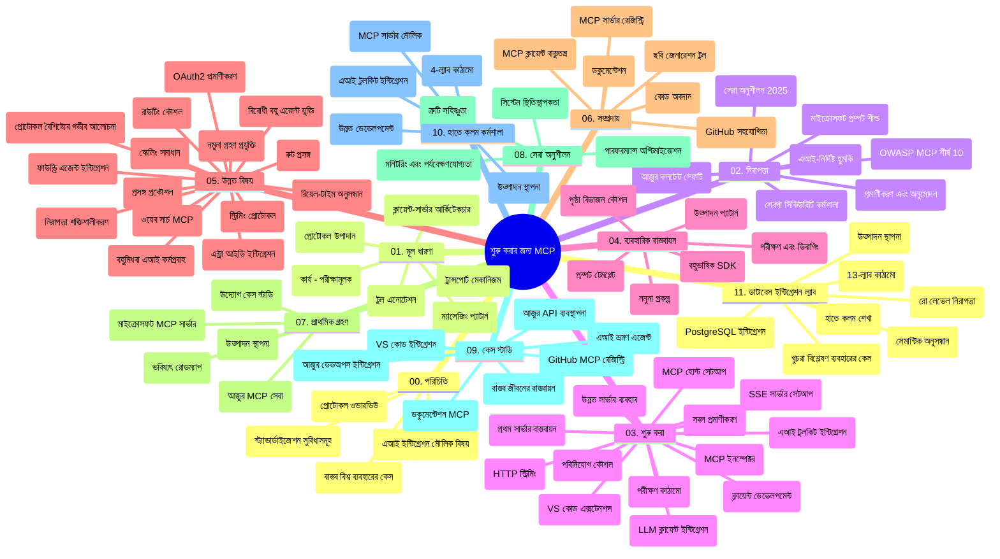

# মডেল কনটেক্সট প্রোটোকল (MCP) ফর বিগিনার্স - স্টাডি গাইড

এই স্টাডি গাইডটি "মডেল কনটেক্সট প্রোটোকল (MCP) ফর বিগিনার্স" কারিকুলামের জন্য রিপোজিটরি স্ট্রাকচার এবং কন্টেন্টের একটি ওভারভিউ প্রদান করে। এই গাইডটি ব্যবহার করে আপনি রিপোজিটরিটি দক্ষতার সাথে নেভিগেট করতে পারবেন এবং উপলব্ধ রিসোর্স থেকে সর্বোচ্চ সুবিধা নিতে পারবেন।

## রিপোজিটরি ওভারভিউ

মডেল কনটেক্সট প্রোটোকল (MCP) হল AI মডেল এবং ক্লায়েন্ট অ্যাপ্লিকেশনগুলির মধ্যে ইন্টারঅ্যাকশনের জন্য একটি স্ট্যান্ডার্ডাইজড ফ্রেমওয়ার্ক। প্রাথমিকভাবে Anthropic দ্বারা তৈরি, MCP এখন অফিসিয়াল গিটহাব অর্গানাইজেশনের মাধ্যমে বিস্তৃত MCP কমিউনিটি দ্বারা রক্ষিত হয়। এই রিপোজিটরিতে C#, Java, JavaScript, Python, এবং TypeScript-এ হ্যান্ডস-অন কোড উদাহরণসহ একটি ব্যাপক কারিকুলাম রয়েছে, যা AI ডেভেলপার, সিস্টেম আর্কিটেক্ট এবং সফটওয়্যার ইঞ্জিনিয়ারদের জন্য ডিজাইন করা হয়েছে।

## ভিজুয়াল কারিকুলাম ম্যাপ

## রিপোজিটরি স্ট্রাকচার

রিপোজিটরিটি এগারোটি প্রধান বিভাগের মধ্যে সংগঠিত, যেগুলো MCP-এর বিভিন্ন দিকের উপর ফোকাস করে:

1. **পরিচিতি (00-Introduction/)**
   - মডেল কনটেক্সট প্রোটোকলের ওভারভিউ
   - AI পাইপলাইনগুলিতে স্ট্যান্ডার্ডাইজেশনের গুরুত্ব
   - ব্যবহারিক কেস এবং সুবিধাসমূহ

2. **কোর কনসেপ্টস (01-CoreConcepts/)**
   - ক্লায়েন্ট-সার্ভার আর্কিটেকচার
   - মূল প্রোটোকল উপাদানসমূহ
   - MCP-তে মেসেজিং প্যাটার্নস

3. **সিকিউরিটি (02-Security/)**
   - MCP ভিত্তিক সিস্টেমে সিকিউরিটি হুমকি
   - নিরাপদ ইমপ্লিমেন্টেশনের বেস্ট প্র্যাকটিস
   - অথেনটিকেশন এবং অথরাইজেশন কৌশলসমূহ
   - **ব্যাপক সিকিউরিটি ডকুমেন্টেশন**:
     - MCP Security Best Practices 2025
     - Azure Content Safety Implementation Guide
     - MCP Security Controls and Techniques
     - MCP Best Practices Quick Reference
   - **মূল সিকিউরিটি বিষয়**:
     - প্রম্পট ইনজেকশন এবং টুল পয়জনিং আক্রমণ
     - সেশন হাইজ্যাকিং এবং কনফিউজড ডেপুটি সমস্যা
     - টোকেন পাসথ্রু দুর্বলতা
     - অতিরিক্ত অনুমতি এবং এক্সেস কন্ট্রোল
     - AI কম্পোনেন্টের সাপ্লাই চেইন সিকিউরিটি
     - Microsoft Prompt Shields ইন্টিগ্রেশন

4. **শুরু করা (03-GettingStarted/)**
   - পরিবেশের সেটআপ এবং কনফিগারেশন
   - মৌলিক MCP সার্ভার এবং ক্লায়েন্ট তৈরি
   - বিদ্যমান অ্যাপ্লিকেশনগুলির সাথে ইন্টিগ্রেশন
   - অন্তর্ভুক্ত অংশসমূহ:
     - প্রথম সার্ভার ইমপ্লিমেন্টেশন
     - ক্লায়েন্ট ডেভেলপমেন্ট
     - LLM ক্লায়েন্ট ইন্টিগ্রেশন
     - VS কোড ইন্টিগ্রেশন
     - সার্ভার-সেন্ট ইভেন্টস (SSE) সার্ভার
     - অ্যাডভান্সড সার্ভার ব্যবহার
     - HTTP স্ট্রিমিং
     - AI টুলকিট ইন্টিগ্রেশন
     - টেস্টিং কৌশল
     - ডিপ্লয়মেন্ট গাইডলাইন

5. **প্রাকটিক্যাল ইমপ্লিমেন্টেশন (04-PracticalImplementation/)**
   - বিভিন্ন প্রোগ্রামিং ভাষায় SDK ব্যবহার
   - ডিবাগিং, টেস্টিং এবং ভ্যালিডেশন টেকনিক
   - পুনঃব্যবহারযোগ্য প্রম্পট টেমপ্লেট এবং ওয়ার্কফ্লো নির্মাণ
   - উদাহরণসহ প্রকল্পসমূহ

6. **অ্যাডভান্সড বিষয় (05-AdvancedTopics/)**
   - কনটেক্সট ইঞ্জিনিয়ারিং কৌশল
   - Foundry এজেন্ট ইন্টিগ্রেশন
   - মাল্টি-মোডাল AI ওয়ার্কফ্লো
   - OAuth2 অথেনটিকেশন ডেমো
   - রিয়েল-টাইম সার্চ ক্যাপাবিলিটি
   - রিয়েল-টাইম স্ট্রিমিং
   - রুট কনটেক্সট ইমপ্লিমেন্টেশন
   - রাউটিং স্ট্র্যাটেজিস
   - স্যাম্পলিং টেকনিক
   - স্কেলিং অ্যাপ্রোচেস
   - সিকিউরিটি বিবেচনা
   - Entra ID সিকিউরিটি ইন্টিগ্রেশন
   - ওয়েব সার্চ ইন্টিগ্রেশন
   - প্রতিযোগিতামূলক মাল্টি-এজেন্ট রিজনিং (ডিবেট প্যাটার্নস)

7. **কমিউনিটি অবদান (06-CommunityContributions/)**
   - কোড এবং ডকুমেন্টেশনে অবদান রাখা
   - গিটহাবের মাধ্যমে সহযোগিতা
   - কমিউনিটি-চালিত উন্নয়ন এবং প্রতিক্রিয়া
   - বিভিন্ন MCP ক্লায়েন্ট ব্যবহার (Claude Desktop, Cline, VSCode)
   - জনপ্রিয় MCP সার্ভারগুলির সাথে কাজ, যার মধ্যে ইমেজ জেনারেশন অন্তর্ভুক্ত

8. **আগত অনুষ্ঠানের পাঠশালা (07-LessonsfromEarlyAdoption/)**
   - বাস্তব বিশ্বের ইমপ্লিমেন্টেশন এবং সফলতার গল্প
   - MCP-ভিত্তিক সমাধান তৈরি এবং স্থাপন
   - প্রবণতা এবং ভবিষ্যত রোডম্যাপ
   - **Microsoft MCP Servers Guide**: ১০টি প্রোডাকশন-রেডি মাইক্রোসফট MCP সার্ভারের বিস্তৃত গাইড:
     - Microsoft Learn Docs MCP Server
     - Azure MCP Server (১৫+ বিশেষায়িত কানেক্টরসহ)
     - GitHub MCP Server
     - Azure DevOps MCP Server
     - MarkItDown MCP Server
     - SQL Server MCP Server
     - Playwright MCP Server
     - Dev Box MCP Server
     - Microsoft Foundry MCP Server
     - Microsoft 365 Agents Toolkit MCP Server

9. **বেস্ট প্র্যাকটিস (08-BestPractices/)**
   - পারফরম্যান্স টিউনিং এবং অপটিমাইজেশন
   - ফল্ট-টলারেন্ট MCP সিস্টেম ডিজাইন
   - টেস্টিং এবং রেসিলিয়েন্স স্ট্র্যাটেজিস

10. **কেস স্টাডি (09-CaseStudy/)**
    - **সাতটি ব্যাপক কেস স্টাডি** যা MCP-এর বহুমুখিতা প্রদর্শন করে বিভিন্ন পরিস্থিতিতে:
    - **Azure AI ট্রাভেল এজেন্টস**: Azure OpenAI এবং AI সার্চ দিয়ে মাল্টি-এজেন্ট অর্কেস্ট্রেশন
    - **Azure DevOps ইন্টিগ্রেশন**: ইউটিউব ডেটা আপডেটের মাধ্যমে ওয়ার্কফ্লো প্রসেস অটোমেশন
    - **রিয়েল-টাইম ডকুমেন্টেশন রিট্রিভাল**: পাইথন কনসোল ক্লায়েন্ট সহ স্ট্রিমিং HTTP
    - **ইন্টারেক্টিভ স্টাডি প্ল্যান জেনারেটর**: Chainlit ওয়েব অ্যাপ ও সংলাপ ভিত্তিক AI
    - **ইন-এডিটর ডকুমেন্টেশন**: VS কোড ইন্টিগ্রেশন সহ GitHub Copilot ওয়ার্কফ্লো
    - **Azure API ম্যানেজমেন্ট**: এন্টারপ্রাইজ API ইন্টিগ্রেশন সহ MCP সার্ভার নির্মাণ
    - **GitHub MCP রেজিস্ট্রি**: ইকোসিস্টেম ডেভেলপমেন্ট এবং এজেন্টিক ইন্টিগ্রেশন প্ল্যাটফর্ম
    - এন্টারপ্রাইজ ইন্টিগ্রেশন, ডেভেলপার প্রোডাক্টিভিটি, এবং ইকোসিস্টেম উন্নয়নের উদাহরণসমূহ

11. **হ্যান্ডস-অন ওয়ার্কশপ (10-StreamliningAIWorkflowsBuildingAnMCPServerWithAIToolkit/)**
    - MCP এবং AI টুলকিট একত্রিত করে ব্যাপক হ্যান্ডস-অন ওয়ার্কশপ
    - AI মডেলগুলোকে বাস্তব বিশ্বের সরঞ্জামের সঙ্গে ব্রিজ করে বুদ্ধিমত্তাসম্পন্ন অ্যাপ্লিকেশন নির্মাণ
    - মৌলিক বিষয়, কাস্টম সার্ভার ডেভেলপমেন্ট, এবং প্রোডাকশন ডিপ্লয়মেন্ট স্ট্র্যাটেজিস কভার করা প্র্যাকটিক্যাল মডিউলসমূহ
    - **ল্যাব স্ট্রাকচার**:
      - ল্যাব ১: MCP সার্ভার মৌলিক বিষয়
      - ল্যাব ২: অ্যাডভান্সড MCP সার্ভার ডেভেলপমেন্ট
      - ল্যাব ৩: AI টুলকিট ইন্টিগ্রেশন
      - ল্যাব ৪: প্রোডাকশন ডিপ্লয়মেন্ট এবং স্কেলিং
    - ধাপে ধাপে নির্দেশনা সহ ল্যাব-ভিত্তিক শিক্ষণ পদ্ধতি

12. **MCP সার্ভার ডাটাবেস ইন্টিগ্রেশন ল্যাবস (11-MCPServerHandsOnLabs/)**
    - **১৩-ল্যাবের ব্যাপক শিক্ষণ পথ** PostgreSQL ইন্টিগ্রেশনসহ প্রোডাকশন-রেডি MCP সার্ভার নির্মাণের জন্য
    - **বাস্তব বিশ্বের খুচরা বিশ্লেষণ ইমপ্লিমেন্টেশন** Zava Retail ইউজ কেস ব্যবহার করে
    - **এন্টারপ্রাইজ-গ্রেড প্যাটার্নসমূহ** যেমন রো লেভেল সিকিউরিটি (RLS), সেমান্টিক সার্চ, এবং মাল্টি-টেন্যান্ট ডেটা এক্সেস
    - **সম্পূর্ণ ল্যাব স্ট্রাকচার**:
      - **ল্যাব ০০-০৩: ভিত্তি** - পরিচিতি, আর্কিটেকচার, সিকিউরিটি, পরিবেশ সেটআপ
      - **ল্যাব ০৪-০৬: MCP সার্ভার নির্মাণ** - ডাটাবেস ডিজাইন, MCP সার্ভার ইমপ্লিমেন্টেশন, টুল ডেভেলপমেন্ট
      - **ল্যাব ০৭-০৯: উন্নত ফিচার** - সেমান্টিক সার্চ, টেস্টিং ও ডিবাগিং, VS কোড ইন্টিগ্রেশন
      - **ল্যাব ১০-১২: প্রোডাকশন ও বেস্ট প্র্যাকটিস** - ডিপ্লয়মেন্ট, মনিটরিং, অপটিমাইজেশন
    - **কভার করা প্রযুক্তি**: FastMCP ফ্রেমওয়ার্ক, PostgreSQL, Azure OpenAI, Azure Container Apps, Application Insights
    - **শিক্ষণ ফলাফল**: প্রোডাকশন-রেডি MCP সার্ভার, ডাটাবেস ইন্টিগ্রেশন প্যাটার্ন, AI-চালিত বিশ্লেষণ, এন্টারপ্রাইজ সিকিউরিটি

## অতিরিক্ত রিসোর্স

রিপোজিটরিতে সহায়ক রিসোর্স অন্তর্ভুক্ত:

- **ছবির ফোল্ডার**: কারিকুলাম জুড়ে ব্যবহৃত ডায়াগ্রাম এবং ইলাস্ট্রেশনসমূহ
- **অনুবাদসমূহ**: ডকুমেন্টেশনের স্বয়ংক্রিয় অনুবাদের মাধ্যমে বহুভাষিক সমর্থন
- **অফিশিয়াল MCP রিসোর্স**:
  - [MCP ডকুমেন্টেশন](https://modelcontextprotocol.io/)
  - [MCP স্পেসিফিকেশন](https://spec.modelcontextprotocol.io/)
  - [MCP গিটহাব রিপোজিটরি](https://github.com/modelcontextprotocol)

## এই রিপোজিটরিটি কীভাবে ব্যবহার করবেন

1. **ক্রমবদ্ধ শেখা**: একটি সুশৃঙ্খল শেখার অভিজ্ঞতার জন্য অধ্যায়গুলি ধাপে ধাপে অনুসরণ করুন (০০ থেকে ১১ পর্যন্ত)।
2. **ভাষা-নির্দিষ্ট ফোকাস**: যদি আপনি কোনো নির্দিষ্ট প্রোগ্রামিং ভাষায় আগ্রহী হন, তাহলে আপনার পছন্দের ভাষায় ইমপ্লিমেন্টেশনের জন্য স্যাম্পল ডিরেক্টরি অন্বেষণ করুন।
3. **প্রাকটিক্যাল ইমপ্লিমেন্টেশন**: আপনার পরিবেশ সেটআপ করতে এবং প্রথম MCP সার্ভার ও ক্লায়েন্ট তৈরি করতে "শুরু করা" বিভাগ থেকে শুরু করুন।
4. **অ্যাডভান্সড এক্সপ্লোরেশন**: মৌলিক জ্ঞান অর্জনের পরে, আপনার জ্ঞান বাড়ানোর জন্য উন্নত বিষয়গুলোতে প্রবেশ করুন।
5. **কমিউনিটি এনগেজমেন্ট**: MCP কমিউনিটি-র সাথে যুক্ত হতে গিটহাব আলোচনা এবং ডিসকর্ড চ্যানেলগুলোতে যোগ দিন, যেখানে আপনি বিশেষজ্ঞ এবং সহউন্নয়নকারীদের সাথে সংযোগ করতে পারবেন।

## MCP ক্লায়েন্ট এবং টুলস

কারিকুলামটি বিভিন্ন MCP ক্লায়েন্ট এবং টুলস কভার করে:

1. **অফিশিয়াল ক্লায়েন্টস**:
   - Visual Studio Code
   - Visual Studio Code-এ MCP
   - Claude Desktop
   - VSCode-এ Claude
   - Claude API

2. **কমিউনিটি ক্লায়েন্টস**:
   - Cline (টার্মিনাল-ভিত্তিক)
   - Cursor (কোড এডিটর)
   - ChatMCP
   - Windsurf

3. **MCP ম্যানেজমেন্ট টুলস**:
   - MCP CLI
   - MCP Manager
   - MCP Linker
   - MCP Router

## জনপ্রিয় MCP সার্ভারগুলি

রিপোজিটরিটি বিভিন্ন MCP সার্ভার পরিচয় করিয়ে দেয়, যার মধ্যে রয়েছে:

1. **অফিশিয়াল মাইক্রোসফট MCP সার্ভারস**:
   - Microsoft Learn Docs MCP Server
   - Azure MCP Server (১৫+ বিশেষায়িত কানেক্টরসহ)
   - GitHub MCP Server
   - Azure DevOps MCP Server
   - MarkItDown MCP Server
   - SQL Server MCP Server
   - Playwright MCP Server
   - Dev Box MCP Server
   - Microsoft Foundry MCP Server
   - Microsoft 365 Agents Toolkit MCP Server

2. **অফিশিয়াল রেফারেন্স সার্ভারস**:
   - Filesystem
   - Fetch
   - Memory
   - Sequential Thinking

3. **ইমেজ জেনারেশন**:
   - Azure OpenAI DALL-E 3
   - Stable Diffusion WebUI
   - Replicate

4. **ডেভেলপমেন্ট টুলস**:
   - Git MCP
   - Terminal Control
   - Code Assistant

5. **বিশেষায়িত সার্ভারস**:
   - Salesforce
   - Microsoft Teams
   - Jira & Confluence

## অবদান রাখা

এই রিপোজিটরিটি কমিউনিটির অবদানের জন্য উন্মুক্ত। MCP ইকোসিস্টেমে কার্যকরভাবে অবদান রাখার জন্য নির্দেশনার জন্য কমিউনিটি অবদান বিভাগটি দেখুন।

----

*এই স্টাডি গাইডটি সর্বশেষ ৫ ফেব্রুয়ারি, ২০২৬-এ আপডেট করা হয়েছে, যা MCP স্পেসিফিকেশন ২০২৫-১১-২৫-এর সর্বশেষ সংস্করণ প্রতিফলিত করে এবং সেই তারিখ পর্যন্ত রিপোজিটরির ওভারভিউ প্রদান করে। এই তারিখের পরে রিপোজিটরির বিষয়বস্তু আপডেট হতে পারে।*

---

<!-- CO-OP TRANSLATOR DISCLAIMER START -->
**অস্বীকৃতি**:
এই নথিটি AI অনুবাদ পরিষেবা [Co-op Translator](https://github.com/Azure/co-op-translator) ব্যবহার করে অনূদিত হয়েছে। যদিও আমরা শুদ্ধতার জন্য চেষ্টা করি, অনুগ্রহ করে মনে রাখবেন যে স্বয়ংক্রিয় অনুবাদে ত্রুটি বা অসঙ্গতি থাকতে পারে। মূল নথিটি তার স্বভাষায় কর্তৃত্বপূর্ণ উৎস হিসেবে বিবেচিত হওয়া উচিত। গুরুত্বপূর্ণ তথ্যের জন্য পেশাদার মানব অনুবাদ সুপারিশ করা হয়। এই অনুবাদের ব্যবহারে প্রয়োজনীয় ভুল বোঝাবুঝি বা ভুল ব্যাখ্যার জন্য আমরা দায়বদ্ধ নই।
<!-- CO-OP TRANSLATOR DISCLAIMER END -->