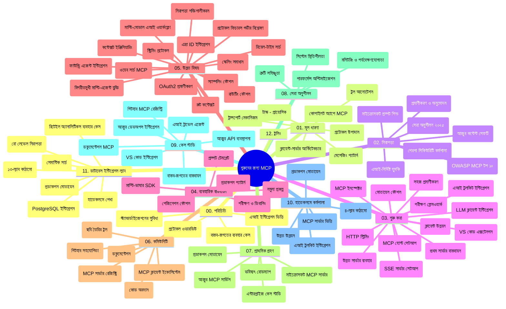

# মডেল কনটেক্সট প্রোটোকল (MCP) for Beginners - স্টাডি গাইড

এই স্টাডি গাইড "মডেল কনটেক্সট প্রোটোকল (MCP) for Beginners" পাঠক্রমের রেপোজিটরি কাঠামো এবং বিষয়বস্তুর একটি ওভারভিউ প্রদান করে। রেপোজিটরিটি দক্ষতার সঙ্গে নেভিগেট করতে এবং উপলব্ধ রিসোর্সগুলো সর্বোচ্চভাবে ব্যবহার করার জন্য এই গাইডটি ব্যবহার করুন।

## রেপোজিটরি ওভারভিউ

মডেল কনটেক্সট প্রোটোকল (MCP) হল এআই মডেল এবং ক্লায়েন্ট অ্যাপ্লিকেশনের মধ্যে ইন্টারঅ্যাকশনের জন্য একটি স্ট্যান্ডার্ডাইজড ফ্রেমওয়ার্ক। প্রাথমিকভাবে Anthropic দ্বারা তৈরি, MCP এখন অফিসিয়াল GitHub অর্গানাইজেশন মাধ্যমে বিস্তৃত MCP কমিউনিটির দ্বারা রক্ষণাবেক্ষণ করা হয়। এই রেপোজিটরিটি এআই ডেভেলপার, সিস্টেম আর্কিটেক্ট এবং সফটওয়্যার ইঞ্জিনিয়ারদের জন্য C#, Java, JavaScript, Python, এবং TypeScript এ হাতেকলমে কোড উদাহরণের সঙ্গে একটি ব্যাপক পাঠক্রম প্রদান করে।

## ভিজ্যুয়াল কারিকুলাম ম্যাপ

## রেপোজিটরি স্ট্রাকচার

রেপোজিটরিটি বারোটি প্রধান সেকশনে সংগঠিত, প্রত্যেকটি MCP এর বিভিন্ন দিকের উপর মনোনিবেশ করে:

1. **পরিচিতি (00-Introduction/)**
   - মডেল কনটেক্সট প্রোটোকলের ওভারভিউ
   - কেন AI পাইপলাইনগুলিতে স্ট্যান্ডার্ডাইজেশন গুরুত্বপূর্ণ
   - ব্যবহারিক কেস এবং উপকারিতা

2. **কোর ধারণা (01-CoreConcepts/)**
   - ক্লায়েন্ট-সার্ভার আর্কিটেকচার
   - প্রধান প্রোটোকল উপাদানসমূহ
   - MCP এর মেসেজিং প্যাটার্নসমূহ

3. **সিকিউরিটি (02-Security/)**
   - MCP-ভিত্তিক সিস্টেমে নিরাপত্তা হুমকি
   - সুরক্ষিত ইমপ্লিমেন্টেশনের সেরা অনুশীলনসমূহ
   - প্রমাণীকরণ এবং অনুমোদন কৌশলসমূহ
   - **সম্পূর্ণ নিরাপত্তা ডকুমেন্টেশন**:
     - MCP Security Best Practices 2025
     - Azure Content Safety Implementation Guide
     - MCP Security Controls and Techniques
     - MCP Best Practices Quick Reference
   - **মূল নিরাপত্তা বিষয়াবলী**:
     - প্রম্পট ইনজেকশন এবং টুল পয়জনিং আক্রমণ
     - সেশন হাইজ্যাকিং এবং কনফিউজড ডেপুটি সমস্যা
     - টোকেন পাসথ্রু দুর্বলতা
     - অতিরিক্ত অনুমতি এবং অ্যাক্সেস নিয়ন্ত্রণ
     - AI উপাদানের সাপ্লাই চেইন সিকিউরিটি
     - Microsoft Prompt Shields একীকরণ

4. **শুরু করা (03-GettingStarted/)**
   - পরিবেশ সেটআপ এবং কনফিগারেশন
   - মৌলিক MCP সার্ভার এবং ক্লায়েন্ট তৈরি
   - বিদ্যমান অ্যাপ্লিকেশনের সাথে ইন্টিগ্রেশন
   - অন্তর্ভুক্ত বিভাগসমূহ:
     - প্রথম সার্ভার বাস্তবায়ন
     - ক্লায়েন্ট ডেভেলপমেন্ট
     - LLM ক্লায়েন্ট ইন্টিগ্রেশন
     - VS Code ইন্টিগ্রেশন
     - সার্ভার-সেন্ট ইভেন্টস (SSE) সার্ভার
     - অ্যাডভান্সড সার্ভার ব্যবহার
     - HTTP স্ট্রিমিং
     - AI টুলকিট ইন্টিগ্রেশন
     - টেস্টিং কৌশলসমূহ
     - ডিপ্লয়মেন্ট নির্দেশিকা

5. **প্র্যাক্টিক্যাল ইমপ্লিমেন্টেশন (04-PracticalImplementation/)**
   - বিভিন্ন প্রোগ্রামিং ভাষায় SDK ব্যবহার
   - ডিবাগিং, টেস্টিং এবং ভ্যালিডেশন কৌশল
   - পুনর্ব্যবহারযোগ্য প্রম্পট টেমপ্লেট এবং ওয়ার্কফ্লো তৈরি
   - ইমপ্লিমেন্টেশন উদাহরণসহ নমুনা প্রকল্পসমূহ

6. **এডভান্সড টপিকস (05-AdvancedTopics/)**
   - কনটেক্সট ইঞ্জিনিয়ারিং কৌশল
   - ফাউন্ড্রি এজেন্ট ইন্টিগ্রেশন
   - মাল্টি-মোডাল এআই ওয়ার্কফ্লো
   - OAuth2 প্রমাণীকরণ ডেমো
   - রিয়েল-টাইম সার্চ সক্ষমতা
   - রিয়েল-টাইম স্ট্রিমিং
   - রুট কনটেক্সট ইমপ্লিমেন্টেশন
   - রাউটিং কৌশল
   - স্যাম্পলিং টেকনিকস
   - স্কেলিং পদ্ধতি
   - নিরাপত্তা বিবেচনা
   - Entra ID নিরাপত্তা ইন্টিগ্রেশন
   - ওয়েব সার্চ ইন্টিগ্রেশন
   - বিরোধিতামূলক মাল্টি-এজেন্ট রিজনিং (বিবাদ প্যাটার্ন)

7. **কমিউনিটি অবদানসমূহ (06-CommunityContributions/)**
   - কিভাবে কোড এবং ডকুমেন্টেশন অবদান রাখবেন
   - GitHub মাধ্যমে সহযোগিতা
   - কমিউনিটি-চালিত উন্নয়ন এবং প্রতিক্রিয়া
   - বিভিন্ন MCP ক্লায়েন্ট ব্যবহার (Claude Desktop, Cline, VSCode)
   - জনপ্রিয় MCP সার্ভার সহ কাজ (ইমেজ জেনারেশন সহ)

8. **শুরুর অভিজ্ঞতা থেকে পাঠ (07-LessonsfromEarlyAdoption/)**
   - বাস্তব জীবনের ইমপ্লিমেন্টেশন এবং সাফল্যের গল্প
   - MCP-ভিত্তিক সমাধান তৈরি এবং ডিপ্লয়মেন্ট
   - প্রবণতা এবং ভবিষ্যৎ রোডম্যাপ
   - **Microsoft MCP Servers Guide**: 10 টি প্রোডাকশন-রেডি Microsoft MCP সার্ভার এর বিস্তৃত গাইড:
     - Microsoft Learn Docs MCP Server
     - Azure MCP Server (15+ স্পেশালাইজড কানেক্টর)
     - GitHub MCP Server
     - Azure DevOps MCP Server
     - MarkItDown MCP Server
     - SQL Server MCP Server
     - Playwright MCP Server
     - Dev Box MCP Server
     - Microsoft Foundry MCP Server
     - Microsoft 365 Agents Toolkit MCP Server

9. **সেরা অনুশীলনসমূহ (08-BestPractices/)**
   - পারফর্মেন্স টিউনিং এবং অপ্টিমাইজেশন
   - ফল্ট-টলারেন্ট MCP সিস্টেম ডিজাইন
   - টেস্টিং এবং দৃঢ়তা কৌশলসমূহ

10. **কেস স্টাডিজ (09-CaseStudy/)**
    - **সাতটি ব্যাপক কেস স্টাডিজ** যা MCP এর বহুমুখিতা বিভিন্ন পরিস্থিতিতে প্রদর্শন করে:
    - **Azure AI Travel Agents**: Azure OpenAI এবং AI Search এর সাথে মাল্টি-এজেন্ট অর্কেস্ট্রেশন
    - **Azure DevOps ইন্টিগ্রেশন**: ইউটিউব ডেটা আপডেট সহ ওয়ার্কফ্লো প্রক্রিয়া স্বয়ংক্রিয়করণ
    - **রিয়েল-টাইম ডকুমেন্টেশন পুনরুদ্ধার**: Python কনসোল ক্লায়েন্ট স্ট্রিমিং HTTP সহ
    - **ইন্টারেক্টিভ স্টাডি প্ল্যান জেনারেটর**: Chainlit ওয়েব অ্যাপ কনভারসেশনাল AI সহ
    - **ইন-এডিটর ডকুমেন্টেশন**: VS Code ইন্টিগ্রেশন GitHub Copilot ওয়ার্কফ্লো সহ
    - **Azure API ম্যানেজমেন্ট**: MCP সার্ভার তৈরি সহ এন্টারপ্রাইজ API ইন্টিগ্রেশন
    - **GitHub MCP রেজিস্ট্রি**: ইকোসিস্টেম ডেভেলপমেন্ট এবং এজেন্টিক ইন্টিগ্রেশন প্ল্যাটফর্ম
    - এন্টারপ্রাইজ ইন্টিগ্রেশন, ডেভেলপার প্রোডাক্টিভিটি এবং ইকোসিস্টেম ডেভেলপমেন্ট উদাহরণসমূহ

11. **হ্যান্ডস-অন ওয়ার্কশপ (10-StreamliningAIWorkflowsBuildingAnMCPServerWithAIToolkit/)**
    - MCP এবং AI টুলকিট সংযুক্ত একটি ব্যাপক হ্যান্ডস-অন ওয়ার্কশপ
    - AI মডেলগুলিকে বাস্তব বিশ্ব সরঞ্জামের সাথে সংযোগকারী বুদ্ধিমান অ্যাপ্লিকেশন তৈরি
    - মৌলিক বিষয়াবলী, কাস্টম সার্ভার ডেভেলপমেন্ট এবং প্রোডাকশন ডিপ্লয়মেন্ট স্ট্রাটেজি সম্বলিত প্র্যাক্টিক্যাল মডিউলসমূহ
    - **ল্যাব স্ট্রাকচার**:
      - ল্যাব 1: MCP সার্ভার ফান্ডামেন্টালস
      - ল্যাব 2: অ্যাডভান্সড MCP সার্ভার ডেভেলপমেন্ট
      - ল্যাব 3: AI টুলকিট ইন্টিগ্রেশন
      - ল্যাব 4: প্রোডাকশন ডিপ্লয়মেন্ট এবং স্কেলিং
    - ধাপে ধাপে নির্দেশাবলী সহ ল্যাব-ভিত্তিক শেখার পদ্ধতি

12. **MCP সার্ভার ডাটাবেস ইন্টিগ্রেশন ল্যাবস (11-MCPServerHandsOnLabs/)**
    - PostgreSQL ইন্টিগ্রেশনসহ প্রোডাকশন-রেডি MCP সার্ভার তৈরি করার জন্য **সম্পূর্ণ ১৩-ল্যাব শেখার পথ**
    - Zava Retail ব্যবহার কেস ব্যবহার করে বাস্তব-জীবনের রিটেল অ্যানালিটিকস ইমপ্লিমেন্টেশন
    - রো লেভেল সিকিউরিটি (RLS), সিম্যান্টিক সার্চ এবং মাল্টি-টেন্যান্ট ডেটা অ্যাক্সেস সহ এন্টারপ্রাইজ-গ্রেড প্যাটার্নসমূহ
    - **সম্পূর্ণ ল্যাব স্ট্রাকচার**:
      - **ল্যাব ০০-০৩: ফাউন্ডেশনস** - পরিচিতি, আর্কিটেকচার, সিকিউরিটি, পরিবেশ সেটআপ
      - **ল্যাব ০৪-০৬: MCP সার্ভার তৈরি** - ডাটাবেস ডিজাইন, MCP সার্ভার ইমপ্লিমেন্টেশন, টুল ডেভেলপমেন্ট
      - **ল্যাব ০৭-০৯: উন্নত বৈশিষ্ট্যসমূহ** - সিম্যান্টিক সার্চ, টেস্টিং এবং ডিবাগিং, VS Code ইন্টিগ্রেশন
      - **ল্যাব ১০-১২: প্রোডাকশন এবং সেরা অনুশীলন** - ডিপ্লয়মেন্ট, মনিটরিং, অপ্টিমাইজেশন
    - **প্রযুক্তিসমূহ অন্তর্ভুক্ত**: FastMCP ফ্রেমওয়ার্ক, PostgreSQL, Azure OpenAI, Azure Container Apps, Application Insights
    - **শেখার ফলাফল**: প্রোডাকশন-রেডি MCP সার্ভার, ডাটাবেস ইন্টিগ্রেশন প্যাটার্ন, AI চালিত অ্যানালিটিকস, এন্টারপ্রাইজ সিকিউরিটি

13. **টুলিং (12-tooling/)**
    - MCP কপিলট অ্যাপ এবং অন্যান্য টুলে ব্যবহার শেখা

## অতিরিক্ত রিসোর্স

রেপোজিটরিতে সহায়ক রিসোর্সগুলি অন্তর্ভুক্ত:

- **ইমেজেস ফোল্ডার**: কারিকুলামেরThroughout বিভিন্ন আদর্শ এবং চিত্রাবলী ধারণ
- **অনুবাদসমূহ**: ডকুমেন্টেশনের স্বয়ংক্রিয় অনুবাদের মাধ্যমে বহু-ভাষা সমর্থন
- **অফিসিয়াল MCP রিসোর্স**:
  - [MCP Documentation](https://modelcontextprotocol.io/)
  - [MCP Specification](https://spec.modelcontextprotocol.io/)
  - [MCP GitHub Repository](https://github.com/modelcontextprotocol)

## কিভাবে এই রেপোজিটরি ব্যবহার করবেন

1. **ক্রমিক শেখা**: একটি সংগঠিত শেখার অভিজ্ঞতার জন্য অধ্যায়গুলো ক্রমানুসারে (০০ থেকে ১১) অনুসরণ করুন।
2. **ভাষা-নির্দিষ্ট ফোকাস**: যদি কোন নির্দিষ্ট প্রোগ্রামিং ভাষায় আগ্রহী হন, তাহলে আপনার পছন্দসই ভাষার ইমপ্লিমেন্টেশনগুলির জন্য স্যাম্পল ডিরেক্টরিগুলি অন্বেষণ করুন।
3. **প্র্যাক্টিক্যাল ইমপ্লিমেন্টেশন**: পরিবেশ সেটআপ এবং আপনার প্রথম MCP সার্ভার ও ক্লায়েন্ট তৈরি করার জন্য "Getting Started" সেকশন দিয়ে শুরু করুন।
4. **উন্নত অনুসন্ধান**: মৌলিক বিষয়গুলোতে প্রশান্তি অর্জনের পর, জ্ঞানের বিস্তারের জন্য উন্নত টপিকসগুলো পড়ুন।
5. **কমিউনিটি এনগেজমেন্ট**: MCP কমিউনিটিতে GitHub আলোচনা ও Discord চ্যানেলগুলোর মাধ্যমে বিশেষজ্ঞ এবং সহডেভেলপারদের সাথে জড়িত হন।

## MCP ক্লায়েন্ট এবং টুলস

পাঠক্রমে বিভিন্ন MCP ক্লায়েন্ট এবং টুলস অন্তর্ভুক্ত:

1. **অফিসিয়াল ক্লায়েন্টস**:
   - ভিজ্যুয়াল স্টুডিও কোড 
   - MCP ভিজ্যুয়াল স্টুডিও কোডে
   - Claude Desktop
   - VSCode এ Claude
   - Claude API

2. **কমিউনিটি ক্লায়েন্টস**:
   - Cline (টার্মিনাল-ভিত্তিক)
   - Cursor (কোড এডিটর)
   - ChatMCP
   - Windsurf

3. **MCP ম্যানেজমেন্ট টুলস**:
   - MCP CLI
   - MCP Manager
   - MCP Linker
   - MCP Router

## জনপ্রিয় MCP সার্ভারসমূহ

রেপোজিটরিতে বিভিন্ন MCP সার্ভারের পরিচিতি দেওয়া হয়েছে, যার মধ্যে রয়েছে:

1. **অফিসিয়াল Microsoft MCP সার্ভারসমূহ**:
   - Microsoft Learn Docs MCP Server
   - Azure MCP Server (১৫+ বিশেষায়িত কানেক্টর)
   - GitHub MCP Server
   - Azure DevOps MCP Server
   - MarkItDown MCP Server
   - SQL Server MCP Server
   - Playwright MCP Server
   - Dev Box MCP Server
   - Microsoft Foundry MCP Server
   - Microsoft 365 Agents Toolkit MCP Server

2. **অফিসিয়াল রেফারেন্স সার্ভারসমূহ**:
   - Filesystem
   - Fetch
   - Memory
   - Sequential Thinking

3. **ইমেজ জেনারেশন**:
   - Azure OpenAI DALL-E 3
   - Stable Diffusion WebUI
   - Replicate

4. **ডেভেলপমেন্ট টুলস**:
   - Git MCP
   - Terminal Control
   - Code Assistant

5. **বিশেষায়িত সার্ভারসমূহ**:
   - Salesforce
   - Microsoft Teams
   - Jira & Confluence

## অবদান রাখা

এই রেপোজিটরি কমিউনিটির অবদানকে স্বাগত জানায়। MCP ইকোসিস্টেমে কার্যকরভাবে অবদান রাখতে নির্দেশনার জন্য কমিউনিটি অবদানসমূহ সেকশন দেখুন।

----

*এই স্টাডি গাইডটি সর্বশেষ ৫ ফেব্রুয়ারি, ২০২৬ তারিখে আপডেট করা হয়েছে, যা MCP স্পেসিফিকেশন ২০২৫-১১-২৫ এর সর্বশেষ সংস্করণ প্রতিফলিত করে এবং ঐ তারিখ পর্যন্ত রেপোজিটরির ওভারভিউ প্রদান করে। রেপোজিটরির বিষয়বস্তু এই তারিখের পরে আপডেট হতে পারে।*

---

<!-- CO-OP TRANSLATOR DISCLAIMER START -->
**অস্বীকৃতি**:
এই নথিটি AI অনুবাদ পরিষেবা [Co-op Translator](https://github.com/Azure/co-op-translator) ব্যবহার করে অনূদিত হয়েছে। যদিও আমরা শুদ্ধতার জন্য চেষ্টা করি, অনুগ্রহ করে মনে রাখবেন যে স্বয়ংক্রিয় অনুবাদে ত্রুটি বা অসঙ্গতি থাকতে পারে। মূল নথিটি তার স্বভাষায় কর্তৃত্বপূর্ণ উৎস হিসেবে বিবেচিত হওয়া উচিত। গুরুত্বপূর্ণ তথ্যের জন্য পেশাদার মানব অনুবাদ সুপারিশ করা হয়। এই অনুবাদের ব্যবহারে প্রয়োজনীয় ভুল বোঝাবুঝি বা ভুল ব্যাখ্যার জন্য আমরা দায়বদ্ধ নই।
<!-- CO-OP TRANSLATOR DISCLAIMER END -->