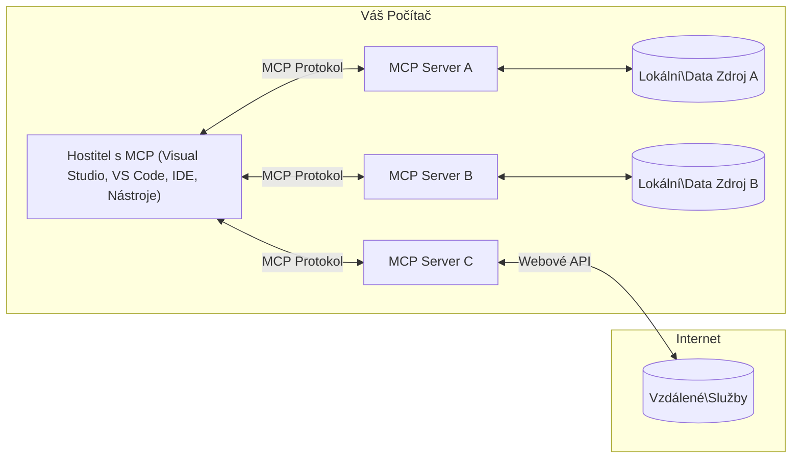

# MCP Core Concepts: Ovládnutí Model Context Protocol pro AI integraci

[](https://youtu.be/earDzWGtE84)

_(Klikněte na obrázek výše pro zobrazení videa této lekce)_

[Model Context Protocol (MCP)](https://github.com/modelcontextprotocol) je výkonný, standardizovaný rámec, který optimalizuje komunikaci mezi velkými jazykovými modely (LLM) a externími nástroji, aplikacemi a zdroji dat. 
Tento průvodce vás provede základními koncepty MCP. Naučíte se o jeho architektuře klient-server, základních komponentách, mechanismech komunikace a osvědčených postupech implementace.

- **Explicitní souhlas uživatele**: Veškerý přístup k datům a operace vyžadují před provedením explicitní schválení uživatele. Uživatelé musí jasně rozumět, jaká data budou přístupná a jaké akce budou provedeny, s detailní kontrolou nad oprávněními a autorizacemi.

- **Ochrana soukromí dat**: Uživatelova data jsou zpřístupněna pouze s explicitním souhlasem a musí být chráněna robustními přístupovými kontrolami po celou dobu interakce. Implementace musí zabránit neoprávněnému přenosu dat a udržovat přísné hranice soukromí.

- **Bezpečnost spuštění nástrojů**: Každé vyvolání nástroje vyžaduje explicitní souhlas uživatele s jasným porozuměním funkčnosti nástroje, parametrů a možného dopadu. Robustní bezpečnostní hranice musí zabránit nechtěnému, nebezpečnému nebo škodlivému spuštění nástroje.

- **Bezpečnostní vrstvy transportu**: Všechny komunikační kanály by měly používat vhodné šifrování a autentizační mechanismy. Vzdálená připojení by měla implementovat zabezpečené protokoly transportu a správu přihlašovacích údajů.

#### Pokyny k implementaci:

- **Správa oprávnění**: Implementujte jemně granulované systémy oprávnění, které uživatelům umožní kontrolovat, ke kterým serverům, nástrojům a zdrojům mají přístup
- **Autentizace a autorizace**: Používejte bezpečné metody autentizace (OAuth, API klíče) se správou tokenů a jejich expirací  
- **Validace vstupu**: Validujte všechny parametry a vstupy dat podle definovaných schémat pro prevenci injekčních útoků
- **Auditní logování**: Udržujte komplexní záznamy všech operací pro bezpečnostní monitoring a soulad

## Přehled

Tato lekce zkoumá základní architekturu a komponenty, které tvoří ekosystém Model Context Protocol (MCP). Naučíte se o architektuře klient-server, klíčových komponentách a mechanismech komunikace, které umožňují MCP interakce.

## Hlavní cíle učení

Na konci této lekce budete:

- Rozumět architektuře klient-server MCP.
- Identifikovat role a odpovědnosti Hostitelů, Klientů a Serverů.
- Analyzovat klíčové funkce, které dělají MCP flexibilní integrační vrstvu.
- Naučit se, jak tok informací v rámci ekosystému MCP probíhá.
- Získat praktické poznatky prostřednictvím ukázek kódu v .NET, Java, Python a JavaScript.

## Architektura MCP: Podrobnější pohled

Ekosystém MCP je založen na modelu klient-server. Tato modulární struktura umožňuje AI aplikacím efektivně interagovat s nástroji, databázemi, API a kontextovými zdroji. Rozdělme tuto architekturu na její základní komponenty.

V jádru MCP následuje architekturu klient-server, kde hostitelská aplikace může připojit více serverů:


- **MCP Hostitelé**: Programy jako VSCode, Claude Desktop, IDE nebo AI nástroje, které chtějí přistupovat k datům přes MCP
- **MCP Klienti**: Protokoloví klienti, kteří udržují připojení 1:1 se servery
- **MCP Servery**: Lehká programy, které každé zpřístupňují specifické schopnosti prostřednictvím standardizovaného Model Context Protocol
- **Lokální zdroje dat**: Soubory, databáze a služby vašeho počítače, ke kterým MCP servery mohou bezpečně přistupovat
- **Vzdálené služby**: Externí systémy dostupné přes internet, ke kterým se MCP servery mohou připojit přes API.

Protokol MCP je vyvíjející se standard s verzováním založeným na datu (formát RRRR-MM-DD). Aktuální verze protokolu je **2025-11-25**. Nejnovější aktualizace naleznete v [specifikaci protokolu](https://modelcontextprotocol.io/specification/2025-11-25/)

### 1. Hostitelé

V Model Context Protocol (MCP) jsou **Hostitelé** AI aplikace, které slouží jako hlavní rozhraní, skrze něž uživatelé interagují s protokolem. Hostitelé koordinují a spravují připojení k více MCP serverům tím, že pro každé připojení vytvoří dedikovaného MCP klienta. Příklady hostitelů zahrnují:

- **AI aplikace**: Claude Desktop, Visual Studio Code, Claude Code
- **Vývojová prostředí**: IDE a editory kódu s integrací MCP  
- **Speciální aplikace**: Účelové AI agenti a nástroje

**Hostitelé** jsou aplikace, které koordinují interakce s AI modely. Oni:

- **Orchestrují AI modely**: Spouštějí nebo komunikují s LLM pro generování odpovědí a koordinaci AI workflow
- **Spravují klientská připojení**: Vytvářejí a udržují jednoho MCP klienta na každé připojení k MCP serveru
- **Řídí uživatelské rozhraní**: Zpracovávají tok konverzace, uživatelské interakce a prezentaci odpovědí  
- **Vynucují bezpečnost**: Řídí oprávnění, bezpečnostní omezení a autentizaci
- **Zajišťují souhlas uživatele**: Spravují souhlas uživatelů pro sdílení dat a spuštění nástrojů


### 2. Klienti

**Klienti** jsou zásadní komponenty, které udržují dedikovaná připojení jeden na jednoho mezi Hostiteli a MCP servery. Každý MCP klient je vytvořen hostitelem pro spojení s konkrétním MCP serverem, což zajišťuje organizované a bezpečné komunikační kanály. Více klientů umožňuje hostitelům připojit se k více serverům současně.

**Klienti** jsou konektorové komponenty v rámci hostitelské aplikace. Oni:

- **Komunikace protokolem**: Posílají JSON-RPC 2.0 požadavky serverům s promptami a instrukcemi
- **Vyjednávání schopností**: Během inicializace vyjednávají s servery podporované funkce a verze protokolu
- **Spouštění nástrojů**: Spravují požadavky na spuštění nástrojů z modelů a zpracovávají odpovědi
- **Aktualizace v reálném čase**: Zpracovávají notifikace a realtime aktualizace ze serverů
- **Zpracování odpovědí**: Zpracovávají a formátují odpovědi serverů pro zobrazení uživatelům

### 3. Servery

**Servery** jsou programy, které poskytují kontext, nástroje a schopnosti MCP klientům. Mohou běžet lokálně (na stejném stroji jako hostitel) nebo vzdáleně (na externích platformách) a mají na starosti zpracování požadavků klientů a poskytování strukturovaných odpovědí. Servery zpřístupňují konkrétní funkce prostřednictvím standardizovaného Model Context Protocol.

**Servery** jsou služby poskytující kontext a schopnosti. Oni:

- **Registrace funkcí**: Registrují a zpřístupňují dostupné primitivy (zdroje, prompty, nástroje) klientům
- **Zpracování požadavků**: Přijímají a vykonávají volání nástrojů, požadavky na zdroje a prompty od klientů
- **Poskytování kontextu**: Dodávají kontextové informace a data pro zlepšení odpovědí modelu
- **Správa stavu**: Udržují stav relace a obsluhují stavové interakce dle potřeby
- **Notifikace v reálném čase**: Posílají upozornění o změnách schopností a aktualizacích připojeným klientům

Servery může vyvíjet kdokoli pro rozšíření schopností modelů specializovanou funkcionalitou a podporují lokální i vzdálené nasazení.

### 4. Serverové primitivy

Servery v Model Context Protocol (MCP) poskytují tři základní **primitivy**, které definují základní stavební kameny bohatých interakcí mezi klienty, hostiteli a jazykovými modely. Tyto primitivy specifikují typy kontextových informací a dostupných akcí prostřednictvím protokolu.

MCP servery mohou zpřístupnit libovolnou kombinaci z následujících tří základních primitiv:

#### Zdroje

**Zdroje** jsou datové zdroje, které poskytují kontextové informace AI aplikacím. Reprezentují statický nebo dynamický obsah, který může zlepšit porozumění modelu a rozhodování:

- **Kontextová data**: Strukturované informace a kontext pro spotřebu AI modelem
- **Znalostní báze**: Repozitáře dokumentů, články, manuály a vědecké publikace
- **Lokální zdroje dat**: Soubory, databáze a informace o lokálním systému  
- **Externí data**: Odpovědi API, webové služby a vzdálená data systémů
- **Dynamický obsah**: Data v reálném čase aktualizovaná na základě externích podmínek

Zdroje jsou identifikovány URI a podporují vyhledávání pomocí `resources/list` a získávání pomocí `resources/read` metod:

```text
file://documents/project-spec.md
database://production/users/schema
api://weather/current
```

#### Prompty

**Prompty** jsou znovupoužitelné šablony, které pomáhají strukturovat interakci s jazykovými modely. Poskytují standardizované vzory komunikace a šablonované workflow:

- **Interakce založené na šablonách**: Předem strukturované zprávy a zahajovače konverzace
- **Šablony pracovních postupů**: Standardizované sekvence pro běžné úkoly a interakce
- **Few-shot příklady**: Příkladové šablony pro instrukce modelu
- **Systémové prompty**: Základní prompty definující chování a kontext modelu
- **Dynamické šablony**: Parametrizované prompty přizpůsobující se specifickým kontextům

Prompty podporují nahrazování proměnných a lze je vyhledat přes `prompts/list` a načíst pomocí `prompts/get`:

```markdown
Generate a {{task_type}} for {{product}} targeting {{audience}} with the following requirements: {{requirements}}
```

#### Nástroje

**Nástroje** jsou spustitelné funkce, které může AI model vyvolat k provedení specifických akcí. Reprezentují „slovesa“ ekosystému MCP, umožňující modelům interakci s externími systémy:

- **Spustitelné funkce**: Diskrétní operace, které může model vyvolat s konkrétními parametry
- **Integrace externích systémů**: Volání API, dotazy do databází, operace se soubory, výpočty
- **Unikátní identita**: Každý nástroj má jedinečný název, popis a schéma parametrů
- **Strukturovaný vstup/výstup**: Nástroje přijímají validované parametry a vrací strukturované, typované odpovědi
- **Akční schopnosti**: Umožňují modelům provádět reálné akce a získávat živá data

Nástroje jsou definovány pomocí JSON Schema pro validaci parametrů, lze je vyhledat přes `tools/list` a spustit pomocí `tools/call`. Mohou také obsahovat **ikony** jako dodatečná metadata pro lepší prezentaci v UI.

**Anotace nástrojů**: Nástroje podporují behaviorální anotace (např. `readOnlyHint`, `destructiveHint`), které popisují, zda je nástroj pouze pro čtení nebo destruktivní, což pomáhá klientům učinit informované rozhodnutí o spuštění nástroje.

Příklad definice nástroje:

```typescript
server.tool(
  "search_products", 
  {
    query: z.string().describe("Search query for products"),
    category: z.string().optional().describe("Product category filter"),
    max_results: z.number().default(10).describe("Maximum results to return")
  }, 
  async (params) => {
    // Proveďte vyhledávání a vraťte strukturované výsledky
    return await productService.search(params);
  }
);
```

## Klientské primitivy

V Model Context Protocol (MCP) mohou **klienti** zpřístupnit primitivy, které umožňují serverům požadovat další schopnosti od hostitelské aplikace. Tyto klientské primitivy umožňují bohatší a interaktivnější implementace serverů, které mohou přistupovat k schopnostem AI modelů a uživatelským interakcím.

### Sampling

**Sampling** umožňuje serverům požadovat dokončení výstupů jazykového modelu z AI aplikace klienta. Tento primitiv umožňuje serverům přístup k LLM schopnostem bez nutnosti vkládat jejich vlastní závislosti na modelech:

- **Nezávislý přístup na modelu**: Servery mohou požadovat dokončení bez zahrnutí SDK LLM nebo správy přístupu k modelům
- **AI iniciovaná serverem**: Umožňuje serverům autonomně generovat obsah pomocí AI modelu klienta
- **Rekurzivní LLM interakce**: Podpora komplexních scénářů, kde servery potřebují AI pomoc pro zpracování
- **Dynamická generace obsahu**: Umožňuje serverům vytvářet kontextové odpovědi pomocí modelu hostitele
- **Podpora volání nástrojů**: Servery mohou zahrnout parametry `tools` a `toolChoice`, které umožňují modelu klienta během vzorkování vyvolat nástroje

Sampling se iniciuje pomocí metody `sampling/complete`, kde servery posílají požadavky na dokončení klientům.

### Roots

**Roots** poskytují standardizovaný způsob, jak klienti vystavují hranice souborového systému serverům, pomáhající serverům porozumět, ke kterým adresářům a souborům mají přístup:

- **Hranice souborového systému**: Definují hranice, kde mohou servery operovat v souborovém systému
- **Kontrola přístupu**: Pomáhají serverům pochopit, ke kterým adresářům a souborům mají oprávnění přistoupit
- **Dynamické aktualizace**: Klienti mohou upozornit servery, když se seznam roots změní
- **Identifikace na základě URI**: Roots používají URI `file://` k identifikaci přístupných adresářů a souborů

Roots jsou vyhledávány pomocí metody `roots/list`, přičemž klienti posílají `notifications/roots/list_changed` při změně roots.

### Elicitation

**Elicitation** umožňuje serverům požadovat dodatečné informace nebo potvrzení od uživatelů přes klientské rozhraní:

- **Požadavky na uživatelský vstup**: Servery mohou žádat o dodatečné informace, když jsou potřeba k provedení nástroje
- **Potvrzovací dialogy**: Žádosti o souhlas uživatele pro citlivé nebo důležité operace
- **Interaktivní workflow**: Umožňuje serverům vytvářet krok za krokem uživatelské interakce
- **Dynamický sběr parametrů**: Sbírá chybějící nebo nepovinné parametry během spuštění nástroje

Žádosti o elicitation se provádějí pomocí metody `elicitation/request` pro sběr uživatelských vstupů přes rozhraní klienta.

**URL režim elicitation**: Servery mohou také požadovat uživatelské interakce založené na URL, což umožňuje serverům nasměrovat uživatele na externí webové stránky pro autentizaci, potvrzení nebo zadání dat.

### Logging

**Logging** umožňuje serverům posílat strukturované logovací zprávy klientům pro debugování, monitoring a provozní přehlednost:

- **Podpora debugování**: Umožňuje serverům poskytnout detailní záznamy vykonávání pro ladění
- **Provozní monitoring**: Posílání stavových aktualizací a metrik výkonu klientům
- **Zprávy o chybách**: Poskytování podrobného kontextu chyb a diagnostických informací
- **Auditní stopy**: Vytváření komplexních záznamů operací serveru a rozhodnutí

Logovací zprávy se posílají klientům za účelem transparentnosti operací serveru a usnadnění debugování.

## Tok informací v MCP

Model Context Protocol (MCP) definuje strukturovaný tok informací mezi hostiteli, klienty, servery a modely. Porozumění tomuto toku pomáhá objasnit, jak jsou zpracovávány uživatelské požadavky a jak jsou externí nástroje a data integrovány do odpovědí modelu.
- **Host zahajuje připojení**  
  Hostitelská aplikace (například IDE nebo chatovací rozhraní) navazuje připojení k MCP serveru, obvykle přes STDIO, WebSocket nebo jiný podporovaný přenos.

- **Vyjednávání schopností**  
  Klient (vložený v hostiteli) a server si vyměňují informace o svých podporovaných funkcích, nástrojích, zdrojích a verzích protokolu. To zajišťuje, že obě strany rozumí dostupným schopnostem pro danou relaci.

- **Požadavek uživatele**  
  Uživatel interaguje s hostitelem (například zadá požadavek nebo příkaz). Hostitel tento vstup zachytí a předá ho klientovi k dalšímu zpracování.

- **Použití zdrojů nebo nástrojů**  
  - Klient může požádat server o další kontext nebo zdroje (například soubory, záznamy z databáze nebo články z znalostní báze) k obohacení porozumění modelu.
  - Pokud model určí, že je potřeba nástroj (například pro získání dat, provedení výpočtu nebo volání API), klient odešle serveru žádost o vyvolání nástroje s uvedením názvu nástroje a parametrů.

- **Provádění serverem**  
  Server obdrží požadavek na zdroj nebo nástroj, provede potřebné operace (například spuštění funkce, dotaz do databáze nebo načtení souboru) a vrátí výsledky klientovi ve strukturovaném formátu.

- **Generování odpovědi**  
  Klient integruje odpovědi serveru (data ze zdrojů, výstupy nástrojů apod.) do probíhající interakce s modelem. Model využije tyto informace k vytvoření komplexní a kontextově relevantní odpovědi.

- **Prezentace výsledku**  
  Hostitel obdrží konečný výstup od klienta a zobrazí ho uživateli, často včetně textu generovaného modelem a výsledků spuštění nástrojů nebo vyhledání ve zdrojích.

Tento tok umožňuje MCP podporovat pokročilé, interaktivní a kontextově uvědomělé AI aplikace hladkým propojením modelů s externími nástroji a datovými zdroji.

## Architektura protokolu a vrstvy

MCP se skládá ze dvou odlišných architektonických vrstev, které spolupracují, aby poskytly kompletní komunikační rámec:

### Vrstva dat

**Vrstva dat** implementuje jádro protokolu MCP využívající jako základ **JSON-RPC 2.0**. Tato vrstva definuje strukturu zpráv, sémantiku a vzory interakce:

#### Klíčové komponenty:

- **Protokol JSON-RPC 2.0**: Veškerá komunikace používá standardizovaný formát zpráv JSON-RPC 2.0 pro volání metod, odpovědi a notifikace
- **Správa životního cyklu**: Řídí inicializaci připojení, vyjednávání schopností a ukončení relace mezi klienty a servery
- **Serverové primitivy**: Umožňují serverům poskytovat základní funkce pomocí nástrojů, zdrojů a promptů
- **Klientské primitivy**: Umožňují serverům požadovat vzorkování z LLM, získávat vstup uživatele a odesílat protokolovací zprávy
- **Notifikace v reálném čase**: Podporuje asynchronní notifikace pro dynamické aktualizace bez potřeby pollingu

#### Klíčové vlastnosti:

- **Vyjednávání verze protokolu**: Používá verzování na základě data (RRRR-MM-DD) pro zajištění kompatibility
- **Objevování schopností**: Klienti a servery si při inicializaci vyměňují informace o podporovaných funkcích
- **Relace se stavem**: Udržuje stav připojení přes vícenásobné interakce pro kontinuální kontext

### Transportní vrstva

**Transportní vrstva** spravuje komunikační kanály, rámování zpráv a autentizaci mezi účastníky MCP:

#### Podporované transportní mechanismy:

1. **STDIO Transport**:
   - Používá standardní vstup/výstup k přímé komunikaci procesů
   - Optimální pro lokální procesy na stejném stroji bez síťových režijních nákladů
   - Často používaný pro lokální MCP serverové implementace

2. **Streamovatelný HTTP Transport**:
   - Používá HTTP POST pro zprávy klient -> server  
   - Nepovinné Server-Sent Events (SSE) pro streamování ze serveru do klienta
   - Umožňuje komunikaci se vzdálenými servery přes sítě
   - Podporuje standardní HTTP autentizaci (bearer tokeny, API klíče, vlastní hlavičky)
   - MCP doporučuje OAuth pro bezpečnou autentizaci založenou na tokenech

#### Abstrakce transportu:

Transportní vrstva odděluje detaily komunikace od datové vrstvy, což umožňuje použití stejného formátu zpráv JSON-RPC 2.0 přes všechny transportní mechanismy. Tato abstrakce umožňuje aplikacím bezproblémově přepínat mezi lokálními a vzdálenými servery.

### Bezpečnostní úvahy

Implementace MCP musí dodržovat několik zásadních bezpečnostních principů, aby zajistily bezpečné, důvěryhodné a zabezpečené interakce ve všech operacích protokolu:

- **Souhlas a kontrola uživatele**: Uživatelé musí výslovně souhlasit před přístupem k jakýmkoli datům nebo prováděním operací. Měli by mít jasnou kontrolu nad tím, jaká data jsou sdílena a jaké akce jsou autorizovány, podpořeno intuitivním uživatelským rozhraním pro revizi a schválení činností.

- **Ochrana osobních údajů**: Uživatelská data by měla být zpřístupněna pouze se souhlasem a musí být chráněna vhodnými přístupovými kontrolami. Implementace MCP musí zabránit neoprávněnému přenosu dat a zajistit, že ochrana soukromí je udržována během všech interakcí.

- **Bezpečnost nástrojů**: Před vyvoláním jakéhokoli nástroje je vyžadován výslovný souhlas uživatele. Uživatelé by měli mít jasné porozumění funkcionalitě jednotlivých nástrojů a musí být zajištěny robustní bezpečnostní hranice, aby se zabránilo neúmyslnému nebo nebezpečnému spuštění nástrojů.

Dodržováním těchto bezpečnostních principů MCP zajišťuje důvěru uživatelů, ochranu soukromí a bezpečnost napříč všemi interakcemi protokolu a zároveň umožňuje silné AI integrace.

## Ukázky kódu: klíčové komponenty

Následují příklady kódu v několika populárních programovacích jazycích, které ilustrují implementaci klíčových komponent a nástrojů MCP serveru.

### Příklad v .NET: Vytvoření jednoduchého MCP serveru s nástroji

Praktický příklad v .NET ukazuje, jak implementovat jednoduchý MCP server s vlastním nástroji. Tento příklad demonstruje definici a registraci nástrojů, zpracování požadavků a připojení serveru pomocí Model Context Protocol.

```csharp
using System;
using System.Threading.Tasks;
using ModelContextProtocol.Server;
using ModelContextProtocol.Server.Transport;
using ModelContextProtocol.Server.Tools;

public class WeatherServer
{
    public static async Task Main(string[] args)
    {
        // Create an MCP server
        var server = new McpServer(
            name: "Weather MCP Server",
            version: "1.0.0"
        );
        
        // Register our custom weather tool
        server.AddTool<string, WeatherData>("weatherTool", 
            description: "Gets current weather for a location",
            execute: async (location) => {
                // Call weather API (simplified)
                var weatherData = await GetWeatherDataAsync(location);
                return weatherData;
            });
        
        // Connect the server using stdio transport
        var transport = new StdioServerTransport();
        await server.ConnectAsync(transport);
        
        Console.WriteLine("Weather MCP Server started");
        
        // Keep the server running until process is terminated
        await Task.Delay(-1);
    }
    
    private static async Task<WeatherData> GetWeatherDataAsync(string location)
    {
        // This would normally call a weather API
        // Simplified for demonstration
        await Task.Delay(100); // Simulate API call
        return new WeatherData { 
            Temperature = 72.5,
            Conditions = "Sunny",
            Location = location
        };
    }
}

public class WeatherData
{
    public double Temperature { get; set; }
    public string Conditions { get; set; }
    public string Location { get; set; }
}
```

### Příklad v Javě: Komponenty MCP serveru

Tento příklad ukazuje stejný MCP server a registraci nástrojů jako příklad v .NET výše, ale implementován v Javě.

```java
import io.modelcontextprotocol.server.McpServer;
import io.modelcontextprotocol.server.McpToolDefinition;
import io.modelcontextprotocol.server.transport.StdioServerTransport;
import io.modelcontextprotocol.server.tool.ToolExecutionContext;
import io.modelcontextprotocol.server.tool.ToolResponse;

public class WeatherMcpServer {
    public static void main(String[] args) throws Exception {
        // Vytvořit MCP server
        McpServer server = McpServer.builder()
            .name("Weather MCP Server")
            .version("1.0.0")
            .build();
            
        // Zaregistrovat nástroj pro počasí
        server.registerTool(McpToolDefinition.builder("weatherTool")
            .description("Gets current weather for a location")
            .parameter("location", String.class)
            .execute((ToolExecutionContext ctx) -> {
                String location = ctx.getParameter("location", String.class);
                
                // Získat data o počasí (zjednodušeno)
                WeatherData data = getWeatherData(location);
                
                // Vrátit naformátovanou odpověď
                return ToolResponse.content(
                    String.format("Temperature: %.1f°F, Conditions: %s, Location: %s", 
                    data.getTemperature(), 
                    data.getConditions(), 
                    data.getLocation())
                );
            })
            .build());
        
        // Připojit server pomocí stdio transportu
        try (StdioServerTransport transport = new StdioServerTransport()) {
            server.connect(transport);
            System.out.println("Weather MCP Server started");
            // Udržovat server běžící, dokud proces není ukončen
            Thread.currentThread().join();
        }
    }
    
    private static WeatherData getWeatherData(String location) {
        // Implementace by volala API pro počasí
        // Zjednodušeno pro příkladové účely
        return new WeatherData(72.5, "Sunny", location);
    }
}

class WeatherData {
    private double temperature;
    private String conditions;
    private String location;
    
    public WeatherData(double temperature, String conditions, String location) {
        this.temperature = temperature;
        this.conditions = conditions;
        this.location = location;
    }
    
    public double getTemperature() {
        return temperature;
    }
    
    public String getConditions() {
        return conditions;
    }
    
    public String getLocation() {
        return location;
    }
}
```

### Příklad v Pythonu: Vytvoření MCP serveru

Tento příklad používá fastmcp, prosím nejdříve jej nainstalujte:

```python
pip install fastmcp
```
Ukázka kódu:

```python
#!/usr/bin/env python3
import asyncio
from fastmcp import FastMCP
from fastmcp.transports.stdio import serve_stdio

# Vytvořit FastMCP server
mcp = FastMCP(
    name="Weather MCP Server",
    version="1.0.0"
)

@mcp.tool()
def get_weather(location: str) -> dict:
    """Gets current weather for a location."""
    return {
        "temperature": 72.5,
        "conditions": "Sunny",
        "location": location
    }

# Alternativní přístup pomocí třídy
class WeatherTools:
    @mcp.tool()
    def forecast(self, location: str, days: int = 1) -> dict:
        """Gets weather forecast for a location for the specified number of days."""
        return {
            "location": location,
            "forecast": [
                {"day": i+1, "temperature": 70 + i, "conditions": "Partly Cloudy"}
                for i in range(days)
            ]
        }

# Registrovat nástroje třídy
weather_tools = WeatherTools()

# Spustit server
if __name__ == "__main__":
    asyncio.run(serve_stdio(mcp))
```

### Příklad v JavaScriptu: Vytvoření MCP serveru

Tento příklad ukazuje vytvoření MCP serveru v JavaScriptu a registraci dvou nástrojů souvisejících s počasím.

```javascript
// Používání oficiálního Model Context Protocol SDK
import { McpServer } from "@modelcontextprotocol/sdk/server/mcp.js";
import { StdioServerTransport } from "@modelcontextprotocol/sdk/server/stdio.js";
import { z } from "zod"; // Pro ověření parametrů

// Vytvořit MCP server
const server = new McpServer({
  name: "Weather MCP Server",
  version: "1.0.0"
});

// Definovat nástroj pro počasí
server.tool(
  "weatherTool",
  {
    location: z.string().describe("The location to get weather for")
  },
  async ({ location }) => {
    // Toto by normálně volalo API pro počasí
    // Zjednodušeno pro demonstraci
    const weatherData = await getWeatherData(location);
    
    return {
      content: [
        { 
          type: "text", 
          text: `Temperature: ${weatherData.temperature}°F, Conditions: ${weatherData.conditions}, Location: ${weatherData.location}` 
        }
      ]
    };
  }
);

// Definovat nástroj pro předpověď
server.tool(
  "forecastTool",
  {
    location: z.string(),
    days: z.number().default(3).describe("Number of days for forecast")
  },
  async ({ location, days }) => {
    // Toto by normálně volalo API pro počasí
    // Zjednodušeno pro demonstraci
    const forecast = await getForecastData(location, days);
    
    return {
      content: [
        { 
          type: "text", 
          text: `${days}-day forecast for ${location}: ${JSON.stringify(forecast)}` 
        }
      ]
    };
  }
);

// Pomocné funkce
async function getWeatherData(location) {
  // Simulovat volání API
  return {
    temperature: 72.5,
    conditions: "Sunny",
    location: location
  };
}

async function getForecastData(location, days) {
  // Simulovat volání API
  return Array.from({ length: days }, (_, i) => ({
    day: i + 1,
    temperature: 70 + Math.floor(Math.random() * 10),
    conditions: i % 2 === 0 ? "Sunny" : "Partly Cloudy"
  }));
}

// Připojit server pomocí stdio transportu
const transport = new StdioServerTransport();
server.connect(transport).catch(console.error);

console.log("Weather MCP Server started");
```

Tento JavaScriptový příklad demonstruje, jak vytvořit MCP server, který registruje nástroje související s počasím, a jak se připojit pomocí stdio transportu pro zpracování příchozích klientských požadavků.

## Bezpečnost a autorizace

MCP obsahuje několik vestavěných konceptů a mechanismů pro správu bezpečnosti a autorizace v rámci celého protokolu:

1. **Řízení oprávnění nástrojů**:  
  Klienti mohou specifikovat, které nástroje je model během relace oprávněn používat. Tím je zajištěno, že jsou přístupné pouze explicitně autorizované nástroje, což snižuje riziko nechtěných nebo nebezpečných operací. Oprávnění lze dynamicky konfigurovat podle preferencí uživatele, organizačních politik nebo kontextu interakce.

2. **Autentizace**:  
  Servery mohou vyžadovat autentizaci před udělením přístupu k nástrojům, zdrojům nebo citlivým operacím. To může zahrnovat API klíče, OAuth tokeny nebo jiné autentizační schémata. Správná autentizace zajišťuje, že schopnosti serveru mohou využívat pouze důvěryhodní klienti a uživatelé.

3. **Validace**:  
  Validace parametrů je vynucována u všech vyvolání nástrojů. Každý nástroj definuje očekávané typy, formáty a omezení parametrů a server validuje příchozí požadavky podle toho. Tím se zabrání tomu, aby do implementací nástrojů pronikly chybné nebo škodlivé vstupy, a pomáhá se udržet integrita operací.

4. **Omezení rychlosti (rate limiting)**:  
  Aby se zabránilo zneužití a zajistilo spravedlivé využívání serverových zdrojů, MCP servery mohou implementovat omezení rychlosti volání nástrojů a přístupů ke zdrojům. Omezení může být aplikováno na uživatele, relaci nebo globálně a pomáhá chránit proti útokům typu DoS nebo nadměrné spotřebě zdrojů.

Kombinací těchto mechanismů MCP poskytuje bezpečný základ pro integraci jazykových modelů s externími nástroji a datovými zdroji, přičemž uživatelům a vývojářům nabízí jemně nastavitelnou kontrolu nad přístupem a využíváním.

## Protokolové zprávy a komunikační tok

Komunikace MCP používá strukturované **JSON-RPC 2.0** zprávy, které usnadňují jasnou a spolehlivou interakci mezi hostiteli, klienty a servery. Protokol definuje specifické vzory zpráv pro různé typy operací:

### Základní typy zpráv:

#### **Iniciační zprávy**
- **`initialize` požadavek**: Naváže připojení a vyjednává verzi protokolu a schopnosti
- **`initialize` odpověď**: Potvrzuje podporované funkce a informace o serveru  
- **`notifications/initialized`**: Signalizuje dokončení inicializace a připravenost relace

#### **Objevovací zprávy**
- **`tools/list` požadavek**: Objevuje dostupné nástroje na serveru
- **`resources/list` požadavek**: Vypisuje dostupné zdroje (datové zdroje)
- **`prompts/list` požadavek**: Získává dostupné šablony promptů

#### **Exekuční zprávy**  
- **`tools/call` požadavek**: Spouští konkrétní nástroj s poskytnutými parametry
- **`resources/read` požadavek**: Načítá obsah specifického zdroje
- **`prompts/get` požadavek**: Získává šablonu promptu s volitelnými parametry

#### **Klientské zprávy**
- **`sampling/complete` požadavek**: Server požaduje LLM dokončení od klienta
- **`elicitation/request`**: Server požaduje uživatelský vstup přes klientské rozhraní
- **Zprávy protokolování**: Server odesílá strukturované logovací zprávy klientovi

#### **Notifikační zprávy**
- **`notifications/tools/list_changed`**: Server informuje klienta o změnách v nástrojích
- **`notifications/resources/list_changed`**: Server informuje klienta o změnách ve zdrojích  
- **`notifications/prompts/list_changed`**: Server informuje klienta o změnách v promtech

### Struktura zprávy:

Všechny MCP zprávy následují formát JSON-RPC 2.0 s:
- **Požadavkové zprávy**: Obsahují `id`, `method` a volitelné `params`
- **Odpovědní zprávy**: Obsahují `id` a buď `result` nebo `error`  
- **Notifikační zprávy**: Obsahují `method` a volitelné `params` (nemají `id` a nevyžadují odpověď)

Tato strukturovaná komunikace zajišťuje spolehlivé, sledovatelné a rozšiřitelné interakce podporující pokročilé scénáře jako aktualizace v reálném čase, řetězení nástrojů a robustní zpracování chyb.

### Úlohy (experimentální)

**Úlohy** jsou experimentální funkcí, která poskytuje trvalé obaly pro vykonávání umožňující odložené získání výsledků a sledování stavu požadavků MCP:

- **Dlouhotrvající operace**: Sledují náročné výpočty, automatizaci workflow a dávkové zpracování
- **Odložené výsledky**: Pollují stav úloh a získávají výsledky po dokončení operací
- **Sledování stavu**: Monitorují postup úlohy přes definované životní fáze
- **Vícekrokové operace**: Podporují složité workflow překračující několik interakcí

Úlohy obalují standardní MCP požadavky a umožňují asynchronní vzory exekuce pro operace, které nelze dokončit okamžitě.

## Klíčové poznatky

- **Architektura**: MCP používá klient-server architekturu, kde hostitelé spravují vícero klientských připojení k serverům
- **Účastníci**: Ekosystém zahrnuje hostitele (AI aplikace), klienty (protokolové konektory) a servery (poskytovatele schopností)
- **Transportní mechanismy**: Komunikace podporuje STDIO (lokální) a streamovatelný HTTP s volitelným SSE (vzdálený)
- **Základní primitivy**: Servery exponují nástroje (spustitelné funkce), zdroje (datové zdroje) a prompty (šablony)
- **Klientské primitivy**: Servery mohou požadovat vzorkování (LLM dokončení s podporou volání nástrojů), získávání vstupu (včetně URL módu), kořeny (hranice souborového systému) a protokolování z klientů
- **Experimentální funkce**: Úlohy poskytují trvalé obaly pro dlouhotrvající operace
- **Základ protokolu**: Postaveno na JSON-RPC 2.0 s verzováním podle data (aktuální: 2025-11-25)
- **Schopnosti v reálném čase**: Podpora notifikací pro dynamické aktualizace a reálnou synchronizaci
- **Bezpečnost na prvním místě**: Výslovný souhlas uživatele, ochrana dat a bezpečný transport jsou základní požadavky

## Cvičení

Navrhněte jednoduchý MCP nástroj, který by byl užitečný ve vašem oboru. Definujte:
1. Jak se nástroj bude jmenovat
2. Jaké parametry bude přijímat
3. Jaký výstup bude vracet
4. Jak by mohl model použít tento nástroj k řešení problémů uživatelů


---

## Co dál

Další kapitola: [Kap. 2: Bezpečnost](../02-Security/README.md)

---

<!-- CO-OP TRANSLATOR DISCLAIMER START -->
**Vymezení odpovědnosti**:  
Tento dokument byl přeložen pomocí automatizované překladatelské služby AI [Co-op Translator](https://github.com/Azure/co-op-translator). Přestože usilujeme o přesnost, buďte prosím upozorněni, že automatické překlady mohou obsahovat chyby nebo nepřesnosti. Původní dokument v jeho mateřském jazyce by měl být považován za závazný zdroj. Pro kritické informace se doporučuje profesionální lidský překlad. Nejsme odpovědní za jakékoli nedorozumění nebo chybné výklady vzniklé použitím tohoto překladu.
<!-- CO-OP TRANSLATOR DISCLAIMER END -->