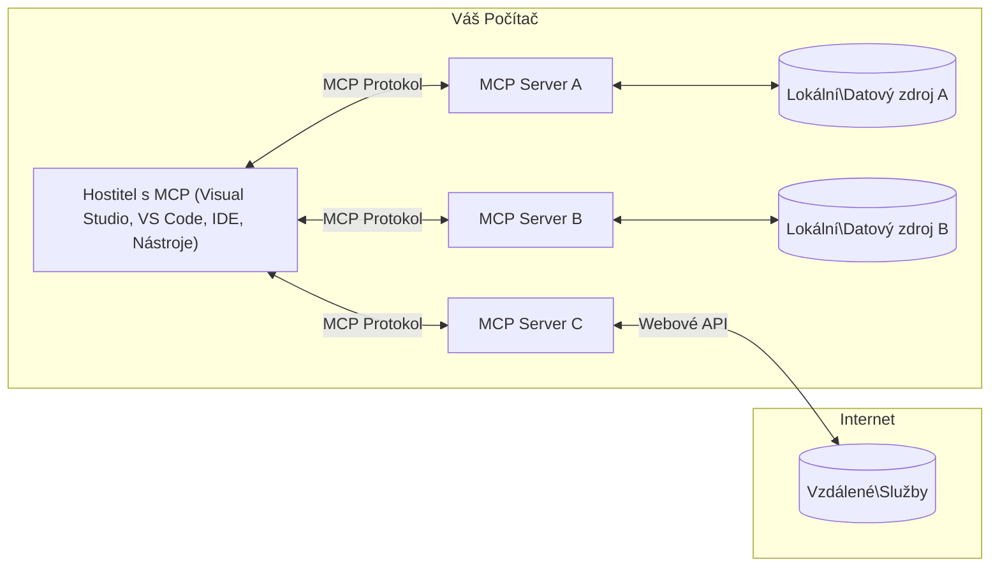

# Základní pojmy MCP: Ovládání Model Context Protocol pro integraci AI

[](https://youtu.be/earDzWGtE84)

_(Klikněte na obrázek výše pro zobrazení videa této lekce)_

[Model Context Protocol (MCP)](https://github.com/modelcontextprotocol) je výkonný, standardizovaný rámec, který optimalizuje komunikaci mezi velkými jazykovými modely (LLM) a externími nástroji, aplikacemi a datovými zdroji.  
Tato příručka vás provede klíčovými koncepty MCP. Naučíte se jeho klient-server architekturu, základní komponenty, komunikační mechaniky a nejlepší praktiky implementace.

- **Explicitní souhlas uživatele**: Veškerý přístup k datům a operace vyžadují explicitní souhlas uživatele před provedením. Uživatelé musí jasně rozumět, jaká data budou přístupná a jaké akce budou provedeny, s granulární kontrolou oprávnění a autorizací.

- **Ochrana soukromí dat**: Uživatelská data se zpřístupňují pouze s explicitním souhlasem a musí být chráněna robustními kontrolami přístupu během celého životního cyklu interakce. Implementace musí zabránit neoprávněnému přenosu dat a udržovat přísné hranice soukromí.

- **Bezpečnost spuštění nástrojů**: Každé vyvolání nástroje vyžaduje explicitní souhlas uživatele s jasným pochopením funkce nástroje, parametrů a potenciálního dopadu. Silné bezpečnostní hranice musí zabránit nechtěnému, nebezpečnému nebo škodlivému spuštění nástrojů.

- **Zabezpečení transportní vrstvy**: Veškeré komunikační kanály by měly používat vhodné šifrování a autentizační mechanismy. Vzdálená připojení by měla implementovat bezpečné transportní protokoly a správu přihlašovacích údajů.

#### Pokyny pro implementaci:

- **Správa oprávnění**: Implementujte jemnozrnné systémy oprávnění, které umožní uživatelům kontrolovat, ke kterým serverům, nástrojům a zdrojům mají přístup  
- **Autentizace a autorizace**: Používejte bezpečné metody autentizace (OAuth, API klíče) s řádnou správou tokenů a expirací  
- **Validace vstupů**: Validujte všechny parametry a vstupy dat podle definovaných schémat, abyste zabránili injekčním útokům  
- **Auditní záznamy**: Uchovávejte komplexní záznamy všech operací pro monitorování bezpečnosti a soulad

## Přehled

Tato lekce zkoumá základní architekturu a komponenty, které tvoří ekosystém Model Context Protocol (MCP). Naučíte se o klient-server architektuře, klíčových komponentách a komunikačních mechanismech, které podporují interakce MCP.

## Klíčové učební cíle

Po skončení této lekce budete:

- Rozumět klient-server architektuře MCP.  
- Identifikovat role a odpovědnosti Hostitelů, Klientů a Serverů.  
- Analyzovat hlavní funkce, které činí MCP flexibilní integrační vrstvou.  
- Naučit se, jak informační toky probíhají v ekosystému MCP.  
- Získat praktické poznatky z příkladů kódu v .NET, Javě, Pythonu a JavaScriptu.

## Architektura MCP: Hloubkový pohled

Ekosystém MCP je postaven na modelu klient-server. Tato modulární struktura umožňuje AI aplikacím efektivně komunikovat s nástroji, databázemi, API a kontextovými zdroji. Rozložíme si tuto architekturu na její základní komponenty.

MCP vychází z klient-server architektury, kde hostitelská aplikace může být připojena k více serverům:


- **MCP Hostitelé**: Programy jako VSCode, Claude Desktop, IDE nebo AI nástroje požadující přístup k datům přes MCP  
- **MCP Klienti**: Protokoloví klienti, kteří udržují 1:1 spojení se servery  
- **MCP Servery**: Lehká programová řešení, která zpřístupňují konkrétní schopnosti prostřednictvím standardizovaného Model Context Protocol  
- **Lokální datové zdroje**: Soubory, databáze a služby počítače, ke kterým mohou MCP servery bezpečně přistupovat  
- **Vzdálené služby**: Externí systémy dostupné přes internet, ke kterým se MCP servery mohou připojit přes API.

Protokol MCP je vyvíjející se standard používající verzování podle data (formát RRRR-MM-DD). Aktuální verze protokolu je **2025-11-25**. Nejnovější aktualizace [specifikace protokolu](https://modelcontextprotocol.io/specification/2025-11-25/) můžete vidět zde.

### 1. Hostitelé

V Model Context Protocol (MCP) jsou **Hostitelé** AI aplikace, které slouží jako primární rozhraní, skrze něž uživatelé komunikují s protokolem. Hostitelé koordinují a spravují připojení k více MCP serverům tím, že vytvářejí dedikované MCP klienty pro každé serverové připojení. Mezi příklady hostitelů patří:

- **AI aplikace**: Claude Desktop, Visual Studio Code, Claude Code  
- **Vývojová prostředí**: IDE a editory kódu s integrací MCP  
- **Vlastní aplikace**: Speciálně vytvoření AI agenti a nástroje

**Hostitelé** jsou aplikace, které koordinují interakce s AI modely. Oni:

- **Orchestrují AI modely**: Spouští nebo komunikují s LLM pro generování odpovědí a koordinaci AI pracovních postupů  
- **Spravují klientská připojení**: Vytvářejí a udržují jednoho MCP klienta na každé MCP serverové spojení  
- **Řídí uživatelské rozhraní**: Řídí tok konverzace, uživatelské interakce a prezentaci odpovědí  
- **Prosazují bezpečnost**: Kontrolují oprávnění, bezpečnostní omezení a autentizaci  
- **Zajišťují souhlas uživatelů**: Spravují uživatelská schválení pro sdílení dat a spuštění nástrojů

### 2. Klienti

**Klienti** jsou základní komponenty, které udržují dedikovaná jedno-na-jedno spojení mezi hostiteli a MCP servery. Každý MCP klient je vytvořen hostitelem pro konkrétní MCP server, čímž zajišťuje organizovaný a bezpečný komunikační kanál. Více klientů umožňuje hostitelům komunikovat současně s více servery.

**Klienti** jsou konektorové komponenty v hostitelské aplikaci. Oni:

- **Protokolová komunikace**: Odesílají JSON-RPC 2.0 požadavky na servery s výzvami a instrukcemi  
- **Vyjednávání schopností**: Vyjednávají podporované funkce a verze protokolu se servery při inicializaci  
- **Spouštění nástrojů**: Řídí požadavky na spuštění nástrojů od modelů a zpracovávají odpovědi  
- **Aktualizace v reálném čase**: Řídí oznámení a aktualizace v reálném čase od serverů  
- **Zpracování odpovědí**: Zpracovávají a formátují odpovědi serverů pro zobrazení uživatelům

### 3. Servery

**Servery** jsou programy, které poskytují kontext, nástroje a schopnosti MCP klientům. Mohou běžet lokálně (na stejném stroji jako hostitel) nebo vzdáleně (na externích platformách) a jsou odpovědné za zpracování požadavků klientů a poskytování strukturovaných odpovědí. Servery zpřístupňují konkrétní funkce prostřednictvím standardizovaného Model Context Protocol.

**Servery** jsou služby poskytující kontext a schopnosti. Oni:

- **Registrace funkcí**: Registrují a zpřístupňují dostupné primitivy (zdroje, výzvy, nástroje) klientům  
- **Zpracování požadavků**: Přijímají a vykonávají volání nástrojů, požadavky na zdroje a výzvy od klientů  
- **Poskytování kontextu**: Poskytují kontextové informace a data pro vylepšení odpovědí modelu  
- **Správa stavu**: Udržují stav relace a zpracovávají stavové interakce dle potřeby  
- **Oznámení v reálném čase**: Posílají oznámení o změnách schopností a aktualizacích připojeným klientům

Servery může vyvíjet kdokoliv, aby rozšířil schopnosti modelu specializovanou funkcionalitou, a podporují jak lokální, tak vzdálené scénáře nasazení.

### 4. Serverové primitivy

Servery v Model Context Protocol (MCP) poskytují tři základní **primitivy**, které definují fundamentální stavební kameny pro bohaté interakce mezi klienty, hostiteli a jazykovými modely. Tyto primitivy určují typy kontextových informací a akcí dostupných prostřednictvím protokolu.

MCP servery mohou zpřístupnit libovolnou kombinaci těchto tří základních primitiv:

#### Zdroje

**Zdroje** jsou datové zdroje, které poskytují kontextové informace AI aplikacím. Reprezentují statický nebo dynamický obsah, který může zlepšit porozumění modelu a rozhodování:

- **Kontextová data**: Strukturované informace a kontext pro potřebu AI modelu  
- **Znalostní báze**: Repozitáře dokumentů, články, manuály a vědecké práce  
- **Lokální datové zdroje**: Soubory, databáze a informace o lokálním systému  
- **Externí data**: Odpovědi API, webové služby a data vzdálených systémů  
- **Dynamický obsah**: Data v reálném čase aktualizovaná podle externích podmínek

Zdroje jsou identifikovány URI a podporují vyhledávání přes metody `resources/list` a získávání přes `resources/read`:

```text
file://documents/project-spec.md
database://production/users/schema
api://weather/current
```

#### Výzvy

**Výzvy** jsou znovupoužitelné šablony, které pomáhají strukturovat interakce s jazykovými modely. Poskytují standardizované vzory interakcí a šablonované pracovní postupy:

- **Interakce založené na šablonách**: Předstrukturované zprávy a začátky konverzace  
- **Šablony pracovních postupů**: Standardizované sekvence pro běžné úkoly a interakce  
- **Příklady s několika ukázkami**: Ukázkové šablony pro instrukce modelu  
- **Systémové výzvy**: Základní výzvy definující chování modelu a kontext  
- **Dynamické šablony**: Parametrizované výzvy přizpůsobující se konkrétním kontextům

Výzvy podporují nahrazování proměnných a lze je vyhledat metodou `prompts/list` a získat pomocí `prompts/get`:

```markdown
Generate a {{task_type}} for {{product}} targeting {{audience}} with the following requirements: {{requirements}}
```

#### Nástroje

**Nástroje** jsou spustitelné funkce, které si jazykové modely mohou vyvolat k provedení specifických akcí. Představují "slovesa" ekosystému MCP, umožňující modelům interagovat s externími systémy:

- **Spustitelné funkce**: Diskrétní operace vyvolatelné modely s konkrétními parametry  
- **Integrace externích systémů**: Volání API, dotazy do databází, manipulace se soubory, výpočty  
- **Unikátní identita**: Každý nástroj má odlišný název, popis a schéma parametrů  
- **Strukturovaný vstup/výstup**: Nástroje přijímají validované parametry a vracejí strukturované typované odpovědi  
- **Akční schopnosti**: Umožňují modelům provádět reálné akce a získávat živá data

Nástroje jsou definovány pomocí JSON Schema pro validaci parametrů, vyhledávají se přes `tools/list` a spouští přes `tools/call`. Nástroje mohou také obsahovat **ikony** jako doplňková metadata pro lepší prezentaci v uživatelském rozhraní.

**Anotace nástrojů**: Nástroje podporují behaviorální anotace (např. `readOnlyHint`, `destructiveHint`), které popisují, zda je nástroj pouze pro čtení nebo destruktivní, což klientům pomáhá rozhodovat o spuštění nástroje.

Příklad definice nástroje:

```typescript
server.tool(
  "search_products", 
  {
    query: z.string().describe("Search query for products"),
    category: z.string().optional().describe("Product category filter"),
    max_results: z.number().default(10).describe("Maximum results to return")
  }, 
  async (params) => {
    // Proveďte vyhledávání a vraťte strukturované výsledky
    return await productService.search(params);
  }
);
```

## Klientské primitivy

V Model Context Protocol (MCP) mohou **klienti** zpřístupnit primitivy, které umožňují serverům žádat o další schopnosti hostitelské aplikace. Tyto klientské primitivy umožňují bohatší a více interaktivní implementace serverů, které mohou přistupovat k schopnostem AI modelu a uživatelským interakcím.

### Sampling

**Sampling** umožňuje serverům žádat o dokončení výstupu jazykového modelu z AI aplikace klienta. Tento primitiv umožňuje serverům přístup k LLM schopnostem bez nutnosti mít zabudované vlastní modely:

- **Nezávislý přístup na model**: Servery mohou žádat dokončení bez zahrnutí LLM SDK nebo správy přístupu k modelu  
- **Serverem iniciovaná AI**: Umožňuje serverům autonomně generovat obsah za použití modelu klienta  
- **Rekurzivní LLM interakce**: Podporuje složité scénáře, kde servery potřebují AI pomoc pro zpracování  
- **Dynamická tvorba obsahu**: Umožňuje serverům vytvářet kontextové odpovědi pomocí modelu hostitele  
- **Podpora volání nástrojů**: Servery mohou zahrnovat parametry `tools` a `toolChoice` pro umožnění volání nástrojů modelem klienta během sampling

Sampling se zahajuje metodou `sampling/complete`, kdy servery posílají požadavky na doplnění klientům.

### Kořeny (Roots)

**Kořeny** poskytují standardizovaný způsob, jak klienti zpřístupňují hranice souborového systému serverům, což serverům pomáhá pochopit, ke kterým adresářům a souborům mají přístup:

- **Hranice souborového systému**: Definují rozsah, ve kterém mohou servery operovat  
- **Kontrola přístupu**: Pomáhají serverům pochopit, ke kterým adresářům a souborům mají oprávnění  
- **Dynamické aktualizace**: Klienti mohou oznamovat serverům změny seznamu kořenů  
- **Identifikace založená na URI**: Kořeny používají URI ve formátu `file://` k identifikaci přístupných složek a souborů

Kořeny se vyhledávají metodou `roots/list`, přičemž klienti posílají notifikace `notifications/roots/list_changed` při změně kořenů.

### Elicitace  

**Elicitace** umožňuje serverům žádat dodatečné informace nebo potvrzení od uživatelů prostřednictvím uživatelského rozhraní klienta:

- **Požadavky na vstupy od uživatelů**: Servery mohou žádat o další informace potřebné pro spuštění nástroje  
- **Potvrzovací dialogy**: Žádají uživatelské schválení pro citlivé nebo zásadní operace  
- **Interaktivní pracovní postupy**: Umožňují serverům vytvářet krokové uživatelské interakce  
- **Dynamický sběr parametrů**: Sbírají chybějící nebo volitelné parametry během vykonávání nástroje

Žádosti elicitace se posílají metodou `elicitation/request` pro sběr uživatelských vstupů přes rozhraní klienta.

**URL režim elicitace**: Servery mohou také žádat o URL-based uživatelské interakce, což umožňuje serverům směrovat uživatele na externí webové stránky pro autentizaci, potvrzení nebo zadávání dat.

### Protokolování

**Protokolování** umožňuje serverům posílat strukturované zprávy klientům pro debugování, sledování a operativní přehled:

- **Podpora debugování**: Umožňuje serverům poskytovat detailní logy pro odstraňování problémů  
- **Monitorování provozu**: Posílá stavové aktualizace a metriky výkonu klientům  
- **Zprávy o chybách**: Poskytuje detailní kontext chyb a diagnostické informace  
- **Auditní záznamy**: Vytváří komplexní záznamy operací a rozhodnutí serveru

Zprávy o protokolování jsou odesílány klientům pro větší transparentnost operací serveru a usnadnění debugování.

## Tok informací v MCP

Model Context Protocol (MCP) definuje strukturovaný tok informací mezi hostiteli, klienty, servery a modely. Pochopení tohoto toku pomáhá objasnit, jak jsou zpracovávány uživatelské požadavky a jak jsou do odpovědí modelu integrovány externí nástroje a data.
- **Host zahajuje připojení**  
  Hostitelská aplikace (například IDE nebo chat rozhraní) naváže připojení k serveru MCP, obvykle přes STDIO, WebSocket nebo jiný podporovaný přenos.

- **Jednání o schopnostech**  
  Klient (vložený v hostiteli) a server si vyměňují informace o jejich podporovaných funkcích, nástrojích, zdrojích a verzích protokolu. To zajišťuje, že obě strany rozumí dostupným schopnostem pro danou relaci.

- **Žádost uživatele**  
  Uživatel komunikuje s hostitelem (například zadá prompt nebo příkaz). Hostitel tento vstup sbírá a předává klientovi k zpracování.

- **Použití zdroje nebo nástroje**  
  - Klient může požádat server o další kontext nebo zdroje (například soubory, záznamy v databázi nebo články z databáze znalostí) pro obohacení porozumění modelu.  
  - Pokud model rozhodne, že je potřebný nástroj (např. pro načtení dat, výpočet nebo volání API), klient odešle serveru žádost o vyvolání nástroje, specifikující jméno nástroje a parametry.

- **Provedení na straně serveru**  
  Server přijme požadavek na zdroj nebo nástroj, provede nezbytné operace (například spustí funkci, provede dotaz do databáze nebo načte soubor) a výsledky vrátí klientovi ve strukturovaném formátu.

- **Generování odpovědi**  
  Klient integruje odpovědi serveru (data ze zdrojů, výstupy z nástrojů atd.) do probíhající interakce s modelem. Model tyto informace použije k vytvoření komplexní a kontextově relevantní odpovědi.

- **Prezentace výsledku**  
  Hostitel obdrží konečný výstup od klienta a prezentuje jej uživateli, často včetně generovaného textu modelem i výsledků z provedení nástrojů nebo vyhledávání ve zdrojích.

Tento tok umožňuje MCP podporovat pokročilé, interaktivní a kontextově uvědomělé AI aplikace tím, že bezproblémově propojuje modely s externími nástroji a zdroji dat.

## Architektura a vrstvy protokolu

MCP se skládá ze dvou odlišných architektonických vrstev, které spolupracují na poskytování kompletní komunikační struktury:

### Vrstva dat

**Vrstva dat** implementuje základní protokol MCP založený na **JSON-RPC 2.0**. Tato vrstva definuje strukturu zpráv, sémantiku a vzory interakce:

#### Základní komponenty:

- **Protokol JSON-RPC 2.0**: Veškerá komunikace využívá standardizovaný formát zpráv JSON-RPC 2.0 pro volání metod, odpovědi a oznámení  
- **Správa životního cyklu**: Řídí inicializaci připojení, jednání o schopnostech a ukončení relace mezi klienty a servery  
- **Primitiva serveru**: Umožňuje serverům poskytovat základní funkce prostřednictvím nástrojů, zdrojů a promptů  
- **Primitiva klienta**: Umožňuje serverům požadovat vzorkování z LLM, vyvolání uživatelského vstupu a odesílání logovacích zpráv  
- **Notifikace v reálném čase**: Podporuje asynchronní oznámení pro dynamické aktualizace bez potřeby dotazování

#### Klíčové vlastnosti:

- **Jednání o verzi protokolu**: Používá datumové verzování (RRRR-MM-DD) pro zajištění kompatibility  
- **Objevování schopností**: Klienti a servery si vyměňují informace o podporovaných funkcích během inicializace  
- **Stavové relace**: Uchovává stav připojení napříč vícero interakcemi pro kontextovou kontinuitu

### Vrstva přenosu

**Vrstva přenosu** spravuje komunikační kanály, rámování zpráv a autentizaci mezi účastníky MCP:

#### Podporované přenosové mechanismy:

1. **STDIO přenos**:
   - Využívá standardní vstupní/výstupní proudy pro přímou komunikaci procesů  
   - Optimální pro lokální procesy na stejném stroji bez síťových režijních nákladů  
   - Běžně používaný pro implementace lokálních serverů MCP  

2. **Streamovatelný HTTP přenos**:
   - Používá HTTP POST pro zprávy klient → server  
   - Volitelné Server-Sent Events (SSE) pro streamování server → klient  
   - Umožňuje vzdálenou komunikaci serveru přes sítě  
   - Podpora standardní HTTP autentizace (bearer tokeny, API klíče, vlastní hlavičky)  
   - MCP doporučuje OAuth pro zabezpečenou autentizaci na bázi tokenů

#### Abstrakce přenosu:

Vrstva přenosu abstrahuje detaily komunikace od vrstvy dat, což umožňuje stejný formát zpráv JSON-RPC 2.0 používat napříč všemi mechanismy přenosu. Tato abstrakce dovoluje aplikacím plynule přepínat mezi lokálními a vzdálenými servery.

### Bezpečnostní aspekty

Implementace MCP musí dodržovat několik zásadních bezpečnostních principů k zajištění bezpečných, důvěryhodných a zabezpečených interakcí ve všech operacích protokolu:

- **Souhlas a kontrola uživatele**: Uživatelé musí poskytovat výslovný souhlas před přístupem k datům nebo provedením operací. Měli by mít jasnou kontrolu nad tím, jaká data jsou sdílena a které akce jsou povoleny, podporována intuitivními uživatelskými rozhraními k přezkoumání a schválení aktivit.

- **Ochrana soukromí dat**: Uživatelská data by měla být zpřístupněna pouze s výslovným souhlasem a musí být chráněna vhodnými přístupovými kontrolami. Implementace MCP musí zabránit neoprávněnému přenosu dat a zajistit ochranu soukromí během všech interakcí.

- **Bezpečnost nástrojů**: Před vyvoláním jakéhokoli nástroje je vyžadován explicitní souhlas uživatele. Uživatelé by měli mít jasné pochopení funkčnosti každého nástroje a musí být prosazeny robustní bezpečnostní hranice, aby se předešlo nechtěnému nebo nebezpečnému spuštění nástroje.

Díky dodržování těchto bezpečnostních principů MCP zachovává důvěru uživatelů, ochranu soukromí a bezpečnost ve všech interakcích protokolu a zároveň umožňuje výkonné AI integrace.

## Ukázky kódu: Klíčové komponenty

Níže jsou ukázky kódu v několika populárních programovacích jazycích, které ilustrují implementaci klíčových komponent a nástrojů MCP serveru.

### Příklad .NET: Vytvoření jednoduchého MCP serveru s nástroji

Tento praktický příklad .NET ukazuje, jak implementovat jednoduchý MCP server s vlastními nástroji. Demonstruje, jak definovat a registrovat nástroje, zpracovávat požadavky a připojit server pomocí Model Context Protocol.

```csharp
using System;
using System.Threading.Tasks;
using ModelContextProtocol.Server;
using ModelContextProtocol.Server.Transport;
using ModelContextProtocol.Server.Tools;

public class WeatherServer
{
    public static async Task Main(string[] args)
    {
        // Create an MCP server
        var server = new McpServer(
            name: "Weather MCP Server",
            version: "1.0.0"
        );
        
        // Register our custom weather tool
        server.AddTool<string, WeatherData>("weatherTool", 
            description: "Gets current weather for a location",
            execute: async (location) => {
                // Call weather API (simplified)
                var weatherData = await GetWeatherDataAsync(location);
                return weatherData;
            });
        
        // Connect the server using stdio transport
        var transport = new StdioServerTransport();
        await server.ConnectAsync(transport);
        
        Console.WriteLine("Weather MCP Server started");
        
        // Keep the server running until process is terminated
        await Task.Delay(-1);
    }
    
    private static async Task<WeatherData> GetWeatherDataAsync(string location)
    {
        // This would normally call a weather API
        // Simplified for demonstration
        await Task.Delay(100); // Simulate API call
        return new WeatherData { 
            Temperature = 72.5,
            Conditions = "Sunny",
            Location = location
        };
    }
}

public class WeatherData
{
    public double Temperature { get; set; }
    public string Conditions { get; set; }
    public string Location { get; set; }
}
```

### Příklad Java: Komponenty MCP serveru

Tento příklad ukazuje stejný MCP server a registraci nástrojů jako výše uvedený .NET příklad, ale implementovaný v Javě.

```java
import io.modelcontextprotocol.server.McpServer;
import io.modelcontextprotocol.server.McpToolDefinition;
import io.modelcontextprotocol.server.transport.StdioServerTransport;
import io.modelcontextprotocol.server.tool.ToolExecutionContext;
import io.modelcontextprotocol.server.tool.ToolResponse;

public class WeatherMcpServer {
    public static void main(String[] args) throws Exception {
        // Vytvořit MCP server
        McpServer server = McpServer.builder()
            .name("Weather MCP Server")
            .version("1.0.0")
            .build();
            
        // Zaregistrovat nástroj pro počasí
        server.registerTool(McpToolDefinition.builder("weatherTool")
            .description("Gets current weather for a location")
            .parameter("location", String.class)
            .execute((ToolExecutionContext ctx) -> {
                String location = ctx.getParameter("location", String.class);
                
                // Získat data o počasí (zjednodušené)
                WeatherData data = getWeatherData(location);
                
                // Vrátit formátovanou odpověď
                return ToolResponse.content(
                    String.format("Temperature: %.1f°F, Conditions: %s, Location: %s", 
                    data.getTemperature(), 
                    data.getConditions(), 
                    data.getLocation())
                );
            })
            .build());
        
        // Připojit server pomocí stdio přenosu
        try (StdioServerTransport transport = new StdioServerTransport()) {
            server.connect(transport);
            System.out.println("Weather MCP Server started");
            // Udržovat server běžící, dokud není proces ukončen
            Thread.currentThread().join();
        }
    }
    
    private static WeatherData getWeatherData(String location) {
        // Implementace by volala API počasí
        // Zjednodušeno pro účely příkladu
        return new WeatherData(72.5, "Sunny", location);
    }
}

class WeatherData {
    private double temperature;
    private String conditions;
    private String location;
    
    public WeatherData(double temperature, String conditions, String location) {
        this.temperature = temperature;
        this.conditions = conditions;
        this.location = location;
    }
    
    public double getTemperature() {
        return temperature;
    }
    
    public String getConditions() {
        return conditions;
    }
    
    public String getLocation() {
        return location;
    }
}
```

### Příklad Python: Vytvoření MCP serveru

Tento příklad používá fastmcp, proto si jej prosím nejprve nainstalujte:

```python
pip install fastmcp
```
Ukázka kódu:

```python
#!/usr/bin/env python3
import asyncio
from fastmcp import FastMCP
from fastmcp.transports.stdio import serve_stdio

# Vytvořit FastMCP server
mcp = FastMCP(
    name="Weather MCP Server",
    version="1.0.0"
)

@mcp.tool()
def get_weather(location: str) -> dict:
    """Gets current weather for a location."""
    return {
        "temperature": 72.5,
        "conditions": "Sunny",
        "location": location
    }

# Alternativní přístup pomocí třídy
class WeatherTools:
    @mcp.tool()
    def forecast(self, location: str, days: int = 1) -> dict:
        """Gets weather forecast for a location for the specified number of days."""
        return {
            "location": location,
            "forecast": [
                {"day": i+1, "temperature": 70 + i, "conditions": "Partly Cloudy"}
                for i in range(days)
            ]
        }

# Registrovat nástroje třídy
weather_tools = WeatherTools()

# Spustit server
if __name__ == "__main__":
    asyncio.run(serve_stdio(mcp))
```

### Příklad JavaScript: Vytvoření MCP serveru

Tento příklad ukazuje vytvoření MCP serveru v JavaScriptu a registraci dvou nástrojů souvisejících s počasím.

```javascript
// Použití oficiálního SDK Model Context Protocol
import { McpServer } from "@modelcontextprotocol/sdk/server/mcp.js";
import { StdioServerTransport } from "@modelcontextprotocol/sdk/server/stdio.js";
import { z } from "zod"; // Pro validaci parametrů

// Vytvořit MCP server
const server = new McpServer({
  name: "Weather MCP Server",
  version: "1.0.0"
});

// Definovat nástroj pro počasí
server.tool(
  "weatherTool",
  {
    location: z.string().describe("The location to get weather for")
  },
  async ({ location }) => {
    // Toto by normálně volalo API počasí
    // Zjednodušeno pro demonstraci
    const weatherData = await getWeatherData(location);
    
    return {
      content: [
        { 
          type: "text", 
          text: `Temperature: ${weatherData.temperature}°F, Conditions: ${weatherData.conditions}, Location: ${weatherData.location}` 
        }
      ]
    };
  }
);

// Definovat nástroj pro předpověď
server.tool(
  "forecastTool",
  {
    location: z.string(),
    days: z.number().default(3).describe("Number of days for forecast")
  },
  async ({ location, days }) => {
    // Toto by normálně volalo API počasí
    // Zjednodušeno pro demonstraci
    const forecast = await getForecastData(location, days);
    
    return {
      content: [
        { 
          type: "text", 
          text: `${days}-day forecast for ${location}: ${JSON.stringify(forecast)}` 
        }
      ]
    };
  }
);

// Pomocné funkce
async function getWeatherData(location) {
  // Simulovat volání API
  return {
    temperature: 72.5,
    conditions: "Sunny",
    location: location
  };
}

async function getForecastData(location, days) {
  // Simulovat volání API
  return Array.from({ length: days }, (_, i) => ({
    day: i + 1,
    temperature: 70 + Math.floor(Math.random() * 10),
    conditions: i % 2 === 0 ? "Sunny" : "Partly Cloudy"
  }));
}

// Připojit server pomocí stdio transportu
const transport = new StdioServerTransport();
server.connect(transport).catch(console.error);

console.log("Weather MCP Server started");
```

Tento JavaScriptový příklad demonstruje, jak vytvořit MCP server pomocí Model Context Protocol SDK. Ukazuje, jak zaregistrovat dva nástroje pojmenované `weatherTool` a `forecastTool` a zpřístupnit je MCP klientům přes `StdioServerTransport`.

## Bezpečnost a autorizace

MCP obsahuje několik zabudovaných konceptů a mechanismů pro správu bezpečnosti a autorizace v celém protokolu:

1. **Řízení oprávnění nástrojů**:  
  Klienti mohou určit, které nástroje model může během relace používat. To zajišťuje, že přístup mají pouze explicitně autorizované nástroje, čímž se snižuje riziko nechtěných nebo nebezpečných operací. Oprávnění lze dynamicky konfigurovat podle uživatelských preferencí, organizačních politik nebo kontextu interakce.

2. **Autentizace**:  
  Servery mohou vyžadovat autentizaci před poskytnutím přístupu k nástrojům, zdrojům nebo citlivým operacím. Může se jednat o API klíče, OAuth tokeny nebo jiné autentizační schémata. Správná autentizace zajišťuje, že pouze důvěryhodní klienti a uživatelé mohou vyvolávat schopnosti na straně serveru.

3. **Validace**:  
  Validace parametrů je vyžadována pro všechna volání nástrojů. Každý nástroj definuje očekávané typy, formáty a omezení svých parametrů a server podle toho validuje příchozí požadavky. To zabraňuje vzniku nesprávných nebo škodlivých vstupů, které by mohly ohrozit integritu operací.

4. **Omezování frekvence (rate limiting)**:  
  Aby se zabránilo zneužití a zajistilo spravedlivé využívání serverových zdrojů, MCP servery mohou implementovat omezování frekvence volání nástrojů a přístupu ke zdrojům. Limity mohou být aplikovány na uživatele, relaci nebo globálně a pomáhají chránit proti útokům typu denial-of-service nebo nadměrné spotřebě zdrojů.

Kombinací těchto mechanismů MCP poskytuje bezpečný základ pro integraci jazykových modelů s externími nástroji a datovými zdroji, zároveň dává uživatelům a vývojářům jemnozrnnou kontrolu nad přístupem a využitím.

## Protokolové zprávy & tok komunikace

Komunikace MCP používá strukturované zprávy **JSON-RPC 2.0** pro jasné a spolehlivé interakce mezi hostiteli, klienty a servery. Protokol definuje specifické vzory zpráv pro různé typy operací:

### Hlavní typy zpráv:

#### **Inicializační zprávy**
- **Žádost `initialize`**: Naváže připojení a sjedná verzi protokolu a schopnosti  
- **Odpověď `initialize`**: Potvrdí podporované funkce a informace o serveru  
- **`notifications/initialized`**: Signál, že inicializace je dokončena a relace je připravena

#### **Zprávy pro objevování**
- **Žádost `tools/list`**: Získání seznamu dostupných nástrojů ze serveru  
- **Žádost `resources/list`**: Výpis dostupných zdrojů (datových zdrojů)  
- **Žádost `prompts/list`**: Získání dostupných šablon promptů

#### **Provedení zpráv**  
- **Žádost `tools/call`**: Spuštění konkrétního nástroje s předanými parametry  
- **Žádost `resources/read`**: Načtení obsahu z konkrétního zdroje  
- **Žádost `prompts/get`**: Získání šablony promptu s volitelnými parametry

#### **Zprávy na straně klienta**
- **Žádost `sampling/complete`**: Server žádá klienta o doplnění z LLM  
- **`elicitation/request`**: Server žádá uživatelský vstup přes klientské rozhraní  
- **Logovací zprávy**: Server odesílá klientovi strukturované logy

#### **Notifikační zprávy**
- **`notifications/tools/list_changed`**: Server informuje klienta o změně nástrojů  
- **`notifications/resources/list_changed`**: Server informuje klienta o změně zdrojů  
- **`notifications/prompts/list_changed`**: Server informuje klienta o změně promptů

### Struktura zpráv:

Všechny zprávy MCP dodržují formát JSON-RPC 2.0 s:
- **Žádostmi**: obsahují `id`, `method` a volitelné `params`  
- **Odpověďmi**: obsahují `id` a buď `result`, nebo `error`  
- **Notifikacemi**: obsahují `method` a volitelné `params` (bez `id` a bez očekávané odpovědi)

Tato strukturovaná komunikace zajišťuje spolehlivé, sledovatelné a rozšiřitelné interakce podporující pokročilé scénáře jako aktualizace v reálném čase, řetězení nástrojů a robustní zpracování chyb.

### Úkoly (experimentální)

**Úkoly** jsou experimentální funkcí, která poskytuje odolné exekuční obaly umožňující odložené získání výsledků a sledování stavu pro požadavky MCP:

- **Dlouhotrvající operace**: sledování náročných výpočtů, automatizace pracovních toků a hromadné zpracování  
- **Odložené výsledky**: dotazování se na stav úkolu a získání výsledků po dokončení operace  
- **Sledování stavu**: monitorování průběhu úkolu přes definované životní fáze  
- **Vícekrokové operace**: podpora složitých workflow napříč více interakcemi

Úkoly obalují standardní požadavky MCP a umožňují asynchronní vzory provádění pro operace, které nemohou být dokončeny okamžitě.

## Hlavní poznatky

- **Architektura**: MCP používá klient-server architekturu, kde hostitelé spravují více klientských připojení k serverům  
- **Účastníci**: Ekosystém zahrnuje hostitele (AI aplikace), klienty (protokolové konektory) a servery (poskytovatele schopností)  
- **Přenosové mechanismy**: Komunikace podporuje STDIO (lokální) a streamovatelný HTTP s volitelným SSE (vzdálený)  
- **Základní primitiva**: Servery vystavují nástroje (spustitelné funkce), zdroje (datové zdroje) a prompty (šablony)  
- **Primitiva klienta**: Servery mohou požadovat vzorkování (doplňky LLM s podporou volání nástrojů), vyvolání (uživatelský vstup včetně režimu URL), kořeny (hranice souborového systému) a logování z klientů  
- **Experimentální vlastnosti**: Úkoly poskytují odolné exekuční obaly pro dlouhotrvající operace  
- **Základ protokolu**: Postaven na JSON-RPC 2.0 s datumovým verzováním (aktuální: 2025-11-25)  
- **Funkce v reálném čase**: Podporuje oznámení pro dynamické aktualizace a synchronizaci v reálném čase  
- **Bezpečnost na prvním místě**: Explicitní souhlas uživatele, ochrana soukromí dat a zabezpečený přenos jsou klíčové požadavky

## Cvičení

Navrhněte jednoduchý MCP nástroj, který by byl pro vás v oboru užitečný. Definujte:
1. Jak se nástroj bude jmenovat  
2. Jaké přijímá parametry  
3. Jaký výstup vrací  
4. Jak by model mohl tento nástroj využít k řešení uživatelských problémů


---

## Co dál

Další kapitola: [Kapitola 2: Bezpečnost](../02-Security/README.md)

---

<!-- CO-OP TRANSLATOR DISCLAIMER START -->
**Prohlášení o vyloučení odpovědnosti**:  
Tento dokument byl přeložen pomocí AI překladatelské služby [Co-op Translator](https://github.com/Azure/co-op-translator). I když usilujeme o přesnost, mějte prosím na paměti, že automatizované překlady mohou obsahovat chyby nebo nepřesnosti. Původní dokument v jeho mateřském jazyce by měl být považován za rozhodující zdroj. Pro zásadní informace se doporučuje profesionální lidský překlad. Nejsme odpovědní za jakékoli nedorozumění nebo nesprávné výklady vyplývající z použití tohoto překladu.
<!-- CO-OP TRANSLATOR DISCLAIMER END -->