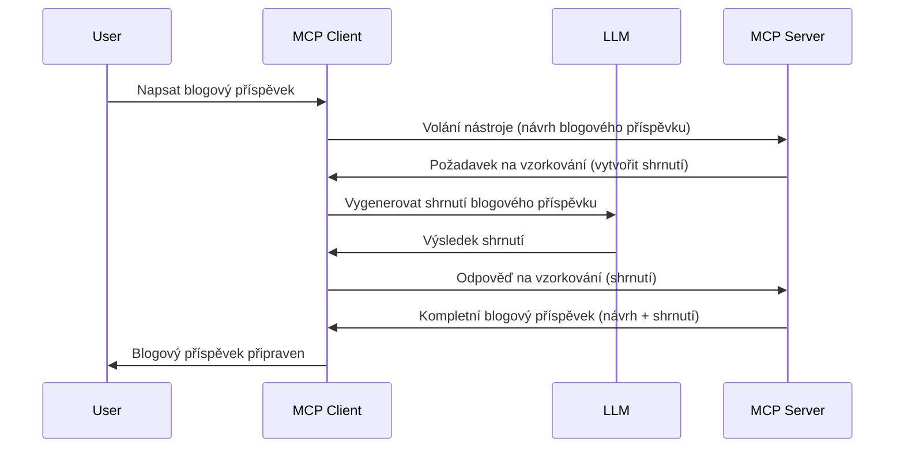

# Sampling - delegování funkcí klientovi

Někdy potřebujete, aby MCP klient a MCP server spolupracovali na dosažení společného cíle. Můžete mít případ, kdy server potřebuje pomoc LLM, který běží na klientovi. Pro tuto situaci byste měli použít sampling.

Pojďme prozkoumat některé případy použití a jak postavit řešení zahrnující sampling.

## Přehled

V této lekci se zaměříme na vysvětlení, kdy a kde sampling použít a jak jej nakonfigurovat.

## Výukové cíle

V této kapitole:

- Vysvětlíme, co je sampling a kdy jej použít.
- Ukážeme, jak nakonfigurovat sampling v MCP.
- Poskytneme příklady použití sampling v praxi.

## Co je sampling a proč jej používat?

Sampling je pokročilá funkce fungující následujícím způsobem:



### Sampling request

Dobře, nyní máme obecný přehled věrohodného scénáře, pojďme si povědět o sampling requestu, který server odesílá zpět klientovi. Takhle může tato žádost vypadat v JSON-RPC formátu:

```json
{
  "jsonrpc": "2.0",
  "id": 1,
  "method": "sampling/createMessage",
  "params": {
    "messages": [
      {
        "role": "user",
        "content": {
          "type": "text",
          "text": "Create a blog post summary of the following blog post: <BLOG POST>"
        }
      }
    ],
    "modelPreferences": {
      "hints": [
        {
          "name": "claude-3-sonnet"
        }
      ],
      "intelligencePriority": 0.8,
      "speedPriority": 0.5
    },
    "systemPrompt": "You are a helpful assistant.",
    "maxTokens": 100
  }
}
```

Je tu několik věcí, které stojí za zmínku:

- Prompt, pod content -> text, je náš prompt, tedy instrukce pro LLM, aby shrnul obsah blogového příspěvku.

- **modelPreferences**. Tato sekce je právě to, preference, doporučení konfigurace, kterou LLM používat. Uživatel si může zvolit, zda se těmito doporučeními řídit nebo je změnit. V tomto případě jsou doporučení ohledně modelu, rychlosti a priorit inteligence.
- **systemPrompt**, to je váš standardní systémový prompt, který dává LLM "osobnost" a obsahuje pokyny.
- **maxTokens**, další hodnota, která říká, kolik tokenů je doporučeno použít pro tento úkol.

### Sampling response

Tato odpověď je to, co MCP klient nakonec odešle zpět MCP serveru a je výsledkem toho, že klient zavolá LLM, počká na odpověď a pak sestaví tuto zprávu. Může to v JSON-RPC vypadat takto:

```json
{
  "jsonrpc": "2.0",
  "id": 1,
  "result": {
    "role": "assistant",
    "content": {
      "type": "text",
      "text": "Here's your abstract <ABSTRACT>"
    },
    "model": "gpt-5",
    "stopReason": "endTurn"
  }
}
```

Všimněte si, že odpověď je abstrakt blogového příspěvku přesně, jak jsme žádali. Také si všimněte, že použitý `model` není ten, který jsme požadovali, ale "gpt-5" místo "claude-3-sonnet". Toto ukazuje, že uživatel může změnit názor na to, co použít, a že váš sampling request je pouze doporučení.

Dobře, když už chápeme hlavní tok a užitečný úkol, pro který se používá "vytvoření blogového příspěvku + abstrakt", pojďme zjistit, co musíme udělat, aby to fungovalo.

### Typy zpráv

Sampling zprávy nejsou omezeny jen na text, ale můžete posílat také obrázky a audio. Takhle vypadá JSON-RPC odlišně:

**Text**

```json
{
  "type": "text",
  "text": "The message content"
}
```

**Obsah obrázku**

```json
{
  "type": "image",
  "data": "base64-encoded-image-data",
  "mimeType": "image/jpeg"
}
```

**Audio obsah**

```json
{
  "type": "audio",
  "data": "base64-encoded-audio-data",
  "mimeType": "audio/wav"
}
```

> NOTE: podrobnější informace o sampling naleznete v [oficiální dokumentaci](https://modelcontextprotocol.io/specification/2025-11-25/client/sampling)

## Jak nakonfigurovat sampling na klientovi

> Poznámka: pokud vytváříte pouze server, nemusíte zde moc nastavovat.

Na klientovi musíte definovat následující funkci takto:

```json
{
  "capabilities": {
    "sampling": {}
  }
}
```

Ta pak bude zaregistrována při inicializaci vybraného klienta se serverem.

## Příklad použití sampling - vytvoření blogového příspěvku

Napíšeme společně sampling server, který musí udělat toto:

1. Vytvořit nástroj na serveru.
1. Tento nástroj vytvoří sampling request.
1. Nástroj počká na odpověď na sampling request od klienta.
1. Pak vygeneruje výsledek nástroje.

Podívejme se na kód krok za krokem:

### -1- Vytvoření nástroje

**python**

```python
@mcp.tool()
async def create_blog(title: str, content: str, ctx: Context[ServerSession, None]) -> str:
    """Create a blog post and generate a summary"""

```

### -2- Vytvoření sampling requestu

Rozšiřte svůj nástroj tímto kódem:

**python**

```python
post = BlogPost(
        id=len(posts) + 1,
        title=title,
        content=content,
        abstract=""
    )

prompt = f"Create an abstract of the following blog post: title: {title} and draft: {content} "

result = await ctx.session.create_message(
        messages=[
            SamplingMessage(
                role="user",
                content=TextContent(type="text", text=prompt),
            )
        ],
        max_tokens=100,
)

```

### -3- Čekání na odpověď a vrácení výsledku

**python**

```python
post.abstract = result.content.text

posts.append(post)

# vraťte celý produkt
return json.dumps({
    "id": post.title,
    "abstract": post.abstract
})
```

### -4- Kompletní kód

**python**

```python
from starlette.applications import Starlette
from starlette.routing import Mount, Host

from mcp.server.fastmcp import Context, FastMCP

from mcp.server.session import ServerSession
from mcp.types import SamplingMessage, TextContent

import json


from uuid import uuid4
from typing import List
from pydantic import BaseModel


mcp = FastMCP("Blog post generator")

# app = FastAPI()

posts = []

class BlogPost(BaseModel):
    id: int
    title: str
    content: str
    abstract: str

posts: List[BlogPost] = []

@mcp.tool()
async def create_blog(title: str, content: str, ctx: Context[ServerSession, None]) -> str:
    """Create a blog post and generate a summary"""

    post = BlogPost(
        id=len(posts) + 1,
        title=title,
        content=content,
        abstract=""
    )

    prompt = f"Create an abstract of the following blog post: title: {title} and draft: {content} "

    result = await ctx.session.create_message(
        messages=[
            SamplingMessage(
                role="user",
                content=TextContent(type="text", text=prompt),
            )
        ],
        max_tokens=100,
    )

    post.abstract = result.content.text

    posts.append(post)

    # vrátit celý blogový příspěvek
    return json.dumps({
        "id": post.title,
        "abstract": post.abstract
    })

if __name__ == "__main__":
    print("Starting server...")
    # mcp.run()
    mcp.run(transport="streamable-http")

# spusťte aplikaci pomocí: python server.py
```

### -5- Testování ve Visual Studio Code

Pro otestování ve Visual Studio Code postupujte takto:

1. Spusťte server v terminálu
1. Přidejte ho do *mcp.json* (a ujistěte se, že je spuštěný), například takto:

   ```json
   "servers": {
      "blog-server": {
        "type": "http",
        "url": "http://localhost:8000/mcp"
      }
   }
   ```

1. Zadejte prompt:

   ```text
   create a blog post named "Where Python comes from", the content is "Python is actually named after Monty Python Flying Circus"
   ```

1. Nechte proběhnout sampling. Při prvním testování se zobrazí další dialog, který musíte potvrdit, poté se zobrazí standardní dialog s výzvou ke spuštění nástroje.

1. Prohlédněte výsledky. Uvidíte je hezky zobrazené v GitHub Copilot Chat, ale můžete také prohlédnout surovou JSON odpověď.

**Bonus:** Nástroje Visual Studio Code velmi dobře podporují sampling. Můžete nastavit přístup ke sampling na váš nainstalovaný server takto:

1. Přejděte do sekce rozšíření.
1. Vyberte ikonu ozubeného kola u vašeho nainstalovaného serveru v sekci "MCP SERVERS - INSTALLED".
1 Vyberte "Configure Model Access", zde můžete zvolit, které modely může GitHub Copilot používat při sampling. Také můžete zobrazit všechny nedávné sampling requesty výběrem "Show Sampling requests".

## Zadání

V tomto úkolu vytvoříte trochu odlišný sampling, konkrétně integraci sampling, která podporuje generování popisu produktu. Představme si scénář:

**Scénář**: Zaměstnanec back office v e-commerce potřebuje pomoc, generování popisů produktů zabírá příliš času. Proto máte vytvořit řešení, kde zavoláte nástroj "create_product" s argumenty "title" a "keywords" a ten by měl vytvořit kompletní produkt včetně pole "description", které by měl vyplnit klientský LLM.

TIP: použijte, co jste se naučili dříve, a postavte tento server a jeho nástroj pomocí sampling requestu.

## Řešení

[Řešení](./solution/README.md)

## Klíčové poznatky

Sampling je mocná funkce, která umožňuje serveru delegovat úkoly klientovi, když potřebuje pomoc LLM.

## Co dál

- [Kapitola 4 - Praktická implementace](../../04-PracticalImplementation/README.md)

---

<!-- CO-OP TRANSLATOR DISCLAIMER START -->
**Prohlášení o omezení odpovědnosti**:
Tento dokument byl přeložen pomocí AI překladatelské služby [Co-op Translator](https://github.com/Azure/co-op-translator). Přestože usilujeme o co největší přesnost, mějte prosím na paměti, že automatizované překlady mohou obsahovat chyby nebo nepřesnosti. Originální dokument v jeho mateřském jazyce by měl být považován za autoritativní zdroj. Pro kritické informace se doporučuje profesionální lidský překlad. Nejsme odpovědní za jakékoli nedorozumění nebo nesprávné interpretace vzniklé použitím tohoto překladu.
<!-- CO-OP TRANSLATOR DISCLAIMER END -->