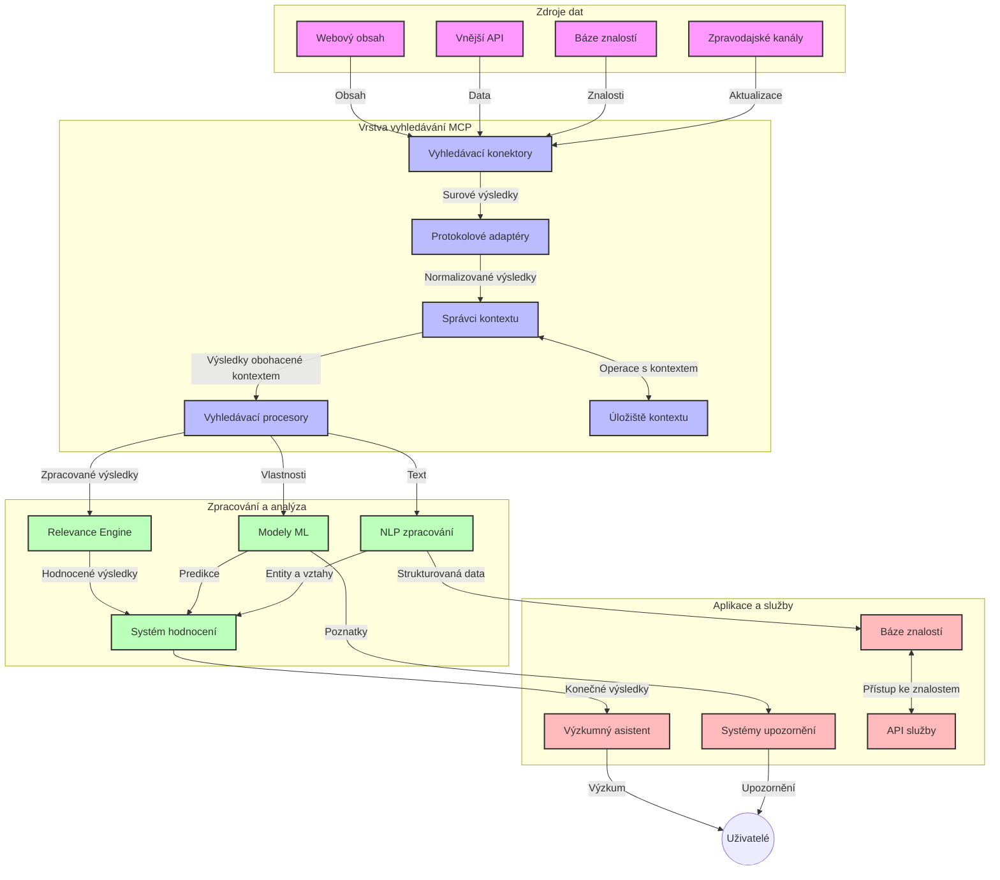
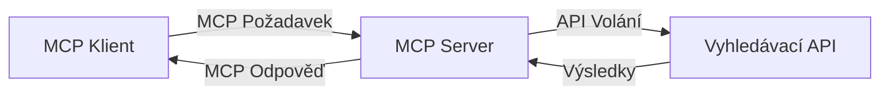
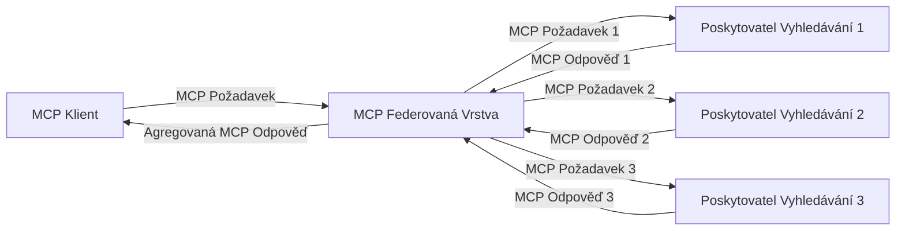
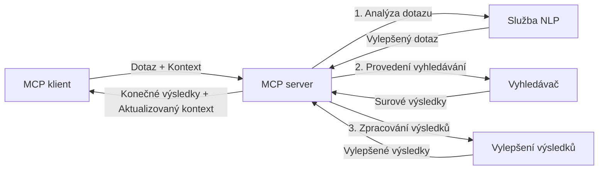

# Model Context Protocol pro vyhledávání na webu v reálném čase

## Přehled

Vyhledávání na webu v reálném čase se stalo nezbytným v dnešním světě řízeném informacemi, kde aplikace potřebují okamžitý přístup k aktuálním informacím z celého internetu, aby mohly poskytovat relevantní a včasné odpovědi. Model Context Protocol (MCP) představuje významný pokrok v optimalizaci těchto procesů vyhledávání v reálném čase, zlepšuje efektivitu vyhledávání, zachovává kontextovou integritu a zvyšuje celkový výkon systému.

Tento modul zkoumá, jak MCP transformuje vyhledávání na webu v reálném čase tím, že poskytuje standardizovaný přístup k řízení kontextu napříč AI modely, vyhledávači a aplikacemi.

### Co se naučíte

V tomto komplexním průvodci objevíte:

- Jak MCP vytváří bezproblémové propojení mezi AI modely a schopnostmi vyhledávání v reálném čase na webu
- Architektonické vzory pro implementaci efektivních a škálovatelných vyhledávacích řešení s MCP
- Techniky pro zachování kontextu vyhledávání napříč více dotazy a interakcemi
- Praktické implementace kódu v Pythonu a JavaScriptu pro různé scénáře vyhledávání
- Metody pro vyvážení relevance, aktuálnosti a výkonu v systémech vyhledávání poháněných MCP

## Úvod do vyhledávání na webu v reálném čase

Vyhledávání na webu v reálném čase je technologický přístup, který umožňuje průběžné dotazování, zpracování a analýzu informací z webu, jakmile jsou publikovány nebo aktualizovány, což systémům umožňuje poskytovat čerstvé a relevantní informace s minimální latencí. Na rozdíl od tradičních vyhledávacích systémů pracujících se zindexovanými daty, která mohou být stará hodiny či dny, vyhledávání v reálném čase pracuje s živými daty z webu, poskytující přehledy a informace, které odrážejí aktuální stav online obsahu.

### Základní koncepty vyhledávání na webu v reálném čase:

- **Průběžné zpracování dotazů**: Vyhledávací dotazy jsou zpracovávány na základě neustále aktualizovaných datových zdrojů
- **Priorita aktuálnosti**: Systémy jsou navrženy tak, aby upřednostňovaly nejnovější informace
- **Vyvážení relevance**: Udržování rovnováhy mezi relevancí a aktuálností
- **Škálovatelná architektura**: Systémy musí zvládat proměnlivou zátěž dotazů a objemy dat
- **Kontextové porozumění**: Udržování uživatelského kontextu napříč iteracemi vyhledávání je klíčové pro smysluplné výsledky
- **Dynamická reformulace dotazů**: Adaptivní úpravy dotazů na základě kontextu a předchozích výsledků
- **Integrace více zdrojů**: Kombinování výsledků z různých vyhledávacích poskytovatelů a webových zdrojů
- **Sémantické porozumění**: Zpracování dotazů a obsahu na základě významu, nikoliv pouze klíčových slov
- **Hodnocení v reálném čase**: Průběžné přizpůsobování hodnocení výsledků s přibývajícími novými informacemi

### Model Context Protocol a vyhledávání na webu v reálném čase

Model Context Protocol (MCP) řeší několik klíčových výzev ve vyhledávacím prostředí v reálném čase:

1. **Zachování kontextu vyhledávání**: MCP standardizuje způsob udržování kontextu napříč distribuovanými komponentami vyhledávání, zajišťuje, že AI modely a zpracovatelské uzly mají přístup k relevantní historii dotazů a uživatelským preferencím.

2. **Efektivní správa dotazů**: Poskytováním strukturovaných mechanismů pro přenos kontextu MCP snižuje režii spojenou s opakováním kontextu v každé iteraci vyhledávání.

3. **Interoperabilita**: MCP vytváří společný jazyk pro sdílení kontextu mezi různými vyhledávacími technologiemi a AI modely, což umožňuje flexibilnější a rozšiřitelnější architektury.

4. **Kontext optimalizovaný pro vyhledávání**: Implementace MCP mohou upřednostňovat, které prvky kontextu jsou nejrelevantnější pro efektivní vyhledávání, a optimalizovat tak výkon i přesnost.

5. **Adaptivní zpracování vyhledávání**: Díky správě kontextu prostřednictvím MCP mohou vyhledávací systémy dynamicky upravovat zpracování na základě vyvíjejících se uživatelských potřeb a informačního prostředí.

V moderních aplikacích od agregace zpráv po výzkumné asistenty umožňuje integrace MCP s webovými vyhledávacími technologiemi inteligentnější, kontextově uvědomělé vyhledávání, které dokáže poskytovat stále relevantnější výsledky během pokračujících interakcí uživatelů.

## Výukové cíle

Na konci této lekce budete schopni:

- Porozumět základům vyhledávání na webu v reálném čase a jeho výzvám v moderních aplikacích
- Vysvětlit, jak Model Context Protocol (MCP) zlepšuje schopnosti vyhledávání na webu v reálném čase
- Implementovat řešení vyhledávání založená na MCP pomocí populárních frameworků a API
- Navrhnout a nasadit škálovatelnou, vysoce výkonnou architekturu vyhledávání s MCP
- Aplikovat koncepty MCP na různé scénáře včetně sémantického vyhledávání, asistence při výzkumu a prohlížení s podporou AI
- Hodnotit nové trendy a budoucí inovace v technologii vyhledávání založené na MCP
- Vyvíjet kontextově uvědomělé vyhledávací systémy, které se učí z uživatelských interakcí
- Integrovat schopnosti webového vyhledávání do AI asistentů pomocí standardizovaných protokolů MCP
- Vytvářet vícestupňové vyhledávací pipeline, které postupně zpřesňují výsledky na základě kontextu
- Optimalizovat výkon vyhledávání při zachování komplexního povědomí o kontextu

### Definice a význam

Vyhledávání na webu v reálném čase zahrnuje průběžné dotazování, získávání a doručování webových informací s minimální latencí. Na rozdíl od tradičních vyhledávačů, které pravidelně procházejí a indexují web, směřuje vyhledávání v reálném čase k získávání informací ihned po jejich dostupnosti, což umožňuje okamžitý přístup k nejaktuálnějšímu obsahu.

Klíčové charakteristiky vyhledávání na webu v reálném čase zahrnují:

- **Čerstvost**: Upřednostňování nedávného obsahu a aktualizací
- **Průběžné zpracování**: Neustálý monitoring nových informací
- **Přizpůsobení dotazů**: Zdokonalování vyhledávacích dotazů na základě kontextu a zpětné vazby
- **Okamžité doručení**: Poskytování výsledků vyhledávání s minimálním zpožděním
- **Zachování kontextu**: Stavění na předchozích dotazech pro lepší relevanci

### Výzvy v tradičním webovém vyhledávání

Tradiční přístupy k webovému vyhledávání čelí při použití v reálném čase několika omezením:

1. **Fragmentace kontextu**: Obtížné udržet kontext vyhledávání napříč více dotazy
2. **Aktuálnost informací**: Problémy s přístupem a upřednostněním nejnovějších informací
3. **Komplexnost integrace**: Problémy s interoperabilitou mezi vyhledávacími systémy a aplikacemi
4. **Problémy s latencí**: Vyvážení komplexního vyhledávání s požadavky na dobu odezvy
5. **Ladění relevance**: Zajištění přesnosti a relevance při upřednostňování aktuálnosti

## Porozumění Model Context Protocol (MCP) pro vyhledávání

### Co je MCP v kontextu vyhledávání?

Model Context Protocol (MCP) je standardizovaný komunikační protokol navržený k usnadnění efektivní interakce mezi AI modely a aplikacemi. V kontextu vyhledávání na webu v reálném čase poskytuje MCP rámec pro:

- Zachování kontextu vyhledávání v průběhu sekvencí dotazů
- Standardizaci formátů vyhledávacích dotazů a výsledků
- Optimalizaci přenosu parametrů vyhledávání a výsledků
- Zlepšení komunikace mezi modelem a vyhledávačem

### Základní komponenty a architektura

Architektura MCP pro vyhledávání na webu v reálném čase se skládá z několika klíčových komponent:

1. **Správci kontextu dotazů**: Řídí a udržují kontext vyhledávání napříč více dotazy
2. **Zpracovatelské moduly vyhledávání**: Zpracovávají přicházející vyhledávací požadavky pomocí technik uvědomělých o kontextu
3. **Adaptéry protokolu**: Převádějí mezi různými vyhledávacími API při zachování kontextu
4. **Úložiště kontextu**: Efektivně ukládá a načítá historii vyhledávání a preference
5. **Vyhledávací konektory**: Připojují se k různým vyhledávačům a webovým API



### Jak MCP zlepšuje vyhledávání na webu v reálném čase

MCP řeší tradiční problémy webového vyhledávání prostřednictvím:

- **Kontinuity kontextu**: Udržování vztahů mezi dotazy po celou dobu vyhledávací relace
- **Optimalizovaného přenosu**: Snižování redundance v parametrech vyhledávání pomocí inteligentní správy kontextu
- **Standardizovaných rozhraní**: Poskytování konzistentních API pro vyhledávací komponenty
- **Snížení latence**: Minimalizace režie zpracování díky efektivní správě kontextu
- **Zvýšení relevance**: Zlepšení relevance vyhledávání zachováním uživatelského záměru napříč více dotazy

## Integrace a implementace

Systémy vyhledávání na webu v reálném čase vyžadují pečlivý návrh architektury a implementaci, aby udržely jak výkon, tak kontextovou integritu. Model Context Protocol nabízí standardizovaný přístup k integraci AI modelů a vyhledávacích technologií, umožňující sofistikovanější, kontextově uvědomělé vyhledávací pipeline.

### Přehled integrace MCP v architekturách vyhledávání

Implementace MCP v prostředích vyhledávání na webu v reálném čase zahrnuje několik klíčových aspektů:

1. **Serializace kontextu vyhledávání**: MCP poskytuje efektivní mechanismy pro kódování kontextových informací v rámci vyhledávacích požadavků, zajišťující, že nezbytný kontext následuje dotaz během celého zpracovatelského procesu. To zahrnuje standardizované formáty serializace optimalizované pro metadata související s vyhledáváním.

2. **Stavové zpracování vyhledávání**: MCP umožňuje inteligentnější stavové zpracování udržováním konzistentní reprezentace kontextu napříč iteracemi vyhledávání. To je zvláště cenné ve vícestupňových vyhledávacích pipeline, kde zdokonalování kontextu zlepšuje výsledky.

3. **Rozšiřování a zpřesňování dotazů**: Implementace MCP v systémech vyhledávání umožňují sofistikované rozšiřování a zpřesňování dotazů na základě akumulovaného kontextu, což umožňuje progresivně relevantnější výsledky během vyhledávací relace.

4. **Cacheování výsledků a prioritizace**: Standardizací správy kontextu pomáhá MCP řídit cache výsledků a jejich prioritizaci, což umožňuje komponentám adaptovat se na vyvíjející se vyhledávací kontext.

5. **Federace a agregace vyhledávání**: MCP usnadňuje sofistikovanější federaci vyhledávání napříč více backendy tím, že poskytuje strukturované reprezentace kontextu vyhledávání, což umožňuje smysluplnější agregaci výsledků z různých zdrojů.

Implementace MCP napříč různými vyhledávacími technologiemi vytváří jednotný přístup k řízení kontextu, snižuje potřebu vlastního integračního kódu a současně zvyšuje schopnost systému udržet smysluplný kontext, jak se dotazy vyvíjejí.

### MCP v různých implementacích webového vyhledávání

Tyto příklady vycházejí z aktuální specifikace MCP, která se zaměřuje na protokol založený na JSON-RPC s různými transportními mechanismy. Kód demonstruje, jak lze realizovat vlastní integrace vyhledávání při zachování plné kompatibility s protokolem MCP.

<details>
<summary>Implementace v Pythonu s generickým vyhledávacím API</summary>

```python
import asyncio
import json
import aiohttp
from typing import Dict, Any, Optional, List
from contextlib import asynccontextmanager
from collections.abc import AsyncIterator

# Importujte standardní MCP knihovny
from mcp.client.session import ClientSession
from mcp.client.streamable_http import streamablehttp_client
from mcp.types import TextContent, CreateMessageRequestParams, CreateMessageResult
from mcp.server.fastmcp import FastMCP

# Vytvořte FastMCP server pro webové vyhledávání
search_server = FastMCP("WebSearch")

# Třída pro správu operací webového vyhledávání
class WebSearchHandler:
    def __init__(self, api_endpoint: str, api_key: str):
        self.api_endpoint = api_endpoint
        self.api_key = api_key
        self.session = None
        
    async def initialize(self):
        """Initialize the HTTP session"""
        self.session = aiohttp.ClientSession(
            headers={"Authorization": f"Bearer {self.api_key}"}
        )
    
    async def close(self):
        """Close the HTTP session"""
        if self.session:
            await self.session.close()
            
    async def perform_search(self, query: str, max_results: int = 5, 
                           include_domains: List[str] = None, 
                           exclude_domains: List[str] = None,
                           time_period: str = "any") -> Dict[str, Any]:
        """Perform web search using the search API"""
        # Sestavte parametry vyhledávání
        search_params = {
            "q": query,
            "limit": max_results,
            "time": time_period
        }
        
        if include_domains:
            search_params["site"] = ",".join(include_domains)
            
        if exclude_domains:
            search_params["exclude_site"] = ",".join(exclude_domains)
        
        # Proveďte vyhledávací požadavek
        try:
            async with self.session.get(
                self.api_endpoint,
                params=search_params
            ) as response:
                if response.status != 200:
                    error_text = await response.text()
                    raise Exception(f"Search API error: {response.status} - {error_text}")
                
                search_data = await response.json()
                
                # Převést specifickou odpověď API do standardního formátu
                results = []
                for item in search_data.get("results", []):
                    results.append({
                        "title": item.get("title", ""),
                        "url": item.get("url", ""),
                        "snippet": item.get("snippet", ""),
                        "date": item.get("published_date", ""),
                        "source": item.get("source", "")
                    })
                
                return {
                    "query": query,
                    "totalResults": len(results),
                    "results": results
                }
        except Exception as e:
            print(f"Search API request error: {e}")
            raise

# Inicializujte správce vyhledávání
search_handler = WebSearchHandler(
    api_endpoint="https://api.search-service.example/search",
    api_key="your-api-key-here"
)

# Nastavte životní cyklus pro správu správce vyhledávání
@asyncio.asynccontextmanager
async def app_lifespan(server: FastMCP):
    """Manage application lifecycle"""
    await search_handler.initialize()
    try:
        yield {"search_handler": search_handler}
    finally:
        await search_handler.close()

# Nastavte životní cyklus serveru
search_server = FastMCP("WebSearch", lifespan=app_lifespan)

# Zaregistrujte nástroj pro webové vyhledávání
@search_server.tool()
async def web_search(query: str, max_results: int = 5, 
                   include_domains: List[str] = None,
                   exclude_domains: List[str] = None,
                   time_period: str = "any") -> Dict[str, Any]:
    """
    Search the web for information
    
    Args:
        query: The search query
        max_results: Maximum number of results to return (default: 5)
        include_domains: List of domains to include in search results
        exclude_domains: List of domains to exclude from search results
        time_period: Time period for results ("day", "week", "month", "any")
        
    Returns:
        Dictionary containing search results
    """
    ctx = search_server.get_context()
    search_handler = ctx.request_context.lifespan_context["search_handler"]
    
    results = await search_handler.perform_search(
        query=query,
        max_results=max_results,
        include_domains=include_domains,
        exclude_domains=exclude_domains,
        time_period=time_period
    )
    
    return results

# Příklad použití klienta
async def client_example():
    # Připojte se k vyhledávacímu serveru pomocí Streamable HTTP transportu
    async with streamablehttp_client("http://localhost:8000/mcp") as (read, write, _):
        async with ClientSession(read, write) as session:
            # Inicializujte připojení
            await session.initialize()
            
            # Zavolejte nástroj web_search
            search_results = await session.call_tool(
                "web_search", 
                {
                    "query": "latest developments in AI and Model Context Protocol",
                    "max_results": 5,
                    "time_period": "day",
                    "include_domains": ["github.com", "microsoft.com"]
                }
            )
            
            print(f"Search results: {search_results}")

# Příklad spuštění serveru
if __name__ == "__main__":
    # Spusťte server se Streamable HTTP transportem
    search_server.run(transport="streamable-http")
```
</details> 

<details>
<summary>Implementace v JavaScriptu s vyhledáváním v prohlížeči</summary>

```javascript
// Implementace MCP serveru pro webové vyhledávání
import { McpServer, ResourceTemplate } from '@modelcontextprotocol/sdk/server/mcp.js';
import { StreamableHTTPServerTransport } from '@modelcontextprotocol/sdk/server/streamableHttp.js';
import { z } from 'zod';

// Vytvoření MCP serveru pro webové vyhledávání
const searchServer = new McpServer({
    name: "BrowserSearch",
    description: "A server that provides web search capabilities"
});

// Třída služby vyhledávání
class SearchService {
    constructor(searchApiUrl, apiKey) {
        this.searchApiUrl = searchApiUrl;
        this.apiKey = apiKey;
    }

    async performSearch(parameters) {
        const {
            query = '',
            maxResults = 5,
            includeDomains = [],
            excludeDomains = [],
            timePeriod = 'any'
        } = parameters;
        
        // Sestavit URL vyhledávání s parametry
        const url = new URL(this.searchApiUrl);
        url.searchParams.append('q', query);
        url.searchParams.append('limit', maxResults);
        url.searchParams.append('time', timePeriod);
        
        if (includeDomains.length > 0) {
            url.searchParams.append('site', includeDomains.join(','));
        }
        
        if (excludeDomains.length > 0) {
            url.searchParams.append('exclude_site', excludeDomains.join(','));
        }
        
        try {
            const response = await fetch(url.toString(), {
                method: 'GET',
                headers: {
                    'Authorization': `Bearer ${this.apiKey}`,
                    'Content-Type': 'application/json'
                }
            });
            
            if (!response.ok) {
                const errorText = await response.text();
                throw new Error(`Search API error: ${response.status} - ${errorText}`);
            }
            
            const searchData = await response.json();
            
            // Převést odpověď specifickou pro API do standardního formátu
            const results = searchData.results?.map(item => ({
                title: item.title || '',
                url: item.url || '',
                snippet: item.snippet || '',
                date: item.published_date || '',
                source: item.source || ''
            })) || [];
            
            return {
                query,
                totalResults: results.length,
                results
            };
        } catch (error) {
            console.error('Search API request error:', error);
            throw error;
        }
    }
}

// Inicializovat službu vyhledávání
const searchService = new SearchService(
    'https://api.search-service.example/search',
    'your-api-key-here'
);

// Nastavit poskytovatele kontextu pro server
searchServer.setContextProvider(() => {
    return {
        searchService
    };
});

// Registrovat nástroj pro webové vyhledávání
searchServer.tool({
    name: 'web_search',
    description: 'Search the web for information',
    parameters: {
        type: 'object',
        properties: {
            query: {
                type: 'string',
                description: 'The search query'
            },
            maxResults: {
                type: 'integer',
                description: 'Maximum number of results to return',
                default: 5
            },
            includeDomains: {
                type: 'array',
                items: { type: 'string' },
                description: 'List of domains to include in search results'
            },
            excludeDomains: {
                type: 'array',
                items: { type: 'string' },
                description: 'List of domains to exclude from search results'
            },
            timePeriod: {
                type: 'string',
                description: 'Time period for results',
                enum: ['day', 'week', 'month', 'any'],
                default: 'any'
            }
        },
        required: ['query']
    },
    handler: async (params, context) => {
        const { searchService } = context;
        return await searchService.performSearch(params);
    }
});

// Ukázkový klientský kód pro připojení k vyhledávacímu serveru
import { Client } from '@modelcontextprotocol/sdk/client/index.js';
import { StreamableHTTPClientTransport } from '@modelcontextprotocol/sdk/client/streamableHttp.js';

async function connectToSearchServer() {
    // Připojit se k vyhledávacímu serveru
    const transport = new StreamableHTTPClientTransport(
        new URL('http://localhost:8000/mcp')
    );
    
    const client = new Client({
        name: 'search-client',
        version: '1.0.0'
    });
    
    await client.connect(transport);
    
    // Spustit nástroj pro vyhledávání
    const searchResults = await client.callTool({
        name: 'web_search',
        arguments: {
            query: 'Model Context Protocol implementation examples',
            maxResults: 10,
            timePeriod: 'week',
            includeDomains: ['github.com', 'docs.microsoft.com']
        }
    });
    
    console.log('Search results:', searchResults);
    
    // Úklid
    await client.disconnect();
}

// Spustit server
const transport = new StreamableHTTPServerTransport();
await searchServer.connect(transport);
console.log('Search server running at http://localhost:8000/mcp');

// V samostatném procesu nebo po spuštění serveru
// connectToSearchServer().catch(console.error);
```
</details> 

## Upozornění k příkladům kódu

> **Důležitá poznámka**: Níže uvedené příklady kódu demonstrují integraci Model Context Protocolu (MCP) s funkcionalitou webového vyhledávání. Přestože následují vzory a struktury oficiálních MCP SDK, byly zjednodušeny pro vzdělávací účely.
> 
> Tyto příklady ukazují:
> 
> 1. **Implementaci v Pythonu**: FastMCP serverovou implementaci, která poskytuje nástroj pro webové vyhledávání a připojuje se k externímu vyhledávacímu API. Tento příklad demonstruje správnou správu životního cyklu, zacházení s kontextem a implementaci nástroje podle vzorů z [oficiálního MCP Python SDK](https://github.com/modelcontextprotocol/python-sdk). Server využívá doporučený transport Streamable HTTP, který nahradil starší SSE transport pro produkční nasazení.
> 
> 2. **Implementaci v JavaScriptu**: Implementaci v TypeScriptu/JavaScriptu používající FastMCP vzor z [oficiálního MCP TypeScript SDK](https://github.com/modelcontextprotocol/typescript-sdk) k vytvoření vyhledávacího serveru se správným definováním nástrojů a klientskými připojeními. Následuje nejnovější doporučené vzory pro správu session a uchování kontextu.
> 
> Tyto příklady by pro produkční použití vyžadovaly další ošetření chyb, autentifikaci a specifickou integraci API. Ukázané koncové body vyhledávacích API (`https://api.search-service.example/search`) jsou zástupné a měly by být nahrazeny reálnými endpointy vyhledávacích služeb.
> 
> Pro kompletní implementační detaily a nejaktuálnější přístupy prosím odkazujte na [oficiální specifikaci MCP](https://spec.modelcontextprotocol.io/) a dokumentaci SDK.

## Základní koncepty

### Rámec Model Context Protocol (MCP)

Základním kamenem je Model Context Protocol, který poskytuje standardizovaný způsob, jak si AI modely, aplikace a služby vyměňují kontext. Ve vyhledávání na webu v reálném čase je tento rámec klíčový pro tvorbu koherentních vyhledávacích zážitků s více kroky. Klíčové komponenty zahrnují:

1. **Klient-server architektura**: MCP zavádí jasné rozdělení mezi klienty vyhledávání (žadatelé) a servery vyhledávání (poskytovatelé), což umožňuje flexibilní modely nasazení.

2. **Komunikace JSON-RPC**: Protokol používá JSON-RPC pro výměnu zpráv, což zajišťuje kompatibilitu s webovými technologiemi a snadnou implementaci napříč různými platformami.

3. **Správa kontextu**: MCP definuje strukturované metody pro udržování, aktualizaci a využívání kontextu vyhledávání napříč více interakcemi.

4. **Definice nástrojů**: Vyhledávací schopnosti jsou vystaveny jako standardizované nástroje s jasně definovanými parametry a návratovými hodnotami.

5. **Podpora streamování**: Protokol podporuje streamování výsledků, které je nezbytné pro vyhledávání v reálném čase, kdy výsledky mohou přicházet postupně.

### Vzory integrace webového vyhledávání

Při integraci MCP s webovým vyhledáváním se objevuje několik vzorů:

#### 1. Přímá integrace poskytovatele vyhledávání



V tomto vzoru MCP server přímo komunikuje s jedním nebo více vyhledávacími API, převádí požadavky MCP na specifické volání API a formátuje výsledky jako odpovědi MCP.

#### 2. Federované vyhledávání se zachováním kontextu



Tento vzor rozděluje vyhledávací dotazy mezi více poskytovatelů vyhledávání kompatibilních s MCP, přičemž každý může být specializovaný na různé typy obsahu nebo vyhledávacích schopností, přičemž se udržuje jednotný kontext.

#### 3. Kontextem vylepšený řetězec vyhledávání



V tomto vzoru je vyhledávací proces rozdělen do několika fází, přičemž kontext je na každém kroku rozšiřován, což vede k postupně relevantnějším výsledkům.

### Komponenty kontextu vyhledávání

V MCP vyhledávání na webu obvykle kontext obsahuje:

- **Historie dotazů**: Předchozí vyhledávací dotazy v relaci
- **Preferencí uživatele**: Jazyk, region, nastavení bezpečného vyhledávání
- **Historie interakcí**: Které výsledky byly kliknuty, čas strávený u výsledků
- **Parametry vyhledávání**: Filtry, řazení a další modifikátory vyhledávání
- **Odborné znalosti**: Kontext relevantní k danému tématu vyhledávání
- **Časový kontext**: Faktory relevance založené na čase
- **Preferované zdroje**: Důvěryhodné či preferované informační zdroje

## Případy použití a aplikace

### Výzkum a sběr informací

MCP vylepšuje pracovní postupy při výzkumu tím, že:

- Zachovává kontext výzkumu napříč vyhledávacími relacemi
- Umožňuje sofistikovanější a kontextově relevantnější dotazy
- Podporuje federaci vyhledávání z více zdrojů
- Usnadňuje extrakci znalostí z výsledků vyhledávání

### Monitorování zpráv a trendů v reálném čase

Vyhledávání poháněné MCP nabízí výhody pro sledování zpráv:

- Objevování vznikajících novinek téměř v reálném čase
- Kontextové filtrování relevantních informací
- Sledování témat a entit napříč více zdroji
- Personalizované upozornění na zprávy na základě uživatelského kontextu

### Prohlížení a výzkum podporovaný AI

MCP vytváří nové možnosti pro prohlížení s podporou AI:

- Kontextové návrhy vyhledávání na základě aktuální aktivity v prohlížeči
- Bezproblémová integrace webového vyhledávání s asistenty poháněnými LLM
- Vícekrokové zpřesňování vyhledávání s udrženým kontextem
- Vylepšená kontrola faktů a ověřování informací

## Budoucí trendy a inovace

### Vývoj MCP ve webovém vyhledávání

S výhledem do budoucna očekáváme, že MCP se bude vyvíjet tak, aby řešil:
- **Multimodální vyhledávání**: Integrace textového, obrazového, audio a video vyhledávání s uchováním kontextu  
- **Decentralizované vyhledávání**: Podpora distribuovaných a federovaných vyhledávacích ekosystémů  
- **Soukromí ve vyhledávání**: Kontextově uvědomělá vyhledávání zachovávající soukromí  
- **Porozumění dotazu**: Hloubkové sémantické parsování vyhledávacích dotazů v přirozeném jazyce  

### Potenciální pokroky v technologii

Nové technologie, které budou formovat budoucnost MCP vyhledávání:

1. **Neuronové vyhledávací architektury**: Vyhledávací systémy založené na embeddings optimalizované pro MCP  
2. **Personalizovaný vyhledávací kontext**: Učení individuálních vzorců vyhledávání uživatelů v čase  
3. **Integrace znalostních grafů**: Kontextové vyhledávání vylepšené doménově specifickými znalostními grafy  
4. **Mezipřenosový kontext**: Udržení kontextu napříč různými modalitami vyhledávání  

## Praktická cvičení

### Cvičení 1: Nastavení základního MCP vyhledávacího pipeline

V tomto cvičení se naučíte:  
- Konfigurovat základní MCP vyhledávací prostředí  
- Implementovat správce kontextu pro webové vyhledávání  
- Testovat a ověřovat zachování kontextu přes iterace vyhledávání  

### Cvičení 2: Vytvoření výzkumného asistenta s MCP vyhledáváním

Vytvořte kompletní aplikaci, která:  
- Zpracovává dotazy na výzkum v přirozeném jazyce  
- Provádí kontextově uvědomělé webové vyhledávání  
- Syntetizuje informace z vícero zdrojů  
- Prezentuje organizované výzkumné závěry  

### Cvičení 3: Implementace multi-zdrojové vyhledávací federace s MCP

Pokročilé cvičení pokrývající:  
- Kontextově uvědomělé směrování dotazů na vícero vyhledávačů  
- Řazení a agregaci výsledků  
- Kontextovou deduplikaci výsledků vyhledávání  
- Zpracování metadata specifických pro zdroj  

## Další zdroje

- [Model Context Protocol Specification](https://spec.modelcontextprotocol.io/) - Oficiální specifikace MCP a podrobná dokumentace protokolu  
- [Model Context Protocol Documentation](https://modelcontextprotocol.io/) - Podrobné návody a průvodce implementací  
- [MCP Python SDK](https://github.com/modelcontextprotocol/python-sdk) - Oficiální Python implementace protokolu MCP  
- [MCP TypeScript SDK](https://github.com/modelcontextprotocol/typescript-sdk) - Oficiální TypeScript implementace protokolu MCP  
- [MCP Reference Servers](https://github.com/modelcontextprotocol/servers) - Referenční implementace MCP serverů  
- [Bing Web Search API Documentation](https://learn.microsoft.com/en-us/bing/search-apis/bing-web-search/overview) - Webové vyhledávací API od Microsoftu  
- [Google Custom Search JSON API](https://developers.google.com/custom-search/v1/overview) - Programovatelné vyhledávací rozhraní Google  
- [SerpAPI Documentation](https://serpapi.com/search-api) - API pro stránky výsledků vyhledávání  
- [Meilisearch Documentation](https://www.meilisearch.com/docs) - Open-source vyhledávací engine  
- [Elasticsearch Documentation](https://www.elastic.co/guide/index.html) - Distribuovaný vyhledávací a analytický engine  
- [LangChain Documentation](https://python.langchain.com/docs/get_started/introduction) - Vytváření aplikací s LLM  

## Výsledky učení

Dokončením tohoto modulu budete schopni:  

- Porozumět základům real-time webového vyhledávání a jeho výzvám  
- Vysvětlit, jak Model Context Protocol (MCP) zlepšuje možnosti real-time webového vyhledávání  
- Implementovat vyhledávací řešení založená na MCP pomocí populárních frameworků a API  
- Navrhnout a nasadit škálovatelné, vysoce výkonné vyhledávací architektury s MCP  
- Aplikovat koncepty MCP v různých případech užití, včetně sémantického vyhledávání, asistence při výzkumu a AI rozšířeného prohlížení  
- Hodnotit nové trendy a budoucí inovace v technologiích MCP založeného vyhledávání  

### Úvahy o důvěře a bezpečnosti

Při implementaci MCP založených řešení webového vyhledávání mějte na paměti tyto důležité principy ze specifikace MCP:

1. **Souhlas a kontrola uživatele**: Uživatelé musí výslovně souhlasit a chápat všechny přístupy k datům a operace. To je obzvláště důležité pro implementace webového vyhledávání, které mohou přistupovat k externím zdrojům dat.  

2. **Ochrana soukromí dat**: Zajistěte vhodné nakládání s vyhledávacími dotazy a výsledky, zejména pokud mohou obsahovat citlivé informace. Implementujte adekvátní kontrolu přístupu k ochraně uživatelských dat.  

3. **Bezpečnost nástrojů**: Zavádějte správnou autorizaci a validaci pro vyhledávací nástroje, protože představují potenciální bezpečnostní rizika díky spouštění libovolného kódu. Popisy chování nástrojů by měly být považovány za nedůvěryhodné, pokud nejsou získány z důvěryhodného serveru.  

4. **Jasná dokumentace**: Poskytujte jasnou dokumentaci o schopnostech, omezeních a bezpečnostních aspektech vaší MCP implementace vyhledávání podle pokynů specifikace MCP.  

5. **Robustní souhlasové toky**: Vybudujte robustní toky souhlasu a autorizace, které jasně vysvětlují, co každý nástroj dělá před povolením jeho použití, zejména u nástrojů, které interagují s externími webovými zdroji.  

Pro úplné podrobnosti o bezpečnosti a úvahách o důvěře v MCP navštivte [oficiální dokumentaci](https://modelcontextprotocol.io/specification/2025-11-25/basic/security_best_practices).  

## Co dál

- [5.12 Entra ID Authentication for Model Context Protocol Servers](../mcp-security-entra/README.md)

---

<!-- CO-OP TRANSLATOR DISCLAIMER START -->
**Prohlášení o omezení odpovědnosti**:
Tento dokument byl přeložen pomocí AI překladatelské služby [Co-op Translator](https://github.com/Azure/co-op-translator). Přestože usilujeme o co největší přesnost, mějte prosím na paměti, že automatizované překlady mohou obsahovat chyby nebo nepřesnosti. Originální dokument v jeho mateřském jazyce by měl být považován za autoritativní zdroj. Pro kritické informace se doporučuje profesionální lidský překlad. Nejsme odpovědní za jakékoli nedorozumění nebo nesprávné interpretace vzniklé použitím tohoto překladu.
<!-- CO-OP TRANSLATOR DISCLAIMER END -->