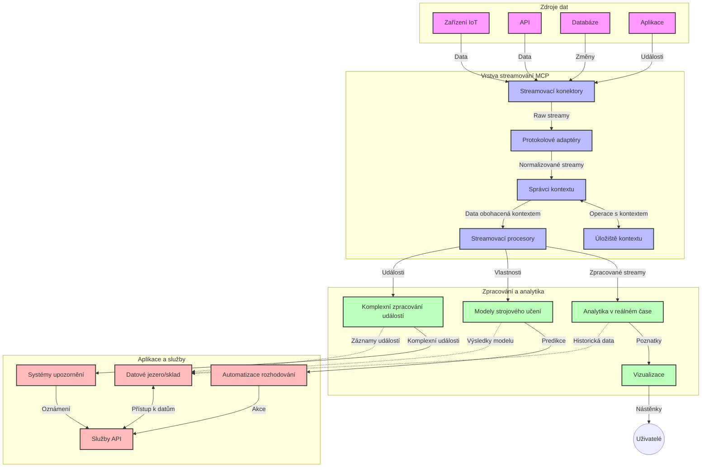

# Protokol kontextu modelu pro streamování dat v reálném čase

## Přehled

Streamování dat v reálném čase se stalo nezbytností v dnešním světě orientovaném na data, kde podniky a aplikace vyžadují okamžitý přístup k informacím pro včasné rozhodování. Protokol kontextu modelu (MCP) představuje významný pokrok v optimalizaci těchto procesů streamování v reálném čase, zlepšuje efektivitu zpracování dat, udržuje kontextuální integritu a zvyšuje celkový výkon systému.

Tento modul zkoumá, jak MCP transformuje streamování dat v reálném čase tím, že poskytuje standardizovaný přístup ke správě kontextu napříč AI modely, streamovacími platformami a aplikacemi.

## Úvod do streamování dat v reálném čase

Streamování dat v reálném čase je technologický paradigma, které umožňuje průběžný přenos, zpracování a analýzu dat, jak jsou generována, což systémům umožňuje okamžitě reagovat na nové informace. Na rozdíl od tradičního dávkového zpracování, které operuje statickými datovými sadami, streamování zpracovává data v pohybu a dodává poznatky a akce s minimální latencí.

### Základní koncepty streamování dat v reálném čase:

- **Nepřetržitý tok dat**: Data jsou zpracovávána jako nepřetržitý, nikdy nekončící proud událostí nebo záznamů.
- **Nízká latence zpracování**: Systémy jsou navrženy tak, aby minimalizovaly čas mezi generováním dat a jejich zpracováním.
- **Škálovatelnost**: Streamovací architektury musí zvládat proměnlivé objemy a rychlosti dat.
- **Odolnost proti chybám**: Systémy musí být odolné vůči selháním, aby zajistily nepřerušený tok dat.
- **Stavové zpracování**: Udržení kontextu napříč událostmi je klíčové pro smysluplnou analýzu.

### Protokol kontextu modelu a streamování v reálném čase

Protokol kontextu modelu (MCP) řeší několik zásadních výzev v prostředích streamování v reálném čase:

1. **Kontextuální kontinuita**: MCP standardizuje, jak se udržuje kontext napříč distribuovanými streamovacími komponentami, zajišťuje, že AI modely a zpracovatelské uzly mají přístup k relevantnímu historickému a environmentálnímu kontextu.

2. **Efektivní správa stavu**: Poskytováním strukturovaných mechanismů pro přenos kontextu MCP snižuje režii správy stavu v streamovacích pipelinech.

3. **Interoperabilita**: MCP vytváří společný jazyk pro sdílení kontextu mezi různými streamovacími technologiemi a AI modely, což umožňuje flexibilnější a rozšiřitelnější architektury.

4. **Kontext optimalizovaný pro streamování**: Implementace MCP mohou upřednostňovat, které prvky kontextu jsou nejrelevantnější pro rozhodování v reálném čase a optimalizovat tak výkon i přesnost.

5. **Adaptivní zpracování**: Díky správě kontextu prostřednictvím MCP mohou streamovací systémy dynamicky upravovat zpracování na základě vývoje podmínek a vzorců v datech.

V moderních aplikacích od IoT senzorových sítí až po finanční obchodní platformy integrace MCP se streamovacími technologiemi umožňuje inteligentnější, kontextově uvědomělé zpracování, které může adekvátně reagovat na komplexní a vyvíjející se situace v reálném čase.

## Výukové cíle

Na konci této lekce budete schopni:

- Pochopit základy streamování dat v reálném čase a jeho výzvy
- Vysvětlit, jak Protokol kontextu modelu (MCP) vylepšuje streamování dat v reálném čase
- Implementovat řešení založená na MCP pomocí populárních rámců jako Kafka a Pulsar
- Navrhovat a nasazovat odolné, vysoce výkonné streamovací architektury s MCP
- Aplikovat koncepty MCP na případy použití v IoT, finančním obchodování a AI-řízené analytice
- Hodnotit nové trendy a budoucí inovace v technologiích streamování založených na MCP

### Definice a význam

Streamování dat v reálném čase zahrnuje průběžnou generaci, zpracování a doručování dat s minimální latencí. Na rozdíl od dávkového zpracování, kdy se data shromažďují a zpracovávají ve skupinách, jsou streamovaná data zpracovávána postupně při příjmu, což umožňuje okamžité poznatky a reakce.

Klíčové charakteristiky streamování dat v reálném čase jsou:

- **Nízká latence**: Zpracování a analýza dat během milisekund až sekund
- **Nepřetržitý tok**: Nepřerušované proudy dat z různých zdrojů
- **Okamžité zpracování**: Analýza dat při jejich příchodu místo dávkového zpracování
- **Architektura řízená událostmi**: Reakce na události v momentě jejich výskytu

### Výzvy v tradičním streamování dat

Tradiční přístupy ke streamování dat čelí několika omezením:

1. **Ztráta kontextu**: Obtížné udržet kontext napříč distribuovanými systémy
2. **Problémy se škálováním**: Výzvy při škálování pro zvládnutí vysokého objemu a rychlosti dat
3. **Složitost integrace**: Problémy s interoperabilitou mezi různými systémy
4. **Řízení latence**: Vyvažování propustnosti a času zpracování
5. **Konzistence dat**: Zajištění přesnosti a úplnosti dat v celém proudu

## Porozumění Protokolu kontextu modelu (MCP)

### Co je MCP?

Protokol kontextu modelu (MCP) je standardizovaný komunikační protokol navržený k usnadnění efektivní interakce mezi AI modely a aplikacemi. V kontextu streamování dat v reálném čase MCP poskytuje rámec pro:

- Zachování kontextu v celé datové pipeline
- Standardizaci formátů výměny dat
- Optimalizaci přenosu rozsáhlých datových sad
- Zlepšení komunikace model-model a model-aplikace

### Hlavní komponenty a architektura

Architektura MCP pro streamování v reálném čase sestává z několika klíčových komponent:

1. **Správci kontextu**: Řídí a udržují kontextuální informace v celé streamovací pipeline
2. **Streamovací procesory**: Zpracovávají příchozí datové streamy pomocí technik uvědomělých o kontextu
3. **Protokolové adaptéry**: Převádějí mezi různými streamovacími protokoly při zachování kontextu
4. **Úložiště kontextu**: Efektivně ukládá a načítá kontextuální informace
5. **Streamovací konektory**: Připojují se k různým streamovacím platformám (Kafka, Pulsar, Kinesis atd.)



### Jak MCP zlepšuje zpracování dat v reálném čase

MCP řeší tradiční výzvy streamování prostřednictvím:

- **Integrita kontextu**: Udržování vztahů mezi datovými body v celé pipeline
- **Optimalizovaný přenos**: Snižování redundance ve výměně dat díky inteligentní správě kontextu
- **Standardizované rozhraní**: Poskytování konzistentních API pro streamovací komponenty
- **Snížení latence**: Minimalizace režie zpracování díky efektivní správě kontextu
- **Zvýšená škálovatelnost**: Podpora horizontálního škálování při zachování kontextu

## Integrace a implementace

Systémy pro streamování dat v reálném čase vyžadují pečlivý architektonický návrh a implementaci, aby bylo zachováno jak výkon, tak kontextuální integrita. Protokol kontextu modelu nabízí standardizovaný přístup k integraci AI modelů a streamovacích technologií, což umožňuje sofistikovanější, kontextově uvědomělé zpracovatelské pipeline.

### Přehled integrace MCP do streamovacích architektur

Implementace MCP v prostředích streamování v reálném čase zahrnuje několik klíčových aspektů:

1. **Serializace a přenos kontextu**: MCP poskytuje efektivní mechanismy pro kódování kontextuálních informací v rámci streamovaných datových paketů, zajišťuje, že nezbytný kontext následuje data během celé zpracovatelské pipeline. To zahrnuje standardizované serializační formáty optimalizované pro streamovací přenos.

2. **Stavové zpracování streamu**: MCP umožňuje inteligentnější stavové zpracování díky udržování konzistentní reprezentace kontextu napříč zpracovatelskými uzly. To je zvláště cenné v distribuovaných streamovacích architekturách, kde je správa stavu tradičně náročná.

3. **Čas události vs. čas zpracování**: Implementace MCP v streamovacích systémech musí řešit běžný problém odlišení doby, kdy události nastaly, a kdy jsou zpracovány. Protokol může obsahovat časový kontext, který zachovává sémantiku času události.

4. **Řízení zpětného tlaku (backpressure)**: Standardizací správy kontextu MCP napomáhá řídit zpětný tlak ve streamovacích systémech, což umožňuje komponentám komunikovat své schopnosti zpracování a odpovídajícím způsobem upravovat tok dat.

5. **Okna kontextu a agregace**: MCP usnadňuje sofistikovanější operace s okny tím, že poskytuje strukturované reprezentace časových a relačních kontextů, což umožňuje smysluplnější agregace napříč proudy událostí.

6. **Zpracování s garancí exactly-once**: Ve streamovacích systémech vyžadujících sémantiku exactly-once může MCP zahrnovat metadata zpracování pro sledování a ověřování stavu zpracování napříč distribuovanými komponentami.

Implementace MCP napříč různými streamovacími technologiemi vytváří jednotný přístup ke správě kontextu, čímž snižuje potřebu vlastního integračního kódu a současně zvyšuje schopnost systému udržet významný kontext, jak data procházejí pipeline.

### MCP v různých frameworcích pro streamování dat

Tyto příklady vycházejí z aktuální specifikace MCP, která se zaměřuje na protokol založený na JSON-RPC s odlišnými přenosovými mechanismy. Kód demonstruje, jak můžete implementovat vlastní transporty, jež integrují streamovací platformy jako Kafka a Pulsar, přičemž zachovávají plnou kompatibilitu s protokolem MCP.

Příklady jsou navrženy tak, aby ukázaly, jak lze streamovací platformy integrovat s MCP k dosažení zpracování dat v reálném čase při zachování kontextové povědomosti, která je centrální pro MCP. Tento přístup zajišťuje, že vzorové kódy přesně odrážejí současný stav specifikace MCP k červnu 2025.

MCP lze integrovat s populárními streamovacími rámci včetně:

#### Integrace Apache Kafka

```python
import asyncio
import json
from typing import Dict, Any, Optional
from confluent_kafka import Consumer, Producer, KafkaError
from mcp.client import Client, ClientCapabilities
from mcp.core.message import JsonRpcMessage
from mcp.core.transports import Transport

# Vlastní transportní třída pro propojení MCP s Kafka
class KafkaMCPTransport(Transport):
    def __init__(self, bootstrap_servers: str, input_topic: str, output_topic: str):
        self.bootstrap_servers = bootstrap_servers
        self.input_topic = input_topic
        self.output_topic = output_topic
        self.producer = Producer({'bootstrap.servers': bootstrap_servers})
        self.consumer = Consumer({
            'bootstrap.servers': bootstrap_servers,
            'group.id': 'mcp-client-group',
            'auto.offset.reset': 'earliest'
        })
        self.message_queue = asyncio.Queue()
        self.running = False
        self.consumer_task = None
        
    async def connect(self):
        """Connect to Kafka and start consuming messages"""
        self.consumer.subscribe([self.input_topic])
        self.running = True
        self.consumer_task = asyncio.create_task(self._consume_messages())
        return self
        
    async def _consume_messages(self):
        """Background task to consume messages from Kafka and queue them for processing"""
        while self.running:
            try:
                msg = self.consumer.poll(1.0)
                if msg is None:
                    await asyncio.sleep(0.1)
                    continue
                
                if msg.error():
                    if msg.error().code() == KafkaError._PARTITION_EOF:
                        continue
                    print(f"Consumer error: {msg.error()}")
                    continue
                
                # Parsovat hodnotu zprávy jako JSON-RPC
                try:
                    message_str = msg.value().decode('utf-8')
                    message_data = json.loads(message_str)
                    mcp_message = JsonRpcMessage.from_dict(message_data)
                    await self.message_queue.put(mcp_message)
                except Exception as e:
                    print(f"Error parsing message: {e}")
            except Exception as e:
                print(f"Error in consumer loop: {e}")
                await asyncio.sleep(1)
    
    async def read(self) -> Optional[JsonRpcMessage]:
        """Read the next message from the queue"""
        try:
            message = await self.message_queue.get()
            return message
        except Exception as e:
            print(f"Error reading message: {e}")
            return None
    
    async def write(self, message: JsonRpcMessage) -> None:
        """Write a message to the Kafka output topic"""
        try:
            message_json = json.dumps(message.to_dict())
            self.producer.produce(
                self.output_topic,
                message_json.encode('utf-8'),
                callback=self._delivery_report
            )
            self.producer.poll(0)  # Spustit zpětné volání
        except Exception as e:
            print(f"Error writing message: {e}")
    
    def _delivery_report(self, err, msg):
        """Kafka producer delivery callback"""
        if err is not None:
            print(f'Message delivery failed: {err}')
        else:
            print(f'Message delivered to {msg.topic()} [{msg.partition()}]')
    
    async def close(self) -> None:
        """Close the transport"""
        self.running = False
        if self.consumer_task:
            self.consumer_task.cancel()
            try:
                await self.consumer_task
            except asyncio.CancelledError:
                pass
        self.consumer.close()
        self.producer.flush()

# Příklad použití Kafka MCP transportu
async def kafka_mcp_example():
    # Vytvořit MCP klienta s Kafka transportem
    client = Client(
        {"name": "kafka-mcp-client", "version": "1.0.0"},
        ClientCapabilities({})
    )
    
    # Vytvořit a připojit Kafka transport
    transport = KafkaMCPTransport(
        bootstrap_servers="localhost:9092",
        input_topic="mcp-responses",
        output_topic="mcp-requests"
    )
    
    await client.connect(transport)
    
    try:
        # Inicializovat MCP relaci
        await client.initialize()
        
        # Příklad spuštění nástroje přes MCP
        response = await client.execute_tool(
            "process_data",
            {
                "data": "sample data",
                "metadata": {
                    "source": "sensor-1",
                    "timestamp": "2025-06-12T10:30:00Z"
                }
            }
        )
        
        print(f"Tool execution response: {response}")
        
        # Čisté ukončení
        await client.shutdown()
    finally:
        await transport.close()

# Spustit příklad
if __name__ == "__main__":
    asyncio.run(kafka_mcp_example())
```

#### Implementace Apache Pulsar

```python
import asyncio
import json
import pulsar
from typing import Dict, Any, Optional
from mcp.core.message import JsonRpcMessage
from mcp.core.transports import Transport
from mcp.server import Server, ServerOptions
from mcp.server.tools import Tool, ToolExecutionContext, ToolMetadata

# Vytvořte vlastní MCP transport, který používá Pulsar
class PulsarMCPTransport(Transport):
    def __init__(self, service_url: str, request_topic: str, response_topic: str):
        self.service_url = service_url
        self.request_topic = request_topic
        self.response_topic = response_topic
        self.client = pulsar.Client(service_url)
        self.producer = self.client.create_producer(response_topic)
        self.consumer = self.client.subscribe(
            request_topic,
            "mcp-server-subscription",
            consumer_type=pulsar.ConsumerType.Shared
        )
        self.message_queue = asyncio.Queue()
        self.running = False
        self.consumer_task = None
    
    async def connect(self):
        """Connect to Pulsar and start consuming messages"""
        self.running = True
        self.consumer_task = asyncio.create_task(self._consume_messages())
        return self
    
    async def _consume_messages(self):
        """Background task to consume messages from Pulsar and queue them for processing"""
        while self.running:
            try:
                # Nezablokující příjem s časovým limitem
                msg = self.consumer.receive(timeout_millis=500)
                
                # Zpracujte zprávu
                try:
                    message_str = msg.data().decode('utf-8')
                    message_data = json.loads(message_str)
                    mcp_message = JsonRpcMessage.from_dict(message_data)
                    await self.message_queue.put(mcp_message)
                    
                    # Potvrďte přijetí zprávy
                    self.consumer.acknowledge(msg)
                except Exception as e:
                    print(f"Error processing message: {e}")
                    # Negativní potvrzení, pokud došlo k chybě
                    self.consumer.negative_acknowledge(msg)
            except Exception as e:
                # Zpracujte časový limit nebo jiné výjimky
                await asyncio.sleep(0.1)
    
    async def read(self) -> Optional[JsonRpcMessage]:
        """Read the next message from the queue"""
        try:
            message = await self.message_queue.get()
            return message
        except Exception as e:
            print(f"Error reading message: {e}")
            return None
    
    async def write(self, message: JsonRpcMessage) -> None:
        """Write a message to the Pulsar output topic"""
        try:
            message_json = json.dumps(message.to_dict())
            self.producer.send(message_json.encode('utf-8'))
        except Exception as e:
            print(f"Error writing message: {e}")
    
    async def close(self) -> None:
        """Close the transport"""
        self.running = False
        if self.consumer_task:
            self.consumer_task.cancel()
            try:
                await self.consumer_task
            except asyncio.CancelledError:
                pass
        self.consumer.close()
        self.producer.close()
        self.client.close()

# Definujte ukázkový MCP nástroj, který zpracovává streamingová data
@Tool(
    name="process_streaming_data",
    description="Process streaming data with context preservation",
    metadata=ToolMetadata(
        required_capabilities=["streaming"]
    )
)
async def process_streaming_data(
    ctx: ToolExecutionContext,
    data: str,
    source: str,
    priority: str = "medium"
) -> Dict[str, Any]:
    """
    Process streaming data while preserving context
    
    Args:
        ctx: Tool execution context
        data: The data to process
        source: The source of the data
        priority: Priority level (low, medium, high)
        
    Returns:
        Dict containing processed results and context information
    """
    # Příklad zpracování využívající MCP kontext
    print(f"Processing data from {source} with priority {priority}")
    
    # Přístup ke konverzačnímu kontextu z MCP
    conversation_id = ctx.conversation_id if hasattr(ctx, 'conversation_id') else "unknown"
    
    # Vraťte výsledky s rozšířeným kontextem
    return {
        "processed_data": f"Processed: {data}",
        "context": {
            "conversation_id": conversation_id,
            "source": source,
            "priority": priority,
            "processing_timestamp": ctx.get_current_time_iso()
        }
    }

# Ukázková implementace MCP serveru používajícího Pulsar transport
async def run_mcp_server_with_pulsar():
    # Vytvořte MCP server
    server = Server(
        {"name": "pulsar-mcp-server", "version": "1.0.0"},
        ServerOptions(
            capabilities={"streaming": True}
        )
    )
    
    # Zaregistrujte náš nástroj
    server.register_tool(process_streaming_data)
    
    # Vytvořte a připojte Pulsar transport
    transport = PulsarMCPTransport(
        service_url="pulsar://localhost:6650",
        request_topic="mcp-requests",
        response_topic="mcp-responses"
    )
    
    try:
        # Spusťte server s Pulsar transportem
        await server.run(transport)
    finally:
        await transport.close()

# Spusťte server
if __name__ == "__main__":
    asyncio.run(run_mcp_server_with_pulsar())
```

### Nejlepší postupy nasazení

Při implementaci MCP pro streamování v reálném čase:

1. **Navrhněte odolnost vůči chybám**:
   - Implementujte správné ošetření chyb
   - Využívejte dead-letter fronty pro neúspěšné zprávy
   - Navrhujte idempotentní procesory

2. **Optimalizujte výkon**:
   - Nakonfigurujte vhodné velikosti vyrovnávacích pamětí
   - Používejte dávkování tam, kde je vhodné
   - Implementujte mechanismy zpětného tlaku

3. **Monitorujte a sledujte**:
   - Sledujte metriky zpracování streamu
   - Monitorujte šíření kontextu
   - Nastavte upozornění na anomálie

4. **Zabezpečte své streamy**:
   - Implementujte šifrování citlivých dat
   - Používejte autentizaci a autorizaci
   - Použijte správnou kontrolu přístupu


### MCP v IoT a Edge computingu

MCP zlepšuje streamování v IoT díky:

- Zachování kontextu zařízení v celé zpracovatelské pipeline
- Umožnění efektivního streamování dat z edge do cloudu
- Podpoře analýzy dat IoT v reálném čase
- Usnadnění komunikace mezi zařízeními s kontextem

Příklad: Sítě senzorů ve Smart City
```
Sensors → Edge Gateways → MCP Stream Processors → Real-time Analytics → Automated Responses
```

### Role v finančních transakcích a vysokofrekvenčním obchodování

MCP poskytuje významné výhody pro finanční streamování dat:

- Ultra-nízká latence zpracování pro obchodní rozhodnutí
- Udržování transakčního kontextu během zpracování
- Podpora komplexního zpracování událostí s kontextovým povědomím
- Zajištění konzistence dat napříč distribuovanými obchodními systémy

### Vylepšení analytiky řízené AI

MCP otevírá nové možnosti pro streamovací analytiku:

- Trénink a inferenční modely v reálném čase
- Nepřetržité učení ze streamovaných dat
- Kontextově uvědomělé získávání rysů
- Pipeline s vícemodelovými inferencemi se zachovaným kontextem

## Budoucí trendy a inovace

### Vývoj MCP v prostředích reálného času

Do budoucna očekáváme, že MCP bude řešit:

- **Integraci kvantového počítání**: Příprava na streamovací systémy založené na kvantových technologiích
- **Edge-nativní zpracování**: Přesun více kontextově uvědomělého zpracování na okrajové zařízení
- **Autonomní řízení streamu**: Samooptimalizující streamovací pipeline
- **Federované streamování**: Distribuované zpracování při zachování soukromí

### Potenciální technologické pokroky

Nově vznikající technologie, které budou určovat budoucnost streamování MCP:

1. **Protokoly streamování optimalizované pro AI**: Vlastní protokoly určené speciálně pro AI pracovní zátěže
2. **Integrace neuromorfního počítání**: Mozkově inspirované počítání pro zpracování streamu
3. **Serverless streaming**: Událostmi řízené, škálovatelné streamování bez správy infrastruktury
4. **Distribuovaná úložiště kontextu**: Globálně rozptýlená, ale vysoce konzistentní správa kontextu

## Praktická cvičení

### Cvičení 1: Nastavení základní streamovací pipeline MCP

V tomto cvičení se naučíte:
- Konfigurovat základní streamovací prostředí MCP
- Implementovat správce kontextu pro zpracování streamu
- Testovat a ověřovat zachování kontextu

### Cvičení 2: Vytvoření dashboardu pro analýzu v reálném čase

Vytvořte kompletní aplikaci, která:
- Příjímá streamovaná data pomocí MCP
- Zpracovává stream s udržením kontextu
- Vizualizuje výsledky v reálném čase

### Cvičení 3: Implementace komplexního zpracování událostí s MCP

Pokročilé cvičení zahrnující:
- Detekci vzorů ve streamech
- Kontextovou korelaci napříč několika streamy
- Generování komplexních událostí se zachovaným kontextem

## Další zdroje

- [Specifikace Protokolu kontextu modelu](https://modelcontextprotocol.io) - Oficiální specifikace a dokumentace MCP
- [Dokumentace Apache Kafka](https://kafka.apache.org/documentation/) - Naučte se o Kafka pro streamování dat
- [Apache Pulsar](https://pulsar.apache.org/) - Jednotná platforma pro messaging a streamování
- [Streaming Systems: The What, Where, When, and How of Large-Scale Data Processing](https://www.oreilly.com/library/view/streaming-systems/9781491983867/) - Komplexní kniha o streamovacích architekturách
- [Microsoft Azure Event Hubs](https://learn.microsoft.com/azure/event-hubs/event-hubs-about) - Řízená služba streamování událostí
- [Dokumentace MLflow](https://mlflow.org/docs/latest/index.html) - Pro sledování a nasazení ML modelů
- [Real-Time Analytics with Apache Storm](https://storm.apache.org/releases/current/index.html) - Framework pro zpracování v reálném čase
- [Flink ML](https://nightlies.apache.org/flink/flink-ml-docs-master/) - Knihovna strojového učení pro Apache Flink
- [Dokumentace LangChain](https://python.langchain.com/docs/get_started/introduction) - Budování aplikací s LLM

## Výsledky učení

Po dokončení tohoto modulu budete schopni:

- Pochopit základy streamování dat v reálném čase a jeho výzvy
- Vysvětlit, jak Protokol kontextu modelu (MCP) vylepšuje streamování dat v reálném čase
- Implementovat řešení založená na MCP pomocí populárních rámců jako Kafka a Pulsar
- Navrhovat a nasazovat odolné, vysoce výkonné streamovací architektury s MCP
- Aplikovat koncepty MCP na případy použití v IoT, finančním obchodování a AI-řízené analytice
- Hodnotit nové trendy a budoucí inovace v technologiích streamování založených na MCP

## Co bude dál

- [5.11 Realtime Search](../mcp-realtimesearch/README.md)

---

<!-- CO-OP TRANSLATOR DISCLAIMER START -->
**Prohlášení o omezení odpovědnosti**:
Tento dokument byl přeložen pomocí AI překladatelské služby [Co-op Translator](https://github.com/Azure/co-op-translator). Přestože usilujeme o co největší přesnost, mějte prosím na paměti, že automatizované překlady mohou obsahovat chyby nebo nepřesnosti. Originální dokument v jeho mateřském jazyce by měl být považován za autoritativní zdroj. Pro kritické informace se doporučuje profesionální lidský překlad. Nejsme odpovědní za jakékoli nedorozumění nebo nesprávné interpretace vzniklé použitím tohoto překladu.
<!-- CO-OP TRANSLATOR DISCLAIMER END -->