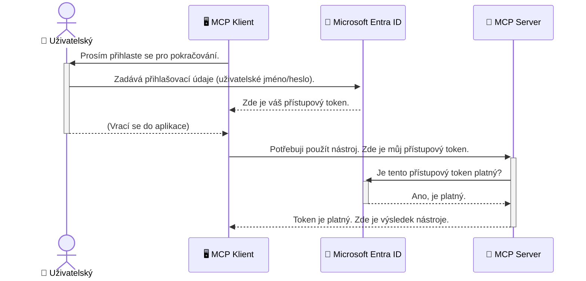

# Zabezpečení AI pracovních postupů: Ověřování Entra ID pro servery Model Context Protocol

## Úvod
Zabezpečení vašeho serveru Model Context Protocol (MCP) je stejně důležité jako zamčení vstupních dveří vašeho domu. Nechat váš server MCP otevřený vystavuje vaše nástroje a data neoprávněnému přístupu, což může vést k narušení bezpečnosti. Microsoft Entra ID poskytuje robustní cloudové řešení pro správu identity a přístupu, které pomáhá zajistit, že pouze autorizovaní uživatelé a aplikace mohou komunikovat s vaším serverem MCP. V této části se naučíte, jak chránit své AI pracovní postupy pomocí ověřování Entra ID.

## Výukové cíle
Na konci této části budete schopni:

- Pochopit význam zabezpečení serverů MCP.
- Vysvětlit základy Microsoft Entra ID a ověřování OAuth 2.0.
- Rozpoznat rozdíl mezi veřejnými a důvěrnými klienty.
- Implementovat ověřování Entra ID v lokálních (veřejný klient) a vzdálených (důvěrný klient) scénářích serverů MCP.
- Používat osvědčené bezpečnostní postupy při vývoji AI pracovních postupů.

## Bezpečnost a MCP

Stejně jako byste nenechali otevřené přední dveře svého domu, neměli byste nechat svůj server MCP otevřený pro kohokoli. Zabezpečení vašich AI pracovních postupů je nezbytné pro tvorbu robustních, důvěryhodných a bezpečných aplikací. Tato kapitola vám představí použití Microsoft Entra ID k zabezpečení vašich serverů MCP tak, aby mohli s vašimi nástroji a daty pracovat pouze autorizovaní uživatelé a aplikace.

## Proč je bezpečnost důležitá pro servery MCP

Představte si, že váš server MCP má nástroj, který může odesílat e-maily nebo přistupovat k databázi zákazníků. Nezabezpečený server by znamenal, že kdokoli by mohl tento nástroj použít, což by vedlo k neoprávněnému přístupu k datům, spamu nebo dalším škodlivým aktivitám.

Implementací ověřování zajistíte, že každý požadavek na váš server je ověřen a potvrzuje totožnost uživatele nebo aplikace, která požadavek posílá. To je první a nejdůležitější krok k zabezpečení vašich AI pracovních postupů.

## Úvod do Microsoft Entra ID

[**Microsoft Entra ID**](https://adoption.microsoft.com/microsoft-security/entra/) je cloudová služba pro správu identity a přístupu. Představte si ji jako univerzálního bezpečnostního hlídače pro vaše aplikace. Zpracovává složitý proces ověřování identity uživatelů a určení toho, co mohou dělat (autorizace).

Používáním Entra ID můžete:

- Umožnit bezpečné přihlašování uživatelům.
- Chránit API a služby.
- Spravovat přístupové politiky z jednoho centrálního místa.

Pro servery MCP poskytuje Entra ID robustní a široce důvěryhodné řešení pro správu přístupu k možnostem vašeho serveru.

---

## Jak funguje kouzlo: Princip ověřování Entra ID

Entra ID využívá otevřené standardy, jako je **OAuth 2.0**, pro zpracování ověřování. Přestože detaily mohou být složité, základní koncept je jednoduchý a lze jej pochopit pomocí analogie.

### Jemný úvod do OAuth 2.0: Klíč pro odvoz

Představte si OAuth 2.0 jako službu parkování vašeho auta. Když přijedete do restaurace, neodevzdáte parkovacímu svůj hlavní klíč. Místo toho mu dáte **klíč pro odvoz**, který má omezená oprávnění - může nastartovat auto a zamknout dveře, ale nemůže otevřít kufr nebo přihrádku.

V této analogii:

- **Vy** jste **Uživatel**.
- **Vaše auto** je **server MCP** s jeho cennými nástroji a daty.
- **Parkovací služba** je **Microsoft Entra ID**.
- **Parkovací asistent** je **MCP klient** (aplikace, která se pokouší přistoupit k serveru).
- **Klíč pro odvoz** je **přístupový token**.

Přístupový token je bezpečný řetězec textu, který MCP klient získá od Entra ID poté, co se přihlásíte. Klient pak tento token předkládá serveru MCP u každého požadavku. Server může token ověřit, aby zajistil, že požadavek je legitimní a že klient má potřebná oprávnění, to vše bez nutnosti zacházet s vašimi skutečnými přihlašovacími údaji (například heslem).

### Průběh ověřování

Takto proces funguje v praxi:



### Představení Microsoft Authentication Library (MSAL)

Než přejdeme ke kódu, je důležité představit klíčovou komponentu, kterou v příkladech uvidíte: **Microsoft Authentication Library (MSAL)**.

MSAL je knihovna vyvinutá Microsoftem, která vývojářům výrazně usnadňuje zpracování ověřování. Místo toho, abyste museli psát veškerý složitý kód pro správu bezpečnostních tokenů, přihlašování a obnovování relací, se MSAL postará o veškerou náročnou práci.

Použití knihovny MSAL je velmi doporučeno, protože:

- **Je bezpečná:** Implementuje průmyslové standardy a osvědčené bezpečnostní postupy, čímž snižuje riziko zranitelností ve vašem kódu.
- **Zjednodušuje vývoj:** Abstrahuje složitost protokolů OAuth 2.0 a OpenID Connect, což vám umožní přidat robustní ověřování do vaší aplikace jen několika řádky kódu.
- **Je udržovaná:** Microsoft aktivně udržuje a aktualizuje MSAL, aby řešil nové bezpečnostní hrozby a změny platforem.

MSAL podporuje širokou škálu jazyků a aplikačních frameworků, včetně .NET, JavaScript/TypeScript, Python, Java, Go a mobilních platforem jako iOS a Android. To znamená, že můžete používat konzistentní ověřovací vzory v celém svém technologickém stacku.

Více o MSAL se dozvíte v oficiální [MSAL přehledové dokumentaci](https://learn.microsoft.com/entra/identity-platform/msal-overview).

---

## Zabezpečení vašeho MCP serveru pomocí Entra ID: Krok za krokem

Nyní si projdeme, jak zabezpečit lokální server MCP (který komunikuje přes `stdio`) pomocí Entra ID. Tento příklad používá **veřejného klienta**, což je vhodné pro aplikace běžící na uživatelově počítači, jako je desktopová aplikace nebo lokální vývojový server.

### Scénář 1: Zabezpečení lokálního serveru MCP (s veřejným klientem)

V tomto scénáři se podíváme na MCP server, který běží lokálně, komunikuje přes `stdio` a používá Entra ID k ověření uživatele před udělením přístupu k jeho nástrojům. Server bude mít jediný nástroj, který získá informace o uživatelském profilu z Microsoft Graph API.

#### 1. Nastavení aplikace v Entra ID

Než začnete psát kód, musíte zaregistrovat svou aplikaci v Microsoft Entra ID. Tím dáte Entra ID vědět o vaší aplikaci a poskytnete jí oprávnění používat službu ověřování.

1. Přejděte na **[Microsoft Entra portál](https://entra.microsoft.com/)**.
2. V sekci **Registrace aplikací** klikněte na **Nová registrace**.
3. Pojmenujte svou aplikaci (např. „Můj lokální MCP server“).
4. U **Podporované typy účtů** vyberte **Účty pouze v této organizační složce**.
5. Pole **Přesměrovací URI** můžete pro tento příklad nechat prázdné.
6. Klikněte na **Registrovat**.

Po registraci si poznamenejte **ID aplikace (klienta)** a **ID adresáře (tenant)**. Budete je potřebovat v kódu.

#### 2. Rozbor kódu

Podívejme se na klíčové části kódu, které zpracovávají ověřování. Kompletní kód tohoto příkladu je dostupný ve složce [Entra ID - Local - WAM](https://github.com/Azure-Samples/mcp-auth-servers/tree/main/src/entra-id-local-wam) v repozitáři [mcp-auth-servers na GitHubu](https://github.com/Azure-Samples/mcp-auth-servers).

**`AuthenticationService.cs`**

Tato třída zajišťuje komunikaci s Entra ID.

- **`CreateAsync`**: Tento metod inicializuje `PublicClientApplication` z MSAL. Je nakonfigurován s `clientId` a `tenantId` vaší aplikace.
- **`WithBroker`**: Umožňuje použití brokera (například Windows Web Account Manager), který poskytuje bezpečnější a plynulejší zážitek jednoho přihlášení.
- **`AcquireTokenAsync`**: Jde o hlavní metodu. Nejprve se snaží získat token potichu (uživatel se nemusí znovu přihlašovat, pokud již má platnou relaci). Pokud není možné získat token potichu, vyzve uživatele k interaktivnímu přihlášení.

```csharp
// Simplified for clarity
public static async Task<AuthenticationService> CreateAsync(ILogger<AuthenticationService> logger)
{
    var msalClient = PublicClientApplicationBuilder
        .Create(_clientId) // Your Application (client) ID
        .WithAuthority(AadAuthorityAudience.AzureAdMyOrg)
        .WithTenantId(_tenantId) // Your Directory (tenant) ID
        .WithBroker(new BrokerOptions(BrokerOptions.OperatingSystems.Windows))
        .Build();

    // ... cache registration ...

    return new AuthenticationService(logger, msalClient);
}

public async Task<string> AcquireTokenAsync()
{
    try
    {
        // Try silent authentication first
        var accounts = await _msalClient.GetAccountsAsync();
        var account = accounts.FirstOrDefault();

        AuthenticationResult? result = null;

        if (account != null)
        {
            result = await _msalClient.AcquireTokenSilent(_scopes, account).ExecuteAsync();
        }
        else
        {
            // If no account, or silent fails, go interactive
            result = await _msalClient.AcquireTokenInteractive(_scopes).ExecuteAsync();
        }

        return result.AccessToken;
    }
    catch (Exception ex)
    {
        _logger.LogError(ex, "An error occurred while acquiring the token.");
        throw; // Optionally rethrow the exception for higher-level handling
    }
}
```

**`Program.cs`**

Zde je nastaven server MCP a integrována služba ověřování.

- **`AddSingleton<AuthenticationService>`**: Registruje `AuthenticationService` do kontejneru závislostí, aby jej mohly používat další části aplikace (například náš nástroj).
- **Nástroj `GetUserDetailsFromGraph`**: Tento nástroj potřebuje instanci `AuthenticationService`. Před jakoukoli činností zavolá `authService.AcquireTokenAsync()` a získá platný přístupový token. Pokud je ověřování úspěšné, použije token k volání Microsoft Graph API a získání informací o uživateli.

```csharp
// Simplified for clarity
[McpServerTool(Name = "GetUserDetailsFromGraph")]
public static async Task<string> GetUserDetailsFromGraph(
    AuthenticationService authService)
{
    try
    {
        // This will trigger the authentication flow
        var accessToken = await authService.AcquireTokenAsync();

        // Use the token to create a GraphServiceClient
        var graphClient = new GraphServiceClient(
            new BaseBearerTokenAuthenticationProvider(new TokenProvider(authService)));

        var user = await graphClient.Me.GetAsync();

        return System.Text.Json.JsonSerializer.Serialize(user);
    }
    catch (Exception ex)
    {
        return $"Error: {ex.Message}";
    }
}
```

#### 3. Jak to celé funguje společně

1. Když se MCP klient pokusí použít nástroj `GetUserDetailsFromGraph`, nejdříve zavolá `AcquireTokenAsync`.
2. `AcquireTokenAsync` vyvolá knihovnu MSAL, která zkontroluje existenci platného tokenu.
3. Pokud žádný token není, MSAL přes brokera vyzve uživatele k přihlášení přes účet Entra ID.
4. Po přihlášení vydá Entra ID přístupový token.
5. Nástroj token přijme a použije ho k zabezpečenému volání Microsoft Graph API.
6. Informace o uživateli jsou vráceny MCP klientovi.

Tento proces zajišťuje, že nástroj může používat pouze ověření uživatelé, čímž je váš lokální server MCP účinně zabezpečen.

### Scénář 2: Zabezpečení vzdáleného serveru MCP (s důvěrným klientem)

Pokud váš server MCP běží na vzdáleném stroji (například na cloudovém serveru) a komunikuje přes protokol jako HTTP Streaming, bezpečnostní požadavky jsou jiné. V tomto případě byste měli použít **důvěrného klienta** a **Authorization Code Flow**. Toto je bezpečnější metoda, protože tajemství aplikace nejsou nikdy vystavena v prohlížeči.

Tento příklad používá server MCP založený na TypeScriptu, který používá Express.js pro zpracování HTTP požadavků.

#### 1. Nastavení aplikace v Entra ID

Nastavení v Entra ID je podobné jako u veřejného klienta, ale s jedním klíčovým rozdílem: je nutné vytvořit **klientské tajemství**.

1. Přejděte na **[Microsoft Entra portál](https://entra.microsoft.com/)**.
2. Ve vaší registraci aplikace přejděte na záložku **Certifikáty a tajemství**.
3. Klikněte na **Nové klientské tajemství**, popište ho a klikněte na **Přidat**.
4. **Důležité:** Okamžitě si zkopírujte hodnotu tajemství. Nebude již znovu zobrazena.
5. Také musíte nakonfigurovat **přesměrovací URI**. Přejděte na záložku **Ověřování**, klikněte na **Přidat platformu**, vyberte **Web** a zadejte přesměrovací URI pro vaši aplikaci (např. `http://localhost:3001/auth/callback`).

> **⚠️ Důležité bezpečnostní upozornění:** Pro produkční aplikace Microsoft důrazně doporučuje používat **ověřování bez tajemství** jako **spravované identity** nebo **federaci identit pracovních zatížení** místo klientských tajemství. Klientská tajemství představují bezpečnostní riziko, protože mohou být vystavena nebo kompromitována. Spravované identity poskytují bezpečnější přístup tím, že eliminují potřebu ukládat přihlašovací údaje ve vašem kódu nebo konfiguraci.
>
> Více informací o spravovaných identitách a jejich implementaci naleznete v přehledu [Spravované identity pro prostředky Azure](https://learn.microsoft.com/entra/identity/managed-identities-azure-resources/overview).

#### 2. Rozbor kódu

Tento příklad používá přístup založený na relacích. Když se uživatel ověří, server uloží přístupový token a obnovovací token do relace a dá uživateli token relace. Tento token relace je pak používán u následných požadavků. Kompletní kód tohoto příkladu je dostupný ve složce [Entra ID - Confidential client](https://github.com/Azure-Samples/mcp-auth-servers/tree/main/src/entra-id-cca-session) v repozitáři [mcp-auth-servers na GitHubu](https://github.com/Azure-Samples/mcp-auth-servers).

**`Server.ts`**

Tento soubor nastavuje Express server a přenosovou vrstvu MCP.

- **`requireBearerAuth`**: Toto je middleware, který chrání endpointy `/sse` a `/message`. Kontroluje, zda je v hlavičce `Authorization` platný bearer token.
- **`EntraIdServerAuthProvider`**: Toto je vlastní třída, která implementuje rozhraní `McpServerAuthorizationProvider`. Zodpovídá za zpracování OAuth 2.0 flow.
- **`/auth/callback`**: Tento endpoint zpracovává přesměrování z Entra ID po přihlášení uživatele. Vymění autorizační kód za přístupový a obnovovací token.

```typescript
// Zjednodušeno pro přehlednost
const app = express();
const { server } = createServer();
const provider = new EntraIdServerAuthProvider();

// Chraňte SSE koncový bod
app.get("/sse", requireBearerAuth({
  provider,
  requiredScopes: ["User.Read"]
}), async (req, res) => {
  // ... připojit se k transportu ...
});

// Chraňte koncový bod zprávy
app.post("/message", requireBearerAuth({
  provider,
  requiredScopes: ["User.Read"]
}), async (req, res) => {
  // ... zpracovat zprávu ...
});

// Zpracovat OAuth 2.0 callback
app.get("/auth/callback", (req, res) => {
  provider.handleCallback(req.query.code, req.query.state)
    .then(result => {
      // ... zpracovat úspěch nebo neúspěch ...
    });
});
```

**`Tools.ts`**

Tento soubor definuje nástroje, které server MCP poskytuje. Nástroj `getUserDetails` je podobný tomu z předchozího příkladu, ale přístupový token získává ze session.

```typescript
// Zjednodušeno pro přehlednost
server.setRequestHandler(CallToolRequestSchema, async (request) => {
  const { name } = request.params;
  const context = request.params?.context as { token?: string } | undefined;
  const sessionToken = context?.token;

  if (name === ToolName.GET_USER_DETAILS) {
    if (!sessionToken) {
      throw new AuthenticationError("Authentication token is missing or invalid. Ensure the token is provided in the request context.");
    }

    // Získejte token Entra ID ze zásobníku relace
    const tokenData = tokenStore.getToken(sessionToken);
    const entraIdToken = tokenData.accessToken;

    const graphClient = Client.init({
      authProvider: (done) => {
        done(null, entraIdToken);
      }
    });

    const user = await graphClient.api('/me').get();

    // ... vraťte podrobnosti uživatele ...
  }
});
```

**`auth/EntraIdServerAuthProvider.ts`**

Tato třída zajišťuje logiku pro:

- Přesměrování uživatele na přihlašovací stránku Entra ID.
- Výměnu autorizačního kódu za přístupový token.
- Ukládání tokenů do `tokenStore`.
- Obnovování přístupového tokenu, když vyprší jeho platnost.

#### 3. Jak to celé funguje společně

1. Když se uživatel poprvé pokusí připojit k serveru MCP, middleware `requireBearerAuth` zjistí, že nemá platnou relaci, a přesměruje ho na přihlašovací stránku Entra ID.
2. Uživatel se přihlásí svým účtem Entra ID.
3. Entra ID přesměruje uživatele zpět na koncový bod `/auth/callback` s autorizačním kódem.
4. Server vymění kód za přístupový token a obnovovací token, uloží je a vytvoří token relace, který je odeslán klientovi.
5. Klient nyní může použít tento token relace v hlavičce `Authorization` pro všechny budoucí požadavky na MCP server.
6. Když se zavolá nástroj `getUserDetails`, použije token relace k nalezení přístupového tokenu Entra ID a poté jej použije k volání Microsoft Graph API.

Tento tok je složitější než tok veřejného klienta, ale je vyžadován pro internetově přístupné koncové body. Jelikož jsou vzdálené MCP servery přístupné přes veřejný internet, potřebují silnější bezpečnostní opatření k ochraně před neoprávněným přístupem a potenciálními útoky.


## Bezpečnostní osvědčené postupy

- **Vždy používejte HTTPS**: Šifrujte komunikaci mezi klientem a serverem, aby byly tokeny chráněné před zachycením.
- **Implementujte řízení přístupu založené na rolích (RBAC)**: Neověřujte pouze *zda* je uživatel autentizován; ověřte *co* je oprávněn dělat. Role můžete definovat v Entra ID a kontrolovat je na vašem MCP serveru.
- **Sledujte a auditujte**: Logujte všechny autentizační události, abyste mohli detekovat a reagovat na podezřelé aktivity.
- **Zpracovávejte omezení počtu požadavků a zpomalování**: Microsoft Graph a další API implementují omezení počtu požadavků pro prevenci zneužití. Implementujte exponenciální zpětný odstup a logiku opakování v MCP serveru, aby se elegantně zpracovaly odpovědi HTTP 429 (Too Many Requests). Zvažte ukládání často přistupovaných dat do cache ke snížení počtu volání API.
- **Bezpečné uložení tokenů**: Ukládejte přístupové a obnovovací tokeny bezpečně. U lokálních aplikací využijte bezpečnostní mechanismy systému. Pro serverové aplikace zvažte šifrované úložiště nebo služby pro správu klíčů, jako je Azure Key Vault.
- **Zpracování vypršení platnosti tokenu**: Přístupové tokeny mají omezenou životnost. Implementujte automatické obnovování tokenů pomocí obnovovacích tokenů, aby uživatel nemusel při vypršení platnosti znovu provádět autentizaci.
- **Zvažte použití Azure API Management**: Ačkoliv implementace zabezpečení přímo ve vašem MCP serveru poskytuje jemnozrnnou kontrolu, API brány jako Azure API Management mohou automaticky řešit mnohé bezpečnostní aspekty, včetně autentizace, autorizace, omezení počtu požadavků a monitoringu. Poskytují centralizovanou bezpečnostní vrstvu mezi vašimi klienty a MCP servery. Další informace o použití API bran s MCP najdete v našem článku [Azure API Management Your Auth Gateway For MCP Servers](https://techcommunity.microsoft.com/blog/integrationsonazureblog/azure-api-management-your-auth-gateway-for-mcp-servers/4402690).


## Klíčová shrnutí

- Zabezpečení vašeho MCP serveru je klíčové pro ochranu vašich dat a nástrojů.
- Microsoft Entra ID poskytuje robustní a škálovatelné řešení pro autentizaci a autorizaci.
- Použijte **veřejného klienta** pro lokální aplikace a **důvěrného klienta** pro vzdálené servery.
- **Autorizovaný tok pomocí kódu** (Authorization Code Flow) je nejbezpečnější volba pro webové aplikace.


## Cvičení

1. Zamyslete se nad MCP serverem, který byste mohli vytvořit. Bude to lokální server nebo vzdálený server?
2. Na základě vaší odpovědi, použijete veřejného klienta nebo důvěrného klienta?
3. Jaké oprávnění by váš MCP server požadoval pro provádění akcí vůči Microsoft Graph?


## Praktická cvičení

### Cvičení 1: Registrace aplikace v Entra ID
Přejděte do portálu Microsoft Entra.
Zaregistrujte novou aplikaci pro váš MCP server.
Zaznamenejte si ID aplikace (klienta) a ID adresáře (nájemce).

### Cvičení 2: Zabezpečení lokálního MCP serveru (veřejný klient)
- Postupujte podle příkladu kódu pro integraci MSAL (Microsoft Authentication Library) pro autentizaci uživatele.
- Otestujte autentizační tok zavoláním MCP nástroje, který získá podrobnosti o uživateli z Microsoft Graph.

### Cvičení 3: Zabezpečení vzdáleného MCP serveru (důvěrný klient)
- Zaregistrujte důvěrného klienta v Entra ID a vytvořte klientské tajemství.
- Nakonfigurujte váš Express.js MCP server pro použití autorizovaného toku pomocí kódu.
- Otestujte chráněné koncové body a potvrďte přístup založený na tokenech.

### Cvičení 4: Uplatnění bezpečnostních osvědčených postupů
- Povolení HTTPS pro váš lokální nebo vzdálený server.
- Implementujte řízení přístupu založené na rolích (RBAC) v logice serveru.
- Přidejte zpracování vypršení platnosti tokenů a bezpečné uložení tokenů.

## Zdroje

1. **Dokumentace přehledu MSAL**  
   Naučte se, jak Microsoft Authentication Library (MSAL) umožňuje bezpečné získávání tokenů napříč platformami:  
   [MSAL Overview on Microsoft Learn](https://learn.microsoft.com/en-gb/entra/msal/overview)

2. **GitHub repozitář Azure-Samples/mcp-auth-servers**  
   Referenční implementace MCP serverů ukazující autentizační toky:  
   [Azure-Samples/mcp-auth-servers on GitHub](https://github.com/Azure-Samples/mcp-auth-servers)

3. **Přehled Managed Identities pro Azure Resources**  
   Pochopte, jak eliminovat tajemství použitím spravovaných identit přiřazených k systému nebo uživateli:  
   [Managed Identities Overview on Microsoft Learn](https://learn.microsoft.com/en-us/entra/identity/managed-identities-azure-resources/)

4. **Azure API Management: Váš autentizační gateway pro MCP servery**  
   Podrobný pohled na použití APIM jako zabezpečené OAuth2 brány pro MCP servery:  
   [Azure API Management Your Auth Gateway For MCP Servers](https://techcommunity.microsoft.com/blog/integrationsonazureblog/azure-api-management-your-auth-gateway-for-mcp-servers/4402690)

5. **Referenční přehled oprávnění Microsoft Graph**  
   Kompletní seznam delegovaných a aplikačních oprávnění pro Microsoft Graph:  
   [Microsoft Graph Permissions Reference](https://learn.microsoft.com/zh-tw/graph/permissions-reference)


## Výsledky učení
Po dokončení této sekce budete schopni:

- Vysvětlit, proč je autentizace klíčová pro MCP servery a AI pracovní postupy.
- Nastavit a nakonfigurovat autentizaci Entra ID pro scénáře lokálních i vzdálených MCP serverů.
- Vybrat vhodný typ klienta (veřejný nebo důvěrný) podle nasazení serveru.
- Implementovat bezpečné programátorské praktiky, včetně uložení tokenů a autorizace na základě rolí.
- S jistotou chránit váš MCP server a jeho nástroje před neoprávněným přístupem.

## Co bude dál

- [5.13 Integrace protokolu Model Context Protocol (MCP) s Microsoft Foundry](../mcp-foundry-agent-integration/README.md)

---

<!-- CO-OP TRANSLATOR DISCLAIMER START -->
**Prohlášení o omezení odpovědnosti**:
Tento dokument byl přeložen pomocí AI překladatelské služby [Co-op Translator](https://github.com/Azure/co-op-translator). Přestože usilujeme o co největší přesnost, mějte prosím na paměti, že automatizované překlady mohou obsahovat chyby nebo nepřesnosti. Originální dokument v jeho mateřském jazyce by měl být považován za autoritativní zdroj. Pro kritické informace se doporučuje profesionální lidský překlad. Nejsme odpovědní za jakékoli nedorozumění nebo nesprávné interpretace vzniklé použitím tohoto překladu.
<!-- CO-OP TRANSLATOR DISCLAIMER END -->