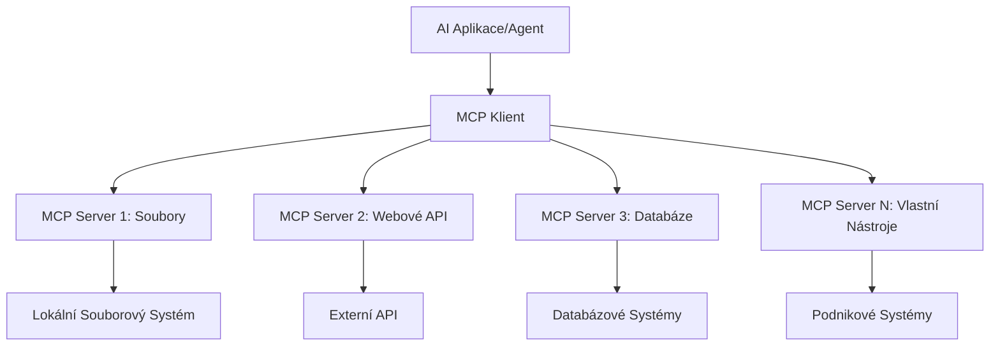

# 🌐 Modul 2: MCP s Microsoft Foundry Toolkit Základy

[]()
[]()
[]()

## 📋 Výukové cíle

Na konci tohoto modulu budete schopni:
- ✅ Porozumět architektuře a výhodám Model Context Protocol (MCP)
- ✅ Prozkoumat ekosystém MCP serverů Microsoftu
- ✅ Integrovat MCP servery s Microsoft Foundry Toolkit Agent Builderem
- ✅ Vytvořit funkčního agenta pro automatizaci prohlížeče pomocí Playwright MCP
- ✅ Konfigurovat a testovat MCP nástroje v rámci vašich agentů
- ✅ Exportovat a nasadit agenty s podporou MCP pro produkční použití

## 🎯 Navazující na Modul 1

V Modulu 1 jsme zvládli základy Microsoft Foundry Toolkit a vytvořili našeho prvního Python agenta. Nyní vaše agenty **zrychlíme** připojením k externím nástrojům a službám skrze revoluční **Model Context Protocol (MCP)**.

Představte si to jako upgrade z jednoduché kalkulačky na plnohodnotný počítač – vaši AI agenti získají schopnost:
- 🌐 Prohlížet a interagovat se stránkami
- 📁 Přistupovat a manipulovat se soubory
- 🔧 Integrovat se s podnikovými systémy
- 📊 Zpracovávat data v reálném čase z API

## 🧠 Porozumění Model Context Protocol (MCP)

### 🔍 Co je MCP?

Model Context Protocol (MCP) je **"USB-C pro AI aplikace"** – revoluční otevřený standard, který propojuje velké jazykové modely (LLM) s externími nástroji, zdroji dat a službami. Stejně jako USB-C odstranil chaos s kabely díky jednomu univerzálnímu konektoru, MCP odstraňuje složitost AI integrace pomocí jednoho standardizovaného protokolu.

### 🎯 Problém, který MCP řeší

**Před MCP:**
- 🔧 Vlastní integrace pro každý nástroj
- 🔄 Závislost na dodavatelích s proprietárními řešeními  
- 🔒 Bezpečnostní rizika vyplývající z ad-hoc propojení
- ⏱️ Měsíce vývoje pro základní integrace

**S MCP:**
- ⚡ Plug-and-play integrace nástrojů
- 🔄 Architektura nezávislá na dodavateli
- 🛡️ Vestavěné bezpečnostní postupy
- 🚀 Minuty na přidání nových funkcí

### 🏗️ Hloubkový pohled na architekturu MCP

MCP dodržuje **klient-server architekturu**, která vytváří bezpečný, škálovatelný ekosystém:



**🔧 Jádrové komponenty:**

| Komponenta | Role | Příklady |
|------------|------|---------|
| **MCP Hosts** | Aplikace, které využívají MCP služby | Claude Desktop, VS Code, Microsoft Foundry Toolkit |
| **MCP Clients** | Protokoloví interpreti (1:1 se servery) | Zabudováno v hostitelských aplikacích |
| **MCP Servers** | Poskytují schopnosti prostřednictvím standardního protokolu | Playwright, Files, Azure, GitHub |
| **Transport Layer** | Komunikační metody | stdio, HTTP, WebSockets |


## 🏢 Ekosystém MCP serverů Microsoftu

Microsoft vede MCP ekosystém s komplexní sadou podnikových serverů, které řeší reálné obchodní potřeby.

### 🌟 Vybrané MCP servery Microsoftu

#### 1. ☁️ Azure MCP Server
**🔗 Repozitář**: [azure/azure-mcp](https://github.com/azure/azure-mcp)
**🎯 Účel**: Komplexní správa zdrojů Azure s AI integrací

**✨ Klíčové funkce:**
- Deklarativní provision infrastruktury
- Monitorování zdrojů v reálném čase
- Doporučení pro optimalizaci nákladů
- Kontrola shody s bezpečnostními požadavky

**🚀 Použití:**
- Infrastruktura jako kód s AI asistencí
- Automatické škálování zdrojů
- Optimalizace cloudových nákladů
- Automatizace DevOps procesů

#### 2. 📊 Microsoft Dataverse MCP
**📚 Dokumentace**: [Microsoft Dataverse Integrace](https://go.microsoft.com/fwlink/?linkid=2320176)
**🎯 Účel**: Přirozený jazykový interface pro obchodní data

**✨ Klíčové funkce:**
- Dotazy v přirozeném jazyce na databázi
- Porozumění obchodnímu kontextu
- Vlastní šablony promptů
- Správa podnikových dat

**🚀 Použití:**
- Reporting obchodní inteligence
- Analýza dat zákazníků
- Přehledy prodejního trychtýře
- Dotazy ohledně souladu s předpisy

#### 3. 🌐 Playwright MCP Server
**🔗 Repozitář**: [microsoft/playwright-mcp](https://github.com/microsoft/playwright-mcp)
**🎯 Účel**: Automatizace prohlížeče a webové interakce

**✨ Klíčové funkce:**
- Automatizace mezi prohlížeči (Chrome, Firefox, Safari)
- Inteligentní detekce prvků
- Vytváření screenshotů a PDF
- Monitorování síťového provozu

**🚀 Použití:**
- Automatizace testovacích workflow
- Web scraping a extrakce dat
- Monitorování UI/UX
- Automatizace konkurenční analýzy

#### 4. 📁 Files MCP Server
**🔗 Repozitář**: [microsoft/files-mcp-server](https://github.com/microsoft/files-mcp-server)
**🎯 Účel**: Inteligentní operace se souborovým systémem

**✨ Klíčové funkce:**
- Deklarativní správa souborů
- Synchronizace obsahu
- Integrace s verzovacími systémy
- Extrakce metadat

**🚀 Použití:**
- Správa dokumentace
- Organizace repozitářů kódu
- Publikační workflow
- Správa souborů v datových pipeline

#### 5. 📝 MarkItDown MCP Server
**🔗 Repozitář**: [microsoft/markitdown](https://github.com/microsoft/markitdown)
**🎯 Účel**: Pokročilé zpracování a manipulace Markdownu

**✨ Klíčové funkce:**
- Pokročilé parsování Markdownu
- Konverze formátů (MD ↔ HTML ↔ PDF)
- Analýza struktury obsahu
- Zpracování šablon

**🚀 Použití:**
- Workflow technické dokumentace
- Systémy pro správu obsahu
- Generování reportů
- Automatizace znalostní báze

#### 6. 📈 Clarity MCP Server
**📦 Balíček**: [@microsoft/clarity-mcp-server](https://www.npmjs.com/package/@microsoft/clarity-mcp-server)
**🎯 Účel**: Webová analytika a přehledy uživatelského chování

**✨ Klíčové funkce:**
- Analýza dat heatmap
- Nahrávky uživatelských relací
- Výkonnostní metriky
- Analýza konverzního trychtýře

**🚀 Použití:**
- Optimalizace webových stránek
- Výzkum uživatelských zkušeností
- Analýzy A/B testování
- Panely BI

### 🌍 Komunitní ekosystém

Kromě serverů Microsoftu zahrnuje MCP ekosystém:
- **🐙 GitHub MCP**: Správa repozitářů a analýza kódu
- **🗄️ Databázové MCP**: Integrace PostgreSQL, MySQL, MongoDB
- **☁️ Cloud provider MCP**: Nástroje AWS, GCP, Digital Ocean
- **📧 Komunikační MCP**: Slack, Teams, Email integrace

## 🛠️ Praktická laboratoř: Vytvoření agenta pro automatizaci prohlížeče

**🎯 Cíl projektu**: Vytvořit inteligentního agenta pro automatizaci prohlížeče používajícího Playwright MCP server, který dokáže navigovat webové stránky, extrahovat informace a provádět složité webové interakce.

### 🚀 Fáze 1: Základní nastavení agenta

#### Krok 1: Inicializujte svého agenta
1. **Otevřete Microsoft Foundry Toolkit Agent Builder**
2. **Vytvořte nového agenta** s následující konfigurací:
   - **Jméno**: `BrowserAgent`
   - **Model**: Vyberte GPT-4o 


### 🔧 Fáze 2: Workflow integrace MCP

#### Krok 3: Přidejte integraci MCP serveru
1. **Přejděte do sekce Nástroje** v Agent Builderu
2. **Klikněte na „Přidat nástroj“** pro otevření menu integrací
3. **Vyberte „MCP Server“** z dostupných možností


**🔍 Pochopení typů nástrojů:**
- **Vestavěné nástroje**: Přednastavené funkce Microsoft Foundry Toolkit
- **MCP Servery**: Integrace externích služeb
- **Vlastní API**: Vaše vlastní koncové body služeb
- **Volání funkcí**: Přímý přístup k modelovým funkcím

#### Krok 4: Výběr MCP serveru
1. **Vyberte možnost „MCP Server“** pro pokračování


2. **Prohlédněte katalog MCP a objevte dostupné integrace**


### 🎮 Fáze 3: Konfigurace Playwright MCP

#### Krok 5: Vyberte a nakonfigurujte Playwright
1. **Klikněte na „Použít doporučené MCP servery“** pro přístup k ověřeným serverům Microsoftu
2. **Vyberte „Playwright“** ze seznamu doporučených
3. **Přijměte výchozí MCP ID** nebo upravte pro své prostředí


#### Krok 6: Povolte Playwright funkce
**🔑 Kritický krok**: Vyberte **VŠECHNY** dostupné metody Playwright pro maximální funkčnost


**🛠️ Zásadní nástroje Playwright:**
- **Navigace**: `goto`, `goBack`, `goForward`, `reload`
- **Interakce**: `click`, `fill`, `press`, `hover`, `drag`
- **Extrakce**: `textContent`, `innerHTML`, `getAttribute`
- **Validace**: `isVisible`, `isEnabled`, `waitForSelector`
- **Zachycení**: `screenshot`, `pdf`, `video`
- **Síť**: `setExtraHTTPHeaders`, `route`, `waitForResponse`

#### Krok 7: Ověřte úspěšnost integrace
**✅ Indikátory úspěchu:**
- Všechny nástroje se zobrazují v rozhraní Agent Builderu
- Žádné chybové zprávy v panelu integrace
- Stav serveru Playwright ukazuje „Connected“


**🔧 Řešení běžných problémů:**
- **Selhání připojení**: Zkontrolujte připojení k internetu a nastavení firewallu
- **Chybějící nástroje**: Ujistěte se, že byly vybrány všechny funkce během nastavení
- **Chyby oprávnění**: Ověřte, že VS Code má potřebná systémová oprávnění

### 🎯 Fáze 4: Pokročilá tvorba promptů

#### Krok 8: Navrhněte inteligentní systémové prompty
Vytvořte sofistikované prompty využívající plné schopnosti Playwrightu:

```markdown
# Web Automation Expert System Prompt

## Core Identity
You are an advanced web automation specialist with deep expertise in browser automation, web scraping, and user experience analysis. You have access to Playwright tools for comprehensive browser control.

## Capabilities & Approach
### Navigation Strategy
- Always start with screenshots to understand page layout
- Use semantic selectors (text content, labels) when possible
- Implement wait strategies for dynamic content
- Handle single-page applications (SPAs) effectively

### Error Handling
- Retry failed operations with exponential backoff
- Provide clear error descriptions and solutions
- Suggest alternative approaches when primary methods fail
- Always capture diagnostic screenshots on errors

### Data Extraction
- Extract structured data in JSON format when possible
- Provide confidence scores for extracted information
- Validate data completeness and accuracy
- Handle pagination and infinite scroll scenarios

### Reporting
- Include step-by-step execution logs
- Provide before/after screenshots for verification
- Suggest optimizations and alternative approaches
- Document any limitations or edge cases encountered

## Ethical Guidelines
- Respect robots.txt and rate limiting
- Avoid overloading target servers
- Only extract publicly available information
- Follow website terms of service
```

#### Krok 9: Vytvořte dynamické uživatelské prompty
Navrhněte prompty, které demonstrují různé možnosti:

**🌐 Příklad webové analýzy:**
```markdown
Navigate to github.com/kinfey and provide a comprehensive analysis including:
1. Repository structure and organization
2. Recent activity and contribution patterns  
3. Documentation quality assessment
4. Technology stack identification
5. Community engagement metrics
6. Notable projects and their purposes

Include screenshots at key steps and provide actionable insights.
```


### 🚀 Fáze 5: Spuštění a testování

#### Krok 10: Spusťte svoji první automatizaci
1. **Klikněte na „Spustit“** pro zahájení sekvence automatizace
2. **Sledujte průběh v reálném čase**:
   - Otevře se prohlížeč Chrome automaticky
   - Agent naviguje na cílovou webovou stránku
   - Screenshoty zachycují každý klíčový krok
   - Výsledky analýzy jsou streamovány v reálném čase


#### Krok 11: Analyzujte výsledky a poznatky
Prohlédněte komplexní analýzu v rozhraní Agent Builderu:


### 🌟 Fáze 6: Pokročilé funkce a nasazení

#### Krok 12: Export a produkční nasazení
Agent Builder podporuje několik možností nasazení:


## 🎓 Shrnutí modulu 2 a další kroky

### 🏆 Odemčený úspěch: Mistr integrace MCP

**✅ Zvládnuté dovednosti:**
- [ ] Porozumění architektuře a výhodám MCP
- [ ] Orientace v ekosystému MCP serverů Microsoftu
- [ ] Integrace Playwright MCP s Microsoft Foundry Toolkit
- [ ] Vytváření pokročilých agentů pro automatizaci prohlížeče
- [ ] Pokročilá tvorba promptů pro webovou automatizaci

### 📚 Další zdroje

- **🔗 MCP specifikace**: [Oficiální dokumentace protokolu](https://modelcontextprotocol.io/)
- **🛠️ Playwright API**: [Kompletní referenční metoda](https://playwright.dev/docs/api/class-playwright)
- **🏢 MCP servery Microsoftu**: [Průvodce podnikovou integrací](https://github.com/microsoft/mcp-servers)
- **🌍 Komunitní příklady**: [Galerie MCP serverů](https://github.com/modelcontextprotocol/servers)

**🎉 Gratulujeme!** Úspěšně jste zvládli integraci MCP a nyní můžete vytvářet produkčně připravené AI agenty s funkcionalitou externích nástrojů!


### 🔜 Pokračujte do dalšího modulu

Jste připraveni posunout své MCP dovednosti na další úroveň? Pokračujte do **[Modulu 3: Pokročilý vývoj MCP s Microsoft Foundry Toolkit](../lab3/README.md)**, kde se naučíte:
- Vytvářet vlastní MCP servery
- Konfigurovat a používat nejnovější MCP Python SDK
- Nastavit MCP Inspector pro ladění
- Ovládnout pokročilé workflow vývoje MCP serverů
- Vytvořit Weather MCP Server od začátku

---

<!-- CO-OP TRANSLATOR DISCLAIMER START -->
**Prohlášení o omezení odpovědnosti**:
Tento dokument byl přeložen pomocí AI překladatelské služby [Co-op Translator](https://github.com/Azure/co-op-translator). Přestože usilujeme o co největší přesnost, mějte prosím na paměti, že automatizované překlady mohou obsahovat chyby nebo nepřesnosti. Originální dokument v jeho mateřském jazyce by měl být považován za autoritativní zdroj. Pro kritické informace se doporučuje profesionální lidský překlad. Nejsme odpovědní za jakékoli nedorozumění nebo nesprávné interpretace vzniklé použitím tohoto překladu.
<!-- CO-OP TRANSLATOR DISCLAIMER END -->