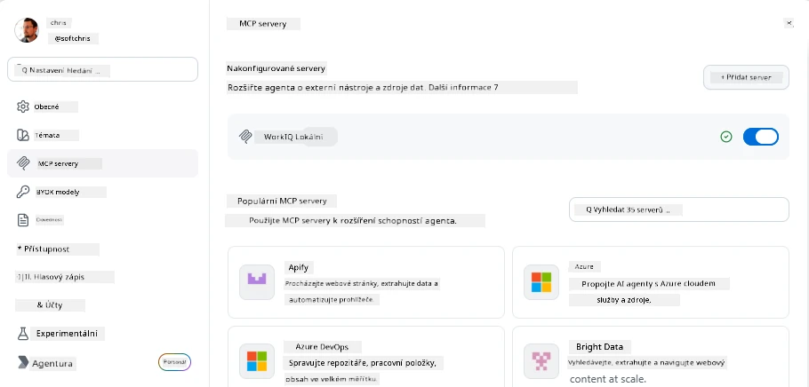
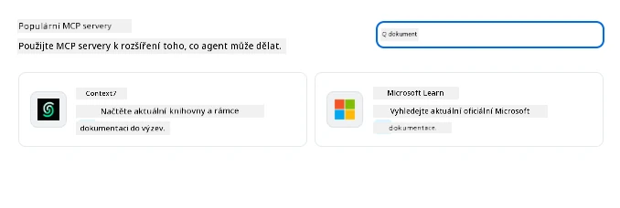
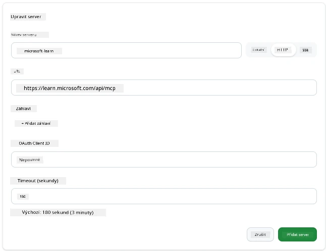
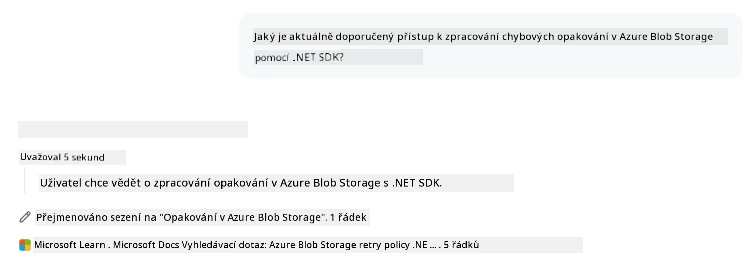
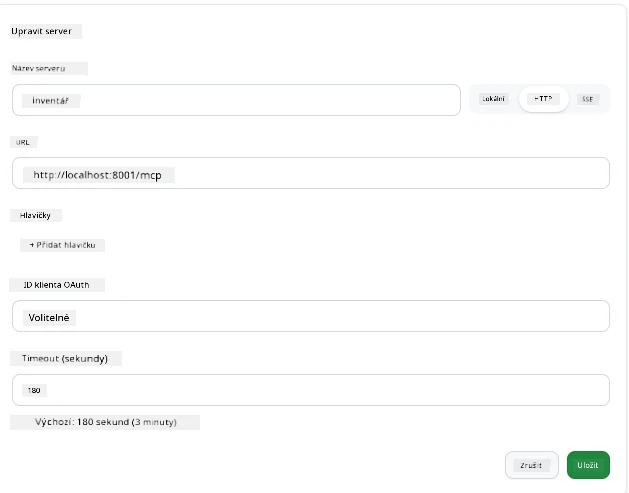
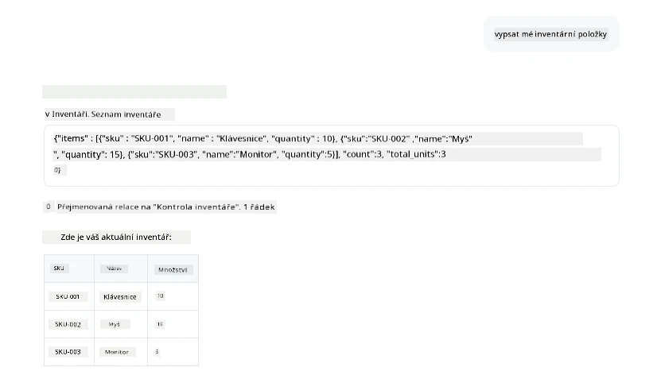
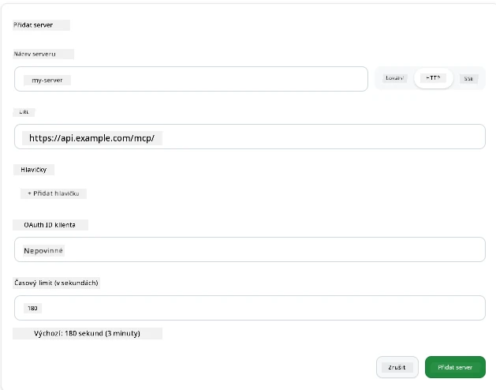
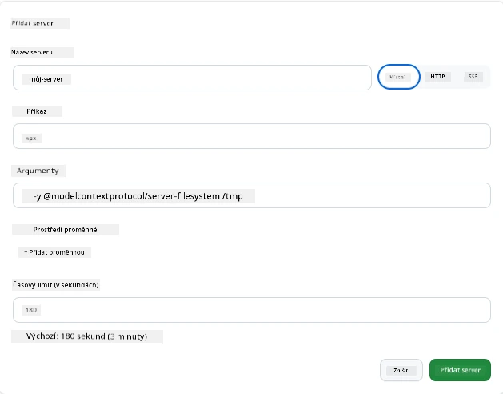

# Používání MCP serverů v aplikaci GitHub Copilot

Už víte, jak MCP funguje. Postavili jste servery, definovali nástroje a zdroje a propojili klienty. Co jsme zatím neudělali, je změnit perspektivu: místo abyste byli tím, kdo staví server, jak to vypadá, když jste na *spotřebitelské* straně – jako uživatel aplikace s podporou AI, která podporuje MCP?

[GitHub Copilot App](https://github.com/github/app) je desktopová aplikace, která může používat MCP servery. Připojením MCP serverů k ní odemknete novou úroveň: Copilot může nyní nahlížet do vaší dokumentace, volat vaše interní API, dotazovat se do vaší databáze nebo komunikovat s jakoukoli službou, kterou jste zabalili do serveru. Aplikace se stává hostitelem; vaše MCP servery se stávají jejími nástroji.

Tato lekce vás provede tímto procesem od začátku do konce – od nalezení panelu nastavení MCP přes připojení reálného dokumentačního serveru až po propojení vlastního vlastního serveru.

## Cíle učení

Na konci této lekce budete umět:

- Najít a navigovat panel MCP serverů v nastavení aplikace Copilot.
- Připojit hostovaný dokumentační server a používat jej v relaci.
- Zaregistrovat vlastní server a ověřit, že Copilot může vyvolat jeho nástroje.
- Nakonfigurovat, jak je server volán, poskytnutím buď proměnných prostředí, nebo vlastních hlaviček (pokud je HTTP)

## Aplikace Copilot jako MCP hostitel

Základní myšlenka je tato: **agent Copilota jsou chytrí, ale vědí jen to, co jim řeknete.** Ve výchozím nastavení agent může číst soubory ve vašem pracovním prostoru a spouštět příkazy terminálu, ale nemůže dotazovat vaši databázi, nahlížet do kalendáře nebo volat vlastní API bez pomoci. Zde přicházejí na řadu MCP servery. Fungují jako mosty mezi Copilotem a vašimi systémy — databázemi, řízením verzí, API, návrhovými nástroji – a dávají agentům přístup k informacím a akcím, které potřebují k dokončení práce.

Začněme hledáním nastavení pro správu MCP serverů ve vaší aplikaci.

## Krok 1: Nalezení panelu nastavení MCP

Otevřete aplikaci Copilot a najděte ikonu ozubeného kola vlevo dole a klikněte na ni.


Ujistěte se, že jste vybrali "MCP Servers" a nyní byste měli vidět vaše již nakonfigurované servery nahoře, tržiště oblíbených serverů dole a tlačítko „Add Server“ nahoře takto:



To je vaše řídicí centrum. Zde přidáváte, odstraňujete, povolujete a zakazujete servery. Změny se projeví v nových relacích; pokud máte otevřenou relaci, po změně seznamu musíte spustit novou.

## Krok 2: Připojení dokumentačního serveru

Uděláme něco hned užitečného. MCP server Microsoft Docs dává Copilotu přístup k oficiální dokumentaci Microsoftu. To zahrnuje Azure, .NET, TypeScript a další. Místo aby se agent spoléhal na svá tréninková data (která mají datum ukončení), může během dotazu vytáhnout aktuální dokumenty.

Jak jej přidat:

1. V síti populárních serverů napište **learn** a vyberte server s názvem "Microsoft Learn".

   

   Po kliknutí se zobrazí formulář, kde jsou předvyplněny název, typ přenosu a URL, stačí pouze kliknout na „Add Server“.

2. Klikněte na „Add Server“, připojení k serveru by mělo chvíli trvat.

   

   Po přidání by se měl server zobrazit v horní oblasti jako nakonfigurovaný server. Vyzkoušíme to hned.

3. Zavřete dialog a vyberte Quick chat.

4. Napište níže uvedený požadavek k spuštění nástroje na serveru Microsoft Learn.

   ```text
   What's the current recommended approach for handling Azure Blob Storage 
   retries using the .NET SDK?
   ```

   

Měli byste vidět, jak odkazuje na MCP server, který jsme právě přidali.

## Krok 3: Připojení vlastního stdio serveru

Přednastavené servery jsou pohodlné, ale skutečná síla je v propojení vlastních serverů. Řekněme, že jste postavili server (nebo vám byl poskytnut), který zpřístupňuje vaše interní API nebo firemní znalostní databázi. V tomto případě použijeme MCP server, který jsme vytvořili, a který spravuje inventární systém naší firmy.

1. Klikněte na ozubené kolo a znovu vyberte „MCP servers“.

2. Klikněte na tlačítko „Add Server“ a zvolte „+ Add Custom server“, a zadejte následující hodnoty:

   - Název: `Inventory Server`
   - Vyberte typ přenosu (vpravo), **http**

   Klikněte na „Add Server“ a server by se měl objevit v seznamu nakonfigurovaných serverů.

   

4. Chcete-li to vyzkoušet, spusťte požadavek takto:

    ```
    list inventory
    ```

   

   Nyní byste měli vidět seznam položek inventáře vrácený vaším vlastnoručně vytvořeným serverem.

Výborně, nyní byste měli mít dobrý přehled o přidávání externích i vlastních MCP serverů do aplikace Copilot. Dále si povíme něco o zacházení s tajnými daty a proměnnými prostředí.

## Krok 4: Pokročilá nastavení

Doposud jste viděli, jak přidat MCP servery, kde stačí zadat název a URL. Ale co když váš server potřebuje API klíč nebo jinou hodnotu? V závislosti na typu přenosu mu můžeme poskytnout to, co potřebuje.

- **přenos http nebo SSE**: Zde můžeme nastavit hlavičky podle potřeby.

   Pro autentizaci můžete například zadat hlavičku Authorization. Hodnota může být statický řetězec. Pokud používáte OAuth, můžete místo toho zadat OAuth client ID.

   

- **stdio přenos**: Lze nastavit proměnné prostředí.

   Zde můžete specifikovat libovolný počet proměnných prostředí, které mají být předány serveru při jeho spuštění.

   

## Shrnutí

Aplikace Copilot zachází s MCP servery jako s plnohodnotnými rozšířeními schopností agenta. V této lekci jste prošli celou cestu od přidání MCP serverů až po jejich použití v relaci. Nyní můžete připojovat veřejné servery, interní API a vlastní nástroje, což vašim agentům umožní samostatně přistupovat k informacím a akcím, které potřebují k plnění úkolů.

## 📚 Další zdroje

### Oficiální dokumentace

- [GitHub Copilot App](https://github.com/github/app)
- [MCP Specification](https://modelcontextprotocol.io/specification/2025-03-26) - Specifikace Model Context Protocol

### Komunita

- [MCP Community Discord](https://discord.com/invite/ByRwuEEgH4) - Živé diskuse
- [GitHub Discussions](https://github.com/microsoft/MCP-Server-and-PostgreSQL-Sample-Retail/discussions) - Otázky a sdílení
- [Stack Overflow](https://stackoverflow.com/questions/tagged/model-context-protocol) - Technické dotazy

---

<!-- CO-OP TRANSLATOR DISCLAIMER START -->
**Prohlášení o omezení odpovědnosti**:
Tento dokument byl přeložen pomocí AI překladatelské služby [Co-op Translator](https://github.com/Azure/co-op-translator). Přestože usilujeme o co největší přesnost, mějte prosím na paměti, že automatizované překlady mohou obsahovat chyby nebo nepřesnosti. Originální dokument v jeho mateřském jazyce by měl být považován za autoritativní zdroj. Pro kritické informace se doporučuje profesionální lidský překlad. Nejsme odpovědní za jakékoli nedorozumění nebo nesprávné interpretace vzniklé použitím tohoto překladu.
<!-- CO-OP TRANSLATOR DISCLAIMER END -->