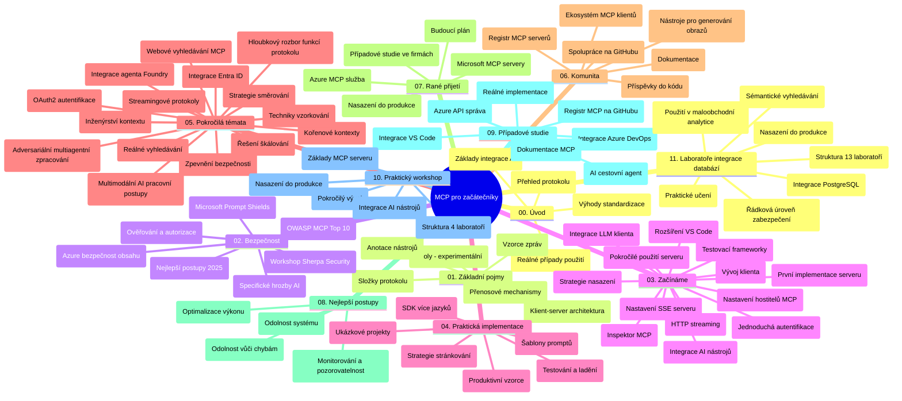

# Model Context Protocol (MCP) pro začátečníky – studijní průvodce

Tento studijní průvodce poskytuje přehled o struktuře a obsahu repozitáře pro učební plán „Model Context Protocol (MCP) pro začátečníky“. Použijte tento průvodce k efektivnímu orientování v repozitáři a maximálnímu využití dostupných zdrojů.

## Přehled repozitáře

Model Context Protocol (MCP) je standardizovaný rámec pro interakce mezi AI modely a klientskými aplikacemi. Původně vytvořený společností Anthropic, MCP nyní spravuje širší komunita MCP prostřednictvím oficiální organizace na GitHubu. Tento repozitář poskytuje komplexní učební plán s praktickými ukázkami kódu v jazycích C#, Java, JavaScript, Python a TypeScript, určený pro vývojáře AI, systémové architekty a softwarové inženýry.

## Vizualizace učebního plánu

## Struktura repozitáře

Repozitář je organizován do jedenácti hlavních sekcí, z nichž každá se zaměřuje na různé aspekty MCP:

1. **Úvod (00-Introduction/)**
   - Přehled Model Context Protocol
   - Proč je standardizace důležitá v AI pipelinech
   - Praktické scénáře a výhody

2. **Základní pojmy (01-CoreConcepts/)**
   - Klient-server architektura
   - Klíčové komponenty protokolu
   - Vzory zpráv v MCP

3. **Zabezpečení (02-Security/)**
   - Hrozby zabezpečení v systémech založených na MCP
   - Nejlepší postupy pro bezpečné implementace
   - Strategie autentizace a autorizace
   - **Komplexní dokumentace zabezpečení**:
     - MCP Security Best Practices 2025
     - Azure Content Safety Implementation Guide
     - MCP Security Controls and Techniques
     - MCP Best Practices Quick Reference
   - **Klíčová témata zabezpečení**:
     - Útoky typu prompt injection a otrava nástrojů
     - Únos relace a problémy zmateného zástupce
     - Zranitelnosti token passthrough
     - Nadměrná oprávnění a řízení přístupu
     - Zabezpečení dodavatelského řetězce AI komponent
     - Integrace Microsoft Prompt Shields

4. **Začínáme (03-GettingStarted/)**
   - Nastavení a konfigurace prostředí
   - Vytváření základních MCP serverů a klientů
   - Integrace s existujícími aplikacemi
   - Obsahuje sekce pro:
     - První implementaci serveru
     - Vývoj klienta
     - Integraci LLM klienta
     - Integraci do VS Code
     - Server-Sent Events (SSE) server
     - Pokročilé použití serveru
     - HTTP streamování
     - Integraci AI Toolkit
     - Testovací strategie
     - Pokyny k nasazení

5. **Praktická implementace (04-PracticalImplementation/)**
   - Použití SDK v různých programovacích jazycích
   - Techniky ladění, testování a validace
   - Tvorba znovupoužitelných šablon promptů a pracovních toků
   - Ukázkové projekty s příklady implementace

6. **Pokročilá témata (05-AdvancedTopics/)**
   - Techniky inženýrství kontextu
   - Integrace Foundry agenta
   - Multimodální AI pracovní toky
   - Ukázky OAuth2 autentizace
   - Možnosti vyhledávání v reálném čase
   - Real-time streaming
   - Implementace root kontextů
   - Směrovací strategie
   - Techniky sampling
   - Přístupy ke škálování
   - Zabezpečovací úvahy
   - Integrace bezpečnosti Entra ID
   - Integrace webového vyhledávání
   - Adversariální multi-agentní rozumování (vzor debat)

7. **Příspěvky komunity (06-CommunityContributions/)**
   - Jak přispívat kódem a dokumentací
   - Spolupráce přes GitHub
   - Vylepšení a zpětná vazba řízená komunitou
   - Použití různých MCP klientů (Claude Desktop, Cline, VSCode)
   - Práce s populárními MCP servery včetně generování obrázků

8. **Lekce z raného přijetí (07-LessonsfromEarlyAdoption/)**
   - Reálné implementace a příběhy úspěchu
   - Budování a nasazení řešení založených na MCP
   - Trendy a budoucí plán rozvoje
   - **Průvodce Microsoft MCP servery**: Komplexní průvodce 10 produkčně připravenými Microsoft MCP servery včetně:
     - Microsoft Learn Docs MCP Server
     - Azure MCP Server (15+ specializovaných konektorů)
     - GitHub MCP Server
     - Azure DevOps MCP Server
     - MarkItDown MCP Server
     - SQL Server MCP Server
     - Playwright MCP Server
     - Dev Box MCP Server
     - Microsoft Foundry MCP Server
     - Microsoft 365 Agents Toolkit MCP Server

9. **Nejlepší postupy (08-BestPractices/)**
   - Ladění výkonu a optimalizace
   - Návrh odolných MCP systémů
   - Strategie testování a odolnosti

10. **Případové studie (09-CaseStudy/)**
    - **Sedm komplexních případových studií** demonstrujících všestrannost MCP v různorodých scénářích:
    - **Azure AI Travel Agents**: Multi-agentní orchestrácia s Azure OpenAI a AI Search
    - **Integrace Azure DevOps**: Automatizace pracovních toků s aktualizacemi dat z YouTube
    - **Dokumentace v reálném čase**: Python konzolový klient s HTTP streamováním
    - **Interaktivní generátor studijního plánu**: Chainlit webová aplikace s konverzační AI
    - **Dokumentace v editoru**: Integrace VS Code s pracovními postupy GitHub Copilot
    - **Azure API Management**: Podniková API integrace s tvorbou MCP serveru
    - **GitHub MCP Registry**: Vývoj ekosystému a platforma agentní integrace
    - Příklady implementace pro podnikové integrace, produktivitu vývojářů a rozvoj ekosystému

11. **Praktický workshop (10-StreamliningAIWorkflowsBuildingAnMCPServerWithAIToolkit/)**
    - Komplexní praktický workshop spojující MCP s AI Toolkit
    - Budování inteligentních aplikací propojujících AI modely s reálnými nástroji
    - Praktické moduly pokrývající základy, vývoj vlastního serveru a strategie produkčního nasazení
    - **Struktura laboratoře**:
      - Laboratoř 1: Základy MCP serveru
      - Laboratoř 2: Pokročilý vývoj MCP serveru
      - Laboratoř 3: Integrace AI Toolkit
      - Laboratoř 4: Produkční nasazení a škálování
    - Učení založené na laboratořích s podrobnými instrukcemi

12. **Laboratoře integrace databáze MCP serveru (11-MCPServerHandsOnLabs/)**
    - **Komplexní cesta učením se ve 13 laboratořích** pro budování produkčně připravených MCP serverů s integrací PostgreSQL
    - **Implementace reálné analytiky maloobchodu** na základě případu použití Zava Retail
    - **Podnikové vzory** včetně Row Level Security (RLS), sémantického vyhledávání a přístupu k datům pro více nájemců
    - **Kompletní struktura laboratoří**:
      - **Laboratoře 00-03: Základy** – Úvod, architektura, bezpečnost, nastavení prostředí
      - **Laboratoře 04-06: Budování MCP serveru** – Návrh databáze, implementace serveru MCP, vývoj nástrojů
      - **Laboratoře 07-09: Pokročilé funkce** – Sémantické vyhledávání, testování a ladění, integrace VS Code
      - **Laboratoře 10-12: Produkce a nejlepší postupy** – Nasazení, monitorování, optimalizace
    - **Použité technologie**: FastMCP framework, PostgreSQL, Azure OpenAI, Azure Container Apps, Application Insights
    - **Výsledky učení**: Produkčně připravené MCP servery, vzory integrace databází, AI-poháněná analytika, podniková bezpečnost

## Další zdroje

Repozitář obsahuje podpůrné zdroje:

- **Složka obrázků**: Obsahuje diagramy a ilustrace používané v učebním plánu
- **Překlady**: Podpora vícejazyčnosti s automatizovanými překlady dokumentace
- **Oficiální zdroje MCP**:
  - [MCP Documentation](https://modelcontextprotocol.io/)
  - [MCP Specification](https://spec.modelcontextprotocol.io/)
  - [MCP GitHub Repository](https://github.com/modelcontextprotocol)

## Jak používat tento repozitář

1. **Sekvenční učení**: Postupujte kapitolami v pořadí (00 až 11) pro strukturované učení.
2. **Zaměření na konkrétní jazyk**: Pokud vás zajímá konkrétní programovací jazyk, prozkoumejte složky s ukázkami implementací ve preferovaném jazyce.
3. **Praktická implementace**: Začněte sekcí „Začínáme“ pro nastavení prostředí a vytvoření prvního MCP serveru a klienta.
4. **Pokročilé zkoumání**: Jakmile zvládnete základy, ponořte se do pokročilých témat a rozšiřte své znalosti.
5. **Zapojení komunity**: Připojte se ke komunitě MCP prostřednictvím diskuzí na GitHubu a kanálů Discord, abyste navázali kontakt s odborníky a kolegy vývojáři.

## MCP klienti a nástroje

Učební plán pokrývá různé MCP klienty a nástroje:

1. **Oficiální klienti**:
   - Visual Studio Code
   - MCP ve Visual Studio Code
   - Claude Desktop
   - Claude ve VSCode
   - Claude API

2. **Klienti komunity**:
   - Cline (terminálový)
   - Cursor (editor kódu)
   - ChatMCP
   - Windsurf

3. **Nástroje pro správu MCP**:
   - MCP CLI
   - MCP Manager
   - MCP Linker
   - MCP Router

## Oblíbené MCP servery

Repozitář představuje různé MCP servery, včetně:

1. **Oficiální Microsoft MCP servery**:
   - Microsoft Learn Docs MCP Server
   - Azure MCP Server (15+ specializovaných konektorů)
   - GitHub MCP Server
   - Azure DevOps MCP Server
   - MarkItDown MCP Server
   - SQL Server MCP Server
   - Playwright MCP Server
   - Dev Box MCP Server
   - Microsoft Foundry MCP Server
   - Microsoft 365 Agents Toolkit MCP Server

2. **Oficiální referenční servery**:
   - Filesystem
   - Fetch
   - Memory
   - Sequential Thinking

3. **Generování obrázků**:
   - Azure OpenAI DALL-E 3
   - Stable Diffusion WebUI
   - Replicate

4. **Vývojové nástroje**:
   - Git MCP
   - Terminal Control
   - Code Assistant

5. **Specializované servery**:
   - Salesforce
   - Microsoft Teams
   - Jira & Confluence

## Přispívání

Tento repozitář vítá příspěvky komunity. Podívejte se do sekce Příspěvky komunity, kde najdete pokyny, jak efektivně přispívat do ekosystému MCP.

----

*Tento studijní průvodce byl naposledy aktualizován 5. února 2026, reflektuje nejnovější MCP Specification 2025-11-25 a poskytuje přehled repozitáře k tomuto datu. Obsah repozitáře může být aktualizován i po tomto datu.*

---

<!-- CO-OP TRANSLATOR DISCLAIMER START -->
**Prohlášení o omezení odpovědnosti**:
Tento dokument byl přeložen pomocí AI překladatelské služby [Co-op Translator](https://github.com/Azure/co-op-translator). Přestože usilujeme o co největší přesnost, mějte prosím na paměti, že automatizované překlady mohou obsahovat chyby nebo nepřesnosti. Originální dokument v jeho mateřském jazyce by měl být považován za autoritativní zdroj. Pro kritické informace se doporučuje profesionální lidský překlad. Nejsme odpovědní za jakékoli nedorozumění nebo nesprávné interpretace vzniklé použitím tohoto překladu.
<!-- CO-OP TRANSLATOR DISCLAIMER END -->