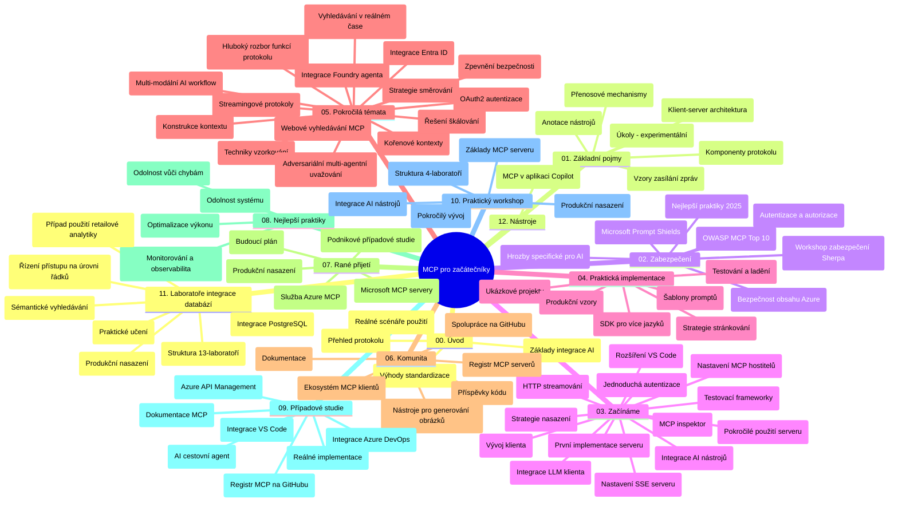

# Model Context Protocol (MCP) pro začátečníky - studijní průvodce

Tento studijní průvodce poskytuje přehled struktury a obsahu repozitáře pro kurz "Model Context Protocol (MCP) pro začátečníky". Použijte tento průvodce k efektivní orientaci v repozitáři a maximálnímu využití dostupných zdrojů.

## Přehled repozitáře

Model Context Protocol (MCP) je standardizovaný rámec pro interakce mezi AI modely a klientskými aplikacemi. Původně vytvořený společností Anthropic, nyní je MCP spravován širší komunitou MCP prostřednictvím oficiální organizace GitHub. Tento repozitář poskytuje komplexní učební plán s praktickými ukázkami kódu v C#, Java, JavaScript, Python a TypeScript, určený pro vývojáře AI, systémové architekty a softwarové inženýry.

## Vizualizace učebního plánu

## Struktura repozitáře

Repozitář je rozdělen do dvanácti hlavních sekcí, z nichž každá se zaměřuje na různé aspekty MCP:

1. **Úvod (00-Introduction/)**
   - Přehled Model Context Protocol
   - Proč je standardizace důležitá v AI pipelinech
   - Praktické případy použití a přínosy

2. **Základní koncepty (01-CoreConcepts/)**
   - Architektura klient-server
   - Klíčové komponenty protokolu
   - Vzory zasílání zpráv v MCP

3. **Bezpečnost (02-Security/)**
   - Bezpečnostní hrozby v systémech založených na MCP
   - Nejlepší postupy zabezpečení implementací
   - Strategie autentizace a autorizace
   - **Komplexní bezpečnostní dokumentace**:
     - MCP Security Best Practices 2025
     - Průvodce implementací Azure Content Safety
     - MCP bezpečnostní kontroly a techniky
     - Rychlá reference nejlepších bezpečnostních praktik MCP
   - **Klíčová bezpečnostní témata**:
     - útoky typu prompt injection a nákaza nástrojů
     - únosy relací a problémy zmateného zástupce
     - zranitelnosti při průchodu tokenů
     - nadměrná oprávnění a řízení přístupu
     - zabezpečení dodavatelských řetězců pro AI komponenty
     - integrace Microsoft Prompt Shields

4. **Začínáme (03-GettingStarted/)**
   - Nastavení a konfigurace prostředí
   - Vytváření základních MCP serverů a klientů
   - Integrace se stávajícími aplikacemi
   - Obsahuje sekce pro:
     - První implementaci serveru
     - Vývoj klienta
     - Integraci LLM klienta
     - Integraci VS Code
     - SSE server (Server-Sent Events)
     - Pokročilé použití serveru
     - HTTP streamování
     - Integraci AI Toolkit
     - Strategie testování
     - Pokyny k nasazení

5. **Praktická implementace (04-PracticalImplementation/)**
   - Používání SDK v různých programovacích jazycích
   - Ladění, testování a ověřování
   - Tvorba znovupoužitelných šablon promptů a pracovních postupů
   - Vzorové projekty s příklady implementace

6. **Pokročilá témata (05-AdvancedTopics/)**
   - Techniky kontextového inženýrství
   - Integrace agenta Foundry
   - Více-modální AI pracovní postupy
   - Ukázky autentizace OAuth2
   - Real-time vyhledávání
   - Real-time streamování
   - Implementace root kontextů
   - Směrovací strategie
   - Techniky vzorkování
   - Přístupy k škálování
   - Bezpečnostní úvahy
   - Integrace bezpečnosti Entra ID
   - Webové vyhledávání
   - Adversariální multi-agentní uvažování (debatní vzory)

7. **Příspěvky komunity (06-CommunityContributions/)**
   - Jak přispívat kódem a dokumentací
   - Spolupráce přes GitHub
   - Vylepšení a zpětná vazba vedená komunitou
   - Používání různých MCP klientů (Claude Desktop, Cline, VSCode)
   - Práce s populárními MCP servery včetně generování obrázků

8. **Lekce z raného adopce (07-LessonsfromEarlyAdoption/)**
   - Reálné implementace a úspěšné příběhy
   - Vývoj a nasazení řešení založených na MCP
   - Trendy a budoucí roadmapa
   - **Průvodce Microsoft MCP servery**: Kompletní průvodce 10 produkčně připravenými Microsoft MCP servery včetně:
     - Microsoft Learn Docs MCP Server
     - Azure MCP Server (15+ specializovaných konektorů)
     - GitHub MCP Server
     - Azure DevOps MCP Server
     - MarkItDown MCP Server
     - SQL Server MCP Server
     - Playwright MCP Server
     - Dev Box MCP Server
     - Microsoft Foundry MCP Server
     - Microsoft 365 Agents Toolkit MCP Server

9. **Nejlepší postupy (08-BestPractices/)**
   - Ladění výkonu a optimalizace
   - Návrh odolných MCP systémů
   - Strategie testování a odolnosti

10. **Případové studie (09-CaseStudy/)**
    - **Sedm komplexních případových studií** demonstrujících všestrannost MCP v různých scénářích:
    - **Azure AI Travel Agents**: Více-agentní orchestrace s Azure OpenAI a AI Search
    - **Integrace Azure DevOps**: Automatizace pracovních procesů s aktualizacemi dat z YouTube
    - **Real-time získávání dokumentace**: Python konzolový klient s HTTP streamováním
    - **Interaktivní generátor studijních plánů**: Chainlit webová aplikace s konverzační AI
    - **Dokumentace v editoru**: Integrace VS Code s pracovními postupy GitHub Copilot
    - **Azure API Management**: Podniková API integrace s tvorbou MCP serveru
    - **GitHub MCP Registry**: Vývoj ekosystému a platforma pro agentické integrace
    - Příklady implementace pokrývající podnikové integrace, produktivitu vývojářů a rozvoj ekosystému

11. **Praktický workshop (10-StreamliningAIWorkflowsBuildingAnMCPServerWithAIToolkit/)**
    - Komplexní praktický workshop kombinující MCP s AI Toolkit
    - Vytváření inteligentních aplikací propojujících AI modely s reálnými nástroji
    - Praktické moduly pokrývající základy, vývoj vlastního serveru a strategie nasazení do produkce
    - **Struktura laboratoří**:
      - Laboratoř 1: Základy MCP serveru
      - Laboratoř 2: Pokročilý vývoj MCP serveru
      - Laboratoř 3: Integrace AI Toolkit
      - Laboratoř 4: Produkční nasazení a škálování
    - Výukový přístup založený na laboratořích s krok za krokem instrukcemi

12. **Laboratoře integrace MCP serveru s databází (11-MCPServerHandsOnLabs/)**
    - **Komplexní výuková cesta se 13 laboratořemi** pro stavbu produkčně připravených MCP serverů s integrací PostgreSQL
    - **Reálná implementace retailové analytiky** pomocí případu použití Zava Retail
    - **Vzorové firemní postupy** včetně Row Level Security (RLS), sémantického vyhledávání a multi-tenant přístupu k datům
    - **Kompletní struktura laboratoří**:
      - **Laboratoře 00-03: Základy** - Úvod, architektura, bezpečnost, nastavení prostředí
      - **Laboratoře 04-06: Stavba MCP serveru** - Návrh databáze, implementace MCP serveru, vývoj nástrojů
      - **Laboratoře 07-09: Pokročilé funkce** - Sémantické vyhledávání, testování a ladění, integrace VS Code
      - **Laboratoře 10-12: Produkce a nejlepší praktiky** - Nasazení, monitoring, optimalizace
    - **Použité technologie**: FastMCP framework, PostgreSQL, Azure OpenAI, Azure Container Apps, Application Insights
    - **Výsledky učení**: Produkčně připravené MCP servery, vzory integrace databází, AI řízená analytika, podniková bezpečnost

13. **Nástroje (12-tooling/)**
    - Naučte se používat MCP v aplikaci Copilot a dalších nástrojích

## Další zdroje

Repozitář obsahuje podpůrné zdroje:

- **Složka obrázků**: Obsahuje diagramy a ilustrace používané v kurzu
- **Překlady**: Podpora více jazyků s automatickými překlady dokumentace
- **Oficiální zdroje MCP**:
  - [MCP dokumentace](https://modelcontextprotocol.io/)
  - [MCP specifikace](https://spec.modelcontextprotocol.io/)
  - [MCP GitHub repozitář](https://github.com/modelcontextprotocol)

## Jak používat tento repozitář

1. **Sekvenční učení**: Postupujte kapitolami v pořadí (00 až 11) pro strukturované učení.
2. **Jazykově specifické zaměření**: Pokud vás zajímá konkrétní programovací jazyk, prozkoumejte adresáře s ukázkami pro implementace ve vámi preferovaném jazyce.
3. **Praktická implementace**: Začněte sekcí "Začínáme" pro nastavení prostředí a vytvoření prvního MCP serveru a klienta.
4. **Pokročilé zkoumání**: Jakmile zvládnete základy, ponořte se do pokročilých témat pro rozšíření znalostí.
5. **Zapojení komunity**: Přidejte se ke komunitě MCP přes GitHub diskuse a Discord kanály pro spojení s experty a dalšími vývojáři.

## MCP klienti a nástroje

Kurz pokrývá různé MCP klienty a nástroje:

1. **Oficiální klienti**:
   - Visual Studio Code
   - MCP ve Visual Studio Code
   - Claude Desktop
   - Claude ve VSCode
   - Claude API

2. **Klienti komunity**:
   - Cline (terminálový)
   - Cursor (editor kódu)
   - ChatMCP
   - Windsurf

3. **Nástroje pro správu MCP**:
   - MCP CLI
   - MCP Manager
   - MCP Linker
   - MCP Router

## Oblíbené MCP servery

Repozitář představuje různé MCP servery, včetně:

1. **Oficiální Microsoft MCP servery**:
   - Microsoft Learn Docs MCP Server
   - Azure MCP Server (15+ specializovaných konektorů)
   - GitHub MCP Server
   - Azure DevOps MCP Server
   - MarkItDown MCP Server
   - SQL Server MCP Server
   - Playwright MCP Server
   - Dev Box MCP Server
   - Microsoft Foundry MCP Server
   - Microsoft 365 Agents Toolkit MCP Server

2. **Oficiální referenční servery**:
   - Filesystem
   - Fetch
   - Memory
   - Sequential Thinking

3. **Generování obrázků**:
   - Azure OpenAI DALL-E 3
   - Stable Diffusion WebUI
   - Replicate

4. **Vývojové nástroje**:
   - Git MCP
   - Terminal Control
   - Code Assistant

5. **Specializované servery**:
   - Salesforce
   - Microsoft Teams
   - Jira & Confluence

## Přispívání

Tento repozitář vítá příspěvky od komunity. Viz sekce Příspěvky komunity pro pokyny, jak efektivně přispívat do ekosystému MCP.

----

*Tento studijní průvodce byl naposledy aktualizován 5. února 2026, reflektuje nejnovější MCP specifikaci z 25. listopadu 2025 a poskytuje přehled repozitáře k tomuto datu. Obsah repozitáře může být po tomto datu aktualizován.*

---

<!-- CO-OP TRANSLATOR DISCLAIMER START -->
**Prohlášení o omezení odpovědnosti**:
Tento dokument byl přeložen pomocí AI překladatelské služby [Co-op Translator](https://github.com/Azure/co-op-translator). Přestože usilujeme o co největší přesnost, mějte prosím na paměti, že automatizované překlady mohou obsahovat chyby nebo nepřesnosti. Originální dokument v jeho mateřském jazyce by měl být považován za autoritativní zdroj. Pro kritické informace se doporučuje profesionální lidský překlad. Nejsme odpovědní za jakékoli nedorozumění nebo nesprávné interpretace vzniklé použitím tohoto překladu.
<!-- CO-OP TRANSLATOR DISCLAIMER END -->