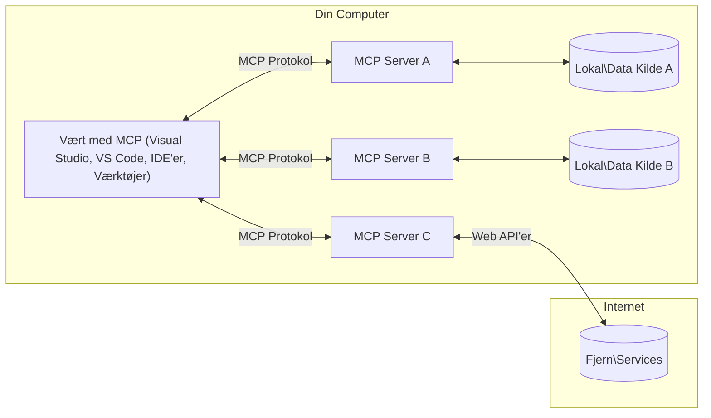

# MCP Kernbegreber: Mestring af Model Context Protocol for AI-integration

[](https://youtu.be/earDzWGtE84)

_(Klik på billedet ovenfor for at se videoen til denne lektion)_

[Model Context Protocol (MCP)](https://github.com/modelcontextprotocol) er en kraftfuld, standardiseret ramme, der optimerer kommunikationen mellem store sprogmodeller (LLMs) og eksterne værktøjer, applikationer og datakilder.  
Denne guide fører dig igennem MCP's kernebegreber. Du vil lære om dets klient-server arkitektur, væsentlige komponenter, kommunikationsmekanik og bedste praksisser for implementering.

- **Eksplícit brugersamtykke**: Al datatilgang og operationer kræver eksplícit brugeraccept før udførelse. Brugere skal klart forstå, hvilke data der tilgås, og hvilke handlinger der udføres, med detaljeret kontrol over tilladelser og godkendelser.

- **Beskyttelse af dataprivatliv**: Brugerdata eksponeres kun med eksplícit samtykke og skal beskyttes af robuste adgangskontroller gennem hele interaktionsforløbet. Implementeringer skal forhindre uautoriseret dataoverførsel og opretholde strenge privatlivsgrænser.

- **Sikkerhed ved værktøjsudførelse**: Hver værktøjsanmodning kræver eksplícit brugersamtykke med klar forståelse af værktøjets funktionalitet, parametre og potentielle konsekvenser. Robuste sikkerhedsgrænser skal forhindre utilsigtet, usikker eller ondsindet værktøjsudførelse.

- **Transportlagsikkerhed**: Alle kommunikationskanaler bør anvende passende kryptering og autentifikationsmekanismer. Fjernforbindelser bør implementere sikre transportprotokoller og korrekt credentialstyring.

#### Implementeringsretningslinjer:

- **Tilladelsesstyring**: Implementer detaljerede tilladelsessystemer, der giver brugere kontrol over, hvilke servere, værktøjer og ressourcer der er tilgængelige  
- **Autentifikation & Autorisation**: Brug sikre autentifikationsmetoder (OAuth, API-nøgler) med ordentlig token-håndtering og udløb  
- **Inputvalidering**: Valider alle parametre og datainput i henhold til definerede skemaer for at forhindre injektionsangreb  
- **Auditlogning**: Opbevar omfattende logfiler over alle operationer til sikkerhedsovervågning og compliance

## Oversigt

Denne lektion udforsker den grundlæggende arkitektur og de komponenter, der udgør Model Context Protocol (MCP) økosystemet. Du vil lære om klient-server arkitektur, nøglekomponenter og kommunikationsmekanismer, som driver MCP-interaktioner.

## Vigtige læringsmål

Når du har gennemført denne lektion, vil du:

- Forstå MCP klient-server arkitektur.  
- Identificere roller og ansvar for Hosts, Clients og Servers.  
- Analysere kernefunktionerne, der gør MCP til et fleksibelt integrationslag.  
- Lære, hvordan information flyder indenfor MCP økosystemet.  
- Opnå praktiske indsigter gennem kodeeksempler i .NET, Java, Python og JavaScript.

## MCP Arkitektur: Et dybere kig

MCP økosystemet er bygget på en klient-server model. Denne modulære struktur tillader AI-applikationer at interagere effektivt med værktøjer, databaser, API’er og kontekstuelle ressourcer. Lad os bryde denne arkitektur ned i dens kernekomponenter.

I sin kerne følger MCP en klient-server arkitektur, hvor en host-applikation kan oprette forbindelse til flere servere:


- **MCP Hosts**: Programmer som VSCode, Claude Desktop, IDE'er eller AI-værktøjer, der ønsker at tilgå data gennem MCP  
- **MCP Clients**: Protokolklienter, som opretholder 1:1 forbindelser med servere  
- **MCP Servers**: Letvægtsprogrammer, som hver eksponerer specifikke funktioner via den standardiserede Model Context Protocol  
- **Lokale datakilder**: Din computers filer, databaser og services, som MCP-Servere sikkert kan tilgå  
- **Fjernservices**: Eksterne systemer tilgængelige via internettet, som MCP-servere kan forbinde til gennem API’er.

MCP-protokollen er en udviklende standard med dato-baseret versionering (format YYYY-MM-DD). Den aktuelle protokolversion er **2025-11-25**. Du kan se de seneste opdateringer til [protokolspecifikationen](https://modelcontextprotocol.io/specification/2025-11-25/)

### 1. Hosts

I Model Context Protocol (MCP) er **Hosts** AI-applikationer, der fungerer som den primære grænseflade, hvorigennem brugerne interagerer med protokollen. Hosts koordinerer og administrerer forbindelser til flere MCP-servere ved at oprette dedikerede MCP-klienter for hver serverforbindelse. Eksempler på Hosts inkluderer:

- **AI-applikationer**: Claude Desktop, Visual Studio Code, Claude Code  
- **Udviklingsmiljøer**: IDE'er og kodeeditorer med MCP-integration  
- **Tilpassede applikationer**: Specialbyggede AI-agenter og værktøjer

**Hosts** er applikationer, der koordinerer AI-modelinteraktioner. De:

- **Orkestrerer AI-modeller**: Udfører eller interagerer med LLM’er for at generere svar og koordinere AI-arbejdsgange  
- **Administrerer klientforbindelser**: Opretter og vedligeholder én MCP-klient per MCP-serverforbindelse  
- **Kontrollerer brugergrænsefladen**: Håndterer samtaleflow, brugerinteraktioner og præsentation af svar  
- **Håndhæver sikkerhed**: Kontrollerer tilladelser, sikkerhedsfunktioner og autentifikation  
- **Håndterer brugersamtykke**: Administrerer brugerens godkendelse til datadeling og værktøjsudførelse

### 2. Clients

**Clients** er essentielle komponenter, der opretholder dedikerede én-til-én-forbindelser mellem Hosts og MCP-servere. Hver MCP-klient instantieres af Host’en for at oprette forbindelse til en specifik MCP-server, hvilket sikrer organiserede og sikre kommunikationskanaler. Flere klienter gør det muligt for Hosts at forbinde til flere servere samtidig.

**Clients** er forbindelseselementer indlejret i host-applikationen. De:

- **Protokolkommunikation**: Sender JSON-RPC 2.0 forespørgsler til servere med prompts og instruktioner  
- **Funktionalitetsaftale**: Forhandler understøttede funktioner og protokolversioner med servere under initialisering  
- **Værktøjsudførelse**: Administrerer værktøjsudførelsesanmodninger fra modeller og håndterer svar  
- **Realtidsopdateringer**: Håndterer notifikationer og realtidsopdateringer fra servere  
- **Svarbehandling**: Behandler og formaterer serversvar til visning for brugere

### 3. Servers

**Servers** er programmer, der leverer kontekst, værktøjer og funktionalitet til MCP-klienter. De kan køre lokalt (på samme maskine som Host’en) eller eksternt (på eksterne platforme), og er ansvarlige for at håndtere klientanmodninger og levere strukturerede svar. Servere eksponerer specifik funktionalitet via den standardiserede Model Context Protocol.

**Servers** er services, der leverer kontekst og kapaciteter. De:

- **Registrering af funktioner**: Registrerer og eksponerer tilgængelige primitive elementer (ressourcer, prompts, værktøjer) til klienter  
- **Behandling af anmodninger**: Modtager og udfører værktøjskald, ressourceanmodninger og promptanmodninger fra klienter  
- **Kontekstilvejebringelse**: Tilfører kontekstuel information og data for at forbedre modelrespons  
- **Tilstandsstyring**: Vedligeholder sessionstilstand og håndterer tilstandsfulde interaktioner efter behov  
- **Realtidsnotifikationer**: Sender notifikationer om funktionalitetsændringer og opdateringer til tilsluttede klienter

Servere kan udvikles af alle for at udvide modelkapaciteter med specialiseret funktionalitet, og de understøtter både lokal og fjernudrulning.

### 4. Server Primitives

Servere i Model Context Protocol (MCP) tilbyder tre kerne-**primitives**, som definerer fundamentale byggesten for rige interaktioner mellem klienter, hosts og sprogmodeller. Disse primitives specificerer typerne af kontekstuel information og handlinger, som protokollen tillader.

MCP-servere kan eksponere en hvilken som helst kombination af de følgende tre kerne-primitives:

#### Ressourcer  

**Ressourcer** er datakilder, der leverer kontekstuel information til AI-applikationer. De repræsenterer statisk eller dynamisk indhold, som kan forbedre modelforståelse og beslutningstagning:

- **Kontekstuel data**: Struktureret information og kontekst til AI-modelbrug  
- **Vidensdatabaser**: Dokumentarkiver, artikler, manualer og forskningsartikler  
- **Lokale datakilder**: Filer, databaser og lokal systeminformation  
- **Eksterne data**: API-svar, webservices og eksterne systemdata  
- **Dynamisk indhold**: Realtidsdata, der opdateres baseret på eksterne forhold

Ressourcer identificeres via URI’er og understøtter opdagelse via `resources/list` og hentning via `resources/read` metoder:

```text
file://documents/project-spec.md
database://production/users/schema
api://weather/current
```

#### Prompts

**Prompts** er genanvendelige skabeloner, der hjælper med at strukturere interaktioner med sprogmodeller. De leverer standardiserede interaktionsmønstre og skabelonbaserede arbejdsgange:

- **Skabelonbaserede interaktioner**: Forudstrukturerede beskeder og samtalestartere  
- **Arbejdsgangsskabeloner**: Standardiserede sekvenser til almindelige opgaver og interaktioner  
- **Few-shot eksempler**: Eksempeldrevne skabeloner til modelinstruktion  
- **Systemprompts**: Grundlæggende prompts, der definerer modeladfærd og kontekst  
- **Dynamiske skabeloner**: Parameterstyrede prompts, der tilpasser sig specifikke kontekster

Prompts understøtter variabel substitution og kan findes via `prompts/list` og hentes med `prompts/get`:

```markdown
Generate a {{task_type}} for {{product}} targeting {{audience}} with the following requirements: {{requirements}}
```

#### Værktøjer

**Værktøjer** er eksekverbare funktioner, som AI-modeller kan kalde for at udføre bestemte handlinger. De repræsenterer "verberne" i MCP-økosystemet, som giver modeller mulighed for at interagere med eksterne systemer:

- **Eksekverbare funktioner**: Diskrete operationer, som modeller kan kalde med specifikke parametre  
- **Integration af eksterne systemer**: API-kald, databaseforespørgsler, filoperationer, beregninger  
- **Unik identitet**: Hvert værktøj har et særskilt navn, beskrivelse og parameterskema  
- **Struktureret I/O**: Værktøjer accepterer validerede parametre og returnerer strukturerede, typede svar  
- **Handlingskapaciteter**: Muliggør at modeller kan udføre virkelige handlinger og hente live data

Værktøjer defineres med JSON Schema til parameter-validering og findes via `tools/list` og eksekveres via `tools/call`. Værktøjer kan også inkludere **ikoner** som yderligere metadata for bedre UI-præsentation.

**Værktøjsannoteringer**: Værktøjer understøtter adfærdsannoteringer (f.eks. `readOnlyHint`, `destructiveHint`), som beskriver om et værktøj er skrivebeskyttet eller destruktivt, hvilket hjælper klienter med at træffe informerede beslutninger om værktøjsudførelse.

Eksempel på værktøjsdefinition:

```typescript
server.tool(
  "search_products", 
  {
    query: z.string().describe("Search query for products"),
    category: z.string().optional().describe("Product category filter"),
    max_results: z.number().default(10).describe("Maximum results to return")
  }, 
  async (params) => {
    // Udfør søgning og returner strukturerede resultater
    return await productService.search(params);
  }
);
```

## Klient-primitives

I Model Context Protocol (MCP) kan **klienter** eksponere primitives, der tillader servere at anmode om yderligere funktionaliteter fra host-applikationen. Disse klient-side primitives muliggør rigere og mere interaktive server-implementeringer, som kan få adgang til AI-modelkapaciteter og brugerinteraktioner.

### Sampling

**Sampling** tillader servere at anmode om sprogmodel-kompletioner fra klientens AI-applikation. Denne primitive gør det muligt for servere at tilgå LLM-kapaciteter uden at skulle indlejre egne modelafhængigheder:

- **Modeluafhængig adgang**: Servere kan anmode om completioner uden at inkludere LLM SDK’er eller håndtere modeladgang  
- **Serverinitieret AI**: Gør servere i stand til selvstændigt at generere indhold ved at bruge klientens AI-model  
- **Rekursive LLM-interaktioner**: Understøtter komplekse scenarier, hvor servere har brug for AI-assistance til behandling  
- **Dynamisk indholdsgenerering**: Gør servere i stand til at skabe kontekstuelle svar ved hjælp af hostens model  
- **Support til værktøjsopkald**: Servere kan inkludere `tools` og `toolChoice` parametre for at gøre det muligt for klientens model at kalde værktøjer under sampling

Sampling initieres via metoden `sampling/complete`, hvor servere sender completion-anmodninger til klienter.

### Roots

**Roots** leverer en standardiseret måde for klienter at eksponere filsystemgrænser til servere, hvilket hjælper servere med at forstå, hvilke mapper og filer de har adgang til:

- **Filsystemgrænser**: Definerer grænserne for, hvor servere kan operere i filsystemet  
- **Adgangskontrol**: Hjælper servere med at forstå, hvilke mapper og filer de har tilladelse til at tilgå  
- **Dynamiske opdateringer**: Klienter kan notificere servere, når listen over roots ændres  
- **URI-baseret identifikation**: Roots bruger `file://` URI’er til at identificere tilgængelige mapper og filer

Roots findes via metoden `roots/list`, hvor klienter sender `notifications/roots/list_changed`, når roots ændres.

### Elicitation  

**Elicitation** gør det muligt for servere at anmode om yderligere information eller bekræftelse fra brugere gennem klientgrænsefladen:

- **Brugerinputanmodninger**: Servere kan bede om yderligere oplysninger, når det er nødvendigt til værktøjsudførelse  
- **Bekræftelsesdialoger**: Anmod om brugeraccept til følsomme eller indgribende operationer  
- **Interaktive arbejdsgange**: Muliggør, at servere kan skabe trinvise brugerinteraktioner  
- **Dynamisk parameterindsamling**: Indsamler manglende eller valgfrie parametre under værktøjsudførelse

Elicitation-anmodninger foretages via metoden `elicitation/request` for at indsamle brugerinput gennem klientens grænseflade.

**URL Mode Elicitation**: Servere kan også anmode om URL-baserede brugerinteraktioner, som tillader servere at dirigere brugere til eksterne websider for autentifikation, bekræftelse eller dataindtastning.

### Logger

**Logning** tillader servere at sende strukturerede logbeskeder til klienter til debugging, overvågning og operationel gennemsigtighed:

- **Fejlfinding**: Muliggør at servere kan levere detaljerede eksekveringslogs til fejlsøgning  
- **Operationel overvågning**: Sender statusopdateringer og ydelsesmetrikker til klienter  
- **Fejlrapportering**: Leverer detaljeret fejlkontekst og diagnostikinformation  
- **Auditspor**: Skaber omfattende logfiler over serveroperationer og beslutninger

Logmeddelelser sendes til klienter for at give transparens i serveroperationer og lette debugging.

## Informationsflow i MCP

Model Context Protocol (MCP) definerer et struktureret informationsflow mellem hosts, clients, servers og modeller. At forstå dette flow hjælper med at klarlægge, hvordan brugerforespørgsler behandles, og hvordan eksterne værktøjer og data integreres i model-svar.
- **Værten initierer forbindelse**  
  Vært-applikationen (såsom en IDE eller chatgrænseflade) opretter forbindelse til en MCP-server, typisk via STDIO, WebSocket eller en anden understøttet transport.

- **Kapabilitetsforhandling**  
  Klienten (indlejret i værten) og serveren udveksler information om deres understøttede funktioner, værktøjer, ressourcer og protokolversioner. Dette sikrer, at begge parter forstår, hvilke kapabiliteter der er tilgængelige for sessionen.

- **Brugerforespørgsel**  
  Brugeren interagerer med værten (f.eks. indtaster en prompt eller kommando). Værten indsamler denne input og sender den til klienten til behandling.

- **Brug af ressource eller værktøj**  
  - Klienten kan anmode om yderligere kontekst eller ressourcer fra serveren (såsom filer, databaseposter eller vidensbaseartikler) for at berige modellens forståelse.  
  - Hvis modellen vurderer, at et værktøj er nødvendigt (f.eks. til at hente data, udføre en beregning eller kalde et API), sender klienten en værktøjsanmodning til serveren med angivelse af værktøjets navn og parametre.

- **Serverudførelse**  
  Serveren modtager ressource- eller værktøjsanmodningen, udfører de nødvendige operationer (såsom at køre en funktion, forespørge en database eller hente en fil) og returnerer resultaterne til klienten i et struktureret format.

- **Svargenerering**  
  Klienten integrerer serverens svar (ressourcedata, værktøjsoutput osv.) i den igangværende modelinteraktion. Modellen bruger denne information til at generere et omfattende og kontekstuelt relevant svar.

- **Resultatpræsentation**  
  Værten modtager det endelige output fra klienten og præsenterer det for brugeren, ofte inklusive både modellens genererede tekst og eventuelle resultater fra værktøjsudførelser eller ressourcelookups.

Denne flow gør det muligt for MCP at understøtte avancerede, interaktive og kontekstsensitive AI-applikationer ved problemfrit at forbinde modeller med eksterne værktøjer og datakilder.

## Protokolarkitektur & Lag

MCP består af to separate arkitekturlag, der arbejder sammen for at give en komplet kommunikationsramme:

### Data-lag

**Data-laget** implementerer den centrale MCP-protokol ved hjælp af **JSON-RPC 2.0** som fundament. Dette lag definerer meddelelsesstruktur, semantik og interaktionsmønstre:

#### Kernekomponenter:

- **JSON-RPC 2.0 Protokol**: Al kommunikation bruger standardiseret JSON-RPC 2.0 meddelelsesformat til metodekald, svar og notifikationer  
- **Livscyklusstyring**: Håndterer forbindelseinitiering, kapabilitetsforhandling og sessionsafslutning mellem klienter og servere  
- **Server-primitive**: Muliggør, at servere stiller kernefunktionalitet til rådighed via værktøjer, ressourcer og prompts  
- **Klient-primitive**: Muliggør, at servere kan anmode om sampling fra LLM’er, indhente brugerinput og sende logbeskeder  
- **Real-time Notifikationer**: Understøtter asynkrone notifikationer til dynamiske opdateringer uden polling

#### Nøglefunktioner:

- **Protokolversionsforhandling**: Bruger datobaseret versionering (YYYY-MM-DD) for at sikre kompatibilitet  
- **Kapabilitetsopdagelse**: Klienter og servere udveksler information om understøttede funktioner under initiering  
- **Stateful Sessions**: Vedligeholder forbindelsesstatus over flere interaktioner for kontekstuel kontinuitet

### Transport-lag

**Transportlaget** styrer kommunikationskanaler, meddelelsesindpakning og autentificering mellem MCP-deltagere:

#### Understøttede transportmekanismer:

1. **STDIO Transport**:  
   - Bruger standard input/output-strømme til direkte proceskommunikation  
   - Optimalt til lokale processer på samme maskine uden netværksoverhead  
   - Almindeligt anvendt til lokale MCP-serverimplementeringer

2. **Streambar HTTP Transport**:  
   - Bruger HTTP POST til klient-til-server beskeder  
   - Valgfri Server-Sent Events (SSE) til server-til-klient streaming  
   - Muliggør fjernserverkommunikation på tværs af netværk  
   - Understøtter standard HTTP-autentificering (bearer tokens, API-nøgler, brugerdefinerede headers)  
   - MCP anbefaler OAuth til sikker tokenbaseret autentificering

#### Transport-abstraktion:

Transportlaget abstraherer kommunikationsdetaljer fra datalaget, hvilket muliggør samme JSON-RPC 2.0 meddelelsesformat på tværs af alle transportmekanismer. Denne abstraktion gør det muligt for applikationer sømløst at skifte mellem lokale og fjernservere.

### Sikkerhedsovervejelser

MCP-implementeringer skal følge flere kritiske sikkerhedsprincipper for at sikre sikre, pålidelige og trygge interaktioner på tværs af alle protokoloperationer:

- **Brugersamtykke og kontrol**: Brugere skal give eksplicit samtykke, før data tilgås eller operationer udføres. De skal have klar kontrol over, hvilke data der deles, og hvilke handlinger der er autoriserede, understøttet af intuitive brugerflader til gennemsyn og godkendelse af aktiviteter.

- **Dataprivatliv**: Brugerdata bør kun deles med eksplicit samtykke og beskyttes af passende adgangskontrol. MCP-implementeringer skal beskytte mod uautoriseret datatransmission og sikre, at privatliv opretholdes gennem alle interaktioner.

- **Værktøjssikkerhed**: Før et værktøj kaldes, kræves eksplicit brugersamtykke. Brugerne skal have en klar forståelse af hvert værktøjs funktionalitet, og robuste sikkerhedsgrænser skal håndhæves for at forhindre utilsigtet eller usikker værktøjsudførelse.

Ved at følge disse sikkerhedsprincipper sikrer MCP brugerens tillid, privatliv og sikkerhed i alle protokolinteraktioner, samtidig med at det muliggør kraftfulde AI-integrationer.

## Kodeeksempler: Nøglekomponenter

Nedenfor vises kodeeksempler i flere populære programmeringssprog, der illustrerer, hvordan man implementerer nøglekomponenter og værktøjer på en MCP-server.

### .NET Eksempel: Oprettelse af en simpel MCP-server med værktøjer

Her er et praktisk .NET kodeeksempel, der demonstrerer, hvordan man implementerer en simpel MCP-server med brugerdefinerede værktøjer. Eksemplet viser, hvordan man definerer og registrerer værktøjer, håndterer forespørgsler og forbinder serveren ved hjælp af Model Context Protocol.

```csharp
using System;
using System.Threading.Tasks;
using ModelContextProtocol.Server;
using ModelContextProtocol.Server.Transport;
using ModelContextProtocol.Server.Tools;

public class WeatherServer
{
    public static async Task Main(string[] args)
    {
        // Create an MCP server
        var server = new McpServer(
            name: "Weather MCP Server",
            version: "1.0.0"
        );
        
        // Register our custom weather tool
        server.AddTool<string, WeatherData>("weatherTool", 
            description: "Gets current weather for a location",
            execute: async (location) => {
                // Call weather API (simplified)
                var weatherData = await GetWeatherDataAsync(location);
                return weatherData;
            });
        
        // Connect the server using stdio transport
        var transport = new StdioServerTransport();
        await server.ConnectAsync(transport);
        
        Console.WriteLine("Weather MCP Server started");
        
        // Keep the server running until process is terminated
        await Task.Delay(-1);
    }
    
    private static async Task<WeatherData> GetWeatherDataAsync(string location)
    {
        // This would normally call a weather API
        // Simplified for demonstration
        await Task.Delay(100); // Simulate API call
        return new WeatherData { 
            Temperature = 72.5,
            Conditions = "Sunny",
            Location = location
        };
    }
}

public class WeatherData
{
    public double Temperature { get; set; }
    public string Conditions { get; set; }
    public string Location { get; set; }
}
```

### Java Eksempel: MCP Server-komponenter

Dette eksempel demonstrerer den samme MCP-server og værktøjsregistrering som .NET-eksemplet ovenfor, men implementeret i Java.

```java
import io.modelcontextprotocol.server.McpServer;
import io.modelcontextprotocol.server.McpToolDefinition;
import io.modelcontextprotocol.server.transport.StdioServerTransport;
import io.modelcontextprotocol.server.tool.ToolExecutionContext;
import io.modelcontextprotocol.server.tool.ToolResponse;

public class WeatherMcpServer {
    public static void main(String[] args) throws Exception {
        // Opret en MCP-server
        McpServer server = McpServer.builder()
            .name("Weather MCP Server")
            .version("1.0.0")
            .build();
            
        // Registrer et vejrværktøj
        server.registerTool(McpToolDefinition.builder("weatherTool")
            .description("Gets current weather for a location")
            .parameter("location", String.class)
            .execute((ToolExecutionContext ctx) -> {
                String location = ctx.getParameter("location", String.class);
                
                // Hent vejroplysninger (forenklet)
                WeatherData data = getWeatherData(location);
                
                // Returner formateret svar
                return ToolResponse.content(
                    String.format("Temperature: %.1f°F, Conditions: %s, Location: %s", 
                    data.getTemperature(), 
                    data.getConditions(), 
                    data.getLocation())
                );
            })
            .build());
        
        // Forbind serveren ved hjælp af stdio transport
        try (StdioServerTransport transport = new StdioServerTransport()) {
            server.connect(transport);
            System.out.println("Weather MCP Server started");
            // Hold serveren kørende indtil processen afsluttes
            Thread.currentThread().join();
        }
    }
    
    private static WeatherData getWeatherData(String location) {
        // Implementeringen ville kalde en vejr-API
        // Forenklet til eksemplificeringsformål
        return new WeatherData(72.5, "Sunny", location);
    }
}

class WeatherData {
    private double temperature;
    private String conditions;
    private String location;
    
    public WeatherData(double temperature, String conditions, String location) {
        this.temperature = temperature;
        this.conditions = conditions;
        this.location = location;
    }
    
    public double getTemperature() {
        return temperature;
    }
    
    public String getConditions() {
        return conditions;
    }
    
    public String getLocation() {
        return location;
    }
}
```

### Python Eksempel: Bygning af en MCP-server

Dette eksempel bruger fastmcp, så sørg for at installere det først:

```python
pip install fastmcp
```
Kodeeksempel:

```python
#!/usr/bin/env python3
import asyncio
from fastmcp import FastMCP
from fastmcp.transports.stdio import serve_stdio

# Opret en FastMCP-server
mcp = FastMCP(
    name="Weather MCP Server",
    version="1.0.0"
)

@mcp.tool()
def get_weather(location: str) -> dict:
    """Gets current weather for a location."""
    return {
        "temperature": 72.5,
        "conditions": "Sunny",
        "location": location
    }

# Alternativ tilgang ved brug af en klasse
class WeatherTools:
    @mcp.tool()
    def forecast(self, location: str, days: int = 1) -> dict:
        """Gets weather forecast for a location for the specified number of days."""
        return {
            "location": location,
            "forecast": [
                {"day": i+1, "temperature": 70 + i, "conditions": "Partly Cloudy"}
                for i in range(days)
            ]
        }

# Registrer klasseværktøjer
weather_tools = WeatherTools()

# Start serveren
if __name__ == "__main__":
    asyncio.run(serve_stdio(mcp))
```

### JavaScript Eksempel: Oprettelse af en MCP-server

Dette eksempel viser oprettelse af MCP-server i JavaScript samt hvordan man registrerer to vejrudsigts-relaterede værktøjer.

```javascript
// Brug af den officielle Model Context Protocol SDK
import { McpServer } from "@modelcontextprotocol/sdk/server/mcp.js";
import { StdioServerTransport } from "@modelcontextprotocol/sdk/server/stdio.js";
import { z } from "zod"; // Til parameter validering

// Opret en MCP server
const server = new McpServer({
  name: "Weather MCP Server",
  version: "1.0.0"
});

// Definer et vejrværktøj
server.tool(
  "weatherTool",
  {
    location: z.string().describe("The location to get weather for")
  },
  async ({ location }) => {
    // Dette ville normalt kalde en vejr API
    // Forenklet til demonstration
    const weatherData = await getWeatherData(location);
    
    return {
      content: [
        { 
          type: "text", 
          text: `Temperature: ${weatherData.temperature}°F, Conditions: ${weatherData.conditions}, Location: ${weatherData.location}` 
        }
      ]
    };
  }
);

// Definer et prognoseværktøj
server.tool(
  "forecastTool",
  {
    location: z.string(),
    days: z.number().default(3).describe("Number of days for forecast")
  },
  async ({ location, days }) => {
    // Dette ville normalt kalde en vejr API
    // Forenklet til demonstration
    const forecast = await getForecastData(location, days);
    
    return {
      content: [
        { 
          type: "text", 
          text: `${days}-day forecast for ${location}: ${JSON.stringify(forecast)}` 
        }
      ]
    };
  }
);

// Hjælpefunktioner
async function getWeatherData(location) {
  // Simuler API kald
  return {
    temperature: 72.5,
    conditions: "Sunny",
    location: location
  };
}

async function getForecastData(location, days) {
  // Simuler API kald
  return Array.from({ length: days }, (_, i) => ({
    day: i + 1,
    temperature: 70 + Math.floor(Math.random() * 10),
    conditions: i % 2 === 0 ? "Sunny" : "Partly Cloudy"
  }));
}

// Forbind serveren ved hjælp af stdio transport
const transport = new StdioServerTransport();
server.connect(transport).catch(console.error);

console.log("Weather MCP Server started");
```

Dette JavaScript-eksempel demonstrerer, hvordan man opretter en MCP-server ved hjælp af Model Context Protocol SDK'en. Det viser, hvordan man registrerer to værktøjer navngivet `weatherTool` og `forecastTool` og gør dem tilgængelige for MCP-klienter via `StdioServerTransport`.

## Sikkerhed og Autorisation

MCP inkluderer flere indbyggede koncepter og mekanismer til styring af sikkerhed og autorisation gennem hele protokollen:

1. **Værktøjstilladelseskontrol**:  
  Klienter kan specificere, hvilke værktøjer en model må bruge under en session. Dette sikrer, at kun eksplicit autoriserede værktøjer er tilgængelige, hvilket reducerer risikoen for utilsigtede eller usikre operationer. Tilladelser kan konfigureres dynamisk baseret på brugerpræferencer, organisationspolitikker eller konteksten for interaktionen.

2. **Autentificering**:  
  Servere kan kræve autentificering inden adgang til værktøjer, ressourcer eller følsomme operationer. Dette kan involvere API-nøgler, OAuth-tokens eller andre autentificeringsordninger. Korrekt autentificering sikrer, at kun betroede klienter og brugere kan påkalde serverfunktionaliteter.

3. **Validering**:  
  Parameter-validering håndhæves for alle værktøjskald. Hvert værktøj definerer forventede typer, formater og begrænsninger for sine parametre, og serveren validerer indkommende anmodninger herefter. Dette forhindrer dårligt formateret eller ondsindet input i at nå værktøjsimplementeringerne og hjælper med at opretholde operationernes integritet.

4. **Ratebegrænsning**:  
  For at forhindre misbrug og sikre retfærdig brug af serverressourcer kan MCP-servere implementere ratebegrænsning for værktøjskald og ressourceadgang. Ratebegrænsninger kan pålægges per bruger, per session eller globalt og hjælper med at beskytte mod denial-of-service angreb eller overdreven ressourceforbrug.

Ved at kombinere disse mekanismer giver MCP et sikkert fundament for integration af sprogmodeller med eksterne værktøjer og datakilder, samtidig med at brugere og udviklere får finmasket kontrol over adgang og brug.

## Protokolmeddelelser & Kommunikationsflow

MCP-kommunikation bruger strukturerede **JSON-RPC 2.0**-meddelelser til at muliggøre klare og pålidelige interaktioner mellem værter, klienter og servere. Protokollen definerer specifikke meddelelsesmønstre for forskellige operationstyper:

### Kerne-meddelelsestyper:

#### **Initialiseringsmeddelelser**
- **`initialize` Request**: Etablerer forbindelse og forhandler protokolversion og kapabiliteter  
- **`initialize` Response**: Bekræfter understøttede funktioner og serverinformation  
- **`notifications/initialized`**: Signalere at initialisering er fuldført, og sessionen er klar

#### **Opgangsopdagelsesmeddelelser**
- **`tools/list` Request**: Finder tilgængelige værktøjer fra serveren  
- **`resources/list` Request**: Lister tilgængelige ressourcer (datakilder)  
- **`prompts/list` Request**: Henter tilgængelige prompt-skabeloner

#### **Udførelsesmeddelelser**  
- **`tools/call` Request**: Udfører et bestemt værktøj med angivne parametre  
- **`resources/read` Request**: Henter indhold fra en bestemt ressource  
- **`prompts/get` Request**: Henter en prompt-skabelon med valgfrie parametre

#### **Klientside-meddelelser**
- **`sampling/complete` Request**: Server anmoder om LLM completion fra klienten  
- **`elicitation/request`**: Server anmoder om brugerinput via klientgrænseflade  
- **Logningsmeddelelser**: Server sender strukturerede logbeskeder til klienten

#### **Notifikationsmeddelelser**
- **`notifications/tools/list_changed`**: Server underretter klient om ændringer i værktøjer  
- **`notifications/resources/list_changed`**: Server underretter klient om ændringer i ressourcer  
- **`notifications/prompts/list_changed`**: Server underretter klient om ændringer i prompts

### Meddelelsesstruktur:

Alle MCP-meddelelser følger JSON-RPC 2.0 format med:  
- **Request-meddelelser**: Indeholder `id`, `method` og valgfrie `params`  
- **Response-meddelelser**: Indeholder `id` og enten `result` eller `error`  
- **Notifikationsmeddelelser**: Indeholder `method` og valgfrie `params` (ingen `id` eller svar forventes)

Denne strukturerede kommunikation sikrer pålidelige, sporbare og udvidelige interaktioner, der understøtter avancerede scenarier som realtidsopdateringer, værktøjskæde og robust fejlhåndtering.

### Opgaver (Eksperimentelt)

**Opgaver** er en eksperimentel funktion, der giver holdbare eksekverings-omslag, som muliggør udskudt resultathentning og statusovervågning for MCP-forespørgsler:

- **Langvarige operationer**: Sporer dyre beregninger, workflow-automatisering og batchbehandling  
- **Udskudte resultater**: Poller for opgavestatus og hent resultater, når operationerne er afsluttet  
- **Statustracking**: Overvåger opgavefremskridt gennem definerede livscyklusstadier  
- **Flere-trins operationer**: Understøtter komplekse workflows, der strækker sig over flere interaktioner

Opgaver omslutter standard MCP-forespørgsler for at muliggøre asynkrone eksekveringsmønstre for operationer, der ikke kan fuldføres straks.

## Vigtigste pointer

- **Arkitektur**: MCP bruger en klient-server arkitektur, hvor værter håndterer flere klientforbindelser til servere  
- **Deltagere**: Økosystemet omfatter værter (AI-applikationer), klienter (protokolforbindelser) og servere (kapabilitetsudbydere)  
- **Transportmekanismer**: Kommunikationen understøtter STDIO (lokal) og Streambar HTTP med valgfri SSE (fjern)  
- **Kerne-primitive**: Servere eksponerer værktøjer (eksekverbare funktioner), ressourcer (datakilder) og prompts (skabeloner)  
- **Klient-primitive**: Servere kan anmode klienter om sampling (LLM completions med værktøjskald), elicitation (brugerinput inkl. URL-tilstand), roots (filsystemgrænser) og logning  
- **Eksperimentelle funktioner**: Opgaver giver holdbare eksekveringsrammer til langvarige operationer  
- **Protokolgrundlag**: Bygget på JSON-RPC 2.0 med datobaseret versionering (nuværende: 2025-11-25)  
- **Real-time kapaciteter**: Understøtter notifikationer til dynamiske opdateringer og realtids-synkronisering  
- **Sikkerhed først**: Eksplicit brugersamtykke, dataprivatliv og sikker transport er kernekrav

## Øvelse

Design et simpelt MCP-værktøj, der ville være nyttigt inden for dit område. Definér:  
1. Hvad værktøjet skal hedde  
2. Hvilke parametre det skal acceptere  
3. Hvilket output det skal returnere  
4. Hvordan en model kunne bruge dette værktøj til at løse brugerproblemer


---

## Hvad bliver det næste

Næste: [Kapitel 2: Sikkerhed](../02-Security/README.md)

---

<!-- CO-OP TRANSLATOR DISCLAIMER START -->
**Ansvarsfraskrivelse**:
Dette dokument er blevet oversat ved hjælp af AI-oversættelsestjenesten [Co-op Translator](https://github.com/Azure/co-op-translator). Selvom vi bestræber os på nøjagtighed, bedes du være opmærksom på, at automatiserede oversættelser kan indeholde fejl eller unøjagtigheder. Det oprindelige dokument på dets modersmål bør betragtes som den autoritative kilde. For kritisk information anbefales professionel menneskelig oversættelse. Vi påtager os intet ansvar for misforståelser eller fejltolkninger, der opstår som følge af brugen af denne oversættelse.
<!-- CO-OP TRANSLATOR DISCLAIMER END -->