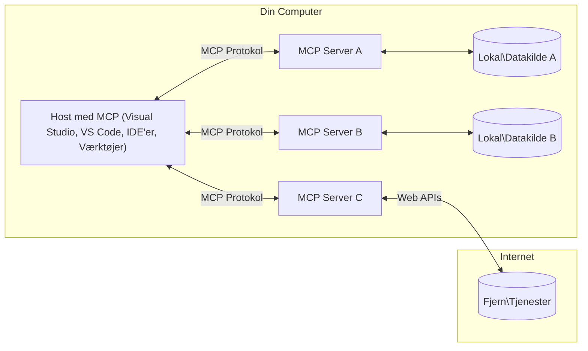

# MCP Core Concepts: Mestring af Model Context Protocol til AI Integration

[](https://youtu.be/earDzWGtE84)

_(Klik på billedet ovenfor for at se videoen til denne lektion)_

[Model Context Protocol (MCP)](https://github.com/modelcontextprotocol) er en kraftfuld, standardiseret ramme, der optimerer kommunikationen mellem store sprogmodeller (LLMs) og eksterne værktøjer, applikationer og datakilder.  
Denne guide vil føre dig igennem kernekoncepterne i MCP. Du vil lære om dens klient-server arkitektur, væsentlige komponenter, kommunikationsmekanismer og implementerings bedste praksis.

- **Udtrykkeligt Brugersamtykke**: Al dataadgang og operationer kræver udtrykkeligt bruger godkendelse før udførelse. Brugere skal klart forstå, hvilke data der tilgås, og hvilke handlinger der udføres, med detaljeret kontrol over tilladelser og autorisationer.

- **Databeskyttelse og Privatliv**: Brugerdata eksponeres kun med udtrykkeligt samtykke og skal beskyttes med robuste adgangskontroller gennem hele interaktionslivscyklussen. Implementeringer skal forhindre uautoriseret dataoverførsel og opretholde strenge privatlivsgrænser.

- **Sikker Eksekvering af Værktøjer**: Hver værktøjsopkald kræver udtrykkeligt bruger samtykke med klar forståelse af værktøjets funktionalitet, parametre og potentielle konsekvenser. Robuste sikkerhedsgrænser skal forhindre utilsigtet, usikker eller skadelig værktøjsbrug.

- **Sikkerhed på Transportlaget**: Alle kommunikationskanaler bør anvende passende kryptering og autentifikationsmekanismer. Fjernforbindelser bør implementere sikre transportprotokoller og ordentlig credential management.

#### Implementeringsretningslinjer:

- **Tilladelseshåndtering**: Implementer detaljerede tilladelsessystemer, der giver brugerne kontrol over hvilke servere, værktøjer og ressourcer der er tilgængelige
- **Autentifikation & Autorisation**: Brug sikre autentifikationsmetoder (OAuth, API-nøgler) med passende tokenhåndtering og udløbstider  
- **Inputvalidering**: Valider alle parametre og datainput efter definerede skemaer for at forhindre injektionsangreb
- **Auditlogning**: Vedligehold omfattende logfiler over alle operationer til sikkerhedsovervågning og overholdelse

## Oversigt

Denne lektion udforsker den grundlæggende arkitektur og komponenter, der udgør Model Context Protocol (MCP) økosystemet. Du vil lære om klient-server arkitekturen, nøglekomponenter og kommunikationsmekanismer, der driver MCP-interaktioner.

## Centrale Læringsmål

Ved slutningen af denne lektion vil du:

- Forstå MCP klient-server arkitekturen.  
- Identificere roller og ansvar for Hosts, Clients og Servers.  
- Analysere nøglefunktioner, der gør MCP til et fleksibelt integrationslag.  
- Lære, hvordan information flyder inden for MCP-økosystemet.  
- Få praktisk indsigt gennem kodeeksempler i .NET, Java, Python og JavaScript.

## MCP Arkitektur: Et Dybere Kig

MCP-økosystemet er bygget på en klient-server model. Denne modulære struktur tillader AI-applikationer effektivt at interagere med værktøjer, databaser, API'er og kontekstuelle ressourcer. Lad os bryde denne arkitektur ned i dens kernekomponenter.

I sin kerne følger MCP en klient-server arkitektur, hvor en host-applikation kan forbinde til flere servere:


- **MCP Hosts**: Programmer som VSCode, Claude Desktop, IDE’er eller AI-værktøjer, der ønsker adgang til data gennem MCP  
- **MCP Clients**: Protokolklienter, der opretholder 1:1 forbindelser med servere  
- **MCP Servers**: Letvægtsprogrammer, der hver udsætter specifikke funktionaliteter via den standardiserede Model Context Protocol  
- **Lokale Datakilder**: Din computers filer, databaser og services, som MCP-servere sikkert kan tilgå  
- **Fjernservices**: Eksterne systemer tilgængelige over internettet, som MCP-servere kan forbinde til via API’er.

MCP-protokollen er en udviklende standard med datobaseret versionsstyring (YYYY-MM-DD format). Den nuværende protokolversion er **2025-11-25**. Du kan se de seneste opdateringer til [protokolspecifikationen](https://modelcontextprotocol.io/specification/2025-11-25/)

### 1. Hosts

I Model Context Protocol (MCP) er **Hosts** AI-applikationer, der tjener som det primære interface, hvorigennem brugere interagerer med protokollen. Hosts koordinerer og administrerer forbindelser til flere MCP-servere ved at skabe dedikerede MCP-klienter for hver serverforbindelse. Eksempler på Hosts inkluderer:

- **AI-applikationer**: Claude Desktop, Visual Studio Code, Claude Code  
- **Udviklingsmiljøer**: IDE’er og kodeeditorer med MCP-integration  
- **Specialbyggede Applikationer**: Formålsbyggede AI-agenter og værktøjer

**Hosts** er applikationer, der koordinerer AI-modelinteraktioner. De:

- **Orkestrerer AI-Models**: Eksekverer eller interagerer med LLM’er for at generere svar og koordinere AI-arbejdsgange  
- **Håndterer Klientforbindelser**: Opretter og opretholder en MCP-klient per MCP-serverforbindelse  
- **Kontrollerer Brugerinterface**: Håndterer samtaleflow, brugerinteraktioner og svarpræsentation  
- **Håndhæver Sikkerhed**: Kontrollerer tilladelser, sikkerhedsbegrænsninger og autentifikation  
- **Håndterer Brugersamtykke**: Administrerer brugergodkendelse til datadeling og værktøjskørsel


### 2. Clients

**Clients** er essentielle komponenter, der opretholder dedikerede en-til-en forbindelser mellem Hosts og MCP-servere. Hver MCP-klient oprettes af Host’en for at forbinde til en specifik MCP-server og sikrer organiserede og sikre kommunikationskanaler. Flere klienter muliggør, at Hosts kan forbinde til flere servere samtidig.

**Clients** er forbindelseskomponenter inden for host-applikationen. De:

- **Protokolkommunikation**: Sender JSON-RPC 2.0 anmodninger til servere med prompts og instruktioner  
- **Funktionalitetsforhandling**: Forhandler understøttede funktioner og protokolversioner med servere under initialisering  
- **Værktøjsudførelse**: Håndterer værktøjskald fra modeller og behandler svar  
- **Realtidsopdateringer**: Håndterer notifikationer og realtidsopdateringer fra servere  
- **Svarbehandling**: Behandler og formaterer serversvar til visning for brugere

### 3. Servers

**Servers** er programmer, der leverer kontekst, værktøjer og funktionaliteter til MCP-klienter. De kan køre lokalt (på samme maskine som Host) eller eksternt (på eksterne platforme), og er ansvarlige for at håndtere klientanmodninger og levere strukturerede svar. Servere udsætter specifik funktionalitet via den standardiserede Model Context Protocol.

**Servers** er tjenester, der leverer kontekst og funktionaliteter. De:

- **Funktionalitetsregistrering**: Registrerer og eksponerer tilgængelige primitiviteter (ressourcer, prompts, værktøjer) til klienter  
- **Anmodningsbehandling**: Modtager og eksekverer værktøjskald, ressourcespørgsmål og promptforespørgsler fra klienter  
- **Kontekstlevering**: Tilbyder kontekstuel information og data for at forbedre modelsvar  
- **Statesstyring**: Vedligeholder sessionsstatus og håndterer tilstandsbevarende interaktioner efter behov  
- **Realtidnotifikationer**: Sender notifikationer om funktionsændringer og opdateringer til tilsluttede klienter

Servere kan udvikles af alle for at udvide modelkapaciteter med specialiseret funktionalitet, og de understøtter både lokal og fjern udrulning.

### 4. Serverprimitiver

Servere i Model Context Protocol (MCP) leverer tre kerne **primitiver**, som definerer de fundamentale byggesten for rig interaktion mellem klienter, hosts og sprogmodeller. Disse primitiviteter specificerer typer af kontekstuel information og handlinger, der er tilgængelige via protokollen.

MCP-servere kan udsætte en hvilken som helst kombination af følgende tre kerne primitives:

#### Ressourcer 

**Ressourcer** er datakilder, som leverer kontekstuel information til AI-applikationer. De repræsenterer statisk eller dynamisk indhold, der kan forbedre modelforståelse og beslutningstagning:

- **Kontextuelle Data**: Struktureret information og kontekst til AI-model konsum  
- **Vidensbaser**: Dokumentrepositorier, artikler, manualer og forskningspapirer  
- **Lokale Datakilder**: Filer, databaser og lokal systeminformation  
- **Eksterne Data**: API-svar, webservices og fjernsystemdata  
- **Dynamisk Indhold**: Realtidsdata, der opdateres baseret på eksterne tilstande

Ressourcer identificeres ved URIs og understøtter opdagelse via `resources/list` og hentning via `resources/read` metoder:

```text
file://documents/project-spec.md
database://production/users/schema
api://weather/current
```

#### Prompts

**Prompts** er genanvendelige skabeloner, som hjælper med at strukturere interaktioner med sprogmodeller. De tilbyder standardiserede interaktionsmønstre og skabelonbaserede arbejdsgange:

- **Skabelonbaserede Interaktioner**: Forudstrukturerede beskeder og samtalestartere  
- **Arbejdsgangsskabeloner**: Standardiserede sekvenser til almindelige opgaver og interaktioner  
- **Få-Skud Eksempler**: Eksempelbaserede skabeloner til modelinstruktion  
- **Systemprompts**: Grundlæggende prompts, der definerer modeladfærd og kontekst  
- **Dynamiske Skabeloner**: Parameteriserede prompts, der tilpasses specifikke kontekster

Prompts understøtter variabelsubstitution og kan findes via `prompts/list` og hentes med `prompts/get`:

```markdown
Generate a {{task_type}} for {{product}} targeting {{audience}} with the following requirements: {{requirements}}
```

#### Værktøjer

**Værktøjer** er eksekverbare funktioner, som AI-modeller kan påkalde for at udføre specifikke handlinger. De repræsenterer "verberne" i MCP-økosystemet, og giver modeller mulighed for at interagere med eksterne systemer:

- **Eksekverbare Funktioner**: Diskrete operationer, som modeller kan påkalde med specifikke parametre  
- **Integration med Eksterne Systemer**: API-kald, databaseforespørgsler, filoperationer, beregninger  
- **Unik Identitet**: Hvert værktøj har et distinkt navn, beskrivelse og parameterskema  
- **Struktureret I/O**: Værktøjer accepterer validerede parametre og returnerer strukturerede, typede svar  
- **Handlingskapaciteter**: Tillader modeller at udføre virkelige handlinger og hente live data

Værktøjer defineres med JSON Schema til parameter validering og findes gennem `tools/list` og eksekveres via `tools/call`. Værktøjer kan også inkludere **ikoner** som yderligere metadata for bedre UI-præsentation.

**Værktøjsannoteringer**: Værktøjer understøtter adfærdsannoteringer (f.eks. `readOnlyHint`, `destructiveHint`), der beskriver, om et værktøj er skrivebeskyttet eller destruktivt, hvilket hjælper klienter med at træffe informerede beslutninger ved værktøjsudførelse.

Eksempel på værktøjsdefinition:

```typescript
server.tool(
  "search_products", 
  {
    query: z.string().describe("Search query for products"),
    category: z.string().optional().describe("Product category filter"),
    max_results: z.number().default(10).describe("Maximum results to return")
  }, 
  async (params) => {
    // Udfør søgning og returner strukturerede resultater
    return await productService.search(params);
  }
);
```

## Klientprimitiver

I Model Context Protocol (MCP) kan **klienter** udsætte primitiviteter, som gør det muligt for servere at anmode om yderligere funktionaliteter fra host-applikationen. Disse klientbaserede primitiviteter tillader rigere, mere interaktive serverimplementeringer, der kan få adgang til AI-model kapaciteter og brugerinteraktioner.

### Sampling

**Sampling** tillader servere at anmode om sprogmodel-kompletteringer fra klientens AI-applikation. Denne primitive giver servere adgang til LLM kapaciteter uden at indlejre deres egne modelafhængigheder:

- **Modeluafhængig Adgang**: Servere kan anmode om kompletteringer uden at inkludere LLM SDK’er eller administrere modeladgang  
- **Serverinitieret AI**: Giver servere mulighed for selvstændigt at generere indhold ved brug af klientens AI-model  
- **Rekursive LLM Interaktioner**: Understøtter komplekse scenarier, hvor servere har brug for AI-assistance til behandling  
- **Dynamisk Indholdsgenerering**: Lader servere skabe kontekstuelle svar ved brug af hostens model  
- **Værktøjskald Support**: Servere kan inkludere `tools` og `toolChoice` parametre for at lade klientens model påkalde værktøjer under sampling

Sampling initieres gennem `sampling/complete` metoden, hvor servere sender kompletteringsanmodninger til klienter.

### Roots

**Roots** giver en standardiseret måde for klienter at eksponere filsystemgrænser til servere, som hjælper servere med at forstå, hvilke mapper og filer de har adgang til:

- **Filsystemgrænser**: Definerer de grænser, hvor servere kan operere i filsystemet  
- **Adgangskontrol**: Hjælper servere med at forstå, hvilke mapper og filer de har tilladelse til at tilgå  
- **Dynamiske Opdateringer**: Klienter kan notificere servere, når listen over roots ændres  
- **URI-Baseret Identifikation**: Roots bruger `file://` URIs til at identificere tilgængelige mapper og filer

Roots findes via `roots/list` metoden, hvor klienter sender `notifications/roots/list_changed`, når roots ændres.

### Elicitation  

**Elicitation** gør det muligt for servere at anmode om yderligere information eller bekræftelse fra brugere gennem klientgrænsefladen:

- **Brugerinput-forespørgsler**: Servere kan bede om yderligere oplysninger, når det er nødvendigt for værktøjseksekvering  
- **Bekræftelsesdialoger**: Anmoder om brugerens godkendelse for følsomme eller betydningsfulde operationer  
- **Interaktive Arbejdsgange**: Gør det muligt for servere at skabe trin-for-trin brugerinteraktioner  
- **Dynamisk Parameterindsamling**: Samler manglende eller valgfrie parametre under værktøjseksekvering

Elicitation-forespørgsler foretages vha. `elicitation/request` metoden for at indsamle brugerinput gennem klientens grænseflade.

**URL-tilstand Elicitation**: Servere kan også anmode om URL-baserede brugerinteraktioner, som tillader, at servere leder brugere til eksterne websider for autentifikation, bekræftelse eller dataindtastning.

### Logging

**Logging** tillader servere at sende strukturerede logmeddelelser til klienter til debugging, overvågning og operationel synlighed:

- **Debugstøtte**: Muliggør, at servere leverer detaljerede udførelseslogfiler til fejlfinding  
- **Operationel Overvågning**: Sender statusopdateringer og præstationsmålinger til klienter  
- **Fejlrapportering**: Leverer detaljeret fejl kontekst og diagnostisk information  
- **Audit Trails**: Opretter omfattende logs over serveroperationer og beslutninger

Logmeddelelser sendes til klienter for at give transparens i serveroperationer og lette debugging.

## Informationsflow i MCP

Model Context Protocol (MCP) definerer et struktureret informationsflow mellem hosts, klienter, servere og modeller. At forstå dette flow hjælper med at klarlægge, hvordan brugerforespørgsler behandles, og hvordan eksterne værktøjer og data integreres i modelsvar.
- **Værten initierer forbindelse**  
  Værtsapplikationen (såsom et IDE eller chatgrænseflade) opretter forbindelse til en MCP-server, typisk via STDIO, WebSocket eller et andet understøttet transportmiddel.

- **Evnenegotiation**  
  Klienten (indlejret i værten) og serveren udveksler information om deres understøttede funktioner, værktøjer, ressourcer og protokolversioner. Dette sikrer, at begge sider forstår, hvilke capabilities der er tilgængelige for sessionen.

- **Brugeranmodning**  
  Brugeren interagerer med værten (f.eks. indtaster en prompt eller kommando). Værten indsamler denne input og sender den til klienten til behandling.

- **Brug af ressourcer eller værktøjer**  
  - Klienten kan anmode om yderligere kontekst eller ressourcer fra serveren (såsom filer, databaseposter eller vidensbaseartikler) for at berige modellens forståelse.  
  - Hvis modellen vurderer, at et værktøj er nødvendigt (f.eks. for at hente data, udføre en beregning eller kalde en API), sender klienten en anmodning om værktøjskald til serveren med angivelse af værktøjets navn og parametre.

- **Serverudførelse**  
  Serveren modtager ressource- eller værktøjsanmodningen, udfører de nødvendige operationer (såsom at køre en funktion, forespørge en database eller hente en fil) og returnerer resultaterne til klienten i et struktureret format.

- **Svargenerering**  
  Klienten integrerer serverens svar (ressourcedata, værktøjsoutput osv.) i den igangværende modelinteraktion. Modellen bruger disse oplysninger til at generere et omfattende og kontekstuelt relevant svar.

- **Resultatpræsentation**  
  Værten modtager det endelige output fra klienten og præsenterer det for brugeren, ofte inklusive både modelgenereret tekst og eventuelle resultater fra værktøjsudførelser eller ressourcelookups.

Denne proces muliggør, at MCP understøtter avancerede, interaktive og kontekstbevidste AI-applikationer ved problemfrit at forbinde modeller med eksterne værktøjer og datakilder.

## Protokolarkitektur og lag

MCP består af to separate arkitekturlag, der arbejder sammen for at levere et komplet kommunikationsframework:

### Datalag

**Datalaget** implementerer kernemCP-protokollen baseret på **JSON-RPC 2.0** som fundament. Dette lag definerer meddelelsesstruktur, semantik og interaktionsmønstre:

#### Kernekomponenter:

- **JSON-RPC 2.0-protokol**: Al kommunikation bruger standardiseret JSON-RPC 2.0-meddelelsesformat til metodeopkald, svar og notifikationer  
- **Livscyklusstyring**: Håndterer initialisering af forbindelser, evnenegotiation og sessionens afslutning mellem klienter og servere  
- **Serverprimitive**: Muliggør, at servere stiller grundlæggende funktioner til rådighed gennem værktøjer, ressourcer og prompts  
- **Klientprimitive**: Muliggør, at servere kan anmode om prøvetagning fra LLM’er, indhente brugerinput og sende logbeskeder  
- **Realtime-notifikationer**: Understøtter asynkrone notifikationer til dynamiske opdateringer uden polling

#### Nøglefunktioner:

- **Protokolversionsforhandling**: Bruger datobaseret versionsstyring (ÅÅÅÅ-MM-DD) for at sikre kompatibilitet  
- **Funktionsopdagelse**: Klienter og servere udveksler information om understøttede funktioner under initialisering  
- **Stateful Sessions**: Opretholder forbindelsesstatus på tværs af flere interaktioner for kontekstkontinuitet

### Transportlag

**Transportlaget** administrerer kommunikationskanaler, meddelelsesindramning og autentificering mellem MCP-deltagere:

#### Understøttede transportmekanismer:

1. **STDIO-transport**:  
   - Bruger standard input/output-strømme til direkte proceskommunikation  
   - Optimalt til lokale processer på samme maskine uden netværksoverhead  
   - Almindeligt brugt til lokale MCP-serverimplementeringer  

2. **Streamable HTTP-transport**:  
   - Bruger HTTP POST til klient-til-server-meddelelser  
   - Valgfri Server-Sent Events (SSE) til server-til-klient streaming  
   - Muliggør ekstern serverkommunikation over netværk  
   - Understøtter standard HTTP-autentificering (bearer tokens, API nøgler, tilpassede headers)  
   - MCP anbefaler OAuth til sikker tokenbaseret autentificering

#### Transportabstraktion:

Transportlaget abstraherer kommunikationsdetaljer fra datalag, hvilket muliggør samme JSON-RPC 2.0-meddelelsesformat på tværs af alle transportmekanismer. Denne abstraktion giver applikationer mulighed for problemfrit at skifte mellem lokale og fjernservere.

### Sikkerhedsovervejelser

MCP-implementeringer skal overholde flere kritiske sikkerhedsprincipper for at sikre sikre, pålidelige og trygge interaktioner på tværs af alle protokoloperationer:

- **Brugersamtykke og kontrol**: Brugere skal give eksplicit samtykke, før data tilgås eller operationer udføres. De skal have klar kontrol over, hvilke data der deles, og hvilke handlinger der autoriseres, understøttet af intuitive brugergrænseflader til at gennemgå og godkende aktiviteter.

- **Dataprivatliv**: Brugerdata må kun eksponeres med eksplicit samtykke og skal beskyttes af passende adgangskontroller. MCP-implementeringer skal forhindre uautoriseret datatransmission og sikre, at privatlivet opretholdes under alle interaktioner.

- **Værktøjssikkerhed**: Før et værktøj kaldes, kræves eksplicit brugersamtykke. Brugere skal have klar forståelse af hvert værktøjs funktionalitet, og robuste sikkerhedsgrænser skal håndhæves for at forhindre utilsigtet eller usikker værktøjsudførelse.

Ved at følge disse sikkerhedsprincipper sikrer MCP brugertrusler, privatliv og sikkerhed på tværs af alle protokolinteraktioner samtidig med at kraftfulde AI-integrationer muliggøres.

## Kodeeksempler: Centrale komponenter

Nedenfor vises kodeeksempler i flere populære programmeringssprog, der illustrerer implementering af nøglekomponenter i MCP-servere og værktøjer.

### .NET-eksempel: Oprettelse af en simpel MCP-server med værktøjer

Her er et praktisk .NET kodeeksempel, som demonstrerer, hvordan man implementerer en simpel MCP-server med brugerdefinerede værktøjer. Eksemplet viser, hvordan man definerer og registrerer værktøjer, håndterer anmodninger og forbinder serveren ved hjælp af Model Context Protocol.

```csharp
using System;
using System.Threading.Tasks;
using ModelContextProtocol.Server;
using ModelContextProtocol.Server.Transport;
using ModelContextProtocol.Server.Tools;

public class WeatherServer
{
    public static async Task Main(string[] args)
    {
        // Create an MCP server
        var server = new McpServer(
            name: "Weather MCP Server",
            version: "1.0.0"
        );
        
        // Register our custom weather tool
        server.AddTool<string, WeatherData>("weatherTool", 
            description: "Gets current weather for a location",
            execute: async (location) => {
                // Call weather API (simplified)
                var weatherData = await GetWeatherDataAsync(location);
                return weatherData;
            });
        
        // Connect the server using stdio transport
        var transport = new StdioServerTransport();
        await server.ConnectAsync(transport);
        
        Console.WriteLine("Weather MCP Server started");
        
        // Keep the server running until process is terminated
        await Task.Delay(-1);
    }
    
    private static async Task<WeatherData> GetWeatherDataAsync(string location)
    {
        // This would normally call a weather API
        // Simplified for demonstration
        await Task.Delay(100); // Simulate API call
        return new WeatherData { 
            Temperature = 72.5,
            Conditions = "Sunny",
            Location = location
        };
    }
}

public class WeatherData
{
    public double Temperature { get; set; }
    public string Conditions { get; set; }
    public string Location { get; set; }
}
```

### Java-eksempel: MCP-serverkomponenter

Dette eksempel demonstrerer samme MCP-server og værktøjsregistrering som .NET-eksemplet ovenfor, men implementeret i Java.

```java
import io.modelcontextprotocol.server.McpServer;
import io.modelcontextprotocol.server.McpToolDefinition;
import io.modelcontextprotocol.server.transport.StdioServerTransport;
import io.modelcontextprotocol.server.tool.ToolExecutionContext;
import io.modelcontextprotocol.server.tool.ToolResponse;

public class WeatherMcpServer {
    public static void main(String[] args) throws Exception {
        // Opret en MCP-server
        McpServer server = McpServer.builder()
            .name("Weather MCP Server")
            .version("1.0.0")
            .build();
            
        // Registrer et vejrværktøj
        server.registerTool(McpToolDefinition.builder("weatherTool")
            .description("Gets current weather for a location")
            .parameter("location", String.class)
            .execute((ToolExecutionContext ctx) -> {
                String location = ctx.getParameter("location", String.class);
                
                // Hent vejrdata (forenklet)
                WeatherData data = getWeatherData(location);
                
                // Returner formateret svar
                return ToolResponse.content(
                    String.format("Temperature: %.1f°F, Conditions: %s, Location: %s", 
                    data.getTemperature(), 
                    data.getConditions(), 
                    data.getLocation())
                );
            })
            .build());
        
        // Forbind serveren ved hjælp af stdio-transport
        try (StdioServerTransport transport = new StdioServerTransport()) {
            server.connect(transport);
            System.out.println("Weather MCP Server started");
            // Hold serveren kørende, indtil processen afsluttes
            Thread.currentThread().join();
        }
    }
    
    private static WeatherData getWeatherData(String location) {
        // Implementeringen ville kalde en vejr-API
        // Forenklet til eksempelformål
        return new WeatherData(72.5, "Sunny", location);
    }
}

class WeatherData {
    private double temperature;
    private String conditions;
    private String location;
    
    public WeatherData(double temperature, String conditions, String location) {
        this.temperature = temperature;
        this.conditions = conditions;
        this.location = location;
    }
    
    public double getTemperature() {
        return temperature;
    }
    
    public String getConditions() {
        return conditions;
    }
    
    public String getLocation() {
        return location;
    }
}
```

### Python-eksempel: Opbygning af en MCP-server

Dette eksempel bruger fastmcp, så sørg for at installere det først:

```python
pip install fastmcp
```
Kodeeksempel:

```python
#!/usr/bin/env python3
import asyncio
from fastmcp import FastMCP
from fastmcp.transports.stdio import serve_stdio

# Opret en FastMCP server
mcp = FastMCP(
    name="Weather MCP Server",
    version="1.0.0"
)

@mcp.tool()
def get_weather(location: str) -> dict:
    """Gets current weather for a location."""
    return {
        "temperature": 72.5,
        "conditions": "Sunny",
        "location": location
    }

# Alternativ tilgang ved hjælp af en klasse
class WeatherTools:
    @mcp.tool()
    def forecast(self, location: str, days: int = 1) -> dict:
        """Gets weather forecast for a location for the specified number of days."""
        return {
            "location": location,
            "forecast": [
                {"day": i+1, "temperature": 70 + i, "conditions": "Partly Cloudy"}
                for i in range(days)
            ]
        }

# Registrer klasseværktøjer
weather_tools = WeatherTools()

# Start serveren
if __name__ == "__main__":
    asyncio.run(serve_stdio(mcp))
```

### JavaScript-eksempel: Oprettelse af en MCP-server

Dette eksempel viser oprettelse af MCP-server i JavaScript og, hvordan man registrerer to vejrrelaterede værktøjer.

```javascript
// Brug af den officielle Model Context Protocol SDK
import { McpServer } from "@modelcontextprotocol/sdk/server/mcp.js";
import { StdioServerTransport } from "@modelcontextprotocol/sdk/server/stdio.js";
import { z } from "zod"; // Til parameter validering

// Opret en MCP-server
const server = new McpServer({
  name: "Weather MCP Server",
  version: "1.0.0"
});

// Definer et vejrværktøj
server.tool(
  "weatherTool",
  {
    location: z.string().describe("The location to get weather for")
  },
  async ({ location }) => {
    // Dette vil normalt kalde en vejr-API
    // Forenklet til demonstration
    const weatherData = await getWeatherData(location);
    
    return {
      content: [
        { 
          type: "text", 
          text: `Temperature: ${weatherData.temperature}°F, Conditions: ${weatherData.conditions}, Location: ${weatherData.location}` 
        }
      ]
    };
  }
);

// Definer et prognoseværktøj
server.tool(
  "forecastTool",
  {
    location: z.string(),
    days: z.number().default(3).describe("Number of days for forecast")
  },
  async ({ location, days }) => {
    // Dette vil normalt kalde en vejr-API
    // Forenklet til demonstration
    const forecast = await getForecastData(location, days);
    
    return {
      content: [
        { 
          type: "text", 
          text: `${days}-day forecast for ${location}: ${JSON.stringify(forecast)}` 
        }
      ]
    };
  }
);

// Hjælpefunktioner
async function getWeatherData(location) {
  // Simuler API-kald
  return {
    temperature: 72.5,
    conditions: "Sunny",
    location: location
  };
}

async function getForecastData(location, days) {
  // Simuler API-kald
  return Array.from({ length: days }, (_, i) => ({
    day: i + 1,
    temperature: 70 + Math.floor(Math.random() * 10),
    conditions: i % 2 === 0 ? "Sunny" : "Partly Cloudy"
  }));
}

// Forbind serveren ved hjælp af stdio transport
const transport = new StdioServerTransport();
server.connect(transport).catch(console.error);

console.log("Weather MCP Server started");
```

Dette JavaScript-eksempel demonstrerer, hvordan man opretter en MCP-server, der registrerer vejrrelaterede værktøjer og forbinder ved hjælp af stdio-transport for at håndtere indkommende klientanmodninger.

## Sikkerhed og autorisation

MCP inkluderer flere indbyggede koncepter og mekanismer til styring af sikkerhed og autorisation gennem hele protokollen:

1. **Værktøjstilladelseskontrol**:  
  Klienter kan angive, hvilke værktøjer en model har lov til at bruge under en session. Dette sikrer, at kun eksplicit autoriserede værktøjer er tilgængelige, hvilket reducerer risikoen for utilsigtede eller usikre handlinger. Tilladelser kan konfigureres dynamisk baseret på brugerpræferencer, organisationspolitikker eller konteksten for interaktionen.

2. **Autentifikation**:  
  Servere kan kræve autentifikation, før adgang til værktøjer, ressourcer eller følsomme operationer gives. Dette kan involvere API-nøgler, OAuth-tokens eller andre autentifikationsordninger. Korrekt autentifikation sikrer, at kun betroede klienter og brugere kan påkalde serverfunktioner.

3. **Validering**:  
  Parameter validering håndhæves for alle værktøjskald. Hvert værktøj definerer forventede typer, formater og begrænsninger for sine parametre, og serveren validerer tilkommende anmodninger i overensstemmelse hermed. Dette forhindrer malformed eller ondsindet input i at nå værktøjsimplementeringerne og hjælper med at bevare operationernes integritet.

4. **Ratebegrænsning**:  
  For at forhindre misbrug og sikre fair brug af serverressourcer kan MCP-servere implementere ratebegrænsning for værktøjskald og ressourceadgang. Ratebegrænsninger kan anvendes per bruger, per session eller globalt og beskytter mod denial-of-service-angreb eller overdreven ressourceforbrug.

Ved at kombinere disse mekanismer giver MCP et sikkert fundament for integration af sprogmodeller med eksterne værktøjer og datakilder, samtidig med at brugere og udviklere får finmasket kontrol over adgang og anvendelse.

## Protokolmeddelelser og kommunikationsflow

MCP-kommunikation anvender strukturerede **JSON-RPC 2.0**-meddelelser for at muliggøre klare og pålidelige interaktioner mellem værter, klienter og servere. Protokollen definerer specifikke meddelelsesmønstre for forskellige typer operationer:

### Kerne meddelelsestyper:

#### **Initialiseringsmeddelelser**
- **`initialize` Anmodning**: Etablerer forbindelse og forhandler protokolversion og capabilities  
- **`initialize` Svar**: Bekræfter understøttede funktioner og serverinformation  
- **`notifications/initialized`**: Angiver, at initialisering er fuldført, og sessionen er klar

#### **Opdagelsesmeddelelser**
- **`tools/list` Anmodning**: Opdager tilgængelige værktøjer fra serveren  
- **`resources/list` Anmodning**: Lister tilgængelige ressourcer (datakilder)  
- **`prompts/list` Anmodning**: Henter tilgængelige prompt-skabeloner

#### **Udførelsesmeddelelser**  
- **`tools/call` Anmodning**: Udfører et specifikt værktøj med givne parametre  
- **`resources/read` Anmodning**: Henter indhold fra en bestemt ressource  
- **`prompts/get` Anmodning**: Henter en prompt-skabelon med valgfrie parametre

#### **Klientside-meddelelser**
- **`sampling/complete` Anmodning**: Server anmoder om LLM-komplettering fra klient  
- **`elicitation/request`**: Server anmoder om brugerinput via klientgrænseflade  
- **Logningsmeddelelser**: Server sender strukturerede logbeskeder til klienten

#### **Notifikationsmeddelelser**
- **`notifications/tools/list_changed`**: Server informerer klient om ændringer i værktøjslisten  
- **`notifications/resources/list_changed`**: Server informerer klient om ændringer i ressourcelisten  
- **`notifications/prompts/list_changed`**: Server informerer klient om ændringer i promptlisten

### Meddelelsesstruktur:

Alle MCP-meddelelser følger JSON-RPC 2.0-format med:  
- **Anmodningsmeddelelser**: Indeholder `id`, `method` og valgfrie `params`  
- **Svarmeddelelser**: Indeholder `id` og enten `result` eller `error`  
- **Notifikationsmeddelelser**: Indeholder `method` og valgfrie `params` (uden `id` eller forventet svar)

Denne strukturerede kommunikation sikrer pålidelige, sporbare og udvidelige interaktioner, der understøtter avancerede scenarier som realtime-opdateringer, værktøjskæder og robust fejlbehandling.

### Opgaver (Eksperimentelt)

**Opgaver** er en eksperimentel funktion, der leverer holdbare udførelsesindpakninger, som muliggør udsat resultatindhentning og statusovervågning for MCP-anmodninger:

- **Langvarige operationer**: Sporer dyre beregninger, workflow-automatisering og batch-behandling  
- **Udsatte resultater**: Poller for opgavestatus og henter resultater, når operationer er fuldførte  
- **Statusovervågning**: Overvåger opgavefremdrift gennem definerede livscyklustilstande  
- **Flertrinsoperationer**: Understøtter komplekse workflows, der spænder over flere interaktioner

Opgaver indkapsler standard MCP-anmodninger for at muliggøre asynkrone udførelsesmønstre for operationer, der ikke kan fuldføres øjeblikkeligt.

## Vigtige pointer

- **Arkitektur**: MCP bruger en klient-server-arkitektur, hvor værter administrerer flere klientforbindelser til servere  
- **Deltagere**: Økosystemet inkluderer værter (AI-applikationer), klienter (protokolforbindere) og servere (kapabilitetsudbydere)  
- **Transportmekanismer**: Kommunikation understøtter STDIO (lokal) og Streamable HTTP med valgfri SSE (fjern)  
- **Kerneprimitive**: Servere eksponerer værktøjer (eksekverbare funktioner), ressourcer (datakilder) og prompts (skabeloner)  
- **Klientprimitive**: Servere kan anmode om prøvetagning (LLM-komplettering med værktøjskaldsupport), indhentning (brugerinput inkl. URL-tilstand), roots (filsystemgrænser) og logning fra klienter  
- **Eksperimentelle funktioner**: Opgaver leverer holdbare udførelsesindpakninger til langvarige operationer  
- **Protokolgrundlag**: Bygget på JSON-RPC 2.0 med datobaseret versionsstyring (nuværende: 2025-11-25)  
- **Realtime-funktioner**: Understøtter notifikationer til dynamiske opdateringer og realtime-synkronisering  
- **Sikkerhed først**: Eksplicit brugersamtykke, beskyttelse af dataprivatliv og sikker transport er kernekrav

## Øvelse

Design et simpelt MCP-værktøj, der ville være nyttigt inden for dit område. Definér:  
1. Hvad værktøjet skal hedde  
2. Hvilke parametre det skal acceptere  
3. Hvilket output det skal returnere  
4. Hvordan en model kunne bruge dette værktøj til at løse brugerproblemer


---

## Hvad nu?

Næste: [Kapitel 2: Sikkerhed](../02-Security/README.md)

---

<!-- CO-OP TRANSLATOR DISCLAIMER START -->
**Ansvarsfraskrivelse**:
Dette dokument er blevet oversat ved hjælp af AI-oversættelsestjenesten [Co-op Translator](https://github.com/Azure/co-op-translator). Selvom vi bestræber os på nøjagtighed, bedes du være opmærksom på, at automatiske oversættelser kan indeholde fejl eller unøjagtigheder. Det oprindelige dokument på dets modersmål bør betragtes som den autoritative kilde. For kritisk information anbefales professionel menneskelig oversættelse. Vi påtager os intet ansvar for misforståelser eller fejltolkninger, der opstår som følge af brugen af denne oversættelse.
<!-- CO-OP TRANSLATOR DISCLAIMER END -->