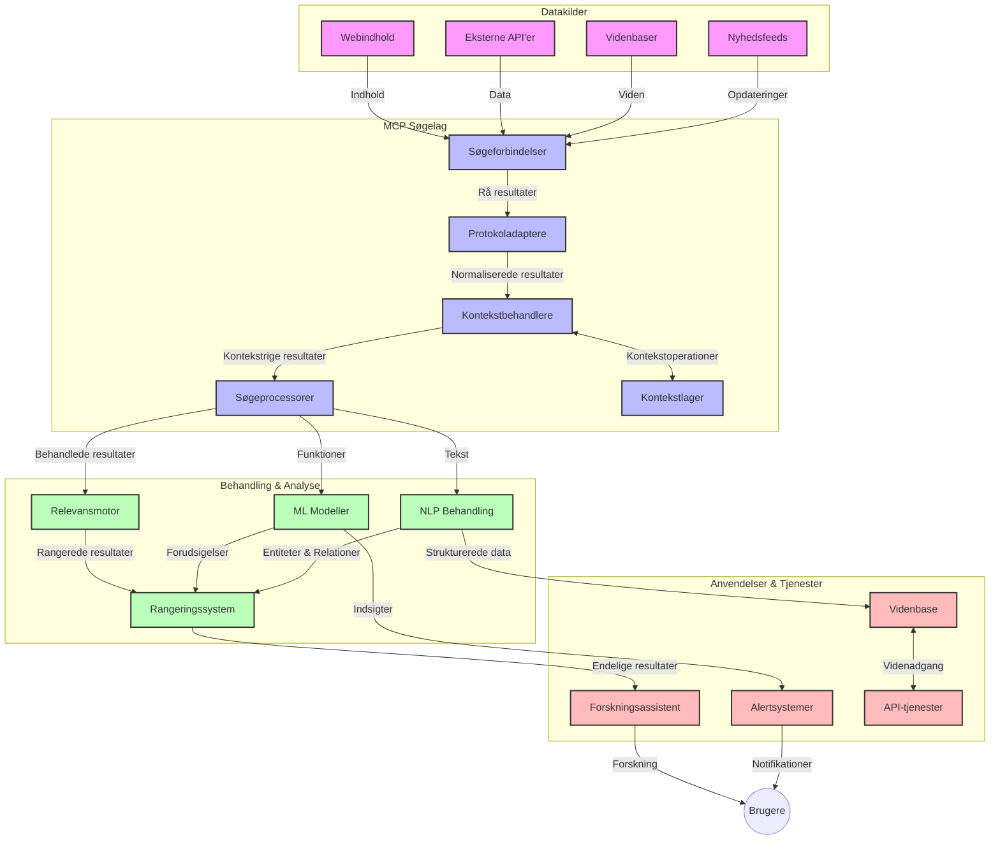
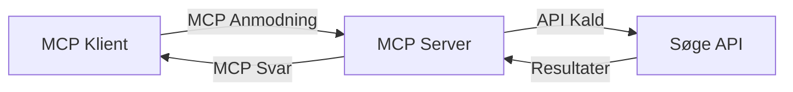
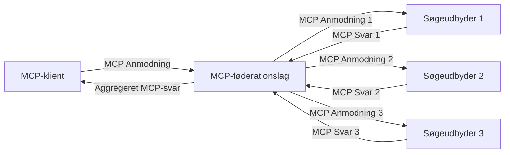
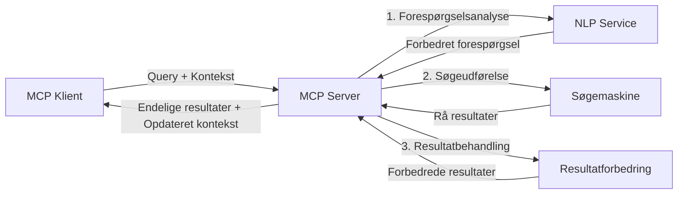

# Model Context Protocol for Real-Time Web Search

## Oversigt

Real-time websearch er blevet essentielt i dagens informationsdrevne miljø, hvor applikationer har behov for øjeblikkelig adgang til opdateret information på internettet for at levere relevante og rettidige svar. Model Context Protocol (MCP) repræsenterer et betydeligt fremskridt i optimeringen af disse real-time søgeprocesser, forbedrer søgeeffektiviteten, opretholder kontekstuel integritet og forbedrer den samlede systemydelse.

Denne modul undersøger, hvordan MCP transformerer real-time websearch ved at tilbyde en standardiseret tilgang til kontekststyring på tværs af AI-modeller, søgemaskiner og applikationer.

### Hvad du vil lære

I denne omfattende guide vil du opdage:

- Hvordan MCP skaber en sømløs bro mellem AI-modeller og real-time websearch-kapaciteter
- Arkitekturmodeller for implementering af effektive og skalerbare søgeløsninger med MCP
- Teknikker til at bevare søgekontekst på tværs af flere forespørgsler og interaktioner
- Praktiske kodeimplementeringer i Python og JavaScript for forskellige søgescenarier
- Metoder til at balancere relevans, aktualitet og ydeevne i MCP-drevne søgesystemer

## Introduktion til Real-Time Web Search

Real-time websearch er en teknologisk tilgang, der muliggør kontinuerlig forespørgsel, behandling og analyse af webbaseret information, efterhånden som den offentliggøres eller opdateres, hvilket giver systemer mulighed for at levere frisk og relevant information med minimal forsinkelse. I modsætning til traditionelle søgesystemer, der opererer på indekserede data, som kan være timer eller dage gamle, behandler real-time search live data fra nettet og leverer indsigt og information, der afspejler den aktuelle tilstand af onlineindhold.

### Kernebegreber for Real-Time Web Search:

- **Kontinuerlig forespørgselsbehandling**: Søgeforespørgsler behandles mod konstant opdaterende datakilder
- **Prioritering af aktualitet**: Systemer designes til at prioritere frisk information
- **Balance mellem relevans og aktualitet**: Opnå en balance mellem relevans og aktualitet
- **Skalerbar arkitektur**: Systemer skal kunne håndtere variabel belastning og datamængder
- **Kontekstuel forståelse**: Opretholdelse af brugerkontekst på tværs af søgeiterationer er afgørende for meningsfulde resultater
- **Dynamisk forespørgselsomformulering**: Adaptive ændringer af forespørgsler baseret på kontekst og tidligere resultater
- **Integration af flere kilder**: Kombinering af resultater fra flere søgeudbydere og webkilder
- **Semantisk forståelse**: Behandling af forespørgsler og indhold baseret på betydning fremfor blot nøgleord
- **Real-time rangering**: Kontinuerlig justering af resultatplaceringer, efterhånden som ny information bliver tilgængelig

### Model Context Protocol og Real-Time Web Search

Model Context Protocol (MCP) adresserer flere afgørende udfordringer i real-time websearch-miljøer:

1. **Bevarelse af søgekontekst**: MCP standardiserer, hvordan kontekst opretholdes på tværs af distribuerede søgekomponenter, hvilket sikrer, at AI-modeller og behandlingsnoder har adgang til relevant forespørgselshistorik og brugerpræferencer.

2. **Effektiv forespørgselsstyring**: Ved at tilbyde strukturerede mekanismer for konteksttransmission reducerer MCP overhead ved gentagen kontekst i hver søgeiteration.

3. **Interoperabilitet**: MCP skaber et fælles sprog for kontekstdeling mellem forskellige søgeteknologier og AI-modeller, hvilket muliggør mere fleksible og udvidelige arkitekturer.

4. **Search-optimeret kontekst**: MCP-implementeringer kan prioritere hvilke kontekstelementer, der er mest relevante for effektiv søgning, og optimere både ydeevne og præcision.

5. **Adaptiv søgebehandling**: Med korrekt kontekststyring gennem MCP kan søgesystemer dynamisk tilpasse behandlingen baseret på skiftende brugerbehov og informationslandskaber.

I moderne applikationer — fra nyhedsaggregatorer til forskningsassistenter — muliggør integrationen af MCP med websearch-teknologier mere intelligente, kontekstbevidste søgninger, der kan levere stadig mere relevante resultater, efterhånden som brugerinteraktionerne fortsætter.

## Læringsmål

Ved slutningen af denne lektion vil du kunne:

- Forstå grundprincipperne i real-time websearch og de udfordringer, som findes i moderne applikationer
- Forklare, hvordan Model Context Protocol (MCP) forbedrer real-time websearch-kapaciteter
- Implementere MCP-baserede søgeløsninger ved hjælp af populære frameworks og API’er
- Designe og implementere skalerbare søgearkitekturer med høj ydeevne ved hjælp af MCP
- Anvende MCP-konceptet til forskellige brugsscenarier, inklusive semantisk søgning, forskningsassistance og AI-udvidet browsing
- Evaluere nye tendenser og fremtidige innovationer inden for MCP-baserede søgeteknologier
- Udvikle kontekstbevidste søgesystemer, som lærer af brugerinteraktioner
- Integrere websearch-kapaciteter i AI-assistenter ved brug af standardiserede MCP-protokoller
- Skabe flertrins søgeprocesser, der løbende forbedrer resultater baseret på kontekst
- Optimere søgeperformance samtidig med at omfattende kontekstbevidsthed opretholdes

### Definition og Betydning

Real-time websearch involverer kontinuerlig forespørgsel, hentning og levering af webbaseret information med minimal forsinkelse. I modsætning til traditionelle søgemaskiner, der periodisk crawler og indekserer nettet, søger real-time search at frembringe information, så snart den bliver tilgængelig, hvilket muliggør øjeblikkelig adgang til det nyeste indhold.

Nøglekarakteristika for real-time websearch inkluderer:

- **Friskhed**: Prioritering af nyligt indhold og opdateringer
- **Kontinuerlig behandling**: Konstant overvågning for ny information
- **Forespørgselsjustering**: Forfining af søgeforespørgsler baseret på kontekst og feedback
- **Øjeblikkelig levering**: Levering af søgeresultater med minimal forsinkelse
- **Kontekstbevarelse**: Bygning videre på tidligere forespørgsler for forbedret relevans

### Udfordringer ved Traditionel Web Search

Traditionelle websearch-tilgange står over for flere begrænsninger, når de anvendes i real-time scenarier:

1. **Kontekstfragmentering**: Vanskeligheder med at bevare søgekontekst på tværs af flere forespørgsler
2. **Informationsfriskhed**: Udfordringer med at tilgå og prioritere den mest opdaterede information
3. **Integrationskompleksitet**: Problemer med interoperabilitet mellem søgesystemer og applikationer
4. **Latency-problemer**: Balance mellem omfattende søgning og svartidskrav
5. **Relevanstuning**: Sikring af nøjagtighed og relevans samtidig med prioritering af aktualitet

## Forstå Model Context Protocol (MCP) for Søgeanvendelser

### Hvad er MCP i søgekontekster?

Model Context Protocol (MCP) er en standardiseret kommunikationsprotokol designet til at facilitere effektiv interaktion mellem AI-modeller og applikationer. I konteksten af real-time websearch tilbyder MCP en ramme for:

- Bevarelse af søgekontekst gennem forespørgselssekvenser
- Standardisering af søgeforespørgsels- og resultatformater
- Optimering af transmissionen af søgeparametre og resultater
- Forbedring af model-til-søgemaskine kommunikation

### Kernekomponenter og Arkitektur

MCP-arkitekturen for real-time websearch består af flere nøglekomponenter:

1. **Query Context Handlers**: Administrerer og opretholder søgekontekst på tværs af flere forespørgsler
2. **Search Processors**: Behandler indkommende søgeanmodninger med kontekstbevidste teknikker
3. **Protocol Adapters**: Konverterer mellem forskellige søge-API’er samtidig med at kontekst bevares
4. **Context Store**: Effektivt lagrer og henter søgehistorik og præferencer
5. **Search Connectors**: Forbinder til forskellige søgemaskiner og web-API’er



### Hvordan MCP forbedrer real-time websearch

MCP løser traditionelle udfordringer ved websearch gennem:

- **Kontekstuel kontinuitet**: Opretholder relationer mellem forespørgsler gennem hele søgesessionen
- **Optimeret transmission**: Reducerer redundans i søgeparametre via intelligent kontekststyring
- **Standardiserede interfaces**: Tilbyder konsistente API’er til søgekomponenter
- **Reduceret latency**: Minimerer behandlingsomkostninger gennem effektiv kontekstbehandling
- **Forbedret relevans**: Øger søgerelevans ved at bevare brugerintention på tværs af flere forespørgsler

## Integration og Implementering

Real-time websearch-systemer kræver omhyggeligt arkitekturdesign og implementering for at opretholde både ydeevne og kontekstuel integritet. Model Context Protocol tilbyder en standardiseret tilgang til integration af AI-modeller og søgeteknologier, hvilket muliggør mere sofistikerede, kontekst-aware søgepipelines.

### Oversigt over MCP-integration i søgearkitekturer

Implementering af MCP i real-time websearch-miljøer involverer flere centrale overvejelser:

1. **Serialisering af søgekontekst**: MCP tilbyder effektive mekanismer til kodning af kontekstuel information i søgeanmodninger, hvilket sikrer, at vigtig kontekst følger med forespørgslen gennem hele behandlingspipelinjen. Dette inkluderer standardiserede serialiseringsformater optimeret til søgerelateret metadata.

2. **Stateful søgebehandling**: MCP muliggør mere intelligent stateful behandling ved at opretholde en konsistent kontekstrepræsentation på tværs af søgeiterationer. Dette er særligt værdifuldt i flertrins-søgepipelines, hvor kontekstforfining forbedrer resultater.

3. **Forespørgselsekspansion og forfining**: MCP-implementeringer i søgesystemer kan understøtte avanceret forespørgselsekspansion og -forfining baseret på akkumuleret kontekst, hvilket muliggør stadig mere relevante resultater, efterhånden som søgesessionen skrider frem.

4. **Resultatcache og prioritering**: Ved at standardisere kontekstbehandling hjælper MCP med at styre caching og prioritering af resultater, således at komponenter kan tilpasse sig den udviklende søgekontekst.

5. **Søgefederation og aggregation**: MCP muliggør mere sofistikeret federation af søgning på tværs af flere backends ved at tilbyde strukturerede repræsentationer af søgekontekst, hvilket gør det muligt at aggregerer resultater meningsfuldt fra forskellige kilder.

Implementeringen af MCP på tværs af forskellige søgeteknologier skaber en samlet tilgang til kontekststyring, reducerer behovet for specialudviklet integrationskode, samtidig med at systemets evne til at bevare meningsfuld kontekst, efterhånden som søgeforespørgsler udvikles, forbedres.

### MCP i forskellige websearch-implementeringer

Disse eksempler følger den aktuelle MCP-specifikation, som fokuserer på en JSON-RPC-baseret protokol med forskellige transportmekanismer. Koden demonstrerer, hvordan du kan implementere brugerdefinerede søgeintegrationer, samtidig med at du opretholder fuld kompatibilitet med MCP-protokollen.


<details>
<summary>Python-implementering med generisk søge-API</summary>

```python
import asyncio
import json
import aiohttp
from typing import Dict, Any, Optional, List
from contextlib import asynccontextmanager
from collections.abc import AsyncIterator

# Importer standard MCP-biblioteker
from mcp.client.session import ClientSession
from mcp.client.streamable_http import streamablehttp_client
from mcp.types import TextContent, CreateMessageRequestParams, CreateMessageResult
from mcp.server.fastmcp import FastMCP

# Opret en FastMCP-server til websøgning
search_server = FastMCP("WebSearch")

# Klasse til håndtering af websøgningsoperationer
class WebSearchHandler:
    def __init__(self, api_endpoint: str, api_key: str):
        self.api_endpoint = api_endpoint
        self.api_key = api_key
        self.session = None
        
    async def initialize(self):
        """Initialize the HTTP session"""
        self.session = aiohttp.ClientSession(
            headers={"Authorization": f"Bearer {self.api_key}"}
        )
    
    async def close(self):
        """Close the HTTP session"""
        if self.session:
            await self.session.close()
            
    async def perform_search(self, query: str, max_results: int = 5, 
                           include_domains: List[str] = None, 
                           exclude_domains: List[str] = None,
                           time_period: str = "any") -> Dict[str, Any]:
        """Perform web search using the search API"""
        # Konstruer søgeparametre
        search_params = {
            "q": query,
            "limit": max_results,
            "time": time_period
        }
        
        if include_domains:
            search_params["site"] = ",".join(include_domains)
            
        if exclude_domains:
            search_params["exclude_site"] = ",".join(exclude_domains)
        
        # Udfør søgeforespørgslen
        try:
            async with self.session.get(
                self.api_endpoint,
                params=search_params
            ) as response:
                if response.status != 200:
                    error_text = await response.text()
                    raise Exception(f"Search API error: {response.status} - {error_text}")
                
                search_data = await response.json()
                
                # Transformer API-specifik respons til et standardformat
                results = []
                for item in search_data.get("results", []):
                    results.append({
                        "title": item.get("title", ""),
                        "url": item.get("url", ""),
                        "snippet": item.get("snippet", ""),
                        "date": item.get("published_date", ""),
                        "source": item.get("source", "")
                    })
                
                return {
                    "query": query,
                    "totalResults": len(results),
                    "results": results
                }
        except Exception as e:
            print(f"Search API request error: {e}")
            raise

# Initialiser søgehåndtereren
search_handler = WebSearchHandler(
    api_endpoint="https://api.search-service.example/search",
    api_key="your-api-key-here"
)

# Opsæt livscyklus til at håndtere søgehåndtereren
@asyncio.asynccontextmanager
async def app_lifespan(server: FastMCP):
    """Manage application lifecycle"""
    await search_handler.initialize()
    try:
        yield {"search_handler": search_handler}
    finally:
        await search_handler.close()

# Indstil livscyklus for serveren
search_server = FastMCP("WebSearch", lifespan=app_lifespan)

# Registrer et websøgning værktøj
@search_server.tool()
async def web_search(query: str, max_results: int = 5, 
                   include_domains: List[str] = None,
                   exclude_domains: List[str] = None,
                   time_period: str = "any") -> Dict[str, Any]:
    """
    Search the web for information
    
    Args:
        query: The search query
        max_results: Maximum number of results to return (default: 5)
        include_domains: List of domains to include in search results
        exclude_domains: List of domains to exclude from search results
        time_period: Time period for results ("day", "week", "month", "any")
        
    Returns:
        Dictionary containing search results
    """
    ctx = search_server.get_context()
    search_handler = ctx.request_context.lifespan_context["search_handler"]
    
    results = await search_handler.perform_search(
        query=query,
        max_results=max_results,
        include_domains=include_domains,
        exclude_domains=exclude_domains,
        time_period=time_period
    )
    
    return results

# Eksempel på klientbrug
async def client_example():
    # Forbind til søgeserveren ved brug af Streamable HTTP transport
    async with streamablehttp_client("http://localhost:8000/mcp") as (read, write, _):
        async with ClientSession(read, write) as session:
            # Initialiser forbindelsen
            await session.initialize()
            
            # Kald web_search værktøjet
            search_results = await session.call_tool(
                "web_search", 
                {
                    "query": "latest developments in AI and Model Context Protocol",
                    "max_results": 5,
                    "time_period": "day",
                    "include_domains": ["github.com", "microsoft.com"]
                }
            )
            
            print(f"Search results: {search_results}")

# Serverkørselseksempel
if __name__ == "__main__":
    # Kør serveren med Streamable HTTP transport
    search_server.run(transport="streamable-http")
```
</details> 

<details>
<summary>JavaScript-implementering med browserbaseret søgning</summary>


```javascript
// MCP-serverimplementering til websøgning
import { McpServer, ResourceTemplate } from '@modelcontextprotocol/sdk/server/mcp.js';
import { StreamableHTTPServerTransport } from '@modelcontextprotocol/sdk/server/streamableHttp.js';
import { z } from 'zod';

// Opret en MCP-server til websøgning
const searchServer = new McpServer({
    name: "BrowserSearch",
    description: "A server that provides web search capabilities"
});

// Søgetjenesteklasse
class SearchService {
    constructor(searchApiUrl, apiKey) {
        this.searchApiUrl = searchApiUrl;
        this.apiKey = apiKey;
    }

    async performSearch(parameters) {
        const {
            query = '',
            maxResults = 5,
            includeDomains = [],
            excludeDomains = [],
            timePeriod = 'any'
        } = parameters;
        
        // Konstruer søge-URL med parametre
        const url = new URL(this.searchApiUrl);
        url.searchParams.append('q', query);
        url.searchParams.append('limit', maxResults);
        url.searchParams.append('time', timePeriod);
        
        if (includeDomains.length > 0) {
            url.searchParams.append('site', includeDomains.join(','));
        }
        
        if (excludeDomains.length > 0) {
            url.searchParams.append('exclude_site', excludeDomains.join(','));
        }
        
        try {
            const response = await fetch(url.toString(), {
                method: 'GET',
                headers: {
                    'Authorization': `Bearer ${this.apiKey}`,
                    'Content-Type': 'application/json'
                }
            });
            
            if (!response.ok) {
                const errorText = await response.text();
                throw new Error(`Search API error: ${response.status} - ${errorText}`);
            }
            
            const searchData = await response.json();
            
            // Transformer API-specifik respons til et standardformat
            const results = searchData.results?.map(item => ({
                title: item.title || '',
                url: item.url || '',
                snippet: item.snippet || '',
                date: item.published_date || '',
                source: item.source || ''
            })) || [];
            
            return {
                query,
                totalResults: results.length,
                results
            };
        } catch (error) {
            console.error('Search API request error:', error);
            throw error;
        }
    }
}

// Initialiser søgetjenesten
const searchService = new SearchService(
    'https://api.search-service.example/search',
    'your-api-key-here'
);

// Opsæt kontekstudbyderen til serveren
searchServer.setContextProvider(() => {
    return {
        searchService
    };
});

// Registrer websøgeværktøj
searchServer.tool({
    name: 'web_search',
    description: 'Search the web for information',
    parameters: {
        type: 'object',
        properties: {
            query: {
                type: 'string',
                description: 'The search query'
            },
            maxResults: {
                type: 'integer',
                description: 'Maximum number of results to return',
                default: 5
            },
            includeDomains: {
                type: 'array',
                items: { type: 'string' },
                description: 'List of domains to include in search results'
            },
            excludeDomains: {
                type: 'array',
                items: { type: 'string' },
                description: 'List of domains to exclude from search results'
            },
            timePeriod: {
                type: 'string',
                description: 'Time period for results',
                enum: ['day', 'week', 'month', 'any'],
                default: 'any'
            }
        },
        required: ['query']
    },
    handler: async (params, context) => {
        const { searchService } = context;
        return await searchService.performSearch(params);
    }
});

// Eksempel på klientkode til at oprette forbindelse til søgeserver
import { Client } from '@modelcontextprotocol/sdk/client/index.js';
import { StreamableHTTPClientTransport } from '@modelcontextprotocol/sdk/client/streamableHttp.js';

async function connectToSearchServer() {
    // Opret forbindelse til søgeserver
    const transport = new StreamableHTTPClientTransport(
        new URL('http://localhost:8000/mcp')
    );
    
    const client = new Client({
        name: 'search-client',
        version: '1.0.0'
    });
    
    await client.connect(transport);
    
    // Udfør søgeværktøjet
    const searchResults = await client.callTool({
        name: 'web_search',
        arguments: {
            query: 'Model Context Protocol implementation examples',
            maxResults: 10,
            timePeriod: 'week',
            includeDomains: ['github.com', 'docs.microsoft.com']
        }
    });
    
    console.log('Search results:', searchResults);
    
    // Ryd op
    await client.disconnect();
}

// Start serveren
const transport = new StreamableHTTPServerTransport();
await searchServer.connect(transport);
console.log('Search server running at http://localhost:8000/mcp');

// I en separat proces eller efter serveren er startet
// connectToSearchServer().catch(console.error);
```
</details> 


## Ansvarsfraskrivelse ved kodeeksempler

> **Vigtig note**: Kodeeksemplerne nedenfor demonstrerer integrationen af Model Context Protocol (MCP) med websearch-funktionalitet. Selvom de følger mønstre og strukturer fra de officielle MCP SDK’er, er de forenklet til undervisningsbrug.
> 
> Disse eksempler viser:
> 
> 1. **Python-implementering**: En FastMCP-serverimplementering, som tilbyder et websearch-værktøj og forbinder til en ekstern søge-API. Dette eksempel viser korrekt håndtering af levetid, kontekstbehandling og værktøjsimplementering efter mønstrene i [den officielle MCP Python SDK](https://github.com/modelcontextprotocol/python-sdk). Serveren anvender den anbefalede Streamable HTTP-transport, som har afløst den ældre SSE-transport til produktionsbrug.
> 
> 2. **JavaScript-implementering**: En TypeScript/JavaScript-implementering ved brug af FastMCP-mønsteret fra [den officielle MCP TypeScript SDK](https://github.com/modelcontextprotocol/typescript-sdk) til at skabe en søgeserver med korrekte værktøjsdefinitioner og klientforbindelser. Den følger de nyeste anbefalede mønstre for sessionsstyring og kontekstbevarelse.
> 
> Disse eksempler vil kræve yderligere fejlhåndtering, autentificering og specifik API-integrationskode til produktionsbrug. De viste søge-API-endpoints (`https://api.search-service.example/search`) er pladsholdere og skal erstattes med egentlige søgeservice-endpoints.
> 
> For komplette implementeringsdetaljer og de mest opdaterede tilgange, se venligst [den officielle MCP-specifikation](https://spec.modelcontextprotocol.io/) og SDK-dokumentation.

## Kernebegreber

### Model Context Protocol (MCP) Framework

I sin grundform tilbyder Model Context Protocol en standardiseret måde for AI-modeller, applikationer og services til at udveksle kontekst. I real-time websearch er denne ramme essentiel for at skabe sammenhængende, flertrins søgeoplevelser. Nøglekomponenter inkluderer:

1. **Client-Server Arkitektur**: MCP etablerer en klar adskillelse mellem søgeklienter (anmodere) og søgeservere (udbydere), hvilket muliggør fleksible implementeringsmodeller.

2. **JSON-RPC Kommunikation**: Protokollen bruger JSON-RPC til beskedudveksling, hvilket gør den kompatibel med webteknologier og nem at implementere på tværs af platforme.

3. **Kontekststyring**: MCP definerer strukturerede metoder til at opretholde, opdatere og udnytte søgekontekst gennem flere interaktioner.

4. **Værktøjsdefinitioner**: Søgefunktioner eksponeres som standardiserede værktøjer med veldokumenterede parametre og returværdier.

5. **Streaming-understøttelse**: Protokollen understøtter streaming af resultater, hvilket er essentielt for real-time search, hvor resultater kan ankomme løbende.

### Websearch-Integrationsmønstre

Ved integration af MCP med websearch dukker flere mønstre op:

#### 1. Direkte integration med søgeudbyder



I dette mønster interfacer MCP-serveren direkte med en eller flere søge-API’er, oversætter MCP-anmodninger til API-specifikke kald og formaterer resultaterne som MCP-svar.

#### 2. Federeret søgning med kontekstbevarelse



Dette mønster distribuerer søgeforespørgsler til flere MCP-kompatible søgeudbydere, som hver især kan være specialiserede i forskellige typer indhold eller søgemuligheder, samtidig med at der opretholdes en samlet kontekst.

#### 3. Kontekstforstærket søgekæde



I dette mønster opdeles søgeprocessen i flere trin, hvor kontekst beriges i hvert trin, hvilket resulterer i gradvist mere relevante resultater.

### Søgekontekst-komponenter

I MCP-baseret websearch inkluderer kontekst typisk:

- **Forespørgselslog**: Tidligere søgeforespørgsler i sessionen
- **Brugerpræferencer**: Sprog, region, sikker søgning-indstillinger
- **Interaktionshistorik**: Klik på resultater, tidsforbrug på resultater
- **Søgeparametre**: Filtre, sorteringsordrer og andre søgemodifikatorer
- **Domæneviden**: Emnespecifik kontekst relevant for søgningen
- **Tidsmæssig kontekst**: Relevansfaktorer baseret på tid
- **Kildepræferencer**: Tillid til eller foretrukne informationskilder

## Anvendelsestilfælde og Applikationer

### Forskning og Informationsindsamling

MCP forbedrer forskningsarbejdsgange ved at:

- Bevare forskningskontekst på tværs af søgesessioner
- Muliggøre mere sofistikerede og kontekstafhængige forespørgsler
- Understøtte multi-kilde søgefederation
- Facilitere vidensudvinding fra søgeresultater

### Real-Time Nyheds- og Trendovervågning

MCP-drevet søgning tilbyder fordele til nyhedsovervågning:

- Næsten real-time opdagelse af nye nyhedshistorier
- Kontekstuel filtrering af relevant information
- Emne- og entitetssporing på tværs af flere kilder
- Personlige nyhedsalarmer baseret på brugerkontekst

### AI-Forstærket Browsing og Forskning

MCP skaber nye muligheder for AI-forstærket browsing:

- Kontekstuelle søgeforslag baseret på aktuel browseraktivitet
- Sømløs integration af websearch med LLM-drevne assistenter
- Flertrins søgeforfining med bevaret kontekst
- Forbedret faktatjek og informationsverifikation

## Fremtidige Tendenser og Innovationer

### Udviklingen af MCP i Web Search

Med blikket rettet fremad forventer vi, at MCP udvikler sig til at adressere:
- **Multimodal søgning**: Integration af tekst-, billede-, lyd- og videosøgning med bevaret kontekst  
- **Decentraliseret søgning**: Understøttelse af distribuerede og fødererede søgeøkosystemer  
- **Søgeprivatliv**: Kontekstbevidste privatlivsbeskyttende søgemekanismer  
- **Forespørgselsforståelse**: Dybt semantisk parsing af naturlige sprog-søgninger  

### Potentielle fremskridt inden for teknologi

Nye teknologier, der vil forme fremtiden for MCP-søgning:

1. **Neurale søgearkitekturer**: Embeddingsbaserede søgesystemer optimeret til MCP  
2. **Personliggjort søgekontekst**: Læring af individuelle bruger søgemønstre over tid  
3. **Integration af vidensgrafer**: Kontekstuel søgning forbedret af domænespecifikke vidensgrafer  
4. **Tvær-modal kontekst**: Bevarelse af kontekst på tværs af forskellige søgemodaliteter  

## Praktiske øvelser

### Øvelse 1: Opsætning af en grundlæggende MCP-søgepipeline

I denne øvelse lærer du at:  
- Konfigurere et grundlæggende MCP-søgemiljø  
- Implementere kontekst-håndterere til websøgning  
- Teste og validere bevarelse af kontekst på tværs af søgeiterationer  

### Øvelse 2: Byg en forskningsassistent med MCP-søgning

Skab en komplet applikation, der:  
- Behandler forskningsspørgsmål i naturligt sprog  
- Udfører kontekstbevidst websøgning  
- Syntetiserer information fra flere kilder  
- Præsenterer velorganiserede forskningsresultater  

### Øvelse 3: Implementering af multi-kilde søgeføderation med MCP

Avanceret øvelse der dækker:  
- Kontextbevidst forespørgselsafsendelse til flere søgemaskiner  
- Resultatrangering og aggregering  
- Kontekstuel duplikatfjernelse af søgeresultater  
- Håndtering af kilde-specifik metadata  

## Yderligere ressourcer

- [Model Context Protocol Specification](https://spec.modelcontextprotocol.io/) - Officiel MCP-specifikation og detaljeret protokoldokumentation  
- [Model Context Protocol Documentation](https://modelcontextprotocol.io/) - Detaljerede vejledninger og implementeringsguider  
- [MCP Python SDK](https://github.com/modelcontextprotocol/python-sdk) - Officiel Python-implementering af MCP-protokollen  
- [MCP TypeScript SDK](https://github.com/modelcontextprotocol/typescript-sdk) - Officiel TypeScript-implementering af MCP-protokollen  
- [MCP Reference Servers](https://github.com/modelcontextprotocol/servers) - Referenceimplementeringer af MCP-servere  
- [Bing Web Search API Documentation](https://learn.microsoft.com/en-us/bing/search-apis/bing-web-search/overview) - Microsofts websøge-API  
- [Google Custom Search JSON API](https://developers.google.com/custom-search/v1/overview) - Googles programmerbare søgemaskine  
- [SerpAPI Documentation](https://serpapi.com/search-api) - API til søgemaskineresultater  
- [Meilisearch Documentation](https://www.meilisearch.com/docs) - Open-source søgemaskine  
- [Elasticsearch Documentation](https://www.elastic.co/guide/index.html) - Distribueret søge- og analysemotor  
- [LangChain Documentation](https://python.langchain.com/docs/get_started/introduction) - Byg applikationer med LLM'er  

## Læringsmål

Ved at gennemføre dette modul vil du kunne:  

- Forstå grundprincipperne for realtids websøgning og dens udfordringer  
- Forklare, hvordan Model Context Protocol (MCP) forbedrer realtids websøgningsmuligheder  
- Implementere MCP-baserede søgeløsninger med populære frameworks og API'er  
- Designe og implementere skalerbare, højtydende søgearkitekturer med MCP  
- Anvende MCP-koncepter til forskellige brugsscenarier, herunder semantisk søgning, forskningsassistance og AI-forstærket browsing  
- Evaluere kommende trends og fremtidige innovationer inden for MCP-baserede søgeteknologier  

### Overvejelser vedrørende tillid og sikkerhed

Når du implementerer MCP-baserede websøgeløsninger, skal du huske disse vigtige principper fra MCP-specifikationen:

1. **Brugersamtykke og kontrol**: Brugere skal eksplicit give samtykke til og forstå alle dataadgang og operationer. Dette er særligt vigtigt for websøgningsimplementeringer, der kan tilgå eksterne datakilder.

2. **Dataprivatliv**: Sørg for passende håndtering af søgeforespørgsler og resultater, især når de kan indeholde følsomme oplysninger. Implementer passende adgangskontroller for at beskytte brugerdata.

3. **Sikkerhed for værktøjer**: Implementer korrekt autorisation og validering for søgeværktøjer, da de udgør potentielle sikkerhedsrisici via vilkårlig kodeeksekvering. Beskrivelser af værktøjers adfærd skal betragtes som utroværdige, medmindre de stammer fra en betroet server.

4. **Klar dokumentation**: Giv klar dokumentation om kapabiliteter, begrænsninger og sikkerhedsovervejelser ved din MCP-baserede søgeimplementering i overensstemmelse med MCP-specifikationens implementeringsvejledninger.

5. **Robuste samtykkeforløb**: Byg robuste samtykke- og autorisationsforløb, der tydeligt forklarer, hvad hvert værktøj gør, før det autoriseres, især for værktøjer, der interagerer med eksterne webressourcer.

For fuldstændige oplysninger om MCP-sikkerhed og tillidsovervejelser henvises til [den officielle dokumentation](https://modelcontextprotocol.io/specification/2025-11-25/basic/security_best_practices).  

## Hvad er det næste

- [5.12 Entra ID Authentication for Model Context Protocol Servers](../mcp-security-entra/README.md)

---

<!-- CO-OP TRANSLATOR DISCLAIMER START -->
**Ansvarsfraskrivelse**:
Dette dokument er blevet oversat ved hjælp af AI-oversættelsestjenesten [Co-op Translator](https://github.com/Azure/co-op-translator). Selvom vi bestræber os på nøjagtighed, skal du være opmærksom på, at automatiserede oversættelser kan indeholde fejl eller unøjagtigheder. Det originale dokument på dets oprindelige sprog bør betragtes som den autoritative kilde. For kritisk information anbefales professionel menneskelig oversættelse. Vi påtager os intet ansvar for misforståelser eller fejltolkninger, der opstår som følge af brugen af denne oversættelse.
<!-- CO-OP TRANSLATOR DISCLAIMER END -->