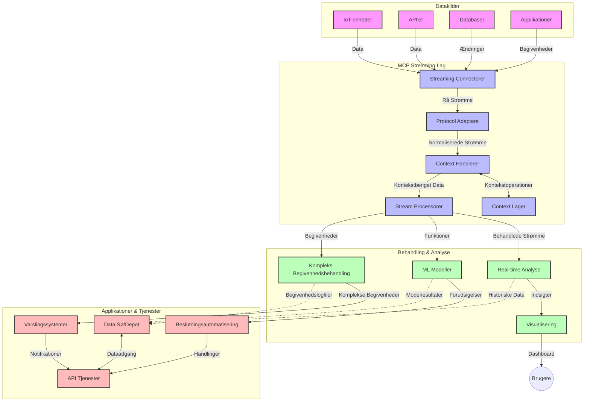

# Model Context Protocol for Real-Time Data Streaming

## Oversigt

Realtime data streaming er blevet essentielt i dagens data-drevne verden, hvor virksomheder og applikationer kræver øjeblikkelig adgang til information for at træffe rettidige beslutninger. Model Context Protocol (MCP) repræsenterer et betydeligt fremskridt i optimering af disse realtime streaming processer, forbedrer datahåndteringseffektivitet, opretholder kontekstuel integritet og øger den overordnede systemydelse.

Dette modul undersøger, hvordan MCP forvandler realtime data streaming ved at tilbyde en standardiseret tilgang til kontekststyring på tværs af AI-modeller, streaming-platforme og applikationer.

## Introduktion til Realtime Data Streaming

Realtime data streaming er et teknologisk paradigme, der muliggør kontinuerlig overførsel, behandling og analyse af data, mens det genereres, hvilket tillader systemer at reagere øjeblikkeligt på ny information. I modsætning til traditionel batchbehandling, der opererer på statiske datasæt, behandler streaming data i bevægelse og leverer indsigter og handlinger med minimal forsinkelse.

### Kernekoncepter for Realtime Data Streaming:

- **Kontinuerlig Dataflow**: Data behandles som en kontinuerlig, uendelig strøm af hændelser eller poster.
- **Lav Latens Behandling**: Systemer er designet til at minimere tiden mellem datagenerering og behandling.
- **Skalerbarhed**: Streaming arkitekturer skal kunne håndtere variable datamængder og hastigheder.
- **Fejltolerance**: Systemer skal være robuste over for fejl for at sikre uafbrudt dataflow.
- **Stateful Behandling**: Opretholdelse af kontekst på tværs af hændelser er afgørende for meningsfuld analyse.

### Model Context Protocol og Realtime Streaming

Model Context Protocol (MCP) adresserer flere kritiske udfordringer i realtime streaming miljøer:

1. **Kontekstuel Kontinuitet**: MCP standardiserer, hvordan kontekst opretholdes på tværs af distribuerede streaming-komponenter, og sikrer, at AI-modeller og behandlingsnoder har adgang til relevant historisk og miljømæssig kontekst.

2. **Effektiv State Management**: Ved at tilbyde strukturerede mekanismer til transmission af kontekst reducerer MCP overhead for state management i streaming pipelines.

3. **Interoperabilitet**: MCP skaber et fælles sprog for kontekstdeling mellem forskellige streaming-teknologier og AI-modeller, hvilket muliggør mere fleksible og udvidelige arkitekturer.

4. **Streaming-optimeret Kontekst**: MCP-implementeringer kan prioritere hvilke kontekst-elementer, der er mest relevante for realtime beslutningstagning, optimeret for både ydeevne og nøjagtighed.

5. **Adaptiv Behandling**: Med korrekt kontekststyring gennem MCP kan streaming-systemer dynamisk justere behandling baseret på udviklende betingelser og mønstre i data.

I moderne applikationer, fra IoT sensorsystemer til finansielle handelsplatforme, muliggør integrationen af MCP med streaming-teknologier mere intelligent, kontekstbevidst behandling, der kan reagere passende på komplekse og dynamiske situationer i realtime.

## Læringsmål

Ved afslutningen af denne lektion vil du kunne:

- Forstå grundprincipperne i realtime data streaming og de tilhørende udfordringer
- Forklare, hvordan Model Context Protocol (MCP) forbedrer realtime data streaming
- Implementere MCP-baserede streamingløsninger med populære frameworks som Kafka og Pulsar
- Designe og deployere fejltolerante, højtydende streamingarkitekturer med MCP
- Anvende MCP-konceptet til IoT, finansiel handel og AI-drevet analysebrug
- Vurdere kommende trends og fremtidige innovationer i MCP-baserede streamingteknologier


### Definition og Betydning

Realtime data streaming involverer kontinuerlig generering, behandling og levering af data med minimal forsinkelse. I modsætning til batchbehandling, hvor data indsamles og behandles i grupper, behandles streamingdata inkrementelt efterhånden som den ankommer, hvilket muliggør øjeblikkelige indsigter og handlinger.

Vigtige karakteristika ved realtime data streaming inkluderer:

- **Lav Latens**: Behandling og analyse af data inden for millisekunder til sekunder
- **Kontinuerligt Flow**: Uafbrudte datastreams fra forskellige kilder
- **Øjeblikkelig Behandling**: Analyse af data efterhånden som den ankommer fremfor i batches
- **Event-drevet Arkitektur**: Reagerer på hændelser, når de opstår

### Udfordringer i Traditionel Data Streaming

Traditionelle tilgange til data streaming har flere begrænsninger:

1. **Konteksttab**: Vanskeligheder med at bevare kontekst på tværs af distribuerede systemer
2. **Skalerbarhedsproblemer**: Udfordringer ved at skalere til at håndtere høj-volumen og høj-hastighed data
3. **Integrationskompleksitet**: Problemer med interoperabilitet mellem forskellige systemer
4. **Latensstyring**: Balancering mellem gennemløbshastighed og behandlingstid
5. **Datakonsistens**: Sikring af datanøjagtighed og fuldstændighed på tværs af strømmen

## Forståelse af Model Context Protocol (MCP)

### Hvad er MCP?

Model Context Protocol (MCP) er en standardiseret kommunikationsprotokol designet til at facilitere effektiv interaktion mellem AI-modeller og applikationer. I konteksten af realtime data streaming tilbyder MCP en ramme for:

- At bevare kontekst gennem hele datapipelinen
- Standardisering af dataudvekslingsformater
- Optimering af transmissionen af store datasæt
- Forbedring af model-til-model og model-til-applikation kommunikation

### Kernekomponenter og Arkitektur

MCP-arkitektur for realtime streaming består af flere nøglekomponenter:

1. **Konteksthåndterere**: Administrerer og opretholder kontekstuel information gennem hele streaming-pipelinen
2. **Stream-processorer**: Behandler indkommende datastreams ved hjælp af kontekstbevidste teknikker
3. **Protokol-adaptere**: Konverterer mellem forskellige streamingprotokoller samtidig med kontekstopretholdelse
4. **Kontekstlager**: Effektiv lagring og hentning af kontekstuel information
5. **Streamingforbindelser**: Forbinder til forskellige streamingplatforme (Kafka, Pulsar, Kinesis osv.)



### Hvordan MCP Forbedrer Realtime Datahåndtering

MCP adresserer traditionelle streamingudfordringer gennem:

- **Kontekstuel Integritet**: Opretholder relationer mellem datapunkter gennem hele pipelinen
- **Optimeret Transmission**: Reducerer redundans i dataudveksling via intelligent kontekststyring
- **Standardiserede Interfaces**: Tilbyder konsistente API’er til streaming-komponenter
- **Reduceret Latens**: Minimerer behandlingsomkostninger gennem effektiv kontekstbehandling
- **Forbedret Skalerbarhed**: Understøtter horisontal skalering samtidig med kontekstopretholdelse

## Integration og Implementering

Realtime data streaming-systemer kræver omhyggeligt arkitektonisk design og implementering for at opretholde både ydeevne og kontekstuel integritet. Model Context Protocol tilbyder en standardiseret tilgang til at integrere AI-modeller og streaming-teknologier, der muliggør mere sofistikerede, kontekstbevidste behandlingspipelines.

### Oversigt over MCP Integration i Streamingarkitekturer

Implementering af MCP i realtime streaming miljøer involverer flere nøgleovervejelser:

1. **Kontekstserialisering og Transport**: MCP tilbyder effektive mekanismer til kodning af kontekstuel information inden for streaming datapakker og sikrer, at væsentlig kontekst følger data gennem hele behandlingspipelinjen. Dette inkluderer standardiserede serialiseringsformater optimeret til streamingtransport.

2. **Stateful Stream Processing**: MCP muliggør mere intelligent stateful behandling ved at opretholde konsistent kontekstrepræsentation på tværs af behandlingsnoder. Dette er særligt værdifuldt i distribuerede streamingarkitekturer, hvor state management traditionelt er udfordrende.

3. **Event-Tid vs. Behandlingstid**: MCP-implementeringer i streaming-systemer skal adressere den almindelige udfordring med at skelne mellem hvornår hændelser opstod og hvornår de behandles. Protokollen kan inkorporere temporal kontekst, der bevarer event-tidssemantik.

4. **Backpressure Management**: Ved standardisering af kontekstbehandling hjælper MCP med at håndtere backpressure i streaming-systemer, så komponenter kan kommunikere deres behandlingsevne og justere flowet hensigtsmæssigt.

5. **Kontekstvinduer og Aggregation**: MCP muliggør mere sofistikerede vinduesoperationer ved at tilbyde strukturerede repræsentationer af temporære og relationelle kontekster, hvilket muligør mere meningsfulde aggregationer på tværs af hændelsesstrømme.

6. **Nøjagtig-Én-Gang Behandling**: I streaming-systemer, der kræver nøjagtig-én-gang semantik, kan MCP inkorporere behandlingsmetadata, som hjælper med at spore og verificere behandlingsstatus på tværs af distribuerede komponenter.

Implementeringen af MCP på tværs af forskellige streamingteknologier skaber en samlet tilgang til kontekststyring, der reducerer behovet for specialtilpasset integrationskode og samtidig forbedrer systemets evne til at bevare meningsfuld kontekst, mens data strømmer gennem pipelinen.

### MCP i Forskellige Data Streaming Frameworks

Disse eksempler følger den aktuelle MCP-specifikation, som fokuserer på en JSON-RPC baseret protokol med særskilte transportmekanismer. Koden demonstrerer, hvordan man kan implementere specialiserede transports, der integrerer streamingplatforme som Kafka og Pulsar, samtidig med at fuld kompatibilitet med MCP-protokollen opretholdes.

Eksemplerne er designet til at vise, hvordan streamingplatforme kan integreres med MCP for at levere realtime databehandling samtidig med, at den kontekstuelle bevidsthed, der er central for MCP, bevares. Denne tilgang sikrer, at kodeeksemplerne nøjagtigt afspejler den aktuelle status for MCP-specifikationen pr. juni 2025.

MCP kan integreres med populære streaming-frameworks, herunder:

#### Apache Kafka Integration

```python
import asyncio
import json
from typing import Dict, Any, Optional
from confluent_kafka import Consumer, Producer, KafkaError
from mcp.client import Client, ClientCapabilities
from mcp.core.message import JsonRpcMessage
from mcp.core.transports import Transport

# Tilpasset transportklasse til at forbinde MCP med Kafka
class KafkaMCPTransport(Transport):
    def __init__(self, bootstrap_servers: str, input_topic: str, output_topic: str):
        self.bootstrap_servers = bootstrap_servers
        self.input_topic = input_topic
        self.output_topic = output_topic
        self.producer = Producer({'bootstrap.servers': bootstrap_servers})
        self.consumer = Consumer({
            'bootstrap.servers': bootstrap_servers,
            'group.id': 'mcp-client-group',
            'auto.offset.reset': 'earliest'
        })
        self.message_queue = asyncio.Queue()
        self.running = False
        self.consumer_task = None
        
    async def connect(self):
        """Connect to Kafka and start consuming messages"""
        self.consumer.subscribe([self.input_topic])
        self.running = True
        self.consumer_task = asyncio.create_task(self._consume_messages())
        return self
        
    async def _consume_messages(self):
        """Background task to consume messages from Kafka and queue them for processing"""
        while self.running:
            try:
                msg = self.consumer.poll(1.0)
                if msg is None:
                    await asyncio.sleep(0.1)
                    continue
                
                if msg.error():
                    if msg.error().code() == KafkaError._PARTITION_EOF:
                        continue
                    print(f"Consumer error: {msg.error()}")
                    continue
                
                # Analyser meddelelsesværdien som JSON-RPC
                try:
                    message_str = msg.value().decode('utf-8')
                    message_data = json.loads(message_str)
                    mcp_message = JsonRpcMessage.from_dict(message_data)
                    await self.message_queue.put(mcp_message)
                except Exception as e:
                    print(f"Error parsing message: {e}")
            except Exception as e:
                print(f"Error in consumer loop: {e}")
                await asyncio.sleep(1)
    
    async def read(self) -> Optional[JsonRpcMessage]:
        """Read the next message from the queue"""
        try:
            message = await self.message_queue.get()
            return message
        except Exception as e:
            print(f"Error reading message: {e}")
            return None
    
    async def write(self, message: JsonRpcMessage) -> None:
        """Write a message to the Kafka output topic"""
        try:
            message_json = json.dumps(message.to_dict())
            self.producer.produce(
                self.output_topic,
                message_json.encode('utf-8'),
                callback=self._delivery_report
            )
            self.producer.poll(0)  # Udløs callbacks
        except Exception as e:
            print(f"Error writing message: {e}")
    
    def _delivery_report(self, err, msg):
        """Kafka producer delivery callback"""
        if err is not None:
            print(f'Message delivery failed: {err}')
        else:
            print(f'Message delivered to {msg.topic()} [{msg.partition()}]')
    
    async def close(self) -> None:
        """Close the transport"""
        self.running = False
        if self.consumer_task:
            self.consumer_task.cancel()
            try:
                await self.consumer_task
            except asyncio.CancelledError:
                pass
        self.consumer.close()
        self.producer.flush()

# Eksempel på brug af Kafka MCP-transport
async def kafka_mcp_example():
    # Opret MCP-klient med Kafka-transport
    client = Client(
        {"name": "kafka-mcp-client", "version": "1.0.0"},
        ClientCapabilities({})
    )
    
    # Opret og forbind Kafka-transporten
    transport = KafkaMCPTransport(
        bootstrap_servers="localhost:9092",
        input_topic="mcp-responses",
        output_topic="mcp-requests"
    )
    
    await client.connect(transport)
    
    try:
        # Initialiser MCP-sessionen
        await client.initialize()
        
        # Eksempel på at udføre et værktøj via MCP
        response = await client.execute_tool(
            "process_data",
            {
                "data": "sample data",
                "metadata": {
                    "source": "sensor-1",
                    "timestamp": "2025-06-12T10:30:00Z"
                }
            }
        )
        
        print(f"Tool execution response: {response}")
        
        # Rens nedlukning
        await client.shutdown()
    finally:
        await transport.close()

# Kør eksemplet
if __name__ == "__main__":
    asyncio.run(kafka_mcp_example())
```

#### Apache Pulsar Implementering

```python
import asyncio
import json
import pulsar
from typing import Dict, Any, Optional
from mcp.core.message import JsonRpcMessage
from mcp.core.transports import Transport
from mcp.server import Server, ServerOptions
from mcp.server.tools import Tool, ToolExecutionContext, ToolMetadata

# Opret en brugerdefineret MCP transport, der bruger Pulsar
class PulsarMCPTransport(Transport):
    def __init__(self, service_url: str, request_topic: str, response_topic: str):
        self.service_url = service_url
        self.request_topic = request_topic
        self.response_topic = response_topic
        self.client = pulsar.Client(service_url)
        self.producer = self.client.create_producer(response_topic)
        self.consumer = self.client.subscribe(
            request_topic,
            "mcp-server-subscription",
            consumer_type=pulsar.ConsumerType.Shared
        )
        self.message_queue = asyncio.Queue()
        self.running = False
        self.consumer_task = None
    
    async def connect(self):
        """Connect to Pulsar and start consuming messages"""
        self.running = True
        self.consumer_task = asyncio.create_task(self._consume_messages())
        return self
    
    async def _consume_messages(self):
        """Background task to consume messages from Pulsar and queue them for processing"""
        while self.running:
            try:
                # Ikke-blokerende modtagelse med timeout
                msg = self.consumer.receive(timeout_millis=500)
                
                # Behandl beskeden
                try:
                    message_str = msg.data().decode('utf-8')
                    message_data = json.loads(message_str)
                    mcp_message = JsonRpcMessage.from_dict(message_data)
                    await self.message_queue.put(mcp_message)
                    
                    # Bekræft beskeden
                    self.consumer.acknowledge(msg)
                except Exception as e:
                    print(f"Error processing message: {e}")
                    # Negativ bekræftelse, hvis der var en fejl
                    self.consumer.negative_acknowledge(msg)
            except Exception as e:
                # Håndter timeout eller andre undtagelser
                await asyncio.sleep(0.1)
    
    async def read(self) -> Optional[JsonRpcMessage]:
        """Read the next message from the queue"""
        try:
            message = await self.message_queue.get()
            return message
        except Exception as e:
            print(f"Error reading message: {e}")
            return None
    
    async def write(self, message: JsonRpcMessage) -> None:
        """Write a message to the Pulsar output topic"""
        try:
            message_json = json.dumps(message.to_dict())
            self.producer.send(message_json.encode('utf-8'))
        except Exception as e:
            print(f"Error writing message: {e}")
    
    async def close(self) -> None:
        """Close the transport"""
        self.running = False
        if self.consumer_task:
            self.consumer_task.cancel()
            try:
                await self.consumer_task
            except asyncio.CancelledError:
                pass
        self.consumer.close()
        self.producer.close()
        self.client.close()

# Definer et eksempel på et MCP værktøj, der behandler streamende data
@Tool(
    name="process_streaming_data",
    description="Process streaming data with context preservation",
    metadata=ToolMetadata(
        required_capabilities=["streaming"]
    )
)
async def process_streaming_data(
    ctx: ToolExecutionContext,
    data: str,
    source: str,
    priority: str = "medium"
) -> Dict[str, Any]:
    """
    Process streaming data while preserving context
    
    Args:
        ctx: Tool execution context
        data: The data to process
        source: The source of the data
        priority: Priority level (low, medium, high)
        
    Returns:
        Dict containing processed results and context information
    """
    # Eksempel på behandling, der udnytter MCP kontekst
    print(f"Processing data from {source} with priority {priority}")
    
    # Få adgang til samtalekontekst fra MCP
    conversation_id = ctx.conversation_id if hasattr(ctx, 'conversation_id') else "unknown"
    
    # Returner resultater med forbedret kontekst
    return {
        "processed_data": f"Processed: {data}",
        "context": {
            "conversation_id": conversation_id,
            "source": source,
            "priority": priority,
            "processing_timestamp": ctx.get_current_time_iso()
        }
    }

# Eksempel på MCP serverimplementering med Pulsar transport
async def run_mcp_server_with_pulsar():
    # Opret MCP server
    server = Server(
        {"name": "pulsar-mcp-server", "version": "1.0.0"},
        ServerOptions(
            capabilities={"streaming": True}
        )
    )
    
    # Registrer vores værktøj
    server.register_tool(process_streaming_data)
    
    # Opret og forbind Pulsar transport
    transport = PulsarMCPTransport(
        service_url="pulsar://localhost:6650",
        request_topic="mcp-requests",
        response_topic="mcp-responses"
    )
    
    try:
        # Start serveren med Pulsar transport
        await server.run(transport)
    finally:
        await transport.close()

# Kør serveren
if __name__ == "__main__":
    asyncio.run(run_mcp_server_with_pulsar())
```

### Bedste praksis for implementering

Når du implementerer MCP for realtime streaming:

1. **Design for Fejltolerance**:
   - Implementer korrekt fejlhåndtering
   - Brug dead-letter queues til fejlede beskeder
   - Design idempotente processorer

2. **Optimer for Ydeevne**:
   - Konfigurer passende bufferstørrelser
   - Brug batch-behandling hvor relevant
   - Implementer backpressure-mekanismer

3. **Monitorer og Observer**:
   - Spor metrics for stream-behandling
   - Monitorer kontekstpropagering
   - Opsæt advarsler for anomalier

4. **Sikre Dine Streams**:
   - Implementer kryptering for følsomme data
   - Brug autentificering og autorisation
   - Anvend korrekt adgangskontrol


### MCP i IoT og Edge Computing

MCP forbedrer IoT-streaming ved at:

- Bevare enheds-kontekst gennem behandlingspipelinjen
- Muliggøre effektiv edge-to-cloud data streaming
- Understøtte realtime analyse af IoT datastrømme
- Faciliterer enhed-til-enhed kommunikation med kontekst

Eksempel: Smart City Sensor Netværk
```
Sensors → Edge Gateways → MCP Stream Processors → Real-time Analytics → Automated Responses
```

### Rolle i Finansielle Transaktioner og High-Frequency Trading

MCP tilbyder betydelige fordele for finansiel data streaming:

- Ultravid lavlatensbehandling til handelsbeslutninger
- Opretholdelse af transaktionskontekst gennem hele behandlingen
- Understøtter kompleks eventbehandling med kontekstbevidsthed
- Sikrer datakonsistens på tværs af distribuerede handelssystemer

### Forbedring af AI-drevet Dataanalyse

MCP skaber nye muligheder for streaminganalyse:

- Realtime modeltræning og inferens
- Kontinuerlig læring fra streamende data
- Kontekstbevidst feature-ekstraktion
- Multi-model inferenspipelines med bevaret kontekst

## Fremtidige Trends og Innovationer

### Udvikling af MCP i Realtime-miljøer

Fremadrettet forventer vi, at MCP udvikler sig til at adressere:

- **Integration med Kvantecomputing**: Forberedelse på kvantebaserede streaming systemer
- **Edge-Native Behandling**: Flytte mere kontekstbevidst behandling til edge-enheder
- **Autonom Stream Management**: Selvoptimerende streaming pipelines
- **Federeret Streaming**: Distribueret behandling med bevaret privatliv

### Potentielle Teknologiske Fremskridt

Nye teknologier, der vil forme MCP-streamingens fremtid:

1. **AI-optimerede Streamingprotokoller**: Specialdesignede protokoller til AI-arbejdsbelastninger
2. **Neuromorf Integration**: Hjerne-inspireret computing til streamprocessing
3. **Serverless Streaming**: Event-drevet, skalerbar streaming uden infrastrukturhåndtering
4. **Distribuerede Kontekstlagre**: Globalt distribueret, men meget konsistent kontekststyring

## Praktiske Øvelser

### Øvelse 1: Opsætning af en Basal MCP Streaming Pipeline

I denne øvelse lærer du hvordan du:
- Konfigurerer et grundlæggende MCP streamingmiljø
- Implementerer konteksthåndterere til streambehandling
- Tester og validerer kontekstopretholdelse

### Øvelse 2: Bygning af et Realtime Analytics Dashboard

Skab en komplet applikation, der:
- Indtager streamingdata ved hjælp af MCP
- Behandler streamen samtidig med at kontekst opretholdes
- Visualiserer resultater i realtime

### Øvelse 3: Implementering af Kompleks Eventbehandling med MCP

Avanceret øvelse der dækker:
- Mønsterdetektion i streams
- Kontekstuel korrelation på tværs af flere streams
- Generering af komplekse events med bevaret kontekst

## Yderligere Ressourcer

- [Model Context Protocol Specification](https://modelcontextprotocol.io) - Officiel MCP-specifikation og dokumentation
- [Apache Kafka Documentation](https://kafka.apache.org/documentation/) - Lær om Kafka til streambehandling
- [Apache Pulsar](https://pulsar.apache.org/) - Unified messaging- og streamingplatform
- [Streaming Systems: The What, Where, When, and How of Large-Scale Data Processing](https://www.oreilly.com/library/view/streaming-systems/9781491983867/) - Omfattende bog om streamingarkitekturer
- [Microsoft Azure Event Hubs](https://learn.microsoft.com/azure/event-hubs/event-hubs-about) - Administreret event streaming-tjeneste
- [MLflow Documentation](https://mlflow.org/docs/latest/index.html) - Til sporing og implementering af ML-modeller
- [Real-Time Analytics with Apache Storm](https://storm.apache.org/releases/current/index.html) - Behandlingsframework til realtime beregning
- [Flink ML](https://nightlies.apache.org/flink/flink-ml-docs-master/) - Maskinlæringsbibliotek til Apache Flink
- [LangChain Documentation](https://python.langchain.com/docs/get_started/introduction) - Byg applikationer med LLMs


## Læringsudbytte

Ved at gennemføre dette modul vil du kunne:

- Forstå grundprincipperne i realtime data streaming og dets udfordringer
- Forklare, hvordan Model Context Protocol (MCP) forbedrer realtime data streaming
- Implementere MCP-baserede streamingløsninger med populære frameworks som Kafka og Pulsar
- Designe og deployere fejltolerante, højtydende streamingarkitekturer med MCP
- Anvende MCP-konceptet til IoT, finansiel handel og AI-drevet analysebrug
- Vurdere kommende trends og fremtidige innovationer i MCP-baserede streamingteknologier

## Hvad er det næste

- [5.11 Realtime Search](../mcp-realtimesearch/README.md)

---

<!-- CO-OP TRANSLATOR DISCLAIMER START -->
**Ansvarsfraskrivelse**:
Dette dokument er blevet oversat ved hjælp af AI-oversættelsestjenesten [Co-op Translator](https://github.com/Azure/co-op-translator). Selvom vi bestræber os på nøjagtighed, skal du være opmærksom på, at automatiserede oversættelser kan indeholde fejl eller unøjagtigheder. Det originale dokument på dets oprindelige sprog bør betragtes som den autoritative kilde. For kritisk information anbefales professionel menneskelig oversættelse. Vi påtager os intet ansvar for misforståelser eller fejltolkninger, der opstår som følge af brugen af denne oversættelse.
<!-- CO-OP TRANSLATOR DISCLAIMER END -->