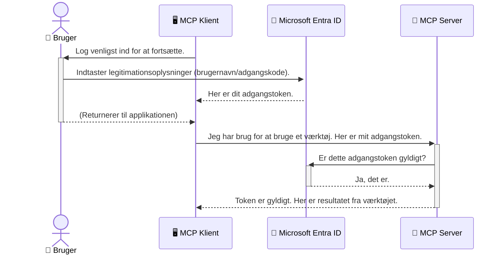

# Sikring af AI-arbejdsgange: Entra ID-godkendelse til Model Context Protocol-servere

## Introduktion
At sikre din Model Context Protocol (MCP) server er lige så vigtigt som at låse hoveddøren til dit hus. Hvis du efterlader din MCP-server åben, udsætter du dine værktøjer og data for uautoriseret adgang, hvilket kan føre til sikkerhedsbrud. Microsoft Entra ID leverer en robust cloud-baseret identitets- og adgangsstyringsløsning, som hjælper med at sikre, at kun autoriserede brugere og applikationer kan interagere med din MCP-server. I dette afsnit lærer du, hvordan du beskytter dine AI-arbejdsgange ved hjælp af Entra ID-godkendelse.

## Læringsmål
Når du er færdig med dette afsnit, vil du kunne:

- Forstå vigtigheden af at sikre MCP-servere.
- Forklare grundlæggende om Microsoft Entra ID og OAuth 2.0-godkendelse.
- Genkende forskellen mellem offentlige og fortrolige klienter.
- Implementere Entra ID-godkendelse i både lokale (offentlige klienter) og fjernbetjente (fortrolige klienter) MCP-server-scenarier.
- Anvende sikkerhedspraksis for udvikling af AI-arbejdsgange.

## Sikkerhed og MCP

Ligesom du ikke ville lade hoveddøren til dit hus stå ulåst, bør du ikke lade din MCP-server være åben for alle. At sikre dine AI-arbejdsgange er essentielt for at opbygge robuste, pålidelige og sikre applikationer. Dette kapitel introducerer dig til brugen af Microsoft Entra ID til at sikre dine MCP-servere, og sikrer at kun autoriserede brugere og applikationer kan interagere med dine værktøjer og data.

## Hvorfor sikkerhed er vigtigt for MCP-servere

Forestil dig, at din MCP-server har et værktøj, der kan sende e-mails eller få adgang til en kundedatabase. En usikret server betyder, at hvem som helst potentielt kan bruge det værktøj, hvilket kan føre til uautoriseret adgang til data, spam eller andre skadelige aktiviteter.

Ved at implementere godkendelse sikrer du, at hver anmodning til din server verificeres og bekræfter identiteten på den bruger eller applikation, der laver anmodningen. Dette er det første og mest kritiske skridt til at sikre dine AI-arbejdsgange.

## Introduktion til Microsoft Entra ID

[**Microsoft Entra ID**](https://adoption.microsoft.com/microsoft-security/entra/) er en cloud-baseret identitets- og adgangsstyringstjeneste. Tænk på det som en universel sikkerhedsvagt for dine applikationer. Det håndterer den komplekse proces med at verificere brugeridentiteter (godkendelse) og bestemme, hvad de har lov til at gøre (autorisation).

Ved at bruge Entra ID kan du:

- Muliggøre sikker login for brugere.
- Beskytte API'er og tjenester.
- Administrere adgangspolitikker fra et centralt sted.

For MCP-servere tilbyder Entra ID en robust og bredt betroet løsning til at styre, hvem der kan få adgang til serverens funktioner.

---

## Forstå magien: Sådan virker Entra ID-godkendelse

Entra ID bruger åbne standarder som **OAuth 2.0** til at håndtere godkendelse. Selvom detaljerne kan være komplekse, er hovedkonceptet simpelt og kan forstås via en analogi.

### En blid introduktion til OAuth 2.0: Nøglen til parkeringsvagten

Tænk på OAuth 2.0 som en parkeringsvagttjeneste for din bil. Når du ankommer til en restaurant, giver du ikke parkeringsvagten din hovednøgle. I stedet giver du en **parkeringsvagtnøgle**, der har begrænsede tilladelser – den kan starte bilen og låse dørene, men den kan ikke åbne bagagerummet eller handskerummet.

I denne analogi:

- **Du** er **Brugeren**.
- **Din bil** er **MCP-serveren** med dens værdifulde værktøjer og data.
- **Parkeringsvagten** er **Microsoft Entra ID**.
- **Parkeringsassistenten** er **MCP-klienten** (applikationen, der prøver at få adgang til serveren).
- **Parkeringsvagtnøglen** er **Adgangstokenet**.

Adgangstokenet er en sikker tekststreng, som MCP-klienten modtager fra Entra ID efter du har logget ind. Klienten præsenterer derefter dette token for MCP-serveren med hver anmodning. Serveren kan verificere tokenet for at sikre, at anmodningen er legitim, og at klienten har de nødvendige tilladelser – alt sammen uden nogensinde at skulle håndtere dine faktiske loginoplysninger (som dit kodeord).

### Godkendelsesflowet

Sådan fungerer processen i praksis:



### Introduktion til Microsoft Authentication Library (MSAL)

Før vi dykker ned i koden, er det vigtigt at introducere en vigtig komponent, du vil se i eksemplerne: **Microsoft Authentication Library (MSAL)**.

MSAL er et bibliotek udviklet af Microsoft, der gør det meget nemmere for udviklere at håndtere godkendelse. I stedet for at du skal skrive alt den komplekse kode til at håndtere sikkerhedstokens, administrere login og opdatere sessioner, tager MSAL sig af det tunge arbejde.

Det anbefales stærkt at bruge et bibliotek som MSAL, fordi:

- **Det er sikkert:** Det implementerer industristandardprotokoller og bedste praksis for sikkerhed, hvilket reducerer risikoen for sårbarheder i din kode.
- **Det forenkler udviklingen:** Det abstrakter kompleksiteten i OAuth 2.0 og OpenID Connect-protokollerne, så du kan tilføje robust godkendelse til din applikation med få linjer kode.
- **Det bliver vedligeholdt:** Microsoft vedligeholder aktivt og opdaterer MSAL for at håndtere nye sikkerhedstrusler og ændringer i platformen.

MSAL understøtter en lang række sprog og applikationsrammer, herunder .NET, JavaScript/TypeScript, Python, Java, Go og mobile platforme som iOS og Android. Det betyder, at du kan bruge de samme konsistente godkendelsesmønstre på tværs af hele din teknologistak.

For at lære mere om MSAL kan du se den officielle [MSAL overview documentation](https://learn.microsoft.com/entra/identity-platform/msal-overview).

---

## Sikring af din MCP-server med Entra ID: En trin-for-trin guide

Lad os nu gennemgå, hvordan du sikrer en lokal MCP-server (en som kommunikerer over `stdio`) ved hjælp af Entra ID. Dette eksempel bruger en **offentlig klient**, hvilket er passende til applikationer, der kører på en brugers maskine, som en desktop-app eller en lokal udviklingsserver.

### Scenarie 1: Sikring af en lokal MCP-server (med en offentlig klient)

I dette scenarie ser vi på en MCP-server, der kører lokalt, kommunikerer over `stdio` og bruger Entra ID til at godkende brugeren, før adgang til dens værktøjer tillades. Serveren vil have et enkelt værktøj, som henter brugerens profiloplysninger fra Microsoft Graph API.

#### 1. Opsætning af applikationen i Entra ID

Før du skriver kode, skal du registrere din applikation i Microsoft Entra ID. Det fortæller Entra ID om din applikation og giver den tilladelse til at bruge godkendelsestjenesten.

1. Naviger til **[Microsoft Entra portal](https://entra.microsoft.com/)**.
2. Gå til **App registrations** og klik på **New registration**.
3. Giv din applikation et navn (f.eks. "My Local MCP Server").
4. For **Supported account types** vælg **Accounts in this organizational directory only**.
5. Du kan lade **Redirect URI** stå tom i dette eksempel.
6. Klik på **Register**.

Når det er registreret, skal du notere **Application (client) ID** og **Directory (tenant) ID**. Du skal bruge disse i din kode.

#### 2. Koden: En gennemgang

Lad os se på nøgledele af koden, som håndterer godkendelsen. Den fulde kode til dette eksempel er tilgængelig i [Entra ID - Local - WAM](https://github.com/Azure-Samples/mcp-auth-servers/tree/main/src/entra-id-local-wam) mappen i [mcp-auth-servers GitHub-repositoriet](https://github.com/Azure-Samples/mcp-auth-servers).

**`AuthenticationService.cs`**

Denne klasse håndterer interaktionen med Entra ID.

- **`CreateAsync`**: Denne metode initialiserer `PublicClientApplication` fra MSAL (Microsoft Authentication Library). Den konfigureres med din applikations `clientId` og `tenantId`.
- **`WithBroker`**: Dette aktiverer brugen af en broker (som Windows Web Account Manager), hvilket giver en mere sikker og gnidningsfri enkelt-login-oplevelse.
- **`AcquireTokenAsync`**: Dette er kernefunktionen. Den forsøger først at hente et token stille og roligt (så brugeren ikke behøver logge ind igen, hvis de allerede har en gyldig session). Hvis et stille token ikke kan opnås, vil den bede brugeren om at logge ind interaktivt.

```csharp
// Simplified for clarity
public static async Task<AuthenticationService> CreateAsync(ILogger<AuthenticationService> logger)
{
    var msalClient = PublicClientApplicationBuilder
        .Create(_clientId) // Your Application (client) ID
        .WithAuthority(AadAuthorityAudience.AzureAdMyOrg)
        .WithTenantId(_tenantId) // Your Directory (tenant) ID
        .WithBroker(new BrokerOptions(BrokerOptions.OperatingSystems.Windows))
        .Build();

    // ... cache registration ...

    return new AuthenticationService(logger, msalClient);
}

public async Task<string> AcquireTokenAsync()
{
    try
    {
        // Try silent authentication first
        var accounts = await _msalClient.GetAccountsAsync();
        var account = accounts.FirstOrDefault();

        AuthenticationResult? result = null;

        if (account != null)
        {
            result = await _msalClient.AcquireTokenSilent(_scopes, account).ExecuteAsync();
        }
        else
        {
            // If no account, or silent fails, go interactive
            result = await _msalClient.AcquireTokenInteractive(_scopes).ExecuteAsync();
        }

        return result.AccessToken;
    }
    catch (Exception ex)
    {
        _logger.LogError(ex, "An error occurred while acquiring the token.");
        throw; // Optionally rethrow the exception for higher-level handling
    }
}
```

**`Program.cs`**

Her sættes MCP-serveren op, og godkendelsesservicen integreres.

- **`AddSingleton<AuthenticationService>`**: Dette registrerer `AuthenticationService` i dependency injection-kontaineren, så den kan bruges af andre dele af applikationen (som vores værktøj).
- **`GetUserDetailsFromGraph` værktøj**: Dette værktøj kræver en instans af `AuthenticationService`. Før det foretager noget, kalder det `authService.AcquireTokenAsync()` for at hente et gyldigt adgangstoken. Hvis godkendelsen lykkes, bruger det tokenet til at kalde Microsoft Graph API og hente brugerens detaljer.

```csharp
// Simplified for clarity
[McpServerTool(Name = "GetUserDetailsFromGraph")]
public static async Task<string> GetUserDetailsFromGraph(
    AuthenticationService authService)
{
    try
    {
        // This will trigger the authentication flow
        var accessToken = await authService.AcquireTokenAsync();

        // Use the token to create a GraphServiceClient
        var graphClient = new GraphServiceClient(
            new BaseBearerTokenAuthenticationProvider(new TokenProvider(authService)));

        var user = await graphClient.Me.GetAsync();

        return System.Text.Json.JsonSerializer.Serialize(user);
    }
    catch (Exception ex)
    {
        return $"Error: {ex.Message}";
    }
}
```

#### 3. Hvordan det hele fungerer sammen

1. Når MCP-klienten prøver at bruge `GetUserDetailsFromGraph`-værktøjet, kalder værktøjet først `AcquireTokenAsync`.
2. `AcquireTokenAsync` aktiverer MSAL-biblioteket til at tjekke for et gyldigt token.
3. Hvis der ikke findes et token, vil MSAL via brokeren bede brugeren om at logge ind med deres Entra ID-konto.
4. Når brugeren er logget ind, udsteder Entra ID et adgangstoken.
5. Værktøjet modtager tokenet og bruger det til at foretage et sikkert opkald til Microsoft Graph API.
6. Brugerens oplysninger returneres til MCP-klienten.

Denne proces sikrer, at kun godkendte brugere kan bruge værktøjet og dermed effektivt sikre din lokale MCP-server.

### Scenarie 2: Sikring af en fjern MCP-server (med en fortrolig klient)

Når din MCP-server kører på en fjern maskine (såsom en cloud-server) og kommunikerer over en protokol som HTTP Streaming, er sikkerhedskravene anderledes. I dette tilfælde bør du bruge en **fortrolig klient** og **Authorization Code Flow**. Dette er en mere sikker metode, fordi applikationens hemmeligheder aldrig udsættes for browseren.

Dette eksempel bruger en TypeScript-baseret MCP-server, som bruger Express.js til at håndtere HTTP-anmodninger.

#### 1. Opsætning af applikationen i Entra ID

Opsætningen i Entra ID ligner den til offentlige klienter, men med en vigtig forskel: du skal oprette en **client secret**.

1. Naviger til **[Microsoft Entra portal](https://entra.microsoft.com/)**.
2. I din app-registrering, gå til fanen **Certificates & secrets**.
3. Klik på **New client secret**, giv den en beskrivelse, og klik på **Add**.
4. **Vigtigt:** Kopiér straks værdien af klienthemmeligheden. Du vil ikke kunne se den igen.
5. Du skal også konfigurere en **Redirect URI**. Gå til fanen **Authentication**, klik på **Add a platform**, vælg **Web**, og indtast redirect URI’en for din applikation (f.eks. `http://localhost:3001/auth/callback`).

> **⚠️ Vigtigt sikkerhedsnotat:** Til produktionsapplikationer anbefaler Microsoft stærkt at bruge **secretless authentication** metoder som **Managed Identity** eller **Workload Identity Federation** i stedet for klienthemmeligheder. Klienthemmeligheder indebærer sikkerhedsrisici, da de kan blive afsløret eller kompromitteret. Managed identities giver en mere sikker tilgang ved at eliminere behovet for at lagre legitimationsoplysninger i din kode eller konfiguration.
>
> For mere information om managed identities og hvordan de implementeres, se [Managed identities for Azure resources overview](https://learn.microsoft.com/entra/identity/managed-identities-azure-resources/overview).

#### 2. Koden: En gennemgang

Dette eksempel bruger en session-baseret tilgang. Når brugeren godkendes, gemmer serveren adgangstoken og refresh-token i en session og giver brugeren et sessionstoken. Dette sessionstoken bruges derefter til efterfølgende anmodninger. Den fulde kode til dette eksempel er tilgængelig i [Entra ID - Confidential client](https://github.com/Azure-Samples/mcp-auth-servers/tree/main/src/entra-id-cca-session) mappen i [mcp-auth-servers GitHub-repositoriet](https://github.com/Azure-Samples/mcp-auth-servers).

**`Server.ts`**

Denne fil opsætter Express-serveren og MCP transportlaget.

- **`requireBearerAuth`**: Dette er middleware, der beskytter `/sse` og `/message` endpoints. Den tjekker efter et gyldigt bearer-token i `Authorization` headeren på anmodningen.
- **`EntraIdServerAuthProvider`**: Dette er en brugerdefineret klasse, der implementerer `McpServerAuthorizationProvider` interfacet. Den håndterer OAuth 2.0-flowet.
- **`/auth/callback`**: Dette endpoint håndterer redirect fra Entra ID efter brugeren har godkendt sig. Det udveksler autorisationskoden for et adgangstoken og et refresh-token.

```typescript
// Forenklet for klarhed
const app = express();
const { server } = createServer();
const provider = new EntraIdServerAuthProvider();

// Beskyt SSE-endpointet
app.get("/sse", requireBearerAuth({
  provider,
  requiredScopes: ["User.Read"]
}), async (req, res) => {
  // ... forbind til transporten ...
});

// Beskyt besked-endpointet
app.post("/message", requireBearerAuth({
  provider,
  requiredScopes: ["User.Read"]
}), async (req, res) => {
  // ... håndter beskeden ...
});

// Håndter OAuth 2.0 callback
app.get("/auth/callback", (req, res) => {
  provider.handleCallback(req.query.code, req.query.state)
    .then(result => {
      // ... håndter succes eller fejl ...
    });
});
```

**`Tools.ts`**

Denne fil definerer de værktøjer, MCP-serveren tilbyder. `getUserDetails`-værktøjet ligner det i det forrige eksempel, men får adgangstokenet fra sessionen.

```typescript
// Forenklet for klarhed
server.setRequestHandler(CallToolRequestSchema, async (request) => {
  const { name } = request.params;
  const context = request.params?.context as { token?: string } | undefined;
  const sessionToken = context?.token;

  if (name === ToolName.GET_USER_DETAILS) {
    if (!sessionToken) {
      throw new AuthenticationError("Authentication token is missing or invalid. Ensure the token is provided in the request context.");
    }

    // Hent Entra ID-tokenet fra sessionslageret
    const tokenData = tokenStore.getToken(sessionToken);
    const entraIdToken = tokenData.accessToken;

    const graphClient = Client.init({
      authProvider: (done) => {
        done(null, entraIdToken);
      }
    });

    const user = await graphClient.api('/me').get();

    // ... returner brugeroplysninger ...
  }
});
```

**`auth/EntraIdServerAuthProvider.ts`**

Denne klasse håndterer logikken for:

- At omdirigere brugeren til Entra ID's login-side.
- At udveksle autorisationskoden for et adgangstoken.
- At gemme tokenene i `tokenStore`.
- At opdatere adgangstokenet, når det udløber.

#### 3. Hvordan det hele fungerer sammen

1. Når en bruger først prøver at oprette forbindelse til MCP-serveren, vil `requireBearerAuth` middleware opdage, at de ikke har en gyldig session, og omdirigere dem til Entra ID's login-side.
2. Brugeren logger ind med deres Entra ID-konto.
3. Entra ID videresender brugeren tilbage til `/auth/callback`-endepunktet med en autorisationskode.  
4. Serveren bytter koden til et adgangstoken og et opfriskningstoken, gemmer dem og opretter et sessionstoken, som sendes til klienten.  
5. Klienten kan nu bruge dette sessionstoken i `Authorization`-headeren for alle fremtidige anmodninger til MCP-serveren.  
6. Når `getUserDetails`-værktøjet kaldes, bruger det sessionstoken til at slå Entra ID-adgangstokenet op og bruger derefter dette til at kalde Microsoft Graph API.

Denne proces er mere kompleks end flowet for offentlige klienter, men er nødvendig for internetvendte endepunkter. Da fjern-MCP-servere er tilgængelige over det offentlige internet, skal de have stærkere sikkerhedsforanstaltninger for at beskytte mod uautoriseret adgang og potentielle angreb.


## Bedste Sikkerhedspraksis

- **Brug altid HTTPS**: Krypter kommunikationen mellem klient og server for at beskytte token mod aflytning.  
- **Implementér rollebaseret adgangskontrol (RBAC)**: Tjek ikke bare *om* en bruger er autentificeret; tjek *hvad* de har ret til at gøre. Du kan definere roller i Entra ID og kontrollere dem i din MCP-server.  
- **Overvåg og revider**: Log alle autentificeringshændelser, så du kan opdage og reagere på mistænkelig aktivitet.  
- **Håndtér ratebegrænsning og throttling**: Microsoft Graph og andre API'er implementerer ratebegrænsning for at forhindre misbrug. Implementér eksponentiel backoff og genprøvning i din MCP-server for pænt at håndtere HTTP 429 (Too Many Requests) svar. Overvej caching af ofte accessede data for at reducere API-kald.  
- **Sikker lagring af token**: Gem adgangstoken og opfriskningstoken sikkert. For lokale applikationer brug systemets sikre lagringsmekanismer. For serverapplikationer bør du overveje krypteret lagring eller sikre nøglehåndteringstjenester som Azure Key Vault.  
- **Håndtering af token-udløb**: Adgangstoken har en begrænset levetid. Implementér automatisk opdatering af token vha. opfriskningstoken for at bevare en problemfri brugeroplevelse uden behov for genautentificering.  
- **Overvej at bruge Azure API Management**: Selvom implementering af sikkerhed direkte i din MCP-server giver dig detaljeret kontrol, kan API-gateways som Azure API Management håndtere mange af disse sikkerhedsaspekter automatisk, herunder autentificering, autorisation, ratebegrænsning og overvågning. De tilbyder et centraliseret sikkerhedslag, der placeres mellem dine klienter og MCP-servere. For flere detaljer om brug af API-gateways med MCP, se vores [Azure API Management Your Auth Gateway For MCP Servers](https://techcommunity.microsoft.com/blog/integrationsonazureblog/azure-api-management-your-auth-gateway-for-mcp-servers/4402690).


## Vigtige Pointer

- Sikring af din MCP-server er afgørende for at beskytte dine data og værktøjer.  
- Microsoft Entra ID tilbyder en robust og skalerbar løsning til autentificering og autorisation.  
- Brug en **offentlig klient** til lokale applikationer og en **fortrolig klient** til fjernservere.  
- **Autorisation Code Flow** er den mest sikre mulighed for webapplikationer.


## Øvelse

1. Overvej en MCP-server, du kunne bygge. Ville det være en lokal eller en fjernserver?  
2. Baseret på dit svar, vil du så bruge en offentlig eller fortrolig klient?  
3. Hvilke tilladelser ville din MCP-server anmode om for at udføre handlinger mod Microsoft Graph?


## Praktiske Øvelser

### Øvelse 1: Registrér en Applikation i Entra ID  
Gå til Microsoft Entra-portalen.  
Registrér en ny applikation til din MCP-server.  
Notér Application (client) ID og Directory (tenant) ID.

### Øvelse 2: Sikr en Lokal MCP-server (Offentlig Klient)  
- Følg kodeeksemplet for at integrere MSAL (Microsoft Authentication Library) for brugerautentificering.  
- Test autentificeringsflowet ved at kalde MCP-værktøjet, der henter brugeroplysninger fra Microsoft Graph.

### Øvelse 3: Sikr en Fjern MCP-server (Fortrolig Klient)  
- Registrér en fortrolig klient i Entra ID og opret en klienthemmelighed.  
- Konfigurer din Express.js MCP-server til at bruge Autorisation Code Flow.  
- Test de beskyttede endepunkter og bekræft token-baseret adgang.

### Øvelse 4: Anvend Bedste Sikkerhedspraksis  
- Aktivér HTTPS for din lokale eller fjernserver.  
- Implementér rollebaseret adgangskontrol (RBAC) i din serverlogik.  
- Tilføj håndtering af token-udløb og sikker lagring af token.


## Ressourcer

1. **MSAL Oversigtsdokumentation**  
   Lær, hvordan Microsoft Authentication Library (MSAL) muliggør sikker token-anskaffelse på tværs af platforme:  
   [MSAL Overview on Microsoft Learn](https://learn.microsoft.com/en-gb/entra/msal/overview)

2. **Azure-Samples/mcp-auth-servers GitHub Repository**  
   Referencemateriale med implementeringer af MCP-servere, der demonstrerer autentificeringsflow:  
   [Azure-Samples/mcp-auth-servers on GitHub](https://github.com/Azure-Samples/mcp-auth-servers)

3. **Managed Identities for Azure Resources Oversigt**  
   Forstå, hvordan du eliminerer hemmeligheder ved at bruge system- eller bruger-tildelte administrerede identiteter:  
   [Managed Identities Overview on Microsoft Learn](https://learn.microsoft.com/en-us/entra/identity/managed-identities-azure-resources/)

4. **Azure API Management: Din Auth Gateway for MCP Servere**  
   En dybdegående gennemgang af brugen af APIM som en sikker OAuth2-gateway for MCP-servere:  
   [Azure API Management Your Auth Gateway For MCP Servers](https://techcommunity.microsoft.com/blog/integrationsonazureblog/azure-api-management-your-auth-gateway-for-mcp-servers/4402690)

5. **Microsoft Graph Tilladelsesreferencer**  
   Omfattende liste over delegerede og applikationstilladelser til Microsoft Graph:  
   [Microsoft Graph Permissions Reference](https://learn.microsoft.com/zh-tw/graph/permissions-reference)


## Læringsmål  
Efter at have gennemført dette afsnit vil du kunne:

- Forklare hvorfor autentificering er kritisk for MCP-servere og AI-arbejdsflows.  
- Sætte Entra ID-autentificering op og konfigurere den til både lokale og fjern-MCP-server scenarier.  
- Vælge passende klienttype (offentlig eller fortrolig) baseret på din servers implementering.  
- Implementere sikker programmeringspraksis, herunder tokenlagring og rollebaseret autorisation.  
- Med selvtillid beskytte din MCP-server og dens værktøjer mod uautoriseret adgang.

## Hvad er næste skridt  

- [5.13 Model Context Protocol (MCP) Integration med Microsoft Foundry](../mcp-foundry-agent-integration/README.md)

---

<!-- CO-OP TRANSLATOR DISCLAIMER START -->
**Ansvarsfraskrivelse**:
Dette dokument er blevet oversat ved hjælp af AI-oversættelsestjenesten [Co-op Translator](https://github.com/Azure/co-op-translator). Selvom vi bestræber os på nøjagtighed, skal du være opmærksom på, at automatiserede oversættelser kan indeholde fejl eller unøjagtigheder. Det originale dokument på dets oprindelige sprog bør betragtes som den autoritative kilde. For kritisk information anbefales professionel menneskelig oversættelse. Vi påtager os intet ansvar for misforståelser eller fejltolkninger, der opstår som følge af brugen af denne oversættelse.
<!-- CO-OP TRANSLATOR DISCLAIMER END -->