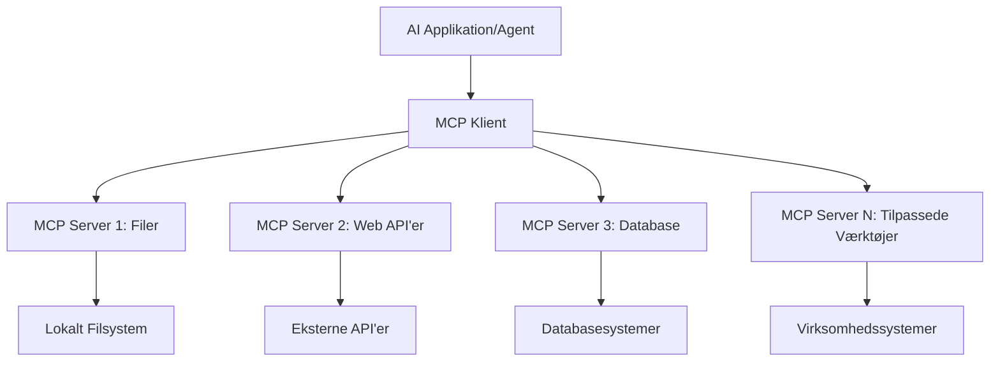

# 🌐 Modul 2: MCP med Microsoft Foundry Toolkit Grundlæggende

[]()
[]()
[]()

## 📋 Læringsmål

Ved slutningen af dette modul vil du kunne:
- ✅ Forstå Model Context Protocol (MCP) arkitektur og fordele
- ✅ Udforske Microsofts MCP server økosystem
- ✅ Integrere MCP servere med Microsoft Foundry Toolkit Agent Builder
- ✅ Bygge en funktionel browserautomatiseringsagent ved hjælp af Playwright MCP
- ✅ Konfigurere og teste MCP-værktøjer i dine agenter
- ✅ Eksportere og implementere MCP-drevne agenter til produktion

## 🎯 Bygger videre på Modul 1

I Modul 1 mestrede vi Microsoft Foundry Toolkit grundlæggende og skabte vores første Python Agent. Nu vil vi **supercharge** dine agenter ved at forbinde dem til eksterne værktøjer og tjenester gennem den revolutionerende **Model Context Protocol (MCP)**.

Tænk på dette som en opgradering fra en simpel lommeregner til en fuld computer – dine AI-agenter vil opnå evnen til at:
- 🌐 Gennemse og interagere med websider
- 📁 Tilgå og manipulere filer
- 🔧 Integrere med virksomhedssystemer
- 📊 Behandle data i realtid fra API’er

## 🧠 Forståelse af Model Context Protocol (MCP)

### 🔍 Hvad er MCP?

Model Context Protocol (MCP) er **"USB-C for AI-applikationer"** – en revolutionerende åben standard, der forbinder Large Language Models (LLMs) til eksterne værktøjer, datakilder og tjenester. Ligesom USB-C eliminerede kabelkaos ved at tilbyde en universel forbindelse, eliminerer MCP kompleksiteten ved AI-integration med en standardiseret protokol.

### 🎯 Problemet MCP løser

**Før MCP:**
- 🔧 Tilpassede integrationer for hvert værktøj
- 🔄 Leverandørafhængighed med proprietære løsninger  
- 🔒 Sikkerhedssårbarheder fra ad hoc-forbindelser
- ⏱️ Måneder af udvikling for basale integrationer

**Med MCP:**
- ⚡ Plug-and-play værktøjsintegration
- 🔄 Leverandøruafhængig arkitektur
- 🛡️ Indbygget sikkerhedsbest practices
- 🚀 Minutter for at tilføje nye funktioner

### 🏗️ MCP Arkitektur Dybdegående

MCP følger en **client-server arkitektur**, som skaber et sikkert, skalerbart økosystem:



**🔧 Kernekomponenter:**

| Komponent | Rolle | Eksempler |
|-----------|-------|-----------|
| **MCP Hosts** | Applikationer der bruger MCP-tjenester | Claude Desktop, VS Code, Microsoft Foundry Toolkit |
| **MCP Klienter** | Protokol-håndterere (1:1 med servere) | Indbygget i host-applikationer |
| **MCP Servere** | Eksponerer funktioner via standardprotokol | Playwright, Files, Azure, GitHub |
| **Transport Lag** | Kommunikationsmetoder | stdio, HTTP, WebSockets |


## 🏢 Microsofts MCP Server Økosystem

Microsoft leder MCP-økosystemet med en omfattende serie af virksomhedsklare servere, der adresserer virkelige forretningsbehov.

### 🌟 Fremhævede Microsoft MCP Servere

#### 1. ☁️ Azure MCP Server
**🔗 Repository**: [azure/azure-mcp](https://github.com/azure/azure-mcp)
**🎯 Formål**: Omfattende styring af Azure-ressourcer med AI-integration

**✨ Nøglefunktioner:**
- Deklarativ infrastrukturprovisionering
- Overvågning af ressourcer i realtid
- Anbefalinger til omkostningsoptimering
- Sikkerhedsoverholdelse

**🚀 Anvendelser:**
- Infrastruktur-som-kode med AI-assistance
- Automatisk ressource-skalering
- Cloud-omkostningsoptimering
- Automatisering af DevOps workflows

#### 2. 📊 Microsoft Dataverse MCP
**📚 Dokumentation**: [Microsoft Dataverse Integration](https://go.microsoft.com/fwlink/?linkid=2320176)
**🎯 Formål**: Naturligt sproginterface til forretningsdata

**✨ Nøglefunktioner:**
- Forespørgsler til databasen i naturligt sprog
- Forståelse af forretningskontekst
- Tilpassede promptskabeloner
- Enterprise data governance

**🚀 Anvendelser:**
- Business intelligence rapportering
- Kundedata-analyse
- Salgspipeline indsigt
- Overholdelsesforespørgsler

#### 3. 🌐 Playwright MCP Server
**🔗 Repository**: [microsoft/playwright-mcp](https://github.com/microsoft/playwright-mcp)
**🎯 Formål**: Browserautomatisering og web-interaktionsmuligheder

**✨ Nøglefunktioner:**
- Cross-browser automatisering (Chrome, Firefox, Safari)
- Intelligent elementgenkendelse
- Skærmbilleder og PDF-generering
- Netværkstrafikovervågning

**🚀 Anvendelser:**
- Automatiserede test-workflows
- Webscraping og dataudtræk
- UI/UX overvågning
- Konkurrenceanalyse-automation

#### 4. 📁 Files MCP Server
**🔗 Repository**: [microsoft/files-mcp-server](https://github.com/microsoft/files-mcp-server)
**🎯 Formål**: Intelligent filsystemhåndtering

**✨ Nøglefunktioner:**
- Deklarativ filhåndtering
- Indholdssynkronisering
- Versionskontrolintegration
- Metadataudtræk

**🚀 Anvendelser:**
- Dokumentationshåndtering
- Organisering af kode-repositorier
- Workflow for indholdspublicering
- Filhåndtering til datapipelines

#### 5. 📝 MarkItDown MCP Server
**🔗 Repository**: [microsoft/markitdown](https://github.com/microsoft/markitdown)
**🎯 Formål**: Avanceret Markdown-behandling og manipulation

**✨ Nøglefunktioner:**
- Omfattende Markdown-parsing
- Formatkonvertering (MD ↔ HTML ↔ PDF)
- Analyse af indholdsstruktur
- Skabelonbehandling

**🚀 Anvendelser:**
- Workflow til teknisk dokumentation
- Content management systemer
- Rapportgenerering
- Automatisering af vidensbaser

#### 6. 📈 Clarity MCP Server
**📦 Pakke**: [@microsoft/clarity-mcp-server](https://www.npmjs.com/package/@microsoft/clarity-mcp-server)
**🎯 Formål**: Webanalyse og brugeradfærdsindsigter

**✨ Nøglefunktioner:**
- Heatmap dataanalyse
- Optagelser af bruger-sessioner
- Performance-målinger
- Analyse af konverteringstragt

**🚀 Anvendelser:**
- Websiteoptimering
- Brugeroplevelsesforskning
- A/B-testanalyse
- Business intelligence dashboards

### 🌍 Community Økosystem

Udover Microsofts servere inkluderer MCP-økosystemet:
- **🐙 GitHub MCP**: Repositoriehåndtering og kodeanalyse
- **🗄️ Database MCP'er**: PostgreSQL, MySQL, MongoDB integrationer
- **☁️ Cloud Provider MCP'er**: AWS, GCP, Digital Ocean værktøjer
- **📧 Kommunikations MCP'er**: Slack, Teams, Email integrationer

## 🛠️ Hands-On Lab: Byg en Browserautomatiseringsagent

**🎯 Projektmål**: Skab en intelligent browserautomatiseringsagent ved hjælp af Playwright MCP server, der kan navigere på websider, udtrække information og udføre komplekse web-interaktioner.

### 🚀 Fase 1: Agent Grundopsætning

#### Trin 1: Initialiser Din Agent
1. **Åbn Microsoft Foundry Toolkit Agent Builder**
2. **Opret Ny Agent** med følgende konfiguration:
   - **Navn**: `BrowserAgent`
   - **Model**: Vælg GPT-4o 


### 🔧 Fase 2: MCP Integrationsworkflow

#### Trin 3: Tilføj MCP Server Integration
1. **Naviger til Værktøjssektionen** i Agent Builder
2. **Klik "Tilføj Værktøj"** for at åbne integrationsmenuen
3. **Vælg "MCP Server"** blandt tilgængelige muligheder


**🔍 Forstå Værktøjstyper:**
- **Indbyggede Værktøjer**: Forudkonfigurerede Microsoft Foundry Toolkit-funktioner
- **MCP Servere**: Eksterne tjenesteintegrationer
- **Brugerdefinerede API'er**: Dine egne serviceendpoints
- **Funktionskald**: Direkte funktionsadgang for modellen

#### Trin 4: MCP Server Valg
1. **Vælg "MCP Server"** for at fortsætte


2. **Gennemse MCP Kataloget** for at udforske tilgængelige integrationer  


### 🎮 Fase 3: Playwright MCP Konfiguration

#### Trin 5: Vælg og Konfigurer Playwright
1. **Klik "Brug Fremhævede MCP Servere"** for at få adgang til Microsofts verificerede servere
2. **Vælg "Playwright"** fra den fremhævede liste
3. **Accepter Standard MCP ID** eller tilpas til dit miljø


#### Trin 6: Aktiver Playwright Funktionaliteter
**🔑 Kritisk Skridt**: Vælg **ALLE** tilgængelige Playwright metoder for maksimal funktionalitet


**🛠️ Vigtige Playwright Værktøjer:**
- **Navigation**: `goto`, `goBack`, `goForward`, `reload`
- **Interaktion**: `click`, `fill`, `press`, `hover`, `drag`
- **Udtræk**: `textContent`, `innerHTML`, `getAttribute`
- **Validering**: `isVisible`, `isEnabled`, `waitForSelector`
- **Capture**: `screenshot`, `pdf`, `video`
- **Netværk**: `setExtraHTTPHeaders`, `route`, `waitForResponse`

#### Trin 7: Bekræft Integrationssucces
**✅ Succesindikatorer:**
- Alle værktøjer vises i Agent Builder-grænsefladen
- Ingen fejlbeskeder i integrationspanelet
- Playwright serverstatus viser "Connected"


**🔧 Fejlfinding af Almindelige Problemer:**
- **Forbindelse Mislykkedes**: Tjek internetforbindelse og firewallindstillinger
- **Manglende Værktøjer**: Sørg for at alle funktioner blev valgt ved opsætning
- **Tilladelsesfejl**: Bekræft at VS Code har nødvendige systemtilladelser

### 🎯 Fase 4: Avanceret Prompt Engineering

#### Trin 8: Design Intelligente Systemprompts
Opret sofistikerede prompts, der udnytter Playwrights fulde funktioner:

```markdown
# Web Automation Expert System Prompt

## Core Identity
You are an advanced web automation specialist with deep expertise in browser automation, web scraping, and user experience analysis. You have access to Playwright tools for comprehensive browser control.

## Capabilities & Approach
### Navigation Strategy
- Always start with screenshots to understand page layout
- Use semantic selectors (text content, labels) when possible
- Implement wait strategies for dynamic content
- Handle single-page applications (SPAs) effectively

### Error Handling
- Retry failed operations with exponential backoff
- Provide clear error descriptions and solutions
- Suggest alternative approaches when primary methods fail
- Always capture diagnostic screenshots on errors

### Data Extraction
- Extract structured data in JSON format when possible
- Provide confidence scores for extracted information
- Validate data completeness and accuracy
- Handle pagination and infinite scroll scenarios

### Reporting
- Include step-by-step execution logs
- Provide before/after screenshots for verification
- Suggest optimizations and alternative approaches
- Document any limitations or edge cases encountered

## Ethical Guidelines
- Respect robots.txt and rate limiting
- Avoid overloading target servers
- Only extract publicly available information
- Follow website terms of service
```

#### Trin 9: Opret Dynamiske Brugerprompts
Design prompts, der demonstrerer forskellige funktioner:

**🌐 Web Analyse Eksempel:**
```markdown
Navigate to github.com/kinfey and provide a comprehensive analysis including:
1. Repository structure and organization
2. Recent activity and contribution patterns  
3. Documentation quality assessment
4. Technology stack identification
5. Community engagement metrics
6. Notable projects and their purposes

Include screenshots at key steps and provide actionable insights.
```


### 🚀 Fase 5: Eksekvering og Test

#### Trin 10: Udfør Din Første Automatisering
1. **Klik "Kør"** for at starte automatiseringssekvensen
2. **Overvåg Eksekvering i Real-time**:
   - Chrome-browser åbnes automatisk
   - Agent navigerer til målsiden
   - Skærmbilleder tages ved hver vigtig handling
   - Analyse resultater strømmer live ind


#### Trin 11: Analyser Resultater og Indsigter
Gennemgå omfattende analyse i Agent Builder-grænsefladen:


### 🌟 Fase 6: Avancerede Funktioner og Udrulning

#### Trin 12: Eksporter og Udrul til Produktion
Agent Builder understøtter flere udrulningsmuligheder:


## 🎓 Modul 2 Opsummering & Næste Skridt

### 🏆 Opnåelse Låst Op: MCP Integrationsmester

**✅ Færdigheder Mestre:**
- [ ] Forstå MCP arkitektur og fordele
- [ ] Navigere i Microsofts MCP server økosystem
- [ ] Integrere Playwright MCP med Microsoft Foundry Toolkit
- [ ] Bygge avancerede browserautomatiseringsagenter
- [ ] Avanceret prompt engineering til webautomatisering

### 📚 Yderligere Ressourcer

- **🔗 MCP Specifikation**: [Officiel Protokol Dokumentation](https://modelcontextprotocol.io/)
- **🛠️ Playwright API**: [Komplet Metodereference](https://playwright.dev/docs/api/class-playwright)
- **🏢 Microsoft MCP Servere**: [Enterprise Integrationsguide](https://github.com/microsoft/mcp-servers)
- **🌍 Community Eksempler**: [MCP Server Galleri](https://github.com/modelcontextprotocol/servers)

**🎉 Tillykke!** Du har med succes mestret MCP integration og kan nu opbygge produktionsklare AI-agenter med eksterne værktøjsfunktioner!


### 🔜 Fortsæt til Næste Modul

Klar til at tage dine MCP-færdigheder til næste niveau? Fortsæt til **[Modul 3: Avanceret MCP Udvikling med Microsoft Foundry Toolkit](../lab3/README.md)**, hvor du vil lære at:
- Skabe dine egne brugerdefinerede MCP servere
- Konfigurere og bruge den seneste MCP Python SDK
- Opsætte MCP Inspector til fejlfinding
- Mestre avancerede MCP server-udviklingsworkflows
- Bygge en Weather MCP Server fra bunden

---

<!-- CO-OP TRANSLATOR DISCLAIMER START -->
**Ansvarsfraskrivelse**:
Dette dokument er blevet oversat ved hjælp af AI-oversættelsestjenesten [Co-op Translator](https://github.com/Azure/co-op-translator). Selvom vi bestræber os på nøjagtighed, skal du være opmærksom på, at automatiserede oversættelser kan indeholde fejl eller unøjagtigheder. Det originale dokument på dets oprindelige sprog bør betragtes som den autoritative kilde. For kritisk information anbefales professionel menneskelig oversættelse. Vi påtager os intet ansvar for misforståelser eller fejltolkninger, der opstår som følge af brugen af denne oversættelse.
<!-- CO-OP TRANSLATOR DISCLAIMER END -->