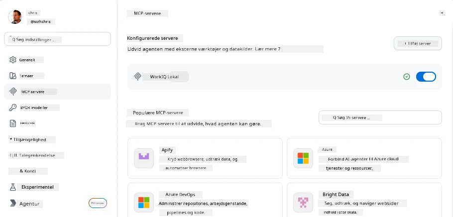
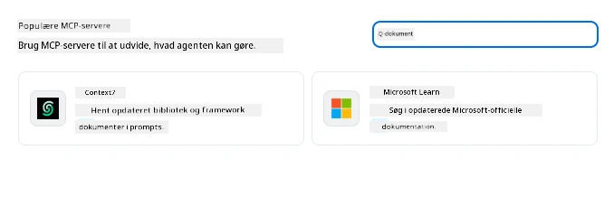
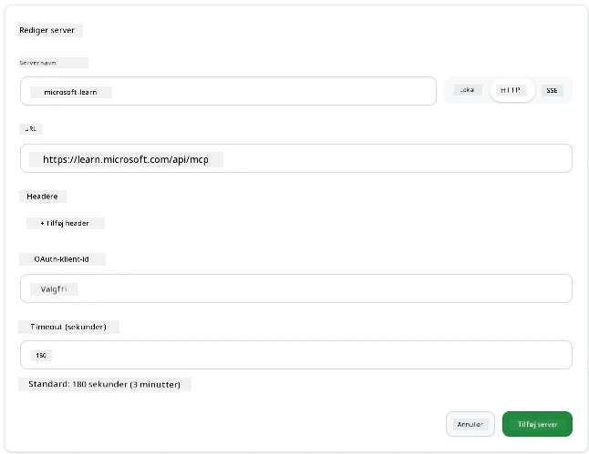
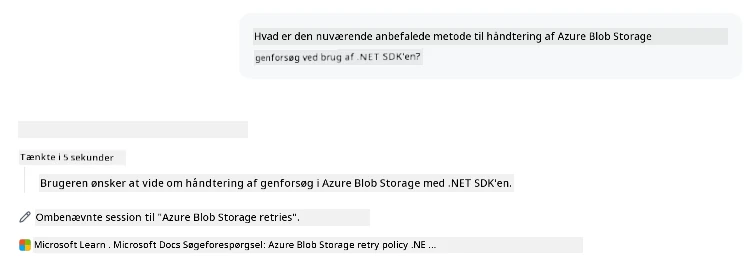
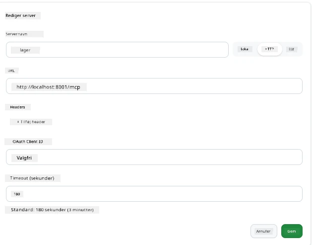
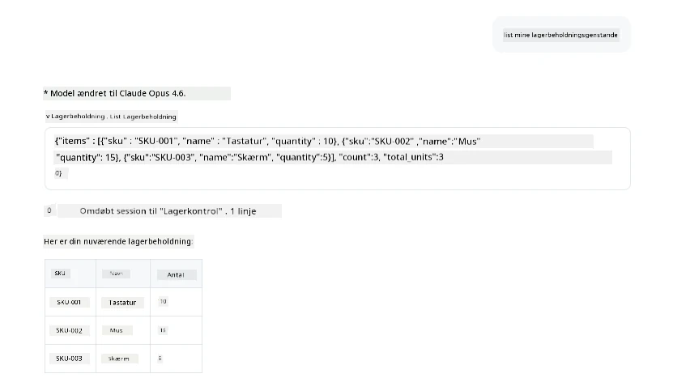
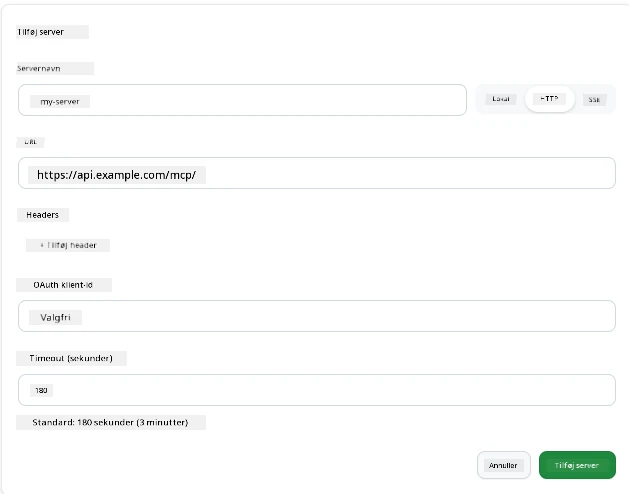
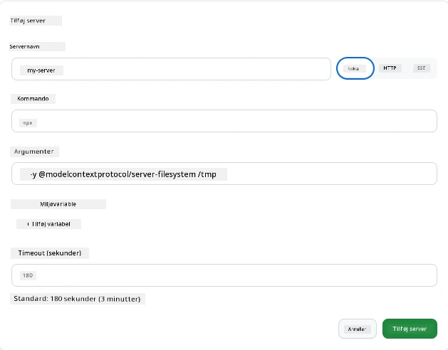

# Brug af MCP Servere i GitHub Copilot Appen

Nu ved du, hvordan MCP fungerer. Du har bygget servere, defineret værktøjer og ressourcer og forbundet klienter. Det, vi endnu ikke har gjort, er at vende perspektivet: i stedet for at være den, der bygger serveren, hvordan ser det så ud at være på *forbrugs* siden—som en bruger af en AI-drevet app, der understøtter MCP?

[GitHub Copilot App](https://github.com/github/app) er en desktop-app, der kan bruge MCP Servere. Ved at forbinde MCP servere til den, åbner du et nyt niveau: Copilot kan nu hente indhold fra din dokumentation, kalde dine interne API'er, forespørge din database eller tale med enhver service, du har pakket ind i en server. Appen bliver værten; dine MCP servere bliver dens værktøjer.

Denne lektion guider dig gennem den oplevelse fra start til slut—fra at finde MCP-indstillingspanelet til at forbinde en rigtig dokumentationsserver og derefter forbinde en tilpasset server, som du selv har lavet.

## Læringsmål

Når du er færdig med denne lektion, vil du kunne:

- Lokalisere og navigere MCP Servers-panelet i Copilot Appens indstillinger.
- Forbinde en hosted dokumentationsserver og bruge den i en session.
- Registrere en tilpasset server og verificere, at Copilot kan kalde dens værktøjer.
- Konfigurere, hvordan en server kaldes ved at angive enten miljøvariable eller brugerdefinerede headers (hvis HTTP).

## Copilot Appen som MCP Vært

Her er den grundlæggende idé: **Copilots agenter er smarte, men de ved kun, hvad du fortæller dem.** Som standard kan en agent læse filer i dit arbejdsområde og køre terminalkommandoer, men den kan ikke spørge din database, kigge i din kalender eller kalde en tilpasset API uden hjælp. Det er her, MCP servere kommer ind i billedet. De fungerer som broer mellem Copilot og dine systemer—databaser, versionskontrol, API'er, designværktøjer—og giver agenter adgang til information og handlinger, de har brug for for at færdiggøre arbejde.

Lad os starte med at finde de indstillinger, hvor du kan håndtere dine apps MCP Servere.

## Trin 1: Find MCP-Indstillingspanelet

Åbn Copilot Appen og find et tandhjulsikon nederst til venstre og klik på det.


Sørg for, at du vælger "MCP Servers", og du skulle nu kunne se dine allerede konfigurerede servere øverst, en markedsplads med populære servere nederst og en "Add Server"-knap øverst som vist her:



Det her er dit kontrolcenter. Du tilføjer, fjerner, aktiverer og deaktiverer servere her. Ændringer træder i kraft ved nye sessioner; hvis du har en session åben, skal du starte en ny for at ændringerne træder i kraft.

## Trin 2: Forbind en Dokumentationsserver

Lad os gøre noget øjeblikkeligt brugbart. Microsoft Docs MCP-serveren giver Copilot adgang til officiel Microsoft dokumentation. Det omfatter Azure, .NET, TypeScript og mere. I stedet for at agenten baserer sig på sin træningsdata (som har en datogrænse), kan den hente opdaterede dokumenter, når der spørges.

Sådan tilføjer du den:

1. I feltet med populære servere, skriv **learn** og vælg serveren kaldet "Microsoft Learn".

   

   Når du har klikket på den, får du vist en formular, hvor navn, transporttype og URL allerede er udfyldt; det eneste du skal gøre er at klikke "Add Server".

2. Klik på "Add Server", og det tager et par sekunder at forbinde til serveren.

   

   Når den er tilføjet, burde den vises øverst som en konfigureret server. Lad os prøve den af næste.

3. Luk dialogen og vælg "Quick chat". 

4. Skriv nedenstående prompt for at aktivere et værktøj på Microsoft Learn-serveren.

   ```text
   What's the current recommended approach for handling Azure Blob Storage 
   retries using the .NET SDK?
   ```

   

Du skulle nu kunne se, hvordan den henviser til den MCP Server, vi lige har tilføjet.

## Trin 3: Forbind en Tilpasset stdio Server

Forindstillingerne er bekvemme, men den rigtige styrke ligger i at forbinde dine egne servere. Lad os sige, du har bygget en server (eller fået en) der eksponerer din interne API eller virksomhedens vidensbase. Her vil vi bruge en MCP Server, vi byggede, der håndterer vores virksomheds lagerstyring.

1. Klik på tandhjulet og vælg "MCP servers" igen.

2. Vælg knappen "Add Server" og "+ Add Custom server", og angiv følgende værdier:

   - Navn: `Inventory Server`
   - Vælg transport (til højre), **http**

   Vælg "Add Server", og den burde dukke op i din liste over konfigurerede servere.

   

4. For at teste den, kør en prompt som denne:

    ```
    list inventory
    ```

   

   Du burde nu se en liste over lagervarer returneret fra din tilpassede server.

Fantastisk, du skulle nu have god forståelse for at tilføje både eksterne og dine egne MCP servere til Copilot Appen. Lad os næste gang tale om håndtering af hemmeligheder og miljøvariable.

## Trin 4: Avancerede indstillinger

Indtil videre har du set, hvordan man tilføjer MCP Servere, hvor du bare angiver et navn og URL. Men hvad hvis din server har brug for en API-nøgle eller en anden værdi? Afhængigt af transporttypen kan vi give den, hvad den behøver.

- **http eller SSE transport**: Her kan vi sætte headers efter behov.

   Til autentificering kan du for eksempel angive en Authorization-header. Værdien kan være en statisk streng. Hvis du bruger OAuth, kan du i stedet angive en OAuth client ID.

   

- **stdio transport**: Miljøvariable kan angives. 

   Her kan du specificere et vilkårligt antal miljøvariable, der skal sendes ind i serveren, når du starter den op.

   

## Opsummering

Copilot Appen behandler MCP servere som førsteklasses udvidelser af agentens muligheder. Du har set hele processen i denne lektion fra at tilføje MCP servere til at bruge dem i en session. Du kan nu forbinde til offentlige servere, interne API'er og tilpassede værktøjer, hvilket giver dine agenter evnen til at hente den information og udføre de handlinger, de har brug for for at løse opgaver selvstændigt.

## 📚 Yderligere Ressourcer

### Officielle dokumenter

- [GitHub Copilot App](https://github.com/github/app)
- [MCP Specification](https://modelcontextprotocol.io/specification/2025-03-26) - Model Context Protocol specifikation

### Fællesskab
- [MCP Community Discord](https://discord.com/invite/ByRwuEEgH4) - Live diskussioner
- [GitHub Discussions](https://github.com/microsoft/MCP-Server-and-PostgreSQL-Sample-Retail/discussions) - Spørgsmål og deling
- [Stack Overflow](https://stackoverflow.com/questions/tagged/model-context-protocol) - Tekniske spørgsmål

---

<!-- CO-OP TRANSLATOR DISCLAIMER START -->
**Ansvarsfraskrivelse**:
Dette dokument er blevet oversat ved hjælp af AI-oversættelsestjenesten [Co-op Translator](https://github.com/Azure/co-op-translator). Selvom vi bestræber os på nøjagtighed, skal du være opmærksom på, at automatiserede oversættelser kan indeholde fejl eller unøjagtigheder. Det originale dokument på dets oprindelige sprog bør betragtes som den autoritative kilde. For kritisk information anbefales professionel menneskelig oversættelse. Vi påtager os intet ansvar for misforståelser eller fejltolkninger, der opstår som følge af brugen af denne oversættelse.
<!-- CO-OP TRANSLATOR DISCLAIMER END -->