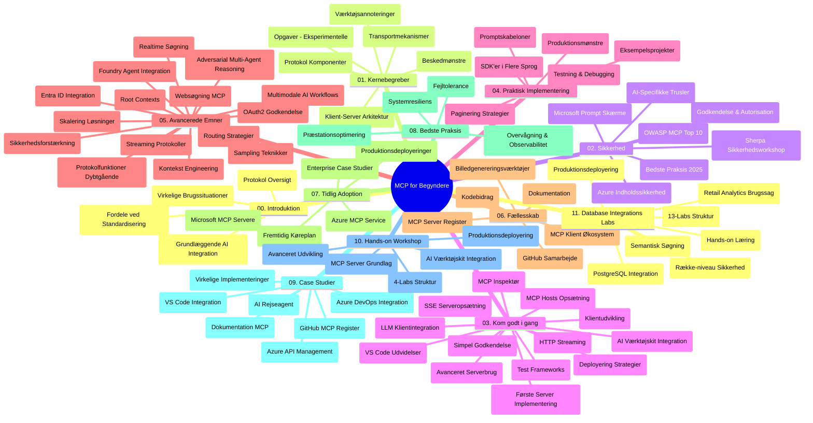

# Model Context Protocol (MCP) for Begyndere - Studievejledning

Denne studievejledning giver en oversigt over repository-strukturen og indholdet til "Model Context Protocol (MCP) for Begyndere" pensum. Brug denne vejledning til effektivt at navigere i repository og få mest muligt ud af de tilgængelige ressourcer.

## Repository Oversigt

Model Context Protocol (MCP) er en standardiseret ramme for interaktioner mellem AI-modeller og klientapplikationer. Oprindeligt oprettet af Anthropic, vedligeholdes MCP nu af det bredere MCP-fællesskab gennem den officielle GitHub-organisation. Dette repository leverer et omfattende pensum med praktiske kodeeksempler i C#, Java, JavaScript, Python og TypeScript, designet til AI-udviklere, systemarkitekter og softwareingeniører.

## Visuelt Pensumkort

## Repository Struktur

Repository er organiseret i elleve hovedsektioner, hver med fokus på forskellige aspekter af MCP:

1. **Introduktion (00-Introduction/)**
   - Oversigt over Model Context Protocol
   - Hvorfor standardisering er vigtigt i AI-pipelines
   - Praktiske anvendelsestilfælde og fordele

2. **Kernebegreber (01-CoreConcepts/)**
   - Klient-server arkitektur
   - Nøglekomponenter i protokollen
   - Messaging-mønstre i MCP

3. **Sikkerhed (02-Security/)**
   - Sikkerhedstrusler i systemer baseret på MCP
   - Bedste praksis for sikring af implementeringer
   - Autentificerings- og autorisationsstrategier
   - **Omfattende sikkerhedsdokumentation**:
     - MCP Security Best Practices 2025
     - Azure Content Safety Implementeringsvejledning
     - MCP Sikkerhedskontroller og teknikker
     - MCP Best Practices Quick Reference
   - **Vigtige sikkerhedsemner**:
     - Prompt injection og tool poisoning-angreb
     - Session hijacking og confused deputy-problemer
     - Token passthrough-sårbarheder
     - Overdrevne tilladelser og adgangskontrol
     - Supply chain-sikkerhed for AI-komponenter
     - Microsoft Prompt Shields integration

4. **Kom Godt I Gang (03-GettingStarted/)**
   - Miljøopsætning og konfiguration
   - Oprettelse af grundlæggende MCP-servere og -klienter
   - Integration med eksisterende applikationer
   - Indeholder sektioner til:
     - Første serverimplementering
     - Klientudvikling
     - LLM klientintegration
     - VS Code-integration
     - Server-Sent Events (SSE) server
     - Avanceret serverbrug
     - HTTP-streaming
     - AI Toolkit integration
     - Teststrategier
     - Implementeringsretningslinjer

5. **Praktisk Implementering (04-PracticalImplementation/)**
   - Brug af SDK’er på tværs af forskellige programmeringssprog
   - Debugging, test og valideringsteknikker
   - Udformning af genbrugelige promptskabeloner og workflows
   - Eksempelprojekter med implementations-eksempler

6. **Avancerede Emner (05-AdvancedTopics/)**
   - Context engineering-teknikker
   - Foundry agent integration
   - Multi-modal AI workflows 
   - OAuth2-autentificeringsdemoer
   - Realtidssøgning
   - Realtidsstreaming
   - Implementering af root contexts
   - Routing-strategier
   - Sampling-teknikker
   - Skaleringsmetoder
   - Sikkerhedshensyn
   - Entra ID sikkerhedsintegration
   - Websøgningsintegration
   - Adversarial multi-agent reasoning (debattmønstre)

7. **Fællesskabsbidrag (06-CommunityContributions/)**
   - Hvordan man bidrager med kode og dokumentation
   - Samarbejde via GitHub
   - Fællesskabsdrevne forbedringer og feedback
   - Brug af forskellige MCP-klienter (Claude Desktop, Cline, VSCode)
   - Arbejde med populære MCP-servere inklusiv billedgenerering

8. **Erfaringer fra Tidlig Adoptering (07-LessonsfromEarlyAdoption/)**
   - Implementeringer fra den virkelige verden og succeshistorier
   - Opbygning og udrulning af løsninger baseret på MCP
   - Tendenser og fremtidigt roadmap
   - **Microsoft MCP Servers Guide**: Omfattende guide til 10 produktionsklare Microsoft MCP-servere inklusiv:
     - Microsoft Learn Docs MCP Server
     - Azure MCP Server (15+ specialiserede connectors)
     - GitHub MCP Server
     - Azure DevOps MCP Server
     - MarkItDown MCP Server
     - SQL Server MCP Server
     - Playwright MCP Server
     - Dev Box MCP Server
     - Microsoft Foundry MCP Server
     - Microsoft 365 Agents Toolkit MCP Server

9. **Bedste Praksis (08-BestPractices/)**
   - Performance tuning og optimering
   - Design af fejltolerante MCP-systemer
   - Test- og robusthedsstrategier

10. **Case Studier (09-CaseStudy/)**
    - **Syv omfattende case studier** der demonstrerer MCPs alsidighed på tværs af forskellige scenarier:
    - **Azure AI Travel Agents**: Multi-agent orkestrering med Azure OpenAI og AI Search
    - **Azure DevOps Integration**: Automatisering af workflow-processer med YouTube dataopdateringer
    - **Realtids dokumenthentning**: Python konsolklient med streaming HTTP
    - **Interaktiv Studiplangenerator**: Chainlit webapp med konverserende AI
    - **Dokumentation i editoren**: VS Code integration med GitHub Copilot workflows
    - **Azure API Management**: Enterprise API integration med MCP serveroprettelse
    - **GitHub MCP Registry**: Økosystemudvikling og agentisk integrationsplatform
    - Implementeringseksempler spænder over virksomhedsintegration, udviklerproduktivitet og økosystemudvikling

11. **Praktisk Workshop (10-StreamliningAIWorkflowsBuildingAnMCPServerWithAIToolkit/)**
    - Omfattende praktisk workshop der kombinerer MCP med AI Toolkit
    - Opbygning af intelligente applikationer som forbinder AI-modeller med virkelige værktøjer
    - Praktiske moduler der dækker grundprincipper, specialudvikling af server og produktions-implementeringsstrategier
    - **Lab Struktur**:
      - Lab 1: MCP Server Grundlæggende
      - Lab 2: Avanceret MCP Server Udvikling
      - Lab 3: AI Toolkit Integration
      - Lab 4: Produktionsudrulning og Skalering
    - Lab-baseret læring med trin-for-trin instruktioner

12. **MCP Server Database Integrations Labs (11-MCPServerHandsOnLabs/)**
    - **Omfattende 13-lab læringssti** til opbygning af produktionsklare MCP-servere med PostgreSQL integration
    - **Virkelighedsbaseret detailanalyse-implementering** med Zava Retail brugssag
    - **Enterprise-grade mønstre** inklusiv Row Level Security (RLS), semantisk søgning og multi-tenant dataadgang
    - **Fuld labstruktur**:
      - **Labs 00-03: Grundlag** - Introduktion, Arkitektur, Sikkerhed, Miljøopsætning
      - **Labs 04-06: Opbygning af MCP Server** - Database Design, MCP Server Implementering, Værktøjsudvikling
      - **Labs 07-09: Avancerede Funktioner** - Semantisk Søgning, Test & Debugging, VS Code Integration
      - **Labs 10-12: Produktion & Bedste Praksis** - Udrulning, Overvågning, Optimering
    - **Dækede teknologier**: FastMCP framework, PostgreSQL, Azure OpenAI, Azure Container Apps, Application Insights
    - **Læringsudbytte**: Produktionsklare MCP-servere, databaseintegrationsmønstre, AI-drevet analyse, virksomhedsikkerhed

## Yderligere Ressourcer

Repository indeholder understøttende ressourcer:

- **Images-mappe**: Indeholder diagrammer og illustrationer brugt i hele pensum
- **Oversættelser**: Fler-sproget støtte med automatiske oversættelser af dokumentation
- **Officielle MCP Ressourcer**:
  - [MCP Dokumentation](https://modelcontextprotocol.io/)
  - [MCP Specifikation](https://spec.modelcontextprotocol.io/)
  - [MCP GitHub Repository](https://github.com/modelcontextprotocol)

## Sådan Bruger Du Dette Repository

1. **Sekventiel Læring**: Følg kapitlerne i rækkefølge (00 til 11) for en struktureret læringsoplevelse.
2. **Sprog-specifik Fokus**: Hvis du er interesseret i et bestemt programmeringssprog, udforsk samplingsmapperne for implementeringer i dit foretrukne sprog.
3. **Praktisk Implementering**: Start med sektionen "Kom Godt I Gang" for at sætte dit miljø op og skabe din første MCP-server og -klient.
4. **Avanceret Udforskning**: Når du er fortrolig med det grundlæggende, dyk ned i de avancerede emner for at udvide din viden.
5. **Fællesskabsengagement**: Deltag i MCP-fællesskabet via GitHub-diskussioner og Discord-kanaler for at oprette forbindelse med eksperter og medudviklere.

## MCP Klienter og Værktøjer

Pensum dækker forskellige MCP-klienter og værktøjer:

1. **Officielle Klienter**:
   - Visual Studio Code 
   - MCP i Visual Studio Code
   - Claude Desktop
   - Claude i VSCode 
   - Claude API

2. **Fællesskabsklienter**:
   - Cline (terminal-baseret)
   - Cursor (kodeeditor)
   - ChatMCP
   - Windsurf

3. **MCP Administrationsværktøjer**:
   - MCP CLI
   - MCP Manager
   - MCP Linker
   - MCP Router

## Populære MCP Servere

Repository introducerer forskellige MCP-servere, herunder:

1. **Officielle Microsoft MCP Servere**:
   - Microsoft Learn Docs MCP Server
   - Azure MCP Server (15+ specialiserede connectors)
   - GitHub MCP Server
   - Azure DevOps MCP Server
   - MarkItDown MCP Server
   - SQL Server MCP Server
   - Playwright MCP Server
   - Dev Box MCP Server
   - Microsoft Foundry MCP Server
   - Microsoft 365 Agents Toolkit MCP Server

2. **Officielle Reference Servere**:
   - Filesystem
   - Fetch
   - Memory
   - Sequential Thinking

3. **Billedgenerering**:
   - Azure OpenAI DALL-E 3
   - Stable Diffusion WebUI
   - Replicate

4. **Udviklingsværktøjer**:
   - Git MCP
   - Terminal Control
   - Code Assistant

5. **Specialiserede Servere**:
   - Salesforce
   - Microsoft Teams
   - Jira & Confluence

## Bidrag

Dette repository byder velkommen til bidrag fra fællesskabet. Se sektionen Fællesskabsbidrag for vejledning om, hvordan du effektivt bidrager til MCP-økosystemet.

----

*Denne studievejledning blev sidst opdateret den 5. februar 2026, og afspejler den seneste MCP Specifikation 2025-11-25 samt giver et overblik over repository pr. denne dato. Repository-indhold kan blive opdateret efter denne dato.*

---

<!-- CO-OP TRANSLATOR DISCLAIMER START -->
**Ansvarsfraskrivelse**:
Dette dokument er blevet oversat ved hjælp af AI-oversættelsestjenesten [Co-op Translator](https://github.com/Azure/co-op-translator). Selvom vi bestræber os på nøjagtighed, skal du være opmærksom på, at automatiserede oversættelser kan indeholde fejl eller unøjagtigheder. Det originale dokument på dets oprindelige sprog bør betragtes som den autoritative kilde. For kritisk information anbefales professionel menneskelig oversættelse. Vi påtager os intet ansvar for misforståelser eller fejltolkninger, der opstår som følge af brugen af denne oversættelse.
<!-- CO-OP TRANSLATOR DISCLAIMER END -->