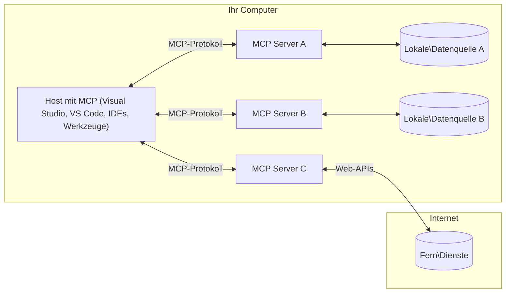

# MCP-Grundlagen: Das Model Context Protocol für die KI-Integration meistern

[](https://youtu.be/earDzWGtE84)

_(Klicken Sie auf das Bild oben, um das Video zu dieser Lektion anzusehen)_

Das [Model Context Protocol (MCP)](https://github.com/modelcontextprotocol) ist ein leistungsfähiges, standardisiertes Framework, das die Kommunikation zwischen großen Sprachmodellen (Large Language Models, LLMs) und externen Werkzeugen, Anwendungen und Datenquellen optimiert. 
Dieser Leitfaden führt Sie durch die Kernkonzepte von MCP. Sie lernen die Client-Server-Architektur, wichtige Komponenten, Kommunikationsmechanismen und bewährte Implementierungspraktiken kennen.

- **Explizite Einwilligung der Nutzer**: Für alle Datenzugriffe und Operationen ist eine ausdrückliche Genehmigung des Nutzers vor der Ausführung erforderlich. Die Nutzer müssen klar verstehen, auf welche Daten zugegriffen wird und welche Aktionen ausgeführt werden, mit granularer Kontrolle über Berechtigungen und Autorisierungen.

- **Schutz der Datenprivatsphäre**: Nutzerdaten dürfen nur mit ausdrücklicher Zustimmung offengelegt werden und müssen durch robuste Zugriffskontrollen während des gesamten Interaktionszyklus geschützt sein. Implementierungen müssen unbefugte Datenübertragungen verhindern und strikte Datenschutzgrenzen einhalten.

- **Sichere Ausführung von Werkzeugen**: Jeder Werkzeugaufruf erfordert die explizite Zustimmung des Nutzers mit klarer Kenntnis über Funktionalität, Parameter und möglichen Einfluss des Werkzeugs. Robuste Sicherheitsgrenzen müssen unbeabsichtigte, unsichere oder bösartige Werkzeugausführungen verhindern.

- **Sicherheit der Transportschicht**: Alle Kommunikationskanäle sollten geeignete Verschlüsselungs- und Authentifizierungsmechanismen verwenden. Fernverbindungen müssen sichere Transportprotokolle und ordnungsgemäßes Credential-Management implementieren.

#### Implementierungsrichtlinien:

- **Berechtigungsverwaltung**: Implementieren Sie fein abgestufte Berechtigungssysteme, die es Nutzern erlauben zu steuern, welche Server, Werkzeuge und Ressourcen zugänglich sind  
- **Authentifizierung & Autorisierung**: Nutzen Sie sichere Authentifizierungsmethoden (OAuth, API-Schlüssel) mit ordnungsgemäßem Token-Management und Ablaufdatum  
- **Eingabevalidierung**: Validieren Sie alle Parameter und Dateneingaben gemäß definierten Schemata, um Injektionsangriffe zu verhindern  
- **Audit-Protokolle**: Führen Sie umfassende Protokolle aller Operationen für Sicherheitsüberwachung und Compliance

## Überblick

Diese Lektion untersucht die grundlegende Architektur und die Komponenten, die das Model Context Protocol (MCP) Ökosystem bilden. Sie lernen die Client-Server-Architektur, Schlüsselfunktionen und Kommunikationsmechanismen kennen, die MCP-Interaktionen steuern.

## Wichtige Lernziele

Am Ende dieser Lektion werden Sie:

- Die MCP Client-Server-Architektur verstehen  
- Rollen und Verantwortlichkeiten von Hosts, Clients und Servern identifizieren  
- Die Kernfeatures analysieren, die MCP zu einer flexiblen Integrationsschicht machen  
- Lernen, wie Informationen innerhalb des MCP Ökosystems fließen  
- Praktische Einblicke durch Codebeispiele in .NET, Java, Python und JavaScript gewinnen

## MCP-Architektur: Ein genauerer Blick

Das MCP-Ökosystem basiert auf einem Client-Server-Modell. Diese modulare Struktur ermöglicht es KI-Anwendungen, effizient mit Werkzeugen, Datenbanken, APIs und kontextuellen Ressourcen zu interagieren. Lassen Sie uns diese Architektur in ihre Kernkomponenten zerlegen.

Im Kern folgt MCP einer Client-Server-Architektur, bei der eine Host-Anwendung Verbindungen zu mehreren Servern aufbauen kann:


- **MCP Hosts**: Programme wie VSCode, Claude Desktop, IDEs oder KI-Tools, die über MCP auf Daten zugreifen möchten  
- **MCP Clients**: Protokoll-Clients, die 1:1-Verbindungen zu Servern aufrechterhalten  
- **MCP Server**: Leichtgewichtige Programme, die jeweils spezifische Fähigkeiten über das standardisierte Model Context Protocol bereitstellen  
- **Lokale Datenquellen**: Dateien, Datenbanken und Dienste Ihres Rechners, auf die MCP-Server sicher zugreifen können  
- **Remote-Services**: Externe Systeme, die über das Internet verfügbar sind und mit denen MCP-Server über APIs verbunden werden können  

Das MCP-Protokoll ist ein sich entwickelnder Standard mit datumsbasierter Versionierung (Format JJJJ-MM-TT). Die aktuelle Protokollversion ist **2025-11-25**. Die neuesten Updates zur [Protokollspezifikation](https://modelcontextprotocol.io/specification/2025-11-25/) können Sie dort einsehen.

### 1. Hosts

Im Model Context Protocol (MCP) sind **Hosts** KI-Anwendungen, die als primäre Schnittstelle dienen, über die Nutzer mit dem Protokoll interagieren. Hosts koordinieren und verwalten Verbindungen zu mehreren MCP-Servern, indem sie für jede Serververbindung dedizierte MCP-Clients erstellen. Beispiele für Hosts sind:

- **KI-Anwendungen**: Claude Desktop, Visual Studio Code, Claude Code  
- **Entwicklungsumgebungen**: IDEs und Code-Editoren mit MCP-Integration  
- **Benutzerdefinierte Anwendungen**: Speziell entwickelte KI-Agenten und Werkzeuge  

**Hosts** sind Anwendungen, die KI-Modell-Interaktionen koordinieren. Sie:  

- **Orchestrieren KI-Modelle**: Führen LLMs aus oder interagieren mit ihnen, um Antworten zu generieren und KI-Workflows zu koordinieren  
- **Verwalten Client-Verbindungen**: Erstellen und pflegen pro MCP-Server-Verbindung einen MCP-Client  
- **Steuern die Benutzeroberfläche**: Verwalten den Gesprächsfluss, Nutzerinteraktionen und die Darstellung von Antworten  
- **Setzen Sicherheitsvorgaben durch**: Kontrollieren Berechtigungen, Sicherheitsbeschränkungen und Authentifizierung  
- **Handhaben Nutzerzustimmungen**: Verwalten Nutzerfreigaben für Datenfreigaben und Werkzeugausführung

### 2. Clients

**Clients** sind essentielle Komponenten, die dedizierte Eins-zu-Eins-Verbindungen zwischen Hosts und MCP-Servern aufrechterhalten. Jeder MCP-Client wird vom Host instanziiert, um eine Verbindung zu einem spezifischen MCP-Server herzustellen und so gut organisierte und sichere Kommunikationskanäle sicherzustellen. Mehrere Clients ermöglichen Hosts, gleichzeitig mit mehreren Servern verbunden zu sein.

**Clients** sind Verbindungs-Komponenten innerhalb der Host-Anwendung. Sie:

- **Protokollkommunikation**: Senden JSON-RPC 2.0-Anfragen mit Prompts und Anweisungen an Server  
- **Fähigkeitsverhandlung**: Verhandeln unterstützte Features und Protokollversionen mit Servern während der Initialisierung  
- **Werkzeugausführung**: Verwalten Werkzeugaufrufe von Modellen und verarbeiten Antworten  
- **Echtzeit-Updates**: Verarbeiten Benachrichtigungen und Echtzeit-Updates von Servern  
- **Antwortverarbeitung**: Verarbeiten und formatieren Serverantworten zur Darstellung für Nutzer

### 3. Server

**Server** sind Programme, die Kontext, Werkzeuge und Fähigkeiten für MCP-Clients bereitstellen. Sie können lokal (auf demselben Rechner wie der Host) oder remote (auf externen Plattformen) ausgeführt werden und sind zuständig für die Verarbeitung von Client-Anfragen und die Bereitstellung strukturierter Antworten. Server stellen spezifische Funktionalitäten über das standardisierte Model Context Protocol bereit.

**Server** sind Dienste, die Kontext und Fähigkeiten liefern. Sie:  

- **Feature-Registrierung**: Registrieren und stellen verfügbare Primitiven (Ressourcen, Prompts, Werkzeuge) für Clients bereit  
- **Anfrageverarbeitung**: Empfangen und führen Werkzeugaufrufe, Ressourcenanfragen und Prompt-Anfragen von Clients aus  
- **Kontextbereitstellung**: Stellen kontextuelle Informationen und Daten zur Verbesserung von Modellantworten bereit  
- **Zustandsverwaltung**: Pflegen Sitzungszustände und behandeln zustandsbehaftete Interaktionen, wenn nötig  
- **Echtzeit-Benachrichtigungen**: Senden Benachrichtigungen über Fähigkeitsänderungen und Updates an verbundene Clients

Server können von jedem entwickelt werden, um Modelfähigkeiten mit spezialisierten Funktionen zu erweitern, und unterstützen sowohl lokale als auch remote Bereitstellungsszenarien.

### 4. Server-Primitives

Server im Model Context Protocol (MCP) bieten drei Kern-**Primitiven**, die die grundlegenden Bausteine für reichhaltige Interaktionen zwischen Clients, Hosts und Sprachmodellen definieren. Diese Primitiven spezifizieren die Arten von kontextuellen Informationen und Aktionen, die über das Protokoll verfügbar sind.

MCP-Server können eine beliebige Kombination der folgenden drei Kern-Primitiven bereitstellen:

#### Ressourcen

**Ressourcen** sind Datenquellen, die kontextuelle Informationen für KI-Anwendungen bereitstellen. Sie repräsentieren statische oder dynamische Inhalte, die das Verständnis und die Entscheidungsfindung des Modells verbessern können:

- **Kontextuelle Daten**: Strukturierte Informationen und Kontext für die Nutzung durch das KI-Modell  
- **Wissensdatenbanken**: Dokumentenarchive, Artikel, Handbücher und Forschungspapiere  
- **Lokale Datenquellen**: Dateien, Datenbanken und lokale Systeminformationen  
- **Externe Daten**: API-Antworten, Webdienste und entfernte Systemdaten  
- **Dynamische Inhalte**: Echtzeitdaten, die sich basierend auf externen Bedingungen aktualisieren

Ressourcen sind durch URIs identifiziert und unterstützen das Auffinden über `resources/list` sowie das Abrufen über `resources/read` Methoden:

```text
file://documents/project-spec.md
database://production/users/schema
api://weather/current
```

#### Prompts

**Prompts** sind wiederverwendbare Vorlagen, die helfen, Interaktionen mit Sprachmodellen zu strukturieren. Sie bieten standardisierte Interaktionsmuster und vorgefertigte Abläufe:

- **Vorlagenbasierte Interaktionen**: Vorgefertigte Nachrichten und Gesprächsstarter  
- **Workflow-Vorlagen**: Standardisierte Abläufe für gängige Aufgaben und Interaktionen  
- **Few-shot-Beispiele**: Beispielbasierte Vorlagen für Modellanweisungen  
- **System-Prompts**: Grundlegende Prompts, die Modellverhalten und Kontext definieren  
- **Dynamische Vorlagen**: Parametrisierte Prompts, die sich an spezifische Kontexte anpassen

Prompts unterstützen die Variablenersetzung und können über `prompts/list` gefunden und mit `prompts/get` abgerufen werden:

```markdown
Generate a {{task_type}} for {{product}} targeting {{audience}} with the following requirements: {{requirements}}
```

#### Werkzeuge

**Werkzeuge** sind ausführbare Funktionen, die KI-Modelle aufrufen können, um bestimmte Aktionen auszuführen. Sie repräsentieren die "Verben" des MCP-Ökosystems und ermöglichen es Modellen, mit externen Systemen zu interagieren:

- **Ausführbare Funktionen**: Diskrete Operationen, die Modelle mit bestimmten Parametern aufrufen können  
- **Integration externer Systeme**: API-Aufrufe, Datenbankabfragen, Dateioperationen, Berechnungen  
- **Eindeutige Identität**: Jedes Werkzeug hat einen eindeutigen Namen, eine Beschreibung und ein Parameterschema  
- **Strukturierte I/O**: Werkzeuge akzeptieren validierte Parameter und liefern strukturierte, typisierte Antworten zurück  
- **Aktionsfähigkeiten**: Ermöglichen Modellen, reale Aktionen auszuführen und Live-Daten abzurufen

Werkzeuge sind mit JSON Schema für Parameter-Validierung definiert, werden über `tools/list` entdeckt und via `tools/call` ausgeführt. Werkzeuge können auch **Symbole** als zusätzliche Metadaten für bessere UI-Darstellung enthalten.

**Werkzeug-Anmerkungen**: Werkzeuge unterstützen Verhaltensannotations (z.B. `readOnlyHint`, `destructiveHint`), die beschreiben, ob ein Werkzeug nur lesend oder destruktiv ist, und helfen Clients, informierte Entscheidungen zur Werkzeugausführung zu treffen.

Beispiel für eine Werkzeugdefinition:

```typescript
server.tool(
  "search_products", 
  {
    query: z.string().describe("Search query for products"),
    category: z.string().optional().describe("Product category filter"),
    max_results: z.number().default(10).describe("Maximum results to return")
  }, 
  async (params) => {
    // Suche ausführen und strukturierte Ergebnisse zurückgeben
    return await productService.search(params);
  }
);
```

## Client-Primitives

Im Model Context Protocol (MCP) können **Clients** Primitiven anbieten, die es Servern ermöglichen, zusätzliche Fähigkeiten vom Host anzufordern. Diese clientseitigen Primitiven erlauben reichhaltigere, interaktivere Serverimplementierungen, die Zugriff auf KI-Modellfunktionalität und Nutzerinteraktionen haben.

### Sampling

**Sampling** ermöglicht es Servern, Vervollständigungen vom Sprachmodell über die KI-Anwendung des Clients anzufordern. Diese Primitive erlaubt Servern, auf LLM-Fähigkeiten zuzugreifen, ohne eigene Modell-Abhängigkeiten einzubetten:

- **Modellunabhängiger Zugriff**: Server können Vervollständigungen anfragen, ohne LLM-SDKs einzubinden oder Modellauslastung zu verwalten  
- **Serverinitiierte KI**: Ermöglicht Servern, autonom Inhalte mit dem Modell des Clients zu generieren  
- **Rekursive LLM-Interaktionen**: Unterstützt komplexe Szenarien, in denen Server KI-Unterstützung zur Verarbeitung benötigen  
- **Dynamische Inhaltserzeugung**: Server können kontextuelle Antworten mit dem Modell des Hosts erstellen  
- **Werkzeugaufruf-Unterstützung**: Server können `tools` und `toolChoice` Parameter einschließen, damit das Modell des Clients während des Samplings Werkzeuge aufruft

Sampling wird über die Methode `sampling/complete` gestartet, wobei Server Vervollständigungsanfragen an Clients senden.

### Roots

**Roots** bieten eine standardisierte Möglichkeit für Clients, Dateisystemgrenzen gegenüber Servern offenzulegen und so Servern zu helfen, zu verstehen, auf welche Verzeichnisse und Dateien sie Zugriff haben:

- **Dateisystemgrenzen**: Definieren die Bereiche, in denen Server innerhalb des Dateisystems operieren dürfen  
- **Zugriffskontrolle**: Helfen Servern zu verstehen, auf welche Verzeichnisse und Dateien sie Zugriff haben  
- **Dynamische Aktualisierungen**: Clients können Server benachrichtigen, wenn sich die Liste der Roots ändert  
- **URI-basierte Identifikation**: Roots verwenden `file://` URIs zur Identifikation zugänglicher Verzeichnisse und Dateien

Roots werden über die Methode `roots/list` entdeckt, Clients senden bei Änderungen `notifications/roots/list_changed`.

### Elicitation

**Elicitation** ermöglicht es Servern, über die Client-Oberfläche zusätzliche Informationen oder Bestätigungen von Nutzern anzufordern:

- **Anfragen für Nutzereingaben**: Server können bei Bedarf weitere Informationen für die Werkzeugausführung erfragen  
- **Bestätigungsdialoge**: Fordern Nutzerfreigaben für sensible oder einflussreiche Operationen an  
- **Interaktive Workflows**: Ermöglichen Servern, schrittweise Nutzerinteraktionen zu erstellen  
- **Dynamische Parametererfassung**: Erfassen fehlende oder optionale Parameter während der Werkzeugausführung

Elicitation-Anfragen werden mit der Methode `elicitation/request` gestellt, um Nutzereingaben über die Client-Schnittstelle einzuholen.

**URL-Modus für Elicitation**: Server können auch URL-basierte Nutzerinteraktionen anfragen, die Nutzer zu externen Webseiten für Authentifizierung, Bestätigung oder Dateneingabe weiterleiten.

### Logging

**Logging** erlaubt es Servern, strukturierte Lognachrichten an Clients zu senden, um Debugging, Monitoring und operative Sichtbarkeit zu unterstützen:

- **Debug-Unterstützung**: Ermöglichen Servern, detaillierte Ausführungsprotokolle zur Fehlerbehebung bereitzustellen  
- **Betriebsüberwachung**: Senden Statusupdates und Leistungskennzahlen an Clients  
- **Fehlermeldung**: Liefern detaillierte Fehlerkontexte und Diagnoseinformationen  
- **Audit-Trails**: Erstellen umfassende Protokolle über Serveroperationen und Entscheidungen

Logging-Nachrichten werden an Clients gesendet, um Transparenz über Serveroperationen zu schaffen und das Debugging zu erleichtern.

## Informationsfluss im MCP

Das Model Context Protocol (MCP) definiert einen strukturierten Informationsfluss zwischen Hosts, Clients, Servern und Modellen. Das Verständnis dieses Flusses hilft, zu klären, wie Nutzeranfragen verarbeitet werden und wie externe Werkzeuge und Daten in Modellantworten integriert werden.
- **Host initiiert Verbindung**  
  Die Host-Anwendung (wie eine IDE oder eine Chat-Oberfläche) stellt eine Verbindung zu einem MCP-Server her, typischerweise über STDIO, WebSocket oder ein anderes unterstütztes Transportprotokoll.

- **Fähigkeitsverhandlung**  
  Der Client (eingebettet im Host) und der Server tauschen Informationen über ihre unterstützten Funktionen, Werkzeuge, Ressourcen und Protokollversionen aus. Dies stellt sicher, dass beide Seiten verstehen, welche Fähigkeiten für die Sitzung verfügbar sind.

- **Benutzeranfrage**  
  Der Benutzer interagiert mit dem Host (z. B. gibt er eine Eingabeaufforderung oder einen Befehl ein). Der Host sammelt diese Eingaben und leitet sie zur Verarbeitung an den Client weiter.

- **Verwendung von Ressourcen oder Werkzeugen**  
  - Der Client kann beim Server zusätzliche Kontextinformationen oder Ressourcen anfordern (wie Dateien, Datenbankeinträge oder Wissensdatenbankartikel), um das Verständnis des Modells zu bereichern.  
  - Wenn das Modell feststellt, dass ein Werkzeug benötigt wird (z. B. um Daten abzurufen, eine Berechnung durchzuführen oder eine API aufzurufen), sendet der Client eine Werkzeugaufruf-Anfrage an den Server, in der der Werkzeugname und die Parameter spezifiziert sind.

- **Serverausführung**  
  Der Server erhält die Anfrage für Ressource oder Werkzeug, führt die notwendigen Operationen aus (wie eine Funktion ausführen, eine Datenbank abfragen oder eine Datei abrufen) und gibt die Ergebnisse strukturiert an den Client zurück.

- **Antwortgenerierung**  
  Der Client integriert die Antworten des Servers (Ressourcendaten, Werkzeugergebnisse usw.) in die laufende Modellinteraktion. Das Modell nutzt diese Informationen, um eine umfassende und kontextuell relevante Antwort zu erstellen.

- **Ergebnispräsentation**  
  Der Host erhält die finale Ausgabe vom Client und präsentiert sie dem Benutzer, häufig einschließlich des vom Modell generierten Textes und aller Ergebnisse aus Werkzeugausführungen oder Ressourcensuchen.

Dieser Ablauf ermöglicht es MCP, fortschrittliche, interaktive und kontextbewusste KI-Anwendungen zu unterstützen, indem Modelle nahtlos mit externen Werkzeugen und Datenquellen verbunden werden.

## Protokollarchitektur & Schichten

MCP besteht aus zwei verschiedenen architektonischen Schichten, die zusammenarbeiten, um ein vollständiges Kommunikationsframework bereitzustellen:

### Datenschicht

Die **Datenschicht** implementiert das Kernprotokoll von MCP basierend auf **JSON-RPC 2.0**. Diese Schicht definiert die Nachrichtenstruktur, Semantik und Interaktionsmuster:

#### Kernkomponenten:

- **JSON-RPC 2.0 Protokoll**: Alle Kommunikation verwendet das standardisierte JSON-RPC 2.0 Nachrichtenformat für Methodenaufrufe, Antworten und Benachrichtigungen  
- **Lebenszyklusmanagement**: Handhabt Verbindungsinitialisierung, Fähigkeitsverhandlung und Sitzungsbeendigung zwischen Clients und Servern  
- **Serverprimitive**: Ermöglicht Servern, Kernfunktionalität über Werkzeuge, Ressourcen und Prompts bereitzustellen  
- **Clientprimitive**: Ermöglicht Servern, Abfragen von LLMs anzufordern, Benutzereingaben einzuholen und Log-Nachrichten zu senden  
- **Echtzeitbenachrichtigungen**: Unterstützt asynchrone Benachrichtigungen für dynamische Updates ohne Abfragen

#### Hauptmerkmale:

- **Protokollversionsverhandlung**: Verwendet datumsbasierte Versionierung (JJJJ-MM-TT) zur Sicherstellung der Kompatibilität  
- **Fähigkeitsentdeckung**: Clients und Server tauschen unterstützte Funktionen während der Initialisierung aus  
- **Statusbehaftete Sitzungen**: Pflegt Verbindungszustände über mehrere Interaktionen hinweg für Kontextkontinuität

### Transportschicht

Die **Transportschicht** verwaltet Kommunikationskanäle, Nachrichtenrahmung und Authentifizierung zwischen MCP-Teilnehmern:

#### Unterstützte Transportmechanismen:

1. **STDIO-Transport**:  
   - Verwendet Standard-Eingabe/-Ausgabe-Streams für direkte Prozesskommunikation  
   - Optimal für lokale Prozesse auf derselben Maschine ohne Netzwerklatenz  
   - Häufig verwendet für lokale MCP-Serverimplementierungen

2. **Streambarer HTTP-Transport**:  
   - Verwendet HTTP POST für Client-zu-Server Nachrichten  
   - Optional Server-Sent Events (SSE) für serverseitiges Streaming zum Client  
   - Ermöglicht Kommunikation mit entfernten Servern über Netzwerke  
   - Unterstützt standardmäßige HTTP-Authentifizierung (Bearer Tokens, API-Schlüssel, benutzerdefinierte Header)  
   - MCP empfiehlt OAuth für sichere tokenbasierte Authentifizierung

#### Transportabstraktion:

Die Transportschicht entkoppelt die Kommunikationsdetails von der Datenschicht, so dass dasselbe JSON-RPC 2.0 Nachrichtenformat über alle Transportmechanismen genutzt werden kann. Diese Abstraktion erlaubt es Anwendungen, nahtlos zwischen lokalen und entfernten Servern zu wechseln.

### Sicherheitsüberlegungen

MCP-Implementierungen müssen mehrere wesentliche Sicherheitsprinzipien einhalten, um sichere, vertrauenswürdige und sichere Interaktionen über alle Protokolloperationen hinweg sicherzustellen:

- **Benutzereinwilligung und Kontrolle**: Benutzer müssen explizit zustimmen, bevor Daten zugänglich gemacht oder Operationen ausgeführt werden. Sie sollten klare Kontrolle darüber haben, welche Daten geteilt und welche Aktionen autorisiert werden, unterstützt durch intuitive Benutzeroberflächen zur Überprüfung und Genehmigung von Aktivitäten.

- **Datenschutz**: Benutzerdaten dürfen nur mit ausdrücklicher Zustimmung offengelegt und müssen durch angemessene Zugriffskontrollen geschützt werden. MCP-Implementierungen müssen unbefugte Datenübertragung verhindern und sicherstellen, dass Datenschutz während aller Interaktionen gewahrt bleibt.

- **Werkzeugsicherheit**: Vor dem Aufruf eines Werkzeugs ist eine explizite Benutzereinwilligung erforderlich. Nutzer sollten eine klare Vorstellung von der Funktionalität jedes Werkzeugs haben, und robuste Sicherheitsgrenzen müssen eingehalten werden, um unbeabsichtigte oder unsichere Werkzeugausführungen zu verhindern.

Durch die Einhaltung dieser Sicherheitsprinzipien gewährleistet MCP, dass Benutzervertrauen, Datenschutz und Sicherheit über alle Protokollinteraktionen hinweg gewahrt bleiben und gleichzeitig leistungsstarke KI-Integrationen ermöglicht werden.

## Codebeispiele: Hauptkomponenten

Nachfolgend finden sich Codebeispiele in mehreren gängigen Programmiersprachen, die zeigen, wie man zentrale MCP-Serverkomponenten und Werkzeuge implementiert.

### .NET Beispiel: Erstellen eines einfachen MCP-Servers mit Werkzeugen

Hier ein praktisches .NET-Codebeispiel, das zeigt, wie man einen einfachen MCP-Server mit benutzerdefinierten Werkzeugen implementiert. Dieses Beispiel verdeutlicht, wie Werkzeuge definiert und registriert, Anfragen verarbeitet und der Server mittels des Model Context Protocol verbunden wird.

```csharp
using System;
using System.Threading.Tasks;
using ModelContextProtocol.Server;
using ModelContextProtocol.Server.Transport;
using ModelContextProtocol.Server.Tools;

public class WeatherServer
{
    public static async Task Main(string[] args)
    {
        // Create an MCP server
        var server = new McpServer(
            name: "Weather MCP Server",
            version: "1.0.0"
        );
        
        // Register our custom weather tool
        server.AddTool<string, WeatherData>("weatherTool", 
            description: "Gets current weather for a location",
            execute: async (location) => {
                // Call weather API (simplified)
                var weatherData = await GetWeatherDataAsync(location);
                return weatherData;
            });
        
        // Connect the server using stdio transport
        var transport = new StdioServerTransport();
        await server.ConnectAsync(transport);
        
        Console.WriteLine("Weather MCP Server started");
        
        // Keep the server running until process is terminated
        await Task.Delay(-1);
    }
    
    private static async Task<WeatherData> GetWeatherDataAsync(string location)
    {
        // This would normally call a weather API
        // Simplified for demonstration
        await Task.Delay(100); // Simulate API call
        return new WeatherData { 
            Temperature = 72.5,
            Conditions = "Sunny",
            Location = location
        };
    }
}

public class WeatherData
{
    public double Temperature { get; set; }
    public string Conditions { get; set; }
    public string Location { get; set; }
}
```

### Java Beispiel: MCP-Serverkomponenten

Dieses Beispiel zeigt denselben MCP-Server und die Werkzeugregistrierung wie das .NET-Beispiel oben, jedoch in Java implementiert.

```java
import io.modelcontextprotocol.server.McpServer;
import io.modelcontextprotocol.server.McpToolDefinition;
import io.modelcontextprotocol.server.transport.StdioServerTransport;
import io.modelcontextprotocol.server.tool.ToolExecutionContext;
import io.modelcontextprotocol.server.tool.ToolResponse;

public class WeatherMcpServer {
    public static void main(String[] args) throws Exception {
        // Erstellen Sie einen MCP-Server
        McpServer server = McpServer.builder()
            .name("Weather MCP Server")
            .version("1.0.0")
            .build();
            
        // Registrieren Sie ein Wetter-Tool
        server.registerTool(McpToolDefinition.builder("weatherTool")
            .description("Gets current weather for a location")
            .parameter("location", String.class)
            .execute((ToolExecutionContext ctx) -> {
                String location = ctx.getParameter("location", String.class);
                
                // Holen Sie Wetterdaten (vereinfacht)
                WeatherData data = getWeatherData(location);
                
                // Rückgabe der formatierten Antwort
                return ToolResponse.content(
                    String.format("Temperature: %.1f°F, Conditions: %s, Location: %s", 
                    data.getTemperature(), 
                    data.getConditions(), 
                    data.getLocation())
                );
            })
            .build());
        
        // Verbinden Sie den Server über stdio-Transport
        try (StdioServerTransport transport = new StdioServerTransport()) {
            server.connect(transport);
            System.out.println("Weather MCP Server started");
            // Server am Laufen halten, bis der Prozess beendet wird
            Thread.currentThread().join();
        }
    }
    
    private static WeatherData getWeatherData(String location) {
        // Die Implementierung würde eine Wetter-API aufrufen
        // Vereinfachte Version zu Beispielzwecken
        return new WeatherData(72.5, "Sunny", location);
    }
}

class WeatherData {
    private double temperature;
    private String conditions;
    private String location;
    
    public WeatherData(double temperature, String conditions, String location) {
        this.temperature = temperature;
        this.conditions = conditions;
        this.location = location;
    }
    
    public double getTemperature() {
        return temperature;
    }
    
    public String getConditions() {
        return conditions;
    }
    
    public String getLocation() {
        return location;
    }
}
```

### Python Beispiel: Aufbau eines MCP-Servers

Dieses Beispiel verwendet fastmcp, bitte stellen Sie sicher, dass es zuerst installiert ist:

```python
pip install fastmcp
```
Code-Beispiel:

```python
#!/usr/bin/env python3
import asyncio
from fastmcp import FastMCP
from fastmcp.transports.stdio import serve_stdio

# Erstelle einen FastMCP Server
mcp = FastMCP(
    name="Weather MCP Server",
    version="1.0.0"
)

@mcp.tool()
def get_weather(location: str) -> dict:
    """Gets current weather for a location."""
    return {
        "temperature": 72.5,
        "conditions": "Sunny",
        "location": location
    }

# Alternative Vorgehensweise mit einer Klasse
class WeatherTools:
    @mcp.tool()
    def forecast(self, location: str, days: int = 1) -> dict:
        """Gets weather forecast for a location for the specified number of days."""
        return {
            "location": location,
            "forecast": [
                {"day": i+1, "temperature": 70 + i, "conditions": "Partly Cloudy"}
                for i in range(days)
            ]
        }

# Registriere Klassentools
weather_tools = WeatherTools()

# Starte den Server
if __name__ == "__main__":
    asyncio.run(serve_stdio(mcp))
```

### JavaScript Beispiel: Erstellung eines MCP-Servers

Dieses Beispiel zeigt die Erstellung eines MCP-Servers in JavaScript und wie zwei wetterbezogene Werkzeuge registriert werden.

```javascript
// Verwendung des offiziellen Model Context Protocol SDK
import { McpServer } from "@modelcontextprotocol/sdk/server/mcp.js";
import { StdioServerTransport } from "@modelcontextprotocol/sdk/server/stdio.js";
import { z } from "zod"; // Zur Parameterüberprüfung

// Erstellen eines MCP-Servers
const server = new McpServer({
  name: "Weather MCP Server",
  version: "1.0.0"
});

// Definieren eines Wetter-Tools
server.tool(
  "weatherTool",
  {
    location: z.string().describe("The location to get weather for")
  },
  async ({ location }) => {
    // Dies würde normalerweise eine Wetter-API aufrufen
    // Für die Demonstration vereinfacht
    const weatherData = await getWeatherData(location);
    
    return {
      content: [
        { 
          type: "text", 
          text: `Temperature: ${weatherData.temperature}°F, Conditions: ${weatherData.conditions}, Location: ${weatherData.location}` 
        }
      ]
    };
  }
);

// Definieren eines Vorhersage-Tools
server.tool(
  "forecastTool",
  {
    location: z.string(),
    days: z.number().default(3).describe("Number of days for forecast")
  },
  async ({ location, days }) => {
    // Dies würde normalerweise eine Wetter-API aufrufen
    // Für die Demonstration vereinfacht
    const forecast = await getForecastData(location, days);
    
    return {
      content: [
        { 
          type: "text", 
          text: `${days}-day forecast for ${location}: ${JSON.stringify(forecast)}` 
        }
      ]
    };
  }
);

// Hilfsfunktionen
async function getWeatherData(location) {
  // API-Aufruf simulieren
  return {
    temperature: 72.5,
    conditions: "Sunny",
    location: location
  };
}

async function getForecastData(location, days) {
  // API-Aufruf simulieren
  return Array.from({ length: days }, (_, i) => ({
    day: i + 1,
    temperature: 70 + Math.floor(Math.random() * 10),
    conditions: i % 2 === 0 ? "Sunny" : "Partly Cloudy"
  }));
}

// Verbindung des Servers über stdio-Transport herstellen
const transport = new StdioServerTransport();
server.connect(transport).catch(console.error);

console.log("Weather MCP Server started");
```

Dieses JavaScript-Beispiel demonstriert, wie man einen MCP-Server erstellt, der wetterbezogene Werkzeuge registriert und sich über stdio-Transport verbindet, um eingehende Client-Anfragen zu verarbeiten.

## Sicherheit und Autorisierung

MCP beinhaltet verschiedene eingebaute Konzepte und Mechanismen zur Verwaltung von Sicherheit und Autorisierung im gesamten Protokoll:

1. **Werkzeug-Berechtigungskontrolle**:  
  Clients können festlegen, welche Werkzeuge ein Modell während einer Sitzung nutzen darf. Dies stellt sicher, dass nur explizit autorisierte Werkzeuge zugänglich sind und verringert das Risiko unbeabsichtigter oder unsicherer Operationen. Berechtigungen können dynamisch basierend auf Benutzerpräferenzen, organisatorischen Richtlinien oder dem Kontext der Interaktion konfiguriert werden.

2. **Authentifizierung**:  
  Server können vor dem Zugriff auf Werkzeuge, Ressourcen oder sensible Operationen eine Authentifizierung verlangen. Dies kann API-Schlüssel, OAuth-Token oder andere Authentifizierungsschemata umfassen. Eine ordnungsgemäße Authentifizierung stellt sicher, dass nur vertrauenswürdige Clients und Benutzer Serverfunktionen aufrufen dürfen.

3. **Validierung**:  
  Die Parameter aller Werkzeugaufrufe werden validiert. Jedes Werkzeug definiert die erwarteten Typen, Formate und Einschränkungen für seine Parameter, und der Server überprüft entsprechend eingehende Anfragen. Dies verhindert, dass fehlerhafte oder bösartige Eingaben in Werkzeugimplementierungen gelangen, und trägt zur Integrität der Operationen bei.

4. **Ratenbegrenzung**:  
  Um Missbrauch zu verhindern und eine faire Nutzung von Serverressourcen zu gewährleisten, können MCP-Server Ratenbegrenzungen für Werkzeugaufrufe und Ressourcen-Zugriffe implementieren. Ratenbegrenzungen können pro Benutzer, pro Sitzung oder global angewendet werden und schützen vor Denial-of-Service-Angriffen oder übermäßigem Ressourcenverbrauch.

Durch die Kombination dieser Mechanismen bietet MCP eine sichere Grundlage zur Integration von Sprachmodellen mit externen Werkzeugen und Datenquellen, während Benutzer und Entwickler detaillierte Kontrolle über Zugriff und Nutzung behalten.

## Protokollnachrichten & Kommunikationsablauf

Die MCP-Kommunikation verwendet strukturierte **JSON-RPC 2.0**-Nachrichten, um klare und zuverlässige Interaktionen zwischen Hosts, Clients und Servern zu ermöglichen. Das Protokoll definiert spezifische Nachrichtenmuster für verschiedene Arten von Operationen:

### Kernnachrichtentypen:

#### **Initialisierungsnachrichten**
- **`initialize` Anfrage**: Stellt die Verbindung her und verhandelt Protokollversion und Fähigkeiten  
- **`initialize` Antwort**: Bestätigt unterstützte Funktionen und Serverinformationen  
- **`notifications/initialized`**: Signalisiert, dass die Initialisierung abgeschlossen ist und die Sitzung bereitsteht

#### **Entdeckungsnachrichten**
- **`tools/list` Anfrage**: Erkennt verfügbare Werkzeuge vom Server  
- **`resources/list` Anfrage**: Listet verfügbare Ressourcen (Datenquellen) auf  
- **`prompts/list` Anfrage**: Ruft verfügbare Prompt-Vorlagen ab

#### **Ausführungsnachrichten**  
- **`tools/call` Anfrage**: Führt ein spezifisches Werkzeug mit bereitgestellten Parametern aus  
- **`resources/read` Anfrage**: Ruft Inhalt einer spezifischen Ressource ab  
- **`prompts/get` Anfrage**: Holt eine Prompt-Vorlage mit optionalen Parametern

#### **Client-seitige Nachrichten**
- **`sampling/complete` Anfrage**: Server fordert Completion eines LLMs vom Client an  
- **`elicitation/request`**: Server fordert Benutzereingabe über die Client-Oberfläche an  
- **Logging-Nachrichten**: Server sendet strukturierte Log-Nachrichten an den Client

#### **Benachrichtigungsnachrichten**
- **`notifications/tools/list_changed`**: Server informiert Client über Werkzeugänderungen  
- **`notifications/resources/list_changed`**: Server informiert Client über Ressourcenänderungen  
- **`notifications/prompts/list_changed`**: Server informiert Client über Änderungen bei Prompts

### Nachrichtenaufbau:

Alle MCP-Nachrichten folgen dem JSON-RPC 2.0 Format mit:  
- **Anfragenachrichten**: Enthalten `id`, `method` und optionale `params`  
- **Antwortnachrichten**: Enthalten `id` und entweder `result` oder `error`  
- **Benachrichtigungsnachrichten**: Enthalten `method` und optionale `params` (keine `id` oder erwartete Antwort)

Diese strukturierte Kommunikation gewährleistet zuverlässige, nachvollziehbare und erweiterbare Interaktionen, die fortgeschrittene Szenarien wie Echtzeitupdates, Werkzeugverkettung und robuste Fehlerbehandlung unterstützen.

### Aufgaben (Experimentell)

**Aufgaben** sind ein experimentelles Feature, das langlebige Ausführungshüllen bereitstellt und verzögertes Abrufen von Ergebnissen sowie Statusverfolgung für MCP-Anfragen ermöglicht:

- **Langlaufende Operationen**: Verfolgen kostenintensive Berechnungen, Workflow-Automatisierungen und Batch-Verarbeitung  
- **Verzögerte Ergebnisse**: Status von Aufgaben abfragen und Ergebnisse abrufen, wenn Operationen abgeschlossen sind  
- **Statusverfolgung**: Überwachen des Aufgabenfortschritts durch definierte Lebenszykluszustände  
- **Mehrstufige Operationen**: Unterstützt komplexe Workflows, die über mehrere Interaktionen verteilt sind

Aufgaben kapseln Standard-MCP-Anfragen, um asynchrone Ausführungsmuster für Operationen zu ermöglichen, die nicht sofort abgeschlossen werden können.

## Zentrale Erkenntnisse

- **Architektur**: MCP nutzt eine Client-Server-Architektur, bei der Hosts mehrere Clientverbindungen zu Servern verwalten  
- **Teilnehmer**: Das Ökosystem umfasst Hosts (KI-Anwendungen), Clients (Protokollconnectoren) und Server (Fähigkeitsanbieter)  
- **Transportmechanismen**: Die Kommunikation unterstützt STDIO (lokal) und Streamable HTTP mit optionalem SSE (remote)  
- **Kernprimitive**: Server bieten Werkzeuge (ausführbare Funktionen), Ressourcen (Datenquellen) und Prompts (Vorlagen) an  
- **Clientprimitive**: Server können Sampling (LLM-Completions mit Werkzeugaufruf-Unterstützung), Elicitation (Benutzereingaben einschließlich URL-Modus), Roots (Dateisystem-Grenzen) und Logging vom Client anfordern  
- **Experimentelle Features**: Tasks bieten langlebige Ausführungshüllen für langlaufende Operationen  
- **Protokollgrundlage**: Basierend auf JSON-RPC 2.0 mit datumsbasierter Versionierung (aktuell: 2025-11-25)  
- **Echtzeitfähigkeiten**: Unterstützt Benachrichtigungen für dynamische Updates und Echtzeitsynchronisation  
- **Sicherheit zuerst**: Explizite Benutzereinwilligung, Datenschutz und sicherer Transport sind Kernanforderungen

## Übung

Entwerfen Sie ein einfaches MCP-Werkzeug, das in Ihrem Fachgebiet nützlich wäre. Definieren Sie:  
1. Wie das Werkzeug heißen würde  
2. Welche Parameter es akzeptieren würde  
3. Welche Ausgabe es liefern würde  
4. Wie ein Modell dieses Werkzeug verwenden könnte, um Benutzerprobleme zu lösen

---

## Was als Nächstes

Weiter zu: [Kapitel 2: Sicherheit](../02-Security/README.md)

---

<!-- CO-OP TRANSLATOR DISCLAIMER START -->
**Haftungsausschluss**:  
Dieses Dokument wurde mit dem KI-Übersetzungsdienst [Co-op Translator](https://github.com/Azure/co-op-translator) übersetzt. Obwohl wir uns um Genauigkeit bemühen, können automatisierte Übersetzungen Fehler oder Ungenauigkeiten enthalten. Das Originaldokument in seiner Ausgangssprache ist als maßgebliche Quelle zu betrachten. Für wichtige Informationen wird eine professionelle menschliche Übersetzung empfohlen. Wir übernehmen keine Haftung für Missverständnisse oder Fehlinterpretationen, die durch die Verwendung dieser Übersetzung entstehen.
<!-- CO-OP TRANSLATOR DISCLAIMER END -->