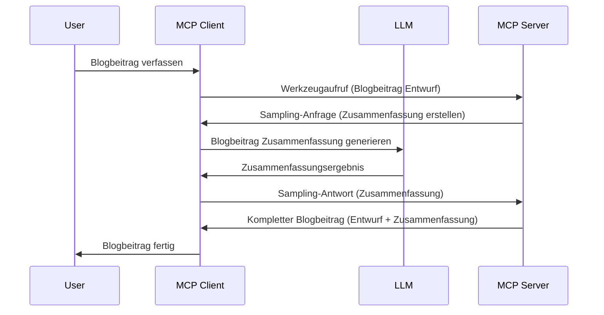

# Sampling – Funktionen an den Client delegieren

Manchmal müssen der MCP Client und der MCP Server zusammenarbeiten, um ein gemeinsames Ziel zu erreichen. Es kann sein, dass der Server die Hilfe eines LLM benötigt, das auf dem Client läuft. Für diese Situation sollten Sie Sampling verwenden.

Lassen Sie uns einige Anwendungsfälle und den Aufbau einer Lösung mit Sampling erkunden.

## Überblick

In dieser Lektion konzentrieren wir uns darauf, zu erklären, wann und wo Sampling eingesetzt werden sollte und wie man es konfiguriert.

## Lernziele

In diesem Kapitel werden wir:

- Erklären, was Sampling ist und wann man es verwendet.
- Zeigen, wie man Sampling in MCP konfiguriert.
- Beispiele für den Einsatz von Sampling geben.

## Was ist Sampling und warum sollte man es nutzen?

Sampling ist eine erweiterte Funktion, die folgendermaßen arbeitet:



### Sampling-Anfrage

Ok, jetzt haben wir einen Überblick über ein realistisches Szenario, sprechen wir über die Sampling-Anfrage, die der Server an den Client zurücksendet. So könnte eine solche Anfrage im JSON-RPC-Format aussehen:

```json
{
  "jsonrpc": "2.0",
  "id": 1,
  "method": "sampling/createMessage",
  "params": {
    "messages": [
      {
        "role": "user",
        "content": {
          "type": "text",
          "text": "Create a blog post summary of the following blog post: <BLOG POST>"
        }
      }
    ],
    "modelPreferences": {
      "hints": [
        {
          "name": "claude-3-sonnet"
        }
      ],
      "intelligencePriority": 0.8,
      "speedPriority": 0.5
    },
    "systemPrompt": "You are a helpful assistant.",
    "maxTokens": 100
  }
}
```

Hier gibt es ein paar Punkte, die erwähnenswert sind:

- Prompt, unter content -> text, ist unser Prompt, also eine Anweisung an das LLM, den Blogbeitrag zusammenzufassen.

- **modelPreferences**. Dieser Bereich ist genau das: eine Präferenz, eine Empfehlung, welche Konfiguration für das LLM verwendet werden sollte. Der Benutzer kann wählen, ob er diese Empfehlungen übernimmt oder ändert. In diesem Fall gibt es Empfehlungen zum Modell sowie Prioritäten bezüglich Geschwindigkeit und Intelligenz.
- **systemPrompt**, dies ist Ihr normaler System-Prompt, der Ihrem LLM eine Persönlichkeit verleiht und Anleitung enthält.
- **maxTokens**, eine weitere Eigenschaft, die angibt, wie viele Tokens für diese Aufgabe empfohlen werden.

### Sampling-Antwort

Diese Antwort ist das, was der MCP Client schließlich an den MCP Server zurücksendet und das Ergebnis des Aufrufs des LLM durch den Client darstellt, nachdem dieser auf die Antwort gewartet und dann diese Nachricht konstruiert hat. So könnte sie im JSON-RPC aussehen:

```json
{
  "jsonrpc": "2.0",
  "id": 1,
  "result": {
    "role": "assistant",
    "content": {
      "type": "text",
      "text": "Here's your abstract <ABSTRACT>"
    },
    "model": "gpt-5",
    "stopReason": "endTurn"
  }
}
```

Beachten Sie, dass die Antwort eine Zusammenfassung des Blogbeitrags ist, genau wie wir es verlangt haben. Ebenso sehen Sie, dass das verwendete `model` nicht das war, das wir angefragt hatten, sondern "gpt-5" anstelle von "claude-3-sonnet". Das verdeutlicht, dass der Benutzer seine Meinung darüber ändern kann, welches Modell er verwenden möchte, und dass Ihre Sampling-Anfrage eine Empfehlung ist.

Ok, nun da wir den Hauptfluss verstanden haben und es eine nützliche Aufgabe für "Blogbeitragserstellung + Zusammenfassung" ist, schauen wir uns an, was wir tun müssen, damit es funktioniert.

### Nachrichtentypen

Sampling-Nachrichten sind nicht nur auf Text beschränkt, sondern Sie können auch Bilder und Audio senden. So sieht das JSON-RPC unterschiedlich aus:

**Text**

```json
{
  "type": "text",
  "text": "The message content"
}
```

**Bildinhalt**

```json
{
  "type": "image",
  "data": "base64-encoded-image-data",
  "mimeType": "image/jpeg"
}
```

**Audioinhalt**

```json
{
  "type": "audio",
  "data": "base64-encoded-audio-data",
  "mimeType": "audio/wav"
}
```

> HINWEIS: Für detailliertere Informationen zu Sampling schauen Sie in die [offizielle Dokumentation](https://modelcontextprotocol.io/specification/2025-11-25/client/sampling)

## Wie konfiguriert man Sampling im Client

> Hinweis: Wenn Sie nur einen Server erstellen, müssen Sie hier nicht viel tun.

In einem Client müssen Sie die folgende Funktion so angeben:

```json
{
  "capabilities": {
    "sampling": {}
  }
}
```

Diese wird dann beim Starten des gewählten Clients mit dem Server berücksichtigt.

## Beispiel für Sampling in Aktion – Einen Blogbeitrag erstellen

Lassen Sie uns gemeinsam einen Sampling-Server programmieren, wir müssen folgendes tun:

1. Ein Tool auf dem Server erstellen.
1. Dieses Tool soll eine Sampling-Anfrage erzeugen.
1. Das Tool wartet darauf, dass die Sampling-Anfrage des Clients beantwortet wird.
1. Danach soll das Ergebnis des Tools generiert werden.

Schauen wir uns den Code Schritt für Schritt an:

### -1- Das Tool erstellen

**python**

```python
@mcp.tool()
async def create_blog(title: str, content: str, ctx: Context[ServerSession, None]) -> str:
    """Create a blog post and generate a summary"""

```

### -2- Eine Sampling-Anfrage erstellen

Erweitern Sie Ihr Tool mit folgendem Code:

**python**

```python
post = BlogPost(
        id=len(posts) + 1,
        title=title,
        content=content,
        abstract=""
    )

prompt = f"Create an abstract of the following blog post: title: {title} and draft: {content} "

result = await ctx.session.create_message(
        messages=[
            SamplingMessage(
                role="user",
                content=TextContent(type="text", text=prompt),
            )
        ],
        max_tokens=100,
)

```

### -3- Auf die Antwort warten und Antwort zurückgeben

**python**

```python
post.abstract = result.content.text

posts.append(post)

# das komplette Produkt zurückgeben
return json.dumps({
    "id": post.title,
    "abstract": post.abstract
})
```

### -4- Vollständiger Code

**python**

```python
from starlette.applications import Starlette
from starlette.routing import Mount, Host

from mcp.server.fastmcp import Context, FastMCP

from mcp.server.session import ServerSession
from mcp.types import SamplingMessage, TextContent

import json


from uuid import uuid4
from typing import List
from pydantic import BaseModel


mcp = FastMCP("Blog post generator")

# app = FastAPI()

posts = []

class BlogPost(BaseModel):
    id: int
    title: str
    content: str
    abstract: str

posts: List[BlogPost] = []

@mcp.tool()
async def create_blog(title: str, content: str, ctx: Context[ServerSession, None]) -> str:
    """Create a blog post and generate a summary"""

    post = BlogPost(
        id=len(posts) + 1,
        title=title,
        content=content,
        abstract=""
    )

    prompt = f"Create an abstract of the following blog post: title: {title} and draft: {content} "

    result = await ctx.session.create_message(
        messages=[
            SamplingMessage(
                role="user",
                content=TextContent(type="text", text=prompt),
            )
        ],
        max_tokens=100,
    )

    post.abstract = result.content.text

    posts.append(post)

    # gib den kompletten Blogbeitrag zurück
    return json.dumps({
        "id": post.title,
        "abstract": post.abstract
    })

if __name__ == "__main__":
    print("Starting server...")
    # mcp.run()
    mcp.run(transport="streamable-http")

# starte die App mit: python server.py
```

### -5- Testen in Visual Studio Code

Um das in Visual Studio Code zu testen, gehen Sie wie folgt vor:

1. Server im Terminal starten
1. Fügen Sie es zu *mcp.json* hinzu (und stellen Sie sicher, dass es gestartet ist), z.B. so:

   ```json
   "servers": {
      "blog-server": {
        "type": "http",
        "url": "http://localhost:8000/mcp"
      }
   }
   ```

1. Einen Prompt eingeben:

   ```text
   create a blog post named "Where Python comes from", the content is "Python is actually named after Monty Python Flying Circus"
   ```

1. Sampling zulassen. Beim ersten Test wird Ihnen ein zusätzlicher Dialog angezeigt, den Sie akzeptieren müssen, danach sehen Sie den normalen Dialog zur Ausführung eines Tools.

1. Ergebnisse prüfen. Sie sehen die Ergebnisse sowohl schön gerendert in GitHub Copilot Chat, können aber auch die rohe JSON-Antwort inspizieren.

**Bonus**. Die Visual Studio Code-Tools bieten großartige Unterstützung für Sampling. Sie können den Sampling-Zugang auf Ihrem installierten Server folgendermaßen konfigurieren:

1. Navigieren Sie zum Erweiterungsbereich.
1. Wählen Sie das Zahnrad-Symbol für Ihren installierten Server im Bereich "MCP SERVERS - INSTALLED".
1 Wählen Sie "Configure Model Access", hier können Sie auswählen, welche Modelle GitHub Copilot beim Sampling verwenden darf. Sie können auch alle kürzlich stattgefundenen Sampling-Anfragen unter "Show Sampling requests" einsehen.

## Aufgabe

In dieser Aufgabe werden Sie ein etwas anderes Sampling bauen, nämlich eine Sampling-Integration, die die Generierung einer Produktbeschreibung unterstützt. Hier ist Ihr Szenario:

**Szenario**: Der Backoffice-Mitarbeiter eines E-Commerce benötigt Hilfe, da die Erstellung von Produktbeschreibungen zu viel Zeit in Anspruch nimmt. Daher sollen Sie eine Lösung bauen, bei der Sie ein Tool "create_product" mit den Argumenten "title" und "keywords" aufrufen können, und es soll ein vollständiges Produkt einschließlich eines "description"-Feldes erzeugt werden, das vom LLM des Clients ausgefüllt wird.

TIPP: Verwenden Sie das, was Sie zuvor gelernt haben, um diesen Server und sein Tool mit einer Sampling-Anfrage zu erstellen.

## Lösung

[Lösung](./solution/README.md)

## Wichtige Erkenntnisse

Sampling ist eine leistungsstarke Funktion, die es dem Server erlaubt, Aufgaben an den Client zu delegieren, wenn er die Hilfe eines LLM benötigt.

## Was kommt als Nächstes

- [Kapitel 4 – Praktische Umsetzung](../../04-PracticalImplementation/README.md)

---

<!-- CO-OP TRANSLATOR DISCLAIMER START -->
**Haftungsausschluss**:
Dieses Dokument wurde mit dem KI-Übersetzungsdienst [Co-op Translator](https://github.com/Azure/co-op-translator) übersetzt. Obwohl wir uns um Genauigkeit bemühen, beachten Sie bitte, dass automatisierte Übersetzungen Fehler oder Ungenauigkeiten enthalten können. Das Originaldokument in seiner Ursprungssprache gilt als maßgebliche Quelle. Bei kritischen Informationen wird eine professionelle menschliche Übersetzung empfohlen. Wir übernehmen keine Haftung für Missverständnisse oder Fehlinterpretationen, die aus der Verwendung dieser Übersetzung entstehen.
<!-- CO-OP TRANSLATOR DISCLAIMER END -->