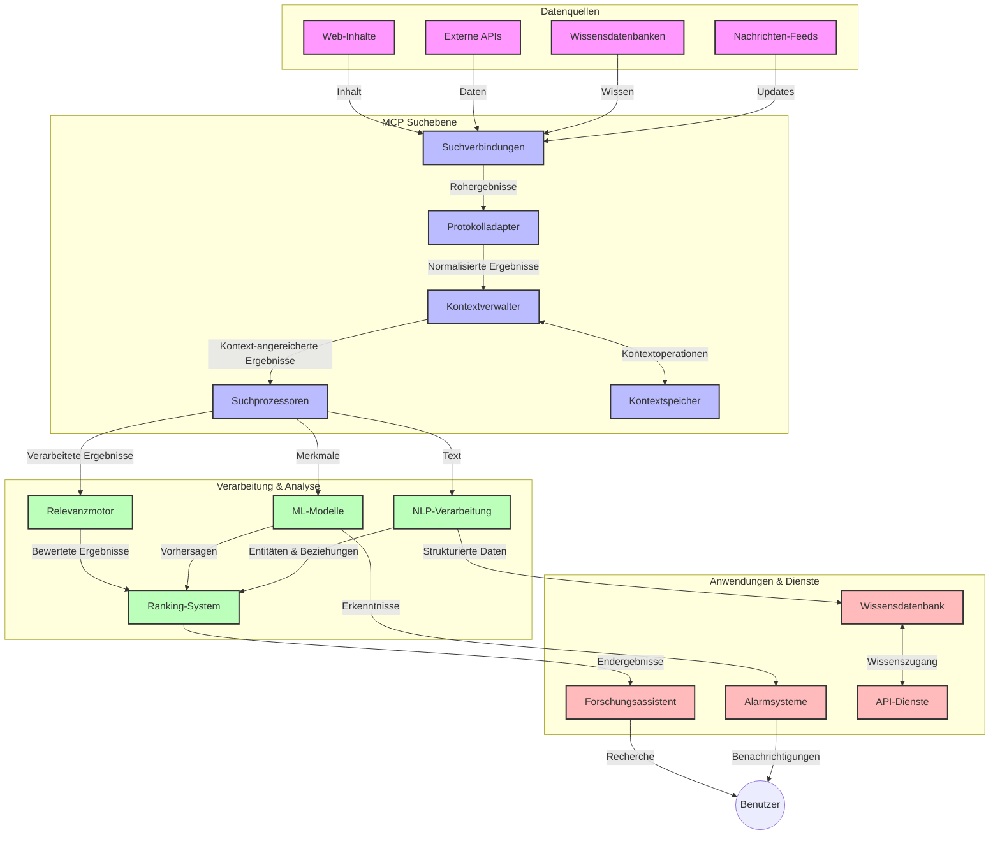
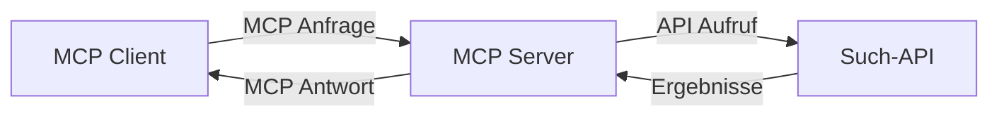
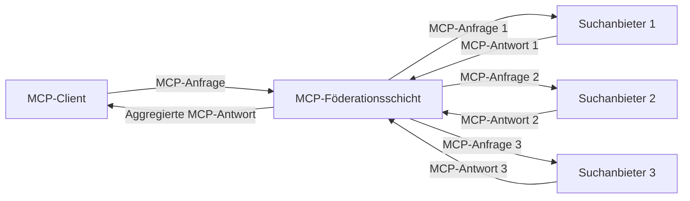
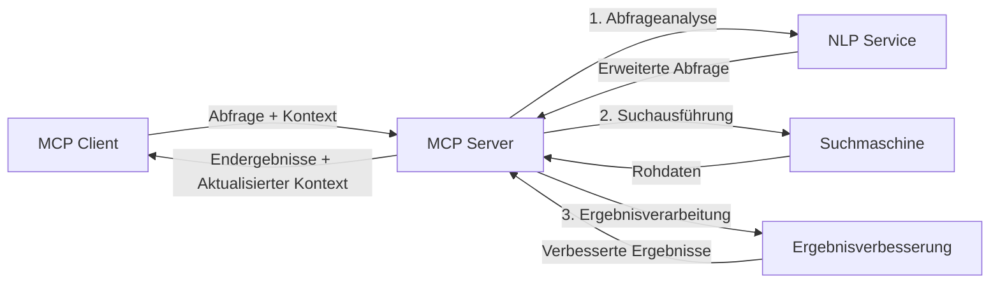

# Model Context Protocol für die Echtzeit-Websuche

## Überblick

Die Echtzeit-Websuche ist in der heutigen informationsgetriebenen Umgebung unverzichtbar geworden, in der Anwendungen sofortigen Zugriff auf aktuelle Informationen im Internet benötigen, um relevante und zeitnahe Antworten zu liefern. Das Model Context Protocol (MCP) stellt einen bedeutenden Fortschritt bei der Optimierung dieser Echtzeitsuchprozesse dar, indem es die Sucheffizienz verbessert, die kontextuelle Integrität wahrt und die Gesamtleistung des Systems steigert.

Dieses Modul untersucht, wie MCP die Echtzeit-Websuche transformiert, indem es einen standardisierten Ansatz für das Kontextmanagement über KI-Modelle, Suchmaschinen und Anwendungen hinweg bereitstellt.

### Was Sie lernen werden

In diesem umfassenden Leitfaden erfahren Sie:

- Wie MCP eine nahtlose Brücke zwischen KI-Modellen und Echtzeit-Websuchfunktionen schafft
- Architekturmuster zur Implementierung effizienter und skalierbarer Suchlösungen mit MCP
- Techniken zur Erhaltung des Suchkontexts über mehrere Abfragen und Interaktionen hinweg
- Praktische Code-Implementierungen in Python und JavaScript für verschiedene Suchszenarien
- Methoden zur Balance von Relevanz, Aktualität und Leistung in MCP-gestützten Suchsystemen

## Einführung in die Echtzeit-Websuche

Echtzeit-Websuche ist ein technologischer Ansatz, der kontinuierliche Abfrage, Verarbeitung und Analyse webbasierter Informationen ermöglicht, sobald sie veröffentlicht oder aktualisiert werden, wodurch Systeme frische und relevante Informationen mit minimaler Latenz bereitstellen können. Im Gegensatz zu traditionellen Suchsystemen, die auf indexierten Daten arbeiten, die Stunden oder Tage alt sein können, verarbeitet die Echtzeit-Suche Live-Daten aus dem Web und liefert Einsichten und Informationen, die den aktuellen Stand der Online-Inhalte widerspiegeln.

### Kernkonzepte der Echtzeit-Websuche:

- **Kontinuierliche Abfrageverarbeitung**: Suchanfragen werden gegen ständig aktualisierte Datenquellen verarbeitet  
- **Priorisierung der Aktualität**: Systeme sind darauf ausgelegt, frische Informationen zu priorisieren  
- **Ausgewogene Relevanz**: Aufrechterhaltung eines Gleichgewichts zwischen Relevanz und Aktualität  
- **Skalierbare Architektur**: Systeme müssen variable Abfragelasten und Datenvolumen bewältigen  
- **Kontextuelles Verständnis**: Die Erhaltung des Nutzerkontexts über Suchiterationen hinweg ist entscheidend für sinnvolle Ergebnisse  
- **Dynamische Abfrageumformulierung**: Anpassung der Suchanfragen basierend auf Kontext und vorherigen Ergebnissen  
- **Integration mehrerer Quellen**: Kombination von Ergebnissen verschiedener Suchanbieter und Webquellen  
- **Semantisches Verständnis**: Verarbeitung von Anfragen und Inhalten basierend auf Bedeutung statt nur Schlüsselwörtern  
- **Echtzeit-Ranking**: Kontinuierliche Anpassung der Ergebnisreihung, sobald neue Informationen verfügbar sind  

### Das Model Context Protocol und die Echtzeit-Websuche

Das Model Context Protocol (MCP) adressiert mehrere kritische Herausforderungen in Echtzeit-Websuchumgebungen:

1. **Erhaltung des Suchkontexts**: MCP standardisiert, wie Kontext über verteilte Suchkomponenten hinweg aufrechterhalten wird, sodass KI-Modelle und Verarbeitungsknoten Zugriff auf relevante Abfragehistorien und Nutzerpräferenzen haben.

2. **Effizientes Abfragemanagement**: Durch strukturierte Mechanismen zur Kontextübertragung reduziert MCP den Overhead, Kontext in jeder Suchiteration zu wiederholen.

3. **Interoperabilität**: MCP schafft eine gemeinsame Sprache für den Kontextaustausch zwischen unterschiedlichen Suchtechnologien und KI-Modellen und ermöglicht flexiblere und erweiterbare Architekturen.

4. **Suchoptimierter Kontext**: MCP-Implementierungen können priorisieren, welche Kontextelemente für eine effektive Suche am relevantesten sind, und optimieren sowohl für Leistung als auch Genauigkeit.

5. **Adaptives Suchprozessing**: Mit einem angemessenen Kontextmanagement durch MCP können Suchsysteme die Verarbeitung dynamisch an sich entwickelnde Nutzerbedürfnisse und Informationslandschaften anpassen.

In modernen Anwendungen, von Nachrichtenaggregation bis hin zu Rechercheassistenten, ermöglicht die Integration von MCP mit Websuchtechnologien intelligentere, kontextbewusste Suchvorgänge, die mit fortlaufenden Nutzerinteraktionen zunehmend relevantere Ergebnisse liefern können.

## Lernziele

Am Ende dieser Lektion werden Sie in der Lage sein:

- Die Grundlagen der Echtzeit-Websuche und ihre Herausforderungen in modernen Anwendungen zu verstehen  
- Zu erklären, wie das Model Context Protocol (MCP) die Echtzeit-Websuchfunktionen verbessert  
- MCP-basierte Suchlösungen unter Verwendung populärer Frameworks und APIs zu implementieren  
- Skalierbare, leistungsfähige Sucharchitekturen mit MCP zu entwerfen und bereitzustellen  
- MCP-Konzepte auf verschiedene Anwendungsfälle anzuwenden, darunter semantische Suche, Rechercheunterstützung und KI-unterstütztes Browsing  
- Neue Trends und zukünftige Innovationen in MCP-basierten Suchtechnologien zu bewerten  
- Kontextbewusste Suchsysteme zu entwickeln, die aus Nutzerinteraktionen lernen  
- Websuchfunktionen in KI-Assistenten unter Verwendung standardisierter MCP-Protokolle zu integrieren  
- Mehrstufige Suchpipelines zu erstellen, die Ergebnisse basierend auf Kontext schrittweise verfeinern  
- Die Suchleistung zu optimieren und gleichzeitig umfassendes Kontextbewusstsein zu bewahren  

### Definition und Bedeutung

Echtzeit-Websuche umfasst das kontinuierliche Abfragen, Abrufen und Bereitstellen webbasierter Informationen mit minimaler Verzögerung. Im Gegensatz zu traditionellen Suchmaschinen, die das Web periodisch crawlen und indizieren, zielt die Echtzeit-Suche darauf ab, Informationen direkt nach Verfügbarkeit sichtbar zu machen und so sofortigen Zugriff auf den aktuellsten Inhalt zu ermöglichen.

Wesentliche Merkmale der Echtzeit-Websuche sind:

- **Frische**: Priorisierung jüngster Inhalte und Updates  
- **Kontinuierliche Verarbeitung**: Permanente Überwachung neuer Informationen  
- **Abfrageanpassung**: Verfeinerung von Suchanfragen basierend auf Kontext und Rückmeldungen  
- **Sofortige Bereitstellung**: Suchergebnisse mit minimaler Verzögerung bereitstellen  
- **Kontexterhaltung**: Aufbau auf vorherigen Anfragen zur verbesserten Relevanz  

### Herausforderungen bei der traditionellen Websuche

Traditionelle Ansätze der Websuche stoßen in Echtzeitszenarien auf mehrere Einschränkungen:

1. **Kontextfragmentierung**: Schwierigkeit, Suchkontext über mehrere Abfragen hinweg zu erhalten  
2. **Informationsaktualität**: Probleme beim Zugriff auf und der Priorisierung der neuesten Informationen  
3. **Integrationskomplexität**: Schwierigkeiten bei der Interoperabilität zwischen Suchsystemen und Anwendungen  
4. **Latenzprobleme**: Balance zwischen umfassender Suche und Anforderungen an Antwortzeiten  
5. **Relevanzanpassung**: Sicherstellung von Genauigkeit und Relevanz bei gleichzeitiger Priorisierung von Aktualität  

## Verständnis des Model Context Protocol (MCP) für die Suche

### Was ist MCP im Suchkontext?

Das Model Context Protocol (MCP) ist ein standardisiertes Kommunikationsprotokoll, das den effizienten Austausch zwischen KI-Modellen und Anwendungen erleichtert. Im Kontext der Echtzeit-Websuche bietet MCP einen Rahmen für:

- Die Erhaltung des Suchkontexts während Abfolgen von Abfragen  
- Die Standardisierung von Suchanfrage- und Ergebnisformaten  
- Die Optimierung der Übertragung von Suchparametern und Ergebnissen  
- Die Verbesserung der Kommunikation zwischen Modellen und Suchmaschinen  

### Kernkomponenten und Architektur

Die MCP-Architektur für die Echtzeit-Websuche besteht aus mehreren Hauptkomponenten:

1. **Query Context Handlers**: Verwalten und bewahren den Suchkontext über mehrere Anfragen hinweg  
2. **Search Processors**: Verarbeiten eingehende Suchanfragen kontextbewusst  
3. **Protocol Adapters**: Wandeln verschiedene Such-APIs unter Erhaltung des Kontexts um  
4. **Context Store**: Speichern und Abrufen von Suchhistorie und Präferenzen effizient  
5. **Search Connectors**: Verbindung zu unterschiedlichen Suchmaschinen und Web-APIs  


  
### Wie MCP die Echtzeit-Websuche verbessert

MCP begegnet den Herausforderungen traditioneller Websuche durch:

- **Kontextuelle Kontinuität**: Erhaltung der Beziehungen zwischen Anfragen über die gesamte Suchsitzung hinweg  
- **Optimierte Übertragung**: Reduzierung von Redundanzen in Suchparametern durch intelligentes Kontextmanagement  
- **Standardisierte Schnittstellen**: Bereitstellung konsistenter APIs für Suchkomponenten  
- **Reduzierte Latenz**: Minimierung der Verarbeitungsbelastung durch effizientes Kontexthandling  
- **Verbesserte Relevanz**: Steigerung der Suchrelevanz durch Erhaltung der Nutzerintention über mehrere Anfragen hinweg  

## Integration und Implementierung

Echtzeit-Websuchsysteme erfordern sorgfältiges architektonisches Design und Implementierung, um sowohl Leistung als auch kontextuelle Integrität zu gewährleisten. Das Model Context Protocol bietet einen standardisierten Ansatz zur Integration von KI-Modellen und Suchtechnologien und ermöglicht anspruchsvollere, kontextbewusste Suchpipelines.

### Überblick über die MCP-Integration in Sucharchitekturen

Die Implementierung von MCP in Echtzeit-Websuchumgebungen umfasst mehrere wesentliche Aspekte:

1. **Suchkontext-Serialisierung**: MCP bietet effiziente Mechanismen zur Kodierung kontextueller Informationen innerhalb von Suchanfragen, wodurch wesentlicher Kontext der Anfrage durch die gesamte Verarbeitungspipeline folgt. Dies umfasst standardisierte Serialisierungsformate, die für suchbezogene Metadaten optimiert sind.

2. **Zustandsbehaftete Suchverarbeitung**: MCP ermöglicht eine intelligentere zustandsbehaftete Verarbeitung durch konsistente Kontextdarstellung über Suchiteration hinweg. Dies ist besonders wertvoll in mehrstufigen Suchpipelines, bei denen Kontextverfeinerung die Ergebnisse verbessert.

3. **Abfrageerweiterung und -verfeinerung**: MCP-Implementierungen in Suchsystemen können komplexe Abfrageerweiterung und -verfeinerung basierend auf angesammeltem Kontext erleichtern, wodurch die Suchergebnisse mit Fortschreiten der Suchsitzung relevanter werden.

4. **Ergebnis-Caching und Priorisierung**: Durch standardisiertes Kontexthandling hilft MCP bei der Verwaltung von Ergebnis-Caching und Priorisierung, wodurch Komponenten sich entsprechend dem sich entwickelnden Suchkontext anpassen können.

5. **Suchföderation und Aggregation**: MCP unterstützt eine anspruchsvollere Föderation von Suche über mehrere Backends durch strukturierte Darstellung des Suchkontexts, was eine sinnvollere Aggregation von Ergebnissen aus unterschiedlichen Quellen ermöglicht.

Die Implementierung von MCP über verschiedene Suchtechnologien hinweg schafft einen einheitlichen Ansatz für das Kontextmanagement, reduziert den Bedarf an maßgeschneidertem Integrationscode und verbessert die Fähigkeit des Systems, sinnvollen Kontext bei der Entwicklung von Suchanfragen zu erhalten.

### MCP in verschiedenen Websuchimplementierungen

Diese Beispiele folgen der aktuellen MCP-Spezifikation, die sich auf ein JSON-RPC-basiertes Protokoll mit unterschiedlichen Transportmechanismen konzentriert. Der Code zeigt, wie benutzerdefinierte Suchintegrationen implementiert werden können und dabei volle Kompatibilität mit dem MCP-Protokoll gewahrt bleibt.

<details>
<summary>Python-Implementierung mit Generic Search API</summary>

```python
import asyncio
import json
import aiohttp
from typing import Dict, Any, Optional, List
from contextlib import asynccontextmanager
from collections.abc import AsyncIterator

# Importiere Standard-MCP-Bibliotheken
from mcp.client.session import ClientSession
from mcp.client.streamable_http import streamablehttp_client
from mcp.types import TextContent, CreateMessageRequestParams, CreateMessageResult
from mcp.server.fastmcp import FastMCP

# Erstelle einen FastMCP-Server für die Websuche
search_server = FastMCP("WebSearch")

# Klasse zur Handhabung von Websuchvorgängen
class WebSearchHandler:
    def __init__(self, api_endpoint: str, api_key: str):
        self.api_endpoint = api_endpoint
        self.api_key = api_key
        self.session = None
        
    async def initialize(self):
        """Initialize the HTTP session"""
        self.session = aiohttp.ClientSession(
            headers={"Authorization": f"Bearer {self.api_key}"}
        )
    
    async def close(self):
        """Close the HTTP session"""
        if self.session:
            await self.session.close()
            
    async def perform_search(self, query: str, max_results: int = 5, 
                           include_domains: List[str] = None, 
                           exclude_domains: List[str] = None,
                           time_period: str = "any") -> Dict[str, Any]:
        """Perform web search using the search API"""
        # Suchparameter konstruieren
        search_params = {
            "q": query,
            "limit": max_results,
            "time": time_period
        }
        
        if include_domains:
            search_params["site"] = ",".join(include_domains)
            
        if exclude_domains:
            search_params["exclude_site"] = ",".join(exclude_domains)
        
        # Führe die Suchanfrage aus
        try:
            async with self.session.get(
                self.api_endpoint,
                params=search_params
            ) as response:
                if response.status != 200:
                    error_text = await response.text()
                    raise Exception(f"Search API error: {response.status} - {error_text}")
                
                search_data = await response.json()
                
                # Wandle API-spezifische Antwort in ein Standardformat um
                results = []
                for item in search_data.get("results", []):
                    results.append({
                        "title": item.get("title", ""),
                        "url": item.get("url", ""),
                        "snippet": item.get("snippet", ""),
                        "date": item.get("published_date", ""),
                        "source": item.get("source", "")
                    })
                
                return {
                    "query": query,
                    "totalResults": len(results),
                    "results": results
                }
        except Exception as e:
            print(f"Search API request error: {e}")
            raise

# Initialisiere den Such-Handler
search_handler = WebSearchHandler(
    api_endpoint="https://api.search-service.example/search",
    api_key="your-api-key-here"
)

# Richte Lebensdauer ein, um den Such-Handler zu verwalten
@asyncio.asynccontextmanager
async def app_lifespan(server: FastMCP):
    """Manage application lifecycle"""
    await search_handler.initialize()
    try:
        yield {"search_handler": search_handler}
    finally:
        await search_handler.close()

# Setze die Lebensdauer für den Server
search_server = FastMCP("WebSearch", lifespan=app_lifespan)

# Registriere ein Websuch-Tool
@search_server.tool()
async def web_search(query: str, max_results: int = 5, 
                   include_domains: List[str] = None,
                   exclude_domains: List[str] = None,
                   time_period: str = "any") -> Dict[str, Any]:
    """
    Search the web for information
    
    Args:
        query: The search query
        max_results: Maximum number of results to return (default: 5)
        include_domains: List of domains to include in search results
        exclude_domains: List of domains to exclude from search results
        time_period: Time period for results ("day", "week", "month", "any")
        
    Returns:
        Dictionary containing search results
    """
    ctx = search_server.get_context()
    search_handler = ctx.request_context.lifespan_context["search_handler"]
    
    results = await search_handler.perform_search(
        query=query,
        max_results=max_results,
        include_domains=include_domains,
        exclude_domains=exclude_domains,
        time_period=time_period
    )
    
    return results

# Beispielhafte Client-Nutzung
async def client_example():
    # Verbinde dich mit dem Suchserver über Streamable HTTP-Transport
    async with streamablehttp_client("http://localhost:8000/mcp") as (read, write, _):
        async with ClientSession(read, write) as session:
            # Initialisiere die Verbindung
            await session.initialize()
            
            # Rufe das web_search-Tool auf
            search_results = await session.call_tool(
                "web_search", 
                {
                    "query": "latest developments in AI and Model Context Protocol",
                    "max_results": 5,
                    "time_period": "day",
                    "include_domains": ["github.com", "microsoft.com"]
                }
            )
            
            print(f"Search results: {search_results}")

# Beispiel für Serverausführung
if __name__ == "__main__":
    # Starte den Server mit Streamable HTTP-Transport
    search_server.run(transport="streamable-http")
```
</details> 

<details>
<summary>JavaScript-Implementierung mit Browser-basierter Suche</summary>

```javascript
// MCP-Serverimplementierung für die Websuche
import { McpServer, ResourceTemplate } from '@modelcontextprotocol/sdk/server/mcp.js';
import { StreamableHTTPServerTransport } from '@modelcontextprotocol/sdk/server/streamableHttp.js';
import { z } from 'zod';

// Erstelle einen MCP-Server für die Websuche
const searchServer = new McpServer({
    name: "BrowserSearch",
    description: "A server that provides web search capabilities"
});

// Suchdienstklasse
class SearchService {
    constructor(searchApiUrl, apiKey) {
        this.searchApiUrl = searchApiUrl;
        this.apiKey = apiKey;
    }

    async performSearch(parameters) {
        const {
            query = '',
            maxResults = 5,
            includeDomains = [],
            excludeDomains = [],
            timePeriod = 'any'
        } = parameters;
        
        // Erstelle Such-URL mit Parametern
        const url = new URL(this.searchApiUrl);
        url.searchParams.append('q', query);
        url.searchParams.append('limit', maxResults);
        url.searchParams.append('time', timePeriod);
        
        if (includeDomains.length > 0) {
            url.searchParams.append('site', includeDomains.join(','));
        }
        
        if (excludeDomains.length > 0) {
            url.searchParams.append('exclude_site', excludeDomains.join(','));
        }
        
        try {
            const response = await fetch(url.toString(), {
                method: 'GET',
                headers: {
                    'Authorization': `Bearer ${this.apiKey}`,
                    'Content-Type': 'application/json'
                }
            });
            
            if (!response.ok) {
                const errorText = await response.text();
                throw new Error(`Search API error: ${response.status} - ${errorText}`);
            }
            
            const searchData = await response.json();
            
            // Wandle API-spezifische Antwort in ein Standardformat um
            const results = searchData.results?.map(item => ({
                title: item.title || '',
                url: item.url || '',
                snippet: item.snippet || '',
                date: item.published_date || '',
                source: item.source || ''
            })) || [];
            
            return {
                query,
                totalResults: results.length,
                results
            };
        } catch (error) {
            console.error('Search API request error:', error);
            throw error;
        }
    }
}

// Initialisiere den Suchdienst
const searchService = new SearchService(
    'https://api.search-service.example/search',
    'your-api-key-here'
);

// Richte den Kontextanbieter für den Server ein
searchServer.setContextProvider(() => {
    return {
        searchService
    };
});

// Registriere Websuch-Tool
searchServer.tool({
    name: 'web_search',
    description: 'Search the web for information',
    parameters: {
        type: 'object',
        properties: {
            query: {
                type: 'string',
                description: 'The search query'
            },
            maxResults: {
                type: 'integer',
                description: 'Maximum number of results to return',
                default: 5
            },
            includeDomains: {
                type: 'array',
                items: { type: 'string' },
                description: 'List of domains to include in search results'
            },
            excludeDomains: {
                type: 'array',
                items: { type: 'string' },
                description: 'List of domains to exclude from search results'
            },
            timePeriod: {
                type: 'string',
                description: 'Time period for results',
                enum: ['day', 'week', 'month', 'any'],
                default: 'any'
            }
        },
        required: ['query']
    },
    handler: async (params, context) => {
        const { searchService } = context;
        return await searchService.performSearch(params);
    }
});

// Beispiel-Clientcode zum Verbinden mit dem Suchserver
import { Client } from '@modelcontextprotocol/sdk/client/index.js';
import { StreamableHTTPClientTransport } from '@modelcontextprotocol/sdk/client/streamableHttp.js';

async function connectToSearchServer() {
    // Verbinde mit dem Suchserver
    const transport = new StreamableHTTPClientTransport(
        new URL('http://localhost:8000/mcp')
    );
    
    const client = new Client({
        name: 'search-client',
        version: '1.0.0'
    });
    
    await client.connect(transport);
    
    // Führ das Such-Tool aus
    const searchResults = await client.callTool({
        name: 'web_search',
        arguments: {
            query: 'Model Context Protocol implementation examples',
            maxResults: 10,
            timePeriod: 'week',
            includeDomains: ['github.com', 'docs.microsoft.com']
        }
    });
    
    console.log('Search results:', searchResults);
    
    // Aufräumen
    await client.disconnect();
}

// Starte den Server
const transport = new StreamableHTTPServerTransport();
await searchServer.connect(transport);
console.log('Search server running at http://localhost:8000/mcp');

// In einem separaten Prozess oder nachdem der Server gestartet wurde
// connectToSearchServer().catch(console.error);
```
</details> 

## Haftungsausschluss zu Codebeispielen

> **Wichtiger Hinweis**: Die folgenden Codebeispiele demonstrieren die Integration des Model Context Protocol (MCP) mit Websuchfunktionalität. Obwohl sie den Mustern und Strukturen der offiziellen MCP SDKs folgen, wurden sie für Lehrzwecke vereinfacht.  
>   
> Diese Beispiele zeigen:  
>   
> 1. **Python-Implementierung**: Eine FastMCP-Serverimplementierung, die ein Websuchwerkzeug bereitstellt und sich mit einer externen Such-API verbindet. Dieses Beispiel zeigt korrektes Lifespan-Management, Kontextbehandlung und Werkzeugimplementierung nach den Mustern des [offiziellen MCP Python SDK](https://github.com/modelcontextprotocol/python-sdk). Der Server verwendet den empfohlenen Streamable HTTP-Transport, der den älteren SSE-Transport für Produktionsumgebungen ersetzt hat.  
>   
> 2. **JavaScript-Implementierung**: Eine TypeScript/JavaScript-Implementierung unter Verwendung des FastMCP-Musters aus dem [offiziellen MCP TypeScript SDK](https://github.com/modelcontextprotocol/typescript-sdk), um einen Suchserver mit korrekten Werkzeugspezifikationen und Clientverbindungen zu erstellen. Sie folgt den neuesten empfohlenen Mustern für Sitzungsmanagement und Kontextwahrung.  
>   
> Für den produktiven Einsatz wären zusätzliche Fehlerbehandlung, Authentifizierung und spezifischer API-Integrationscode erforderlich. Die gezeigten Such-API-Endpunkte (`https://api.search-service.example/search`) sind Platzhalter und müssten durch tatsächliche Suchdienstendpunkte ersetzt werden.  
>   
> Für vollständige Implementierungsdetails und aktuellste Vorgehensweisen konsultieren Sie bitte die [offizielle MCP-Spezifikation](https://spec.modelcontextprotocol.io/) und die SDK-Dokumentation.

## Kernkonzepte

### Das Model Context Protocol (MCP) Framework

Grundlegend bietet das Model Context Protocol einen standardisierten Weg für den Austausch von Kontext zwischen KI-Modellen, Anwendungen und Diensten. In der Echtzeit-Websuche ist dieses Framework wesentlich für die Schaffung kohärenter, mehrstufiger Sucherfahrungen. Zu den Hauptkomponenten gehören:

1. **Client-Server-Architektur**: MCP etabliert eine klare Trennung zwischen Suchclients (Anfragenden) und Suchservern (Anbietenden), was flexible Bereitstellungsmodelle erlaubt.

2. **JSON-RPC-Kommunikation**: Das Protokoll verwendet JSON-RPC für den Nachrichtenaustausch, wodurch es mit Webtechnologien kompatibel und einfach auf verschiedenen Plattformen implementierbar ist.

3. **Kontextmanagement**: MCP definiert strukturierte Methoden zur Pflege, Aktualisierung und Nutzung des Suchkontexts über mehrere Interaktionen hinweg.

4. **Werkzeugdefinitionen**: Suchfunktionen werden als standardisierte Werkzeuge mit klar definierten Parametern und Rückgabewerten bereitgestellt.

5. **Streaming-Unterstützung**: Das Protokoll unterstützt Streaming-Ergebnisse, was für die Echtzeitsuche essenziell ist, bei der Ergebnisse progressiv ankommen können.

### Integrationsmuster für Websuche

Bei der Integration von MCP mit Websuche zeichnen sich mehrere Muster ab:

#### 1. Direkte Integration von Suchanbietern


  
In diesem Muster verbindet sich der MCP-Server direkt mit einer oder mehreren Such-APIs, übersetzt MCP-Anfragen in API-spezifische Aufrufe und formatiert die Ergebnisse als MCP-Antworten.

#### 2. Föderierte Suche mit Kontextwahrung


  
Dieses Muster verteilt Suchanfragen auf mehrere MCP-kompatible Suchanbieter, die jeweils auf unterschiedliche Inhaltstypen oder Suchfähigkeiten spezialisiert sein können, wobei ein einheitlicher Kontext gewahrt bleibt.

#### 3. Kontextangereicherte Suchkette


  
Hierbei wird der Suchprozess in mehrere Phasen unterteilt, wobei der Kontext in jedem Schritt angereichert wird, was zu zunehmend relevanteren Ergebnissen führt.

### Komponenten des Suchkontexts

Im MCP-basierten Websuchkontext umfasst der Suchkontext typischerweise:

- **Abfragehistorie**: Vorherige Suchanfragen in der Sitzung  
- **Nutzerpräferenzen**: Sprache, Region, Safe-Search-Einstellungen  
- **Interaktionshistorie**: Welche Ergebnisse angeklickt wurden, Verweildauer bei Ergebnissen  
- **Suchparameter**: Filter, Sortieroptionen und andere Suchmodifikatoren  
- **Domänenwissen**: Fachspezifischer Kontext relevant für die Suche  
- **Zeitkontext**: Zeitbasierte Relevanzfaktoren  
- **Quellenpräferenzen**: Vertrauenswürdige oder bevorzugte Informationsquellen  

## Anwendungsfälle und Einsatzgebiete

### Forschung und Informationsbeschaffung

MCP verbessert Forschungsabläufe durch:

- Erhaltung des Forschungskontexts über Suchsitzungen hinweg  
- Ermöglichung komplexerer und kontextuell relevanterer Suchanfragen  
- Unterstützung von Multi-Source-Suchföderation  
- Erleichterung der Wissensextraktion aus Suchergebnissen  

### Echtzeit-Nachrichten- und Trendüberwachung

MCP-gestützte Suche bietet Vorteile bei der Nachrichtenüberwachung:

- Nahezu Echtzeitentdeckung aufkommender Nachrichten  
- Kontextuelle Filterung relevanter Informationen  
- Themen- und Entitätenverfolgung über mehrere Quellen  
- Personalisierte Nachrichtenalarme basierend auf Nutzerkontext  

### KI-gestütztes Browsing und Recherche

MCP eröffnet neue Möglichkeiten für KI-gestütztes Browsing:

- Kontextbezogene Suchvorschläge basierend auf aktueller Browseraktivität  
- Nahtlose Integration von Websuche mit LLM-gestützten Assistenten  
- Mehrstufige Suchverfeinerung bei Erhalt des Kontexts  
- Verbesserte Faktenprüfung und Informationsverifikation  

## Zukünftige Trends und Innovationen

### Entwicklung von MCP in der Websuche

Mit Blick auf die Zukunft erwarten wir, dass MCP sich weiterentwickelt, um:
- **Multimodale Suche**: Integration von Text-, Bild-, Audio- und Videosuche bei gleichzeitigem Erhalt des Kontexts  
- **Dezentralisierte Suche**: Unterstützung verteilter und föderierter Such-Ökosysteme  
- **Such-Datenschutz**: Kontextbewusste datenschutzfreundliche Suchmechanismen  
- **Abfrageverständnis**: Tiefe semantische Analyse natürlicher Sprachsuchanfragen  

### Potenzielle technologische Fortschritte

Neue Technologien, die die Zukunft der MCP-Suche prägen werden:

1. **Neuronale Sucharchitekturen**: Auf Einbettungen basierende Suchsysteme, optimiert für MCP  
2. **Personalisierter Suchkontext**: Erlernen individueller Suchmuster von Nutzern im Zeitverlauf  
3. **Integration von Wissensgraphen**: Kontextualisierte Suche, verbessert durch domänenspezifische Wissensgraphen  
4. **Modalitätenübergreifender Kontext**: Erhalt des Kontexts über verschiedene Suchmodalitäten hinweg  

## Praktische Übungen

### Übung 1: Einrichtung einer grundlegenden MCP-Suchpipeline

In dieser Übung lernen Sie:  
- Konfiguration einer grundlegenden MCP-Suchumgebung  
- Implementierung von Kontextmanagern für Websuche  
- Test und Validierung der Kontextbewahrung über mehrere Suchdurchläufe  

### Übung 2: Aufbau eines Forschungsassistenten mit MCP-Suche

Erstellen Sie eine vollständige Anwendung, die:  
- Forschungsfragen in natürlicher Sprache verarbeitet  
- Kontextbewusste Websuchen durchführt  
- Informationen aus mehreren Quellen synthetisiert  
- Organisierte Forschungsergebnisse präsentiert  

### Übung 3: Implementierung einer Multi-Quellen-Suchföderation mit MCP

Fortgeschrittene Übung umfasst:  
- Kontextbewusste Anfragenverteilung an mehrere Suchmaschinen  
- Ergebnisbewertung und -aggregation  
- Kontextuelle Duplikatserkennung von Suchergebnissen  
- Umgang mit quellspezifischen Metadaten  

## Zusätzliche Ressourcen

- [Model Context Protocol Specification](https://spec.modelcontextprotocol.io/) – Offizielle MCP-Spezifikation und ausführliche Protokolldokumentation  
- [Model Context Protocol Documentation](https://modelcontextprotocol.io/) – Ausführliche Tutorials und Implementierungsanleitungen  
- [MCP Python SDK](https://github.com/modelcontextprotocol/python-sdk) – Offizielle Python-Implementierung des MCP-Protokolls  
- [MCP TypeScript SDK](https://github.com/modelcontextprotocol/typescript-sdk) – Offizielle TypeScript-Implementierung des MCP-Protokolls  
- [MCP Reference Servers](https://github.com/modelcontextprotocol/servers) – Referenzimplementierungen von MCP-Servern  
- [Bing Web Search API Documentation](https://learn.microsoft.com/en-us/bing/search-apis/bing-web-search/overview) – Microsofts Websuch-API  
- [Google Custom Search JSON API](https://developers.google.com/custom-search/v1/overview) – Googles programmierbare Suchmaschine  
- [SerpAPI Documentation](https://serpapi.com/search-api) – API für Suchmaschinenergebnisseiten  
- [Meilisearch Documentation](https://www.meilisearch.com/docs) – Open-Source-Suchmaschine  
- [Elasticsearch Documentation](https://www.elastic.co/guide/index.html) – Verteilte Such- und Analyseengine  
- [LangChain Documentation](https://python.langchain.com/docs/get_started/introduction) – Aufbau von Anwendungen mit LLMs  

## Lernergebnisse

Mit Abschluss dieses Moduls werden Sie in der Lage sein:  

- Die Grundlagen der Echtzeit-Websuche und deren Herausforderungen zu verstehen  
- Zu erklären, wie das Model Context Protocol (MCP) die Fähigkeiten der Echtzeit-Websuche verbessert  
- MCP-basierte Suchlösungen mit populären Frameworks und APIs umzusetzen  
- Skalierbare, leistungsstarke Sucharchitekturen mit MCP zu entwerfen und bereitzustellen  
- MCP-Konzepte auf unterschiedliche Anwendungsfälle wie semantische Suche, Forschungsassistenz und KI-unterstütztes Browsen anzuwenden  
- Aufkommende Trends und zukünftige Innovationen in MCP-basierten Suchtechnologien zu bewerten  

### Vertrauens- und Sicherheitsaspekte

Beim Implementieren von MCP-basierten Websuchlösungen beachten Sie bitte folgende wichtige Prinzipien aus der MCP-Spezifikation:  

1. **Nutzerzustimmung und Kontrolle**: Nutzer müssen allen Datenzugriffen und Operationen ausdrücklich zustimmen und diese verstehen. Dies ist besonders bei Websuche-Implementierungen wichtig, die auf externe Datenquellen zugreifen können.  

2. **Datenschutz**: Sichern Sie eine angemessene Behandlung von Suchanfragen und -ergebnissen, insbesondere wenn sensible Informationen enthalten sein können. Implementieren Sie geeignete Zugriffskontrollen zum Schutz der Nutzerdaten.  

3. **Werkzeugsicherheit**: Implementieren Sie korrekte Autorisierungs- und Validierungsmechanismen für Suchwerkzeuge, da diese potenzielle Sicherheitsrisiken durch beliebige Codeausführung darstellen können. Tool-Beschreibungen sollten als nicht vertrauenswürdig gelten, sofern sie nicht von einem vertrauenswürdigen Server stammen.  

4. **Klare Dokumentation**: Stellen Sie eine klare Dokumentation zu Fähigkeiten, Beschränkungen und Sicherheitsaspekten Ihrer MCP-basierten Suchimplementierung bereit, entsprechend den Richtlinien der MCP-Spezifikation.  

5. **Robuste Zustimmungsabläufe**: Erstellen Sie robuste Zustimmungs- und Autorisierungsprozesse, die genau erklären, was jedes Tool macht, bevor dessen Nutzung autorisiert wird – besonders bei Tools, die mit externen Webressourcen interagieren.  

Für vollständige Details zu MCP-Sicherheits- und Vertrauensüberlegungen konsultieren Sie bitte die [offizielle Dokumentation](https://modelcontextprotocol.io/specification/2025-11-25/basic/security_best_practices).  

## Was kommt als Nächstes

- [5.12 Entra ID Authentication für Model Context Protocol Server](../mcp-security-entra/README.md)

---

<!-- CO-OP TRANSLATOR DISCLAIMER START -->
**Haftungsausschluss**:
Dieses Dokument wurde mit dem KI-Übersetzungsdienst [Co-op Translator](https://github.com/Azure/co-op-translator) übersetzt. Obwohl wir uns um Genauigkeit bemühen, beachten Sie bitte, dass automatisierte Übersetzungen Fehler oder Ungenauigkeiten enthalten können. Das Originaldokument in seiner Ursprungssprache gilt als maßgebliche Quelle. Bei kritischen Informationen wird eine professionelle menschliche Übersetzung empfohlen. Wir übernehmen keine Haftung für Missverständnisse oder Fehlinterpretationen, die aus der Verwendung dieser Übersetzung entstehen.
<!-- CO-OP TRANSLATOR DISCLAIMER END -->