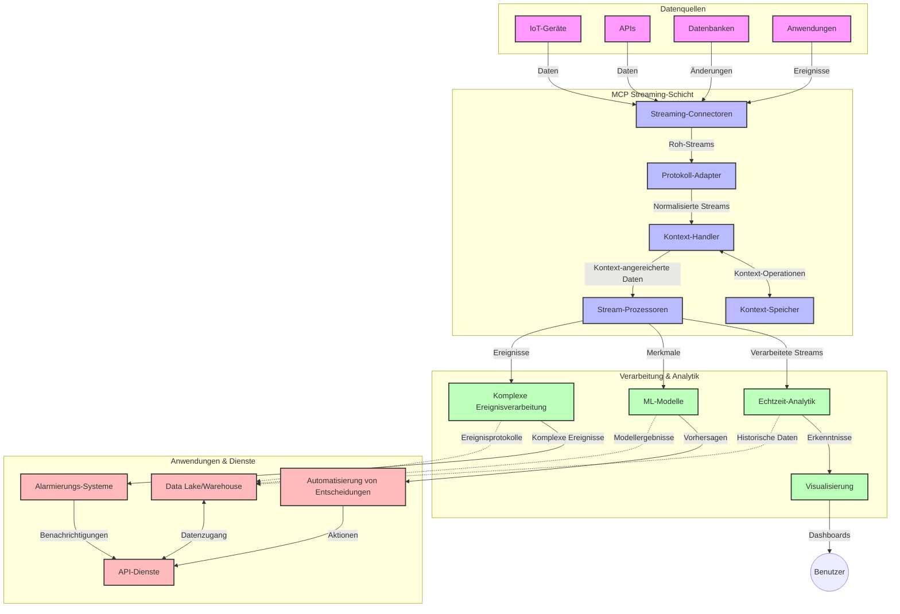

# Model Context Protocol für Echtzeit-Daten-Streaming

## Überblick

Echtzeit-Daten-Streaming ist in der heutigen datengetriebenen Welt unverzichtbar geworden, in der Unternehmen und Anwendungen sofortigen Zugriff auf Informationen benötigen, um zeitnahe Entscheidungen zu treffen. Das Model Context Protocol (MCP) stellt einen bedeutenden Fortschritt bei der Optimierung dieser Echtzeit-Streaming-Prozesse dar, verbessert die Effizienz der Datenverarbeitung, bewahrt die kontextuelle Integrität und erhöht die Gesamtleistung des Systems.

Dieses Modul untersucht, wie MCP das Echtzeit-Daten-Streaming transformiert, indem es einen standardisierten Ansatz für das Kontextmanagement über KI-Modelle, Streaming-Plattformen und Anwendungen hinweg bietet.

## Einführung in Echtzeit-Daten-Streaming

Echtzeit-Daten-Streaming ist ein technologisches Paradigma, das den kontinuierlichen Transfer, die Verarbeitung und Analyse von Daten ermöglicht, während diese generiert werden, sodass Systeme sofort auf neue Informationen reagieren können. Im Gegensatz zur traditionellen Batch-Verarbeitung, die auf statischen Datensätzen arbeitet, verarbeitet Streaming Daten in Bewegung und liefert Erkenntnisse und Aktionen mit minimaler Latenz.

### Kernkonzepte des Echtzeit-Daten-Streamings:

- **Kontinuierlicher Datenfluss**: Daten werden als ein kontinuierlicher, endloser Strom von Ereignissen oder Datensätzen verarbeitet.
- **Niedrige Latenz bei der Verarbeitung**: Systeme sind so gestaltet, dass die Zeit zwischen Datengenerierung und -verarbeitung minimiert wird.
- **Skalierbarkeit**: Streaming-Architekturen müssen variable Datenvolumen und -geschwindigkeiten bewältigen.
- **Fehlertoleranz**: Systeme müssen gegen Ausfälle widerstandsfähig sein, um einen ununterbrochenen Datenfluss sicherzustellen.
- **Zustandsbehaftete Verarbeitung**: Die Aufrechterhaltung des Kontexts über Ereignisse hinweg ist entscheidend für eine sinnvolle Analyse.

### Das Model Context Protocol und Echtzeit-Streaming

Das Model Context Protocol (MCP) adressiert mehrere wesentliche Herausforderungen in Echtzeit-Streaming-Umgebungen:

1. **Kontextuelle Kontinuität**: MCP standardisiert die Art und Weise, wie Kontext über verteilte Streaming-Komponenten hinweg aufrechterhalten wird, sodass KI-Modelle und Verarbeitungsknoten Zugriff auf relevanten historischen und Umgebungs-Kontext haben.

2. **Effizientes Zustandsmanagement**: Durch die Bereitstellung strukturierter Mechanismen für die Kontextübertragung reduziert MCP den Aufwand des Zustandsmanagements in Streaming-Pipelines.

3. **Interoperabilität**: MCP schafft eine gemeinsame Sprache für den Kontextaustausch zwischen verschiedenen Streaming-Technologien und KI-Modellen, was flexiblere und erweiterbare Architekturen ermöglicht.

4. **Für Streaming optimierter Kontext**: MCP-Implementierungen können priorisieren, welche Kontextelemente für Echtzeit-Entscheidungen am relevantesten sind, und so sowohl Leistung als auch Genauigkeit optimieren.

5. **Adaptive Verarbeitung**: Mit korrekt verwaltetem Kontext durch MCP können Streaming-Systeme die Verarbeitung dynamisch an sich ändernde Bedingungen und Muster in den Daten anpassen.

In modernen Anwendungen, von IoT-Sensornetzen bis hin zu Finanzhandelssystemen, ermöglicht die Integration von MCP mit Streaming-Technologien eine intelligentere, kontextbewusste Verarbeitung, die angemessen auf komplexe, sich entwickelnde Situationen in Echtzeit reagieren kann.

## Lernziele

Am Ende dieser Lektion werden Sie in der Lage sein:

- Die Grundlagen des Echtzeit-Daten-Streamings und seine Herausforderungen zu verstehen
- Zu erklären, wie das Model Context Protocol (MCP) das Echtzeit-Daten-Streaming verbessert
- MCP-basierte Streaming-Lösungen mit beliebten Frameworks wie Kafka und Pulsar zu implementieren
- Fehlertolerante, leistungsstarke Streaming-Architekturen mit MCP zu entwerfen und bereitzustellen
- MCP-Konzepte auf IoT, Finanzhandel und KI-gestützte Analyseanwendungen anzuwenden
- Aufkommende Trends und zukünftige Innovationen in MCP-basierten Streaming-Technologien zu bewerten


### Definition und Bedeutung

Echtzeit-Daten-Streaming umfasst die kontinuierliche Erzeugung, Verarbeitung und Bereitstellung von Daten mit minimaler Latenz. Im Gegensatz zur Batch-Verarbeitung, bei der Daten gesammelt und in Gruppen verarbeitet werden, erfolgt die Verarbeitung von Streaming-Daten inkrementell bei deren Eintreffen, was sofortige Erkenntnisse und Aktionen ermöglicht.

Wesentliche Merkmale des Echtzeit-Daten-Streamings sind:

- **Niedrige Latenz**: Verarbeitung und Analyse von Daten innerhalb von Millisekunden bis Sekunden
- **Kontinuierlicher Fluss**: Ununterbrochene Datenströme aus verschiedenen Quellen
- **Sofortige Verarbeitung**: Analyse der Daten bei ihrem Eintreffen statt in Batches
- **Ereignisgesteuerte Architektur**: Reaktion auf Ereignisse, sobald sie auftreten

### Herausforderungen beim traditionellen Daten-Streaming

Traditionelle Ansätze im Daten-Streaming stoßen auf mehrere Einschränkungen:

1. **Kontextverlust**: Schwierigkeit, Kontext über verteilte Systeme hinweg aufrechtzuerhalten
2. **Skalierbarkeitsprobleme**: Herausforderungen bei der Skalierung zur Bewältigung von Daten mit hohem Volumen und hoher Geschwindigkeit
3. **Integrationskomplexität**: Schwierigkeiten bei der Interoperabilität zwischen unterschiedlichen Systemen
4. **Latenzmanagement**: Ausbalancierung von Durchsatz und Verarbeitungszeit
5. **Datenkonsistenz**: Sicherstellung der Datenrichtigkeit und Vollständigkeit im Stream

## Verständnis des Model Context Protocol (MCP)

### Was ist MCP?

Das Model Context Protocol (MCP) ist ein standardisiertes Kommunikationsprotokoll, das die effiziente Interaktion zwischen KI-Modellen und Anwendungen erleichtert. Im Kontext des Echtzeit-Daten-Streamings bietet MCP einen Rahmen für:

- Die Bewahrung des Kontexts über die gesamte Datenpipeline hinweg
- Die Standardisierung von Datenaustauschformaten
- Die Optimierung der Übertragung großer Datensätze
- Die Verbesserung der Kommunikation zwischen Modell-zu-Modell und Modell-zu-Anwendung

### Kernkomponenten und Architektur

Die MCP-Architektur für Echtzeit-Streaming besteht aus mehreren wichtigen Komponenten:

1. **Context Handlers**: Verwalten und pflegen kontextuelle Informationen entlang der Streaming-Pipeline
2. **Stream Processors**: Verarbeiten eingehende Datenströme kontextbewusst
3. **Protocol Adapters**: Konvertieren zwischen unterschiedlichen Streaming-Protokollen und bewahren dabei den Kontext
4. **Context Store**: Speichern und Abrufen von kontextuellen Informationen auf effiziente Weise
5. **Streaming Connectors**: Verbindungen zu verschiedenen Streaming-Plattformen (Kafka, Pulsar, Kinesis, etc.)



### Wie MCP die Echtzeit-Datenverarbeitung verbessert

MCP löst traditionelle Streaming-Herausforderungen durch:

- **Kontextuelle Integrität**: Aufrechterhaltung der Beziehungen zwischen Datenpunkten entlang der gesamten Pipeline
- **Optimierte Übertragung**: Reduzierung von Redundanzen im Datenaustausch durch intelligente Kontextverwaltung
- **Standardisierte Schnittstellen**: Bereitstellung konsistenter APIs für Streaming-Komponenten
- **Reduzierte Latenz**: Minimierung des Verarbeitungsaufwands durch effizientes Kontext-Handling
- **Verbesserte Skalierbarkeit**: Unterstützung horizontaler Skalierung bei gleichzeitiger Kontext-Erhaltung

## Integration und Implementierung

Echtzeit-Daten-Streaming-Systeme erfordern eine sorgfältige architektonische Gestaltung und Implementierung, um sowohl Leistung als auch kontextuelle Integrität aufrechtzuerhalten. Das Model Context Protocol bietet einen standardisierten Ansatz zur Integration von KI-Modellen und Streaming-Technologien und ermöglicht so ausgefeiltere, kontextbewusste Verarbeitungspipelines.

### Überblick zur MCP-Integration in Streaming-Architekturen

Die Implementierung von MCP in Echtzeit-Streaming-Umgebungen umfasst mehrere wichtige Überlegungen:

1. **Kontextserialisierung und Transport**: MCP bietet effiziente Mechanismen zur Kodierung kontextueller Informationen innerhalb von Streaming-Datenpaketen, um sicherzustellen, dass wesentlicher Kontext der Datenverarbeitung entlang der Pipeline folgt. Dazu gehören standardisierte Serialisierungsformate, die für Streaming-Transport optimiert sind.

2. **Zustandsbehaftete Stream-Verarbeitung**: MCP ermöglicht eine intelligentere zustandsbehaftete Verarbeitung, indem es eine konsistente Kontextdarstellung über Verarbeitungsknoten hinweg aufrechterhält. Dies ist besonders wertvoll in verteilten Streaming-Architekturen, in denen Zustandsmanagement traditionell herausfordernd ist.

3. **Ereigniszeit vs. Verarbeitungszeit**: MCP-Implementierungen in Streaming-Systemen müssen die Herausforderung adressieren, zwischen dem Zeitpunkt des Ereigniseintritts und der Verarbeitung zu unterscheiden. Das Protokoll kann temporalen Kontext enthalten, der die Semantik der Ereigniszeiten bewahrt.

4. **Backpressure-Management**: Durch die Standardisierung des Kontext-Handling hilft MCP beim Management von Backpressure in Streaming-Systemen, sodass Komponenten ihre Verarbeitungsfähigkeiten kommunizieren und den Datenfluss entsprechend anpassen können.

5. **Kontext-Fensterung und Aggregation**: MCP unterstützt komplexe Fensteroperationen durch strukturierte Darstellungen temporaler und relationaler Kontexte und ermöglicht so aussagekräftigere Aggregationen über Ereignisströme.

6. **Genau-einmal-Verarbeitung**: In Streaming-Systemen, die genau-einmal-Semantik erfordern, kann MCP Verarbeitungsmetadaten enthalten, um den Status der Verarbeitung über verteilte Komponenten hinweg nachzuverfolgen und zu überprüfen.

Die Implementierung von MCP über verschiedene Streaming-Technologien hinweg schafft einen einheitlichen Ansatz für das Kontextmanagement, reduziert den Bedarf an maßgeschneidertem Integrationscode und verbessert die Fähigkeit des Systems, bedeutungsvollen Kontext während des Datenflusses aufrechtzuerhalten.

### MCP in Verschiedenen Data Streaming Frameworks

Diese Beispiele folgen der aktuellen MCP-Spezifikation, die sich auf ein JSON-RPC-basiertes Protokoll mit unterschiedlichen Transportmechanismen konzentriert. Der Code zeigt, wie man benutzerdefinierte Transports implementieren kann, die Streaming-Plattformen wie Kafka und Pulsar integrieren und dabei volle Kompatibilität mit dem MCP-Protokoll bewahren.

Die Beispiele sind so gestaltet, dass sie zeigen, wie Streaming-Plattformen mit MCP integriert werden können, um Echtzeit-Datenverarbeitung zu ermöglichen, während die kontextuelle Bewusstheit, die für MCP zentral ist, erhalten bleibt. Dieser Ansatz stellt sicher, dass die Codebeispiele den aktuellen Stand der MCP-Spezifikation per Juni 2025 genau widerspiegeln.

MCP kann in populäre Streaming-Frameworks integriert werden, darunter:

#### Apache Kafka Integration

```python
import asyncio
import json
from typing import Dict, Any, Optional
from confluent_kafka import Consumer, Producer, KafkaError
from mcp.client import Client, ClientCapabilities
from mcp.core.message import JsonRpcMessage
from mcp.core.transports import Transport

# Benutzerdefinierte Transportklasse zur Verbindung von MCP mit Kafka
class KafkaMCPTransport(Transport):
    def __init__(self, bootstrap_servers: str, input_topic: str, output_topic: str):
        self.bootstrap_servers = bootstrap_servers
        self.input_topic = input_topic
        self.output_topic = output_topic
        self.producer = Producer({'bootstrap.servers': bootstrap_servers})
        self.consumer = Consumer({
            'bootstrap.servers': bootstrap_servers,
            'group.id': 'mcp-client-group',
            'auto.offset.reset': 'earliest'
        })
        self.message_queue = asyncio.Queue()
        self.running = False
        self.consumer_task = None
        
    async def connect(self):
        """Connect to Kafka and start consuming messages"""
        self.consumer.subscribe([self.input_topic])
        self.running = True
        self.consumer_task = asyncio.create_task(self._consume_messages())
        return self
        
    async def _consume_messages(self):
        """Background task to consume messages from Kafka and queue them for processing"""
        while self.running:
            try:
                msg = self.consumer.poll(1.0)
                if msg is None:
                    await asyncio.sleep(0.1)
                    continue
                
                if msg.error():
                    if msg.error().code() == KafkaError._PARTITION_EOF:
                        continue
                    print(f"Consumer error: {msg.error()}")
                    continue
                
                # Werte der Nachricht als JSON-RPC parsen
                try:
                    message_str = msg.value().decode('utf-8')
                    message_data = json.loads(message_str)
                    mcp_message = JsonRpcMessage.from_dict(message_data)
                    await self.message_queue.put(mcp_message)
                except Exception as e:
                    print(f"Error parsing message: {e}")
            except Exception as e:
                print(f"Error in consumer loop: {e}")
                await asyncio.sleep(1)
    
    async def read(self) -> Optional[JsonRpcMessage]:
        """Read the next message from the queue"""
        try:
            message = await self.message_queue.get()
            return message
        except Exception as e:
            print(f"Error reading message: {e}")
            return None
    
    async def write(self, message: JsonRpcMessage) -> None:
        """Write a message to the Kafka output topic"""
        try:
            message_json = json.dumps(message.to_dict())
            self.producer.produce(
                self.output_topic,
                message_json.encode('utf-8'),
                callback=self._delivery_report
            )
            self.producer.poll(0)  # Rückrufe auslösen
        except Exception as e:
            print(f"Error writing message: {e}")
    
    def _delivery_report(self, err, msg):
        """Kafka producer delivery callback"""
        if err is not None:
            print(f'Message delivery failed: {err}')
        else:
            print(f'Message delivered to {msg.topic()} [{msg.partition()}]')
    
    async def close(self) -> None:
        """Close the transport"""
        self.running = False
        if self.consumer_task:
            self.consumer_task.cancel()
            try:
                await self.consumer_task
            except asyncio.CancelledError:
                pass
        self.consumer.close()
        self.producer.flush()

# Beispielverwendung des Kafka MCP-Transports
async def kafka_mcp_example():
    # MCP-Client mit Kafka-Transport erstellen
    client = Client(
        {"name": "kafka-mcp-client", "version": "1.0.0"},
        ClientCapabilities({})
    )
    
    # Kafka-Transport erstellen und verbinden
    transport = KafkaMCPTransport(
        bootstrap_servers="localhost:9092",
        input_topic="mcp-responses",
        output_topic="mcp-requests"
    )
    
    await client.connect(transport)
    
    try:
        # MCP-Sitzung initialisieren
        await client.initialize()
        
        # Beispiel für die Ausführung eines Werkzeugs über MCP
        response = await client.execute_tool(
            "process_data",
            {
                "data": "sample data",
                "metadata": {
                    "source": "sensor-1",
                    "timestamp": "2025-06-12T10:30:00Z"
                }
            }
        )
        
        print(f"Tool execution response: {response}")
        
        # Sauberes Herunterfahren
        await client.shutdown()
    finally:
        await transport.close()

# Beispiel ausführen
if __name__ == "__main__":
    asyncio.run(kafka_mcp_example())
```

#### Apache Pulsar Implementierung

```python
import asyncio
import json
import pulsar
from typing import Dict, Any, Optional
from mcp.core.message import JsonRpcMessage
from mcp.core.transports import Transport
from mcp.server import Server, ServerOptions
from mcp.server.tools import Tool, ToolExecutionContext, ToolMetadata

# Erstellen Sie einen benutzerdefinierten MCP-Transport, der Pulsar verwendet
class PulsarMCPTransport(Transport):
    def __init__(self, service_url: str, request_topic: str, response_topic: str):
        self.service_url = service_url
        self.request_topic = request_topic
        self.response_topic = response_topic
        self.client = pulsar.Client(service_url)
        self.producer = self.client.create_producer(response_topic)
        self.consumer = self.client.subscribe(
            request_topic,
            "mcp-server-subscription",
            consumer_type=pulsar.ConsumerType.Shared
        )
        self.message_queue = asyncio.Queue()
        self.running = False
        self.consumer_task = None
    
    async def connect(self):
        """Connect to Pulsar and start consuming messages"""
        self.running = True
        self.consumer_task = asyncio.create_task(self._consume_messages())
        return self
    
    async def _consume_messages(self):
        """Background task to consume messages from Pulsar and queue them for processing"""
        while self.running:
            try:
                # Nicht blockierender Empfang mit Timeout
                msg = self.consumer.receive(timeout_millis=500)
                
                # Verarbeite die Nachricht
                try:
                    message_str = msg.data().decode('utf-8')
                    message_data = json.loads(message_str)
                    mcp_message = JsonRpcMessage.from_dict(message_data)
                    await self.message_queue.put(mcp_message)
                    
                    # Bestätige die Nachricht
                    self.consumer.acknowledge(msg)
                except Exception as e:
                    print(f"Error processing message: {e}")
                    # Negative Bestätigung bei einem Fehler
                    self.consumer.negative_acknowledge(msg)
            except Exception as e:
                # Behandle Timeout oder andere Ausnahmen
                await asyncio.sleep(0.1)
    
    async def read(self) -> Optional[JsonRpcMessage]:
        """Read the next message from the queue"""
        try:
            message = await self.message_queue.get()
            return message
        except Exception as e:
            print(f"Error reading message: {e}")
            return None
    
    async def write(self, message: JsonRpcMessage) -> None:
        """Write a message to the Pulsar output topic"""
        try:
            message_json = json.dumps(message.to_dict())
            self.producer.send(message_json.encode('utf-8'))
        except Exception as e:
            print(f"Error writing message: {e}")
    
    async def close(self) -> None:
        """Close the transport"""
        self.running = False
        if self.consumer_task:
            self.consumer_task.cancel()
            try:
                await self.consumer_task
            except asyncio.CancelledError:
                pass
        self.consumer.close()
        self.producer.close()
        self.client.close()

# Definieren Sie ein Beispiel-MCP-Tool, das Streaming-Daten verarbeitet
@Tool(
    name="process_streaming_data",
    description="Process streaming data with context preservation",
    metadata=ToolMetadata(
        required_capabilities=["streaming"]
    )
)
async def process_streaming_data(
    ctx: ToolExecutionContext,
    data: str,
    source: str,
    priority: str = "medium"
) -> Dict[str, Any]:
    """
    Process streaming data while preserving context
    
    Args:
        ctx: Tool execution context
        data: The data to process
        source: The source of the data
        priority: Priority level (low, medium, high)
        
    Returns:
        Dict containing processed results and context information
    """
    # Beispielverarbeitung, die den MCP-Kontext nutzt
    print(f"Processing data from {source} with priority {priority}")
    
    # Zugriff auf den Gesprächskontext von MCP
    conversation_id = ctx.conversation_id if hasattr(ctx, 'conversation_id') else "unknown"
    
    # Ergebnisse mit erweitertem Kontext zurückgeben
    return {
        "processed_data": f"Processed: {data}",
        "context": {
            "conversation_id": conversation_id,
            "source": source,
            "priority": priority,
            "processing_timestamp": ctx.get_current_time_iso()
        }
    }

# Beispielimplementierung eines MCP-Servers mit Pulsar-Transport
async def run_mcp_server_with_pulsar():
    # Erstelle MCP-Server
    server = Server(
        {"name": "pulsar-mcp-server", "version": "1.0.0"},
        ServerOptions(
            capabilities={"streaming": True}
        )
    )
    
    # Registriere unser Tool
    server.register_tool(process_streaming_data)
    
    # Erstelle und verbinde den Pulsar-Transport
    transport = PulsarMCPTransport(
        service_url="pulsar://localhost:6650",
        request_topic="mcp-requests",
        response_topic="mcp-responses"
    )
    
    try:
        # Starte den Server mit dem Pulsar-Transport
        await server.run(transport)
    finally:
        await transport.close()

# Starte den Server
if __name__ == "__main__":
    asyncio.run(run_mcp_server_with_pulsar())
```

### Best Practices für den Einsatz

Bei der Implementierung von MCP für Echtzeit-Streaming:

1. **Für Fehlertoleranz planen**:
   - Korrektes Fehlerhandling implementieren
   - Dead-Letter-Queues für fehlgeschlagene Nachrichten verwenden
   - Idempotente Prozessoren designen

2. **Für Leistung optimieren**:
   - Angemessene Puffergrößen konfigurieren
   - Wenn passend, Batch-Verarbeitung einsetzen
   - Backpressure-Mechanismen implementieren

3. **Überwachen und beobachten**:
   - Streaming-Verarbeitungs-Metriken verfolgen
   - Kontextweitergabe überwachen
   - Alarme bei Anomalien einrichten

4. **Streams sichern**:
   - Verschlüsselung sensibler Daten implementieren
   - Authentifizierung und Autorisierung verwenden
   - Angemessene Zugriffskontrollen anwenden


### MCP im IoT und Edge Computing

MCP optimiert das IoT-Streaming durch:

- Bewahrung des Geräte-Kontexts in der Verarbeitungspipeline
- Ermöglichung effizienter Edge-to-Cloud-Datenströme
- Unterstützung von Echtzeitanalysen auf IoT-Datenströmen
- Erleichterung der Geräte-zu-Geräte-Kommunikation mit Kontext

Beispiel: Smart-City-Sensornetzwerke
```
Sensors → Edge Gateways → MCP Stream Processors → Real-time Analytics → Automated Responses
```

### Rolle bei Finanztransaktionen und Hochfrequenzhandel

MCP bietet wesentliche Vorteile für Finanzdaten-Streaming:

- Ultrahohe Geschwindigkeit bei der Verarbeitung für Handelsentscheidungen
- Aufrechterhaltung des Transaktionskontexts während der Verarbeitung
- Unterstützung komplexer Ereignisverarbeitung mit kontextuellem Bewusstsein
- Sicherstellung von Datenkonsistenz über verteilte Handelssysteme hinweg

### Verbesserung KI-gestützter Datenanalytik

MCP eröffnet neue Möglichkeiten für Streaming-Analytik:

- Echtzeit-Modell-Training und -Inference
- Kontinuierliches Lernen aus Streaming-Daten
- Kontextbewusste Merkmalsextraktion
- Multi-Modell-Inferenz-Pipelines mit erhaltenem Kontext

## Zukunftstrends und Innovationen

### Entwicklung von MCP in Echtzeit-Umgebungen

Für die Zukunft erwarten wir, dass MCP sich entwickelt, um:

- **Integration von Quantencomputing**: Vorbereitung auf quantenbasierte Streaming-Systeme
- **Edge-native Verarbeitung**: Verlagerung kontextbewusster Verarbeitung auf Edge-Geräte
- **Autonomes Stream-Management**: Selbstoptimierende Streaming-Pipelines
- **Föderiertes Streaming**: Verteilte Verarbeitung bei Wahrung der Privatsphäre

### Potenzielle Technologie-Vorsprünge

Neue Technologien, die die Zukunft des MCP-Streamings prägen werden:

1. **KI-optimierte Streaming-Protokolle**: Speziell für KI-Workloads entwickelte Protokolle
2. **Neuromorphe Computer-Integration**: Hirninspirierte Computertechnik für Stream-Verarbeitung
3. **Serverloses Streaming**: Ereignisgesteuertes, skalierbares Streaming ohne Infrastrukturverwaltung
4. **Verteilte Kontextspeicher**: Global verteilt und dennoch hochgradig konsistentes Kontextmanagement

## Praktische Übungen

### Übung 1: Einrichten einer einfachen MCP-Streaming-Pipeline

In dieser Übung lernen Sie:

- Eine grundlegende MCP-Streaming-Umgebung zu konfigurieren
- Kontext-Handler für die Stream-Verarbeitung zu implementieren
- Die Kontextbewahrung zu testen und zu validieren

### Übung 2: Erstellen eines Echtzeit-Analytics-Dashboards

Erstellen Sie eine vollständige Anwendung, die:

- Streaming-Daten mittels MCP einliest
- Den Stream verarbeitet und dabei Kontext erhält
- Ergebnisse in Echtzeit visualisiert

### Übung 3: Implementierung komplexer Ereignisverarbeitung mit MCP

Fortgeschrittene Übung zu:

- Mustererkennung in Strömen
- Kontextuelle Korrelation über mehrere Streams
- Generierung komplexer Ereignisse mit bewahrtem Kontext

## Zusätzliche Ressourcen

- [Model Context Protocol Specification](https://modelcontextprotocol.io) - Offizielle MCP-Spezifikation und Dokumentation
- [Apache Kafka Documentation](https://kafka.apache.org/documentation/) - Informationen zu Kafka für Stream-Verarbeitung
- [Apache Pulsar](https://pulsar.apache.org/) - Einheitliche Messaging- und Streaming-Plattform
- [Streaming Systems: The What, Where, When, and How of Large-Scale Data Processing](https://www.oreilly.com/library/view/streaming-systems/9781491983867/) - Umfassendes Buch über Streaming-Architekturen
- [Microsoft Azure Event Hubs](https://learn.microsoft.com/azure/event-hubs/event-hubs-about) - Verwalteter Event-Streaming-Service
- [MLflow Documentation](https://mlflow.org/docs/latest/index.html) - Für ML-Modelltracking und Bereitstellung
- [Real-Time Analytics with Apache Storm](https://storm.apache.org/releases/current/index.html) - Verarbeitungsframework für Echtzeit-Berechnungen
- [Flink ML](https://nightlies.apache.org/flink/flink-ml-docs-master/) - Machine-Learning-Bibliothek für Apache Flink
- [LangChain Documentation](https://python.langchain.com/docs/get_started/introduction) - Anwendungen mit LLMs erstellen


## Lernergebnisse

Mit Abschluss dieses Moduls werden Sie in der Lage sein:

- Die Grundlagen des Echtzeit-Daten-Streamings und dessen Herausforderungen zu verstehen
- Zu erklären, wie das Model Context Protocol (MCP) das Echtzeit-Daten-Streaming verbessert
- MCP-basierte Streaming-Lösungen mit populären Frameworks wie Kafka und Pulsar zu implementieren
- Fehlertolerante, leistungsstarke Streaming-Architekturen mit MCP zu entwerfen und bereitzustellen
- MCP-Konzepte im IoT, im Finanzhandel und bei KI-getriebener Analyse anzuwenden
- Aufkommende Trends und zukünftige Innovationen in MCP-basierten Streaming-Technologien zu bewerten

## Was kommt als Nächstes

- [5.11 Echtzeitsuche](../mcp-realtimesearch/README.md)

---

<!-- CO-OP TRANSLATOR DISCLAIMER START -->
**Haftungsausschluss**:
Dieses Dokument wurde mit dem KI-Übersetzungsdienst [Co-op Translator](https://github.com/Azure/co-op-translator) übersetzt. Obwohl wir uns um Genauigkeit bemühen, beachten Sie bitte, dass automatisierte Übersetzungen Fehler oder Ungenauigkeiten enthalten können. Das Originaldokument in seiner Ursprungssprache gilt als maßgebliche Quelle. Bei kritischen Informationen wird eine professionelle menschliche Übersetzung empfohlen. Wir übernehmen keine Haftung für Missverständnisse oder Fehlinterpretationen, die aus der Verwendung dieser Übersetzung entstehen.
<!-- CO-OP TRANSLATOR DISCLAIMER END -->